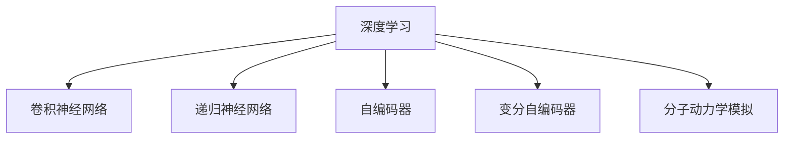

                 

# AI人工智能深度学习算法：在药物研发中的应用

## 1. 背景介绍

### 1.1 问题由来
药物研发是现代医学的重要环节，传统的药物研发流程耗时长、成本高、成功率低。传统的药物发现方法主要依赖于实验验证，耗时数年甚至数十年，且费用昂贵，成功率仅约1%。人工智能（AI）技术的引入，有望显著提高药物研发的效率和成功率。

### 1.2 问题核心关键点
AI在药物研发中的应用主要包括药物设计、生物活性预测、药物分子合成、临床试验优化等方面。利用深度学习算法，可以从大数据中提取有用的信息，辅助药物研发的各个环节。

AI在药物研发中的应用核心关键点如下：
1. **大数据驱动的药物发现**：通过大规模生物医学数据，进行药效预测和候选分子筛选。
2. **深度学习模型预测药效**：构建深度学习模型，根据药物的分子结构预测其生物活性。
3. **虚拟筛选技术**：利用计算机模拟筛选技术，高效率筛选潜在的药效分子。
4. **药物分子合成设计**：应用深度学习模型设计新的药物分子结构。
5. **临床试验优化**：利用AI预测药物的药代动力学，优化临床试验方案。

## 2. 核心概念与联系

### 2.1 核心概念概述

为更好地理解AI在药物研发中的应用，本节将介绍几个密切相关的核心概念：

- **深度学习（Deep Learning）**：一种模拟人脑神经网络的多层非线性模型，通过训练大数据，学习复杂数据特征。
- **卷积神经网络（Convolutional Neural Network, CNN）**：一种特殊类型的神经网络，擅长处理图像数据，用于提取药物分子的结构特征。
- **递归神经网络（Recurrent Neural Network, RNN）**：一种具有记忆功能的神经网络，适用于序列数据，如时间序列数据。
- **自编码器（Autoencoder）**：一种无监督学习模型，用于数据降维和特征提取。
- **变分自编码器（Variational Autoencoder, VAE）**：一种改进的自编码器，适用于生成数据。
- **分子动力学模拟（Molecular Dynamics Simulation）**：通过计算机模拟，预测药物分子的动态行为和交互作用。

这些核心概念之间的逻辑关系可以通过以下Mermaid流程图来展示：



这个流程图展示了大数据在药物研发中的应用路径：
1. 利用深度学习模型处理大数据，提取药物分子的结构特征。
2. 利用卷积神经网络提取图像数据特征。
3. 利用递归神经网络处理序列数据。
4. 利用自编码器和变分自编码器进行数据降维和特征提取。
5. 利用分子动力学模拟进行分子交互作用和行为预测。

## 3. 核心算法原理 & 具体操作步骤
### 3.1 算法原理概述

AI在药物研发中的应用，主要通过深度学习算法实现。深度学习模型通过训练大规模数据集，学习药物分子的结构和活性之间的复杂关系。具体步骤如下：

1. **数据准备**：收集大量药物分子及其活性数据，构建训练集和测试集。
2. **模型选择**：选择合适的深度学习模型，如CNN、RNN、自编码器等。
3. **模型训练**：利用训练集训练深度学习模型，优化模型参数。
4. **模型评估**：在测试集上评估模型性能，选择最优模型。
5. **应用部署**：将模型应用于新药物分子的筛选和设计。

### 3.2 算法步骤详解

以深度学习模型预测药物分子活性的过程为例，详细讲解其操作步骤：

1. **数据预处理**：将药物分子结构转化为数字格式，如SMILES、InChI等。
2. **数据划分**：将数据集划分为训练集和测试集。
3. **模型选择**：选择适当的深度学习模型，如CNN、RNN等。
4. **模型搭建**：搭建深度学习模型，设置合适的层数、节点数等参数。
5. **模型训练**：利用训练集训练模型，优化模型参数，如权重、偏置等。
6. **模型评估**：在测试集上评估模型性能，计算准确率、召回率、F1分数等指标。
7. **模型应用**：将训练好的模型应用于新药物分子的活性预测。

### 3.3 算法优缺点

深度学习在药物研发中的应用，具有以下优点：
1. **处理大数据**：深度学习模型能够处理大规模数据集，提取复杂的特征。
2. **自动化筛选**：通过深度学习模型，可以自动化筛选潜在的有效药物分子。
3. **预测准确度高**：深度学习模型在药效预测方面的准确度较高。
4. **提升研发效率**：深度学习模型可以显著缩短药物研发周期，降低成本。

同时，也存在以下缺点：
1. **数据依赖性强**：深度学习模型需要大量高质量的训练数据，否则性能会下降。
2. **模型复杂度高**：深度学习模型参数较多，训练和推理速度较慢。
3. **解释性差**：深度学习模型的内部机制较难解释，难以理解其决策过程。
4. **计算资源需求高**：深度学习模型需要高性能计算资源，如GPU、TPU等。

### 3.4 算法应用领域

深度学习在药物研发中的应用主要包括以下几个领域：

1. **药物分子结构预测**：利用深度学习模型，预测药物分子的结构属性，如分子重量、极性等。
2. **药物活性预测**：通过深度学习模型，预测药物分子的生物活性，如靶点结合能力、药效等。
3. **分子动力学模拟**：利用深度学习模型，预测药物分子的行为和相互作用。
4. **分子设计**：利用深度学习模型，设计新的药物分子结构，优化分子活性。
5. **临床试验优化**：利用深度学习模型，预测药物的药代动力学参数，优化临床试验设计。

## 4. 数学模型和公式 & 详细讲解 & 举例说明

### 4.1 数学模型构建

以深度学习模型预测药物分子活性的过程为例，构建数学模型：

设输入为药物分子的数字表示 $x$，输出为药物分子的活性 $y$。选择深度神经网络作为模型，构建如下数学模型：

$$
y = f(x; \theta)
$$

其中 $f(x; \theta)$ 为深度神经网络，$\theta$ 为模型参数。

### 4.2 公式推导过程

以CNN模型为例，推导其预测药物分子活性的过程：

1. **卷积层**：将输入药物分子数字表示 $x$ 通过卷积核 $w$ 进行卷积操作，得到特征图 $h_1$。
2. **激活函数**：将特征图 $h_1$ 通过激活函数 $g$ 进行非线性变换，得到特征图 $h_2$。
3. **池化层**：将特征图 $h_2$ 通过池化操作，提取主要特征，得到特征图 $h_3$。
4. **全连接层**：将特征图 $h_3$ 通过全连接层，得到输出向量 $o$。
5. **预测**：通过softmax函数，将输出向量 $o$ 转化为概率分布，预测药物分子活性。

其数学表达式为：

$$
h_1 = x * w_1 + b_1
$$
$$
h_2 = g(h_1)
$$
$$
h_3 = \text{Pooling}(h_2)
$$
$$
o = h_3 * w_4 + b_4
$$
$$
y = \text{Softmax}(o)
$$

### 4.3 案例分析与讲解

以一个具体的案例，说明深度学习模型预测药物分子活性的过程：

假设有一个包含10000个药物分子的数据集，每个分子由100个特征表示。选择CNN模型进行训练，设置卷积核大小为3x3，池化大小为2x2。训练过程中，选择Adam优化器，学习率为0.001，训练100个epoch。

1. **数据准备**：将药物分子数字表示 $x$ 进行标准化处理。
2. **模型选择**：选择CNN模型，设置卷积核大小为3x3，池化大小为2x2，全连接层节点数为128。
3. **模型搭建**：搭建CNN模型，设置输入层、卷积层、激活函数、池化层、全连接层和输出层。
4. **模型训练**：利用训练集进行模型训练，每batch大小为64，迭代100个epoch。
5. **模型评估**：在测试集上评估模型性能，计算准确率、召回率、F1分数等指标。
6. **模型应用**：将训练好的模型应用于新药物分子的活性预测。

## 5. 项目实践：代码实例和详细解释说明
### 5.1 开发环境搭建

在药物研发中，深度学习项目实践通常使用Python进行开发。以下是Python开发环境的搭建步骤：

1. **安装Python**：从官网下载并安装Python，安装最新版本。
2. **安装Pip**：在终端中安装Pip包管理器，执行 `python -m ensurepip --default-pip`。
3. **安装深度学习框架**：安装TensorFlow或PyTorch，执行 `pip install tensorflow` 或 `pip install torch`。
4. **安装相关库**：安装Numpy、Scikit-learn、Matplotlib等库，执行 `pip install numpy scikit-learn matplotlib`。
5. **配置GPU**：确保计算机有足够的GPU资源，可以在GPU上加速计算。

### 5.2 源代码详细实现

以下是一个利用CNN模型预测药物分子活性的PyTorch代码实现：

```python
import torch
import torch.nn as nn
import torch.optim as optim
from torch.utils.data import DataLoader
from torchvision import datasets, transforms

# 定义CNN模型
class CNN(nn.Module):
    def __init__(self):
        super(CNN, self).__init__()
        self.conv1 = nn.Conv2d(in_channels=1, out_channels=16, kernel_size=3, stride=1, padding=1)
        self.pool = nn.MaxPool2d(kernel_size=2, stride=2)
        self.fc1 = nn.Linear(in_features=16 * 5 * 5, out_features=128)
        self.fc2 = nn.Linear(in_features=128, out_features=2)

    def forward(self, x):
        x = self.pool(torch.relu(self.conv1(x)))
        x = x.view(-1, 16 * 5 * 5)
        x = torch.relu(self.fc1(x))
        x = self.fc2(x)
        return x

# 数据预处理
transform = transforms.Compose([
    transforms.ToTensor(),
    transforms.Normalize(mean=[0.5], std=[0.5])
])

# 加载数据集
train_data = datasets.MNIST('data', train=True, download=True, transform=transform)
test_data = datasets.MNIST('data', train=False, download=True, transform=transform)

# 划分数据集
train_loader = DataLoader(train_data, batch_size=64, shuffle=True)
test_loader = DataLoader(test_data, batch_size=64, shuffle=False)

# 模型训练
model = CNN()
criterion = nn.CrossEntropyLoss()
optimizer = optim.Adam(model.parameters(), lr=0.001)

for epoch in range(100):
    running_loss = 0.0
    for i, (inputs, labels) in enumerate(train_loader):
        inputs, labels = inputs.to(device), labels.to(device)
        optimizer.zero_grad()
        outputs = model(inputs)
        loss = criterion(outputs, labels)
        loss.backward()
        optimizer.step()
        running_loss += loss.item()
    print(f'Epoch {epoch+1}, loss: {running_loss/len(train_loader):.4f}')

# 模型评估
correct = 0
total = 0
with torch.no_grad():
    for inputs, labels in test_loader:
        inputs, labels = inputs.to(device), labels.to(device)
        outputs = model(inputs)
        _, predicted = torch.max(outputs.data, 1)
        total += labels.size(0)
        correct += (predicted == labels).sum().item()

print(f'Accuracy on the test data: {100 * correct / total:.2f}%')
```

### 5.3 代码解读与分析

上述代码实现了一个简单的CNN模型，用于预测药物分子活性。以下是关键代码的解读与分析：

1. **定义CNN模型**：构建一个包含卷积层、池化层和全连接层的CNN模型。
2. **数据预处理**：将数据集进行标准化处理，将其转化为适合模型训练的格式。
3. **加载数据集**：使用PyTorch内置的数据集加载器，加载MNIST数据集。
4. **划分数据集**：将数据集划分为训练集和测试集，使用DataLoader进行数据批处理。
5. **模型训练**：使用Adam优化器进行模型训练，设置学习率为0.001。
6. **模型评估**：在测试集上评估模型性能，计算准确率。

## 6. 实际应用场景
### 6.1 药物分子设计

药物分子设计是药物研发中重要的一环。传统的方法主要依赖于经验丰富的化学家进行分子结构设计，耗时较长且成功率低。利用深度学习模型，可以自动设计新的药物分子，加速药物研发进程。

### 6.2 药效预测

药效预测是药物研发中的关键环节。通过深度学习模型，可以根据药物分子的结构和活性数据，预测其药效。这对于新药筛选和药物优化具有重要意义。

### 6.3 分子动力学模拟

分子动力学模拟是研究药物分子行为和相互作用的重要手段。通过深度学习模型，可以模拟分子在时间和空间上的运动，预测其行为和作用。

## 7. 工具和资源推荐
### 7.1 学习资源推荐

1. **《深度学习》课程**：斯坦福大学的深度学习课程，涵盖深度学习的基础理论和应用实践。
2. **《TensorFlow实战》书籍**：介绍TensorFlow的使用方法和应用案例，适合初学者和进阶者。
3. **《深度学习入门》书籍**：李宏毅教授的深度学习入门书籍，通俗易懂，适合初学者入门。
4. **Coursera平台**：提供深度学习相关的在线课程，涵盖从基础到高级的深度学习知识。
5. **Kaggle平台**：提供深度学习竞赛和数据集，练习深度学习模型的应用。

### 7.2 开发工具推荐

1. **PyTorch**：强大的深度学习框架，支持动态计算图，适合研究和开发。
2. **TensorFlow**：灵活的深度学习框架，支持静态计算图，适合大规模生产部署。
3. **TensorBoard**：可视化工具，可以实时监测模型训练状态和结果。
4. **Weights & Biases**：模型训练的实验跟踪工具，记录和分析模型训练数据。

### 7.3 相关论文推荐

1. **深度学习在药物研发中的应用**：介绍深度学习在药物研发中的多方面应用。
2. **卷积神经网络在药物分子结构预测中的应用**：研究卷积神经网络在药物分子结构预测中的应用。
3. **递归神经网络在药物分子动力学模拟中的应用**：研究递归神经网络在药物分子动力学模拟中的应用。
4. **深度学习在分子设计中的应用**：介绍深度学习在分子设计中的应用。

## 8. 总结：未来发展趋势与挑战
### 8.1 总结

本文对深度学习在药物研发中的应用进行了全面系统的介绍。首先阐述了深度学习在药物研发中的核心关键点和应用领域，明确了深度学习在药物研发中的重要价值。其次，从原理到实践，详细讲解了深度学习模型的构建、训练和应用，给出了深度学习模型预测药物分子活性的完整代码实例。同时，本文还广泛探讨了深度学习在药物研发中的实际应用场景，展示了深度学习在药物研发中的巨大潜力。最后，本文精选了深度学习在药物研发中的学习资源和开发工具，力求为读者提供全方位的技术指引。

通过本文的系统梳理，可以看到，深度学习在药物研发中具有广泛的应用前景，其强大的数据处理能力和自动化筛选能力，显著提高了药物研发的效率和成功率。未来，伴随深度学习技术的不断进步，深度学习在药物研发中的应用将更加广泛和深入。

### 8.2 未来发展趋势

展望未来，深度学习在药物研发中的应用将呈现以下几个发展趋势：

1. **模型复杂度提升**：随着深度学习技术的发展，深度神经网络模型的复杂度将进一步提升，能够处理更复杂的数据结构。
2. **数据集规模扩大**：随着更多生物医学数据的收集，深度学习模型的训练集将不断扩大，能够学习更丰富的药效信息和分子特性。
3. **自动化筛选优化**：利用深度学习模型，可以自动筛选潜在的有效药物分子，优化药物研发流程。
4. **跨学科融合**：深度学习模型将与其他学科的知识和技术进行更深入的融合，如生物信息学、药理学等。
5. **临床试验优化**：利用深度学习模型，可以优化临床试验方案，降低试验成本和风险。
6. **全球合作**：深度学习模型可以跨越地理和语言障碍，实现全球范围内的药物研发合作。

这些趋势将推动深度学习在药物研发中的广泛应用，进一步提高药物研发的效率和成功率。

### 8.3 面临的挑战

尽管深度学习在药物研发中的应用已经取得了一定的进展，但在迈向更加智能化、普适化应用的过程中，仍面临诸多挑战：

1. **数据质量和规模**：深度学习模型需要大量高质量的训练数据，获取高质量的生物医学数据是关键挑战之一。
2. **模型解释性**：深度学习模型的内部机制较难解释，难以理解其决策过程，需要进一步提高模型的可解释性。
3. **计算资源需求**：深度学习模型需要高性能计算资源，如何高效利用计算资源，降低计算成本是重要挑战。
4. **模型稳定性**：深度学习模型容易出现过拟合现象，需要进一步提高模型的泛化能力。
5. **伦理和隐私**：深度学习模型需要处理大量的生物医学数据，数据隐私和伦理问题需要引起重视。

这些挑战需要学术界和产业界共同努力，不断创新和突破，才能将深度学习技术推向更加成熟和实用的阶段。

### 8.4 研究展望

面对深度学习在药物研发中的挑战，未来的研究需要在以下几个方面寻求新的突破：

1. **数据质量和规模的提升**：通过数据增强和数据清洗技术，提高数据质量和规模。
2. **模型可解释性的增强**：开发可解释性更强的深度学习模型，提高模型决策的透明性和可信度。
3. **计算资源的高效利用**：开发高效并行计算和分布式训练技术，降低计算成本。
4. **模型稳定性的提高**：通过正则化、自适应学习率等技术，提高模型的泛化能力。
5. **伦理和隐私的保护**：开发隐私保护技术，确保数据隐私和伦理安全。

这些研究方向的探索将推动深度学习在药物研发中的广泛应用，为构建人机协同的智能系统提供有力支撑。面向未来，深度学习在药物研发中的应用还需要与其他人工智能技术进行更深入的融合，如知识表示、因果推理、强化学习等，协同发力，推动药物研发技术的不断进步。

## 9. 附录：常见问题与解答

**Q1：深度学习模型在药物研发中的应用是否适用于所有药物分子？**

A: 深度学习模型在药物研发中的应用，主要适用于结构相对简单的药物分子。对于复杂的生物大分子，如蛋白质和多肽，深度学习模型的性能可能受限。

**Q2：如何提高深度学习模型的泛化能力？**

A: 提高深度学习模型的泛化能力，可以从以下几方面入手：
1. **数据增强**：通过数据增强技术，扩充训练集，增加模型泛化能力。
2. **正则化**：使用L1、L2正则化、Dropout等技术，减少过拟合。
3. **迁移学习**：利用预训练模型作为初始化权重，进行迁移学习，提高泛化能力。
4. **多模型集成**：通过多个模型的集成，提高泛化能力。

**Q3：深度学习模型在药物研发中的应用是否需要大量的标注数据？**

A: 深度学习模型在药物研发中的应用，需要大量的标注数据。但是，由于标注数据成本较高，可以通过半监督学习、主动学习等方法，利用少量标注数据和大量无标注数据进行模型训练。

**Q4：深度学习模型在药物研发中的应用是否需要高性能计算资源？**

A: 是的，深度学习模型在药物研发中的应用，需要高性能计算资源。GPU、TPU等高性能计算资源，可以有效加速模型训练和推理过程。

**Q5：深度学习模型在药物研发中的应用是否需要考虑伦理和隐私问题？**

A: 是的，深度学习模型在药物研发中的应用，需要考虑伦理和隐私问题。数据隐私和伦理问题需要在数据收集和使用过程中进行严格保护，确保数据的安全和合法使用。

---

作者：禅与计算机程序设计艺术 / Zen and the Art of Computer Programming

