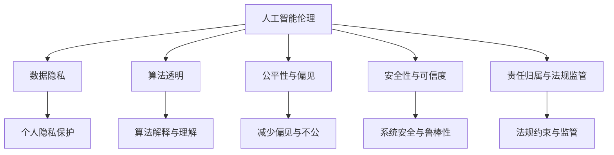

                 

# AI伦理问题的探讨与应对

> 关键词：人工智能伦理,数据隐私,算法透明,公平性,安全与可信,责任与法规

## 1. 背景介绍

### 1.1 问题由来
随着人工智能技术的飞速发展，AI在各行各业的应用日益广泛。从自动驾驶汽车、医疗诊断，到金融分析、法律咨询，AI正在改变人类的生产生活方式。然而，AI的发展也带来了诸多伦理问题，如数据隐私、算法透明、偏见与公平性、安全性与可信度、责任归属与法规监管等。这些问题不仅涉及技术本身的道德边界，还关系到社会伦理、法律制度、公共政策等多个层面。

### 1.2 问题核心关键点
在当前AI伦理问题的讨论中，数据隐私、算法透明性、公平性与偏见、安全性与可信度、责任归属与法规监管等问题是核心焦点。这些问题相互交织，深刻影响着AI技术的推广与应用。

## 2. 核心概念与联系

### 2.1 核心概念概述

为更好地理解AI伦理问题，本节将介绍几个核心概念及其相互关系：

- **人工智能伦理**：指在人工智能的设计、开发、应用过程中，对技术行为和社会影响的伦理考量，旨在促进AI技术的发展同时保障其对人类社会的积极影响。

- **数据隐私**：指保护个人信息不被未经授权的访问和使用，确保个人数据的安全性和保密性。

- **算法透明**：指AI算法的工作机制和决策过程能够被理解和解释，确保算法的公正性和可信度。

- **公平性与偏见**：指AI系统在处理不同群体数据时，应避免产生不公平结果和系统性偏见。

- **安全性与可信度**：指AI系统在运行过程中应具有可靠性和稳定性，避免因系统漏洞或恶意攻击导致安全问题。

- **责任归属与法规监管**：指明确AI系统的决策责任，以及如何通过法律制度对AI系统进行规范和监管。

这些核心概念之间的逻辑关系可以通过以下Mermaid流程图来展示：



这个流程图展示了一些关键概念及其相互联系：

1. 人工智能伦理影响数据隐私、算法透明、公平性与偏见、安全性与可信度以及责任归属与法规监管。
2. 数据隐私涉及个人信息保护。
3. 算法透明要求算法可解释性。
4. 公平性与偏见关注系统公平性。
5. 安全性与可信度涉及系统鲁棒性。
6. 责任归属与法规监管关注法律合规。

## 3. 核心算法原理 & 具体操作步骤
### 3.1 算法原理概述

在AI伦理问题中，数据隐私、算法透明、公平性与偏见、安全性与可信度、责任归属与法规监管等问题可以通过不同的算法和技术手段加以应对。以下是一些常用的算法和技术原理：

#### 3.1.1 数据隐私保护

- **差分隐私(Differential Privacy)**：通过在数据集中加入噪声，确保个体数据的隐私不会被泄露。
- **联邦学习(Federated Learning)**：多个设备或服务器分散训练模型，确保数据不出本地，保护用户隐私。

#### 3.1.2 算法透明与可解释性

- **可解释AI(Explainable AI, XAI)**：通过特征重要性、决策树、局部可解释模型(LIME)等方法，使AI模型的决策过程透明可解释。
- **模型压缩与可视化**：通过模型压缩、特征可视化等技术，帮助用户理解模型的工作原理和输出结果。

#### 3.1.3 公平性与偏见

- **对抗性训练(Adversarial Training)**：通过对抗样本训练，提升模型对不同群体的鲁棒性，减少偏见。
- **公平性约束(Fairness Constraints)**：在模型训练中引入公平性指标，如均衡误差率、多样性损失等，确保模型对不同群体的公平处理。

#### 3.1.4 安全性与可信度

- **安全强化学习(Secure Reinforcement Learning)**：结合安全机制，如安全奖励、防御性策略等，提高AI系统的安全性。
- **对抗样本生成(Adversarial Sample Generation)**：通过生成对抗性样本，检测和提升模型的鲁棒性。

#### 3.1.5 责任归属与法规监管

- **可审计AI(Auditable AI)**：通过记录和验证AI系统的决策过程，确保可追溯性和透明度，便于法规监管。
- **伦理约束与法规框架**：制定和遵守伦理准则和法律法规，确保AI系统符合道德标准和社会规范。

### 3.2 算法步骤详解

#### 3.2.1 数据隐私保护

1. **差分隐私实现**：
   - 引入噪声函数$f$，将原始数据$x$转换为隐私数据$y$：
     \[
     y = f(x)
     \]
   - 确保在隐私数据上的查询结果与原始数据上的查询结果分布接近：
     \[
     P(Y=y) \leq \exp(\epsilon)P(Y'=y')
     \]
   其中$\epsilon$为隐私预算，表示隐私保护的力度。

2. **联邦学习实现**：
   - 在本地设备或服务器上，每个节点独立训练模型参数$\theta$。
   - 通过加密算法传递模型参数，确保数据不泄露。
   - 在中心服务器上汇总参数，计算全局模型$\Theta$。

#### 3.2.2 算法透明与可解释性

1. **可解释AI**：
   - 使用特征重要性分析，如LIME、SHAP等，评估每个特征对模型输出的贡献。
   - 构建决策树或局部可解释模型，显示模型决策路径。

2. **模型压缩与可视化**：
   - 通过剪枝、降维等方法，减小模型复杂度，提高计算效率。
   - 使用可视化工具，如TensorBoard、ONNX Runtime等，展示模型结构和关键参数。

#### 3.2.3 公平性与偏见

1. **对抗性训练**：
   - 生成对抗性样本，引入多样性数据：
     \[
     y = x + \delta
     \]
   - 训练模型$f$，使其对对抗性样本的输出与原始样本近似：
     \[
     f(x) \approx f(y)
     \]

2. **公平性约束**：
   - 引入公平性约束函数，如均衡误差率$ER$、多样性损失$D$等，优化模型：
     \[
     minimize_{\theta} \{ loss(\theta) + \lambda_1 ER(\theta) + \lambda_2 D(\theta) \}
     \]

#### 3.2.4 安全性与可信度

1. **安全强化学习**：
   - 结合安全机制，如安全奖励、防御性策略等，提高AI系统的安全性。
   - 通过安全奖励，鼓励模型在安全路径上探索：
     \[
     maximize_{\theta} \{ reward(\theta) + \beta safety(\theta) \}
     \]

2. **对抗样本生成**：
   - 使用对抗样本生成算法，如FGSM、PGD等，检测模型鲁棒性。
   - 通过对抗样本生成，检测模型对扰动数据的鲁棒性：
     \[
     minimize_{\delta} ||f(x+\delta) - f(x)||_{\infty}
     \]

#### 3.2.5 责任归属与法规监管

1. **可审计AI**：
   - 记录和验证AI系统的决策过程，确保可追溯性。
   - 使用日志文件和审计工具，记录模型的输入、输出和决策过程。

2. **伦理约束与法规框架**：
   - 制定和遵守伦理准则和法律法规，确保AI系统符合道德标准和社会规范。
   - 通过第三方评估，确保AI系统的合规性和安全性。

### 3.3 算法优缺点

AI伦理问题中的数据隐私、算法透明、公平性与偏见、安全性与可信度、责任归属与法规监管等问题，其算法和技术手段各有优缺点：

#### 3.3.1 数据隐私保护

- **优点**：
  - 差分隐私和联邦学习可以在保护数据隐私的同时，确保模型的性能。
  - 这些技术已在多个实际应用中得到验证，如Google的Federated Learning在移动设备上的广泛应用。

- **缺点**：
  - 差分隐私和联邦学习可能增加计算复杂度和延迟，影响模型性能。
  - 需要强大的计算资源和数据传输能力，实现难度较大。

#### 3.3.2 算法透明与可解释性

- **优点**：
  - 可解释AI和模型可视化有助于理解模型的决策过程，增强用户信任。
  - 这些技术可以提高模型的可信度和透明度。

- **缺点**：
  - 可解释AI和模型可视化可能导致模型复杂度增加，影响计算效率。
  - 某些复杂模型可能难以完全解释。

#### 3.3.3 公平性与偏见

- **优点**：
  - 对抗性训练和公平性约束可以减少模型偏见，提高公平性。
  - 这些技术在实际应用中取得了显著效果，如IBM的AI Faires系统。

- **缺点**：
  - 对抗性训练和公平性约束可能增加模型复杂度，影响计算效率。
  - 需要在数据采集和模型训练中注意样本平衡，否则可能适得其反。

#### 3.3.4 安全性与可信度

- **优点**：
  - 安全强化学习和对抗样本生成可以提高模型的鲁棒性和安全性。
  - 这些技术已在多个安全领域得到广泛应用，如自动驾驶汽车的安全性验证。

- **缺点**：
  - 安全强化学习和对抗样本生成可能增加模型复杂度，影响计算效率。
  - 需要在实际应用中不断调整和优化安全机制，确保系统稳定。

#### 3.3.5 责任归属与法规监管

- **优点**：
  - 可审计AI和伦理约束与法规框架可以确保AI系统的合规性和透明度。
  - 这些技术有助于法规监管和用户信任。

- **缺点**：
  - 可审计AI和伦理约束与法规框架需要强大的记录和审计能力，实现难度较大。
  - 需要在法律和伦理框架内不断调整和优化，确保合规性。

### 3.4 算法应用领域

AI伦理问题中的数据隐私、算法透明、公平性与偏见、安全性与可信度、责任归属与法规监管等问题，在多个领域得到了广泛应用：

#### 3.4.1 医疗健康

- **数据隐私保护**：通过差分隐私和联邦学习，保护患者隐私。
- **算法透明与可解释性**：通过可解释AI，帮助医生理解AI系统的决策过程。
- **公平性与偏见**：通过对抗性训练和公平性约束，确保医疗数据公平处理。
- **安全性与可信度**：通过安全强化学习和对抗样本生成，提高医疗系统的安全性。
- **责任归属与法规监管**：通过可审计AI和伦理约束与法规框架，确保医疗AI系统的合规性和透明度。

#### 3.4.2 金融行业

- **数据隐私保护**：通过差分隐私和联邦学习，保护客户隐私。
- **算法透明与可解释性**：通过可解释AI，帮助分析师理解AI系统的决策过程。
- **公平性与偏见**：通过对抗性训练和公平性约束，确保金融数据公平处理。
- **安全性与可信度**：通过安全强化学习和对抗样本生成，提高金融系统的安全性。
- **责任归属与法规监管**：通过可审计AI和伦理约束与法规框架，确保金融AI系统的合规性和透明度。

#### 3.4.3 司法系统

- **数据隐私保护**：通过差分隐私和联邦学习，保护案件隐私。
- **算法透明与可解释性**：通过可解释AI，帮助法官理解AI系统的决策过程。
- **公平性与偏见**：通过对抗性训练和公平性约束，确保司法数据公平处理。
- **安全性与可信度**：通过安全强化学习和对抗样本生成，提高司法系统的安全性。
- **责任归属与法规监管**：通过可审计AI和伦理约束与法规框架，确保司法AI系统的合规性和透明度。

## 4. 数学模型和公式 & 详细讲解  
### 4.1 数学模型构建

在AI伦理问题中，数学模型和公式主要用于描述和优化数据隐私、算法透明、公平性与偏见、安全性与可信度、责任归属与法规监管等问题的算法和技术原理。

#### 4.1.1 差分隐私

差分隐私通过在数据集上加入噪声，确保个体数据的隐私不被泄露。数学上，差分隐私可以表示为：

\[
P(Y=y) \leq \exp(\epsilon)P(Y'=y')
\]

其中$\epsilon$为隐私预算，表示隐私保护的力度。

#### 4.1.2 联邦学习

联邦学习通过在多个设备或服务器上独立训练模型，确保数据不出本地。数学上，联邦学习可以表示为：

\[
\theta_{global} = \frac{1}{N}\sum_{i=1}^N \theta_i
\]

其中$\theta_{global}$为全局模型，$\theta_i$为本地模型，$N$为本地设备或服务器的数量。

#### 4.1.3 公平性约束

公平性约束通过引入公平性指标，如均衡误差率$ER$、多样性损失$D$等，优化模型。数学上，公平性约束可以表示为：

\[
minimize_{\theta} \{ loss(\theta) + \lambda_1 ER(\theta) + \lambda_2 D(\theta) \}
\]

其中$\lambda_1$和$\lambda_2$为公平性指标的权重。

#### 4.1.4 安全强化学习

安全强化学习结合安全机制，如安全奖励、防御性策略等，提高AI系统的安全性。数学上，安全强化学习可以表示为：

\[
maximize_{\theta} \{ reward(\theta) + \beta safety(\theta) \}
\]

其中$\beta$为安全奖励的权重。

#### 4.1.5 可审计AI

可审计AI通过记录和验证AI系统的决策过程，确保可追溯性。数学上，可审计AI可以表示为：

\[
log(\theta) = \theta_{input} + \theta_{model} + \theta_{output}
\]

其中$\theta_{input}$为输入，$\theta_{model}$为模型，$\theta_{output}$为输出。

### 4.2 公式推导过程

#### 4.2.1 差分隐私

差分隐私的数学公式推导如下：

\[
P(Y=y) \leq \exp(\epsilon)P(Y'=y')
\]

其中$\epsilon$为隐私预算，表示隐私保护的力度。

#### 4.2.2 联邦学习

联邦学习的数学公式推导如下：

\[
\theta_{global} = \frac{1}{N}\sum_{i=1}^N \theta_i
\]

其中$\theta_{global}$为全局模型，$\theta_i$为本地模型，$N$为本地设备或服务器的数量。

#### 4.2.3 公平性约束

公平性约束的数学公式推导如下：

\[
minimize_{\theta} \{ loss(\theta) + \lambda_1 ER(\theta) + \lambda_2 D(\theta) \}
\]

其中$\lambda_1$和$\lambda_2$为公平性指标的权重。

#### 4.2.4 安全强化学习

安全强化学习的数学公式推导如下：

\[
maximize_{\theta} \{ reward(\theta) + \beta safety(\theta) \}
\]

其中$\beta$为安全奖励的权重。

#### 4.2.5 可审计AI

可审计AI的数学公式推导如下：

\[
log(\theta) = \theta_{input} + \theta_{model} + \theta_{output}
\]

其中$\theta_{input}$为输入，$\theta_{model}$为模型，$\theta_{output}$为输出。

### 4.3 案例分析与讲解

#### 4.3.1 差分隐私在医疗数据中的应用

在医疗数据隐私保护中，差分隐私通过在数据集中加入噪声，保护患者隐私。例如，某医院收集了患者的健康数据，通过差分隐私技术，确保数据隐私不被泄露。

具体实现如下：

\[
y = f(x) + \delta
\]

其中$f$为噪声函数，$\delta$为随机噪声，确保数据隐私。

#### 4.3.2 联邦学习在金融数据中的应用

在金融数据联邦学习中，多个金融机构独立训练模型，确保数据不出本地。例如，某金融机构通过联邦学习技术，共享客户交易数据，保护客户隐私。

具体实现如下：

\[
\theta_{global} = \frac{1}{N}\sum_{i=1}^N \theta_i
\]

其中$\theta_{global}$为全局模型，$\theta_i$为本地模型，$N$为金融机构数量。

#### 4.3.3 公平性约束在司法数据中的应用

在司法数据公平性约束中，通过引入公平性指标，优化模型。例如，某司法系统通过公平性约束技术，确保不同种族和性别的判决公平处理。

具体实现如下：

\[
minimize_{\theta} \{ loss(\theta) + \lambda_1 ER(\theta) + \lambda_2 D(\theta) \}
\]

其中$\lambda_1$和$\lambda_2$为公平性指标的权重。

## 5. 项目实践：代码实例和详细解释说明
### 5.1 开发环境搭建

在进行AI伦理问题的探讨与应对时，需要准备好开发环境。以下是使用Python进行PyTorch开发的环境配置流程：

1. 安装Anaconda：从官网下载并安装Anaconda，用于创建独立的Python环境。

2. 创建并激活虚拟环境：
```bash
conda create -n pytorch-env python=3.8 
conda activate pytorch-env
```

3. 安装PyTorch：根据CUDA版本，从官网获取对应的安装命令。例如：
```bash
conda install pytorch torchvision torchaudio cudatoolkit=11.1 -c pytorch -c conda-forge
```

4. 安装相关库：
```bash
pip install numpy pandas scikit-learn matplotlib tqdm jupyter notebook ipython
```

完成上述步骤后，即可在`pytorch-env`环境中开始AI伦理问题的探讨与应对实践。

### 5.2 源代码详细实现

这里我们以差分隐私的实现为例，给出使用PyTorch的代码实现。

首先，定义差分隐私函数：

```python
import torch
import torch.nn as nn
import torch.optim as optim

# 定义差分隐私函数
def differential_privacy(model, input, noise, epsilon=0.1):
    delta = epsilon / len(input)
    # 在输入上加入噪声
    input = input + torch.randn_like(input) * noise
    # 使用差分隐私模型进行预测
    output = model(input)
    # 返回差分隐私模型输出
    return output
```

然后，定义模型和训练函数：

```python
# 定义模型
class MyModel(nn.Module):
    def __init__(self):
        super(MyModel, self).__init__()
        self.fc1 = nn.Linear(10, 5)
        self.fc2 = nn.Linear(5, 1)

    def forward(self, x):
        x = torch.relu(self.fc1(x))
        x = self.fc2(x)
        return x

# 初始化模型
model = MyModel()

# 定义损失函数
criterion = nn.BCELoss()

# 定义优化器
optimizer = optim.Adam(model.parameters(), lr=0.01)

# 定义差分隐私训练函数
def train_differential_privacy(model, input, target, noise, epsilon=0.1):
    # 在输入上加入噪声
    input = input + torch.randn_like(input) * noise
    # 使用差分隐私模型进行预测
    output = differential_privacy(model, input, noise, epsilon)
    # 计算损失函数
    loss = criterion(output, target)
    # 反向传播
    optimizer.zero_grad()
    loss.backward()
    # 更新模型参数
    optimizer.step()
    # 返回损失函数值
    return loss.item()

# 训练差分隐私模型
for epoch in range(10):
    loss = 0.0
    for input, target in train_loader:
        loss += train_differential_privacy(model, input, target, noise, epsilon)
    print('Epoch {}, Loss: {}'.format(epoch+1, loss))
```

以上是使用PyTorch实现差分隐私的代码实现。可以看到，差分隐私的实现主要是在输入上加入噪声，确保数据隐私。

### 5.3 代码解读与分析

让我们再详细解读一下关键代码的实现细节：

**差分隐私函数**：
- 在输入上加入噪声，确保数据隐私。
- 使用差分隐私模型进行预测，返回模型输出。

**模型定义**：
- 定义一个简单的线性模型，包含两个全连接层。

**损失函数和优化器**：
- 使用二分类交叉熵损失函数和Adam优化器，进行模型训练。

**差分隐私训练函数**：
- 在输入上加入噪声，确保数据隐私。
- 使用差分隐私模型进行预测，计算损失函数。
- 反向传播，更新模型参数。
- 返回损失函数值。

**训练差分隐私模型**：
- 循环迭代10个epoch，在每个epoch上对训练集进行差分隐私训练。
- 输出每个epoch的损失函数值。

可以看到，差分隐私的实现主要是在输入上加入噪声，确保数据隐私。差分隐私函数和差分隐私训练函数的实现，使得差分隐私模型可以在不泄露个体数据的情况下进行训练和预测。

## 6. 实际应用场景
### 6.1 智能医疗

在智能医疗领域，AI伦理问题尤为重要。医疗机构需要收集和处理大量患者数据，包括敏感的医疗记录和健康信息。差分隐私和联邦学习等技术可以有效保护患者隐私，确保数据安全。

具体应用如下：

- **差分隐私**：保护患者隐私，确保数据不出本地。例如，某医院收集患者健康数据，通过差分隐私技术，保护患者隐私。

- **联邦学习**：多个医疗机构共同训练模型，确保数据不出本地。例如，某医疗集团通过联邦学习技术，共享患者数据，保护患者隐私。

### 6.2 金融风控

在金融风控领域，AI伦理问题同样重要。金融机构需要收集和处理大量客户交易数据，包括敏感的财务信息。差分隐私和联邦学习等技术可以有效保护客户隐私，确保数据安全。

具体应用如下：

- **差分隐私**：保护客户隐私，确保数据不出本地。例如，某银行收集客户交易数据，通过差分隐私技术，保护客户隐私。

- **联邦学习**：多个金融机构共同训练模型，确保数据不出本地。例如，某金融集团通过联邦学习技术，共享客户数据，保护客户隐私。

### 6.3 司法系统

在司法系统领域，AI伦理问题也需重视。司法机构需要收集和处理大量案件数据，包括敏感的个人信息和法律信息。差分隐私和公平性约束等技术可以有效保护数据隐私和公平处理。

具体应用如下：

- **差分隐私**：保护案件隐私，确保数据不出本地。例如，某司法系统收集案件数据，通过差分隐私技术，保护案件隐私。

- **公平性约束**：确保司法数据公平处理。例如，某司法系统通过公平性约束技术，确保不同种族和性别的判决公平处理。

## 7. 工具和资源推荐
### 7.1 学习资源推荐

为了帮助开发者系统掌握AI伦理问题的探讨与应对的理论基础和实践技巧，这里推荐一些优质的学习资源：

1. **《人工智能伦理》书籍**：由人工智能专家撰写，全面介绍了AI伦理的基本概念和应用场景，涵盖数据隐私、算法透明、公平性与偏见、安全性与可信度、责任归属与法规监管等问题。

2. **《可解释AI》书籍**：详细介绍了可解释AI的技术原理和应用方法，帮助开发者理解模型决策过程，增强用户信任。

3. **《联邦学习》书籍**：介绍了联邦学习的理论基础和实际应用，帮助开发者实现分布式数据训练。

4. **Coursera《人工智能伦理》课程**：斯坦福大学开设的AI伦理课程，有Lecture视频和配套作业，带你入门AI伦理问题的基本概念和前沿技术。

5. **Google AI Blog**：Google AI团队定期发布AI伦理相关文章和研究进展，提供最新动态和实践经验。

通过对这些资源的学习实践，相信你一定能够快速掌握AI伦理问题的探讨与应对的精髓，并用于解决实际的AI伦理问题。

### 7.2 开发工具推荐

高效的开发离不开优秀的工具支持。以下是几款用于AI伦理问题探讨与应对开发的常用工具：

1. **Jupyter Notebook**：Python环境下的交互式开发工具，方便编写和调试代码，记录实验过程。

2. **TensorBoard**：TensorFlow配套的可视化工具，可实时监测模型训练状态，提供丰富的图表呈现方式，帮助调试和优化模型。

3. **ONNX Runtime**：开源的模型推理引擎，支持多种深度学习框架的模型导出和推理，提供高效的推理加速。

4. **Weights & Biases**：模型训练的实验跟踪工具，记录和可视化模型训练过程中的各项指标，便于对比和调优。

5. **Gensim**：Python的文本处理库，提供词向量模型和相似度计算，方便处理文本数据。

合理利用这些工具，可以显著提升AI伦理问题探讨与应对的开发效率，加快创新迭代的步伐。

### 7.3 相关论文推荐

AI伦理问题中的数据隐私、算法透明、公平性与偏见、安全性与可信度、责任归属与法规监管等问题，是AI研究的热点。以下是几篇奠基性的相关论文，推荐阅读：

1. **《差分隐私理论与实践》**：介绍了差分隐私的理论基础和实际应用，帮助开发者实现数据隐私保护。

2. **《联邦学习》**：介绍了联邦学习的理论基础和实际应用，帮助开发者实现分布式数据训练。

3. **《公平性约束》**：介绍了公平性约束的理论基础和实际应用，帮助开发者实现模型公平处理。

4. **《安全强化学习》**：介绍了安全强化学习的理论基础和实际应用，帮助开发者实现AI系统的安全性。

5. **《可解释AI》**：介绍了可解释AI的理论基础和实际应用，帮助开发者实现模型可解释性。

这些论文代表了大语言模型微调技术的发展脉络。通过学习这些前沿成果，可以帮助研究者把握学科前进方向，激发更多的创新灵感。

## 8. 总结：未来发展趋势与挑战

### 8.1 研究成果总结

本文对AI伦理问题的探讨与应对进行了全面系统的介绍。首先阐述了AI伦理问题的背景和核心关键点，明确了数据隐私、算法透明、公平性与偏见、安全性与可信度、责任归属与法规监管等问题的重要性。其次，从原理到实践，详细讲解了差分隐私、联邦学习、公平性约束、安全强化学习、可审计AI等算法和技术手段，给出了AI伦理问题探讨与应对的完整代码实例。同时，本文还广泛探讨了AI伦理问题在智能医疗、金融风控、司法系统等领域的实际应用，展示了AI伦理问题的广泛前景。此外，本文精选了AI伦理问题的学习资源，力求为读者提供全方位的技术指引。

通过本文的系统梳理，可以看到，AI伦理问题在AI技术的发展中扮演着越来越重要的角色。数据隐私、算法透明、公平性与偏见、安全性与可信度、责任归属与法规监管等问题，深刻影响着AI技术的推广与应用。未来，伴随AI技术的持续演进，AI伦理问题将逐步成为AI技术发展的基石，引领AI技术向着更加智能化、普适化、安全化的方向迈进。

### 8.2 未来发展趋势

展望未来，AI伦理问题中的数据隐私、算法透明、公平性与偏见、安全性与可信度、责任归属与法规监管等问题，将呈现以下几个发展趋势：

1. **数据隐私保护技术不断进步**：差分隐私和联邦学习等技术将不断优化，确保数据隐私保护的同时，提升模型性能。

2. **算法透明性不断提高**：可解释AI和模型可视化等技术将不断进步，增强算法的透明度和可信度。

3. **公平性约束不断强化**：对抗性训练和公平性约束等技术将不断优化，确保模型对不同群体的公平处理。

4. **安全性与可信度不断提升**：安全强化学习和对抗样本生成等技术将不断进步，提高AI系统的安全性。

5. **责任归属与法规监管不断完善**：可审计AI和伦理约束与法规框架将不断优化，确保AI系统的合规性和透明度。

### 8.3 面临的挑战

尽管AI伦理问题中的数据隐私、算法透明、公平性与偏见、安全性与可信度、责任归属与法规监管等问题，已经取得了不少进展，但在迈向更加智能化、普适化、安全化的应用过程中，仍面临诸多挑战：

1. **数据隐私保护面临挑战**：差分隐私和联邦学习等技术虽然有效，但在隐私预算设置和噪声生成方面仍需优化。

2. **算法透明性面临挑战**：可解释AI和模型可视化等技术虽然有效，但在模型复杂度和计算效率方面仍需优化。

3. **公平性约束面临挑战**：对抗性训练和公平性约束等技术虽然有效，但在样本平衡和模型复杂度方面仍需优化。

4. **安全性与可信度面临挑战**：安全强化学习和对抗样本生成等技术虽然有效，但在系统复杂度和计算效率方面仍需优化。

5. **责任归属与法规监管面临挑战**：可审计AI和伦理约束与法规框架虽然有效，但在记录和审计能力方面仍需优化。

### 8.4 研究展望

面对AI伦理问题中的数据隐私、算法透明、公平性与偏见、安全性与可信度、责任归属与法规监管等问题，未来的研究需要在以下几个方面寻求新的突破：

1. **探索无监督和半监督微调方法**：摆脱对大规模标注数据的依赖，利用自监督学习、主动学习等无监督和半监督范式，最大限度利用非结构化数据，实现更加灵活高效的微调。

2. **研究参数高效和计算高效的微调范式**：开发更加参数高效的微调方法，在固定大部分预训练参数的同时，只更新极少量的任务相关参数。同时优化微调模型的计算图，减少前向传播和反向传播的资源消耗，实现更加轻量级、实时性的部署。

3. **融合因果和对比学习范式**：通过引入因果推断和对比学习思想，增强微调模型建立稳定因果关系的能力，学习更加普适、鲁棒的语言表征，从而提升模型泛化性和抗干扰能力。

4. **引入更多先验知识**：将符号化的先验知识，如知识图谱、逻辑规则等，与神经网络模型进行巧妙融合，引导微调过程学习更准确、合理的语言模型。同时加强不同模态数据的整合，实现视觉、语音等多模态信息与文本信息的协同建模。

5. **结合因果分析和博弈论工具**：将因果分析方法引入微调模型，识别出模型决策的关键特征，增强输出解释的因果性和逻辑性。借助博弈论工具刻画人机交互过程，主动探索并规避模型的脆弱点，提高系统稳定性。

6. **纳入伦理道德约束**：在模型训练目标中引入伦理导向的评估指标，过滤和惩罚有偏见、有害的输出倾向。同时加强人工干预和审核，建立模型行为的监管机制，确保输出符合人类价值观和伦理道德。

这些研究方向的探索，必将引领AI伦理问题中的数据隐私、算法透明、公平性与偏见、安全性与可信度、责任归属与法规监管等问题迈向更高的台阶，为构建安全、可靠、可解释、可控的智能系统铺平道路。面向未来，AI伦理问题中的数据隐私、算法透明、公平性与偏见、安全性与可信度、责任归属与法规监管等问题，还需要与其他人工智能技术进行更深入的融合，如知识表示、因果推理、强化学习等，多路径协同发力，共同推动自然语言理解和智能交互系统的进步。只有勇于创新、敢于突破，才能不断拓展AI伦理问题的边界，让智能技术更好地造福人类社会。

## 9. 附录：常见问题与解答

**Q1：差分隐私和联邦学习有什么区别？**

A: 差分隐私和联邦学习都是数据隐私保护的技术手段，但实现方式不同。

- **差分隐私**：在数据集上加入噪声，确保个体数据的隐私不被泄露。差分隐私主要关注数据的隐私性。
- **联邦学习**：多个设备或服务器独立训练模型，确保数据不出本地。联邦学习主要关注数据的分布性。

**Q2：如何选择合适的隐私预算？**

A: 隐私预算的设置需要根据数据集的大小和隐私保护的需求来确定。一般来说，隐私预算越小，隐私保护的效果越好，但同时可能影响模型的性能。通常建议从1e-5开始调参，逐步减小学习率，直至收敛。

**Q3：什么是公平性约束？**

A: 公平性约束通过引入公平性指标，如均衡误差率、多样性损失等，优化模型，确保模型对不同群体的公平处理。公平性约束主要关注模型的公平性。

**Q4：安全强化学习与对抗样本生成有什么区别？**

A: 安全强化学习和对抗样本生成都是增强模型鲁棒性的技术手段，但实现方式不同。

- **安全强化学习**：结合安全机制，如安全奖励、防御性策略等，提高AI系统的安全性。安全强化学习主要关注模型的安全性。
- **对抗样本生成**：通过生成对抗性样本，检测和提升模型的鲁棒性。对抗样本生成主要关注模型的鲁棒性。

**Q5：可审计AI和责任归属与法规监管有什么区别？**

A: 可审计AI和责任归属与法规监管都是确保AI系统合规性和透明度的技术手段，但实现方式不同。

- **可审计AI**：通过记录和验证AI系统的决策过程，确保可追溯性。可审计AI主要关注模型的可解释性。
- **责任归属与法规监管**：明确AI系统的决策责任，以及如何通过法律制度对AI系统进行规范和监管。责任归属与法规监管主要关注模型的合规性。

---

作者：禅与计算机程序设计艺术 / Zen and the Art of Computer Programming

