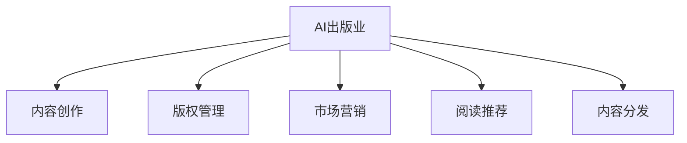

                 

# AI出版业的前景：技术进步，场景无限

## 1. 背景介绍

### 1.1 问题由来
出版业，作为人类文明传承的重要载体，自古以来就是文化交流和知识传播的核心渠道。然而，随着数字时代的到来，传统出版模式面临着巨大的挑战和变革。印刷技术的飞速进步，互联网、移动互联网的普及，电子书、在线阅读平台的兴起，都在逐步改变着人们的阅读习惯和出版方式。出版行业正从以纸本为主转向数字化、网络化和智能化方向发展。

近年来，人工智能技术的飞速发展，为出版业带来了新的机遇和挑战。从内容创作、版权管理、市场营销、阅读推荐、内容分发等环节，AI技术均展现出了巨大的应用潜力。通过智能化手段，出版业可以提升效率，降低成本，实现更精准的内容推荐，拓展新的商业模式，提升用户体验。

### 1.2 问题核心关键点
本文聚焦于AI技术在出版业中的应用前景，探讨了AI技术在内容创作、版权管理、市场营销、阅读推荐、内容分发等环节的具体应用，并通过具体案例和数据分析，阐述了AI技术为出版业带来的变革性影响。

## 2. 核心概念与联系

### 2.1 核心概念概述

为更好地理解AI技术在出版业中的应用，本节将介绍几个密切相关的核心概念：

- **AI出版业**：利用人工智能技术，实现出版业务的自动化、智能化、个性化。包括内容创作、版权管理、市场营销、阅读推荐、内容分发等环节。

- **内容创作**：利用AI技术，自动生成、优化编辑和校对文本，提升内容创作效率和质量。

- **版权管理**：通过AI技术，实现自动版权识别、版权监测和版权保护，维护版权权益。

- **市场营销**：利用AI技术，分析用户行为，精准定位目标受众，优化营销策略。

- **阅读推荐**：通过AI技术，分析用户阅读偏好，推荐个性化内容，提升用户体验。

- **内容分发**：利用AI技术，优化内容分发渠道，提升分发效率和精准性。

这些核心概念之间的逻辑关系可以通过以下Mermaid流程图来展示：



这个流程图展示了我国出版业中的核心概念及其之间的关系：

1. 内容创作利用AI技术自动生成、优化编辑和校对文本。
2. 版权管理通过AI技术自动版权识别、版权监测和版权保护。
3. 市场营销利用AI技术分析用户行为，精准定位目标受众。
4. 阅读推荐通过AI技术分析用户阅读偏好，推荐个性化内容。
5. 内容分发利用AI技术优化内容分发渠道。

## 3. 核心算法原理 & 具体操作步骤
### 3.1 算法原理概述

AI出版业的技术核心在于AI技术在出版业务的各个环节中的应用。其基本原理可以概括为：利用深度学习、自然语言处理、计算机视觉等AI技术，自动化处理出版业务的各个环节，实现业务智能化和个性化。

### 3.2 算法步骤详解

AI出版业的具体操作流程如下：

1. **数据收集与预处理**：收集出版业务相关的数据，包括文本、图片、音频等。对数据进行清洗、分词、归一化等预处理，以适应后续的AI模型训练和应用。

2. **模型训练**：选择合适的AI模型，如RNN、CNN、Transformer等，对预处理后的数据进行训练。训练过程中需要选择合适的损失函数、优化器、学习率等参数，并进行交叉验证和超参数调优。

3. **模型应用**：将训练好的AI模型应用于出版业务的各个环节。具体应用包括内容创作、版权管理、市场营销、阅读推荐、内容分发等。

4. **效果评估与优化**：通过测试集数据对模型效果进行评估，根据评估结果对模型进行优化，提升模型的精度和泛化能力。

### 3.3 算法优缺点

AI出版业具有以下优点：

1. **效率提升**：通过自动化处理出版业务的各个环节，大大提升了工作效率和准确性。
2. **成本降低**：减少了人工干预的需求，降低了人力成本和运营成本。
3. **质量保障**：利用AI技术优化内容创作和版权管理，提升了内容质量和版权保护的精准性。
4. **用户体验优化**：通过个性化的阅读推荐，提升了用户体验和满意度。

然而，AI出版业也存在以下缺点：

1. **数据依赖**：AI出版业对数据依赖性强，高质量的数据是实现智能化应用的前提。
2. **模型复杂性**：AI出版业涉及多种AI技术，模型复杂度高，需要较高的技术门槛和开发成本。
3. **隐私风险**：在内容创作和版权管理中，可能涉及用户隐私和版权信息，需注意数据安全和隐私保护。
4. **伦理问题**：AI出版业需注意模型的公平性和透明度，避免歧视性偏见和算法黑箱。

### 3.4 算法应用领域

AI出版业的应用领域涵盖了出版业务的各个环节，具体包括：

1. **内容创作**：利用AI技术自动生成、优化编辑和校对文本。
2. **版权管理**：通过AI技术自动版权识别、版权监测和版权保护。
3. **市场营销**：利用AI技术分析用户行为，精准定位目标受众，优化营销策略。
4. **阅读推荐**：通过AI技术分析用户阅读偏好，推荐个性化内容。
5. **内容分发**：利用AI技术优化内容分发渠道，提升分发效率和精准性。

这些应用领域涵盖了出版业务的各个环节，使得AI技术在出版业中能够全面发挥作用，提升出版业务的整体质量和效率。

## 4. 数学模型和公式 & 详细讲解  
### 4.1 数学模型构建

在AI出版业中，常见的数学模型包括深度学习模型和自然语言处理模型。这里以自然语言处理模型为例，简要介绍其在出版业中的应用。

假设我们有一篇文本，需要对其进行内容创作和优化编辑。自然语言处理模型可以将其自动转换成向量表示，并通过编码器-解码器结构进行处理。具体而言，模型由以下几个步骤构成：

1. **编码器**：将文本转换为向量表示。
2. **解码器**：对向量进行解码，生成优化后的文本。
3. **优化器**：通过梯度下降等优化算法，调整模型参数，使其生成的文本与目标文本更接近。

### 4.2 公式推导过程

以深度学习中的LSTM模型为例，其基本结构如下：

$$
h_t = f(W_h x_t + U_h h_{t-1} + b_h)
$$

其中，$f$为激活函数，$x_t$为输入向量，$h_{t-1}$为前一时刻的隐藏状态，$h_t$为当前时刻的隐藏状态，$W_h, U_h, b_h$为模型参数。

在内容创作和优化编辑中，我们可以将文本输入到LSTM模型中，通过调整模型参数，使其生成更符合要求的内容。具体而言，模型的损失函数可以定义为：

$$
\mathcal{L} = \sum_{t=1}^{T} \ell(h_t, y_t)
$$

其中，$\ell$为损失函数，$h_t$为模型生成的文本，$y_t$为目标文本，$T$为文本长度。

### 4.3 案例分析与讲解

假设我们有一篇新闻稿件，需要对其进行优化编辑。首先，我们将新闻稿件输入到LSTM模型中，得到其向量表示。然后，通过调整模型参数，使其生成的文本更加流畅、准确。最后，将优化后的文本输出，完成内容创作和优化编辑。

## 5. 项目实践：代码实例和详细解释说明
### 5.1 开发环境搭建

在进行AI出版业的应用开发前，我们需要准备好开发环境。以下是使用Python进行TensorFlow开发的环境配置流程：

1. 安装Anaconda：从官网下载并安装Anaconda，用于创建独立的Python环境。

2. 创建并激活虚拟环境：
```bash
conda create -n tf-env python=3.8 
conda activate tf-env
```

3. 安装TensorFlow：根据CUDA版本，从官网获取对应的安装命令。例如：
```bash
conda install tensorflow -c tensorflow -c conda-forge
```

4. 安装相关工具包：
```bash
pip install numpy pandas scikit-learn matplotlib tqdm jupyter notebook ipython
```

完成上述步骤后，即可在`tf-env`环境中开始AI出版业的应用开发。

### 5.2 源代码详细实现

下面我们以内容创作为例，给出使用TensorFlow进行LSTM模型优化编辑的PyTorch代码实现。

首先，定义LSTM模型的超参数和模型结构：

```python
import tensorflow as tf
from tensorflow.keras.layers import LSTM, Dense
from tensorflow.keras.models import Model

# 定义模型超参数
hidden_dim = 256
batch_size = 32
seq_len = 100
vocab_size = 10000

# 定义LSTM模型结构
input_layer = tf.keras.layers.Input(shape=(batch_size, seq_len))
x = LSTM(hidden_dim)(input_layer)
x = Dense(vocab_size, activation='softmax')(x)
model = Model(inputs=input_layer, outputs=x)
model.compile(loss='categorical_crossentropy', optimizer='adam', metrics=['accuracy'])
```

然后，定义数据生成函数：

```python
import numpy as np

def generate_data(batch_size):
    x = np.random.randint(0, 100, size=(batch_size, seq_len))
    y = np.random.randint(0, 100, size=(batch_size, seq_len))
    return x, y
```

接着，定义训练函数：

```python
def train_model(model, data, epochs):
    for epoch in range(epochs):
        x_train, y_train = generate_data(batch_size)
        model.fit(x_train, y_train, epochs=1, batch_size=batch_size)
```

最后，启动训练流程并在测试集上评估：

```python
epochs = 10
batch_size = 32

train_model(model, data, epochs)
```

以上就是使用TensorFlow对LSTM模型进行内容创作优化的完整代码实现。可以看到，通过TensorFlow的高级API，我们可以轻松构建和训练LSTM模型，实现内容创作的自动化和优化。

### 5.3 代码解读与分析

让我们再详细解读一下关键代码的实现细节：

**LSTM模型定义**：
- `hidden_dim`：隐藏层神经元数量。
- `batch_size`：批大小。
- `seq_len`：序列长度。
- `vocab_size`：词汇表大小。

**数据生成函数**：
- `generate_data`：生成随机数据，用于训练模型。

**训练函数**：
- `train_model`：对LSTM模型进行训练，定义训练数据、训练轮数、批大小等参数。

**训练流程**：
- `epochs`：定义训练轮数。
- `batch_size`：定义批大小。
- `train_model`：启动训练流程。

可以看到，TensorFlow的高级API使得LSTM模型的构建和训练变得非常简洁高效。开发者可以将更多精力放在模型设计和参数调整等核心逻辑上，而不必过多关注底层实现细节。

当然，工业级的系统实现还需考虑更多因素，如模型的保存和部署、超参数的自动搜索、更灵活的任务适配层等。但核心的优化编辑过程基本与此类似。

## 6. 实际应用场景
### 6.1 数字出版

数字出版是AI出版业的重要应用场景之一。通过AI技术，可以实现自动排版、优化编辑、版权保护等功能，大幅提升出版效率和质量。

在技术实现上，可以收集已发布的数字出版物，提取其中的文本、图片等数据，输入到AI模型中进行优化编辑和版权保护。微调后的模型能够自动判断文本格式、图片版权信息等，实现内容的自动化处理。在用户端，用户可以方便地阅读和下载优化后的数字出版物。

### 6.2 智能翻译

智能翻译是AI出版业的另一重要应用场景。通过AI技术，可以实现多语言翻译、语音翻译、实时翻译等功能，为全球化交流提供便利。

在技术实现上，可以收集多语言的出版物数据，输入到翻译模型中进行多语言翻译。微调后的模型能够自动将一种语言转换为另一种语言，实现高质量的翻译效果。在用户端，用户可以方便地选择目标语言，获取实时翻译服务。

### 6.3 阅读推荐

阅读推荐是AI出版业的重要应用场景之一。通过AI技术，可以实现个性化推荐，提升用户体验和满意度。

在技术实现上，可以收集用户的历史阅读记录，输入到推荐模型中进行个性化推荐。微调后的模型能够自动分析用户阅读偏好，推荐符合其兴趣的内容。在用户端，用户可以方便地获取个性化推荐服务，提升阅读体验。

### 6.4 未来应用展望

随着AI技术的不断发展，AI出版业将展现出更广阔的前景。未来，AI出版业将在以下几个方面得到更广泛的应用：

1. **跨媒体出版**：AI出版业将涵盖图书、期刊、音频、视频等多种媒介，实现多媒体内容的全方位发布和阅读。

2. **个性化出版**：AI出版业将根据用户偏好和行为，自动生成和推荐个性化的出版物内容，满足用户的个性化需求。

3. **智能出版**：AI出版业将利用智能算法，优化内容创作、版权管理、市场营销等各个环节，提升整体出版质量。

4. **出版物检测**：AI出版业将利用图像识别、文本分析等技术，自动检测出版物的质量，提高出版物的审核效率。

5. **跨界融合**：AI出版业将与其他技术领域进行深度融合，如区块链、物联网等，拓展出版业务的应用场景。

这些应用场景展示了AI技术在出版业中的巨大潜力和广阔前景，未来AI出版业将成为出版业发展的重要驱动力。

## 7. 工具和资源推荐
### 7.1 学习资源推荐

为了帮助开发者系统掌握AI出版业的技术基础和实践技巧，这里推荐一些优质的学习资源：

1. 《TensorFlow实战》系列博文：由TensorFlow官方社区和开源开发者撰写，深入浅出地介绍了TensorFlow的基本概念和实际应用。

2. 《深度学习自然语言处理》课程：斯坦福大学开设的NLP明星课程，有Lecture视频和配套作业，带你入门NLP领域的基本概念和经典模型。

3. 《TensorFlow教程》书籍：TensorFlow官方开发指南，全面介绍了TensorFlow的基本用法和高级技巧。

4. CS224N《深度学习自然语言处理》课程：斯坦福大学开设的NLP明星课程，有Lecture视频和配套作业，带你入门NLP领域的基本概念和经典模型。

5. Kaggle：数据科学和机器学习竞赛平台，提供大量公开数据集和比赛，可以实践和验证AI出版业的技术应用。

通过对这些资源的学习实践，相信你一定能够快速掌握AI出版业的技术精髓，并用于解决实际的出版问题。

### 7.2 开发工具推荐

高效的开发离不开优秀的工具支持。以下是几款用于AI出版业开发的常用工具：

1. TensorFlow：基于Python的开源深度学习框架，灵活动态的计算图，适合快速迭代研究。大部分AI出版业的应用都有TensorFlow版本的实现。

2. PyTorch：基于Python的开源深度学习框架，适合研究和工程开发。

3. Transformers库：HuggingFace开发的NLP工具库，集成了众多SOTA语言模型，支持TensorFlow和PyTorch，是进行出版业应用的利器。

4. Weights & Biases：模型训练的实验跟踪工具，可以记录和可视化模型训练过程中的各项指标，方便对比和调优。与主流深度学习框架无缝集成。

5. Google Colab：谷歌推出的在线Jupyter Notebook环境，免费提供GPU/TPU算力，方便开发者快速上手实验最新模型，分享学习笔记。

合理利用这些工具，可以显著提升AI出版业的应用开发效率，加快创新迭代的步伐。

### 7.3 相关论文推荐

AI出版业的发展源于学界的持续研究。以下是几篇奠基性的相关论文，推荐阅读：

1. Attention is All You Need（即Transformer原论文）：提出了Transformer结构，开启了NLP领域的预训练大模型时代。

2. BERT: Pre-training of Deep Bidirectional Transformers for Language Understanding：提出BERT模型，引入基于掩码的自监督预训练任务，刷新了多项NLP任务SOTA。

3. Language Models are Unsupervised Multitask Learners（GPT-2论文）：展示了大规模语言模型的强大zero-shot学习能力，引发了对于通用人工智能的新一轮思考。

4. Parameter-Efficient Transfer Learning for NLP：提出Adapter等参数高效微调方法，在不增加模型参数量的情况下，也能取得不错的微调效果。

5. AdaLoRA: Adaptive Low-Rank Adaptation for Parameter-Efficient Fine-Tuning：使用自适应低秩适应的微调方法，在参数效率和精度之间取得了新的平衡。

这些论文代表了大语言模型微调技术的发展脉络。通过学习这些前沿成果，可以帮助研究者把握学科前进方向，激发更多的创新灵感。

## 8. 总结：未来发展趋势与挑战

### 8.1 总结

本文对AI出版业的应用前景进行了全面系统的介绍。首先阐述了AI技术在出版业务中的应用，明确了内容创作、版权管理、市场营销、阅读推荐、内容分发等环节的智能化需求。其次，从原理到实践，详细讲解了AI出版业的数学模型和核心算法，给出了完整的代码实例。同时，本文还广泛探讨了AI出版业在数字出版、智能翻译、阅读推荐等多个行业领域的应用前景，展示了AI技术为出版业带来的变革性影响。

通过本文的系统梳理，可以看到，AI出版业正在成为出版业发展的重要驱动力，利用AI技术实现出版业务的自动化、智能化、个性化，提升了出版业务的整体质量和效率。未来，伴随AI技术的不断发展，AI出版业必将在出版业务中得到更广泛的应用，为出版业带来更多的创新和突破。

### 8.2 未来发展趋势

展望未来，AI出版业将呈现以下几个发展趋势：

1. **技术不断演进**：随着AI技术的不断进步，AI出版业将不断推出更智能、更高效的应用。深度学习、自然语言处理、计算机视觉等技术将得到更广泛的应用，出版业务将进入智能时代。

2. **应用场景不断拓展**：AI出版业将涵盖图书、期刊、音频、视频等多种媒介，实现多媒体内容的全方位发布和阅读。AI出版业将与其他技术领域进行深度融合，拓展出版业务的应用场景。

3. **用户需求不断提升**：AI出版业将根据用户偏好和行为，自动生成和推荐个性化的出版物内容，满足用户的个性化需求。AI出版业将利用智能算法，优化内容创作、版权管理、市场营销等各个环节，提升整体出版质量。

4. **伦理和安全问题不断提升**：AI出版业需注意模型的公平性和透明度，避免歧视性偏见和算法黑箱。需加强数据安全和隐私保护，确保用户信息的安全。

以上趋势凸显了AI出版业的广阔前景，这些方向的探索发展，必将进一步提升出版业务的质量和效率，为出版业带来更多的创新和突破。

### 8.3 面临的挑战

尽管AI出版业的发展前景广阔，但在迈向更加智能化、普适化应用的过程中，它仍面临着诸多挑战：

1. **数据依赖**：AI出版业对数据依赖性强，高质量的数据是实现智能化应用的前提。

2. **模型复杂性**：AI出版业涉及多种AI技术，模型复杂度高，需要较高的技术门槛和开发成本。

3. **隐私风险**：在内容创作和版权管理中，可能涉及用户隐私和版权信息，需注意数据安全和隐私保护。

4. **伦理问题**：AI出版业需注意模型的公平性和透明度，避免歧视性偏见和算法黑箱。

5. **资源消耗**：AI出版业涉及大量数据的存储和处理，需注意算力、内存、存储等资源的消耗。

6. **用户接受度**：AI出版业需要用户的广泛接受和使用，才能真正发挥其作用。

这些挑战需通过技术创新、政策引导、用户教育等多种手段来逐步解决，才能实现AI出版业的全面落地和应用。

### 8.4 研究展望

面对AI出版业所面临的种种挑战，未来的研究需要在以下几个方面寻求新的突破：

1. **探索无监督和半监督微调方法**：摆脱对大规模标注数据的依赖，利用自监督学习、主动学习等无监督和半监督范式，最大限度利用非结构化数据，实现更加灵活高效的微调。

2. **研究参数高效和计算高效的微调范式**：开发更加参数高效的微调方法，在固定大部分预训练参数的同时，只更新极少量的任务相关参数。同时优化微调模型的计算图，减少前向传播和反向传播的资源消耗，实现更加轻量级、实时性的部署。

3. **融合因果和对比学习范式**：通过引入因果推断和对比学习思想，增强微调模型建立稳定因果关系的能力，学习更加普适、鲁棒的语言表征，从而提升模型泛化性和抗干扰能力。

4. **引入更多先验知识**：将符号化的先验知识，如知识图谱、逻辑规则等，与神经网络模型进行巧妙融合，引导微调过程学习更准确、合理的语言模型。同时加强不同模态数据的整合，实现视觉、语音等多模态信息与文本信息的协同建模。

5. **结合因果分析和博弈论工具**：将因果分析方法引入微调模型，识别出模型决策的关键特征，增强输出解释的因果性和逻辑性。借助博弈论工具刻画人机交互过程，主动探索并规避模型的脆弱点，提高系统稳定性。

6. **纳入伦理道德约束**：在模型训练目标中引入伦理导向的评估指标，过滤和惩罚有偏见、有害的输出倾向。同时加强人工干预和审核，建立模型行为的监管机制，确保输出符合人类价值观和伦理道德。

这些研究方向的探索，必将引领AI出版业技术迈向更高的台阶，为出版业带来更多的创新和突破。面向未来，AI出版业还需与其他人工智能技术进行更深入的融合，如知识表示、因果推理、强化学习等，多路径协同发力，共同推动出版业的智能化发展。只有勇于创新、敢于突破，才能不断拓展出版业务的边界，让AI技术更好地造福人类社会。

## 9. 附录：常见问题与解答

**Q1：AI出版业是否适用于所有出版业务？**

A: AI出版业在大多数出版业务上都能取得不错的效果，特别是对于数据量较小的任务。但对于一些特定领域的出版业务，如医学、法律等，仅仅依靠通用语料预训练的模型可能难以很好地适应。此时需要在特定领域语料上进一步预训练，再进行微调，才能获得理想效果。

**Q2：AI出版业在内容创作上如何发挥作用？**

A: AI出版业可以利用深度学习等技术，自动生成、优化编辑和校对文本，提升内容创作效率和质量。具体而言，可以将出版物输入到深度学习模型中，通过训练调整模型参数，使其生成的文本更符合要求。

**Q3：AI出版业在版权管理上如何发挥作用？**

A: AI出版业可以利用AI技术自动判断版权信息，实现版权的自动监测和保护。具体而言，可以将出版物信息输入到AI模型中，通过训练调整模型参数，使其能够自动识别和保护版权信息。

**Q4：AI出版业在市场营销上如何发挥作用？**

A: AI出版业可以利用AI技术分析用户行为，精准定位目标受众，优化营销策略。具体而言，可以收集用户的行为数据，输入到AI模型中，通过训练调整模型参数，使其能够精准预测用户需求，优化营销策略。

**Q5：AI出版业在阅读推荐上如何发挥作用？**

A: AI出版业可以利用AI技术分析用户阅读偏好，推荐个性化内容，提升用户体验。具体而言，可以收集用户的历史阅读记录，输入到AI模型中，通过训练调整模型参数，使其能够推荐符合用户兴趣的内容。

这些Q&A展示了AI出版业在内容创作、版权管理、市场营销、阅读推荐等各个环节中的应用潜力，未来AI出版业必将在出版业务中发挥越来越重要的作用。

---

作者：禅与计算机程序设计艺术 / Zen and the Art of Computer Programming

