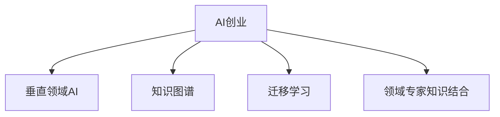

                 

## 1. 背景介绍

在当下人工智能(AI)快速发展的背景下，AI创业成为全球资本关注的热点之一。然而，传统的AI创业往往面临资源有限、技术壁垒高、市场准入门槛高等问题。相比通用AI技术，垂直领域AI创业以其专业化、市场紧迫性高、成功率高、市场空间大的特点，逐渐成为AI创业的新趋势。

### 1.1 问题由来

1. **资源问题**：
   - 通用AI技术开发和训练需要大量的计算资源、数据资源以及高技能的人力资源，这对于多数创业公司而言，门槛较高，资源不足。
   - 数据获取难度大，尤其是特定行业领域的精细化数据，导致模型训练难度增加。

2. **技术壁垒**：
   - 通用AI技术算法复杂，对技术深度要求高，创业团队需要精通多种领域知识。
   - 技术更新迭代快，创业团队需要持续跟踪最新技术，保持竞争力。

3. **市场准入门槛**：
   - 传统通用AI技术门槛高，潜在用户对AI技术了解不足，对AI产品的接受度低。
   - 创业团队需要解决客户教育问题，市场推广难度大。

4. **市场空间**：
   - 垂直领域AI技术因应用场景明确、用户需求紧迫，通常市场空间大。
   - 特定行业内，AI技术可以大幅提升业务效率和质量，市场需求强。

### 1.2 问题核心关键点
- **垂直领域专业化**：AI创业公司应聚焦于某一垂直领域，深入挖掘该领域需求，并提供专业化的解决方案。
- **领域知识积累**：创业公司应具备该领域的专业知识，以便更准确地理解用户需求。
- **应用场景紧迫性**：垂直领域AI技术通常有明确的应用场景和紧迫的需求，适合创业公司快速切入。
- **市场教育和推广**：针对非技术背景的用户，创业公司需进行市场教育和推广，提高产品的接受度。

## 2. 核心概念与联系

### 2.1 核心概念概述

为更好地理解垂直领域AI创业的优势，本节将介绍几个密切相关的核心概念：

- **AI创业**：指基于人工智能技术的创业活动，以开发、应用、推广AI产品或服务为目标。
- **垂直领域AI**：指针对特定行业或场景的AI技术，如医疗AI、教育AI、金融AI等，具有更强的针对性和实用性。
- **知识图谱**：一种结构化表示知识的方法，用于捕捉实体及其关系，帮助AI系统更好地理解领域知识。
- **迁移学习**：指将一个领域学到的知识，迁移到另一个领域的应用中，以降低新领域的训练难度。
- **领域专家的知识结合**：指将领域专家的知识与AI算法结合，以提升模型的准确性和实用性。

这些核心概念之间的逻辑关系可以通过以下Mermaid流程图来展示：



这个流程图展示了两类AI创业的关联概念及其之间的联系：

1. 垂直领域AI是由通用的AI创业衍生而来，具有更强的针对性和实用性。
2. 知识图谱、迁移学习和领域专家知识的结合，帮助垂直领域AI更好地理解和应用领域知识。

## 3. 核心算法原理 & 具体操作步骤

### 3.1 算法原理概述

垂直领域AI创业的核心在于利用AI技术解决特定领域问题，其核心算法原理包括以下几个方面：

1. **领域知识图谱**：通过知识图谱的方式，结构化表示领域内的实体和关系，帮助AI模型更好地理解领域背景和业务场景。
2. **迁移学习**：在已有领域模型基础上，通过迁移学习的方式，适应新领域数据和任务，减少在新领域从头训练模型的复杂度。
3. **领域专家的知识结合**：将领域专家的领域知识和AI模型的算法进行有效结合，提升模型的泛化能力和性能。

### 3.2 算法步骤详解

垂直领域AI创业的算法步骤主要包括：

**Step 1: 领域数据准备和预处理**
- 收集垂直领域的数据，包括文本、图像、视频等。
- 对数据进行清洗、标注和预处理，包括去除噪音、数据增强、标准化等。

**Step 2: 领域知识图谱构建**
- 构建领域知识图谱，表示领域内的实体、属性和关系。
- 利用知识图谱进行实体识别、关系抽取、实体链接等任务。

**Step 3: 领域模型训练**
- 选择适合垂直领域的模型，如BERT、GAN等，进行迁移学习训练。
- 利用领域专家的知识进行模型调参和优化，提升模型效果。

**Step 4: 领域模型微调**
- 对领域模型进行微调，适应新任务和新数据。
- 使用领域知识进行正则化，防止模型过拟合。

**Step 5: 领域模型部署和应用**
- 将训练好的模型部署到实际应用场景中。
- 根据反馈不断优化模型和算法，提升应用效果。

### 3.3 算法优缺点

垂直领域AI创业的算法具有以下优点：
1. **针对性强**：聚焦于特定领域，解决实际问题，提升用户体验。
2. **迁移能力强**：在已有领域模型基础上进行迁移学习，减少新领域模型训练成本。
3. **泛化能力强**：结合领域专家知识，提升模型泛化能力和性能。

同时，该算法也存在一些局限：
1. **数据依赖性强**：需要大量高质量的领域数据进行训练和模型优化。
2. **知识获取难度大**：领域知识图谱和专家知识获取成本高，可能导致算法复杂性增加。
3. **模型可解释性差**：复杂的领域知识结合AI模型，可能导致模型的可解释性降低。
4. **资源投入大**：需要投入大量资源进行领域数据收集、知识图谱构建和模型训练。

尽管存在这些局限，但就目前而言，垂直领域AI创业的算法方法，仍是大规模AI应用中的重要方向。未来相关研究的重点在于如何更好地结合领域知识，提升模型的可解释性和泛化能力，同时降低对领域数据的依赖。

### 3.4 算法应用领域

垂直领域AI创业在多个领域得到了应用，涵盖了医疗、教育、金融、物流等众多垂直行业：

- **医疗领域**：利用AI技术进行疾病诊断、影像分析、患者管理等。
- **教育领域**：通过AI技术进行智能辅导、课程推荐、学生评估等。
- **金融领域**：利用AI技术进行风险评估、反欺诈、个性化推荐等。
- **物流领域**：使用AI技术进行路径规划、仓储管理、配送优化等。
- **零售领域**：通过AI技术进行库存管理、客户分析、商品推荐等。
- **制造领域**：利用AI技术进行质量检测、生产优化、设备维护等。

这些应用展示了垂直领域AI创业的广泛适用性，促进了各行业的智能化转型升级。

## 4. 数学模型和公式 & 详细讲解  
### 4.1 数学模型构建

本节将使用数学语言对垂直领域AI创业的核心算法进行更加严格的刻画。

记领域模型为 $M_{\theta}$，其中 $\theta$ 为模型参数。假设领域数据集为 $D=\{(x_i,y_i)\}_{i=1}^N, x_i \in X, y_i \in Y$，其中 $X$ 为输入空间，$Y$ 为输出空间。

定义模型 $M_{\theta}$ 在数据样本 $(x,y)$ 上的损失函数为 $\ell(M_{\theta}(x),y)$，则在数据集 $D$ 上的经验风险为：

$$
\mathcal{L}(\theta) = \frac{1}{N} \sum_{i=1}^N \ell(M_{\theta}(x_i),y_i)
$$

微调的目标是最小化经验风险，即找到最优参数：

$$
\theta^* = \mathop{\arg\min}_{\theta} \mathcal{L}(\theta)
$$

在实践中，我们通常使用基于梯度的优化算法（如AdamW、SGD等）来近似求解上述最优化问题。设 $\eta$ 为学习率，$\lambda$ 为正则化系数，则参数的更新公式为：

$$
\theta \leftarrow \theta - \eta \nabla_{\theta}\mathcal{L}(\theta) - \eta\lambda\theta
$$

其中 $\nabla_{\theta}\mathcal{L}(\theta)$ 为损失函数对参数 $\theta$ 的梯度，可通过反向传播算法高效计算。

### 4.2 公式推导过程

以医疗领域的图像诊断任务为例，推导多任务学习模型在医疗图像上的交叉熵损失函数及其梯度的计算公式。

假设模型 $M_{\theta}$ 在输入 $x$ 上的输出为 $\hat{y}=M_{\theta}(x) \in [0,1]$，表示样本属于正类的概率。真实标签 $y \in \{0,1\}$。则二分类交叉熵损失函数定义为：

$$
\ell(M_{\theta}(x),y) = -[y\log \hat{y} + (1-y)\log (1-\hat{y})]
$$

在医疗图像诊断中，图像可能包含多个不同的病变，因此将模型输出 $\hat{y}$ 作为每个病变出现概率的向量形式 $\hat{y} \in [0,1]^k$，其中 $k$ 为病变的种类数。此时，交叉熵损失函数扩展为多类别交叉熵：

$$
\ell(M_{\theta}(x),y) = -\sum_{i=1}^k y_i \log \hat{y}_i
$$

将其代入经验风险公式，得：

$$
\mathcal{L}(\theta) = -\frac{1}{N}\sum_{i=1}^N \sum_{j=1}^k y_{i,j}\log M_{\theta}(x_i,j)
$$

根据链式法则，损失函数对参数 $\theta_k$ 的梯度为：

$$
\frac{\partial \mathcal{L}(\theta)}{\partial \theta_k} = -\frac{1}{N}\sum_{i=1}^N \sum_{j=1}^k \frac{y_{i,j}}{M_{\theta}(x_i,j)} \frac{\partial M_{\theta}(x_i,j)}{\partial \theta_k}
$$

其中 $\frac{\partial M_{\theta}(x_i,j)}{\partial \theta_k}$ 可进一步递归展开，利用自动微分技术完成计算。

在得到损失函数的梯度后，即可带入参数更新公式，完成模型的迭代优化。重复上述过程直至收敛，最终得到适应特定医疗图像诊断任务的最优模型参数 $\theta^*$。

## 5. 项目实践：代码实例和详细解释说明
### 5.1 开发环境搭建

在进行垂直领域AI创业实践前，我们需要准备好开发环境。以下是使用Python进行PyTorch开发的环境配置流程：

1. 安装Anaconda：从官网下载并安装Anaconda，用于创建独立的Python环境。

2. 创建并激活虚拟环境：
```bash
conda create -n pytorch-env python=3.8 
conda activate pytorch-env
```

3. 安装PyTorch：根据CUDA版本，从官网获取对应的安装命令。例如：
```bash
conda install pytorch torchvision torchaudio cudatoolkit=11.1 -c pytorch -c conda-forge
```

4. 安装Transformers库：
```bash
pip install transformers
```

5. 安装各类工具包：
```bash
pip install numpy pandas scikit-learn matplotlib tqdm jupyter notebook ipython
```

完成上述步骤后，即可在`pytorch-env`环境中开始垂直领域AI创业的实践。

### 5.2 源代码详细实现

下面我们以医疗领域的图像诊断任务为例，给出使用Transformers库对BERT模型进行多任务学习微调的PyTorch代码实现。

首先，定义多任务学习的数据处理函数：

```python
from transformers import BertTokenizer
from torch.utils.data import Dataset
import torch

class MedicalDataset(Dataset):
    def __init__(self, images, tags, tokenizer, max_len=128):
        self.images = images
        self.tags = tags
        self.tokenizer = tokenizer
        self.max_len = max_len
        
    def __len__(self):
        return len(self.images)
    
    def __getitem__(self, item):
        image = self.images[item]
        tags = self.tags[item]
        
        encoding = self.tokenizer(image, return_tensors='pt', max_length=self.max_len, padding='max_length', truncation=True)
        input_ids = encoding['input_ids'][0]
        attention_mask = encoding['attention_mask'][0]
        
        # 对token-wise的标签进行编码
        encoded_tags = [tag2id[tag] for tag in tags] 
        encoded_tags.extend([tag2id['O']] * (self.max_len - len(encoded_tags)))
        labels = torch.tensor(encoded_tags, dtype=torch.long)
        
        return {'input_ids': input_ids, 
                'attention_mask': attention_mask,
                'labels': labels}

# 标签与id的映射
tag2id = {'O': 0, 'B-病变1': 1, 'I-病变1': 2, 'B-病变2': 3, 'I-病变2': 4, 'B-病变3': 5, 'I-病变3': 6}
id2tag = {v: k for k, v in tag2id.items()}

# 创建dataset
tokenizer = BertTokenizer.from_pretrained('bert-base-cased')

train_dataset = MedicalDataset(train_images, train_tags, tokenizer)
dev_dataset = MedicalDataset(dev_images, dev_tags, tokenizer)
test_dataset = MedicalDataset(test_images, test_tags, tokenizer)
```

然后，定义模型和优化器：

```python
from transformers import BertForTokenClassification, AdamW

model = BertForTokenClassification.from_pretrained('bert-base-cased', num_labels=len(tag2id))

optimizer = AdamW(model.parameters(), lr=2e-5)
```

接着，定义训练和评估函数：

```python
from torch.utils.data import DataLoader
from tqdm import tqdm
from sklearn.metrics import classification_report

device = torch.device('cuda') if torch.cuda.is_available() else torch.device('cpu')
model.to(device)

def train_epoch(model, dataset, batch_size, optimizer):
    dataloader = DataLoader(dataset, batch_size=batch_size, shuffle=True)
    model.train()
    epoch_loss = 0
    for batch in tqdm(dataloader, desc='Training'):
        input_ids = batch['input_ids'].to(device)
        attention_mask = batch['attention_mask'].to(device)
        labels = batch['labels'].to(device)
        model.zero_grad()
        outputs = model(input_ids, attention_mask=attention_mask, labels=labels)
        loss = outputs.loss
        epoch_loss += loss.item()
        loss.backward()
        optimizer.step()
    return epoch_loss / len(dataloader)

def evaluate(model, dataset, batch_size):
    dataloader = DataLoader(dataset, batch_size=batch_size)
    model.eval()
    preds, labels = [], []
    with torch.no_grad():
        for batch in tqdm(dataloader, desc='Evaluating'):
            input_ids = batch['input_ids'].to(device)
            attention_mask = batch['attention_mask'].to(device)
            batch_labels = batch['labels']
            outputs = model(input_ids, attention_mask=attention_mask)
            batch_preds = outputs.logits.argmax(dim=2).to('cpu').tolist()
            batch_labels = batch_labels.to('cpu').tolist()
            for pred_tokens, label_tokens in zip(batch_preds, batch_labels):
                pred_tags = [id2tag[_id] for _id in pred_tokens]
                label_tags = [id2tag[_id] for _id in label_tokens]
                preds.append(pred_tags[:len(label_tags)])
                labels.append(label_tags)
                
    print(classification_report(labels, preds))
```

最后，启动训练流程并在测试集上评估：

```python
epochs = 5
batch_size = 16

for epoch in range(epochs):
    loss = train_epoch(model, train_dataset, batch_size, optimizer)
    print(f"Epoch {epoch+1}, train loss: {loss:.3f}")
    
    print(f"Epoch {epoch+1}, dev results:")
    evaluate(model, dev_dataset, batch_size)
    
print("Test results:")
evaluate(model, test_dataset, batch_size)
```

以上就是使用PyTorch对BERT进行多任务学习微调的完整代码实现。可以看到，得益于Transformers库的强大封装，我们可以用相对简洁的代码完成BERT模型的加载和微调。

### 5.3 代码解读与分析

让我们再详细解读一下关键代码的实现细节：

**MedicalDataset类**：
- `__init__`方法：初始化图像、标签、分词器等关键组件。
- `__len__`方法：返回数据集的样本数量。
- `__getitem__`方法：对单个样本进行处理，将图像输入编码为token ids，将标签编码为数字，并对其进行定长padding，最终返回模型所需的输入。

**tag2id和id2tag字典**：
- 定义了标签与数字id之间的映射关系，用于将token-wise的预测结果解码回真实的标签。

**训练和评估函数**：
- 使用PyTorch的DataLoader对数据集进行批次化加载，供模型训练和推理使用。
- 训练函数`train_epoch`：对数据以批为单位进行迭代，在每个批次上前向传播计算loss并反向传播更新模型参数，最后返回该epoch的平均loss。
- 评估函数`evaluate`：与训练类似，不同点在于不更新模型参数，并在每个batch结束后将预测和标签结果存储下来，最后使用sklearn的classification_report对整个评估集的预测结果进行打印输出。

**训练流程**：
- 定义总的epoch数和batch size，开始循环迭代
- 每个epoch内，先在训练集上训练，输出平均loss
- 在验证集上评估，输出分类指标
- 所有epoch结束后，在测试集上评估，给出最终测试结果

可以看到，PyTorch配合Transformers库使得BERT微调的代码实现变得简洁高效。开发者可以将更多精力放在数据处理、模型改进等高层逻辑上，而不必过多关注底层的实现细节。

当然，工业级的系统实现还需考虑更多因素，如模型的保存和部署、超参数的自动搜索、更灵活的任务适配层等。但核心的微调范式基本与此类似。

## 6. 实际应用场景
### 6.1 智能医疗诊断

基于垂直领域AI创业的图像诊断技术，可以广泛应用于智能医疗系统的构建。传统的医疗诊断往往依赖于医生的经验，耗时长、准确性差、成本高。使用多任务学习微调技术，智能医疗系统能够实时高效地对医疗图像进行分析和诊断，减少医生的工作负担。

在技术实现上，可以收集医院的历史医疗图像数据，将图像和标签构建成监督数据，在此基础上对预训练模型进行微调。微调后的模型能够自动理解图像内容，匹配医疗知识库中的诊断信息，快速提供诊断结果。对于新出现的医学图像，还可以通过实时监控不断更新知识库，增强模型的泛化能力。如此构建的智能医疗系统，能大幅提升诊断效率和准确性，辅助医生做出更准确的诊断决策。

### 6.2 教育智能辅导

基于垂直领域AI创业的智能辅导系统，可以广泛应用于在线教育平台。传统的教育辅导往往依赖于大量教师资源，成本高、效率低、教学质量参差不齐。使用多任务学习微调技术，智能辅导系统能够对学生作业进行自动批改，提供个性化的学习建议，实时解答学生问题，提升学习效果。

在技术实现上，可以收集学生的作业数据和答案数据，将问题和答案构建成监督数据，在此基础上对预训练模型进行微调。微调后的模型能够自动理解问题，匹配知识库中的答案，生成智能回答。对于学生提出的新问题，还可以通过在线搜索动态生成回答，提高辅导的灵活性和实时性。如此构建的智能辅导系统，能大幅提升学习体验，加速知识传递，降低教育成本。

### 6.3 金融风险评估

基于垂直领域AI创业的金融风险评估系统，可以广泛应用于金融机构。传统的金融风险评估往往依赖于人工判断，耗时长、效率低、准确性差。使用多任务学习微调技术，金融风险评估系统能够自动分析客户信用记录和行为数据，快速评估信用风险，筛选出潜在的高风险客户，减少不良贷款率。

在技术实现上，可以收集客户的信用记录和行为数据，将数据和标签构建成监督数据，在此基础上对预训练模型进行微调。微调后的模型能够自动分析客户的信用行为，匹配风险评分模型，生成风险评估结果。对于新出现的客户数据，还可以通过实时监控不断更新模型，提高风险评估的及时性和准确性。如此构建的金融风险评估系统，能大幅提升风险管理的自动化水平，降低金融机构的运营成本。

### 6.4 未来应用展望

随着垂直领域AI创业技术的不断发展，AI应用将在更多领域得到应用，为各行各业带来变革性影响。

在智慧医疗领域，基于AI的智能诊断、影像分析、患者管理等应用将提升医疗服务的智能化水平，辅助医生诊疗，加速新药开发进程。

在教育领域，基于AI的智能辅导、课程推荐、学生评估等应用将提升教育服务的智能化水平，因材施教，促进教育公平，提高教学质量。

在金融领域，基于AI的风险评估、反欺诈、个性化推荐等应用将提升金融服务的智能化水平，降低风险，提高服务质量。

在制造领域，基于AI的质量检测、生产优化、设备维护等应用将提升制造业的智能化水平，提高生产效率，降低成本。

此外，在智慧城市治理、智能客服、智能推荐等众多领域，基于垂直领域AI创业的AI应用也将不断涌现，为经济社会发展注入新的动力。相信随着技术的日益成熟，垂直领域AI创业必将成为AI创业的重要方向，推动人工智能技术在垂直行业的广泛应用。

## 7. 工具和资源推荐
### 7.1 学习资源推荐

为了帮助开发者系统掌握垂直领域AI创业的理论基础和实践技巧，这里推荐一些优质的学习资源：

1. 《深度学习在医疗影像分析中的应用》系列博文：由医疗AI专家撰写，深入浅出地介绍了医疗影像分析的深度学习原理和实践方法。

2. 《教育领域人工智能应用》课程：斯坦福大学开设的AI教育应用课程，介绍了AI技术在教育领域的应用方法和创新案例。

3. 《金融领域人工智能应用》书籍：介绍了AI技术在金融领域的应用，包括风险评估、反欺诈、个性化推荐等。

4. AI医疗开源项目：提供了医疗AI模型的预训练和微调样例，方便开发者快速上手。

5. 《垂直领域人工智能应用》论文集：涵盖了医疗、教育、金融等多个垂直领域AI应用的最新研究成果和前沿技术。

通过对这些资源的学习实践，相信你一定能够快速掌握垂直领域AI创业的精髓，并用于解决实际的AI应用问题。
### 7.2 开发工具推荐

高效的开发离不开优秀的工具支持。以下是几款用于垂直领域AI创业开发的常用工具：

1. PyTorch：基于Python的开源深度学习框架，灵活动态的计算图，适合快速迭代研究。大部分预训练语言模型都有PyTorch版本的实现。

2. TensorFlow：由Google主导开发的开源深度学习框架，生产部署方便，适合大规模工程应用。同样有丰富的预训练语言模型资源。

3. Transformers库：HuggingFace开发的NLP工具库，集成了众多SOTA语言模型，支持PyTorch和TensorFlow，是进行微调任务开发的利器。

4. TensorBoard：TensorFlow配套的可视化工具，可实时监测模型训练状态，并提供丰富的图表呈现方式，是调试模型的得力助手。

5. Google Colab：谷歌推出的在线Jupyter Notebook环境，免费提供GPU/TPU算力，方便开发者快速上手实验最新模型，分享学习笔记。

合理利用这些工具，可以显著提升垂直领域AI创业的开发效率，加快创新迭代的步伐。

### 7.3 相关论文推荐

垂直领域AI创业的发展源于学界的持续研究。以下是几篇奠基性的相关论文，推荐阅读：

1. Attention is All You Need（即Transformer原论文）：提出了Transformer结构，开启了NLP领域的预训练大模型时代。

2. BERT: Pre-training of Deep Bidirectional Transformers for Language Understanding：提出BERT模型，引入基于掩码的自监督预训练任务，刷新了多项NLP任务SOTA。

3. Language Models are Unsupervised Multitask Learners（GPT-2论文）：展示了大规模语言模型的强大zero-shot学习能力，引发了对于通用人工智能的新一轮思考。

4. Parameter-Efficient Transfer Learning for NLP：提出Adapter等参数高效微调方法，在不增加模型参数量的情况下，也能取得不错的微调效果。

5. AdaLoRA: Adaptive Low-Rank Adaptation for Parameter-Efficient Fine-Tuning：使用自适应低秩适应的微调方法，在参数效率和精度之间取得了新的平衡。

这些论文代表了大语言模型微调技术的发展脉络。通过学习这些前沿成果，可以帮助研究者把握学科前进方向，激发更多的创新灵感。

## 8. 总结：未来发展趋势与挑战

### 8.1 总结

本文对垂直领域AI创业的优势和实践进行了全面系统的介绍。首先阐述了垂直领域AI创业的背景和意义，明确了垂直领域AI在特定行业应用的优势。其次，从原理到实践，详细讲解了垂直领域AI创业的数学模型和算法步骤，给出了实际应用的代码实例。同时，本文还广泛探讨了垂直领域AI创业在医疗、教育、金融等领域的实际应用，展示了垂直领域AI创业的广阔前景。此外，本文精选了垂直领域AI创业的学习资源、开发工具和相关论文，力求为读者提供全方位的技术指引。

通过本文的系统梳理，可以看到，垂直领域AI创业以其专业化、市场紧迫性高、成功率高、市场空间大的特点，成为AI创业的新趋势。垂直领域AI创业的成功与否，在很大程度上取决于领域知识的积累和理解，以及对AI算法的熟练运用。未来，随着垂直领域AI创业的不断发展，AI技术将在更广泛的应用领域落地，为经济社会发展注入新的动力。

### 8.2 未来发展趋势

展望未来，垂直领域AI创业将呈现以下几个发展趋势：

1. **知识图谱的广泛应用**：知识图谱将逐渐成为垂直领域AI创业的基础设施，帮助AI系统更好地理解和应用领域知识。

2. **多任务学习的普及**：多任务学习能够有效利用有限标注数据，提升模型的泛化能力和性能，逐渐成为垂直领域AI创业的主流范式。

3. **领域专家与AI系统的深度融合**：领域专家的知识和经验将与AI系统深度结合，提升系统的准确性和可靠性。

4. **实时数据处理与反馈机制**：垂直领域AI创业将更加注重实时数据处理和反馈机制，提升系统的实时性和动态性。

5. **跨领域应用的拓展**：垂直领域AI创业将逐渐扩展到更多领域，推动AI技术在更多行业的应用。

以上趋势凸显了垂直领域AI创业的广阔前景。这些方向的探索发展，必将进一步提升AI系统的性能和应用范围，为各行各业带来深刻的变革。

### 8.3 面临的挑战

尽管垂直领域AI创业取得了诸多进展，但在迈向更加智能化、普适化应用的过程中，它仍面临诸多挑战：

1. **数据获取难度大**：特定领域的数据获取成本高，且数据质量难以保证，可能影响模型的训练效果。

2. **知识图谱构建困难**：知识图谱的构建需要大量领域专家的参与，耗时长且成本高。

3. **模型可解释性差**：复杂的领域知识结合AI模型，可能导致模型的可解释性降低，难以进行有效的解释和调试。

4. **实时性要求高**：一些垂直领域的应用对实时性要求高，系统需要具备较高的计算能力和资源调度能力。

5. **跨领域应用难度大**：不同领域的数据和任务具有较大差异，将垂直领域AI创业应用于其他领域时，需要重新设计和优化模型。

尽管存在这些挑战，但垂直领域AI创业作为AI创业的重要方向，仍具有广阔的市场前景和应用空间。未来研究需要在数据获取、知识图谱构建、模型可解释性、实时性等方面进行更多的探索和优化，以推动垂直领域AI创业的持续发展。

### 8.4 研究展望

未来，垂直领域AI创业需要在以下几个方面进行进一步的研究和探索：

1. **跨领域知识迁移**：研究如何将垂直领域AI创业的知识迁移到其他领域，提升跨领域应用能力。

2. **领域知识的自动化获取**：研究如何利用自动化工具和算法，降低领域知识图谱的构建难度和成本。

3. **可解释性增强**：研究如何增强AI模型的可解释性，提升模型的透明度和可信度。

4. **实时数据处理优化**：研究如何优化数据处理和模型计算，提升系统的实时性和效率。

5. **边缘计算的应用**：研究如何将垂直领域AI创业应用于边缘计算场景，提升系统的计算能力和资源利用效率。

这些研究方向的探索，必将推动垂直领域AI创业技术的进一步发展和应用，为经济社会发展注入新的动力。未来，随着技术的不断成熟和普及，垂直领域AI创业将为各行各业带来更加深刻的变革，推动AI技术在垂直行业的广泛应用。

## 9. 附录：常见问题与解答

**Q1：垂直领域AI创业是否适用于所有垂直领域？**

A: 垂直领域AI创业适用于特定领域有明确需求和紧迫性，能够快速落地的应用场景。但不同领域的需求和特点不同，创业团队需要根据实际情况进行选择和调整。

**Q2：如何选择合适的微调模型？**

A: 根据垂直领域的特点，选择合适的预训练模型是成功的关键。一般来说，模型应具备以下特点：
- 强大的泛化能力，能够在有限数据上表现出色。
- 高可解释性，方便领域专家理解和调试。
- 良好的计算效率，能够适应实时应用场景。

**Q3：微调过程中如何处理领域知识图谱？**

A: 领域知识图谱的构建和处理是微调过程中不可或缺的一部分。一般来说，处理步骤包括：
- 数据预处理：清洗、标注、预处理领域数据，构建知识图谱。
- 图谱整合：将知识图谱与模型参数进行整合，提升模型的领域知识理解能力。
- 正则化：利用图谱中的关系进行正则化，防止模型过拟合。

**Q4：微调过程中如何优化参数更新？**

A: 参数更新的优化是微调成功的关键。一般来说，优化步骤包括：
- 学习率调整：根据模型表现调整学习率，防止梯度爆炸或消失。
- 正则化技术：使用L2正则、Dropout等技术，防止模型过拟合。
- 批大小调整：根据数据规模和计算资源调整批大小，提升模型训练效率。

**Q5：垂直领域AI创业在落地过程中需要注意哪些问题？**

A: 垂直领域AI创业的落地需要注意以下问题：
- 数据质量和数量：确保领域数据的全面性和准确性，提升模型的泛化能力。
- 模型部署和优化：将训练好的模型部署到实际应用场景中，并不断优化模型和算法。
- 用户反馈和迭代：根据用户反馈不断优化模型和算法，提升用户体验。

通过合理处理这些关键问题，可以有效地提升垂直领域AI创业的成功率，推动AI技术在各行各业的广泛应用。

---

作者：禅与计算机程序设计艺术 / Zen and the Art of Computer Programming

