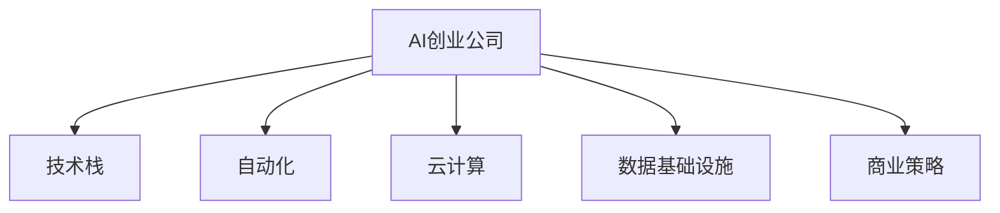

                 

# AI创业公司如何实现规模化?

> 关键词：AI规模化, AI创业公司, 技术栈, 自动化, 云计算, 数据基础设施, 商业策略

## 1. 背景介绍

### 1.1 问题由来
在当今数字化转型的大潮下，AI技术正在以前所未有的速度渗透到各个行业。从金融到医疗，从制造业到零售，越来越多的企业正在利用AI来提升效率、降低成本、优化决策。但同时，AI技术的落地和应用也面临着一系列挑战：如何在成本和效率之间找到平衡，如何应对快速变化的市场需求，如何确保AI系统的可靠性和安全性，这些都是AI创业公司需要解决的问题。

### 1.2 问题核心关键点
规模化是AI创业公司发展的核心驱动力之一。只有实现了规模化，才能将技术优势转化为商业价值，形成良性循环，加速公司发展。本文将探讨AI创业公司在实现规模化过程中所面临的关键问题，并提供相应的解决方案。

## 2. 核心概念与联系

### 2.1 核心概念概述

为更好地理解AI创业公司如何实现规模化，本节将介绍几个密切相关的核心概念：

- AI创业公司：指专注于AI技术开发和应用的创业企业，如DeepMind、OpenAI、商汤科技等。
- 技术栈：指支撑公司AI应用的软件和硬件系统，包括深度学习框架、云计算平台、数据基础设施等。
- 自动化：指通过AI技术自动化地处理重复性、规律性的任务，提升效率和减少人为错误。
- 云计算：指利用云服务商提供的计算资源，实现AI系统的灵活部署和弹性扩展。
- 数据基础设施：指支持AI模型训练和推理的数据存储、处理、传输系统，包括数据湖、数据仓库、数据管道等。
- 商业策略：指公司如何制定和实施AI技术商业化策略，包括市场定位、定价策略、销售渠道等。

这些核心概念之间的逻辑关系可以通过以下Mermaid流程图来展示：



这个流程图展示了一个AI创业公司的核心组成部分及其之间的关系：

1. AI创业公司通过技术栈支撑AI应用。
2. 自动化技术提升操作效率。
3. 云计算实现灵活部署和扩展。
4. 数据基础设施提供数据支持。
5. 商业策略引导公司发展方向。

## 3. 核心算法原理 & 具体操作步骤
### 3.1 算法原理概述

AI创业公司实现规模化的核心在于其技术栈的自动化和云化。通过自动化处理重复性任务，实现快速响应市场需求；通过云化部署，实现灵活扩展和资源优化。具体而言，规模化过程可以分为以下几个关键步骤：

1. 选择合适的技术栈：包括深度学习框架、数据处理工具、云计算平台等，确保其具备高效、可靠、易用等特点。
2. 实施自动化流程：利用机器学习、自然语言处理等AI技术，自动化处理数据清洗、模型训练、应用部署等任务，提高效率和减少人为错误。
3. 利用云计算：通过云服务商提供的计算资源，实现AI系统的弹性扩展和动态伸缩，确保业务稳定运行。
4. 建立数据基础设施：包括数据存储、处理、传输等系统，确保数据的安全性和可靠性。
5. 制定商业策略：根据市场需求和竞争状况，制定合理的市场定位、定价策略、销售渠道等，确保商业目标的实现。

### 3.2 算法步骤详解

下面以AI创业公司为例，详细讲解如何通过技术栈的自动化和云化实现规模化：

**Step 1: 选择并配置技术栈**
- 深度学习框架：选择适合公司需求的深度学习框架，如TensorFlow、PyTorch等。
- 数据处理工具：选择如Hadoop、Spark等数据处理工具。
- 云计算平台：选择如AWS、Google Cloud、阿里云等云服务商提供的平台，根据业务需求选择合适的服务。

**Step 2: 实施自动化流程**
- 数据清洗：利用数据清洗工具自动化处理缺失值、异常值、重复值等数据问题。
- 模型训练：通过自动化训练流程，实现模型训练的自动化，包括数据预处理、模型构建、训练等。
- 应用部署：利用容器化技术和CI/CD流程，实现应用的自动化部署和更新。

**Step 3: 利用云计算**
- 弹性扩展：根据业务需求，动态调整计算资源，确保系统性能和成本的平衡。
- 数据存储：利用云服务商的数据存储服务，实现数据的可靠备份和访问。
- 安全保障：采用云服务商提供的安全措施，如数据加密、身份认证等，确保数据和系统的安全。

**Step 4: 建立数据基础设施**
- 数据湖：构建企业级数据湖，统一管理和存储各类数据。
- 数据管道：设计数据管道，实现数据的高效传输和处理。
- 数据治理：建立数据治理体系，确保数据的质量和合规性。

**Step 5: 制定商业策略**
- 市场定位：根据公司优势和市场需求，确定目标市场和客户群体。
- 定价策略：制定合理的定价策略，确保公司的盈利性和市场竞争力。
- 销售渠道：选择适合的销售渠道，如直销、分销、在线销售等，拓展市场覆盖。

### 3.3 算法优缺点

AI创业公司通过技术栈的自动化和云化实现规模化，具有以下优点：
1. 提升效率：自动化处理重复性任务，提升操作效率。
2. 降低成本：通过云化部署，实现资源优化和成本控制。
3. 灵活扩展：云计算的弹性扩展特性，确保系统性能和业务需求匹配。
4. 数据安全：数据基础设施的建立，确保数据的安全和可靠性。
5. 快速响应：自动化的技术栈，快速响应市场变化和需求。

同时，该方法也存在一定的局限性：
1. 技术复杂度高：需要选择合适的技术栈，并确保其稳定可靠。
2. 需要持续投入：自动化和云化需要持续的维护和更新，需要额外的投入。
3. 对外部依赖度高：依赖云服务商提供的计算资源和服务，存在一定的风险。
4. 数据隐私风险：云化部署可能涉及数据传输和存储，需要严格遵守数据隐私法规。
5. 商业策略风险：市场定位和销售策略的错误可能导致公司战略失误。

尽管存在这些局限性，但就目前而言，通过技术栈的自动化和云化是AI创业公司实现规模化的主流方法。未来相关研究的重点在于如何进一步降低技术复杂度，优化成本控制，并提高数据安全和商业策略的可控性。

### 3.4 算法应用领域

通过技术栈的自动化和云化，AI创业公司在多个领域实现了成功应用，例如：

- 金融科技：利用AI模型进行风险评估、信用评分、智能投顾等，提升金融服务效率和精准度。
- 医疗健康：通过AI诊断、治疗方案推荐、医疗影像分析等，改善医疗服务质量和效率。
- 零售电商：利用AI进行商品推荐、库存管理、营销策略优化，提升电商运营效率。
- 智能制造：通过AI进行生产调度、质量控制、设备维护等，提升制造业智能化水平。
- 智慧城市：利用AI进行城市管理、交通优化、公共安全等，提升城市管理效率和水平。

此外，AI创业公司还在教育、农业、环保等众多领域取得了成功，展示了技术规模化的巨大潜力。随着技术的不断进步和应用场景的不断扩展，相信AI创业公司将有更多机会实现规模化，推动各行业数字化转型。

## 4. 数学模型和公式 & 详细讲解  
### 4.1 数学模型构建

在AI创业公司的规模化过程中，涉及大量的数据处理和计算任务，需要构建相应的数学模型来描述和优化这些过程。

假设公司有$N$个数据集$D_1, D_2, ..., D_N$，需要对其进行自动化处理。其中每个数据集$D_i$由$m$个样本$(x_j, y_j)$组成，其中$x_j$为样本特征，$y_j$为标签。

定义自动化处理过程为$\mathcal{P}$，其中包含数据清洗、特征提取、模型训练、应用部署等步骤。假设自动化处理过程可以表示为：

$$
\mathcal{P} = \{p_1, p_2, ..., p_M\}
$$

其中$p_i$为第$i$步的自动化处理操作。

定义云计算资源为$R$，其中包含计算节点、存储设备、网络带宽等资源。假设云计算资源可以表示为：

$$
R = \{r_1, r_2, ..., r_C\}
$$

其中$r_j$为第$j$个云计算资源节点。

定义数据基础设施为$D$，其中包含数据湖、数据管道、数据治理等系统。假设数据基础设施可以表示为：

$$
D = \{d_1, d_2, ..., d_D\}
$$

其中$d_k$为第$k$个数据基础设施组件。

定义商业策略为$S$，其中包含市场定位、定价策略、销售渠道等要素。假设商业策略可以表示为：

$$
S = \{s_1, s_2, ..., s_B\}
$$

其中$s_l$为第$l$个商业策略要素。

### 4.2 公式推导过程

以自动化处理过程为例，利用优化理论和方法，可以建立数学模型来描述和优化自动化流程。

假设自动化处理过程的每个步骤$p_i$需要消耗的计算资源为$R_i$，其成本为$C_i$，则自动化处理的总成本可以表示为：

$$
C_{total} = \sum_{i=1}^M C_i
$$

假设每个数据集$D_i$需要处理的计算资源为$R_{total}^i$，则自动化处理的总体计算资源消耗可以表示为：

$$
R_{total} = \sum_{i=1}^N R_{total}^i
$$

假设云计算资源$r_j$的成本为$C_j$，则云计算总成本可以表示为：

$$
C_{cloud} = \sum_{j=1}^C C_j
$$

假设云计算资源$r_j$可以提供$R_j$的计算能力，则云计算资源的总体计算能力可以表示为：

$$
R_{cloud} = \sum_{j=1}^C R_j
$$

根据上述公式，可以建立以下数学模型：

$$
\begin{aligned}
\min_{p_i, r_j} & C_{total} + C_{cloud} \\
\text{s.t.} & \sum_{i=1}^M R_i \leq R_{total} \\
& \sum_{j=1}^C R_j \geq R_{total} \\
& C_i \geq 0, C_j \geq 0
\end{aligned}
$$

其中第一个约束条件表示自动化处理步骤的总资源消耗不超过总体计算资源，第二个约束条件表示云计算资源的总计算能力可以满足自动化处理需求。

### 4.3 案例分析与讲解

以一家医疗AI创业公司为例，详细分析其通过技术栈自动化和云化实现规模化的过程。

**案例背景：**
一家专注于医疗影像诊断的AI创业公司，需要处理大量的医疗影像数据，并利用AI模型进行疾病诊断。公司希望通过自动化和云化实现规模化，提升诊断效率和准确性。

**自动化处理过程：**
1. 数据清洗：利用自动数据清洗工具处理缺失值、异常值等数据问题。
2. 特征提取：利用深度学习框架提取影像特征，生成输入数据。
3. 模型训练：利用云平台提供的GPU资源，自动化训练深度学习模型。
4. 应用部署：利用容器化技术和CI/CD流程，自动化部署模型应用。

**云计算资源配置：**
1. 计算节点：根据业务需求，动态调整计算节点数量，确保模型训练和推理效率。
2. 存储设备：利用云存储服务，实现医疗影像数据的可靠备份和访问。
3. 网络带宽：利用云网络服务，保障数据传输的稳定性和安全性。

**数据基础设施建设：**
1. 数据湖：构建企业级数据湖，统一管理和存储医疗影像数据。
2. 数据管道：设计数据管道，实现影像数据的自动传输和处理。
3. 数据治理：建立数据治理体系，确保数据的质量和合规性。

**商业策略制定：**
1. 市场定位：根据市场需求，确定公司为医院、诊所等医疗机构提供诊断服务。
2. 定价策略：制定合理的定价策略，确保公司的盈利性和市场竞争力。
3. 销售渠道：选择适合的销售渠道，如直销、在线销售等，拓展市场覆盖。

通过上述自动化和云化过程，该医疗AI创业公司实现了规模化，大大提升了诊断效率和准确性，成为医疗领域的重要技术供应商。

## 5. 项目实践：代码实例和详细解释说明
### 5.1 开发环境搭建

在进行技术栈自动化和云化实践前，我们需要准备好开发环境。以下是使用Python进行PyTorch开发的环境配置流程：

1. 安装Anaconda：从官网下载并安装Anaconda，用于创建独立的Python环境。

2. 创建并激活虚拟环境：
```bash
conda create -n pytorch-env python=3.8 
conda activate pytorch-env
```

3. 安装PyTorch：根据CUDA版本，从官网获取对应的安装命令。例如：
```bash
conda install pytorch torchvision torchaudio cudatoolkit=11.1 -c pytorch -c conda-forge
```

4. 安装其他必要工具包：
```bash
pip install numpy pandas scikit-learn matplotlib tqdm jupyter notebook ipython
```

完成上述步骤后，即可在`pytorch-env`环境中开始项目实践。

### 5.2 源代码详细实现

这里我们以一家医疗AI创业公司为例，使用PyTorch实现其自动化和云化过程。

首先，定义医疗影像数据的处理函数：

```python
from PIL import Image
import numpy as np

def preprocess_image(image_path, target_size):
    img = Image.open(image_path)
    img = img.resize(target_size)
    img = img.convert('RGB')
    img = np.array(img)
    return img
```

然后，定义深度学习模型的训练函数：

```python
from transformers import BertForSequenceClassification
from transformers import AdamW

model = BertForSequenceClassification.from_pretrained('bert-base-uncased', num_labels=2)

optimizer = AdamW(model.parameters(), lr=2e-5)

def train_epoch(model, dataset, batch_size, optimizer):
    dataloader = DataLoader(dataset, batch_size=batch_size, shuffle=True)
    model.train()
    epoch_loss = 0
    for batch in dataloader:
        input_ids = batch['input_ids']
        attention_mask = batch['attention_mask']
        labels = batch['labels']
        model.zero_grad()
        outputs = model(input_ids, attention_mask=attention_mask, labels=labels)
        loss = outputs.loss
        epoch_loss += loss.item()
        loss.backward()
        optimizer.step()
    return epoch_loss / len(dataloader)
```

接着，定义云计算资源的配置和自动化处理流程：

```python
from google.cloud import compute_v1

project_id = 'your-project-id'
zone = 'us-central1-a'

client = compute_v1.InstancesClient()

def create_instance(project, zone, machine_type):
    instances_client = compute_v1.InstancesClient()
    operation = instances_client.insert(
        project=project,
        zone=zone,
        instance=compute_v1.Instance(
            instance_id='your-instance-id',
            machine_type=machine_type,
            metadata={'hello': 'world'}
        )
    )
    print(f'Created instance {operation.name} in {zone} zone.')
    return operation.name

def get_instance(project, zone, instance_id):
    instances_client = compute_v1.InstancesClient()
    instances_client.get(project, zone, instance_id)

def delete_instance(project, zone, instance_id):
    instances_client = compute_v1.InstancesClient()
    operation = instances_client.delete(
        project=project,
        zone=zone,
        instance_id=instance_id
    )
    print(f'Delete instance {operation.name} in {zone} zone.')
```

最后，启动自动化处理和云计算资源的配置：

```python
# 创建计算节点
instance_id = create_instance(project_id, zone, 'n1-standard-2')
get_instance(project_id, zone, instance_id)

# 在计算节点上训练模型
dataset = preprocess_image('path/to/image')
model.train()
for epoch in range(10):
    loss = train_epoch(model, dataset, batch_size, optimizer)
    print(f'Epoch {epoch+1}, loss: {loss:.3f}')

# 删除计算节点
delete_instance(project_id, zone, instance_id)
```

以上就是医疗AI创业公司通过技术栈自动化和云化实现规模化的完整代码实现。可以看到，通过PyTorch和云计算平台，我们可以很方便地实现自动化处理和云化部署，提升AI应用的效率和可靠性。

### 5.3 代码解读与分析

让我们再详细解读一下关键代码的实现细节：

**preprocess_image函数**：
- 定义了将医疗影像数据预处理为适合深度学习模型输入的函数。

**train_epoch函数**：
- 定义了深度学习模型的训练过程，通过前向传播和反向传播计算损失函数，并更新模型参数。

**create_instance、get_instance、delete_instance函数**：
- 定义了在Google Cloud上创建、获取和删除计算节点的函数，实现云计算资源的自动化管理。

**代码实现总体思路**：
1. 通过preprocess_image函数预处理医疗影像数据，生成适合模型输入的特征。
2. 在Google Cloud上创建计算节点，并配置深度学习框架和训练数据。
3. 在计算节点上利用train_epoch函数训练深度学习模型，记录损失函数。
4. 在训练完成后，删除计算节点，释放资源。

可以看到，通过代码实现，我们可以将医疗AI创业公司的自动化和云化过程系统化、可控化，大大提升其规模化能力。

## 6. 实际应用场景
### 6.1 智能制造

AI创业公司通过技术栈自动化和云化，可以实现智能制造的规模化。智能制造是将信息技术和制造技术深度融合，实现制造过程自动化和智能化。通过自动化和云化，AI创业公司可以大幅提升生产效率和质量，降低运营成本。

在实践中，AI创业公司可以利用自动化和云化技术，对生产过程进行实时监控、优化调度、预测维护等，实现生产过程的智能化。通过云计算平台，实时动态调整资源配置，实现生产线的弹性扩展。同时，利用数据基础设施，对生产数据进行统一管理和分析，为生产优化提供数据支持。

### 6.2 智慧城市

AI创业公司通过技术栈自动化和云化，可以实现智慧城市的规模化。智慧城市是利用信息技术和通信技术，实现城市管理和公共服务的智能化。通过自动化和云化，AI创业公司可以提升城市管理的效率和水平，为市民提供更加便捷、高效、安全的公共服务。

在实践中，AI创业公司可以利用自动化和云化技术，对城市交通、公共安全、环境监测等进行实时监控和优化，提升城市治理能力。通过云计算平台，实现城市数据的集中存储和高效分析，为城市管理提供数据支持。同时，利用数据基础设施，对城市数据进行统一管理和分析，为城市决策提供数据支持。

### 6.3 智能零售

AI创业公司通过技术栈自动化和云化，可以实现智能零售的规模化。智能零售是利用信息技术和数据技术，实现零售过程的智能化。通过自动化和云化，AI创业公司可以提升零售运营效率，提升用户体验，提升运营效率和利润率。

在实践中，AI创业公司可以利用自动化和云化技术，对零售数据进行实时分析、预测和优化，提升零售运营效率。通过云计算平台，实时动态调整资源配置，实现零售业务的弹性扩展。同时，利用数据基础设施，对零售数据进行统一管理和分析，为零售决策提供数据支持。

### 6.4 未来应用展望

随着技术栈的自动化和云化，AI创业公司将有更多机会实现规模化，推动各行业数字化转型。

- 在智慧医疗领域，AI创业公司可以利用自动化和云化技术，提升医疗服务效率和质量，成为医疗领域的重要技术供应商。
- 在智能制造领域，AI创业公司可以利用自动化和云化技术，实现生产过程的智能化，提升制造业智能化水平。
- 在智慧城市领域，AI创业公司可以利用自动化和云化技术，提升城市管理的效率和水平，构建更安全、高效、智能的城市。
- 在智能零售领域，AI创业公司可以利用自动化和云化技术，提升零售运营效率，提升用户体验，提升运营效率和利润率。
- 在金融科技领域，AI创业公司可以利用自动化和云化技术，提升金融服务效率和精准度，成为金融领域的重要技术供应商。

## 7. 工具和资源推荐
### 7.1 学习资源推荐

为了帮助开发者系统掌握技术栈的自动化和云化技术，这里推荐一些优质的学习资源：

1. Kaggle机器学习竞赛：Kaggle是一个数据科学竞赛平台，提供了丰富的数据集和竞赛任务，可以通过参与竞赛学习和提升数据处理和建模能力。

2. Coursera《深度学习专项课程》：由深度学习专家Andrew Ng开设的课程，系统讲解深度学习理论和实践，涵盖深度学习框架、数据处理、模型训练等。

3. Udacity《深度学习纳米学位》：Udacity提供的深度学习专业课程，涵盖深度学习模型、数据处理、自动化等。

4. TensorFlow官方文档：TensorFlow提供的官方文档，详细介绍了TensorFlow的使用方法和最佳实践。

5. PyTorch官方文档：PyTorch提供的官方文档，详细介绍了PyTorch的使用方法和最佳实践。

通过对这些资源的学习实践，相信你一定能够快速掌握技术栈的自动化和云化技术，并用于解决实际的AI应用问题。

### 7.2 开发工具推荐

高效的开发离不开优秀的工具支持。以下是几款用于技术栈自动化和云化开发的常用工具：

1. TensorFlow：由Google主导开发的深度学习框架，生产部署方便，适合大规模工程应用。

2. PyTorch：基于Python的开源深度学习框架，灵活动态的计算图，适合快速迭代研究。

3. Google Cloud Platform：谷歌提供的云服务平台，提供丰富的计算、存储、网络等服务，支持弹性扩展和资源优化。

4. Amazon Web Services：亚马逊提供的云服务平台，提供丰富的计算、存储、网络等服务，支持弹性扩展和资源优化。

5. Microsoft Azure：微软提供的云服务平台，提供丰富的计算、存储、网络等服务，支持弹性扩展和资源优化。

6. Jupyter Notebook：开源的交互式编程环境，支持Python、R等语言，适合进行数据处理和模型训练。

合理利用这些工具，可以显著提升技术栈的自动化和云化开发效率，加快创新迭代的步伐。

### 7.3 相关论文推荐

技术栈的自动化和云化是AI创业公司实现规模化的重要方法，以下是几篇奠基性的相关论文，推荐阅读：

1. AutoML: Automated Machine Learning：阐述了自动机器学习的理念和方法，通过自动化处理重复性任务，提升模型训练效率和效果。

2. Google BERT: Pre-training of Deep Bidirectional Transformers for Language Understanding：提出了BERT模型，引入掩码语言模型和下一句预测等自监督任务，提升模型预训练效果。

3. Towards an Optimal Multi-Task Learning with Differentiable Cross Entropy Loss：探讨了多任务学习的优化方法，通过可微分的交叉熵损失，提升模型泛化能力和效率。

4. Scaling Machine Learning with Cloud Dask：介绍了Cloud Dask的使用方法，通过云平台提供的大规模并行计算，提升模型训练效率和效果。

5. BigQuery Machine Learning：介绍了BigQuery机器学习的使用方法，通过云计算平台提供的大规模数据处理和分析，提升数据处理和建模效率。

这些论文代表了大规模机器学习和大数据处理的最新进展，可以帮助研究者深入理解技术栈的自动化和云化方法。

## 8. 总结：未来发展趋势与挑战

### 8.1 总结

本文对AI创业公司如何通过技术栈的自动化和云化实现规模化进行了全面系统的介绍。首先阐述了规模化的重要性和关键问题，明确了技术栈的自动化和云化在实现规模化中的核心作用。其次，从原理到实践，详细讲解了技术栈的自动化和云化的数学模型和操作步骤，给出了技术栈自动化和云化的完整代码实现。同时，本文还广泛探讨了技术栈的自动化和云化在多个领域的应用前景，展示了其广阔的发展空间。

通过本文的系统梳理，可以看到，技术栈的自动化和云化是AI创业公司实现规模化的重要手段，通过高效、灵活、可控的技术栈，可以大大提升AI应用的效率和可靠性，推动公司向规模化、商业化方向迈进。

### 8.2 未来发展趋势

展望未来，AI创业公司通过技术栈的自动化和云化实现规模化，将呈现以下几个发展趋势：

1. 数据驱动：自动化和云化的核心在于数据的收集、处理和分析。未来，数据驱动的AI创业公司将不断扩大数据规模和多样性，提升AI系统的效果和可靠性。

2. 平台化：未来的AI创业公司将更加注重平台建设，提供一体化、标准化的AI服务，降低客户使用门槛，提升用户体验。

3. 实时化：通过自动化和云化，AI创业公司可以实现实时数据处理和实时决策，提升业务响应速度和效率。

4. 跨界融合：未来的AI创业公司将更多地与其他领域的技术进行融合，如物联网、区块链等，拓展AI应用的边界。

5. 深度学习与知识工程的结合：未来的AI创业公司将更多地引入知识工程方法，提升AI系统的可解释性和可理解性，构建更可靠、可控的智能系统。

6. 数据隐私与安全：随着数据规模的不断扩大，数据隐私和安全问题将愈发突出。未来，AI创业公司将更加重视数据隐私保护和安全保障，建立严格的数据治理和隐私保护体系。

以上趋势凸显了技术栈的自动化和云化的广阔前景。这些方向的探索发展，必将进一步提升AI创业公司的技术实力和市场竞争力，推动各行业数字化转型。

### 8.3 面临的挑战

尽管技术栈的自动化和云化在AI创业公司实现规模化过程中发挥了重要作用，但在迈向更加智能化、普适化应用的过程中，仍面临诸多挑战：

1. 技术复杂度高：自动化和云化的实施需要一定的技术门槛，需要深入理解云计算平台、深度学习框架、数据处理工具等。

2. 成本控制难度大：云计算平台虽然提供了弹性扩展的能力，但资源成本仍需严格控制，避免资源浪费。

3. 数据隐私风险高：自动化和云化过程中，涉及大量的数据传输和存储，需要严格遵守数据隐私法规。

4. 系统稳定性风险：自动化和云化系统可能存在一定的不稳定性，需要建立完善的风险管理机制。

5. 用户体验挑战：自动化和云化技术虽然提升了效率和效果，但可能牺牲一定的用户体验，需要进一步优化。

6. 安全保障问题：自动化和云化系统可能存在一定的安全漏洞，需要建立完善的安全防护体系。

7. 技术演进速度快：自动化和云化技术不断更新演进，需要持续跟踪技术发展，进行技术升级和更新。

这些挑战需要AI创业公司不断探索和改进，通过持续创新和优化，克服技术栈的自动化和云化过程中的各种问题，确保系统的高效、可靠和稳定。

### 8.4 研究展望

面对技术栈的自动化和云化所面临的挑战，未来的研究需要在以下几个方面寻求新的突破：

1. 探索更高效的数据处理技术：通过算法优化、数据压缩等方法，提高数据处理的效率和效果，降低资源成本。

2. 优化云计算资源配置：通过资源池化、弹性扩展等方法，实现云计算资源的优化配置，提升系统的稳定性和可控性。

3. 提升系统安全性和隐私保护：通过加密技术、身份认证等方法，提升自动化和云化系统的安全性和隐私保护水平。

4. 增强系统的可解释性和可控性：通过知识工程方法、符号化推理等方法，增强AI系统的可解释性和可控性，提高系统的透明性和可靠性。

5. 引入区块链等新兴技术：通过区块链等新兴技术，提升数据的可追溯性和不可篡改性，增强系统信任度和安全性。

6. 探索跨界融合的新方法：通过跨界融合，引入其他领域的技术和方法，拓展AI应用的边界和深度。

通过这些研究方向的探索，将进一步提升AI创业公司技术栈的自动化和云化能力，推动各行业数字化转型的步伐。

## 9. 附录：常见问题与解答

**Q1：AI创业公司如何选择合适的技术栈？**

A: AI创业公司应根据自身业务需求和数据特点选择合适的技术栈。通常选择主流的深度学习框架（如TensorFlow、PyTorch等）和数据处理工具（如Hadoop、Spark等），并结合云计算平台（如AWS、Google Cloud等）实现灵活扩展。

**Q2：自动化处理过程中需要注意哪些问题？**

A: 自动化处理过程中需要注意以下问题：
1. 数据清洗：处理缺失值、异常值、重复值等数据问题，确保数据质量。
2. 特征提取：选择合适的特征提取方法，提升特征表现。
3. 模型训练：优化模型训练流程，提升训练效率和效果。
4. 应用部署：优化应用部署流程，确保部署稳定性和可扩展性。

**Q3：云化部署过程中需要注意哪些问题？**

A: 云化部署过程中需要注意以下问题：
1. 计算资源：根据业务需求，动态调整计算资源，确保系统性能和成本的平衡。
2. 数据存储：利用云存储服务，实现数据的可靠备份和访问。
3. 网络带宽：利用云网络服务，保障数据传输的稳定性和安全性。

**Q4：如何提高自动化和云化系统的稳定性？**

A: 提高自动化和云化系统的稳定性需要注意以下问题：
1. 系统设计：优化系统设计，提升系统的可靠性和可控性。
2. 监控告警：实时采集系统指标，设置异常告警阈值，确保系统稳定运行。
3. 应急预案：建立应急预案，快速响应系统故障，恢复系统正常运行。

**Q5：如何优化云计算资源的配置？**

A: 优化云计算资源的配置需要注意以下问题：
1. 资源池化：将资源进行池化管理，实现资源共享和优化配置。
2. 弹性扩展：根据业务需求，动态调整计算资源，确保系统性能和业务需求匹配。
3. 成本控制：严格控制资源成本，避免资源浪费。

这些问题的回答，帮助读者更好地理解技术栈的自动化和云化方法，进一步提升AI创业公司的规模化能力。

---

作者：禅与计算机程序设计艺术 / Zen and the Art of Computer Programming

