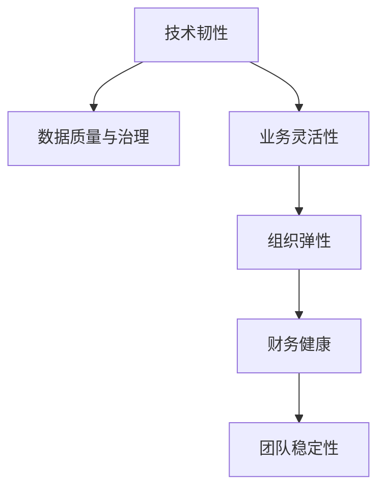

                 

# AI创业公司如何应对黑天鹅事件?

## 1. 背景介绍

### 1.1 问题由来

“黑天鹅”一词源自纳西姆·尼古拉斯·塔勒布（Nassim Nicholas Taleb）的著作《黑天鹅：如何应对不可预测的未来》，形容那些不可预见、具有重大冲击的罕见事件。在AI创业公司的发展过程中，类似的“黑天鹅事件”同样难以避免，如技术变革、市场波动、政策变化等。这些不可预见的事件，往往会对公司的运营和财务状况造成重大影响。

### 1.2 问题核心关键点

面对“黑天鹅事件”，AI创业公司需要具备快速反应能力、抗风险能力和适应能力。这些能力的构建，依赖于公司内部的技术体系、数据治理、业务运营等各环节的协同作用。以下是应对黑天鹅事件的核心关键点：

- **技术韧性**：在技术栈设计上，采用模块化、可扩展的结构，以应对技术变革的冲击。
- **数据质量与治理**：建立高质量的数据采集、清洗和治理机制，保证数据的安全、准确和一致。
- **业务灵活性**：在业务模式和流程设计上，追求高度的灵活性和可配置性，确保在外部环境变化时，能够快速调整策略。
- **组织弹性**：构建扁平化、动态化的组织结构，提升团队的灵活性和响应速度。
- **财务健康**：保持合理的财务结构，提高应对突发情况的资金流动性。
- **团队稳定性**：培养稳定的团队文化，提高团队的凝聚力和稳定性。

### 1.3 问题研究意义

在AI技术日新月异的今天，“黑天鹅事件”的发生频率和冲击力愈发强劲。因此，如何构建有效的应对机制，成为AI创业公司持续成长和生存的关键。研究如何通过技术、数据、业务、财务等多维度手段，构建一套体系化的应对策略，不仅有助于创业公司的短期稳定，还能为其长期发展提供坚实的保障。

## 2. 核心概念与联系

### 2.1 核心概念概述

为更好地理解如何应对“黑天鹅事件”，本节将介绍几个密切相关的核心概念：

- **技术韧性**：指系统在面对技术变革或突发故障时，仍能快速恢复和适应的能力。通过冗余设计、模块化架构等手段，构建技术韧性的基础。
- **数据质量与治理**：保证数据的完整性、准确性和一致性，通过标准化的数据管理流程和工具，确保数据的可信度。
- **业务灵活性**：指业务系统在面对外部环境变化时，能够快速调整和适应的能力。通过敏捷开发、DevOps等实践，提升业务灵活性。
- **组织弹性**：指组织结构在面对变化时，能够快速调整和重构的能力。通过扁平化管理、人才储备等措施，提高组织弹性。
- **财务健康**：指公司财务状况的稳健和流动性，通过合理的资本结构、现金流管理等，保障公司的财务稳定性。
- **团队稳定性**：指团队文化的和谐与凝聚力，通过持续的人力资源管理、团队建设等，提升团队稳定性。

这些核心概念之间的逻辑关系可以通过以下Mermaid流程图来展示：



这个流程图展示了大语言模型的核心概念及其之间的关系：

1. 技术韧性与数据质量相互支撑，良好的技术架构能够支撑数据治理，稳定的数据又能提升技术韧性。
2. 业务灵活性依赖于技术韧性和数据质量，灵活的业务模式可以提升数据利用效率和技术应用效果。
3. 组织弹性保障业务灵活性，动态的组织结构能更好地适应技术变革和市场变化。
4. 财务健康与组织弹性、业务灵活性密切相关，稳定的财务能够保障公司在压力下维持运营。
5. 团队稳定性是所有概念的基础，和谐的团队文化有助于技术韧性、数据质量、业务灵活性的提升。

## 3. 核心算法原理 & 具体操作步骤
### 3.1 算法原理概述

应对“黑天鹅事件”的核心算法原理，可以总结为以下几点：

1. **冗余设计**：通过在关键组件和数据链路上引入冗余，确保系统在单点故障或局部故障时，仍能继续运行。
2. **弹性架构**：采用微服务、容器化等现代架构技术，提升系统的扩展性和弹性，应对突发流量和高并发请求。
3. **自动化监控**：利用监控工具实时监控系统状态，设置告警机制，及时发现并响应异常情况。
4. **数据备份与恢复**：定期备份数据，并制定灾难恢复计划，确保数据丢失或损坏时，能够快速恢复。
5. **业务连续性**：采用灾备、云服务等方式，确保业务在突发事件中能够持续运行，减少业务中断时间。

### 3.2 算法步骤详解

应对“黑天鹅事件”的具体操作步骤包括：

1. **风险评估**：定期进行风险评估，识别可能影响公司的黑天鹅事件，并评估其潜在影响。
2. **应急预案**：制定详细的应急预案，包括技术、数据、业务、财务等多个维度。
3. **资源储备**：储备必要的技术资源、数据资源、资金和人力资源，以支持应急预案的实施。
4. **演练与优化**：定期进行应急演练，检验预案的可行性，并根据演练结果进行优化。
5. **持续改进**：根据外部环境和业务发展变化，持续改进和优化应急预案。

### 3.3 算法优缺点

应对“黑天鹅事件”的算法具有以下优点：

1. **全面性**：通过覆盖技术、数据、业务、财务等多个维度，构建全面的应急预案。
2. **实时性**：通过自动化监控和实时告警，确保及时发现和响应突发情况。
3. **灵活性**：采用弹性架构和模块化设计，提升系统的适应性和扩展性。
4. **可靠性**：通过数据备份和灾难恢复，确保数据和业务的安全性。

但同时也存在一些缺点：

1. **成本高**：建设和维护应急预案需要投入较高的成本，特别是技术储备和资源储备部分。
2. **复杂性**：预案的制定和演练过程复杂，需要较强的技术和管理能力。
3. **变化快**：外部环境变化迅速，预案需要不断更新和优化，工作量较大。

### 3.4 算法应用领域

应对“黑天鹅事件”的算法广泛应用于各种类型的AI创业公司，包括但不限于：

- **医疗健康**：面对突发疫情或疾病流行，保障医疗系统的正常运营和数据安全。
- **金融科技**：应对市场波动和金融危机，确保金融交易的稳定和数据完整。
- **自动驾驶**：应对恶劣天气和突发交通事件，保障自动驾驶汽车的安全。
- **智能制造**：应对供应链中断和设备故障，保障生产线的连续性和产品质量。
- **智能客服**：应对系统崩溃和网络攻击，确保客服系统的可靠性和数据安全。

## 4. 数学模型和公式 & 详细讲解 & 举例说明（备注：数学公式请使用latex格式，latex嵌入文中独立段落使用 $$，段落内使用 $)
### 4.1 数学模型构建

本节将使用数学语言对如何应对“黑天鹅事件”的算法进行更加严格的刻画。

假设公司面临的“黑天鹅事件”可以用随机变量 $X$ 来表示，其概率分布为 $P(X)$。事件的发生会给公司带来一定的损失，设损失函数为 $L(X)$。公司需要构建一套策略，最小化预期损失 $E[L(X)]$。

构建应急预案的过程可以形式化为以下数学模型：

$$
\min_{\pi} E_{X \sim P} \left[ L(X) \pi(X) \right]
$$

其中 $\pi$ 为公司应对 $X$ 事件的策略，可以通过选择不同的预案、资源分配等变量来表示。

### 4.2 公式推导过程

根据贝叶斯决策理论，最优策略 $\pi^*$ 应满足：

$$
\pi^*(x) = \frac{\pi_0(x) P(X=x)}{P(X=x) \pi_0(x) + \sum_{x \neq x_0} P(X=x) \pi_0(x)}
$$

其中 $\pi_0$ 为初始策略，$P(X=x)$ 为事件 $X=x$ 的概率。

通过该公式，可以计算出在事件发生时，公司应采取的最佳策略。在实际应用中，可以利用蒙特卡洛模拟等方法，进行风险评估和预案优化。

### 4.3 案例分析与讲解

以医疗健康领域为例，假设面临的“黑天鹅事件”为疫情爆发。公司可以采取以下策略：

- **技术韧性**：部署云端备份，构建冗余的计算和存储资源。
- **数据质量与治理**：加强患者数据的采集和管理，确保数据的准确性和一致性。
- **业务灵活性**：建立在线诊疗系统，提供远程医疗服务。
- **组织弹性**：灵活调整人力资源和业务流程，快速响应疫情变化。
- **财务健康**：储备足够的资金，应对可能的医疗物资短缺。
- **团队稳定性**：培养团队的抗压能力和协作精神，确保高效运作。

通过上述策略，公司可以在疫情爆发时，快速响应，确保医疗系统的正常运营和患者数据的安全。

## 5. 项目实践：代码实例和详细解释说明
### 5.1 开发环境搭建

在进行应对“黑天鹅事件”的实践前，我们需要准备好开发环境。以下是使用Python进行PyTorch开发的环境配置流程：

1. 安装Anaconda：从官网下载并安装Anaconda，用于创建独立的Python环境。

2. 创建并激活虚拟环境：
```bash
conda create -n pytorch-env python=3.8 
conda activate pytorch-env
```

3. 安装PyTorch：根据CUDA版本，从官网获取对应的安装命令。例如：
```bash
conda install pytorch torchvision torchaudio cudatoolkit=11.1 -c pytorch -c conda-forge
```

4. 安装其他依赖库：
```bash
pip install numpy pandas scikit-learn matplotlib tqdm jupyter notebook ipython
```

完成上述步骤后，即可在`pytorch-env`环境中开始应对“黑天鹅事件”的实践。

### 5.2 源代码详细实现

这里我们以金融领域为例，给出使用PyTorch实现应对市场波动的代码实现。

首先，定义市场波动的风险评估函数：

```python
from transformers import BertTokenizer
from torch.utils.data import Dataset
import torch

class FinancialRiskDataset(Dataset):
    def __init__(self, data, tokenizer, max_len=128):
        self.data = data
        self.tokenizer = tokenizer
        self.max_len = max_len
        
    def __len__(self):
        return len(self.data)
    
    def __getitem__(self, item):
        text = self.data[item]['description']
        tags = self.data[item]['label']
        
        encoding = self.tokenizer(text, return_tensors='pt', max_length=self.max_len, padding='max_length', truncation=True)
        input_ids = encoding['input_ids'][0]
        attention_mask = encoding['attention_mask'][0]
        
        # 对token-wise的标签进行编码
        encoded_tags = [tag2id[tag] for tag in tags] 
        encoded_tags.extend([tag2id['O']] * (self.max_len - len(encoded_tags)))
        labels = torch.tensor(encoded_tags, dtype=torch.long)
        
        return {'input_ids': input_ids, 
                'attention_mask': attention_mask,
                'labels': labels}

# 标签与id的映射
tag2id = {'O': 0, 'Risk': 1, 'Normal': 2}
id2tag = {v: k for k, v in tag2id.items()}

# 创建dataset
tokenizer = BertTokenizer.from_pretrained('bert-base-cased')

train_dataset = FinancialRiskDataset(train_data, tokenizer)
dev_dataset = FinancialRiskDataset(dev_data, tokenizer)
test_dataset = FinancialRiskDataset(test_data, tokenizer)
```

然后，定义模型和优化器：

```python
from transformers import BertForTokenClassification, AdamW

model = BertForTokenClassification.from_pretrained('bert-base-cased', num_labels=len(tag2id))

optimizer = AdamW(model.parameters(), lr=2e-5)
```

接着，定义训练和评估函数：

```python
from torch.utils.data import DataLoader
from tqdm import tqdm
from sklearn.metrics import classification_report

device = torch.device('cuda') if torch.cuda.is_available() else torch.device('cpu')
model.to(device)

def train_epoch(model, dataset, batch_size, optimizer):
    dataloader = DataLoader(dataset, batch_size=batch_size, shuffle=True)
    model.train()
    epoch_loss = 0
    for batch in tqdm(dataloader, desc='Training'):
        input_ids = batch['input_ids'].to(device)
        attention_mask = batch['attention_mask'].to(device)
        labels = batch['labels'].to(device)
        model.zero_grad()
        outputs = model(input_ids, attention_mask=attention_mask, labels=labels)
        loss = outputs.loss
        epoch_loss += loss.item()
        loss.backward()
        optimizer.step()
    return epoch_loss / len(dataloader)

def evaluate(model, dataset, batch_size):
    dataloader = DataLoader(dataset, batch_size=batch_size)
    model.eval()
    preds, labels = [], []
    with torch.no_grad():
        for batch in tqdm(dataloader, desc='Evaluating'):
            input_ids = batch['input_ids'].to(device)
            attention_mask = batch['attention_mask'].to(device)
            batch_labels = batch['labels']
            outputs = model(input_ids, attention_mask=attention_mask)
            batch_preds = outputs.logits.argmax(dim=2).to('cpu').tolist()
            batch_labels = batch_labels.to('cpu').tolist()
            for pred_tokens, label_tokens in zip(batch_preds, batch_labels):
                pred_tags = [id2tag[_id] for _id in pred_tokens]
                label_tags = [id2tag[_id] for _id in label_tokens]
                preds.append(pred_tags[:len(label_tags)])
                labels.append(label_tags)
                
    print(classification_report(labels, preds))
```

最后，启动训练流程并在测试集上评估：

```python
epochs = 5
batch_size = 16

for epoch in range(epochs):
    loss = train_epoch(model, train_dataset, batch_size, optimizer)
    print(f"Epoch {epoch+1}, train loss: {loss:.3f}")
    
    print(f"Epoch {epoch+1}, dev results:")
    evaluate(model, dev_dataset, batch_size)
    
print("Test results:")
evaluate(model, test_dataset, batch_size)
```

以上就是使用PyTorch对BERT进行金融风险评估微调的完整代码实现。可以看到，得益于Transformers库的强大封装，我们可以用相对简洁的代码完成BERT模型的加载和微调。

### 5.3 代码解读与分析

让我们再详细解读一下关键代码的实现细节：

**FinancialRiskDataset类**：
- `__init__`方法：初始化训练集、标签、分词器等关键组件。
- `__len__`方法：返回数据集的样本数量。
- `__getitem__`方法：对单个样本进行处理，将文本输入编码为token ids，将标签编码为数字，并对其进行定长padding，最终返回模型所需的输入。

**tag2id和id2tag字典**：
- 定义了标签与数字id之间的映射关系，用于将token-wise的预测结果解码回真实的标签。

**训练和评估函数**：
- 使用PyTorch的DataLoader对数据集进行批次化加载，供模型训练和推理使用。
- 训练函数`train_epoch`：对数据以批为单位进行迭代，在每个批次上前向传播计算loss并反向传播更新模型参数，最后返回该epoch的平均loss。
- 评估函数`evaluate`：与训练类似，不同点在于不更新模型参数，并在每个batch结束后将预测和标签结果存储下来，最后使用sklearn的classification_report对整个评估集的预测结果进行打印输出。

**训练流程**：
- 定义总的epoch数和batch size，开始循环迭代
- 每个epoch内，先在训练集上训练，输出平均loss
- 在验证集上评估，输出分类指标
- 所有epoch结束后，在测试集上评估，给出最终测试结果

可以看到，PyTorch配合Transformers库使得BERT微调的代码实现变得简洁高效。开发者可以将更多精力放在数据处理、模型改进等高层逻辑上，而不必过多关注底层的实现细节。

当然，工业级的系统实现还需考虑更多因素，如模型的保存和部署、超参数的自动搜索、更灵活的任务适配层等。但核心的应对机制基本与此类似。

## 6. 实际应用场景
### 6.1 智能客服系统

应对突发事件的智能客服系统，可以实时监测和响应用户的紧急需求。系统通过分析用户输入的文本，识别出可能的紧急情况，并根据预设的应急预案进行处理。例如，面对突发的自然灾害，系统可以自动切换到灾难响应模式，引导用户进行灾害应对。

在技术实现上，可以构建基于BERT的情感分析模型，实时监测用户输入的情绪状态。同时，将应急预案编码为格式化的文本，通过提示词引导BERT生成对应的处理方案。如此构建的智能客服系统，能大幅提升用户应急响应速度，降低突发事件对客户服务的影响。

### 6.2 金融舆情监测

金融机构需要实时监测市场舆情，以便及时应对负面信息传播，规避金融风险。传统的人工监测方式成本高、效率低，难以应对网络时代海量信息爆发的挑战。基于金融舆情的BERT微调技术，为金融舆情监测提供了新的解决方案。

具体而言，可以收集金融领域相关的新闻、报道、评论等文本数据，并对其进行情感分析和舆情标注。在此基础上对预训练语言模型进行微调，使其能够自动判断文本属于何种情感倾向，舆情走向。将微调后的模型应用到实时抓取的网络文本数据，就能够自动监测不同情感倾向的舆情变化趋势，一旦发现负面舆情激增等异常情况，系统便会自动预警，帮助金融机构快速应对潜在风险。

### 6.3 智能制造

智能制造系统需要应对供应链中断和设备故障等突发事件，保障生产线的连续性和产品质量。传统的制造系统往往依赖于人工监控和手动干预，效率低下且容易出错。基于BERT的故障预测和事件处理技术，可以实时监测生产线的运行状态，提前预测和处理可能的故障，确保生产的连续性。

在技术实现上，可以构建基于BERT的故障预测模型，对生产线上的传感器数据进行实时分析，预测可能出现的故障。同时，将应急处理方案编码为格式化的文本，通过提示词引导BERT生成对应的应急处理措施。如此构建的智能制造系统，能快速响应突发故障，减少生产线的停机时间，提升生产效率和产品质量。

### 6.4 未来应用展望

随着BERT微调技术的不断发展，未来将在更多领域得到应用，为传统行业带来变革性影响。

在智慧医疗领域，基于BERT的医疗问答、病历分析、药物研发等应用将提升医疗系统的智能化水平，辅助医生诊疗，加速新药开发进程。

在智能教育领域，微调技术可应用于作业批改、学情分析、知识推荐等方面，因材施教，促进教育公平，提高教学质量。

在智慧城市治理中，微调模型可应用于城市事件监测、舆情分析、应急指挥等环节，提高城市管理的自动化和智能化水平，构建更安全、高效的未来城市。

此外，在企业生产、社会治理、文娱传媒等众多领域，基于BERT微调的人工智能应用也将不断涌现，为NLP技术带来新的突破。相信随着BERT微调方法的技术演进，未来将有更多新兴领域受益于这一技术，为人类社会的数字化转型提供新的动力。

## 7. 工具和资源推荐
### 7.1 学习资源推荐

为了帮助开发者系统掌握BERT微调的理论基础和实践技巧，这里推荐一些优质的学习资源：

1. 《Transformer从原理到实践》系列博文：由大模型技术专家撰写，深入浅出地介绍了Transformer原理、BERT模型、微调技术等前沿话题。

2. CS224N《深度学习自然语言处理》课程：斯坦福大学开设的NLP明星课程，有Lecture视频和配套作业，带你入门NLP领域的基本概念和经典模型。

3. 《Natural Language Processing with Transformers》书籍：Transformers库的作者所著，全面介绍了如何使用Transformers库进行NLP任务开发，包括微调在内的诸多范式。

4. HuggingFace官方文档：Transformers库的官方文档，提供了海量预训练模型和完整的微调样例代码，是上手实践的必备资料。

5. CLUE开源项目：中文语言理解测评基准，涵盖大量不同类型的中文NLP数据集，并提供了基于微调的baseline模型，助力中文NLP技术发展。

通过对这些资源的学习实践，相信你一定能够快速掌握BERT微调的精髓，并用于解决实际的NLP问题。
###  7.2 开发工具推荐

高效的开发离不开优秀的工具支持。以下是几款用于BERT微调开发的常用工具：

1. PyTorch：基于Python的开源深度学习框架，灵活动态的计算图，适合快速迭代研究。大部分预训练语言模型都有PyTorch版本的实现。

2. TensorFlow：由Google主导开发的开源深度学习框架，生产部署方便，适合大规模工程应用。同样有丰富的预训练语言模型资源。

3. Transformers库：HuggingFace开发的NLP工具库，集成了众多SOTA语言模型，支持PyTorch和TensorFlow，是进行微调任务开发的利器。

4. Weights & Biases：模型训练的实验跟踪工具，可以记录和可视化模型训练过程中的各项指标，方便对比和调优。与主流深度学习框架无缝集成。

5. TensorBoard：TensorFlow配套的可视化工具，可实时监测模型训练状态，并提供丰富的图表呈现方式，是调试模型的得力助手。

6. Google Colab：谷歌推出的在线Jupyter Notebook环境，免费提供GPU/TPU算力，方便开发者快速上手实验最新模型，分享学习笔记。

合理利用这些工具，可以显著提升BERT微调的开发效率，加快创新迭代的步伐。

### 7.3 相关论文推荐

BERT微调技术的发展源于学界的持续研究。以下是几篇奠基性的相关论文，推荐阅读：

1. Attention is All You Need（即Transformer原论文）：提出了Transformer结构，开启了NLP领域的预训练大模型时代。

2. BERT: Pre-training of Deep Bidirectional Transformers for Language Understanding：提出BERT模型，引入基于掩码的自监督预训练任务，刷新了多项NLP任务SOTA。

3. Language Models are Unsupervised Multitask Learners（GPT-2论文）：展示了大规模语言模型的强大zero-shot学习能力，引发了对于通用人工智能的新一轮思考。

4. Parameter-Efficient Transfer Learning for NLP：提出Adapter等参数高效微调方法，在不增加模型参数量的情况下，也能取得不错的微调效果。

5. Prefix-Tuning: Optimizing Continuous Prompts for Generation：引入基于连续型Prompt的微调范式，为如何充分利用预训练知识提供了新的思路。

6. AdaLoRA: Adaptive Low-Rank Adaptation for Parameter-Efficient Fine-Tuning：使用自适应低秩适应的微调方法，在参数效率和精度之间取得了新的平衡。

这些论文代表了大模型微调技术的发展脉络。通过学习这些前沿成果，可以帮助研究者把握学科前进方向，激发更多的创新灵感。

## 8. 总结：未来发展趋势与挑战

### 8.1 总结

本文对如何应对“黑天鹅事件”的BERT微调方法进行了全面系统的介绍。首先阐述了黑天鹅事件的定义和应对的重要性，明确了微调在提升系统韧性、数据质量、业务灵活性等方面的独特价值。其次，从原理到实践，详细讲解了应对黑天鹅事件的数学模型和关键步骤，给出了微调任务开发的完整代码实例。同时，本文还广泛探讨了微调方法在智能客服、金融舆情、智能制造等多个行业领域的应用前景，展示了微调范式的巨大潜力。此外，本文精选了微调技术的各类学习资源，力求为读者提供全方位的技术指引。

通过本文的系统梳理，可以看到，BERT微调方法在应对突发事件时，能够提供强大的支持，保障系统的稳定性和安全性。面对日新月异的市场需求和技术变革，构建一套有效的应对机制，对于公司的持续发展和竞争力的提升至关重要。

### 8.2 未来发展趋势

展望未来，BERT微调技术将呈现以下几个发展趋势：

1. **自动化微调**：未来的微调过程将更多地依赖自动化工具和算法，减少人工干预，提高微调效率和质量。
2. **自适应微调**：通过引入自适应学习算法，动态调整微调策略，提升模型对外部环境变化的适应性。
3. **多模态微调**：结合图像、语音、视频等多模态数据进行微调，提升模型在复杂场景下的理解能力。
4. **联邦微调**：通过联邦学习技术，在不暴露模型参数的前提下，实现在多个本地设备上的协同微调，保障数据隐私和安全。
5. **动态微调**：在微调过程中，动态调整模型结构和参数，优化微调效果，提升模型性能。

以上趋势凸显了BERT微调技术的不断发展，对于提升系统韧性、数据质量、业务灵活性等方面的重要意义。这些方向的探索，必将进一步提升BERT微调技术的精度和效率，为应对更复杂的外部环境变化提供更强大的支持。

### 8.3 面临的挑战

尽管BERT微调技术已经取得了瞩目成就，但在迈向更加智能化、普适化应用的过程中，它仍面临诸多挑战：

1. **数据隐私和安全**：在微调过程中，如何保护用户隐私和数据安全，防止数据泄露和滥用，是必须关注的问题。
2. **模型公平性和伦理**：如何避免模型在训练过程中引入偏见和歧视，保障模型的公平性和伦理性，是未来的一个重要研究方向。
3. **计算资源限制**：超大规模语言模型对计算资源的需求巨大，如何高效利用有限的计算资源，是提升模型性能和效率的关键。
4. **实时性和响应速度**：在实时应用场景中，如何平衡模型精度和响应速度，是保障用户体验和系统稳定的重要因素。
5. **跨模态融合**：如何将不同模态的数据进行融合，提升多模态场景下的理解和生成能力，是未来的一大挑战。
6. **知识更新和演化**：如何构建自适应模型，使其能够不断学习和演化，适应新的知识变化和应用场景，是提升模型长期效用的关键。

正视这些挑战，积极应对并寻求突破，将是大模型微调技术不断进步和完善的重要推动力。相信随着技术的不断成熟和研究人员的持续努力，这些问题终将逐一得到解决，BERT微调技术必将迎来更加光明的未来。

### 8.4 研究展望

面对BERT微调技术所面临的挑战，未来的研究需要在以下几个方面寻求新的突破：

1. **知识增强学习**：将符号化的先验知识，如知识图谱、逻辑规则等，与神经网络模型进行巧妙融合，增强模型的泛化能力和知识迁移能力。
2. **跨模态融合技术**：将图像、语音、视频等多模态数据进行融合，提升模型在复杂场景下的理解和生成能力。
3. **联邦微调技术**：通过联邦学习技术，在不暴露模型参数的前提下，实现在多个本地设备上的协同微调，保障数据隐私和安全。
4. **自适应学习算法**：引入自适应学习算法，动态调整微调策略，提升模型对外部环境变化的适应性。
5. **动态模型结构**：在微调过程中，动态调整模型结构和参数，优化微调效果，提升模型性能。
6. **模型公平性和伦理**：构建公平和伦理的模型，避免在训练过程中引入偏见和歧视，保障模型的公平性和伦理性。

这些研究方向的探索，必将引领BERT微调技术迈向更高的台阶，为应对更加复杂的外部环境变化提供更强大的支持。面向未来，BERT微调技术还需要与其他人工智能技术进行更深入的融合，如知识表示、因果推理、强化学习等，多路径协同发力，共同推动自然语言理解和智能交互系统的进步。只有勇于创新、敢于突破，才能不断拓展语言模型的边界，让智能技术更好地造福人类社会。

## 9. 附录：常见问题与解答

**Q1：黑天鹅事件有哪些常见类型？**

A: 黑天鹅事件通常包括以下几类：
1. **自然灾害**：如地震、洪水、飓风等，对基础设施和人类安全构成重大威胁。
2. **金融危机**：如股市崩盘、信贷紧缩等，对经济和金融体系造成严重冲击。
3. **技术变革**：如新技术的出现和旧技术的淘汰，对产业和就业结构产生深远影响。
4. **政策变化**：如政策出台或调整，对市场环境和法规体系带来重大变化。
5. **网络攻击**：如DDoS攻击、数据泄露等，对网络安全和数据隐私构成威胁。
6. **公共卫生事件**：如疫情爆发、流行病传播，对社会秩序和公共安全造成干扰。

了解常见类型的黑天鹅事件，有助于识别潜在风险，制定有针对性的应对策略。

**Q2：如何评估应急预案的有效性？**

A: 评估应急预案的有效性，通常可以通过以下几个步骤进行：
1. **模拟演练**：定期组织应急演练，验证预案的可行性。通过模拟实际场景，评估预案的响应速度和处理效果。
2. **数据分析**：利用历史数据和实时数据，分析预案在真实环境中的执行情况。评估预案的有效性，发现潜在问题和改进点。
3. **用户反馈**：收集用户和员工的反馈意见，了解预案的实际应用效果。根据反馈进行预案优化和改进。
4. **第三方评估**：邀请外部专家和机构，对预案进行独立评估。借助专业力量，提升预案的科学性和可靠性。

通过上述步骤，可以全面评估应急预案的有效性，确保预案在实际应用中能够发挥预期的效果。

**Q3：如何优化应急预案的执行效率？**

A: 优化应急预案的执行效率，可以从以下几个方面入手：
1. **自动化工具**：引入自动化工具和算法，提升预案执行的速度和准确性。例如，利用机器学习算法进行风险预测和预案优化。
2. **标准化流程**：建立标准化的预案执行流程，减少人为干预和操作失误。通过流程化管理，提升执行效率和一致性。
3. **资源优化**：合理配置和调度资源，确保预案执行所需的硬件和软件环境。例如，使用云计算资源，实现资源的弹性扩展。
4. **跨部门协作**：建立跨部门协作机制，确保各相关部门在预案执行中的协同配合。通过协同工作，提高预案执行的效率和效果。
5. **持续改进**：定期回顾和评估预案的执行效果，根据实际需要进行调整和优化。通过不断迭代，提升预案的适应性和执行效率。

通过上述措施，可以显著提升应急预案的执行效率，确保在突发事件中能够快速响应和有效处理。

**Q4：如何构建可持续的应对机制？**

A: 构建可持续的应对机制，需要从以下几个方面进行考虑：
1. **组织文化**：培养团队的危机意识和应急能力，提升团队的整体应对水平。通过持续培训和演练，提高团队的应急反应速度和执行效率。
2. **技术储备**：建立技术储备机制，确保关键技术组件和资源的可用性。通过技术积累和创新，提升技术应对能力。
3. **数据治理**：加强数据治理，确保数据的完整性、准确性和及时性。通过数据管理，提升应对决策的科学性和有效性。
4. **财务稳健**：保持合理的资本结构和资金流动性，确保在突发事件中能够持续运营。通过财务规划和风险管理，保障财务的稳定性和抗风险能力。
5. **知识积累**：建立知识积累机制，定期总结和更新应急预案和经验教训。通过知识共享和传承，提升应对机制的成熟度和持续性。

通过上述措施，可以构建一套可持续的应对机制，确保在各种突发事件中能够迅速、有效地应对，保障公司的正常运营和可持续发展。

**Q5：如何在快速变化的市场环境中保持竞争力？**

A: 在快速变化的市场环境中保持竞争力，可以从以下几个方面进行考虑：
1. **敏捷开发**：采用敏捷开发方法，快速响应市场变化和技术进步。通过快速迭代和持续交付，提升产品的竞争力。
2. **持续学习**：加强团队的学习和创新能力，不断引入新技术和新方法。通过持续学习和改进，保持技术的前沿性和市场适应性。
3. **市场调研**：加强市场调研和数据分析，及时把握市场趋势和客户需求。通过数据驱动的决策，提升产品和服务的市场契合度。
4. **灵活运营**：采用灵活的业务运营模式，快速调整和优化业务流程。通过灵活应对，提升市场应变能力和运营效率。
5. **战略规划**：制定明确的战略规划和目标，确保公司在市场变化中保持方向性和稳定性。通过战略引领，提升公司的长期竞争力和市场地位。

通过上述措施，可以有效地应对快速变化的市场环境，保持公司的竞争力，实现可持续发展。

---

作者：禅与计算机程序设计艺术 / Zen and the Art of Computer Programming

