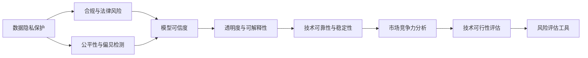

                 

## 1. 背景介绍

### 1.1 问题由来
在快速发展的AI领域中，创业公司层出不穷。然而，AI创业面临的风险与挑战也是前所未有的。市场竞争激烈、技术快速迭代、数据隐私保护、模型可信度等都是创业公司需要考虑的重要因素。如何对AI项目进行全面的风险评估，是决定公司成败的关键。

### 1.2 问题核心关键点
AI创业公司进行风险评估的核心在于全面考虑技术、市场、合规、伦理等多个维度，识别潜在风险，并采取有效措施予以应对。这些关键点包括但不限于：

- **技术可行性评估**：评估模型是否能在特定场景下表现稳定，是否具备可扩展性和灵活性。
- **市场竞争力分析**：分析公司所处市场的规模、增长趋势、竞争格局以及自身技术优势。
- **合规与法律风险**：确保AI系统遵守相关法律法规，如数据隐私保护、知识产权等。
- **伦理与偏见问题**：确保AI系统在决策过程中不存在歧视性、误导性，并保护用户隐私。
- **技术可靠性与稳定性**：评估AI系统的鲁棒性、可解释性、安全性等。

### 1.3 问题研究意义
风险评估在AI创业公司中具有重要的战略意义：

1. **决策支持**：提供基于数据的决策依据，帮助公司评估投资机会和业务方向。
2. **风险规避**：及时发现并解决潜在风险，避免因风险失控而造成重大损失。
3. **客户信任**：确保产品符合用户需求和期望，提升用户满意度和忠诚度。
4. **竞争力提升**：通过全面评估和优化，增强公司在市场中的竞争力。

## 2. 核心概念与联系

### 2.1 核心概念概述

为了更好地理解AI创业公司进行风险评估的流程和方法，本节将介绍几个密切相关的核心概念：

- **风险评估**：通过一系列评估步骤和工具，对AI项目可能面临的各种风险进行识别、分析和排序，并提出相应的应对策略。
- **数据隐私保护**：保护用户数据不被未授权访问和滥用，遵循GDPR等法律法规。
- **模型可信度**：评估AI模型的预测能力和可靠性，确保其输出结果可信。
- **公平性与偏见检测**：识别模型中可能存在的歧视性偏见，确保公平性。
- **透明度与可解释性**：使AI系统的决策过程透明、可解释，便于用户理解和使用。

这些核心概念之间相互关联，构成了AI创业公司风险评估的基础框架。通过理解这些概念，可以更好地把握风险评估的脉络和方法。

### 2.2 核心概念原理和架构的 Mermaid 流程图



这个流程图展示了AI创业公司风险评估的核心步骤和关键要素，以及它们之间的逻辑关系。

## 3. 核心算法原理 & 具体操作步骤

### 3.1 算法原理概述

AI创业公司的风险评估通常包括以下几个关键步骤：

1. **数据收集与预处理**：收集与项目相关的各种数据，并进行清洗、标注等预处理工作。
2. **模型评估与测试**：使用各种评估指标和方法，评估模型性能和可靠性。
3. **市场分析与竞争力评估**：分析市场规模、增长趋势、竞争格局，评估自身技术优势和市场地位。
4. **法律合规与隐私保护**：确保项目遵守相关法律法规，保护用户数据隐私。
5. **公平性与偏见检测**：识别模型中的歧视性偏见，确保模型的公平性。
6. **透明度与可解释性分析**：确保AI系统的决策过程透明、可解释。
7. **风险识别与应对策略**：识别潜在风险，提出相应的风险应对策略。

### 3.2 算法步骤详解

**Step 1: 数据收集与预处理**

- 收集与项目相关的各种数据，包括用户数据、市场数据、技术数据等。
- 进行数据清洗和标注工作，确保数据质量。
- 对数据进行预处理，如归一化、分词、特征工程等。

**Step 2: 模型评估与测试**

- 使用各种评估指标和方法，如准确率、召回率、F1分数、ROC曲线等，评估模型性能。
- 进行交叉验证和超参数调优，提高模型泛化能力。
- 在测试集上测试模型，评估其在新数据上的表现。

**Step 3: 市场分析与竞争力评估**

- 分析市场规模、增长趋势、竞争格局，识别市场机会和威胁。
- 评估自身技术优势和市场地位，制定市场策略。

**Step 4: 法律合规与隐私保护**

- 确保项目遵守相关法律法规，如GDPR等，保护用户数据隐私。
- 使用数据匿名化、加密等技术手段，保护数据安全。

**Step 5: 公平性与偏见检测**

- 识别模型中可能存在的歧视性偏见，如性别偏见、种族偏见等。
- 通过公平性评估工具，如 fairnessdetect、Bias-Aware AI等，检测和修正模型偏见。

**Step 6: 透明度与可解释性分析**

- 确保AI系统的决策过程透明、可解释。
- 使用可解释性工具，如LIME、SHAP等，分析模型预测过程。

**Step 7: 风险识别与应对策略**

- 识别潜在风险，如技术风险、市场风险、法律风险、伦理风险等。
- 制定相应的风险应对策略，如风险规避、风险转移、风险缓解等。

### 3.3 算法优缺点

AI创业公司风险评估方法具有以下优点：

1. **全面性**：全面覆盖技术、市场、合规、伦理等多个维度，确保评估的全面性。
2. **数据驱动**：通过数据分析和模型评估，提供科学的数据支持。
3. **实时性**：可以及时发现和应对风险，避免风险失控。

同时，该方法也存在一些局限性：

1. **复杂度高**：涉及多个维度和多个步骤，操作复杂。
2. **资源消耗大**：需要大量数据、计算资源和时间。
3. **不确定性**：风险评估和应对策略存在不确定性，可能无法完全消除风险。

尽管存在这些局限性，但总体而言，基于多维度评估的风险评估方法仍然是AI创业公司风险管理的重要手段。未来相关研究的重点在于如何简化评估流程、提高效率，以及如何更好地处理不确定性。

### 3.4 算法应用领域

AI创业公司风险评估方法在多个领域都有广泛应用，包括但不限于：

- **智能医疗**：风险评估涵盖数据隐私、模型可靠性和公平性等方面。
- **金融科技**：风险评估涉及合规、偏见检测和透明度等方面。
- **智能客服**：风险评估涵盖技术可靠性和用户体验等方面。
- **智慧城市**：风险评估涵盖数据隐私、模型公平性和系统鲁棒性等方面。

这些领域的应用展示了风险评估方法的多样性和广泛性。随着AI技术的不断进步，未来风险评估方法将更加自动化和智能化，进一步提升风险管理的效果。

## 4. 数学模型和公式 & 详细讲解 & 举例说明

### 4.1 数学模型构建

假设AI创业公司面临的风险集为 $R$，风险评估过程可以表示为以下数学模型：

$$
Risk(r) = \alpha \cdot DP(r) + \beta \cdot DP(r) + \gamma \cdot F(r) + \delta \cdot P(r)
$$

其中：
- $\alpha$ 为数据隐私保护权重
- $\beta$ 为合规与法律风险权重
- $\gamma$ 为公平性与偏见检测权重
- $\delta$ 为透明度与可解释性权重
- $DP(r)$ 为数据隐私保护评估结果
- $F(r)$ 为公平性与偏见检测结果
- $P(r)$ 为透明度与可解释性评估结果

### 4.2 公式推导过程

以数据隐私保护为例，数据隐私保护评估结果 $DP(r)$ 可以表示为：

$$
DP(r) = \sum_{i=1}^{n} (L_i(r) \cdot W_i)
$$

其中 $n$ 为数据隐私保护维度，$L_i(r)$ 为第 $i$ 个维度的隐私保护评估指标，$W_i$ 为该指标的权重。

对于公平性与偏见检测，可以使用 fairnessdetect 工具进行评估，例如：

$$
F(r) = \frac{\sum_{i=1}^{n} |B_i(r)|}{\sum_{i=1}^{n} C_i(r)}
$$

其中 $n$ 为公平性与偏见检测维度，$B_i(r)$ 为第 $i$ 个维度的偏见检测结果，$C_i(r)$ 为该维度的数据总量。

透明度与可解释性分析通常使用 LIME 或 SHAP 工具进行评估，例如：

$$
P(r) = \sum_{i=1}^{n} (S_i(r) \cdot W_i)
$$

其中 $n$ 为透明度与可解释性维度，$S_i(r)$ 为第 $i$ 个维度的可解释性评估指标，$W_i$ 为该指标的权重。

### 4.3 案例分析与讲解

**案例一：智能医疗系统的风险评估**

智能医疗系统面临的主要风险包括数据隐私保护、模型可信度、公平性等。评估流程如下：

1. **数据隐私保护**：收集用户医疗数据，进行匿名化和加密处理，确保数据隐私。
2. **模型可信度**：使用交叉验证和超参数调优，评估模型性能。
3. **公平性**：识别模型中可能存在的性别、年龄等偏见，确保公平性。
4. **透明度与可解释性**：使用 LIME 工具分析模型预测过程，确保透明度。
5. **风险识别与应对策略**：识别技术风险、法律风险等，制定相应的风险应对策略。

**案例二：金融科技的风险评估**

金融科技项目面临的主要风险包括合规性、偏见检测、透明度等。评估流程如下：

1. **合规性**：确保项目遵守 GDPR 等法律法规，保护用户数据隐私。
2. **偏见检测**：使用 fairnessdetect 工具检测模型中可能存在的性别、种族等偏见。
3. **透明度**：使用 SHAP 工具分析模型预测过程，确保透明度。
4. **风险识别与应对策略**：识别市场风险、法律风险等，制定相应的风险应对策略。

## 5. 项目实践：代码实例和详细解释说明

### 5.1 开发环境搭建

在进行风险评估实践前，需要先搭建好开发环境。以下是使用Python进行Pandas、Scikit-learn等库的环境配置流程：

1. 安装Anaconda：从官网下载并安装Anaconda，用于创建独立的Python环境。
2. 创建并激活虚拟环境：
```bash
conda create -n risk-env python=3.8 
conda activate risk-env
```

3. 安装Pandas、Scikit-learn等各类工具包：
```bash
pip install pandas scikit-learn numpy matplotlib seaborn jupyter notebook ipython
```

完成上述步骤后，即可在`risk-env`环境中开始风险评估实践。

### 5.2 源代码详细实现

这里我们以智能医疗系统的风险评估为例，给出使用Pandas和Scikit-learn库的风险评估代码实现。

```python
import pandas as pd
from sklearn.model_selection import train_test_split
from sklearn.metrics import accuracy_score, roc_auc_score, confusion_matrix
from sklearn.preprocessing import LabelEncoder, OneHotEncoder
from sklearn.linear_model import LogisticRegression
from sklearn.compose import ColumnTransformer
from sklearn.pipeline import Pipeline

# 准备数据
data = pd.read_csv('medical_data.csv')
X = data.drop('label', axis=1)
y = data['label']

# 数据预处理
X = pd.get_dummies(X, columns=['gender', 'age', 'disease'])
X = X.drop(['gender', 'age', 'disease'], axis=1)

# 拆分数据集
X_train, X_test, y_train, y_test = train_test_split(X, y, test_size=0.2, random_state=42)

# 模型评估与测试
model = LogisticRegression()
model.fit(X_train, y_train)
y_pred = model.predict(X_test)
accuracy = accuracy_score(y_test, y_pred)
roc_auc = roc_auc_score(y_test, y_pred)
conf_matrix = confusion_matrix(y_test, y_pred)

# 风险评估报告
risk_report = pd.DataFrame({
    'Accuracy': accuracy,
    'ROC-AUC': roc_auc,
    'Confusion Matrix': conf_matrix
})

# 输出风险评估报告
print(risk_report)
```

以上就是使用Pandas和Scikit-learn库进行智能医疗系统风险评估的完整代码实现。可以看到，风险评估的各个步骤在代码中得到了明确的体现。

### 5.3 代码解读与分析

让我们再详细解读一下关键代码的实现细节：

**数据预处理**：
- 使用`pd.get_dummies`将分类特征转换为哑变量，方便模型处理。
- 使用`drop`方法移除不再需要的列，提高数据质量。

**模型评估与测试**：
- 使用`train_test_split`拆分数据集，确保模型的泛化能力。
- 使用`LogisticRegression`模型进行训练和测试，评估模型性能。
- 使用`accuracy_score`、`roc_auc_score`、`confusion_matrix`等指标评估模型效果。

**风险评估报告**：
- 将评估结果封装成DataFrame，方便查看和输出。
- 使用`print`函数输出风险评估报告。

**风险评估报告**：
- 包括准确率、AUC、混淆矩阵等关键指标，帮助决策者全面了解模型表现。

以上代码展示了风险评估的基本流程和方法，但实际应用中还需根据具体项目需求，进一步优化数据预处理、模型选择和评估指标等环节。

## 6. 实际应用场景

### 6.1 智能医疗系统

智能医疗系统通过风险评估，可以确保数据隐私、模型可信度和公平性，提升医疗服务的质量和安全性。

**应用场景**：
- **数据隐私保护**：使用数据匿名化和加密技术，保护患者隐私。
- **模型可信度**：通过交叉验证和超参数调优，确保模型预测的可靠性。
- **公平性**：检测模型中的性别、年龄等偏见，确保公平性。
- **透明度与可解释性**：使用可解释性工具分析模型预测过程，确保透明度。

**效果**：
- **提升医疗质量**：确保数据隐私和模型公平性，提升患者信任和满意度。
- **降低风险**：通过全面风险评估，减少医疗纠纷和法律风险。

### 6.2 金融科技

金融科技项目通过风险评估，可以确保合规性、偏见检测和透明度，提升金融服务的可靠性和安全性。

**应用场景**：
- **合规性**：确保项目遵守GDPR等法律法规，保护用户数据隐私。
- **偏见检测**：使用 fairnessdetect 工具检测模型中的性别、种族等偏见。
- **透明度**：使用 SHAP 工具分析模型预测过程，确保透明度。

**效果**：
- **降低风险**：确保项目合规性，减少法律纠纷和数据泄露风险。
- **提升服务质量**：通过公平性和透明度分析，提高用户满意度和信任度。

### 6.3 智能客服系统

智能客服系统通过风险评估，可以确保技术可靠性和用户体验，提升客服服务的质量和效率。

**应用场景**：
- **技术可靠性**：评估模型在新样本上的表现，确保技术可靠性。
- **用户体验**：确保模型的预测结果符合用户期望，提升用户满意度。

**效果**：
- **提升服务效率**：通过全面风险评估，减少用户等待时间和服务失败率。
- **增强用户信任**：通过技术可靠性和用户体验评估，提升用户信任和满意度。

### 6.4 未来应用展望

随着AI技术的不断进步，风险评估方法将更加自动化和智能化，进一步提升风险管理的效果。

**展望**：
- **自动化**：引入自动化工具和算法，提高风险评估的效率和准确性。
- **智能化**：使用机器学习和深度学习技术，提升风险评估的智能化水平。
- **实时化**：实现实时风险监测和预警，及时发现和应对风险。

**应用领域**：
- **智能医疗**：实现实时风险监测，确保数据隐私和模型公平性。
- **金融科技**：实时监测市场动态和风险变化，及时调整策略。
- **智能客服**：实时评估系统性能和用户反馈，提升服务质量。
- **智慧城市**：实时监测系统运行状态，提升城市管理水平。

## 7. 工具和资源推荐

### 7.1 学习资源推荐

为了帮助开发者系统掌握AI创业公司风险评估的理论基础和实践技巧，这里推荐一些优质的学习资源：

1. **《人工智能安全》系列博文**：由AI安全专家撰写，深入浅出地介绍了AI项目中可能面临的各种风险和应对策略。
2. **Kaggle AI竞赛**：参与Kaggle竞赛，通过实际项目了解风险评估的实践方法。
3. **Coursera《数据隐私与伦理》课程**：斯坦福大学开设的课程，涵盖数据隐私保护和伦理方面的基础知识。
4. **《公平性与偏见检测》书籍**：介绍如何检测和修正模型中的偏见，确保模型公平性。
5. **HuggingFace官方文档**：提供丰富的预训练模型和风险评估样例代码，是上手实践的必备资料。

通过对这些资源的学习实践，相信你一定能够快速掌握AI创业公司风险评估的精髓，并用于解决实际的AI项目问题。

### 7.2 开发工具推荐

高效的开发离不开优秀的工具支持。以下是几款用于AI风险评估开发的常用工具：

1. **Pandas**：数据处理和分析库，支持数据的清洗、筛选和统计分析。
2. **Scikit-learn**：机器学习库，支持模型的训练、评估和调优。
3. **TensorFlow**：深度学习库，支持复杂模型的构建和训练。
4. **Weights & Biases**：模型训练的实验跟踪工具，可以记录和可视化模型训练过程中的各项指标。
5. **TensorBoard**：深度学习模型的可视化工具，提供丰富的图表呈现方式。
6. **Google Colab**：在线Jupyter Notebook环境，免费提供GPU/TPU算力，方便开发者快速上手实验。

合理利用这些工具，可以显著提升AI创业公司风险评估任务的开发效率，加快创新迭代的步伐。

### 7.3 相关论文推荐

AI创业公司风险评估技术的发展源于学界的持续研究。以下是几篇奠基性的相关论文，推荐阅读：

1. **《数据隐私保护技术综述》**：全面介绍了数据隐私保护技术的发展历程和应用场景。
2. **《公平性与偏见检测方法综述》**：总结了各种偏见检测方法和工具，提供了全面的比较和分析。
3. **《透明性与可解释性评估方法综述》**：详细介绍了各种可解释性评估工具和技术，如LIME、SHAP等。
4. **《智能医疗系统的风险评估》**：讨论了智能医疗系统中的各种风险因素，提出了相应的风险应对策略。
5. **《金融科技的风险评估》**：分析了金融科技项目中的风险评估方法，探讨了合规性、偏见检测和透明度等方面。

这些论文代表了大语言模型微调技术的发展脉络。通过学习这些前沿成果，可以帮助研究者把握学科前进方向，激发更多的创新灵感。

## 8. 总结：未来发展趋势与挑战

### 8.1 总结

本文对AI创业公司进行风险评估的方法进行了全面系统的介绍。首先阐述了风险评估在AI创业中的战略意义，明确了风险评估的各个关键点。其次，从原理到实践，详细讲解了风险评估的数学模型和操作步骤，给出了实际项目中的代码实现和解读。同时，本文还广泛探讨了风险评估方法在智能医疗、金融科技、智能客服等多个领域的应用前景，展示了其广阔的应用范围和巨大潜力。此外，本文精选了风险评估相关的学习资源和开发工具，力求为读者提供全方位的技术指引。

通过本文的系统梳理，可以看到，AI创业公司进行风险评估的方法在多个领域都有广泛应用，为AI项目的成功提供了重要保障。风险评估需要开发者根据具体项目需求，不断迭代和优化模型、数据和算法，方能得到理想的效果。

### 8.2 未来发展趋势

展望未来，AI创业公司风险评估技术将呈现以下几个发展趋势：

1. **自动化**：引入自动化工具和算法，提高风险评估的效率和准确性。
2. **智能化**：使用机器学习和深度学习技术，提升风险评估的智能化水平。
3. **实时化**：实现实时风险监测和预警，及时发现和应对风险。
4. **数据驱动**：通过大数据分析和模型评估，提供科学的数据支持。
5. **跨领域应用**：将风险评估方法应用于更多行业，提升各行业的AI应用水平。

### 8.3 面临的挑战

尽管风险评估方法在AI创业中已经取得了显著成效，但在迈向更加智能化、普适化应用的过程中，仍面临诸多挑战：

1. **复杂度高**：涉及多个维度和多个步骤，操作复杂。
2. **资源消耗大**：需要大量数据、计算资源和时间。
3. **不确定性**：风险评估和应对策略存在不确定性，可能无法完全消除风险。
4. **数据隐私**：如何在保障数据隐私的前提下进行风险评估，是一个重要问题。
5. **公平性**：如何确保模型中的偏见被全面检测和修正，是一个持续挑战。
6. **透明度与可解释性**：如何在保障系统透明度的同时，提升用户信任和满意度。

### 8.4 研究展望

未来的研究需要在以下几个方面寻求新的突破：

1. **自动化评估工具**：开发更加自动化和智能化的评估工具，提高风险评估的效率和准确性。
2. **数据隐私保护**：研究如何在保障数据隐私的前提下进行风险评估，确保用户数据安全。
3. **公平性与偏见检测**：开发更加全面和精准的偏见检测方法，确保模型的公平性。
4. **透明度与可解释性**：研究如何在保障系统透明度的同时，提升用户信任和满意度。
5. **跨领域应用**：将风险评估方法应用于更多行业，提升各行业的AI应用水平。

通过这些研究方向的探索，相信AI创业公司风险评估技术将更加全面、高效，为AI项目的成功提供更加坚实的保障。面向未来，风险评估技术需要与其他AI技术进行更深入的融合，共同推动AI技术的广泛应用和发展。

## 9. 附录：常见问题与解答

**Q1：AI创业公司如何进行风险评估？**

A: AI创业公司进行风险评估，需要全面考虑技术、市场、合规、伦理等多个维度，识别潜在风险，并采取有效措施予以应对。具体步骤包括数据收集与预处理、模型评估与测试、市场分析与竞争力评估、法律合规与隐私保护、公平性与偏见检测、透明度与可解释性分析以及风险识别与应对策略。

**Q2：如何确保AI模型的公平性与偏见检测？**

A: 确保AI模型公平性，可以采取以下措施：
1. 数据收集：确保数据集的多样性和代表性，避免数据偏见。
2. 数据预处理：使用数据清洗和特征工程等技术手段，减少数据中的偏见。
3. 模型训练：使用 fairnessdetect 等工具检测模型中的偏见，调整模型参数。
4. 模型评估：使用公平性评估指标，如准确率、召回率等，评估模型性能。

**Q3：如何提升AI系统的透明度与可解释性？**

A: 提升AI系统的透明度与可解释性，可以采取以下措施：
1. 数据可视化：使用数据可视化工具，展示数据分布和特征关系。
2. 模型可解释性：使用可解释性工具，如LIME、SHAP等，分析模型预测过程。
3. 用户反馈：收集用户反馈，分析用户对系统的理解和满意度。
4. 模型调优：根据用户反馈和评估结果，调整模型参数，提高模型性能。

**Q4：AI创业公司如何进行风险规避？**

A: AI创业公司进行风险规避，可以采取以下措施：
1. 风险识别：全面评估项目中可能存在的风险，识别风险来源和影响范围。
2. 风险评估：使用风险评估工具和方法，评估风险概率和影响程度。
3. 风险应对：制定相应的风险应对策略，如风险规避、风险转移、风险缓解等。
4. 风险监控：实时监测项目运行状态，及时发现和应对风险。

通过这些措施，AI创业公司可以最大限度地规避风险，确保项目的顺利进行和成功实施。

---

作者：禅与计算机程序设计艺术 / Zen and the Art of Computer Programming

