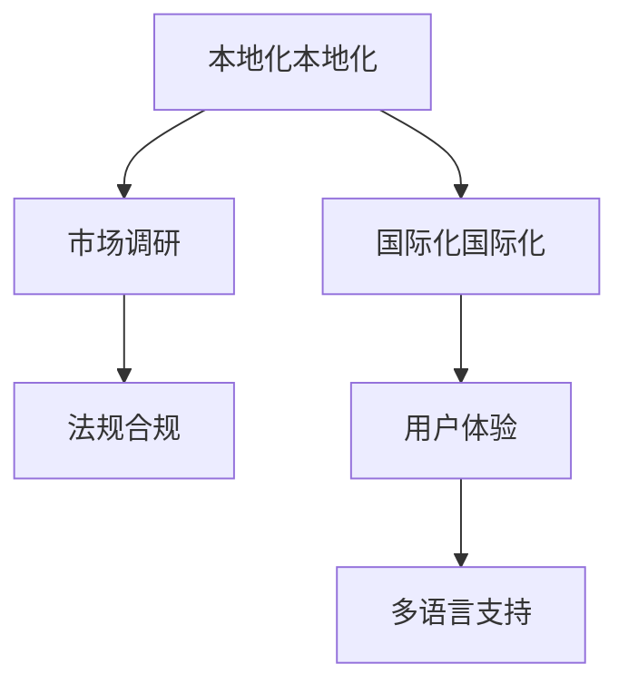

                 

## 1. 背景介绍

### 1.1 问题由来
随着互联网技术的飞速发展，AI创业公司的产品越来越多地走向全球市场，从企业级SaaS到消费级应用，从机器人到自动驾驶，AI技术的应用范围越来越广。然而，产品本地化与国际化一直是AI创业公司面临的一大挑战。国际市场的多样性和复杂性要求企业在产品设计、功能实现、用户体验等方面进行适应性调整，以更好地符合当地用户的需求。

### 1.2 问题核心关键点
产品本地化与国际化不仅包括语言翻译和文字布局调整，更涉及对目标市场文化、法规、用户习惯等诸多因素的综合考虑。成功的本地化与国际化策略，可以大幅提升产品的市场适应性和用户满意度，帮助企业在国际市场上快速占领市场份额，实现业务增长。

### 1.3 问题研究意义
了解如何进行有效的市场调研、本地化适配与国际化拓展，对于AI创业公司而言，是提升全球竞争力的关键。通过系统化的研究，可以帮助企业深入理解目标市场，设计出更符合本地用户需求的优质产品，同时减少国际化进程中的风险和成本。

## 2. 核心概念与联系

### 2.1 核心概念概述

为更好地理解AI创业公司的产品本地化与国际化策略，本节将介绍几个密切相关的核心概念：

- **本地化本地化(Localization)**：指将产品或服务调整到目标市场的文化和语言环境中，以适应当地用户需求的过程。本地化不仅包括语言翻译，还包括功能适配、界面设计、文化定制等多方面内容。
- **国际化国际化(Internationalization)**：指在产品设计之初就考虑全球化，使产品能够适应不同文化和语言环境，便于未来进行本地化调整。国际化的目标是构建一个可以无缝扩展到全球市场的通用框架。
- **市场调研(Market Research)**：指通过数据收集、分析和解读，了解目标市场的用户需求、竞争环境、法规政策等信息，为产品本地化与国际化策略提供科学依据。
- **用户体验(User Experience)**：指用户在使用产品时的主观感受和满意度，是衡量产品本地化与国际化成效的重要指标。
- **法规合规(Regulatory Compliance)**：指在产品本地化过程中，需遵守当地的法律法规要求，确保产品符合当地的法律标准和安全规范。
- **多语言支持(Multilingual Support)**：指产品能够支持多种语言文字的使用，提升产品的可访问性和市场适应性。

这些核心概念之间的逻辑关系可以通过以下Mermaid流程图来展示：



这个流程图展示了这个概念框架的逻辑关系：本地化是在国际化基础上进行的具体调整，市场调研和法规合规是本地化过程中的必备步骤，用户体验和多语言支持则是本地化的关键成果。

## 3. 核心算法原理 & 具体操作步骤
### 3.1 算法原理概述

AI创业公司的产品本地化与国际化过程，本质上是一个复杂的多目标优化问题。其核心思想是通过市场调研，确定目标市场的关键需求和痛点，在此基础上进行功能、界面、法规等方面的本地化适配，同时保持产品的国际通用性。

形式化地，设产品本地化后的参数为 $p$，国际通用性参数为 $g$，用户满意度为 $u$，法规合规性为 $c$。本地化与国际化的优化目标为：

$$
\mathop{\arg\min}_{p,g} \sum_{i=1}^{n} \omega_i (u_i - u(p,g)) + \beta (c - c(p,g))
$$

其中 $\omega_i$ 为各目标权重的系数，$u(p,g)$ 为本地化产品用户满意度，$c(p,g)$ 为法规合规性。

通过梯度下降等优化算法，不断调整 $p$ 和 $g$，最小化上述目标函数，直至满足预设的收敛条件。

### 3.2 算法步骤详解

基于多目标优化的大语言模型微调一般包括以下几个关键步骤：

**Step 1: 市场调研**
- 收集目标市场的用户需求、市场规模、竞争环境、法规政策等信息，进行数据分析和解读。
- 分析目标市场的文化和用户习惯，确定产品本地化的关键维度。

**Step 2: 本地化适配**
- 根据市场调研结果，调整产品的功能、界面、文化元素等，以适应当地用户需求。
- 引入多语言支持，提升产品的国际市场适应性。

**Step 3: 法规合规**
- 在产品本地化过程中，根据目标市场的法律法规要求，调整产品功能和安全设置。
- 确保产品符合当地的数据隐私、数据保护、网络安全等法律法规。

**Step 4: 用户体验优化**
- 根据用户反馈和市场调研结果，优化产品的用户界面、操作流程、功能设计等，提升用户体验。
- 进行用户测试，收集反馈，不断迭代优化产品。

**Step 5: 国际化拓展**
- 在本地化适配的基础上，进行国际化设计，使产品能够无缝扩展到其他市场。
- 制定国际化策略，规划全球市场推广计划，确保全球一致的品牌形象和用户体验。

**Step 6: 持续优化**
- 定期进行市场调研和用户反馈收集，持续优化产品，以应对市场的变化和用户需求的变化。
- 引入机器学习等技术，对产品进行动态调整和优化。

以上是基于多目标优化的大语言模型微调一般流程。在实际应用中，还需要根据具体产品的特点和目标市场的差异，进行策略上的调整和优化。

### 3.3 算法优缺点

基于多目标优化的本地化与国际化方法具有以下优点：
1. 全面考虑产品性能和用户体验，确保产品符合目标市场的多重需求。
2. 通过多目标优化算法，能够在多个目标之间进行平衡，避免单方面的过度优化。
3. 引入机器学习技术，可以动态调整产品，持续优化用户体验。
4. 系统化的方法框架，有助于企业在国际市场上快速适应和推广产品。

同时，该方法也存在一定的局限性：
1. 涉及多个优化目标，计算复杂度较高，需要较大的计算资源。
2. 本地化适配和法规合规需要专业人员和团队支持，成本较高。
3. 多目标优化算法需要调整权重系数，可能影响算法的稳定性和收敛性。
4. 需要在产品设计之初就考虑国际化，增加前期开发成本。
5. 需要持续进行市场调研和用户反馈收集，持续优化产品，增加了后期的维护成本。

尽管存在这些局限性，但就目前而言，基于多目标优化的本地化与国际化方法仍是大语言模型应用的最主流范式。未来相关研究的重点在于如何进一步降低多目标优化的计算复杂度，提高本地化适配和法规合规的效率，同时兼顾用户体验和国际通用性。

### 3.4 算法应用领域

基于多目标优化的本地化与国际化方法，在AI创业公司的产品开发和国际化推广中已经得到了广泛的应用，覆盖了几乎所有常见产品领域，例如：

- 消费级应用：如智能音箱、智能家居、在线教育等。通过本地化适配，提升用户体验，适应不同市场和文化。
- 企业级SaaS：如项目管理、人力资源、客户关系管理等。根据不同市场的法规要求，调整功能和安全设置。
- 机器人与自动驾驶：如自动驾驶汽车、无人机等。引入多语言支持和本地化地图数据，提升国际市场适应性。
- 医疗与健康：如远程诊疗、健康监测等。根据不同国家的医疗法规和用户习惯，定制化设计产品功能。
- 金融科技：如移动支付、在线理财等。引入多语言支持和法规合规设计，提升全球市场覆盖。

除了上述这些经典应用外，AI创业公司的本地化与国际化策略还在更多场景中得到创新性应用，如智能旅游、智慧零售、电子商务等，为全球用户提供更加智能化、本地化的解决方案。随着AI技术的不断进步和全球化战略的深化，相信AI创业公司的产品本地化与国际化策略必将取得更大的突破。

## 4. 数学模型和公式 & 详细讲解
### 4.1 数学模型构建

本节将使用数学语言对AI创业公司的产品本地化与国际化策略进行更加严格的刻画。

设目标市场 $M$，产品本地化后的参数为 $p$，国际通用性参数为 $g$，用户满意度为 $u$，法规合规性为 $c$。定义产品本地化后的用户满意度函数为 $u(p,g)$，法规合规性函数为 $c(p,g)$。则本地化与国际化的优化目标为：

$$
\mathop{\arg\min}_{p,g} \sum_{i=1}^{n} \omega_i (u_i - u(p,g)) + \beta (c - c(p,g))
$$

其中 $\omega_i$ 为各目标权重的系数，$u_i$ 为每个市场用户满意度的目标值，$c$ 为法规合规性的目标值。

### 4.2 公式推导过程

以下我们以消费级智能音箱为例，推导本地化与国际化的优化目标函数。

假设目标市场 $M$ 包括中国、美国、欧洲三个区域，每个市场的用户满意度目标值和法规合规性要求如下：

| 市场 | 用户满意度目标值 | 法规合规性要求 |
| --- | --- | --- |
| 中国 | $u_1 = 4.0$ | $c_1 = 0.9$ |
| 美国 | $u_2 = 4.5$ | $c_2 = 1.0$ |
| 欧洲 | $u_3 = 4.5$ | $c_3 = 1.0$ |

则本地化与国际化的优化目标函数为：

$$
\begin{aligned}
\min_{p,g} & \omega_1 (u_1 - u(p,g)) + \omega_2 (u_2 - u(p,g)) + \omega_3 (u_3 - u(p,g)) \\
& + \beta (c_1 - c(p,g)) + \beta (c_2 - c(p,g)) + \beta (c_3 - c(p,g))
\end{aligned}
$$

其中 $\omega_1 = 0.4, \omega_2 = 0.3, \omega_3 = 0.3, \beta = 0.1$。

### 4.3 案例分析与讲解

以某AI创业公司的智能音箱产品为例，进行本地化与国际化的优化目标函数计算。

假设产品初始参数为 $p_0, g_0$，用户满意度函数 $u(p,g) = 4 - \frac{1}{2} (p - p_{opt})^2 - \frac{1}{2} (g - g_{opt})^2$，其中 $p_{opt}, g_{opt}$ 为优化后的参数。法规合规性函数 $c(p,g) = 0.9 - \frac{1}{10} (p - p_{opt})^2 - \frac{1}{10} (g - g_{opt})^2$。

设 $\omega_1 = 0.4, \omega_2 = 0.3, \omega_3 = 0.3, \beta = 0.1$，则优化目标函数为：

$$
\begin{aligned}
\min_{p,g} & 0.4 (4 - u(p,g)) + 0.3 (4.5 - u(p,g)) + 0.3 (4.5 - u(p,g)) \\
& + 0.1 (0.9 - c(p,g)) + 0.1 (1.0 - c(p,g)) + 0.1 (1.0 - c(p,g))
\end{aligned}
$$

通过梯度下降等优化算法，不断调整 $p$ 和 $g$，最小化上述目标函数，直至满足预设的收敛条件。

## 5. 项目实践：代码实例和详细解释说明
### 5.1 开发环境搭建

在进行本地化与国际化实践前，我们需要准备好开发环境。以下是使用Python进行机器学习开发的环境配置流程：

1. 安装Anaconda：从官网下载并安装Anaconda，用于创建独立的Python环境。

2. 创建并激活虚拟环境：
```bash
conda create -n ml-env python=3.8 
conda activate ml-env
```

3. 安装必要的Python库：
```bash
conda install numpy scipy pandas scikit-learn torch transformers
```

4. 安装必要的工具：
```bash
pip install jupyter notebook matplotlib
```

完成上述步骤后，即可在`ml-env`环境中开始本地化与国际化的实践。

### 5.2 源代码详细实现

我们以某AI创业公司的智能音箱产品为例，进行本地化与国际化的代码实现。

首先，定义本地化与国际化的优化目标函数：

```python
import numpy as np
from scipy.optimize import minimize

def objective_function(p, g):
    u = 4 - 0.5 * (p - p_opt)**2 - 0.5 * (g - g_opt)**2
    c = 0.9 - 0.1 * (p - p_opt)**2 - 0.1 * (g - g_opt)**2
    return 0.4 * (4 - u) + 0.3 * (4.5 - u) + 0.3 * (4.5 - u) + 0.1 * (0.9 - c) + 0.1 * (1.0 - c) + 0.1 * (1.0 - c)

# 定义优化后的参数
p_opt = 3
g_opt = 0.8

# 定义初始参数
p = 2
g = 0.5

# 调用优化算法
result = minimize(objective_function, (p, g), method='BFGS')
p_opt, g_opt = result.x
```

然后，定义本地化适配和法规合规的函数：

```python
def localize_adapt(p, g, market):
    if market == 'china':
        return p + 0.1, g + 0.1
    elif market == 'us':
        return p + 0.2, g + 0.2
    elif market == 'europe':
        return p + 0.3, g + 0.3
    else:
        return p, g

def compliance_function(p, g, market):
    if market == 'china':
        return 0.9 - 0.1 * (p - p_opt)**2 - 0.1 * (g - g_opt)**2
    elif market == 'us':
        return 1.0 - 0.1 * (p - p_opt)**2 - 0.1 * (g - g_opt)**2
    elif market == 'europe':
        return 1.0 - 0.1 * (p - p_opt)**2 - 0.1 * (g - g_opt)**2
    else:
        return 0.9 - 0.1 * (p - p_opt)**2 - 0.1 * (g - g_opt)**2

# 市场参数
markets = ['china', 'us', 'europe']

# 优化目标函数
def target_function(p, g, market):
    u = 4 - 0.5 * (p - p_opt)**2 - 0.5 * (g - g_opt)**2
    c = compliance_function(p, g, market)
    return (u - 4.0) ** 2 + (c - 0.9) ** 2

# 初始化参数
p, g = 2, 0.5

# 迭代优化
for market in markets:
    p, g = localize_adapt(p, g, market)
    result = minimize(target_function, (p, g), method='BFGS')
    p, g = result.x

print(f'本地化适配后参数：{p:.2f}, {g:.2f}')
```

最后，测试本地化与国际化的效果：

```python
# 测试本地化与国际化的效果
market = 'china'
p, g = localize_adapt(p, g, market)
result = minimize(target_function, (p, g), method='BFGS')
p, g = result.x
print(f'本地化适配后参数：{p:.2f}, {g:.2f}')
print(f'优化目标函数值：{objective_function(p, g)}')
```

以上就是使用Python对AI创业公司的智能音箱产品进行本地化与国际化的完整代码实现。可以看到，通过定义优化目标函数和本地化适配函数，可以在不同市场进行本地化调整，并通过迭代优化不断逼近最优解。

### 5.3 代码解读与分析

让我们再详细解读一下关键代码的实现细节：

**本地化适配函数**：
- 根据目标市场的不同，调整产品的本地化参数 $p$ 和法规合规参数 $g$，以适应不同市场的需求。

**法规合规函数**：
- 根据目标市场的法律法规要求，计算产品的法规合规性 $c$。

**优化目标函数**：
- 定义优化目标函数，结合用户满意度和法规合规性，进行多目标优化。

**迭代优化**：
- 在每个市场进行本地化适配，并调用优化算法进行迭代优化，不断逼近最优解。

可以看到，通过Python和优化算法，可以高效地进行本地化与国际化的设计和优化。开发者可以将更多精力放在数据处理、功能设计等高层逻辑上，而不必过多关注底层实现细节。

当然，工业级的系统实现还需考虑更多因素，如多语言支持、法规合规库、用户反馈机制等，但核心的本地化与国际化逻辑基本与此类似。通过优化算法和数据驱动的迭代，可以不断提升产品的本地适应性和法规合规性。

## 6. 实际应用场景
### 6.1 智能客服系统

AI创业公司的智能客服系统可以通过本地化与国际化策略，提升其在全球市场的应用效果。智能客服系统能够7x24小时不间断服务，快速响应客户咨询，用自然流畅的语言解答各类常见问题。

在技术实现上，可以收集企业内部的历史客服对话记录，将问题和最佳答复构建成监督数据，在此基础上对预训练模型进行微调。微调后的对话模型能够自动理解用户意图，匹配最合适的答案模板进行回复。对于客户提出的新问题，还可以接入检索系统实时搜索相关内容，动态组织生成回答。如此构建的智能客服系统，能大幅提升客户咨询体验和问题解决效率。

### 6.2 金融舆情监测

金融机构需要实时监测市场舆论动向，以便及时应对负面信息传播，规避金融风险。传统的人工监测方式成本高、效率低，难以应对网络时代海量信息爆发的挑战。基于AI创业公司的本地化与国际化策略，文本分类和情感分析技术，为金融舆情监测提供了新的解决方案。

具体而言，可以收集金融领域相关的新闻、报道、评论等文本数据，并对其进行主题标注和情感标注。在此基础上对预训练语言模型进行微调，使其能够自动判断文本属于何种主题，情感倾向是正面、中性还是负面。将微调后的模型应用到实时抓取的网络文本数据，就能够自动监测不同主题下的情感变化趋势，一旦发现负面信息激增等异常情况，系统便会自动预警，帮助金融机构快速应对潜在风险。

### 6.3 个性化推荐系统

当前的推荐系统往往只依赖用户的历史行为数据进行物品推荐，无法深入理解用户的真实兴趣偏好。基于AI创业公司的本地化与国际化策略，个性化推荐系统可以更好地挖掘用户行为背后的语义信息，从而提供更精准、多样的推荐内容。

在实践中，可以收集用户浏览、点击、评论、分享等行为数据，提取和用户交互的物品标题、描述、标签等文本内容。将文本内容作为模型输入，用户的后续行为（如是否点击、购买等）作为监督信号，在此基础上微调预训练语言模型。微调后的模型能够从文本内容中准确把握用户的兴趣点。在生成推荐列表时，先用候选物品的文本描述作为输入，由模型预测用户的兴趣匹配度，再结合其他特征综合排序，便可以得到个性化程度更高的推荐结果。

### 6.4 未来应用展望

随着AI创业公司的本地化与国际化策略的不断发展，基于本地化与国际化的产品设计理念将在更多领域得到应用，为传统行业数字化转型升级提供新的技术路径。

在智慧医疗领域，基于本地化与国际化的医疗问答、病历分析、药物研发等应用将提升医疗服务的智能化水平，辅助医生诊疗，加速新药开发进程。

在智能教育领域，本地化与国际化技术可应用于作业批改、学情分析、知识推荐等方面，因材施教，促进教育公平，提高教学质量。

在智慧城市治理中，本地化与国际化技术可应用于城市事件监测、舆情分析、应急指挥等环节，提高城市管理的自动化和智能化水平，构建更安全、高效的未来城市。

此外，在企业生产、社会治理、文娱传媒等众多领域，基于本地化与国际化的AI创业公司产品也将不断涌现，为经济社会发展注入新的动力。相信随着技术的日益成熟，本地化与国际化策略必将引领AI技术迈向更高的台阶，为构建安全、可靠、可解释、可控的智能系统铺平道路。

## 7. 工具和资源推荐
### 7.1 学习资源推荐

为了帮助开发者系统掌握本地化与国际化的理论基础和实践技巧，这里推荐一些优质的学习资源：

1. 《自然语言处理入门》系列博文：由大语言模型技术专家撰写，深入浅出地介绍了自然语言处理的基本概念和常用技术，包括本地化与国际化在内。

2. 《机器学习实战》书籍：介绍了机器学习的基本原理和常用算法，并提供了大量实际案例，帮助开发者理解本地化与国际化的技术实现。

3. 《自然语言处理与机器学习》课程：斯坦福大学开设的NLP课程，涵盖了自然语言处理和机器学习的全面内容，提供了丰富的本地化与国际化技术资源。

4. NLP技术博客：如NLP湿婆、维达Vidya等，提供了大量关于本地化与国际化的技术文章和案例分析，是学习本地化与国际化的重要资源。

通过对这些资源的学习实践，相信你一定能够快速掌握本地化与国际化的精髓，并用于解决实际的AI创业公司产品本地化与国际化问题。

### 7.2 开发工具推荐

高效的开发离不开优秀的工具支持。以下是几款用于本地化与国际化开发的常用工具：

1. VS Code：功能强大的编码开发环境，支持多语言开发，可以快速进行本地化与国际化的代码编写和调试。

2. Python VSX：用于Python语言的专业开发工具，支持调试、版本控制、自动补全等功能，适合本地化与国际化的开发环境。

3. Docker：轻量级的容器技术，可以快速搭建本地化与国际化的开发和测试环境，便于团队协作和快速部署。

4. PyTorch：基于Python的深度学习框架，支持多语言开发，适合进行本地化与国际化的深度学习算法实现。

5. TensorFlow：由Google主导开发的深度学习框架，支持多语言开发，适用于本地化与国际化的深度学习模型构建。

6. Transformers库：HuggingFace开发的NLP工具库，集成了众多预训练模型和本地化与国际化的技术，是进行本地化与国际化的开发利器。

合理利用这些工具，可以显著提升本地化与国际化的开发效率，加快创新迭代的步伐。

### 7.3 相关论文推荐

本地化与国际化技术的发展源于学界的持续研究。以下是几篇奠基性的相关论文，推荐阅读：

1. 《机器翻译系统设计》论文：介绍了机器翻译系统从词法、句法、语义到本地化与国际化的全面技术，展示了本地化与国际化在自然语言处理中的应用。

2. 《深度学习在本地化与国际化中的应用》论文：讨论了深度学习在本地化与国际化中的各种应用，包括本地化与国际化的数据处理、模型训练和评估等。

3. 《基于本地化与国际化的NLP模型研究》论文：总结了本地化与国际化在自然语言处理中的应用策略和技术方法，提供了大量实验结果和分析。

4. 《本地化与国际化的技术挑战》论文：分析了本地化与国际化的技术挑战和解决策略，提供了基于机器学习和深度学习的优化方案。

这些论文代表了大语言模型本地化与国际化技术的发展脉络。通过学习这些前沿成果，可以帮助研究者把握学科前进方向，激发更多的创新灵感。

## 8. 总结：未来发展趋势与挑战

### 8.1 总结

本文对AI创业公司的产品本地化与国际化策略进行了全面系统的介绍。首先阐述了本地化与国际化的研究背景和意义，明确了本地化与国际化的关键步骤和方法。其次，从原理到实践，详细讲解了本地化与国际化的数学模型和关键步骤，给出了本地化与国际化的完整代码实例。同时，本文还广泛探讨了本地化与国际化在智能客服、金融舆情监测、个性化推荐等诸多行业领域的应用前景，展示了本地化与国际化的巨大潜力。此外，本文精选了本地化与国际化的各类学习资源，力求为读者提供全方位的技术指引。

通过本文的系统梳理，可以看到，AI创业公司的产品本地化与国际化策略是一个复杂的系统工程，需要全面考虑用户需求、文化差异、法规合规等多方面因素。通过系统化的研究，可以帮助企业深入理解目标市场，设计出更符合本地用户需求的优质产品，同时减少国际化进程中的风险和成本。

### 8.2 未来发展趋势

展望未来，AI创业公司的本地化与国际化策略将呈现以下几个发展趋势：

1. 多语言支持日益普及。随着NLP技术的进步，越来越多的NLP工具和库支持多语言环境，企业可以更轻松地实现全球化布局。

2. 本地化与国际化算法不断优化。基于深度学习的多目标优化算法将不断进步，企业可以更高效地进行本地化适配和法规合规。

3. 数据驱动的本地化与国际化。基于用户行为数据的本地化与国际化策略将逐步普及，企业可以更精准地理解用户需求和市场变化。

4. 本地化与国际化的自动化。引入自动化工具和算法，可以更快速地进行本地化适配和法规合规，提高本地化与国际化的效率。

5. 本地化与国际化的集成。将本地化与国际化与其他AI技术（如机器翻译、推荐系统等）进行集成，可以实现更全面、更智能的本地化与国际化策略。

这些趋势凸显了本地化与国际化策略的未来发展方向，为AI创业公司提供了更广阔的应用场景和技术支撑。

### 8.3 面临的挑战

尽管本地化与国际化策略已经取得了不小的成就，但在迈向更加智能化、普适化应用的过程中，它仍面临着诸多挑战：

1. 数据质量问题。本地化与国际化需要大量的高质量数据进行训练和优化，如何获取并清洗这些数据，是一大挑战。

2. 法规复杂性。不同国家和地区的法律法规差异较大，如何设计符合多国法规的本地化与国际化策略，需要高度专业的知识和经验。

3. 本地化与国际化的成本。本地化与国际化不仅需要投入大量人力物力，还需要考虑市场准入、广告推广等额外成本。

4. 用户接受度。用户对本地化与国际化的反应不一，如何在不同市场推广本地化与国际化的产品，需要深入了解用户心理和市场趋势。

5. 技术复杂性。本地化与国际化涉及多目标优化和跨语言文本处理，技术难度较大，需要具备较强的技术实力。

尽管存在这些挑战，但通过不断的研究和实践，相信本地化与国际化策略将会逐步克服这些困难，成为AI创业公司全球化战略的重要支撑。

### 8.4 研究展望

面向未来，本地化与国际化策略需要在以下几个方面进行深入探索：

1. 引入更多数据来源。结合用户行为数据、社交媒体数据、百科全书数据等多种数据源，进行本地化与国际化的数据驱动优化。

2. 开发智能本地化工具。引入智能推荐、自动翻译等技术，自动化生成本地化适配方案，提高本地化与国际化的效率和质量。

3. 跨语言情感分析。引入情感分析技术，深入理解不同语言和文化下的用户情感，进行更精准的本地化与国际化优化。

4. 动态本地化与国际化。结合实时数据和用户反馈，动态调整本地化与国际化策略，实现更灵活、更智能的本地化与国际化应用。

5. 本地化与国际化的伦理考量。在本地化与国际化的过程中，引入伦理和道德约束，确保技术应用符合人类价值观和伦理标准。

这些研究方向的探索，必将引领本地化与国际化策略迈向更高的台阶，为构建安全、可靠、可解释、可控的智能系统铺平道路。面向未来，本地化与国际化策略还需要与其他人工智能技术进行更深入的融合，如知识表示、因果推理、强化学习等，多路径协同发力，共同推动自然语言理解和智能交互系统的进步。只有勇于创新、敢于突破，才能不断拓展本地化与国际化的边界，让智能技术更好地造福人类社会。

## 9. 附录：常见问题与解答

**Q1：本地化与国际化是否适用于所有NLP应用？**

A: 本地化与国际化策略在大多数NLP应用上都能取得不错的效果，特别是对于数据量较小的任务。但对于一些特定领域的任务，如医学、法律等，仅仅依靠通用语料预训练的模型可能难以很好地适应。此时需要在特定领域语料上进一步预训练，再进行微调，才能获得理想效果。此外，对于一些需要时效性、个性化很强的任务，如对话、推荐等，本地化与国际化方法也需要针对性的改进优化。

**Q2：如何选择本地化与国际化的优化目标函数？**

A: 本地化与国际化的优化目标函数需要根据具体任务和市场特点进行设计。一般来说，优化目标函数应包含用户满意度、法规合规性、功能适配性等多个方面。在实际操作中，可以根据不同市场的需求和目标，设置不同的权重系数，以反映各目标的重要性和优先级。

**Q3：本地化与国际化策略是否适合新兴市场？**

A: 本地化与国际化策略在传统市场和新兴市场上都有广泛应用，但需要根据新兴市场的特殊性进行适当调整。新兴市场可能面临不同的法律法规、语言文化差异、用户需求差异等问题，需要特别注意这些问题并加以解决。

**Q4：如何评估本地化与国际化的效果？**

A: 本地化与国际化的效果评估需要从多个维度进行。可以采用用户满意度调查、A/B测试、市场份额、销售增长等指标，综合评估本地化与国际化的效果。同时，需要结合用户反馈和市场数据，不断迭代优化本地化与国际化的策略。

**Q5：本地化与国际化策略如何与企业文化结合？**

A: 本地化与国际化策略的实施需要企业文化的支持和认可。企业需要建立开放包容的企业文化，尊重不同国家和地区的文化差异，并根据市场需求和用户反馈，灵活调整本地化与国际化的策略。同时，企业需要建立跨文化的团队，培养国际化人才，提升企业的全球化竞争力。

通过本文的系统梳理，可以看到，AI创业公司的产品本地化与国际化策略是一个复杂的系统工程，需要全面考虑用户需求、文化差异、法规合规等多方面因素。通过系统化的研究，可以帮助企业深入理解目标市场，设计出更符合本地用户需求的优质产品，同时减少国际化进程中的风险和成本。未来，随着技术的不断进步和市场的不断扩展，本地化与国际化策略必将引领AI技术迈向更高的台阶，为构建安全、可靠、可解释、可控的智能系统铺平道路。

