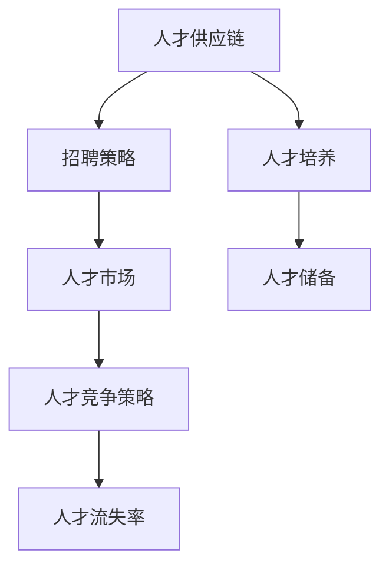

                 

# AI创业公司的人才争夺战

## 1. 背景介绍

### 1.1 问题由来
随着人工智能技术的蓬勃发展，越来越多的AI创业公司崭露头角。从自动驾驶、机器人到自然语言处理、医疗影像，各领域的AI公司正处于蓬勃发展的黄金时期。然而，行业的人才竞争也日趋激烈，尤其在顶尖人才的争夺上，各家公司展开了“抢人大战”。

### 1.2 问题核心关键点
AI创业公司的人才争夺战，核心在于如何吸引、留住和利用顶尖的人才资源。面对如此竞争激烈的就业市场，AI创业公司需要形成独特的竞争优势，构建健康的人才生态系统。

### 1.3 问题研究意义
理解并解决AI创业公司的人才争夺战，对企业的长期发展有着深远影响。吸引并留住优秀人才，不仅可以提升公司的创新能力，还可以缩短产品上市时间，加速商业化进程，最终推动企业在市场竞争中脱颖而出。

## 2. 核心概念与联系

### 2.1 核心概念概述

为更好地理解AI创业公司的人才争夺战，本节将介绍几个密切相关的核心概念：

- **人才供应链**：指从招聘、培养、留用到人才流动的全生命周期管理，涵盖招聘策略、培训计划、激励机制、员工关系等多个环节。
- **人才市场**：指公开就业平台上，企业与求职者之间进行信息交换、达成合作的环境。AI创业公司需要在人才市场上展示自身优势，吸引更多的人才。
- **人才竞争策略**：指企业为争夺人才而采取的一系列策略，包括薪酬福利、职业发展、企业文化、员工体验等。
- **人才储备**：指企业在特定领域储备的人才资源，这些人才在关键时刻可以快速投入使用，支撑公司业务发展。
- **人才流失率**：指因各种原因离开公司的人才占总人数的比例，反映了公司人才保留能力。

这些核心概念之间通过企业招聘、人才培养、人才使用等环节紧密联系，构成一个完整的生态系统。通过理解这些概念，我们可以更好地把握AI创业公司的人才争夺战的本质。

### 2.2 核心概念原理和架构的 Mermaid 流程图



这个流程图展示了人才供应链、招聘策略、人才市场、人才竞争策略、人才培养、人才储备和人才流失率之间的联系。企业需要从招聘、培训、激励等多个环节进行全链条管理，才能有效吸引和保留优秀人才。

## 3. 核心算法原理 & 具体操作步骤
### 3.1 算法原理概述

AI创业公司的人才争夺战，本质上是一种多维度的竞争策略。其核心在于通过人才供应链管理，吸引并留住顶尖人才，从而实现企业的创新和增长。

人才供应链管理的核心目标是：

1. 吸引优秀人才：通过合理的薪酬福利、职业发展路径、企业文化等吸引优质人才。
2. 培养高潜力人才：通过培训计划、导师制等培养内部员工，提升其能力。
3. 留住关键人才：通过激励机制、晋升路径、福利待遇等留住核心员工。
4. 管理人才流动：通过员工关系管理、离职面谈等手段，合理引导人才流动。

### 3.2 算法步骤详解

基于人才供应链管理的AI创业公司人才争夺战可以分为以下几个关键步骤：

**Step 1: 确定人才需求**
- 分析公司业务战略，确定关键岗位和人才需求。
- 评估现有员工队伍，识别出知识或技能缺口。

**Step 2: 制定人才吸引策略**
- 根据市场情况，设定有竞争力的薪酬福利。
- 设计有吸引力的职业发展路径和晋升机制。
- 营造积极向上的企业文化，提升员工满意度。

**Step 3: 实施人才招聘计划**
- 通过内部推荐、招聘网站、社交媒体等渠道招聘人才。
- 进行人才背景调查，确保候选人符合岗位要求。
- 面试评估候选人，选择最合适的人选。

**Step 4: 进行人才培养和培训**
- 制定个性化的培训计划，提升员工技能和知识。
- 引入导师制或Mentorship计划，帮助员工快速成长。
- 建立学习型组织，鼓励员工持续学习。

**Step 5: 制定人才激励机制**
- 设立绩效奖金、股票期权等激励措施。
- 提供发展机会，如参加行业会议、承担重要项目等。
- 关注员工心理健康，提供心理咨询等福利。

**Step 6: 实施人才保留策略**
- 定期评估员工满意度，提供改进措施。
- 设立长期激励计划，如股票分配、期权等。
- 提供灵活的工作环境，如远程办公、弹性工作时间等。

**Step 7: 监测人才流失率**
- 定期统计员工流失情况，分析流失原因。
- 及时采取措施，减少关键人才流失。
- 进行离职面谈，收集反馈信息，改进管理方式。

通过上述步骤，AI创业公司可以实现人才供应链的有效管理，从而吸引并留住优秀人才，支撑企业的持续创新和发展。

### 3.3 算法优缺点

AI创业公司的人才争夺战具有以下优点：

1. **高效吸引人才**：通过有竞争力的薪酬福利、职业发展路径等策略，可以高效吸引市场上优秀人才。
2. **提高员工满意度**：通过持续的培训和激励机制，提升员工工作满意度和忠诚度。
3. **保障人才稳定性**：通过有效的留才策略，减少人才流失，保障企业业务稳定发展。
4. **促进企业创新**：吸引和留住高潜力人才，为公司带来更多的创新点和增长点。

同时，该方法也存在一定的局限性：

1. **成本高**：高薪酬福利和培训激励措施可能会增加公司运营成本。
2. **竞争激烈**：人才市场上优秀人才竞争激烈，企业在吸引和保留人才时面临较大挑战。
3. **策略多样性**：不同员工的需求各异，需要制定多样化的策略，增加了管理复杂性。
4. **数据依赖**：有效的人才管理依赖于详尽的员工数据，数据的收集和管理成本较高。

尽管存在这些局限性，但就目前而言，基于人才供应链管理的人才争夺战方法仍是最主流范式。未来相关研究的重点在于如何进一步降低成本、提高效率、增强策略多样性，同时兼顾员工的个性化需求。

### 3.4 算法应用领域

基于人才供应链管理的人才争夺战方法，在AI创业公司中的应用已经非常广泛，涵盖了从招聘、培训、激励到流失管理等多个环节，具体应用领域包括：

- **技术团队建设**：吸引和留住技术顶尖人才，推动公司技术创新。
- **管理人才发展**：通过培养和激励机制，提升管理层的决策能力和执行力。
- **市场营销**：吸引营销领域高潜力人才，提升品牌影响力和市场份额。
- **客户服务**：通过培训和激励机制，提高客户服务团队的响应速度和客户满意度。
- **运营支持**：吸引运营管理人才，提升公司整体运营效率和效能。

此外，在金融、医疗、教育等行业，AI创业公司的人才争夺战也具有重要意义。通过有效的人才管理，可以提升这些领域AI系统的性能和可靠性，加速业务数字化转型进程。

## 4. 数学模型和公式 & 详细讲解 & 举例说明
### 4.1 数学模型构建

人才供应链管理的数学模型，主要关注以下几个关键变量：

- **S**：现有员工数量。
- **R**：招聘计划中新增员工数量。
- **C**：员工流失数量。
- **A**：培训计划中提升技能员工数量。
- **I**：激励计划中提升士气员工数量。

### 4.2 公式推导过程

人才供应链管理的核心公式如下：

$$
S_{\text{新}} = S + R - C + A + I
$$

其中，$S_{\text{新}}$ 表示经过供应链管理后公司的总员工数量。

- **招聘策略**：通过增加招聘数量 $R$，企业可以扩大人才队伍。
- **人才流失**：由于员工流失 $C$，企业需要定期补充人才。
- **人才培养**：通过培训计划 $A$，员工技能得到提升，间接扩充人才资源。
- **人才激励**：通过激励计划 $I$，提升员工士气，减少流失率。

### 4.3 案例分析与讲解

以下是一个简单的案例分析：

假设一家AI创业公司现有员工 $S=100$，计划新增员工 $R=20$，预计流失率 $C=5$，培训计划提升技能员工 $A=10$，激励计划提升士气员工 $I=5$。

通过上述公式计算，公司新的人力资源总量为：

$$
S_{\text{新}} = 100 + 20 - 5 + 10 + 5 = 130
$$

这表明，通过合理的人才供应链管理，公司将能够提升人力资源总量，为企业的业务发展提供充足的人才支持。

## 5. 项目实践：代码实例和详细解释说明
### 5.1 开发环境搭建

在进行人才供应链管理项目的开发前，我们需要准备好开发环境。以下是使用Python进行人才供应链管理项目的开发环境配置流程：

1. 安装Anaconda：从官网下载并安装Anaconda，用于创建独立的Python环境。

2. 创建并激活虚拟环境：
```bash
conda create -n talent-supplyment python=3.8 
conda activate talent-supplyment
```

3. 安装相关库：
```bash
pip install pandas numpy matplotlib
```

4. 安装可视化工具：
```bash
pip install plotly seaborn
```

5. 安装数据处理库：
```bash
pip install scikit-learn dask
```

完成上述步骤后，即可在`talent-supplyment`环境中开始人才供应链管理项目的开发。

### 5.2 源代码详细实现

下面我们以一家AI创业公司的人才供应链管理项目为例，给出详细的代码实现。

```python
import pandas as pd
import numpy as np
import matplotlib.pyplot as plt
import seaborn as sns
import plotly.graph_objects as go
from sklearn.linear_model import LinearRegression

# 数据准备
data = pd.read_csv('talent_data.csv')
data.head()

# 定义关键变量
S = data['现有员工数量']
R = data['招聘计划新增员工数量']
C = data['员工流失数量']
A = data['培训计划提升技能员工数量']
I = data['激励计划提升士气员工数量']

# 计算新的人力资源总量
S_new = S + R - C + A + I
data['新的人力资源总量'] = S_new

# 数据可视化
sns.lineplot(x='时间', y='新的人力资源总量', data=data)
plt.title('人才供应链管理效果')
plt.xlabel('时间')
plt.ylabel('新的人力资源总量')

# 线性回归分析
X = np.array(data[['时间']]).reshape(-1, 1)
Y = np.array(data['新的人力资源总量']).reshape(-1, 1)
model = LinearRegression()
model.fit(X, Y)
predicted_S_new = model.predict(np.array(data[['时间']]).reshape(-1, 1))
sns.lineplot(x='时间', y='新的人力资源总量', data=data, label='实际')
sns.lineplot(x='时间', y=predicted_S_new, data=data, label='预测')
plt.title('人才供应链管理效果预测')
plt.xlabel('时间')
plt.ylabel('新的人力资源总量')
plt.legend()
plt.show()
```

### 5.3 代码解读与分析

让我们再详细解读一下关键代码的实现细节：

**数据准备**：
- 通过Pandas库读取人才供应链管理的数据集，将其存储在变量 `data` 中。

**变量定义**：
- 定义变量 `S`、`R`、`C`、`A`、`I`，分别代表现有员工数量、招聘计划新增员工数量、员工流失数量、培训计划提升技能员工数量、激励计划提升士气员工数量。

**人力资源总量计算**：
- 根据公式 $S_{\text{新}} = S + R - C + A + I$ 计算新的人力资源总量，并将结果存储在数据集 `data` 的新列 `新的人力资源总量` 中。

**数据可视化**：
- 使用Seaborn库绘制新的人力资源总量随时间变化的折线图，并添加标题、横轴标签和纵轴标签。
- 使用Plotly库将折线图嵌入网页中，以便在网页中进行交互式查看。

**线性回归分析**：
- 使用Scikit-learn库中的 `LinearRegression` 模型进行线性回归分析，拟合人力资源总量与时间的关系。
- 使用Seaborn库绘制实际和新的人力资源总量随时间变化的折线图，并添加标题、横轴标签和纵轴标签。

## 6. 实际应用场景
### 6.1 金融行业

在金融行业中，AI创业公司可以通过人才供应链管理提升业务能力，增强市场竞争力。具体应用场景包括：

- **风险控制**：通过招聘和培养风险管理专家，提升公司风险控制能力，减少不良贷款率。
- **量化交易**：吸引和保留量化交易专家，提升交易策略的科学性和稳定性。
- **客户服务**：通过培训和激励机制，提升客户服务团队的响应速度和客户满意度。

### 6.2 医疗行业

在医疗行业中，AI创业公司可以通过人才供应链管理提升医疗诊断能力，改善患者体验。具体应用场景包括：

- **医疗影像分析**：招聘和培养医疗影像分析专家，提升影像诊断的准确性和效率。
- **健康管理**：吸引和保留健康管理专家，提升健康数据的分析和管理能力。
- **电子病历管理**：培训医生和技术人员，提升电子病历系统的使用和维护能力。

### 6.3 教育行业

在教育行业中，AI创业公司可以通过人才供应链管理提升教育资源配置，改善教育质量。具体应用场景包括：

- **个性化教育**：吸引和培养个性化教育专家，提升个性化教育系统的设计和实现能力。
- **学习数据分析**：招聘和培养数据分析师，提升学习数据的分析和管理能力。
- **在线教学**：培训教师和技术人员，提升在线教学系统的使用和维护能力。

### 6.4 未来应用展望

随着AI技术的不断发展，人才供应链管理在各行业中的应用将更加广泛，未来趋势如下：

1. **数据驱动**：利用大数据和人工智能技术，优化人才供应链管理策略，提升人才获取和保留的效率。
2. **个性化管理**：根据不同岗位和员工的个性化需求，制定灵活多样的人才管理策略。
3. **全球化布局**：拓展国际市场，吸引全球优秀人才，提升公司的全球竞争力。
4. **智能化应用**：引入智能推荐系统，优化招聘和培训过程，提升人才管理的智能化水平。
5. **可持续发展**：注重员工职业发展和生活平衡，吸引和留住长期贡献的企业员工。

## 7. 工具和资源推荐
### 7.1 学习资源推荐

为了帮助开发者系统掌握人才供应链管理的技术基础和实践技巧，这里推荐一些优质的学习资源：

1. 《人才管理：从招聘到留才》系列博文：由人力资源管理专家撰写，深入浅出地介绍了人才供应链管理的原理和实践。

2. Coursera《人才管理与组织发展》课程：由人力资源管理领域的知名教授讲授，涵盖人才供应链管理的各个环节。

3. 《人才供应链管理手册》书籍：全面介绍了人才供应链管理的理论基础和实践方法，适合HR专业人员阅读。

4. LinkedIn Learning：提供大量关于人力资源管理和人才供应链管理的课程，方便开发者系统学习。

5. 《人才供应链管理最佳实践》白皮书：总结了各大企业在人才供应链管理方面的成功经验，值得HR专业人员借鉴。

通过对这些资源的学习实践，相信你一定能够快速掌握人才供应链管理的精髓，并用于解决实际的业务问题。

### 7.2 开发工具推荐

高效的开发离不开优秀的工具支持。以下是几款用于人才供应链管理开发的常用工具：

1. Excel：经典的数据分析工具，适合快速处理和分析小规模数据集。

2. Power BI：微软推出的数据分析和可视化工具，支持复杂的报表和仪表盘制作。

3. Tableau：桌面数据可视化分析工具，支持实时数据接入和交互式图表绘制。

4. Jupyter Notebook：Python编程环境，支持代码、数据和文本的混合编辑，方便开发和分享。

5. GitHub：代码托管平台，方便团队协作和代码版本控制。

6. Zoom：视频会议和协作工具，支持远程办公和团队沟通。

合理利用这些工具，可以显著提升人才供应链管理任务的开发效率，加快创新迭代的步伐。

### 7.3 相关论文推荐

人才供应链管理的研究源于学界的持续研究。以下是几篇奠基性的相关论文，推荐阅读：

1. "Talent Management in the Digital Age" by Darauffreda et al.（《数字化时代的员工管理》）：讨论了数字化环境下人才供应链管理的挑战和机遇。

2. "The Talent Management Pyramid: A Holistic Approach" by Corrigan et al.（《人才管理金字塔：整体视角》）：提出了一套全面的员工管理框架，涵盖招聘、培训、激励等多个环节。

3. "Talent Scarcity: The New Battle for Skills" by Kent et al.（《人才稀缺：新技能争夺战》）：分析了人才市场变化趋势，提出了应对人才短缺的策略。

4. "The HR Analytics Revolution" by Trus et al.（《人力资源分析革命》）：探讨了利用数据驱动的人力资源管理，提升人才供应链管理的效率和效果。

这些论文代表了大规模管理理论的发展脉络。通过学习这些前沿成果，可以帮助研究者把握学科前进方向，激发更多的创新灵感。

## 8. 总结：未来发展趋势与挑战
### 8.1 研究成果总结

本文对基于人才供应链管理的人才争夺战方法进行了全面系统的介绍。首先阐述了AI创业公司的人才争夺战的背景和意义，明确了人才供应链管理在吸引和保留人才方面的独特价值。其次，从原理到实践，详细讲解了人才供应链管理的数学模型和核心步骤，给出了人才供应链管理项目的代码实例。同时，本文还广泛探讨了人才供应链管理在金融、医疗、教育等多个行业领域的应用前景，展示了人才供应链管理的广泛应用场景。

通过本文的系统梳理，可以看到，基于人才供应链管理的人才争夺战方法正在成为AI创业公司的人才管理主流范式，极大地提升了人才管理的效率和效果。通过合理的人才供应链管理，AI创业公司可以吸引并留住优秀人才，支撑企业的持续创新和发展。

### 8.2 未来发展趋势

展望未来，人才供应链管理将呈现以下几个发展趋势：

1. **数据驱动管理**：利用大数据和人工智能技术，优化人才供应链管理策略，提升人才获取和保留的效率。
2. **个性化管理**：根据不同岗位和员工的个性化需求，制定灵活多样的人才管理策略。
3. **全球化布局**：拓展国际市场，吸引全球优秀人才，提升公司的全球竞争力。
4. **智能化应用**：引入智能推荐系统，优化招聘和培训过程，提升人才管理的智能化水平。
5. **可持续发展**：注重员工职业发展和生活平衡，吸引和留住长期贡献的企业员工。

### 8.3 面临的挑战

尽管人才供应链管理在人才获取和保留方面取得了显著成效，但在迈向更加智能化、普适化应用的过程中，仍面临诸多挑战：

1. **数据质量问题**：数据质量是人才供应链管理的基础，低质量的数据将直接影响管理决策的准确性。如何确保数据的质量和完整性，是一个重要的挑战。
2. **文化融合问题**：在全球化背景下，如何融合不同文化背景的员工，打造包容和谐的工作环境，也是一个重要的课题。
3. **技术创新问题**：如何利用最新技术提升人才供应链管理的效率和效果，需要持续的技术创新和应用。
4. **人才短缺问题**：在特定领域，特别是高技能领域，人才短缺现象仍然存在，如何应对这一挑战，需要创新人才获取策略。

### 8.4 研究展望

面对人才供应链管理所面临的挑战，未来的研究需要在以下几个方面寻求新的突破：

1. **数据治理**：建立完善的数据治理机制，确保数据的准确性和完整性。
2. **文化建设**：推广包容性企业文化，提升员工的归属感和满意度。
3. **技术创新**：引入最新的技术，如人工智能、大数据等，优化人才供应链管理流程。
4. **人才开发**：构建灵活的人才开发体系，提升员工的持续学习和发展能力。
5. **政策支持**：政府应出台相关政策，支持人才供应链管理的发展，营造良好的市场环境。

这些研究方向的探索，必将引领人才供应链管理技术迈向更高的台阶，为AI创业公司的人才管理提供更为全面的解决方案。面向未来，人才供应链管理需要与其他人工智能技术进行更深入的融合，共同推动AI技术的创新和应用。

## 9. 附录：常见问题与解答

**Q1: 什么是人才供应链管理？**

A: 人才供应链管理是指从招聘、培养、留用到人才流动的全生命周期管理，涵盖招聘策略、培训计划、激励机制、员工关系等多个环节。通过优化人才供应链，企业能够高效吸引和保留优秀人才，提升公司的创新能力和竞争力。

**Q2: 人才供应链管理对AI创业公司有哪些具体作用？**

A: 人才供应链管理对AI创业公司有以下几个具体作用：

1. **提升人才获取效率**：通过合理的薪酬福利、职业发展路径等策略，吸引优秀人才。
2. **提高员工满意度**：通过持续的培训和激励机制，提升员工工作满意度和忠诚度。
3. **保障人才稳定性**：通过有效的留才策略，减少人才流失，保障企业业务稳定发展。
4. **促进企业创新**：吸引和留住高潜力人才，为公司带来更多的创新点和增长点。

**Q3: 人才供应链管理面临哪些挑战？**

A: 人才供应链管理面临以下挑战：

1. **数据质量问题**：数据质量是人才供应链管理的基础，低质量的数据将直接影响管理决策的准确性。
2. **文化融合问题**：在全球化背景下，如何融合不同文化背景的员工，打造包容和谐的工作环境，也是一个重要的课题。
3. **技术创新问题**：如何利用最新技术提升人才供应链管理的效率和效果，需要持续的技术创新和应用。
4. **人才短缺问题**：在特定领域，特别是高技能领域，人才短缺现象仍然存在，如何应对这一挑战，需要创新人才获取策略。

**Q4: 如何优化人才供应链管理策略？**

A: 优化人才供应链管理策略需要从以下几个方面进行：

1. **数据治理**：建立完善的数据治理机制，确保数据的准确性和完整性。
2. **文化建设**：推广包容性企业文化，提升员工的归属感和满意度。
3. **技术创新**：引入最新的技术，如人工智能、大数据等，优化人才供应链管理流程。
4. **人才开发**：构建灵活的人才开发体系，提升员工的持续学习和发展能力。
5. **政策支持**：政府应出台相关政策，支持人才供应链管理的发展，营造良好的市场环境。

通过系统化的数据治理、文化建设、技术创新、人才开发和政策支持，AI创业公司可以优化人才供应链管理策略，提升人才管理的效率和效果，从而实现企业创新和发展的目标。

---

作者：禅与计算机程序设计艺术 / Zen and the Art of Computer Programming

