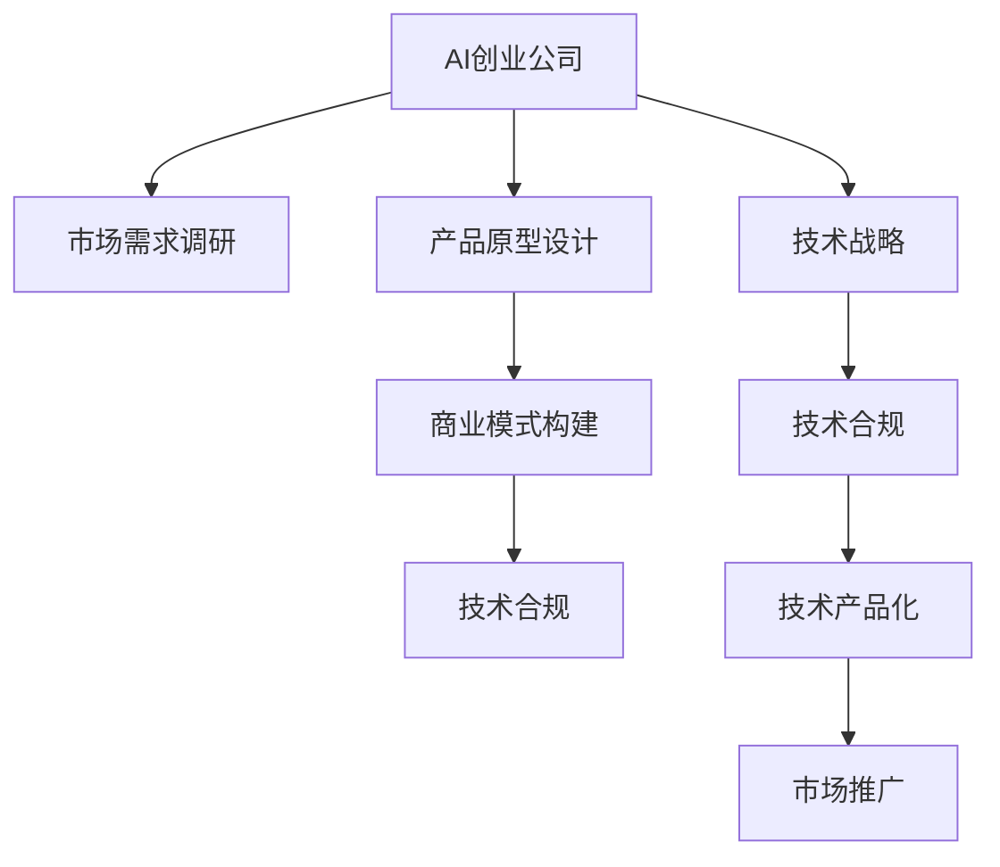

                 

# AI创业公司的技术转化策略

> 关键词：AI创业公司, 技术转化, 市场需求, 技术产品化, 技术合规, 技术战略, 数据隐私

## 1. 背景介绍

### 1.1 问题由来
当前，全球人工智能（AI）正处于快速发展阶段，越来越多的AI创业公司涌现出来，致力于提供创新性的AI产品和服务。然而，这些技术型初创公司常常面临一个共同挑战：如何将前沿的技术转化为具有商业价值的实际产品。这种技术到产品的转化（Technology-to-Product, T2P）过程往往涉及到多个复杂的环节，包括技术验证、市场需求调研、产品设计、商业模式构建、技术合规等。本文将全面探讨AI创业公司如何进行技术转化，帮助企业家和技术团队系统掌握这一过程，从而将创新性技术成功商业化。

### 1.2 问题核心关键点
技术转化是AI创业公司从技术研发到市场应用的关键一步。以下问题将贯穿全文，作为技术转化策略的切入点：
- 如何确定目标市场和用户需求？
- 如何评估技术的商业价值和可行性？
- 如何设计并实现可行的产品原型？
- 如何构建稳健的商业模式？
- 如何确保技术产品的合规性和安全性？

## 2. 核心概念与联系

### 2.1 核心概念概述

为了更好地理解AI创业公司的技术转化策略，本节将介绍几个密切相关的核心概念：

- **AI创业公司**：专注于人工智能技术开发、应用和商业化的创业公司。这类公司通常以技术创新为核心竞争力，致力于解决实际问题或满足特定需求。
- **市场需求调研**：通过数据收集和分析，了解潜在用户对产品或服务的需求，为技术转化提供方向指引。
- **产品原型设计**：基于用户需求和技术可行性，设计并开发出初步的产品形态，用于测试和验证。
- **商业模式构建**：基于产品特性和市场需求，设计可行的商业运作模式，确保产品能够产生商业回报。
- **技术合规**：确保产品开发和应用过程中，遵守相关的法律法规和技术标准，如数据隐私、安全性、伦理规范等。
- **技术战略**：确定公司长期技术发展方向和目标，包括核心技术选择、研发投入、市场布局等。

这些核心概念之间的逻辑关系可以通过以下Mermaid流程图来展示：



这个流程图展示了AI创业公司在技术转化过程中需要经历的关键环节，各环节互相配合，形成闭环。

## 3. 核心算法原理 & 具体操作步骤

### 3.1 算法原理概述

AI创业公司的技术转化策略是一种系统的、多维度的方法论。其核心原理是通过对技术、市场、产品、商业、合规等关键要素的综合考量，将前沿的技术转化为具有商业价值的产品。以下是技术转化策略的几个关键原理：

1. **市场导向原则**：产品设计和发展必须以市场需求为核心，确保技术转化与用户实际需求紧密结合。
2. **价值验证原则**：通过市场调研和技术验证，评估技术的商业价值和市场潜力，以降低风险。
3. **迭代优化原则**：采用敏捷开发和快速迭代的方法，不断优化产品原型和商业模式，提高转化成功率。
4. **合规遵从原则**：在技术转化过程中，确保产品开发和应用符合法律、伦理和安全性要求。

### 3.2 算法步骤详解

AI创业公司的技术转化策略可以分为以下几个关键步骤：

**Step 1: 市场调研与用户需求分析**
- 收集和分析目标市场数据，了解市场规模、增长趋势、竞争格局等。
- 进行用户访谈和问卷调查，收集用户反馈，识别痛点和需求。
- 通过数据挖掘和用户行为分析，深入理解用户使用习惯和场景。

**Step 2: 技术评估与可行性分析**
- 评估技术的创新性、成熟度、应用潜力等。
- 进行技术验证，确保技术方案可行，可以支撑商业化需求。
- 分析技术在市场上的应用前景和市场竞争态势。

**Step 3: 产品原型设计与迭代**
- 基于市场需求和技术可行性，设计初步的产品原型。
- 通过用户测试和反馈，不断优化产品功能和设计，提高用户体验。
- 实现可行的原型，用于进一步的市场验证和技术验证。

**Step 4: 商业模式构建与验证**
- 结合产品特性和市场需求，设计合理的商业模式，如订阅制、按需付费、免费增值等。
- 进行商业验证，测试商业模式是否能够带来稳定的收入。
- 优化商业模式，确保产品能够实现商业回报。

**Step 5: 技术合规与伦理审查**
- 确保产品开发和应用过程中，遵守相关的法律法规和技术标准，如数据隐私、安全性、伦理规范等。
- 进行技术合规审查，评估潜在风险。
- 采取必要的安全措施和技术手段，保障用户数据和隐私安全。

**Step 6: 技术产品化与市场推广**
- 将技术原型转化为可用的产品，确保产品技术实现和性能符合商业化要求。
- 设计有效的市场推广策略，推广产品和服务，提升市场占有率。
- 监控市场反应和用户反馈，持续优化产品和服务。

### 3.3 算法优缺点

AI创业公司的技术转化策略具有以下优点：

1. **市场导向性强**：通过详细的市场调研和用户需求分析，确保产品开发和商业化能够紧密结合市场需求，提高成功率。
2. **技术风险低**：通过技术评估和验证，能够有效降低技术转化过程中可能遇到的技术风险。
3. **迭代优化能力强**：通过快速迭代和用户反馈，能够持续优化产品，提高用户满意度和市场适应性。
4. **合规性高**：通过技术合规审查和安全措施，确保产品开发和应用符合法律法规要求，保障用户数据和隐私安全。

同时，该策略也存在一定的局限性：

1. **资源投入大**：技术转化过程中需要大量的市场调研、产品设计、商业模式构建和合规审查等资源投入。
2. **市场变化快**：市场需求和技术趋势变化迅速，技术转化过程可能面临较大的不确定性。
3. **技术瓶颈**：技术实现可能存在技术瓶颈，影响产品性能和用户体验。

尽管存在这些局限性，但技术转化策略仍然是当前AI创业公司进行技术商业化的重要范式。

### 3.4 算法应用领域

AI创业公司的技术转化策略适用于各种应用场景，包括但不限于以下几个领域：

1. **智能医疗**：通过AI技术，提供智能诊断、病历管理、药物研发等服务。
2. **智能制造**：利用AI技术，优化生产流程、预测设备故障、提升产品质量。
3. **智能零售**：采用AI技术，实现个性化推荐、库存管理、顾客行为分析等。
4. **智能安防**：应用AI技术，实现视频监控、人脸识别、异常检测等。
5. **智能教育**：利用AI技术，提供智能辅导、内容推荐、学习分析等服务。
6. **智能金融**：使用AI技术，进行风险评估、交易分析、客户服务优化等。

## 4. 数学模型和公式 & 详细讲解 & 举例说明

### 4.1 数学模型构建

为了更好地理解AI创业公司的技术转化策略，我们将通过一个简化的数学模型来描述市场调研和用户需求分析过程。

设市场规模为 $M$，用户需求概率为 $p$，用户满意度为 $s$，成本为 $C$。市场需求模型可以表示为：

$$
D = M \times p \times s
$$

其中，$D$ 表示市场需求量，$M$ 表示市场规模，$p$ 表示用户需求概率，$s$ 表示用户满意度，$C$ 表示成本。

### 4.2 公式推导过程

根据市场需求模型，我们可以进行以下推导：

1. **市场规模估算**：
   - 通过统计分析和市场调研，估算市场规模 $M$。
   - 市场规模估算公式：
     \[
     M = \frac{A}{C}
     \]
   其中，$A$ 表示潜在市场总收益，$C$ 表示成本。

2. **用户需求概率计算**：
   - 通过问卷调查、用户访谈等方法，估算用户需求概率 $p$。
   - 用户需求概率计算公式：
     \[
     p = \frac{U}{M}
     \]
   其中，$U$ 表示用户总数，$M$ 表示市场规模。

3. **用户满意度评估**：
   - 通过用户反馈和测试结果，评估用户满意度 $s$。
   - 用户满意度评估公式：
     \[
     s = \frac{S}{U}
     \]
   其中，$S$ 表示用户满意总数，$U$ 表示用户总数。

### 4.3 案例分析与讲解

假设市场规模为 $M=10^6$，用户需求概率为 $p=0.1$，用户满意度为 $s=0.8$，成本为 $C=1000$。根据市场需求模型，计算市场需求量 $D$：

$$
D = M \times p \times s = 10^6 \times 0.1 \times 0.8 = 80000
$$

这个计算结果表示，在给定的市场规模和用户需求概率下，市场需求量为 $80000$。这为我们提供了初步的市场估计，有助于指导产品设计和商业策略的制定。

## 5. 项目实践：代码实例和详细解释说明

### 5.1 开发环境搭建

在进行技术转化策略的实践前，我们需要准备好开发环境。以下是使用Python进行数据分析和市场调研的环境配置流程：

1. 安装Anaconda：从官网下载并安装Anaconda，用于创建独立的Python环境。
2. 创建并激活虚拟环境：
   ```bash
   conda create -n market_analysis_env python=3.8 
   conda activate market_analysis_env
   ```

3. 安装必要的Python库：
   ```bash
   pip install pandas numpy matplotlib seaborn
   ```

4. 准备市场调研数据：收集市场规模、用户需求、用户满意度等数据，存储为CSV格式。

完成上述步骤后，即可在`market_analysis_env`环境中进行市场调研和需求分析的实践。

### 5.2 源代码详细实现

下面以智能医疗领域的市场需求调研为例，给出使用Python进行数据分析和用户需求分析的代码实现。

```python
import pandas as pd
import matplotlib.pyplot as plt

# 读取市场调研数据
data = pd.read_csv('market调研数据.csv')

# 计算市场规模
market_size = data['潜在市场总收益'].sum()

# 计算用户需求概率
user_demand = data['用户总数'] / market_size

# 计算用户满意度
user_satisfaction = data['用户满意总数'] / data['用户总数']

# 可视化市场调研结果
plt.figure(figsize=(10, 6))
plt.plot(user_demand, label='用户需求概率')
plt.plot(user_satisfaction, label='用户满意度')
plt.legend()
plt.xlabel('用户总数')
plt.ylabel('概率')
plt.title('市场调研结果')
plt.show()

# 输出市场需求量
demand = market_size * user_demand * user_satisfaction
print('市场需求量:', demand)
```

以上就是使用Python进行智能医疗领域市场调研和用户需求分析的完整代码实现。

### 5.3 代码解读与分析

让我们再详细解读一下关键代码的实现细节：

**读取数据**：
- 使用`pd.read_csv`方法读取市场调研数据，并将其存储为DataFrame对象。

**计算市场规模**：
- 通过`sum`方法计算潜在市场总收益，得到市场规模。

**计算用户需求概率和满意度**：
- 通过计算用户总数与市场规模的比值，得到用户需求概率。
- 通过计算用户满意总数与用户总数的比值，得到用户满意度。

**数据可视化**：
- 使用`matplotlib`库绘制用户需求概率和满意度的折线图。

**输出市场需求量**：
- 计算市场需求量，输出结果。

可以看到，通过上述代码，我们可以高效地完成市场调研和用户需求分析，为技术转化提供数据支持。

## 6. 实际应用场景

### 6.1 智能医疗

在智能医疗领域，AI创业公司可以通过技术转化策略，开发智能诊断和病历管理系统。例如，利用深度学习技术，对大量医疗数据进行分析和建模，提供精准的疾病诊断和预测服务。通过市场调研，了解用户需求，设计符合用户使用习惯的产品界面，构建合理的商业模式，确保产品能够在医疗机构中推广和应用。同时，遵守数据隐私和安全要求，保障患者数据安全，获得用户的信任和接受。

### 6.2 智能制造

在智能制造领域，AI创业公司可以应用技术转化策略，开发智能生产线优化和故障预测系统。例如，通过机器学习技术，对生产设备运行数据进行分析，预测设备故障并进行维护，减少停机时间和生产成本。通过市场调研，了解制造业用户的需求和痛点，设计符合实际生产场景的产品功能，构建订阅制或按需付费的商业模式，确保产品能够快速推广和应用。同时，遵守数据隐私和安全要求，保障工业数据安全，获得制造企业的信任和合作。

### 6.3 智能零售

在智能零售领域，AI创业公司可以通过技术转化策略，开发个性化推荐和库存管理系统。例如，利用深度学习技术，对消费者行为数据进行分析，提供个性化的商品推荐和促销活动。通过市场调研，了解零售商和消费者的需求，设计符合用户使用习惯的产品界面，构建按需付费或免费增值的商业模式，确保产品能够快速推广和应用。同时，遵守数据隐私和安全要求，保障消费者数据安全，获得用户的信任和接受。

### 6.4 未来应用展望

随着AI技术的不断进步，AI创业公司的技术转化策略将面临更多的机遇和挑战。未来，技术转化将更加注重以下方面：

1. **多模态数据的融合**：通过将图像、视频、音频等多模态数据与文本数据相结合，提升AI系统的综合感知能力。
2. **联邦学习的应用**：在保障数据隐私的前提下，通过分布式学习技术，提升数据利用效率和系统性能。
3. **自动化测试和部署**：引入自动化测试和部署工具，提高产品开发效率和质量，加速市场推广和应用。
4. **隐私保护和伦理规范**：加强数据隐私保护和伦理规范，确保AI系统在应用过程中符合法律法规和道德标准。

## 7. 工具和资源推荐

### 7.1 学习资源推荐

为了帮助开发者系统掌握AI创业公司的技术转化策略，这里推荐一些优质的学习资源：

1. **《AI创业公司管理与运营》**：介绍AI创业公司从技术研发到市场应用的全过程，包含技术转化、产品设计、商业模式构建等关键环节。
2. **《数据科学实战》**：涵盖数据收集、清洗、分析、可视化等数据处理技术，提供实用的市场调研和数据分析方法。
3. **《商业模型创新》**：讲解商业模式构建和验证的实战方法，帮助创业公司设计可行的商业运作模式。
4. **《数据隐私与安全》**：详细介绍数据隐私和安全的技术和策略，确保AI系统符合法律法规和伦理规范。
5. **《AI伦理与社会责任》**：探讨AI技术应用中的伦理问题和社会责任，提升AI系统的社会价值和公信力。

通过对这些资源的学习实践，相信你一定能够全面掌握AI创业公司的技术转化策略，系统地进行技术产品化。

### 7.2 开发工具推荐

高效的开发离不开优秀的工具支持。以下是几款用于技术转化策略开发的常用工具：

1. **Jupyter Notebook**：用于数据分析和可视化的轻量级Python环境，支持代码和数据分析的交互式操作。
2. **Python**：强大的数据处理和分析语言，支持丰富的数据处理和机器学习库，如Pandas、NumPy、Scikit-learn等。
3. **RapidMiner**：数据科学和机器学习平台，提供可视化的数据处理和分析工具，支持快速原型设计和模型验证。
4. **Tableau**：数据可视化和商业智能工具，帮助开发者高效地进行市场调研和数据分析。
5. **Hadoop**：大数据处理和存储平台，支持大规模数据集的处理和分析，满足技术转化的数据需求。

合理利用这些工具，可以显著提升技术转化过程的效率，加快创新迭代的步伐。

### 7.3 相关论文推荐

AI创业公司的技术转化策略是当前研究热点，以下是几篇奠基性的相关论文，推荐阅读：

1. **《人工智能创业公司战略管理》**：探讨AI创业公司在技术转化过程中的战略管理问题，提供系统的理论框架和方法。
2. **《市场导向的AI技术转化策略》**：研究AI技术在市场需求导向下的转化方法，提出可行的产品设计和技术评估策略。
3. **《数据驱动的AI产品创新》**：通过数据驱动的模型和算法，提升AI产品的创新性和市场适应性，提供实证研究和技术支持。
4. **《智能制造中的AI技术应用》**：研究AI技术在智能制造中的应用，探讨技术转化策略和技术实现路径。
5. **《智能医疗中的AI技术转化》**：分析AI技术在智能医疗中的应用，探讨技术转化中的数据隐私和安全问题。

这些论文代表了大规模AI创业公司在技术转化策略上的研究成果，通过学习这些前沿成果，可以帮助研究者更好地把握技术转化的方向和策略。

## 8. 总结：未来发展趋势与挑战

### 8.1 总结

本文对AI创业公司的技术转化策略进行了全面系统的介绍。首先阐述了技术转化在AI创业公司中的重要性，明确了技术转化过程中需要重点关注的几个关键点。其次，从原理到实践，详细讲解了技术转化策略的数学模型和操作步骤，给出了市场调研和用户需求分析的代码实例。同时，本文还广泛探讨了技术转化策略在智能医疗、智能制造、智能零售等多个行业领域的应用前景，展示了技术转化范式的广泛应用价值。此外，本文精选了技术转化策略的学习资源和开发工具，力求为读者提供全方位的技术指引。

通过本文的系统梳理，可以看到，AI创业公司的技术转化策略是一种系统性的、多维度的方法论，帮助技术型初创公司将前沿的AI技术转化为具有商业价值的实际产品，加速AI技术的产业化进程。未来，随着AI技术的不断发展，技术转化策略也将持续演进，为AI创业公司提供更强大的支持和指导。

### 8.2 未来发展趋势

展望未来，AI创业公司的技术转化策略将呈现以下几个发展趋势：

1. **自动化和智能化**：通过引入自动化工具和智能化算法，提升技术转化的效率和精度。
2. **跨领域融合**：AI技术将更多地与其他技术融合，如物联网、区块链、云计算等，形成更全面、智能的解决方案。
3. **国际化和本地化**：技术转化策略将更加注重国际市场和本地需求，提升AI系统的全球竞争力。
4. **可持续发展**：技术转化过程中将更加注重环境保护和可持续发展，推动绿色AI技术的发展。
5. **伦理和社会责任**：加强数据隐私保护和伦理审查，确保AI系统在应用过程中符合法律法规和社会价值观。

这些趋势凸显了AI创业公司在技术转化过程中面临的新挑战和机遇，推动AI技术向着更广泛、更智能、更可持续的方向发展。

### 8.3 面临的挑战

尽管技术转化策略在当前已取得了显著进展，但在迈向更加智能化、普适化应用的过程中，仍面临诸多挑战：

1. **资源瓶颈**：大规模数据集和算力资源的需求，对创业公司提出了更高的资源投入要求。
2. **市场竞争**：AI市场竞争激烈，新技术和新产品不断涌现，技术转化需要不断创新和优化。
3. **技术复杂性**：AI技术的复杂性和多样性，增加了技术转化的难度和不确定性。
4. **法律和伦理问题**：数据隐私、安全、伦理等问题的存在，对技术转化提出了更高的合规性要求。
5. **用户接受度**：技术转化过程中，如何提升用户对AI系统的信任和接受度，是一个重要的挑战。

面对这些挑战，未来的技术转化策略需要更加精细化、智能化，同时注重合规性和伦理规范，以确保AI系统能够安全、可靠地应用于实际场景。

### 8.4 研究展望

未来的技术转化策略需要在以下几个方面进行深入研究：

1. **智能化技术应用**：探索智能化算法和自动化工具在技术转化中的应用，提升转化效率和精度。
2. **跨领域融合研究**：推动AI技术与物联网、区块链、云计算等技术的融合，构建更加全面、智能的解决方案。
3. **国际化和本地化研究**：深入研究国际市场和本地需求，推动AI技术在全球范围内的应用。
4. **可持续发展研究**：加强AI技术的可持续发展研究，推动绿色AI技术的发展和应用。
5. **伦理和法律研究**：深入研究AI技术的伦理和法律问题，确保技术转化过程中符合法律法规和社会价值观。

这些研究方向的探索，将推动AI创业公司在技术转化过程中不断突破，为技术商业化和产业化提供强有力的支持和保障。

## 9. 附录：常见问题与解答

**Q1: AI创业公司的技术转化过程中，如何评估技术的商业价值？**

A: 评估技术的商业价值需要综合考虑以下几个方面：
1. **市场需求**：通过市场调研，了解目标市场的需求规模和增长趋势。
2. **技术成熟度**：评估技术的创新性和成熟度，确保技术能够在商业化场景中有效应用。
3. **用户反馈**：通过用户测试和反馈，评估技术产品的用户体验和接受度。
4. **竞争分析**：分析市场竞争格局，评估技术产品在市场中的竞争优势。
5. **成本效益**：计算技术转化的成本和潜在收益，确保商业化过程中能够获得良好的回报。

**Q2: 在技术转化过程中，如何设计合理的商业模式？**

A: 设计合理的商业模式需要综合考虑以下几个方面：
1. **产品特性**：根据产品特性和市场需求，选择适合的商业模式，如订阅制、按需付费、免费增值等。
2. **用户价值**：明确用户使用产品的价值和痛点，确保商业模式能够满足用户需求。
3. **成本控制**：合理控制技术转化和产品开发成本，确保商业化过程的经济可行性。
4. **市场策略**：制定有效的市场推广策略，提升产品知名度和市场占有率。
5. **风险管理**：评估商业模式的风险和不确定性，制定相应的应对措施。

**Q3: 技术转化过程中，如何确保产品的合规性和安全性？**

A: 确保产品的合规性和安全性需要综合考虑以下几个方面：
1. **法律法规**：确保产品开发和应用过程中，遵守相关的法律法规，如数据隐私、安全性、伦理规范等。
2. **数据保护**：采用先进的数据保护技术，保障用户数据和隐私安全。
3. **伦理审查**：建立伦理审查机制，确保技术应用符合社会价值观和伦理规范。
4. **安全措施**：采用先进的安全措施和技术手段，保障系统的安全性。
5. **持续改进**：建立持续改进机制，定期评估和优化产品的合规性和安全性。

**Q4: 如何应对技术转化过程中面临的资源瓶颈？**

A: 应对技术转化过程中面临的资源瓶颈需要综合考虑以下几个方面：
1. **优化资源配置**：合理配置资源，确保技术转化过程中能够高效利用算力、数据和人力资源。
2. **采用先进技术**：采用先进的数据处理和分析技术，提高资源利用效率。
3. **分阶段开发**：采用分阶段开发策略，逐步优化和完善技术产品。
4. **外部合作**：通过外部合作和资源共享，解决技术转化中的资源瓶颈问题。

**Q5: 技术转化过程中，如何提升用户对AI系统的信任和接受度？**

A: 提升用户对AI系统的信任和接受度需要综合考虑以下几个方面：
1. **透明性**：提高AI系统的透明性，让用户了解其工作原理和决策过程。
2. **可靠性**：确保AI系统的高可靠性和准确性，避免误导性输出。
3. **用户体验**：优化用户体验，提升用户操作便利性和互动性。
4. **用户教育**：通过用户教育和技术宣传，提升用户对AI技术的理解和接受度。
5. **反馈机制**：建立用户反馈机制，及时解决用户问题和改进系统性能。

---

作者：禅与计算机程序设计艺术 / Zen and the Art of Computer Programming

