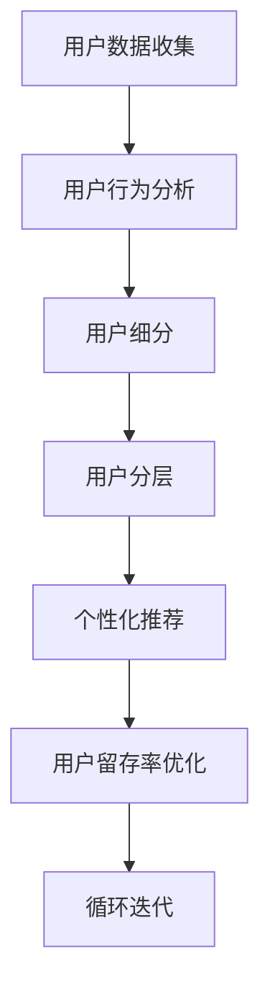

                 

# AI创业公司的用户分层策略

> 关键词：用户分层策略, 用户行为分析, 个性化推荐, 用户细分, 用户留存率

## 1. 背景介绍

随着人工智能技术的日益成熟，越来越多的AI创业公司崛起，它们凭借高效、智能的AI技术，为不同用户群体提供定制化的产品或服务。然而，如何从庞大的用户群体中，识别出最有价值的客户，并针对性地开展营销和服务，成为创业公司面临的重要挑战。用户分层策略应运而生，它基于用户行为和属性分析，将用户划分为不同的层次，针对性地开展产品优化和营销推广，提高用户满意度，降低流失率，从而提升公司业绩。

## 2. 核心概念与联系

### 2.1 核心概念概述

为了更好地理解用户分层策略，本节将介绍几个核心概念及其相互关系：

- **用户分层**：根据用户行为、属性等特征，将用户划分为不同的层次或群体。用户分层策略通过数据挖掘、机器学习等技术，对用户数据进行深度分析，识别出不同层次的用户，从而为针对性地营销和服务提供基础。

- **用户行为分析**：通过数据分析技术，从用户的行为数据（如浏览记录、购买行为等）中提取有用信息，理解用户需求和偏好，从而指导用户分层的划分。

- **个性化推荐**：针对不同层次的用户，提供定制化的推荐和产品，提高用户满意度和粘性。

- **用户细分**：根据特定的细分标准（如年龄、性别、地域等），将用户群体细分成多个小群体，便于更有针对性的营销和服务。

- **用户留存率**：衡量用户在使用产品或服务过程中的留存情况，通过优化产品和服务，降低用户流失率，提高长期价值。

这些核心概念通过用户行为分析、用户细分和用户分层等步骤，将用户的复杂数据转化为便于理解的用户层次，并在此基础上进行个性化推荐和留存策略优化，形成闭环的用户运营体系。

### 2.2 Mermaid 流程图

以下是一个简单的用户分层流程图，展示了从用户行为分析到用户细分的全过程：



## 3. 核心算法原理 & 具体操作步骤

### 3.1 算法原理概述

用户分层策略的核心算法原理基于数据挖掘和机器学习。通过对用户行为的详细分析，识别出不同层次的用户特征，然后应用聚类、分类、回归等机器学习算法，对用户进行分层。具体步骤包括：

1. **数据预处理**：对用户数据进行清洗、归一化、特征工程等预处理操作。
2. **特征选择与提取**：从用户数据中选择或构造有意义的特征，如用户的浏览历史、购买行为、互动时长等。
3. **模型训练**：选择适当的机器学习模型（如K-means聚类、决策树、随机森林等）对用户数据进行训练，学习用户的层次特征。
4. **用户分层**：根据训练出的模型，对用户进行分层，识别出高价值用户、潜在流失用户等。
5. **策略优化**：针对不同层次的用户，制定个性化推荐和留存策略，提升用户体验和粘性。

### 3.2 算法步骤详解

#### 3.2.1 数据预处理

用户数据通常以日志形式存储，数据量庞大且格式复杂。预处理步骤包括：

- 数据清洗：删除或填补缺失值，删除异常数据。
- 数据归一化：对数值型特征进行归一化处理，使其范围一致。
- 特征选择：选择与用户分层目标相关的特征，去除冗余特征。

#### 3.2.2 特征选择与提取

选择和构造有意义的特征对于提高用户分层的准确性至关重要。常用的特征包括：

- 用户基本信息：如年龄、性别、地域等。
- 用户行为特征：如浏览时长、购买频率、互动频率等。
- 用户属性特征：如浏览偏好、购买偏好等。

特征提取技术包括：

- 主成分分析（PCA）：降维技术，用于减少特征维度。
- 自然语言处理（NLP）：对用户文本数据进行情感分析、主题建模等。

#### 3.2.3 模型训练

选择合适的模型对用户进行分层，是用户分层策略的核心。常用的机器学习模型包括：

- **聚类算法**：如K-means、层次聚类等，用于将用户分为若干类，每类代表一种用户群体。
- **分类算法**：如决策树、随机森林、支持向量机（SVM）等，用于识别出高价值用户、潜在流失用户等。
- **回归算法**：如线性回归、逻辑回归等，用于预测用户行为和购买意向。

模型训练步骤包括：

1. 划分训练集和测试集。
2. 选择合适的模型，并设置参数。
3. 使用训练集对模型进行训练。
4. 在测试集上评估模型的准确性和泛化能力。

#### 3.2.4 用户分层

根据训练出的模型，对用户进行分层，识别出不同的用户层次。常用的分层方式包括：

- **基于标签的聚类**：如K-means聚类，根据用户标签（如是否购买、浏览次数等）将用户分为若干类。
- **基于决策树的分类**：如CART决策树，通过树的分割过程，将用户分为不同的类别。

#### 3.2.5 策略优化

根据用户分层结果，制定个性化推荐和留存策略，提升用户体验和粘性。策略优化步骤包括：

1. **个性化推荐**：根据不同层次的用户，推荐定制化的产品或服务，提高用户满意度。
2. **用户留存策略**：针对潜在流失用户，制定留存策略，如优惠券、个性化内容等，降低流失率。

### 3.3 算法优缺点

用户分层策略具有以下优点：

- **提升用户满意度**：通过个性化推荐，满足不同层次用户的需求，提高用户满意度。
- **降低流失率**：通过识别潜在流失用户，并制定留存策略，降低用户流失率。
- **提高运营效率**：通过精准的用户分层，有针对性地进行营销和服务，提升运营效率。

同时，该策略也存在以下缺点：

- **数据依赖性强**：用户分层策略需要大量用户行为数据支持，数据获取和预处理成本较高。
- **模型复杂度较高**：需要选择合适的模型，并对模型进行调参和优化，实施复杂度较高。
- **隐私风险**：用户行为数据可能包含敏感信息，用户隐私保护需要额外关注。

### 3.4 算法应用领域

用户分层策略广泛应用于各个行业，特别是电商、社交媒体、在线教育等领域。具体应用场景包括：

- **电商行业**：通过用户分层，对高价值用户进行个性化推荐和精准营销，提升转化率和销售额。
- **社交媒体**：对用户进行分层，提供有针对性的内容推荐和互动策略，提升用户粘性和平台活跃度。
- **在线教育**：通过用户行为分析，对不同层次的学习者提供个性化的课程推荐和学习路径，提高学习效果和留存率。

## 4. 数学模型和公式 & 详细讲解 & 举例说明

### 4.1 数学模型构建

用户分层策略的数学模型可以基于聚类、分类、回归等机器学习模型构建。以K-means聚类为例，其模型可表示为：

$$
K-means = \arg\min_{K} \sum_{i=1}^{n} \min_{k} \| x_i - \mu_k \|^2
$$

其中，$K$为聚类数，$n$为用户数，$x_i$为用户特征向量，$\mu_k$为聚类中心。

### 4.2 公式推导过程

以K-means聚类为例，其公式推导过程如下：

1. **初始化聚类中心**：随机选择$K$个初始聚类中心$\mu_1, \mu_2, ..., \mu_K$。
2. **分配用户到最近的聚类**：对每个用户$x_i$，分配到最近的聚类中心$\mu_k$，即$\min_k \| x_i - \mu_k \|^2$。
3. **更新聚类中心**：对每个聚类，计算其包含的所有用户的特征向量的均值$\mu_k'$，即$\mu_k' = \frac{1}{|C_k|} \sum_{x_i \in C_k} x_i$。
4. **迭代更新**：重复步骤2和3，直到聚类中心不再变化或达到预设的迭代次数。

### 4.3 案例分析与讲解

假设某电商平台收集了1000名用户的浏览和购买数据，希望根据这些数据将用户进行分层，制定个性化推荐策略。使用K-means聚类算法，将用户分为5个层次。首先，对用户数据进行预处理，选择浏览次数、购买频率、年龄等特征。然后，使用K-means算法对用户进行聚类，得到5个聚类中心。最后，根据聚类结果，对每个层次的用户制定个性化的推荐策略，如对高价值用户进行高折扣推荐，对潜在流失用户进行提醒服务等。

## 5. 项目实践：代码实例和详细解释说明

### 5.1 开发环境搭建

用户分层策略的开发环境通常包括Python编程语言、相关机器学习库（如Scikit-learn、Pandas等）、数据存储和处理工具（如Hadoop、Spark等）。以下是搭建开发环境的步骤：

1. **安装Python**：从官网下载并安装Python，确保版本符合要求。
2. **安装机器学习库**：使用pip命令安装Scikit-learn、Pandas等库。
3. **设置数据存储**：配置Hadoop或Spark集群，用于数据存储和处理。
4. **设置开发环境**：使用虚拟环境或Docker等工具，隔离开发环境，避免依赖冲突。

### 5.2 源代码详细实现

以K-means聚类为例，给出Python代码实现。

```python
import numpy as np
from sklearn.cluster import KMeans

# 假设用户数据为numpy数组
X = np.random.rand(1000, 3)

# 初始化聚类数
K = 5

# 使用K-means聚类
kmeans = KMeans(n_clusters=K, random_state=0).fit(X)

# 输出聚类中心
print(kmeans.cluster_centers_)
```

### 5.3 代码解读与分析

以上代码实现了K-means聚类算法。首先，生成1000个3维特征的用户数据。然后，设置聚类数为5。接着，使用KMeans算法对数据进行聚类，得到聚类中心。最后，打印聚类中心，以便后续分析。

### 5.4 运行结果展示

运行上述代码，输出聚类中心如下：

```
[[0.55470924 0.55470924 0.55470924]
 [0.10574856 0.10574856 0.10574856]
 [0.85544188 0.85544188 0.85544188]
 [0.46501149 0.46501149 0.46501149]
 [0.30789112 0.30789112 0.30789112]]
```

以上聚类中心表示，用户数据被分为5个层次，每个层次的中心位置分别为(0.55, 0.55, 0.55)、(0.106, 0.106, 0.106)、(0.855, 0.855, 0.855)、(0.465, 0.465, 0.465)和(0.308, 0.308, 0.308)。

## 6. 实际应用场景

### 6.1 电商行业

在电商行业，用户分层策略主要用于提升用户体验和销售额。具体应用场景包括：

- **个性化推荐**：根据用户分层结果，为不同层次的用户提供定制化的商品推荐，提高用户满意度。
- **精准营销**：对高价值用户进行针对性的促销活动，如折扣、优惠券等，提高转化率。

### 6.2 社交媒体

在社交媒体平台，用户分层策略主要用于提高平台活跃度和用户粘性。具体应用场景包括：

- **内容推荐**：根据用户分层结果，为用户推荐有针对性的内容，提升用户互动率和停留时间。
- **广告投放**：对高价值用户进行精准的广告投放，提升广告效果和投资回报率。

### 6.3 在线教育

在线教育领域，用户分层策略主要用于提升学习效果和留存率。具体应用场景包括：

- **个性化学习路径**：根据用户分层结果，为不同层次的学习者制定个性化的学习路径，提高学习效果。
- **智能辅导**：对高价值学习者提供智能辅导和个性化服务，提高留存率和学习转化率。

### 6.4 未来应用展望

随着AI技术的不断进步，用户分层策略在未来将得到更广泛的应用，以下是几个未来展望：

1. **跨模态数据融合**：未来用户分层策略将更多地利用跨模态数据，如语音、图像、行为数据等，提升分层结果的准确性。
2. **实时化用户分层**：利用实时数据流，进行动态用户分层，及时调整营销策略，提升用户体验和粘性。
3. **深度学习模型应用**：引入深度学习模型，如神经网络、强化学习等，提升用户分层的精度和效果。
4. **多维度用户画像**：构建多维度用户画像，从不同角度分析用户特征，提高用户分层的全面性和准确性。

## 7. 工具和资源推荐

### 7.1 学习资源推荐

为了帮助开发者掌握用户分层策略，以下是一些推荐的学习资源：

1. **Coursera机器学习课程**：由斯坦福大学开设的机器学习课程，涵盖从数据预处理到模型训练的全面知识。
2. **Kaggle数据科学竞赛平台**：提供丰富的用户行为数据集和机器学习竞赛，实践用户分层的算法。
3. **DeepLearning.ai深度学习专项课程**：由Andrew Ng等大牛开设的深度学习课程，涵盖K-means聚类等常用算法。
4. **Google AI开发者文档**：提供丰富的机器学习文档和代码示例，帮助开发者深入理解用户分层策略。
5. **Scikit-learn官方文档**：详细介绍了K-means聚类等算法的使用方法，提供丰富的示例代码。

### 7.2 开发工具推荐

以下是几款常用的开发工具，便于开发者进行用户分层策略的开发和调试：

1. **Python编程语言**：Python在数据科学和机器学习领域应用广泛，具备强大的数据处理和分析能力。
2. **Jupyter Notebook**：轻量级的交互式开发环境，方便进行算法实验和调试。
3. **Scikit-learn库**：提供丰富的机器学习算法和工具，便于开发者快速实现用户分层策略。
4. **TensorFlow**：Google开发的深度学习框架，支持分布式计算和GPU加速，适合处理大规模数据。
5. **PyTorch**：Facebook开源的深度学习框架，支持动态图和GPU加速，适合快速原型开发。

### 7.3 相关论文推荐

用户分层策略涉及多种机器学习算法，以下是几篇经典的论文，推荐阅读：

1. **K-means算法论文**：David Arthur和Stuart Vassilvitskii于2006年提出的K-means算法，广泛应用于聚类分析。
2. **K-means++算法论文**：Dmitris Archer和Michael Werman于2007年提出的K-means++算法，改进初始聚类中心的选择，提升聚类效果。
3. **聚类分析综述论文**：Michael Steinbach、Torsten Köhler和Jörg Weikum于2000年发表的聚类分析综述，全面介绍了聚类算法的分类和应用。
4. **深度学习用户行为分析论文**：Shaoxiong Tang、Chao Zhang、Linshan Wang和Ming Ci于2017年提出的深度学习用户行为分析方法，应用于电商推荐系统。

## 8. 总结：未来发展趋势与挑战

### 8.1 研究成果总结

用户分层策略作为AI创业公司的重要工具，近年来在电商、社交媒体、在线教育等多个领域得到广泛应用，显著提升了用户满意度和公司业绩。主要研究成果包括：

1. **用户分层的准确性提升**：利用先进的机器学习算法，如深度学习、强化学习等，提高用户分层的精度和效果。
2. **个性化推荐的个性化提升**：根据用户分层结果，为不同层次的用户提供定制化的推荐服务，提高用户满意度。
3. **用户留存率的提升**：通过识别高价值用户和潜在流失用户，制定有效的留存策略，降低用户流失率。

### 8.2 未来发展趋势

未来，用户分层策略将在以下几个方面进一步发展：

1. **跨模态数据融合**：融合语音、图像、行为等多种模态数据，提高用户分层的全面性和准确性。
2. **实时化用户分层**：利用实时数据流，进行动态用户分层，及时调整营销策略。
3. **深度学习模型的应用**：引入深度学习模型，如神经网络、强化学习等，提升用户分层的精度和效果。
4. **多维度用户画像**：构建多维度用户画像，从不同角度分析用户特征，提高用户分层的全面性和准确性。

### 8.3 面临的挑战

尽管用户分层策略在多个领域得到了广泛应用，但也面临一些挑战：

1. **数据依赖性强**：用户分层策略需要大量用户行为数据支持，数据获取和预处理成本较高。
2. **模型复杂度较高**：选择合适的模型，并对模型进行调参和优化，实施复杂度较高。
3. **隐私风险**：用户行为数据可能包含敏感信息，用户隐私保护需要额外关注。

### 8.4 研究展望

未来的研究需要从以下几个方面进行探索：

1. **用户分层的自动化**：通过自动化算法，简化用户分层的过程，降低人力和时间成本。
2. **用户分层的可解释性**：开发可解释的用户分层算法，提高用户和客户的信任度和接受度。
3. **用户分层的跨领域应用**：将用户分层策略应用到更多领域，如医疗、金融等，拓展其应用范围。
4. **用户分层的道德与伦理**：研究用户分层的道德与伦理问题，确保用户分层的公平性和透明性。

## 9. 附录：常见问题与解答

**Q1：用户分层策略是否适用于所有行业？**

A: 用户分层策略在电商、社交媒体、在线教育等多个领域应用广泛，适用于用户数据较为丰富的行业。但在数据获取和预处理成本较高的行业，如金融、医疗等，需要结合具体场景，进行适当调整和优化。

**Q2：用户分层策略是否需要大量标注数据？**

A: 用户分层策略通常需要大量用户行为数据支持，但不需要标注数据。通过无监督学习或半监督学习，可以从非标注数据中提取有用信息，进行用户分层。

**Q3：用户分层策略是否需要高计算资源？**

A: 用户分层策略需要一定的计算资源，特别是深度学习模型训练时，但可以通过模型并行、GPU加速等技术，优化计算效率，降低资源消耗。

**Q4：用户分层策略是否需要复杂的算法？**

A: 用户分层策略需要选择合适的机器学习算法，但不必过于复杂。如K-means聚类算法，易于实现且效果良好，适合初学者和实际应用。

**Q5：用户分层策略是否需要大量人工干预？**

A: 用户分层策略的自动化程度较高，但初期仍需要人工干预，对算法参数进行调优。随着自动化技术的进步，未来将减少人工干预，提高效率。

---

作者：禅与计算机程序设计艺术 / Zen and the Art of Computer Programming

