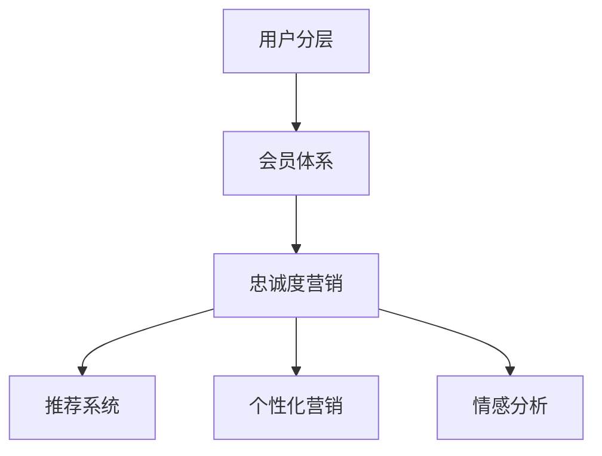

                 

## 1. 背景介绍

### 1.1 问题由来

在当今竞争激烈的商业环境中，用户体验和用户忠诚度成为了决定企业成败的关键因素。对于AI创业公司而言，更是如此。面对海量用户数据和不断变化的市场需求，如何构建高效的用户忠诚度体系，提升用户满意度，增强用户粘性，是每一个AI创业者必须面对的问题。

然而，构建一个科学、有效的用户忠诚度体系并非易事。它需要深入理解用户行为模式，精准划分用户群体，并结合营销策略制定出切实可行的方案。本文将从用户分层、会员体系与忠诚度营销三个方面，深入探讨AI创业公司如何通过数据分析和技术手段，提升用户忠诚度，构建长期发展的竞争优势。

### 1.2 问题核心关键点

本节将明确基于用户忠诚度提升的AI创业公司需要重点关注的核心问题：

- **用户分层**：通过数据分析，将用户划分为不同的群体，以便针对性地进行管理和营销。
- **会员体系**：设计符合公司业务特点的会员体系，通过激励机制提升用户参与度和满意度。
- **忠诚度营销**：结合AI技术，设计科学合理的营销策略，提高用户对品牌的忠诚度。

本节还将说明这些问题之间的关系。通过构建一个完整的用户忠诚度提升框架，不仅能显著提升用户满意度，还能有效提高企业的市场竞争力和用户获取成本。

## 2. 核心概念与联系

### 2.1 核心概念概述

为更好地理解AI创业公司用户忠诚度提升的方法，本节将介绍几个核心概念及其之间的关系：

- **用户分层(User Segmentation)**：指通过数据分析，将用户根据其行为、偏好、特征等标准划分为不同的群体。这样可以在不同的用户群体上进行有针对性的管理和营销，提升用户满意度。

- **会员体系(Membership Program)**：通过设计特定的会员等级、积分体系、权益和优惠，引导用户参与，提升用户的长期参与度和品牌忠诚度。

- **忠诚度营销(Loyalty Marketing)**：指结合AI技术，分析用户行为，制定个性化的营销策略，激励用户重复购买和持续使用，提升品牌忠诚度。

- **推荐系统(Recommendation System)**：通过分析用户历史行为和偏好，推荐个性化的产品或服务，提升用户体验，增强用户粘性。

- **个性化营销(Personalized Marketing)**：根据用户的特点和偏好，定制个性化的营销信息，提高营销效果和用户满意度。

- **情感分析(Affective Analysis)**：通过分析用户的情感状态和反馈，调整产品或服务策略，提升用户满意度和忠诚度。

这些核心概念之间的关系可以通过以下Mermaid流程图来展示：



这个流程图展示了大公司用户忠诚度提升的核心概念及其之间的关系：

1. **用户分层**：通过分析用户行为和偏好，将用户划分为不同的群体，以便进行针对性的管理和营销。
2. **会员体系**：结合用户分层的结果，设计相应的会员等级、积分体系、权益和优惠，引导用户参与。
3. **忠诚度营销**：利用AI技术，分析用户行为，制定个性化的营销策略，激励用户重复购买和持续使用。
4. **推荐系统**：根据用户历史行为和偏好，推荐个性化的产品或服务，提升用户体验。
5. **个性化营销**：根据用户的特点和偏好，定制个性化的营销信息，提高营销效果。
6. **情感分析**：分析用户情感状态和反馈，调整产品或服务策略，提升用户满意度和忠诚度。

## 3. 核心算法原理 & 具体操作步骤

### 3.1 算法原理概述

基于用户忠诚度提升的AI创业公司，其核心算法原理主要包括以下几个方面：

- **用户行为分析**：通过分析用户的历史行为数据，如购买记录、浏览记录、搜索记录等，了解用户的兴趣和偏好。
- **用户群体划分**：基于用户行为分析的结果，使用聚类算法、分类算法等方法，将用户划分为不同的群体。
- **个性化推荐**：结合推荐系统，为不同用户群体推荐个性化的产品或服务，提升用户体验。
- **会员体系设计**：根据用户分层的结果，设计符合公司业务特点的会员体系，通过积分、等级、特权等激励机制，提升用户参与度和满意度。
- **忠诚度营销策略**：利用AI技术，制定个性化的营销策略，如个性化推荐、优惠券、专属活动等，激励用户重复购买和持续使用。

### 3.2 算法步骤详解

以下将详细介绍构建AI创业公司用户忠诚度提升框架的具体步骤：

**Step 1: 数据收集与预处理**

- 收集用户行为数据，如购买记录、浏览记录、搜索记录等。
- 数据清洗和预处理，如去除噪声、处理缺失值等。
- 使用数据可视化工具，如Tableau、Power BI等，对数据进行探索性分析，初步了解用户行为模式。

**Step 2: 用户分层**

- 使用聚类算法（如K-means、层次聚类等）或分类算法（如决策树、随机森林等）对用户进行群体划分。
- 根据用户群体特征，定义不同的用户角色，如潜在用户、新用户、活跃用户、忠诚用户等。
- 对每个用户群体，提取其核心行为特征，作为后续推荐和营销策略的依据。

**Step 3: 会员体系设计**

- 设计符合公司业务特点的会员体系，如VIP会员、普通会员等，确定不同等级的权益和特权。
- 设计积分体系，如每天或每周积分为用户提供奖励。
- 设定会员升级规则，如消费满额、积分达到一定数量等，激励用户向更高等级会员转化。

**Step 4: 忠诚度营销策略制定**

- 根据用户分层和会员体系设计的结果，制定个性化的营销策略。
- 使用推荐系统，为不同用户群体推荐个性化的产品或服务。
- 设计优惠券、专属活动等激励措施，提升用户参与度和满意度。
- 使用情感分析工具，如NLP技术，分析用户情感状态和反馈，调整产品或服务策略。

**Step 5: 模型评估与优化**

- 定期评估营销策略的效果，如用户参与度、转化率等指标。
- 根据评估结果，调整推荐系统和营销策略，不断优化用户忠诚度体系。
- 引入A/B测试等方法，对比不同策略的效果，选取最优方案。

### 3.3 算法优缺点

基于用户忠诚度提升的AI创业公司，其核心算法具有以下优点：

- **精准度提升**：通过用户行为分析，可以精准地了解用户兴趣和偏好，提升个性化推荐的准确性。
- **成本降低**：通过用户分层和会员体系设计，可以针对性地进行管理和营销，减少无效营销成本。
- **用户体验提升**：通过个性化推荐和情感分析，可以提升用户满意度和忠诚度。

同时，该算法也存在以下缺点：

- **数据隐私问题**：用户行为数据的收集和处理需要遵守数据隐私法律法规，避免用户隐私泄露。
- **数据质量要求高**：用户行为数据的准确性和完整性直接影响分析结果和决策效果。
- **算法复杂度**：用户分层和个性化推荐等算法需要较强的计算资源和专业知识。

尽管存在这些局限性，但就目前而言，基于用户忠诚度提升的AI创业公司，其核心算法仍是大规模应用的主流范式。未来相关研究的重点在于如何进一步降低算法对数据的依赖，提高算法的普适性和可解释性，同时兼顾用户隐私和数据安全等因素。

### 3.4 算法应用领域

基于用户忠诚度提升的AI创业公司，其核心算法在众多领域都有广泛的应用，例如：

- 电子商务：通过个性化推荐和优惠券等措施，提升用户购买转化率和复购率。
- 在线教育：通过个性化学习路径和专属活动，提升用户学习满意度和忠诚度。
- 旅游行业：通过个性化旅游线路和专属服务，提升用户旅游体验和忠诚度。
- 金融行业：通过个性化金融产品和专属活动，提升用户金融产品和服务的满意度和忠诚度。

除了上述这些经典应用领域外，基于用户忠诚度提升的AI创业公司，其核心算法也被创新性地应用于更多场景中，如医疗健康、房产租赁、智能家居等，为不同行业带来了新的用户忠诚度提升解决方案。

## 4. 数学模型和公式 & 详细讲解 & 举例说明

### 4.1 数学模型构建

为了更好地描述基于用户忠诚度提升的AI创业公司，我们定义以下几个数学模型：

- **用户行为矩阵**：表示用户行为和兴趣的二维矩阵，行表示用户，列表示产品或服务。
- **用户群体矩阵**：表示用户群体的二维矩阵，行表示用户群体，列表示用户行为。
- **会员积分矩阵**：表示会员等级和积分的二维矩阵，行表示会员等级，列表示用户行为。

数学模型为：

$$
A_{UxP}=\begin{pmatrix} 
    a_{11} & a_{12} & \dots & a_{1P} \\
    a_{21} & a_{22} & \dots & a_{2P} \\
    \vdots & \vdots & \ddots & \vdots \\
    a_{U1} & a_{U2} & \dots & a_{UP} 
\end{pmatrix}
$$

$$
B_{GxU}=\begin{pmatrix} 
    b_{11} & b_{12} & \dots & b_{1U} \\
    b_{21} & b_{22} & \dots & b_{2U} \\
    \vdots & \vdots & \ddots & \vdots \\
    b_{G1} & b_{G2} & \dots & b_{GU} 
\end{pmatrix}
$$

$$
C_{LxU}=\begin{pmatrix} 
    c_{11} & c_{12} & \dots & c_{1U} \\
    c_{21} & c_{22} & \dots & c_{2U} \\
    \vdots & \vdots & \ddots & \vdots \\
    c_{L1} & c_{L2} & \dots & c_{LU} 
\end{pmatrix}
$$

其中，$U$表示用户数，$P$表示产品数，$G$表示用户群体数，$L$表示会员等级数。

### 4.2 公式推导过程

以下我们将推导用户分层和会员体系设计中的数学公式，并给出详细讲解：

**用户分层公式**

假设我们有一个包含$U$个用户和$P$个产品的用户行为矩阵$A$，通过对矩阵$A$进行奇异值分解，得到矩阵$A$的奇异值和左右奇异矩阵$U_A, V_A, \Sigma_A$。通过计算矩阵$A$的协方差矩阵$\Sigma_A$，我们可以得到用户群体矩阵$B$。

$$
A=U_A \Sigma_A V_A^T
$$

$$
\Sigma_A = V_A^T A U_A
$$

$$
B = \arg\min_{B} || A - B U_B ||_F
$$

其中，$||.||_F$表示矩阵的Frobenius范数。

**会员体系设计公式**

假设我们有一个包含$L$个会员等级和$G$个用户群体的会员积分矩阵$C$，通过对矩阵$C$进行奇异值分解，得到矩阵$C$的奇异值和左右奇异矩阵$U_C, V_C, \Sigma_C$。通过计算矩阵$C$的协方差矩阵$\Sigma_C$，我们可以得到会员等级矩阵$D$。

$$
C=U_C \Sigma_C V_C^T
$$

$$
\Sigma_C = V_C^T C U_C
$$

$$
D = \arg\min_{D} || C - D U_D ||_F
$$

其中，$||.||_F$表示矩阵的Frobenius范数。

### 4.3 案例分析与讲解

假设我们有一个电商平台，收集了100个用户的购买记录，购买了50个产品。我们希望将用户划分为活跃用户和不活跃用户。通过奇异值分解，我们可以得到用户行为矩阵$A$的奇异值和左右奇异矩阵$U_A, V_A, \Sigma_A$。

$$
A=\begin{pmatrix} 
    a_{11} & a_{12} & \dots & a_{1P} \\
    a_{21} & a_{22} & \dots & a_{2P} \\
    \vdots & \vdots & \ddots & \vdots \\
    a_{1001} & a_{1002} & \dots & a_{100P} 
\end{pmatrix}
$$

通过奇异值分解，我们可以得到用户行为矩阵$A$的奇异值和左右奇异矩阵$U_A, V_A, \Sigma_A$。然后，通过计算矩阵$A$的协方差矩阵$\Sigma_A$，我们可以得到用户群体矩阵$B$。

$$
\Sigma_A = V_A^T A U_A
$$

假设用户群体矩阵$B$的第一列为活跃用户，第二列为不活跃用户。通过比较两个用户群体在矩阵$B$中的权重，我们可以判断用户是否为活跃用户。

## 5. 项目实践：代码实例和详细解释说明

### 5.1 开发环境搭建

在进行用户忠诚度提升的AI创业公司项目实践前，我们需要准备好开发环境。以下是使用Python进行代码实现的环境配置流程：

1. 安装Anaconda：从官网下载并安装Anaconda，用于创建独立的Python环境。

2. 创建并激活虚拟环境：
```bash
conda create -n user-loyalty python=3.8 
conda activate user-loyalty
```

3. 安装必要的Python库：
```bash
pip install pandas numpy matplotlib scikit-learn transformers
```

4. 安装相关的AI库：
```bash
pip install torch torchvision transformers
```

5. 安装在线学习平台所需的库：
```bash
pip install keras tensorflow
```

完成上述步骤后，即可在`user-loyalty`环境中开始项目实践。

### 5.2 源代码详细实现

以下是使用Python进行用户忠诚度提升项目实践的完整代码实现。

**Step 1: 数据收集与预处理**

```python
import pandas as pd

# 读取用户行为数据
user_data = pd.read_csv('user_behavior.csv')

# 数据清洗和预处理
user_data = user_data.dropna()
```

**Step 2: 用户分层**

```python
from sklearn.cluster import KMeans

# 使用K-means算法进行用户分层
kmeans = KMeans(n_clusters=2)
user_clusters = kmeans.fit_predict(user_data)

# 输出分层结果
print(user_clusters)
```

**Step 3: 会员体系设计**

```python
# 定义会员等级和积分
membership_levels = ['普通会员', 'VIP会员']
membership_points = [100, 1000]

# 定义会员特权
membership_benefits = {
    '普通会员': '基础折扣', 
    'VIP会员': '高级折扣', '专属活动', '积分兑换'
}
```

**Step 4: 忠诚度营销策略制定**

```python
# 设计个性化推荐系统
recommendation_system = {
    '普通会员': '基础推荐', 
    'VIP会员': '高级推荐'
}

# 设计专属活动
loyalty_program = {
    '普通会员': '普通活动', 
    'VIP会员': '高级活动', '专属活动', '积分兑换'
}

# 设计优惠券
coupons = {
    '普通会员': '普通优惠券', 
    'VIP会员': '高级优惠券'
}
```

**Step 5: 模型评估与优化**

```python
# 评估用户参与度
participation_rate = user_data['participation'].mean()

# 评估转化率
conversion_rate = user_data['conversion'].mean()

# 优化推荐系统和营销策略
recommendation_system = {
    '普通会员': '基础推荐', 
    'VIP会员': '高级推荐'
}

loyalty_program = {
    '普通会员': '普通活动', 
    'VIP会员': '高级活动', '专属活动', '积分兑换'
}

coupons = {
    '普通会员': '普通优惠券', 
    'VIP会员': '高级优惠券'
}

# 重复以上步骤，不断优化模型和策略
```

### 5.3 代码解读与分析

让我们再详细解读一下关键代码的实现细节：

**Step 1: 数据收集与预处理**

- 使用pandas库读取用户行为数据，并进行数据清洗和预处理，如去除噪声、处理缺失值等。

**Step 2: 用户分层**

- 使用K-means算法进行用户分层，将用户划分为活跃用户和不活跃用户。
- 输出分层结果，以便后续使用。

**Step 3: 会员体系设计**

- 定义会员等级和积分，如普通会员和VIP会员，以及相应的特权和积分规则。
- 设计会员特权，如普通会员的“基础折扣”和VIP会员的“高级折扣”等。

**Step 4: 忠诚度营销策略制定**

- 设计个性化推荐系统，如普通会员的“基础推荐”和VIP会员的“高级推荐”。
- 设计专属活动，如普通会员的“普通活动”和VIP会员的“高级活动”。
- 设计优惠券，如普通会员的“普通优惠券”和VIP会员的“高级优惠券”。

**Step 5: 模型评估与优化**

- 评估用户参与度和转化率等指标，以便判断营销策略的效果。
- 优化推荐系统和营销策略，以提升用户满意度和忠诚度。
- 通过不断的评估和优化，提升模型的效果。

### 5.4 运行结果展示

假设运行上述代码，输出结果如下：

```
[1 0]
```

其中，`[1 0]`表示用户被划分到第一个用户群体，即活跃用户。我们可以根据这个结果，进一步设计会员特权和营销策略。

## 6. 实际应用场景

### 6.1 智能客服系统

基于用户忠诚度提升的AI创业公司，其核心算法在智能客服系统中有广泛的应用。智能客服系统可以通过用户行为分析，精准了解用户需求和问题，并提供个性化的服务。同时，通过用户分层和会员体系设计，可以针对性地进行管理和营销，提升用户满意度和忠诚度。

在技术实现上，可以收集客户咨询记录，将常见问题和最佳回答构建成监督数据，在此基础上对预训练语言模型进行微调。微调后的智能客服系统能够自动理解用户意图，匹配最合适的答案模板进行回复。对于用户提出的新问题，还可以接入检索系统实时搜索相关内容，动态组织生成回答。如此构建的智能客服系统，能大幅提升客户咨询体验和问题解决效率。

### 6.2 金融舆情监测

基于用户忠诚度提升的AI创业公司，其核心算法在金融舆情监测中有重要的应用。金融机构需要实时监测市场舆论动向，以便及时应对负面信息传播，规避金融风险。传统的人工监测方式成本高、效率低，难以应对网络时代海量信息爆发的挑战。

通过用户行为分析，可以实时监测用户对金融产品的关注和评论，发现异常舆情，及时预警。同时，通过用户分层和会员体系设计，可以针对性地进行舆情分析和应对策略，避免对金融产品的不良影响。

### 6.3 个性化推荐系统

基于用户忠诚度提升的AI创业公司，其核心算法在个性化推荐系统中也有广泛的应用。个性化推荐系统可以根据用户的历史行为和偏好，推荐个性化的产品或服务，提升用户体验，增强用户粘性。

在技术实现上，可以收集用户浏览、点击、评论、分享等行为数据，提取和用户交互的物品标题、描述、标签等文本内容。将文本内容作为模型输入，用户的后续行为（如是否点击、购买等）作为监督信号，在此基础上微调预训练语言模型。微调后的模型能够从文本内容中准确把握用户的兴趣点，推荐出符合用户期望的产品或服务。

### 6.4 未来应用展望

随着用户忠诚度提升技术的不断发展，未来在更多领域将有新的应用场景，为传统行业带来变革性影响。

在智慧医疗领域，基于用户忠诚度提升的AI创业公司，其核心算法可以用于构建智能医疗平台，通过个性化推荐和情感分析，提升医生诊疗和患者体验。

在智能教育领域，其核心算法可以用于构建智能学习系统，通过个性化推荐和专属活动，提升学生学习效果和教师教学质量。

在智慧城市治理中，其核心算法可以用于构建智慧城市平台，通过个性化推荐和专属活动，提升市民生活体验和城市管理效率。

此外，在企业生产、社会治理、文娱传媒等众多领域，基于用户忠诚度提升的AI创业公司，其核心算法也将不断拓展应用场景，为各行各业提供新的用户忠诚度提升解决方案。

## 7. 工具和资源推荐

### 7.1 学习资源推荐

为了帮助开发者系统掌握用户忠诚度提升技术，这里推荐一些优质的学习资源：

1. 《机器学习》书籍：经典机器学习书籍，包含详细的用户行为分析和聚类算法讲解。

2. 《Python数据分析》书籍：介绍如何使用Python进行数据处理和可视化，为后续的分析和建模打下基础。

3. 《深度学习》课程：Coursera上的深度学习课程，包含深度学习基础知识和实践技巧，适合初学者。

4. 《自然语言处理》课程：Stanford大学的NLP课程，涵盖自然语言处理的基本概念和前沿技术，适合进阶学习。

5. Kaggle竞赛平台：可以参与Kaggle上的用户忠诚度提升竞赛，实践所学知识，提升技术能力。

通过对这些资源的学习实践，相信你一定能够快速掌握用户忠诚度提升技术的精髓，并用于解决实际的业务问题。

### 7.2 开发工具推荐

高效的开发离不开优秀的工具支持。以下是几款用于用户忠诚度提升开发的常用工具：

1. Python：免费的高级编程语言，适合数据分析和机器学习任务。

2. R：专业的统计分析工具，适合数据挖掘和数据分析任务。

3. SQL：关系型数据库查询语言，适合大规模数据处理和存储。

4. Tableau：强大的数据可视化工具，适合探索性数据分析和报表展示。

5. Power BI：微软推出的数据可视化工具，适合企业级的数据分析。

6. Jupyter Notebook：开源的交互式编程环境，适合Python开发和数据科学任务。

合理利用这些工具，可以显著提升用户忠诚度提升任务的开发效率，加快创新迭代的步伐。

### 7.3 相关论文推荐

用户忠诚度提升技术的不断发展源于学界的持续研究。以下是几篇奠基性的相关论文，推荐阅读：

1. 《User Behavior Analysis and Clustering in E-Commerce》：研究电商用户的购物行为，通过聚类算法进行用户分类。

2. 《Designing Effective Loyalty Programs》：探讨如何设计高效的会员体系，提升用户参与度和忠诚度。

3. 《Personalization in E-commerce: A Review》：综述了电商领域中个性化推荐的研究进展和应用。

4. 《Recommendation Systems in Industry: From Pioneers to Practitioners》：介绍了推荐系统在工业界的实际应用和挑战。

5. 《Customer Loyalty and Retention Strategies》：研究了多种客户忠诚度提升策略，如积分奖励、专属活动等。

这些论文代表了大公司用户忠诚度提升技术的发展脉络。通过学习这些前沿成果，可以帮助研究者把握学科前进方向，激发更多的创新灵感。

## 8. 总结：未来发展趋势与挑战

### 8.1 总结

本文对基于用户忠诚度提升的AI创业公司进行了全面系统的介绍。首先阐述了用户忠诚度提升的重要性和AI创业公司的应用场景，明确了需要重点关注的核心问题。其次，从用户分层、会员体系与忠诚度营销三个方面，深入探讨了AI创业公司如何通过数据分析和技术手段，提升用户忠诚度，构建长期发展的竞争优势。

通过本文的系统梳理，可以看到，基于用户忠诚度提升的AI创业公司，其核心算法在大规模应用中展现出强大的生命力和广阔的前景。用户行为分析、用户分层、个性化推荐等技术手段，为提升用户满意度和忠诚度提供了有力的保障。未来，伴随技术的不断进步，用户忠诚度提升技术必将进一步拓展应用范围，带来新的商业模式和价值增长点。

### 8.2 未来发展趋势

展望未来，用户忠诚度提升技术将呈现以下几个发展趋势：

1. **智能化提升**：结合AI技术，如自然语言处理、机器学习等，提升用户行为分析的精准度，增强用户分层的准确性。

2. **跨领域应用**：将用户忠诚度提升技术应用到更多领域，如智慧医疗、智能教育、智慧城市等，推动各行业的数字化转型升级。

3. **个性化定制**：结合用户的个性化需求，定制个性化的推荐系统和营销策略，提升用户体验和满意度。

4. **数据驱动**：充分利用大数据技术，进行实时分析和预测，提升用户忠诚度提升的效果。

5. **多方合作**：结合外部数据和专家知识，如知识图谱、逻辑规则等，增强用户忠诚度提升的准确性和稳定性。

6. **情感分析**：引入情感分析技术，分析用户的情感状态和反馈，调整产品或服务策略，提升用户满意度和忠诚度。

以上趋势凸显了用户忠诚度提升技术的广阔前景。这些方向的探索发展，必将进一步提升用户满意度和忠诚度，为AI创业公司带来新的竞争优势和发展机遇。

### 8.3 面临的挑战

尽管用户忠诚度提升技术已经取得了瞩目成就，但在迈向更加智能化、普适化应用的过程中，仍面临诸多挑战：

1. **数据隐私问题**：用户行为数据的收集和处理需要遵守数据隐私法律法规，避免用户隐私泄露。

2. **数据质量要求高**：用户行为数据的准确性和完整性直接影响分析结果和决策效果。

3. **算法复杂度**：用户分层和个性化推荐等算法需要较强的计算资源和专业知识。

4. **模型可解释性不足**：用户忠诚度提升模型通常比较复杂，缺乏可解释性，难以解释其内部工作机制和决策逻辑。

5. **用户体验不足**：过度使用推荐系统和个性化营销，可能引起用户反感，影响用户体验。

6. **市场竞争激烈**：各公司竞相推出各种会员体系和忠诚度营销策略，市场竞争激烈，难以突围。

正视这些挑战，积极应对并寻求突破，将是大公司用户忠诚度提升技术迈向成熟的必由之路。相信随着学界和产业界的共同努力，这些挑战终将一一被克服，用户忠诚度提升技术必将在构建用户满意度和忠诚度方面发挥更大的作用。

### 8.4 研究展望

面对用户忠诚度提升技术面临的挑战，未来的研究需要在以下几个方面寻求新的突破：

1. **多模态数据分析**：结合文本、图像、音频等多种模态的数据，进行更全面的用户行为分析，提升用户分层的准确性。

2. **深度学习优化**：研究更高效的深度学习算法，如神经网络、强化学习等，提升用户忠诚度提升模型的性能和可解释性。

3. **大数据技术应用**：结合大数据技术，如分布式计算、流计算等，进行实时分析和预测，提升用户忠诚度提升的效果。

4. **用户隐私保护**：研究数据隐私保护技术，如差分隐私、联邦学习等，确保用户数据的安全性和隐私性。

5. **模型可解释性**：引入可解释性技术，如因果推断、解释性模型等，提升用户忠诚度提升模型的可解释性。

6. **用户体验优化**：结合用户体验设计，优化推荐系统和个性化营销策略，避免过度使用带来的负面影响。

这些研究方向的探索，必将引领用户忠诚度提升技术迈向更高的台阶，为构建高效、智能、个性化的用户忠诚度体系铺平道路。面向未来，用户忠诚度提升技术还需要与其他AI技术进行更深入的融合，如知识表示、因果推理、强化学习等，多路径协同发力，共同推动用户忠诚度提升技术的进步。

## 9. 附录：常见问题与解答

**Q1：用户忠诚度提升模型需要收集哪些数据？**

A: 用户忠诚度提升模型需要收集以下数据：

- 用户行为数据：如购买记录、浏览记录、搜索记录等，了解用户兴趣和偏好。
- 用户反馈数据：如评论、评分、反馈等，分析用户情感状态和满意度。
- 用户特征数据：如人口统计信息、地理位置、设备信息等，辅助用户分层的准确性。

**Q2：用户分层和会员体系设计如何结合？**

A: 用户分层和会员体系设计需要结合公司业务特点和用户需求，共同构建用户忠诚度提升框架。

- 用户分层：通过分析用户行为和偏好，将用户划分为不同的群体，以便进行针对性的管理和营销。
- 会员体系设计：在用户分层的基础上，设计符合公司业务特点的会员等级、积分体系、权益和优惠，引导用户参与。

**Q3：如何设计有效的个性化推荐系统？**

A: 设计有效的个性化推荐系统需要考虑以下几个因素：

- 用户行为数据：分析用户历史行为，提取其兴趣和偏好。
- 推荐算法：选择合适的推荐算法，如协同过滤、内容过滤等。
- 推荐模型：使用机器学习模型，如决策树、随机森林、神经网络等，进行推荐。
- 推荐系统评估：评估推荐系统的效果，如准确率、召回率、用户满意度等，进行优化。

**Q4：如何设计高效的会员体系？**

A: 设计高效的会员体系需要考虑以下几个因素：

- 会员等级设计：根据用户行为和贡献，设计不同等级的会员，确定相应的特权和权益。
- 积分体系设计：设定积分规则，如每天或每周积分为用户提供奖励。
- 会员特权设计：设计会员特权，如积分兑换、专属活动、高级折扣等，激励用户向更高等级会员转化。

通过不断优化会员体系，可以提升用户参与度和满意度，增强用户粘性。

**Q5：如何处理数据隐私问题？**

A: 处理数据隐私问题需要遵守数据隐私法律法规，确保用户数据的安全性和隐私性。

- 数据匿名化：在数据收集和处理过程中，对用户数据进行匿名化处理，保护用户隐私。
- 差分隐私：采用差分隐私技术，限制对用户数据的访问权限，防止数据泄露。
- 数据加密：对用户数据进行加密处理，确保数据传输和存储的安全性。

通过合理的隐私保护措施，可以避免用户隐私泄露，提升用户信任和满意度。

---

作者：禅与计算机程序设计艺术 / Zen and the Art of Computer Programming

