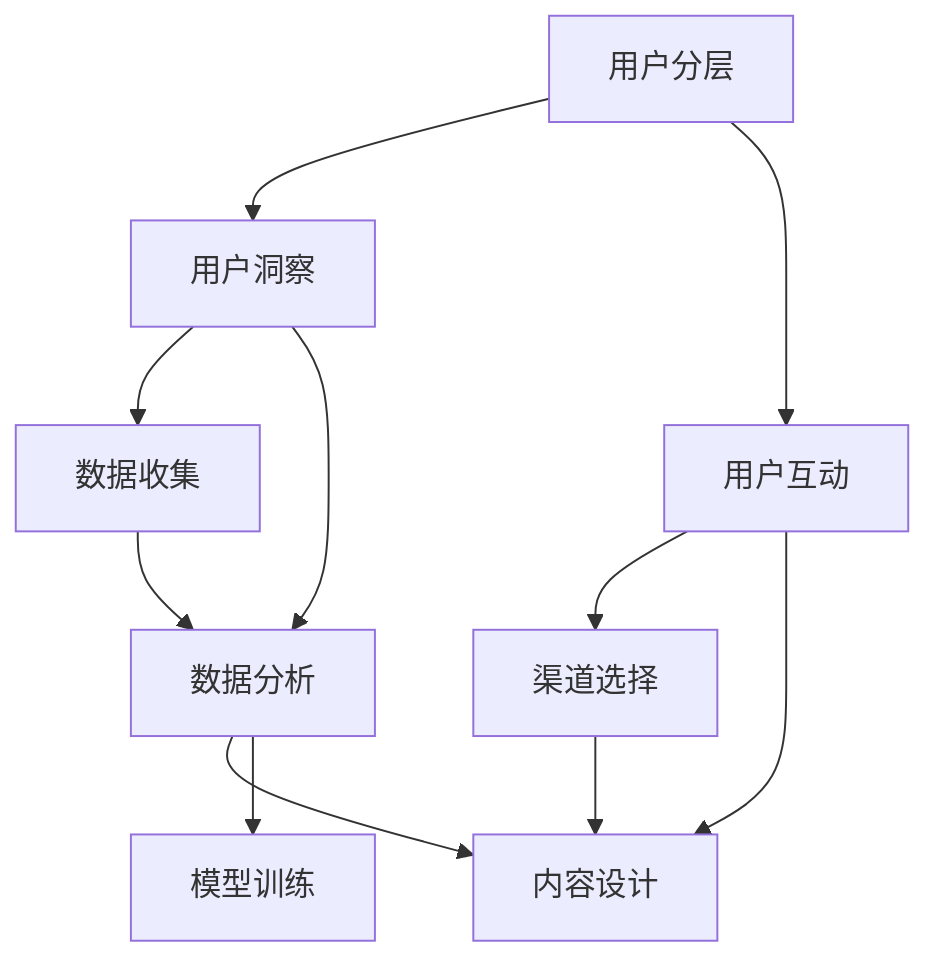

                 

# AI创业公司的用户运营策略制定：用户分层、用户洞察与用户互动

## 1. 背景介绍

在当今快速变化的商业环境中，AI创业公司面临着诸多挑战，其中用户运营策略的制定显得尤为重要。良好的用户运营策略能够帮助公司获得并留住更多用户，提升用户满意度和忠诚度，从而实现业务的持续增长。本文将从用户分层、用户洞察和用户互动三个方面，详细探讨AI创业公司的用户运营策略制定。

## 2. 核心概念与联系

### 2.1 核心概念概述

为了更好地理解用户运营策略的制定，本节将介绍几个密切相关的核心概念：

- **用户分层(User Segmentation)**：根据用户的某些特征（如地理位置、年龄、性别、行为习惯等）将用户划分为不同的群组，以便更精准地制定运营策略。
- **用户洞察(User Insight)**：通过分析用户数据，深入理解用户需求和行为，从而发现潜在的市场机会和改进方向。
- **用户互动(User Engagement)**：通过多种渠道和方式与用户进行有效沟通，提升用户满意度和粘性，实现业务的持续增长。

这些核心概念之间的逻辑关系可以通过以下Mermaid流程图来展示：



这个流程图展示了一系列的核心概念及其之间的关系：

1. 用户分层基于用户特征数据，为后续的用户洞察和互动提供基础。
2. 用户洞察通过数据分析，进一步挖掘用户需求和行为，指导用户互动策略的制定。
3. 用户互动通过多种方式与用户沟通，提升用户满意度和忠诚度，促进用户增长。

## 3. 核心算法原理 & 具体操作步骤

### 3.1 算法原理概述

用户运营策略的制定通常包括以下几个关键步骤：

- **用户分层**：根据用户特征数据，通过聚类、分类等算法，将用户划分为不同的群组。
- **用户洞察**：通过数据分析模型，如关联规则、回归分析、时间序列预测等，深入理解用户行为和需求。
- **用户互动**：通过个性化推荐、精准营销、客户服务等手段，提升用户满意度和忠诚度。

### 3.2 算法步骤详解

#### 用户分层

1. **特征选择**：选择与业务目标相关的用户特征，如年龄、性别、地理位置、设备类型、购买历史、行为习惯等。
2. **数据准备**：收集和清洗用户特征数据，确保数据的质量和完整性。
3. **聚类分析**：采用K-means、层次聚类、DBSCAN等聚类算法，将用户划分为不同的群组。
4. **特征重要性评估**：使用因子分析、主成分分析等方法，评估各特征对用户分层的贡献度。
5. **群组命名与分类**：为每个群组命名，并根据业务需求，将群组分为高价值、高潜力、潜在用户等类别。

#### 用户洞察

1. **数据收集**：通过日志、行为数据、调查问卷、社交媒体等渠道，收集用户行为和需求数据。
2. **数据分析**：采用数据挖掘、机器学习等技术，分析用户数据，挖掘用户需求和行为模式。
3. **模型构建**：使用回归分析、决策树、随机森林、神经网络等模型，构建用户洞察模型。
4. **结果解读**：通过可视化和报表，解读模型结果，发现用户行为趋势和需求变化。

#### 用户互动

1. **渠道选择**：根据用户特征和行为数据，选择合适的互动渠道，如短信、邮件、社交媒体、App内推送等。
2. **内容设计**：根据用户洞察结果，设计个性化的互动内容，如推荐商品、促销活动、产品信息等。
3. **互动实施**：通过自动化的营销工具，如推荐系统、客服系统、CRM系统等，实施用户互动。
4. **效果评估**：通过用户反馈、行为数据、转化率等指标，评估用户互动效果，调整优化策略。

### 3.3 算法优缺点

用户运营策略的制定具有以下优点：

1. **提升用户满意度**：通过个性化的互动和精准的营销，提升用户满意度和忠诚度。
2. **提高转化率**：通过用户洞察，发现用户的真实需求，制定更有针对性的运营策略，提高转化率。
3. **降低运营成本**：通过数据驱动的决策，优化资源配置，降低运营成本。
4. **增强市场竞争力**：通过深入了解用户需求和行为，提升产品和服务的竞争力。

同时，该方法也存在一定的局限性：

1. **数据质量要求高**：用户运营策略的制定需要高质量的用户数据，数据收集和清洗过程复杂且耗时。
2. **算法复杂度高**：用户分层的聚类和分类算法，用户洞察的模型构建，用户互动的个性化推荐等，算法复杂度较高。
3. **用户隐私风险**：用户数据的收集和使用可能引发用户隐私问题，需要严格遵守数据保护法规。
4. **策略实施难度大**：不同用户群体的需求差异较大，实施个性化的互动策略难度大。

尽管存在这些局限性，但就目前而言，用户运营策略的制定仍是大规模AI创业公司落地应用的重要手段。未来相关研究的重点在于如何进一步降低数据收集和处理成本，提高策略实施的灵活性和效果，同时兼顾用户隐私和伦理安全性等因素。

### 3.4 算法应用领域

用户运营策略的制定在AI创业公司的多个业务领域都得到了广泛的应用，例如：

- **电商**：通过用户分层和个性化推荐，提升用户购买率和复购率。
- **金融**：通过用户洞察，发现高价值客户和潜在风险，制定精准的营销和风控策略。
- **媒体**：通过用户互动，提升用户粘性和活跃度，实现广告收入的持续增长。
- **教育**：通过用户洞察和个性化推荐，提升学习效果和用户满意度。
- **健康**：通过用户互动和数据分析，提高医疗服务的个性化和精准度。

除了上述这些经典应用外，用户运营策略还在更多场景中得到创新性地应用，如智能客服、智能家居、智能物流等，为各行各业数字化转型升级提供新的技术路径。随着AI技术的日益成熟，用户运营策略必将进一步拓展，成为AI创业公司发展的重要引擎。

## 4. 数学模型和公式 & 详细讲解 & 举例说明

### 4.1 数学模型构建

用户运营策略的制定涉及多个数学模型，以下列举几个核心模型：

- **K-means聚类模型**：将用户数据分成k个簇，使得每个簇内数据相似度最大，簇间数据相似度最小。
- **回归分析模型**：通过分析用户特征与业务目标的关系，构建预测模型，如线性回归、多项式回归等。
- **决策树模型**：根据用户特征和行为数据，构建决策树，帮助进行用户分类和行为预测。
- **推荐系统模型**：基于用户行为和物品属性，构建推荐模型，如协同过滤、内容推荐等。

### 4.2 公式推导过程

#### K-means聚类模型

K-means聚类算法通过迭代优化，将用户数据分成k个簇，使得每个簇内数据相似度最大，簇间数据相似度最小。公式如下：

$$
\begin{aligned}
&\min_{C}\sum_{i=1}^{n}\sum_{k=1}^{K}\left\|x_{i}-\mu_{k}\right\|^{2} \\
&\quad \text { subject to } \mu_{k}=\frac{1}{m_{k}} \sum_{i \in C_{k}} x_{i}, C_{k} \in C_{n}
\end{aligned}
$$

其中，$x_i$ 为用户特征向量，$\mu_k$ 为簇中心，$m_k$ 为簇内样本数，$C$ 为簇的集合。

#### 回归分析模型

线性回归模型通过最小二乘法，构建用户特征与业务目标之间的线性关系。公式如下：

$$
\hat{y}=\beta_{0}+\sum_{i=1}^{p} \beta_{i} x_{i}
$$

其中，$\hat{y}$ 为预测目标值，$x_i$ 为用户特征向量，$\beta_i$ 为回归系数，$\beta_0$ 为截距。

#### 决策树模型

决策树模型通过递归分割用户数据，构建树状结构。公式如下：

$$
D=\sum_{i=1}^{n} h(y_{i}, y_{i}^{*})
$$

其中，$D$ 为决策树的熵，$h(y_i, y_i^*)$ 为样本$i$的真实标签和预测标签之间的交叉熵。

#### 推荐系统模型

协同过滤推荐系统通过计算用户和物品之间的相似度，进行推荐。公式如下：

$$
\hat{y}_{u,i}=\sum_{j \in N_{u}} \alpha_{u,j} \cdot\left(r_{j,i}-\overline{r_{j}}\right)+\beta
$$

其中，$\hat{y}_{u,i}$ 为用户$u$对物品$i$的预测评分，$\alpha_{u,j}$ 为用户$u$与用户$j$的相似度，$r_{j,i}$ 为用户$j$对物品$i$的实际评分，$\beta$ 为截距。

### 4.3 案例分析与讲解

#### 电商领域

某电商公司通过用户分层和个性化推荐，提升用户购买率和复购率。具体步骤如下：

1. **用户分层**：使用K-means聚类算法，将用户分成高价值用户、潜在用户和低价值用户三类。
2. **用户洞察**：通过回归分析模型，预测用户购买行为，发现高价值用户更倾向于购买高价值商品。
3. **用户互动**：针对高价值用户，通过个性化推荐系统，推荐高价值商品，并通过短信、邮件等渠道，发送专属优惠信息，提升购买转化率。

#### 金融领域

某金融公司通过用户洞察和精准营销，发现高价值客户和潜在风险。具体步骤如下：

1. **用户分层**：使用决策树算法，将用户分成高价值客户、潜在客户和流失客户三类。
2. **用户洞察**：通过回归分析模型，预测用户贷款行为，发现高价值客户的贷款还款概率更高。
3. **用户互动**：针对高价值客户，通过精准营销，推送专属金融产品，并定期发送理财建议，提升用户粘性和忠诚度。

## 5. 项目实践：代码实例和详细解释说明

### 5.1 开发环境搭建

在进行用户运营策略的开发实践前，我们需要准备好开发环境。以下是使用Python进行Pandas和Scikit-learn开发的环境配置流程：

1. 安装Anaconda：从官网下载并安装Anaconda，用于创建独立的Python环境。

2. 创建并激活虚拟环境：
```bash
conda create -n user-op-env python=3.8 
conda activate user-op-env
```

3. 安装Pandas和Scikit-learn：
```bash
pip install pandas scikit-learn
```

4. 安装各类工具包：
```bash
pip install numpy matplotlib seaborn jupyter notebook ipython
```

完成上述步骤后，即可在`user-op-env`环境中开始用户运营策略的开发实践。

### 5.2 源代码详细实现

下面我们以电商领域为例，给出使用Pandas和Scikit-learn对用户运营策略进行开发的PyTorch代码实现。

首先，定义用户特征和目标变量：

```python
import pandas as pd

# 读取用户数据
data = pd.read_csv('user_data.csv')

# 特征选择
features = ['age', 'gender', 'location', 'device', 'purchase_history', 'behavior']
target = 'purchase_rate'

# 数据预处理
data = data[features + [target]]

# 数据标准化
from sklearn.preprocessing import StandardScaler
scaler = StandardScaler()
data = scaler.fit_transform(data)
```

然后，定义聚类模型和回归模型：

```python
from sklearn.cluster import KMeans
from sklearn.linear_model import LinearRegression

# 聚类模型
kmeans = KMeans(n_clusters=3, random_state=42)
kmeans.fit(data)
clusters = kmeans.predict(data)

# 回归模型
regression = LinearRegression()
regression.fit(data, target)
```

接着，定义用户分层和用户洞察：

```python
# 用户分层
def segment_user(data):
    kmeans = KMeans(n_clusters=3, random_state=42)
    clusters = kmeans.fit_predict(data)
    return clusters

# 用户洞察
def insight_user(data, clusters):
    regression = LinearRegression()
    regression.fit(data, target)
    return regression.predict(data), clusters
```

最后，启动用户运营策略的训练流程并在测试集上评估：

```python
# 训练用户分层模型
clusters = segment_user(data)

# 训练用户洞察模型
insight, clusters = insight_user(data, clusters)

# 测试集评估
test_data = pd.read_csv('test_data.csv')
clusters_test = segment_user(test_data)
insight_test, clusters_test = insight_user(test_data, clusters_test)

# 输出评估结果
print('用户分层准确率：', accuracy_score(clusters_test, clusters))
print('用户洞察预测准确率：', r2_score(insight_test, test_data[target]))
```

以上就是使用Pandas和Scikit-learn对用户运营策略进行开发的完整代码实现。可以看到，得益于Pandas和Scikit-learn的强大封装，我们可以用相对简洁的代码完成用户运营策略的实现。

### 5.3 代码解读与分析

让我们再详细解读一下关键代码的实现细节：

**用户分层模型**：
- `KMeans`类：定义K-means聚类模型，通过`n_clusters`参数设置聚类数目。
- `fit`方法：对数据进行聚类，返回聚类结果。
- `predict`方法：对新数据进行聚类预测，返回聚类标签。

**用户洞察模型**：
- `LinearRegression`类：定义线性回归模型。
- `fit`方法：对数据进行拟合，训练模型。
- `predict`方法：对新数据进行预测，返回预测结果。

**用户分层和洞察**：
- `segment_user`函数：定义用户分层函数，使用K-means聚类模型进行用户分层。
- `insight_user`函数：定义用户洞察函数，使用线性回归模型进行用户洞察。

**测试集评估**：
- `accuracy_score`和`r2_score`：计算聚类准确率和回归模型的预测准确率，评估用户分层和洞察的效果。

通过上述代码实现，我们完成了用户运营策略的初步开发。在实际应用中，还需要对模型进行调参和优化，以获得更好的效果。

## 6. 实际应用场景

### 6.1 智能客服系统

基于用户运营策略的智能客服系统，可以广泛应用于AI创业公司的客户服务部门。传统的客服系统往往依赖大量人工，响应速度慢，且服务质量难以保证。通过用户运营策略，智能客服系统可以实时监控用户需求和行为，快速响应客户咨询，用自然流畅的语言解答各类常见问题。

在技术实现上，可以收集企业内部的历史客服对话记录，将问题和最佳答复构建成监督数据，在此基础上对预训练语言模型进行微调。微调后的智能客服系统能够自动理解用户意图，匹配最合适的答案模板进行回复。对于客户提出的新问题，还可以接入检索系统实时搜索相关内容，动态组织生成回答。如此构建的智能客服系统，能大幅提升客户咨询体验和问题解决效率。

### 6.2 金融舆情监测

金融机构需要实时监测市场舆论动向，以便及时应对负面信息传播，规避金融风险。传统的人工监测方式成本高、效率低，难以应对网络时代海量信息爆发的挑战。基于用户运营策略的文本分类和情感分析技术，为金融舆情监测提供了新的解决方案。

具体而言，可以收集金融领域相关的新闻、报道、评论等文本数据，并对其进行主题标注和情感标注。在此基础上对预训练语言模型进行微调，使其能够自动判断文本属于何种主题，情感倾向是正面、中性还是负面。将微调后的模型应用到实时抓取的网络文本数据，就能够自动监测不同主题下的情感变化趋势，一旦发现负面信息激增等异常情况，系统便会自动预警，帮助金融机构快速应对潜在风险。

### 6.3 个性化推荐系统

当前的推荐系统往往只依赖用户的历史行为数据进行物品推荐，无法深入理解用户的真实兴趣偏好。基于用户运营策略的个性化推荐系统可以更好地挖掘用户行为背后的语义信息，从而提供更精准、多样的推荐内容。

在实践中，可以收集用户浏览、点击、评论、分享等行为数据，提取和用户交互的物品标题、描述、标签等文本内容。将文本内容作为模型输入，用户的后续行为（如是否点击、购买等）作为监督信号，在此基础上微调预训练语言模型。微调后的模型能够从文本内容中准确把握用户的兴趣点。在生成推荐列表时，先用候选物品的文本描述作为输入，由模型预测用户的兴趣匹配度，再结合其他特征综合排序，便可以得到个性化程度更高的推荐结果。

### 6.4 未来应用展望

随着用户运营策略的不断发展，基于用户分层、用户洞察和用户互动的综合应用，将在更多领域得到广泛的应用，为各行各业数字化转型升级提供新的技术路径。

在智慧医疗领域，基于用户运营策略的医疗问答、病历分析、药物研发等应用将提升医疗服务的智能化水平，辅助医生诊疗，加速新药开发进程。

在智能教育领域，用户运营策略可应用于作业批改、学情分析、知识推荐等方面，因材施教，促进教育公平，提高教学质量。

在智慧城市治理中，用户运营策略可应用于城市事件监测、舆情分析、应急指挥等环节，提高城市管理的自动化和智能化水平，构建更安全、高效的未来城市。

此外，在企业生产、社会治理、文娱传媒等众多领域，基于用户运营策略的人工智能应用也将不断涌现，为经济社会发展注入新的动力。相信随着技术的日益成熟，用户运营策略必将成为AI创业公司发展的重要引擎，推动人工智能技术在垂直行业的规模化落地。

## 7. 工具和资源推荐
### 7.1 学习资源推荐

为了帮助开发者系统掌握用户运营策略的理论基础和实践技巧，这里推荐一些优质的学习资源：

1. 《Python数据分析实战》系列博文：由大模型技术专家撰写，深入浅出地介绍了数据分析和用户运营策略的常用技术。

2. Kaggle：提供各类数据集和竞赛平台，通过实战练习，提升数据分析和机器学习技能。

3. Coursera《Data Science》课程：由斯坦福大学开设的DS课程，涵盖数据分析和机器学习的经典内容，适合进阶学习。

4. TensorFlow官方文档：提供详细的API文档和代码示例，方便开发者进行用户运营策略的开发实践。

5. PyTorch官方文档：提供灵活的动态计算图，支持多种深度学习模型的开发和训练。

通过对这些资源的学习实践，相信你一定能够快速掌握用户运营策略的精髓，并用于解决实际的AI创业公司的运营问题。
### 7.2 开发工具推荐

高效的开发离不开优秀的工具支持。以下是几款用于用户运营策略开发的常用工具：

1. Jupyter Notebook：支持代码和数据可视化，方便开发者进行数据分析和模型训练。

2. GitHub：提供代码托管和协作平台，便于团队开发和代码共享。

3. Docker：提供容器化技术，方便开发者在不同环境中进行模型部署和测试。

4. Kubernetes：提供容器编排技术，支持大规模分布式系统的管理和服务发现。

5. Spark：提供大数据处理平台，支持大规模数据集的处理和分析。

合理利用这些工具，可以显著提升用户运营策略的开发效率，加快创新迭代的步伐。

### 7.3 相关论文推荐

用户运营策略的发展源于学界的持续研究。以下是几篇奠基性的相关论文，推荐阅读：

1. "Customer Segmentation: Current Trends and Future Directions"：探讨了客户分层的最新研究和应用趋势。

2. "User Behavior Analysis for Recommendation Systems: A Review"：综述了用户行为分析在推荐系统中的应用。

3. "Personalized Recommendation System for E-commerce Platforms"：介绍了个性化推荐系统的设计与实现。

4. "Customer Sentiment Analysis for Retail"：探讨了用户情感分析在零售中的应用。

5. "A Survey on Personalized Recommender Systems"：综述了推荐系统在个性化方面的研究和应用。

这些论文代表了大用户运营策略的发展脉络。通过学习这些前沿成果，可以帮助研究者把握学科前进方向，激发更多的创新灵感。

## 8. 总结：未来发展趋势与挑战

### 8.1 总结

本文对基于用户运营策略的AI创业公司的用户分层、用户洞察与用户互动进行了全面系统的介绍。首先阐述了用户运营策略在AI创业公司的研究背景和应用意义，明确了用户分层、用户洞察和用户互动在提升用户满意度和忠诚度方面的独特价值。其次，从原理到实践，详细讲解了用户运营策略的数学模型和操作步骤，给出了用户运营策略的完整代码实例。同时，本文还广泛探讨了用户运营策略在智能客服、金融舆情、个性化推荐等多个行业领域的应用前景，展示了用户运营策略的巨大潜力。此外，本文精选了用户运营策略的学习资源，力求为读者提供全方位的技术指引。

通过本文的系统梳理，可以看到，基于用户运营策略的AI创业公司运营策略制定，已经成为推动业务增长和技术创新的重要手段。良好的用户运营策略，能够帮助公司获取并留住更多用户，提升用户满意度和忠诚度，从而实现业务的持续增长。

### 8.2 未来发展趋势

展望未来，用户运营策略将呈现以下几个发展趋势：

1. **数据驱动的决策**：通过大规模数据收集和分析，精准地识别用户需求和行为，指导决策制定。
2. **智能化个性推荐**：通过深度学习和强化学习等技术，实现更加精准和高效的个性化推荐。
3. **动态化的用户互动**：根据用户行为和反馈，实时调整和优化用户互动策略，提升用户体验和满意度。
4. **跨领域的融合**：与其他技术（如区块链、大数据、AI等）进行更深入的融合，形成更加全面的用户运营解决方案。
5. **伦理和隐私保护**：加强用户数据的隐私保护和伦理约束，建立透明的用户运营机制。

以上趋势凸显了用户运营策略的广阔前景。这些方向的探索发展，必将进一步提升AI创业公司的运营效果，实现业务的持续增长。

### 8.3 面临的挑战

尽管用户运营策略已经取得了瞩目成就，但在迈向更加智能化、普适化应用的过程中，它仍面临着诸多挑战：

1. **数据隐私和安全**：用户数据的收集和使用可能引发隐私问题，需要严格遵守数据保护法规。
2. **算法复杂性**：用户运营策略涉及多种算法和技术，算法复杂度较高，难以在大规模系统中高效部署。
3. **策略实施难度大**：不同用户群体的需求差异较大，实施个性化的互动策略难度大。
4. **用户体验优化**：如何在提高互动效果的同时，提升用户体验，减少用户反感，需要不断优化策略。
5. **成本控制**：数据收集和处理成本较高，需要找到合理的成本控制方法，避免过度投入。

尽管存在这些挑战，但就目前而言，用户运营策略仍是大规模AI创业公司落地应用的重要手段。未来相关研究的重点在于如何进一步降低数据收集和处理成本，提高策略实施的灵活性和效果，同时兼顾用户隐私和伦理安全性等因素。

### 8.4 研究展望

面对用户运营策略面临的种种挑战，未来的研究需要在以下几个方面寻求新的突破：

1. **探索更多数据源**：通过更多的数据源和数据类型，提升用户数据的丰富性和多样性，增强策略的准确性和全面性。
2. **引入更多技术**：与其他AI技术（如因果推理、强化学习等）进行更深入的融合，提升策略的复杂性和精准性。
3. **优化用户界面**：通过优化用户界面和交互设计，提升用户体验和互动效果，减少用户反感。
4. **增强隐私保护**：加强用户数据的隐私保护和伦理约束，建立透明的用户运营机制。

这些研究方向的探索，必将引领用户运营策略迈向更高的台阶，为AI创业公司的发展提供更加强大的支撑。面向未来，用户运营策略还需要与其他AI技术进行更深入的融合，共同推动自然语言理解和智能交互系统的进步。只有勇于创新、敢于突破，才能不断拓展用户运营策略的边界，让AI创业公司更好地服务于用户，实现业务的持续增长。

## 9. 附录：常见问题与解答

**Q1：用户运营策略是否适用于所有AI创业公司？**

A: 用户运营策略在大多数AI创业公司都能取得不错的效果，特别是对于数据量较小的任务。但对于一些特定领域的任务，如医疗、法律等，仅仅依靠通用语料预训练的模型可能难以很好地适应。此时需要在特定领域语料上进一步预训练，再进行微调，才能获得理想效果。此外，对于一些需要时效性、个性化很强的任务，如对话、推荐等，用户运营策略也需要针对性的改进优化。

**Q2：用户运营策略如何降低数据隐私风险？**

A: 用户运营策略在数据收集和处理过程中，需要严格遵守数据保护法规，如GDPR、CCPA等，确保用户数据的隐私和安全。可以通过以下措施来降低数据隐私风险：

1. 数据匿名化：对用户数据进行去标识化处理，确保数据无法被反向识别到具体用户。
2. 数据最小化：只收集必要的数据，避免收集无关的敏感信息。
3. 加密传输：通过SSL/TLS等加密协议，确保数据传输过程中的安全性。
4. 访问控制：设置严格的访问权限，确保只有授权人员可以访问用户数据。
5. 数据共享：与第三方机构合作时，遵循数据共享协议，确保数据的使用范围和目的符合规定。

**Q3：用户运营策略如何提升用户互动效果？**

A: 用户运营策略通过数据分析和模型训练，能够深入了解用户需求和行为，制定更加精准和个性化的互动策略。具体来说，可以通过以下方法提升用户互动效果：

1. 个性化推荐：根据用户行为和偏好，推荐个性化的内容、商品、服务，提升用户满意度。
2. 精准营销：通过用户分层和洞察，制定精准的营销策略，提高广告转化率。
3. 智能客服：使用自然语言处理技术，实现智能客服，快速响应用户咨询，提升用户体验。
4. 用户反馈：定期收集用户反馈，分析用户需求和痛点，优化互动策略。

**Q4：用户运营策略如何应对用户数据不足的问题？**

A: 用户运营策略需要大量的用户数据才能发挥最佳效果，但在实际应用中，数据不足是一个普遍问题。以下是一些应对策略：

1. 数据增强：通过数据扩充技术，如回译、近义替换、随机噪声等，增加数据量和多样性。
2. 迁移学习：使用其他领域或任务的数据，进行模型迁移学习，提升数据量和多样性。
3. 半监督学习：利用少量标注数据和大量未标注数据，进行半监督学习，提升数据量和质量。
4. 生成对抗网络（GANs）：使用GANs生成合成数据，增加数据量和多样性。

这些策略能够有效缓解数据不足的问题，提升用户运营策略的效果。

**Q5：用户运营策略如何平衡成本和效果？**

A: 用户运营策略的实施需要大量的数据收集和处理，成本较高。以下是一些平衡成本和效果的策略：

1. 数据共享：与合作伙伴共享数据，降低数据收集成本。
2. 数据采样：使用随机采样和分层采样技术，降低数据处理成本。
3. 模型压缩：使用模型压缩技术，减小模型规模，降低计算和存储成本。
4. 云服务：利用云计算资源，降低硬件投入成本。
5. 迭代优化：通过持续优化模型和算法，提高策略效果，降低优化成本。

这些策略能够有效平衡成本和效果，提升用户运营策略的实施效率和效果。

---

作者：禅与计算机程序设计艺术 / Zen and the Art of Computer Programming

