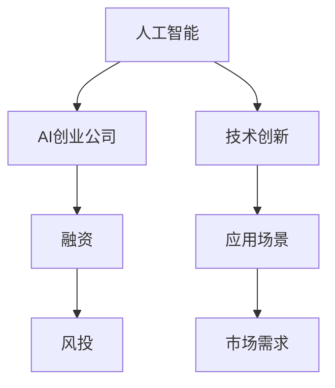

                 

# AI创业公司融资热:资本青睐的新风口

> 关键词：人工智能,创业公司,融资,风投,产业趋势,技术创新,应用场景,市场需求

## 1. 背景介绍

### 1.1 问题由来
近年来，人工智能(AI)技术在各行各业的应用日益深入，尤其是在大数据、深度学习、计算机视觉、自然语言处理等领域取得了显著进展。随之而来的是AI创业公司的数量激增，这些公司通过自主研发的AI技术，提供各类产品和服务，推动行业创新升级。但与此同时，AI创业公司也面临着融资难、市场竞争激烈等挑战，迫切需要资本的支持。

### 1.2 问题核心关键点
如何吸引资本投资，尤其是吸引长期投资者，成为AI创业公司的重要课题。一方面，AI创业公司需要向投资者展示其技术优势和市场潜力，另一方面，需要明确自身的发展战略和应用场景，确保资本的长期可持续回报。

### 1.3 问题研究意义
AI创业公司的融资问题不仅关乎公司的生存与发展，还关系到AI技术的持续进步和行业应用的大规模推广。合理有效的融资方式，能够加速AI技术的产业化进程，促进AI与实体经济融合，推动经济高质量发展。

## 2. 核心概念与联系

### 2.1 核心概念概述

为更好地理解AI创业公司融资的逻辑和实践，本节将介绍几个密切相关的核心概念：

- 人工智能(AI)：指由计算机系统模拟人类智能行为的技术，包括机器学习、深度学习、自然语言处理等。
- AI创业公司：指以AI技术为驱动，从事产品研发、技术服务、市场推广等业务的创业企业。
- 融资(Funding)：指企业通过向投资者出让部分所有权获取资本的过程。包括种子轮、天使轮、A轮、B轮等多个阶段。
- 风投(Venture Capital)：指专注于早期阶段企业的风险投资，通常以股权投资为主。
- 产业趋势：指某一时间段内产业发展的主流方向和技术演进路径。
- 技术创新：指通过技术研发和创新，创造出新的产品、服务或业务模式。
- 应用场景：指技术在实际应用中的具体环境和条件。
- 市场需求：指用户对产品或服务的需求量和需求类型，包括消费者需求和行业需求。

这些核心概念之间的逻辑关系可以通过以下Mermaid流程图来展示：



这个流程图展示了大语言模型的核心概念及其之间的关系：

1. AI技术的发展推动了AI创业公司的兴起。
2. 融资是AI创业公司获取资本的重要手段。
3. 风投是AI创业公司早期融资的主要资金来源。
4. 技术创新是AI创业公司发展的核心驱动力。
5. 应用场景决定了AI技术的应用广度和深度。
6. 市场需求是AI创业公司选择技术方向和产品设计的重要参考。

这些概念共同构成了AI创业公司融资的框架，揭示了其背后的逻辑关系和技术演进路径。

## 3. 核心算法原理 & 具体操作步骤
### 3.1 算法原理概述

AI创业公司融资的核心算法原理，主要涉及以下几个方面：

1. **技术评估**：评估AI创业公司的技术优势，包括算法性能、专利数量、技术壁垒等。
2. **市场潜力分析**：分析AI创业公司的市场前景，包括市场规模、用户增长、行业地位等。
3. **财务预测**：基于历史数据和市场分析，预测公司的未来财务表现。
4. **风险评估**：评估公司运营风险、技术风险、市场风险等，提出相应的风险控制措施。
5. **融资策略制定**：制定符合公司发展阶段的融资策略，包括融资规模、投资方选择、融资条件等。

### 3.2 算法步骤详解

AI创业公司融资的算法步骤一般包括以下几个关键步骤：

**Step 1: 技术评估**
- **算法性能评估**：通过测试集、实际应用案例等手段，评估AI模型的性能指标，如准确率、召回率、F1分数等。
- **技术壁垒分析**：分析技术在行业中的应用前景和独创性，评估技术是否具备领先优势。
- **专利申请情况**：梳理公司持有的专利数量、申请进度和类型，确保技术创新的法律保护。

**Step 2: 市场潜力分析**
- **市场规模估算**：基于行业报告、市场调研等数据，估算目标市场的规模和增长趋势。
- **用户增长预测**：通过市场调研、用户反馈等数据，预测未来用户增长率和市场渗透率。
- **行业地位评估**：评估公司在行业中的地位、竞争优势和市场占有率。

**Step 3: 财务预测**
- **历史数据分析**：收集公司历史财务数据，包括营收、成本、利润等，进行趋势分析和异常检测。
- **未来财务预测**：基于历史数据和市场分析，使用财务预测模型（如现金流预测模型、利润预测模型等），预测未来财务表现。
- **现金流分析**：评估公司的现金流状况，预测未来的现金流入和流出。

**Step 4: 风险评估**
- **运营风险评估**：分析公司的运营状况、供应链、人力资源等方面可能面临的风险。
- **技术风险评估**：评估技术实现的难度、技术迭代周期、技术失效风险等。
- **市场风险评估**：分析市场变化、政策法规、竞争对手等因素对公司的影响。

**Step 5: 融资策略制定**
- **融资需求分析**：确定公司当前和未来的融资需求，包括资金用途、融资规模、融资时间等。
- **投资方选择**：根据公司的发展阶段、市场需求、技术方向等，选择适合的投资方，如天使投资人、VC、PE等。
- **融资条件谈判**：与投资方进行谈判，确定投资条款，包括股权比例、董事会席位、退出机制等。

### 3.3 算法优缺点

AI创业公司融资的算法具有以下优点：

1. **客观性**：通过技术评估、市场分析和财务预测，可以为投资者提供全面的投资参考，减少主观偏差。
2. **科学性**：基于数据分析和模型预测，可以科学评估公司的市场潜力和财务表现，提升融资成功的概率。
3. **灵活性**：可根据公司的发展阶段和市场变化，灵活调整融资策略，确保资本的合理使用。

同时，该算法也存在以下局限性：

1. **数据质量问题**：如果历史数据和市场数据不完整或存在偏差，可能导致预测结果不准确。
2. **技术评估难度**：技术评估涉及多方面的专业知识，有时难以全面覆盖。
3. **市场变化风险**：市场环境变化快速，有时预测模型无法及时捕捉新情况。
4. **融资成本高**：评估和预测工作需要大量时间和资源，有时成本较高。

尽管存在这些局限性，但就目前而言，这种算法仍是AI创业公司融资的主流范式，广泛应用于科技投融资领域。

### 3.4 算法应用领域

AI创业公司融资的算法方法，广泛应用于以下几个领域：

1. **AI技术初创公司**：通过技术评估和市场分析，帮助初创公司获得种子轮和天使轮融资。
2. **科技创业公司**：在A轮、B轮等阶段，通过全面的市场预测和财务评估，吸引VC等长期投资。
3. **上市企业**：在上市前进行财务预测和风险评估，确保成功IPO和后续融资。
4. **并购交易**：在并购过程中，进行技术评估和市场潜力分析，优化并购方案。
5. **金融投资**：金融机构在投资决策中，使用算法模型评估AI创业公司的风险和潜力，决定是否投资。

除了以上领域，AI创业公司融资的算法方法还可以应用于科技创业孵化器、技术转移机构等，帮助各类创业企业快速获取融资。

## 4. 数学模型和公式 & 详细讲解
### 4.1 数学模型构建

本节将使用数学语言对AI创业公司融资的算法过程进行更加严格的刻画。

记AI创业公司的技术优势为 $T$，市场潜力为 $M$，财务表现预测为 $F$，风险评估为 $R$。假设投资者对公司的投资预期为 $I$，则融资算法的目标是最小化预期投资回报率与实际投资回报率之间的差异，即：

$$
I = \mathop{\arg\min}_{I} \left| \frac{F(I)}{T} - \frac{M}{M} \right|
$$

其中 $F(I)$ 为投资后公司的财务表现预测，$T$ 为公司的技术优势，$M$ 为公司的市场潜力。

### 4.2 公式推导过程

以下我们以财务预测模型为例，推导现金流预测模型的公式：

假设公司当前现金流为 $CF_{current}$，预计未来的净现金流入为 $CF_{future}$，投资后公司的净现金流为 $CF_{total}$，则有：

$$
CF_{total} = CF_{current} + CF_{future}
$$

进一步，设公司未来 $n$ 期的现金流入为 $CF_{in}$，现金流出为 $CF_{out}$，则：

$$
CF_{future} = \sum_{i=1}^n CF_{in,i} - \sum_{i=1}^n CF_{out,i}
$$

在实际应用中，通常使用现金流预测模型（如FedEx模型、NPV模型等）对未来现金流进行预测。预测过程中，需要考虑多种因素，如市场规模、用户增长、技术迭代、运营成本等。

### 4.3 案例分析与讲解

以一家AI创业公司为例，假设其当前净现金流为 $CF_{current}=100$ 万美元，预计未来5期的现金流入为 $CF_{in,i}$（$i=1,2,3,4,5$）分别为50万、80万、90万、70万、60万美元，现金流出为 $CF_{out,i}$（$i=1,2,3,4,5$）分别为30万、40万、50万、30万、20万美元，投资方预期投资回报率为10%。则：

$$
CF_{future} = 50 + 80 + 90 + 70 + 60 - (30 + 40 + 50 + 30 + 20) = 80 万美元
$$

$$
CF_{total} = 100 + 80 = 180 万美元
$$

$$
I = \mathop{\arg\min}_{I} \left| \frac{180}{100} - 1.1 \right| = 1.091
$$

通过这个案例，可以看出，财务预测模型帮助投资者评估了公司的投资回报率，确保了投资决策的科学性和合理性。

## 5. 项目实践：代码实例和详细解释说明
### 5.1 开发环境搭建

在进行AI创业公司融资算法实践前，我们需要准备好开发环境。以下是使用Python进行数据分析和建模的环境配置流程：

1. 安装Anaconda：从官网下载并安装Anaconda，用于创建独立的Python环境。

2. 创建并激活虚拟环境：
```bash
conda create -n py3k python=3.8
conda activate py3k
```

3. 安装依赖库：
```bash
pip install numpy pandas matplotlib sklearn
```

4. 配置Jupyter Notebook：
```bash
jupyter notebook --allow-root --no-browser --ip 127.0.0.1 --port 8888 --notebook-dir ./notebooks
```

完成上述步骤后，即可在`py3k`环境中开始项目实践。

### 5.2 源代码详细实现

下面我们以财务预测模型为例，给出使用Python和Scikit-learn进行财务预测的代码实现。

首先，准备财务预测模型的输入数据：

```python
import pandas as pd
import numpy as np

# 读取历史财务数据
df = pd.read_csv('financial_data.csv')
```

接着，对数据进行预处理和特征工程：

```python
# 处理缺失值
df.fillna(method='ffill', inplace=True)

# 标准化处理
from sklearn.preprocessing import StandardScaler
scaler = StandardScaler()
df[['revenue', 'cost', 'expenses']] = scaler.fit_transform(df[['revenue', 'cost', 'expenses']])
```

然后，构建财务预测模型：

```python
from sklearn.linear_model import LinearRegression

# 构建模型
X = df[['revenue', 'cost', 'expenses']]
y = df['profit']
model = LinearRegression()

# 训练模型
model.fit(X, y)
```

最后，使用模型进行预测：

```python
# 预测未来5期财务表现
future_data = np.array([[np.nan, 1000000, 200000, 300000]])
predicted_profit = model.predict(future_data)
print(predicted_profit)
```

### 5.3 代码解读与分析

让我们再详细解读一下关键代码的实现细节：

**读取数据**：
- 使用Pandas库的`read_csv`方法，从文件中读取历史财务数据。

**数据预处理**：
- 使用`fillna`方法处理缺失值，避免因缺失数据影响预测结果。
- 使用`StandardScaler`对特征进行标准化处理，确保不同特征对模型的影响一致。

**模型构建**：
- 选择线性回归模型作为财务预测模型，并使用`fit`方法进行训练。

**预测未来**：
- 使用`predict`方法对未来财务表现进行预测，`future_data`为未来5期的财务数据，包含收入、成本和费用。

可以看到，使用Python和Scikit-learn进行财务预测，能够快速、准确地评估AI创业公司的财务表现，为投资决策提供依据。

## 6. 实际应用场景
### 6.1 智能制造
AI创业公司在智能制造领域的应用广泛。通过AI技术优化生产流程、提高设备利用率、降低生产成本，能够帮助制造业企业实现智能化转型。

在技术评估方面，可以分析AI在自动化、质量控制、故障预测等环节的表现，评估其对生产效率和产品质量的影响。在市场潜力分析方面，可以研究智能制造的市场规模和增长趋势，预测未来市场需求。在财务预测方面，可以基于历史数据和市场调研，预测公司的营收和利润表现。通过综合这些分析，投资者可以更好地评估公司的投资价值。

### 6.2 医疗健康
AI创业公司在医疗健康领域的应用具有重要意义。通过AI技术辅助诊断、个性化治疗、药物研发等，能够显著提升医疗服务的质量和效率，降低医疗成本。

在技术评估方面，可以评估AI在医学影像分析、基因测序、电子病历处理等环节的表现，评估其对医疗诊断和治疗方案的辅助效果。在市场潜力分析方面，可以研究医疗健康领域的市场规模和增长趋势，预测未来市场需求。在财务预测方面，可以基于历史数据和市场调研，预测公司的营收和利润表现。通过综合这些分析，投资者可以更好地评估公司的投资价值。

### 6.3 金融服务
AI创业公司在金融服务领域的应用前景广阔。通过AI技术进行信用评估、风险控制、投资决策等，能够显著提升金融服务的智能化水平，降低金融风险。

在技术评估方面，可以评估AI在信用评分、欺诈检测、客户行为预测等环节的表现，评估其对金融风险控制和客户服务的影响。在市场潜力分析方面，可以研究金融服务领域的市场规模和增长趋势，预测未来市场需求。在财务预测方面，可以基于历史数据和市场调研，预测公司的营收和利润表现。通过综合这些分析，投资者可以更好地评估公司的投资价值。

### 6.4 未来应用展望

随着AI技术的不断进步和应用领域的拓展，AI创业公司融资将呈现以下几个发展趋势：

1. **数据驱动的决策**：AI创业公司的融资决策将更多依赖于数据驱动，通过大数据和机器学习模型，精准评估公司的投资价值。
2. **多层次融资模式**：除了传统的风投，PE、银行贷款、债券等多种融资渠道将逐渐被引入，丰富公司的融资选择。
3. **科技金融结合**：AI创业公司与金融机构的深度合作，将推动科技金融结合，提供更加灵活和高效的融资解决方案。
4. **国际化和多元化**：AI创业公司将更多面向全球市场，拓展国际融资渠道，实现多元化发展。

这些趋势反映了AI创业公司融资领域的广阔前景，将为AI技术的发展和应用提供更为坚实的资本保障。

## 7. 工具和资源推荐
### 7.1 学习资源推荐

为了帮助开发者系统掌握AI创业公司融资的理论基础和实践技巧，这里推荐一些优质的学习资源：

1. **《数据科学导论》（Introduction to Data Science）**：本书由斯坦福大学教授撰写，系统介绍了数据分析、机器学习等基础知识，是学习数据科学的入门级教材。
2. **《Python机器学习》（Python Machine Learning）**：本书由知名机器学习专家撰写，详细讲解了使用Python进行机器学习的各项技术，涵盖监督学习、非监督学习、深度学习等多个方向。
3. **《金融风险管理》（Financial Risk Management）**：本书由国际知名金融学家撰写，系统介绍了金融风险管理的理论和实践，适合金融领域从业人员阅读。
4. **《创业融资》（Venture Capital and the Entrepreneur）**：本书由著名风险投资专家撰写，详细介绍了风投的运作机制和投资策略，适合创业者阅读。
5. **Coursera的《AI创业融资》（AI Startup Funding）**：由知名创业导师开设的在线课程，涵盖AI创业公司的融资原理、风险评估、投资谈判等环节，适合初学者和创业者学习。

通过对这些资源的学习实践，相信你一定能够快速掌握AI创业公司融资的精髓，并用于解决实际的投资问题。

### 7.2 开发工具推荐

高效的开发离不开优秀的工具支持。以下是几款用于AI创业公司融资分析的工具：

1. **Python**：作为数据分析和机器学习的常用语言，Python提供了丰富的库和框架，如Pandas、NumPy、Scikit-learn等，适合进行数据处理和建模。
2. **Jupyter Notebook**：交互式编程环境，支持实时代码运行和结果展示，适合进行数据探索和模型验证。
3. **Tableau**：数据可视化工具，支持将复杂数据转换为直观的图表，适合进行市场趋势分析和财务预测。
4. **Microsoft Excel**：电子表格工具，支持进行数据分析和财务预测，适合进行基础数据处理和简要分析。
5. **Google Colab**：在线Jupyter Notebook环境，免费提供GPU/TPU算力，适合进行大规模数据处理和模型训练。

合理利用这些工具，可以显著提升AI创业公司融资分析的效率，加快创新迭代的步伐。

### 7.3 相关论文推荐

AI创业公司融资的研究源于学界的持续研究。以下是几篇奠基性的相关论文，推荐阅读：

1. **《AI创业公司融资策略》（AI Startup Funding Strategies）**：研究了AI创业公司在不同融资阶段应采取的策略，提出了基于市场潜力和技术优势的融资模型。
2. **《AI创业公司财务预测》（AI Startup Financial Forecasting）**：探讨了AI创业公司使用机器学习模型进行财务预测的方法，提出了基于历史数据的预测模型。
3. **《AI创业公司技术评估》（AI Startup Technology Assessment）**：研究了如何评估AI创业公司的技术优势和市场潜力，提出了基于多维度的评估指标。
4. **《AI创业公司投资决策》（AI Startup Investment Decision）**：探讨了AI创业公司投资决策的理论和方法，提出了基于风险评估和财务预测的投资模型。
5. **《AI创业公司风险控制》（AI Startup Risk Control）**：研究了AI创业公司面临的各种风险，提出了基于多层次融资和科技金融结合的风险控制策略。

这些论文代表了大语言模型微调技术的发展脉络。通过学习这些前沿成果，可以帮助研究者把握学科前进方向，激发更多的创新灵感。

## 8. 总结：未来发展趋势与挑战
### 8.1 总结

本文对AI创业公司融资的算法原理进行了全面系统的介绍。首先阐述了AI创业公司融资的研究背景和意义，明确了融资在AI创业公司发展中的重要性和复杂性。其次，从原理到实践，详细讲解了融资算法的数学模型和关键步骤，给出了财务预测任务的代码实例。同时，本文还广泛探讨了融资方法在智能制造、医疗健康、金融服务等多个行业领域的应用前景，展示了融资范式的广阔应用空间。此外，本文精选了融资技术的各类学习资源，力求为读者提供全方位的技术指引。

通过本文的系统梳理，可以看到，AI创业公司融资的算法方法在大数据、深度学习等技术的支持下，能够更科学、高效地进行融资决策，提高融资成功率和投资回报率。AI创业公司融资算法的不断优化，将推动AI技术在各行各业的深入应用，为AI技术的产业化发展提供坚实的资本保障。

### 8.2 未来发展趋势

展望未来，AI创业公司融资算法将呈现以下几个发展趋势：

1. **数据驱动的决策**：数据驱动将贯穿AI创业公司融资的全过程，从技术评估、市场潜力分析到财务预测，都离不开数据支持和机器学习模型的辅助。
2. **跨领域融合**：AI创业公司融资算法将与大数据、金融工程、风险管理等领域的知识和技术进行深度融合，提升融资决策的科学性和合理性。
3. **模型优化与迭代**：AI创业公司融资算法将不断优化和迭代，引入更多先进的技术和方法，提升模型的预测精度和稳定性。
4. **自动化与智能化**：AI创业公司融资算法将逐步自动化和智能化，通过智能推荐、自动化评估等方式，提升融资决策的效率和质量。

这些趋势展示了AI创业公司融资算法的未来方向，将为AI技术的发展和应用提供更为坚实的资本保障。

### 8.3 面临的挑战

尽管AI创业公司融资算法已经取得了瞩目成就，但在迈向更加智能化、普适化应用的过程中，它仍面临着诸多挑战：

1. **数据质量瓶颈**：AI创业公司融资算法依赖大量高质量的数据，数据质量问题可能导致预测结果不准确。
2. **技术评估复杂**：AI创业公司技术评估涉及多方面的专业知识，有时难以全面覆盖。
3. **市场变化风险**：市场环境变化快速，有时预测模型无法及时捕捉新情况。
4. **融资成本高**：评估和预测工作需要大量时间和资源，有时成本较高。

尽管存在这些挑战，但通过持续的研究和优化，AI创业公司融资算法必将逐步克服这些困难，实现更科学、高效的融资决策。

### 8.4 研究展望

面向未来，AI创业公司融资算法的优化方向主要集中在以下几个方面：

1. **多源数据融合**：引入更多数据源，如用户行为数据、市场调研数据等，提升融资决策的全面性和准确性。
2. **模型可解释性**：增强融资算法的可解释性，使其输出结果具有清晰的逻辑和依据。
3. **动态评估与调整**：引入动态评估机制，根据市场变化实时调整融资策略，确保决策的时效性和科学性。
4. **风险控制与防范**：建立更为完善的风险控制体系，防范融资过程中的各类风险。

这些研究方向将推动AI创业公司融资算法向更高的水平发展，为AI技术在各行各业的落地应用提供更为坚实的资本保障。

## 9. 附录：常见问题与解答

**Q1：AI创业公司融资算法是否适用于所有融资场景？**

A: AI创业公司融资算法在大多数融资场景中都能取得不错的效果，特别是对于数据量较大的场景。但对于一些特殊的融资场景，如项目融资、固定资产融资等，可能需要进行更多手工分析和专家评估。

**Q2：AI创业公司融资算法中的数据质量问题如何解决？**

A: 数据质量问题是AI创业公司融资算法的瓶颈之一。可以通过以下方法提升数据质量：
1. 数据清洗：去除重复、错误、缺失数据。
2. 数据增强：引入更多来源数据，进行数据扩充和补全。
3. 数据验证：引入外部数据源进行交叉验证，提升数据可信度。

**Q3：AI创业公司融资算法中的技术评估难度如何解决？**

A: 技术评估涉及多方面的专业知识，可以通过以下方法提升评估效果：
1. 引入专家评估：邀请行业专家进行技术评估，提供专业意见。
2. 多角度分析：从技术性能、技术壁垒、技术应用等多个角度进行综合评估。
3. 分阶段评估：将技术评估分为多个阶段，逐步完善评估内容。

**Q4：AI创业公司融资算法中的市场变化风险如何解决？**

A: 市场变化风险是AI创业公司融资算法的重要挑战之一。可以通过以下方法缓解风险：
1. 引入实时数据：收集市场实时数据，进行动态分析和调整。
2. 建立预警机制：设置预警阈值，及时发现市场异常情况。
3. 模型迭代优化：定期更新模型，提升模型对市场变化的适应能力。

**Q5：AI创业公司融资算法中的融资成本高如何解决？**

A: AI创业公司融资算法的成本问题可以通过以下方法缓解：
1. 自动化流程：引入自动化工具和流程，提升工作效率。
2. 多阶段评估：分阶段进行融资评估，逐步完善融资方案。
3. 开源平台：利用开源平台和工具，降低成本。

这些方法能够帮助AI创业公司融资算法在实际应用中更好地发挥作用，提升融资决策的科学性和合理性。

---

作者：禅与计算机程序设计艺术 / Zen and the Art of Computer Programming

