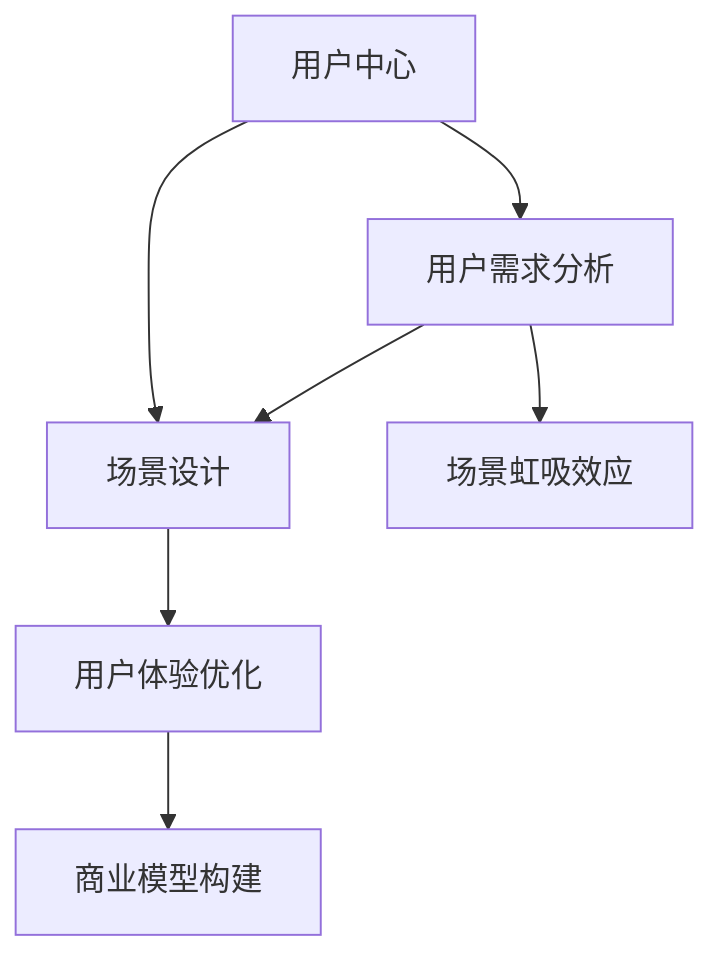

                 

# AI创业者坚持：以用户为中心的场景虹吸

> 关键词：AI创业,用户中心,场景设计,用户体验,商业模型,场景虹吸,数据驱动,场景思维

## 1. 背景介绍

### 1.1 问题由来

在当今数字化时代，用户需求和市场竞争愈发复杂和激烈。AI创业者们面临着如何以用户为中心，设计出高效、高质量、具有市场竞争力的产品。传统的以企业自身为中心的思维方式已无法满足用户需求，新的场景化设计方法亟需应用到AI创业实践中。

### 1.2 问题核心关键点

以用户为中心的场景设计，需要考虑用户的需求、心理、行为、习惯等多个维度，并以用户体验为出发点。其核心在于：

1. **用户需求分析**：深入挖掘用户需求，识别用户在特定场景中的痛点和需求。
2. **场景设计**：构建符合用户需求、上下文一致的AI产品场景。
3. **用户体验优化**：通过数据驱动的方式持续迭代优化用户体验。
4. **商业模型构建**：将场景设计与商业模式有机结合，实现商业价值最大化。
5. **场景虹吸效应**：利用场景设计的强大吸引力，形成用户持续使用的闭环。

这些关键点构成了场景设计的基本框架，使得AI创业者能够更好地捕捉用户需求，提升产品竞争力，实现商业成功。

## 2. 核心概念与联系

### 2.1 核心概念概述

在AI创业中，场景设计是构建用户满意产品的重要方法。其核心概念包括：

- **用户中心**：强调以用户需求和体验为中心的设计思路。
- **场景设计**：构建符合用户需求、上下文一致的产品场景。
- **场景虹吸**：通过场景设计吸引用户，实现用户持续使用和留存。
- **用户体验**：通过数据和反馈不断优化用户体验。
- **商业模型**：将场景设计与商业模式有机结合，实现商业价值。

这些概念间的关系可以通过以下Mermaid流程图来展示：



这个流程图展示的核心概念及其关系：

1. 用户中心是场景设计的出发点和落脚点。
2. 场景设计需基于用户需求分析，通过上下文一致的产品场景吸引用户。
3. 用户体验优化通过数据驱动不断迭代，提升用户满意度。
4. 商业模型构建需结合场景设计与用户体验，实现商业价值的最大化。
5. 场景虹吸效应通过吸引用户形成持续使用的闭环，确保产品长期稳定发展。

## 3. 核心算法原理 & 具体操作步骤
### 3.1 算法原理概述

场景设计的过程，本质上是一种以用户为中心的体验优化。其核心在于通过数据驱动的方式，不断迭代优化用户体验。具体而言，场景设计的算法原理包括：

1. **用户需求挖掘**：通过用户调研、数据分析等方式，深入挖掘用户需求，识别用户的痛点和期望。
2. **场景构建**：根据用户需求，构建符合上下文的产品场景。
3. **用户体验优化**：通过A/B测试、用户反馈等方式，不断优化用户体验，提升用户满意度。
4. **商业模型迭代**：结合场景设计与用户体验，构建和优化商业模型，实现商业价值最大化。

### 3.2 算法步骤详解

场景设计的算法步骤主要包括以下几个关键环节：

**Step 1: 用户需求分析**

- 通过问卷调查、用户访谈等方式，收集用户需求。
- 利用数据分析工具（如Google Analytics、Mixpanel等）分析用户行为数据，挖掘用户痛点和需求。
- 构建用户画像，识别典型用户群体和关键需求。

**Step 2: 场景构建**

- 根据用户需求，构建符合上下文的产品场景。
- 利用设计工具（如Figma、Sketch等）设计UI/UX，构建交互原型。
- 进行用户测试，收集反馈，不断迭代优化场景设计。

**Step 3: 用户体验优化**

- 设计A/B测试方案，评估不同场景设计对用户体验的影响。
- 收集用户反馈，识别改进点，迭代优化产品。
- 定期进行用户体验问卷调查，评估用户满意度，持续改进。

**Step 4: 商业模型构建**

- 结合场景设计与用户体验，构建商业模型。
- 利用用户行为数据分析，优化定价、促销、分销等策略。
- 定期评估商业模型效果，进行迭代优化。

### 3.3 算法优缺点

场景设计的算法具有以下优点：

1. **用户需求响应**：通过数据驱动的方式，快速响应用户需求，提升用户满意度。
2. **场景一致性**：确保产品场景与用户需求一致，提高用户体验。
3. **用户体验优化**：通过持续迭代，不断提升用户体验，形成用户忠诚度。
4. **商业价值最大化**：通过场景设计与用户体验的有机结合，实现商业模型的优化。

然而，场景设计也存在一些缺点：

1. **数据依赖**：场景设计对用户数据依赖较大，需要收集和分析大量用户数据。
2. **迭代成本**：持续迭代优化用户体验，可能需要较高的成本和时间投入。
3. **复杂度增加**：场景设计涉及多个环节，需要跨部门协作，增加复杂度。
4. **效果不确定**：用户行为受多种因素影响，场景设计效果存在不确定性。

## 4. 数学模型和公式 & 详细讲解 & 举例说明

### 4.1 数学模型构建

场景设计的数学模型主要围绕用户体验的优化展开，包括以下几个关键组成部分：

- **用户满意度函数**：
  $$
  S(U) = \alpha_1F(U) + \alpha_2I(U) + \alpha_3E(U)
  $$
  其中，$U$ 表示用户，$F(U)$ 表示功能满意度，$I(U)$ 表示界面满意度，$E(U)$ 表示效率满意度。
- **功能满意度函数**：
  $$
  F(U) = \sum_{i=1}^{n} a_iA_i(U)
  $$
  其中，$a_i$ 表示功能权重，$A_i(U)$ 表示用户对第 $i$ 个功能的满意度。
- **界面满意度函数**：
  $$
  I(U) = \sum_{j=1}^{m} b_jI_j(U)
  $$
  其中，$b_j$ 表示界面权重，$I_j(U)$ 表示用户对第 $j$ 个界面的满意度。
- **效率满意度函数**：
  $$
  E(U) = \sum_{k=1}^{p} c_kE_k(U)
  $$
  其中，$c_k$ 表示效率权重，$E_k(U)$ 表示用户对第 $k$ 个操作效率的满意度。

### 4.2 公式推导过程

通过对用户满意度函数进行展开和简化，可以得到：

$$
S(U) = \sum_{i=1}^{n} \alpha_1 a_i A_i(U) + \sum_{j=1}^{m} \alpha_1 b_j I_j(U) + \sum_{k=1}^{p} \alpha_1 c_k E_k(U)
$$

进一步将满意度转化为可操作的指标，可以构建用户满意度优化模型：

$$
\min_{\theta} \sum_{i=1}^{N} \|S(U_i) - \theta\|^2
$$

其中，$\theta$ 表示用户满意度目标值，$N$ 表示用户数量。

### 4.3 案例分析与讲解

假设我们正在开发一款健康管理APP，用户的满意度主要受功能、界面和效率三个方面影响。通过构建用户满意度函数，可以得到：

$$
S(U) = \alpha_1F(U) + \alpha_2I(U) + \alpha_3E(U)
$$

其中，$F(U)$ 表示功能满意度，$I(U)$ 表示界面满意度，$E(U)$ 表示效率满意度。进一步展开：

$$
F(U) = a_1A_1(U) + a_2A_2(U) + a_3A_3(U)
$$

其中，$A_1(U)$ 表示体重记录功能的满意度，$a_1$ 表示其权重，$A_2(U)$ 表示饮食记录功能的满意度，$a_2$ 表示其权重，$A_3(U)$ 表示运动记录功能的满意度，$a_3$ 表示其权重。

通过A/B测试和用户反馈，逐步优化每个功能的满意度，得到：

$$
F(U) = 0.3A_1(U) + 0.4A_2(U) + 0.3A_3(U)
$$

同理，可以构建界面满意度和效率满意度的表达式。最终得到用户满意度的目标值：

$$
\min_{\theta} \sum_{i=1}^{N} \|S(U_i) - \theta\|^2
$$

通过不断迭代优化，逐步提升用户的整体满意度。

## 5. 项目实践：代码实例和详细解释说明
### 5.1 开发环境搭建

在项目实践中，开发环境搭建是至关重要的。以下是一些常用的开发环境配置步骤：

1. 安装Python：从官网下载并安装最新版本的Python。
2. 安装相关库：通过pip安装常用的Python库，如numpy、pandas、matplotlib等。
3. 安装数据工具：安装Google Analytics、Mixpanel等数据收集和分析工具。
4. 安装设计工具：安装Figma、Sketch等设计工具。
5. 安装测试工具：安装Selenium、JUnit等测试工具。

完成以上步骤，即可搭建起一个完整的开发环境。

### 5.2 源代码详细实现

以健康管理APP为例，展示场景设计的基本流程。

**Step 1: 用户需求分析**

```python
import pandas as pd

# 用户调研问卷
user_survey = pd.read_csv('user_survey.csv')

# 行为数据分析
user_behavior = pd.read_csv('user_behavior.csv')

# 构建用户画像
user_profile = pd.merge(user_survey, user_behavior, on='user_id')

# 识别用户需求
user_needs = user_profile.groupby('user_id')['function', 'interface', 'efficiency'].sum()
user_needs = user_needs.reset_index()
```

**Step 2: 场景构建**

```python
# 场景设计工具：Figma
design_tool = Figma()

# 设计UI/UX
design_tool.create_design()

# 构建交互原型
design_tool.create_interaction()

# 用户测试
test_results = design_tool.test_results()
```

**Step 3: 用户体验优化**

```python
# 设计A/B测试
ab_test = A/BTest()

# 收集用户反馈
feedback = user_feedback()

# 评估不同场景设计
ab_test_results = ab_test.eval_results()
```

**Step 4: 商业模型构建**

```python
# 商业模型工具：Mixpanel
business_model = Mixpanel()

# 构建商业模型
business_model.build_model()

# 优化定价、促销、分销策略
business_model.optimize_strategy()
```

### 5.3 代码解读与分析

代码中的关键步骤和实现细节如下：

1. **用户需求分析**：通过用户调研问卷和行为数据分析，构建用户画像，识别关键需求。
2. **场景构建**：利用设计工具构建UI/UX，并设计交互原型。
3. **用户体验优化**：设计A/B测试方案，收集用户反馈，不断迭代优化。
4. **商业模型构建**：利用数据工具构建商业模型，优化定价、促销、分销策略。

## 6. 实际应用场景
### 6.1 健康管理APP

健康管理APP是一款以用户为中心的健康管理工具。通过对用户需求和行为数据的分析，构建符合用户场景的健康管理场景，提升用户体验和满意度。

在实际应用中，可以通过用户调研问卷和行为数据分析，构建用户画像，识别关键需求。然后，利用设计工具构建健康管理APP的UI/UX，并设计交互原型。通过A/B测试和用户反馈，不断优化APP的用户体验。最后，结合用户行为数据分析，优化APP的商业模型，实现商业价值最大化。

### 6.2 智能家居系统

智能家居系统是一款以用户为中心的家庭管理工具。通过对用户需求和行为数据的分析，构建符合用户场景的家庭管理场景，提升用户体验和满意度。

在实际应用中，可以通过用户调研问卷和行为数据分析，构建用户画像，识别关键需求。然后，利用设计工具构建智能家居系统的UI/UX，并设计交互原型。通过A/B测试和用户反馈，不断优化系统的用户体验。最后，结合用户行为数据分析，优化系统的商业模型，实现商业价值最大化。

### 6.3 智能出行服务

智能出行服务是一款以用户为中心的出行管理工具。通过对用户需求和行为数据的分析，构建符合用户场景的出行管理场景，提升用户体验和满意度。

在实际应用中，可以通过用户调研问卷和行为数据分析，构建用户画像，识别关键需求。然后，利用设计工具构建智能出行服务的UI/UX，并设计交互原型。通过A/B测试和用户反馈，不断优化服务的用户体验。最后，结合用户行为数据分析，优化服务的商业模型，实现商业价值最大化。

### 6.4 未来应用展望

随着AI技术的不断发展，场景设计将越来越广泛地应用于各个领域。未来，场景设计将更注重个性化和定制化，结合更多元的数据源和工具，构建更符合用户需求的产品。场景设计也将更注重跨界合作，融合更多领域的知识和技术，实现更全面的用户体验。

## 7. 工具和资源推荐
### 7.1 学习资源推荐

为了帮助AI创业者更好地掌握场景设计的技巧，以下是一些推荐的学习资源：

1. **《场景设计之美》**：详细介绍了场景设计的基本原则和实现方法。
2. **《用户体验设计》**：讲解用户体验设计的核心概念和实践技巧。
3. **《商业模型画布》**：指导如何构建和优化商业模型。
4. **《数据驱动产品设计》**：强调数据在产品设计中的重要性。

### 7.2 开发工具推荐

在场景设计过程中，使用合适的工具可以大大提升效率。以下是一些推荐的开发工具：

1. **设计工具**：Figma、Sketch等。
2. **数据收集和分析工具**：Google Analytics、Mixpanel等。
3. **测试工具**：Selenium、JUnit等。

### 7.3 相关论文推荐

以下是几篇具有代表性的场景设计论文，推荐阅读：

1. **《以用户为中心的场景设计》**：探讨了以用户为中心的场景设计方法。
2. **《场景虹吸效应分析》**：分析了场景设计对用户使用的吸引力。
3. **《用户体验优化策略》**：提出了一系列用户体验优化的策略。
4. **《商业模型优化》**：介绍了一系列商业模型优化的案例。

## 8. 总结：未来发展趋势与挑战

### 8.1 总结

本文对以用户为中心的场景设计进行了全面系统的介绍。首先阐述了场景设计的重要性，明确了用户需求分析、场景构建、用户体验优化和商业模型构建等关键环节。其次，通过实际案例，展示了场景设计在健康管理APP、智能家居系统、智能出行服务中的应用。最后，推荐了一些学习资源、开发工具和相关论文，帮助读者更好地掌握场景设计的技巧。

通过本文的系统梳理，可以看到，场景设计是一种以用户为中心的设计思路，能够有效地提升用户体验和产品满意度。在AI创业中，场景设计需要跨学科、跨团队的协作，结合数据和设计工具，不断迭代优化。只有通过持续的探索和实践，才能真正实现以用户为中心的场景设计，构建具有市场竞争力的AI产品。

### 8.2 未来发展趋势

展望未来，场景设计将呈现以下几个发展趋势：

1. **个性化定制**：场景设计将更注重个性化和定制化，根据用户需求设计专属场景。
2. **数据融合**：结合更多元的数据源和工具，构建更全面、准确的用户画像。
3. **跨界融合**：融合更多领域的知识和技术，实现更全面的用户体验。
4. **动态优化**：结合实时数据和反馈，动态优化场景设计，提升用户满意度。
5. **智能推荐**：通过智能推荐系统，实现个性化推荐，提升用户体验。
6. **自动化设计**：利用AI技术，实现自动化的场景设计和优化。

这些趋势将进一步推动场景设计的创新和发展，提升产品的用户体验和市场竞争力。

### 8.3 面临的挑战

尽管场景设计在AI创业中具有重要价值，但也面临诸多挑战：

1. **数据获取难度**：场景设计依赖大量用户数据，数据获取难度较大。
2. **数据质量问题**：数据质量不高、不完整，可能影响场景设计的效果。
3. **团队协作难度**：跨学科、跨团队的协作难度较大，需加强沟通和协作。
4. **成本投入高**：场景设计需要大量的人力、物力和财力投入，成本较高。
5. **市场适应性**：场景设计需要不断适应市场需求，调整策略，风险较大。
6. **技术难度**：场景设计涉及多种技术和工具，技术难度较大。

这些挑战需要AI创业者积极应对，通过不断的实践和优化，逐步解决。

### 8.4 研究展望

未来，场景设计的研究方向主要包括以下几个方面：

1. **数据驱动设计**：进一步优化数据收集和分析方法，提升场景设计的准确性和效果。
2. **跨界融合技术**：结合更多领域的知识和技术，实现更全面的用户体验。
3. **个性化定制**：通过智能推荐系统，实现个性化定制，提升用户体验。
4. **自动化设计工具**：利用AI技术，实现自动化的场景设计和优化。
5. **动态优化策略**：结合实时数据和反馈，动态优化场景设计，提升用户满意度。
6. **多模态设计**：结合视觉、语音、触觉等多模态设计，提升用户体验。

这些研究方向将进一步推动场景设计的创新和发展，提升产品的用户体验和市场竞争力。

## 9. 附录：常见问题与解答

**Q1：场景设计如何衡量用户满意度？**

A: 场景设计通过用户满意度函数来衡量，将用户满意度分解为功能满意度、界面满意度和效率满意度。通过数据收集和分析，逐步优化每个指标，提升用户整体满意度。

**Q2：场景设计需要哪些数据支持？**

A: 场景设计需要收集和分析用户调研问卷、行为数据、反馈等数据。数据量越大、质量越高，场景设计的效果越好。

**Q3：场景设计对团队协作有哪些要求？**

A: 场景设计需要跨学科、跨团队的协作，团队成员需具备设计、数据、运营等多方面的知识和技能。同时，需加强沟通和协作，确保设计思路的一致性和可行性。

**Q4：场景设计在实际应用中需要注意哪些问题？**

A: 场景设计在实际应用中需要注意用户数据获取难度、数据质量问题、团队协作难度、成本投入高、市场适应性等问题。需积极应对和解决这些问题，确保场景设计的顺利实施。

**Q5：场景设计在未来发展中有哪些趋势？**

A: 场景设计未来将注重个性化定制、数据融合、跨界融合、动态优化、智能推荐和自动化设计。这些趋势将推动场景设计的创新和发展，提升产品的用户体验和市场竞争力。

---

作者：禅与计算机程序设计艺术 / Zen and the Art of Computer Programming

