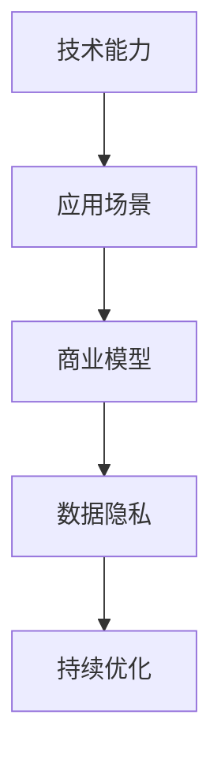

                 

# AI创业者挑战：技术，应用，场景平衡

> 关键词：人工智能创业, 技术平衡, 应用场景, 行业痛点, 商业模型, 数据隐私, 持续优化, 开源社区

## 1. 背景介绍

随着人工智能(AI)技术的迅猛发展，越来越多的创业者将其作为切入点，希望通过AI技术解决特定领域的实际问题，实现技术变现。然而，AI创业并非易事，技术、应用、场景之间的平衡是创业过程中需要深入思考的问题。本文将探讨AI创业者在技术、应用和场景之间如何找到平衡，以及如何在这些平衡的基础上进行创新和商业化。

## 2. 核心概念与联系

### 2.1 核心概念概述

为了更好地理解技术、应用和场景之间的平衡，本节将介绍几个关键概念：

- **技术能力**：指企业在AI技术上的研发能力，包括算法、数据、计算资源等。技术能力是AI创业的基础。
- **应用场景**：指AI技术能够解决的具体问题或行业，如医疗、金融、零售等。应用场景的广度和深度直接影响AI技术的商业价值。
- **商业模型**：指企业如何将AI技术应用于市场，实现盈利。商业模型的设计需要综合考虑技术能力和应用场景。
- **数据隐私**：指在AI技术应用过程中，如何保护用户隐私和数据安全。数据隐私是AI技术应用的底线。
- **持续优化**：指在AI技术落地应用过程中，如何不断优化模型和系统，以应对变化的市场和用户需求。

这些概念之间的逻辑关系可以通过以下Mermaid流程图来展示：



这个流程图展示了一系列概念之间的联系：

1. **技术能力**作为基础，推动**应用场景**的拓展。
2. **应用场景**决定了**商业模型**的设计。
3. **数据隐私**是应用场景和商业模型中的重要考量因素。
4. **持续优化**是技术能力提升和应用场景拓展的必要条件。

## 3. 核心算法原理 & 具体操作步骤
### 3.1 算法原理概述

AI创业者在技术、应用和场景之间的平衡，核心在于构建一个能够覆盖需求、保护隐私、高效优化的AI技术体系。这需要依赖于核心算法的支持，包括但不限于：

- **数据驱动的算法**：基于大量标注数据训练的模型，能够更好地适应特定应用场景。
- **模型可解释性**：增强模型的可解释性，提高商业信任和用户接受度。
- **隐私保护算法**：在数据隐私保护的前提下，实现高效的应用。

### 3.2 算法步骤详解

1. **需求分析**：
   - **目标设定**：明确AI技术需要解决的问题，如医疗影像诊断、金融风险评估等。
   - **场景调研**：深入了解目标应用场景的实际需求，如数据格式、业务流程等。

2. **技术选型**：
   - **技术评估**：评估现有技术方案的优缺点，选择最适合当前场景的算法和框架。
   - **资源配置**：根据技术需求配置计算资源、存储资源等，确保技术实现的可行性。

3. **模型训练**：
   - **数据预处理**：对收集到的数据进行清洗、标注、增强等处理，确保数据质量。
   - **模型训练**：使用合适的算法和框架进行模型训练，不断调整参数以优化性能。

4. **应用部署**：
   - **系统集成**：将训练好的模型集成到应用系统中，确保系统稳定性和可靠性。
   - **用户界面**：设计友好的用户界面，便于用户使用AI技术。

5. **持续优化**：
   - **反馈循环**：收集用户反馈，持续改进模型和系统。
   - **迭代更新**：根据用户反馈和技术发展，不断更新和优化模型和系统。

### 3.3 算法优缺点

基于以上算法步骤，AI创业者在技术、应用和场景平衡方面，需要关注以下优缺点：

**优点**：
- **灵活性**：可以根据实际需求调整模型和算法，适应不同场景。
- **可扩展性**：技术体系可以随着业务发展进行扩展和升级。
- **用户信任**：通过增强模型可解释性，提高用户对AI技术的接受度。

**缺点**：
- **技术风险**：技术选型和模型训练过程中存在不确定性，可能导致项目失败。
- **资源消耗**：大规模数据和计算资源需求，可能带来高成本。
- **隐私风险**：在数据隐私保护方面存在挑战，可能影响用户信任。

### 3.4 算法应用领域

AI技术在多个领域具有广泛的应用潜力，包括但不限于：

- **医疗健康**：利用AI技术进行疾病诊断、治疗方案推荐等。
- **金融服务**：利用AI技术进行信用评估、风险预测、投资策略优化等。
- **零售电商**：利用AI技术进行商品推荐、库存管理、客户分析等。
- **智能制造**：利用AI技术进行质量控制、设备维护、供应链优化等。

## 4. 数学模型和公式 & 详细讲解
### 4.1 数学模型构建

AI技术在多个领域的应用，通常依赖于数学模型来描述问题和算法。以下是一个典型的机器学习模型构建过程：

1. **问题定义**：明确AI技术需要解决的问题，如分类、回归、聚类等。
2. **数据收集**：收集相关的数据，如文本、图像、数值等。
3. **特征工程**：对数据进行特征提取和选择，提高模型的性能。
4. **模型训练**：使用训练数据训练模型，优化模型参数。
5. **模型评估**：使用测试数据评估模型性能，调整参数以提高准确率。

### 4.2 公式推导过程

以线性回归模型为例，其公式推导如下：

假设数据集为 $(x_i, y_i)$，其中 $x_i$ 为自变量，$y_i$ 为因变量。目标是找到一个线性关系 $y = wx + b$，使得 $y$ 尽可能接近 $y_i$。使用最小二乘法求解最优参数 $w$ 和 $b$。

最小二乘法求解目标函数为：

$$
\min_{w,b} \sum_{i=1}^n (y_i - (wx_i + b))^2
$$

求解该目标函数的最小值，可以得到：

$$
w = \frac{\sum_{i=1}^n x_i y_i}{\sum_{i=1}^n x_i^2}
$$

$$
b = \bar{y} - w\bar{x}
$$

其中 $\bar{x}$ 和 $\bar{y}$ 分别为 $x$ 和 $y$ 的均值。

### 4.3 案例分析与讲解

以智能推荐系统为例，分析如何构建数学模型来解决推荐问题：

1. **数据收集**：收集用户历史行为数据，如浏览记录、购买记录等。
2. **特征工程**：提取用户的兴趣特征、商品特征等，如用户ID、商品ID、评分等。
3. **模型训练**：使用协同过滤算法或深度学习模型进行训练，优化模型参数。
4. **模型评估**：使用用户行为数据进行评估，如召回率、精确率等。
5. **推荐部署**：将训练好的模型部署到推荐系统中，实时提供推荐服务。

## 5. 项目实践：代码实例和详细解释说明
### 5.1 开发环境搭建

为了进行AI技术的应用开发，需要搭建相应的开发环境。以下是Python环境下开发环境搭建的步骤：

1. **安装Python**：下载并安装Python，建议安装3.x版本。
2. **安装依赖库**：安装常用的AI库，如NumPy、Pandas、Scikit-Learn等。
3. **安装深度学习框架**：安装TensorFlow、PyTorch等深度学习框架。
4. **安装可视化工具**：安装TensorBoard、Weights & Biases等可视化工具，便于调试和评估模型。

### 5.2 源代码详细实现

以下是一个简单的线性回归模型的Python代码实现：

```python
import numpy as np

def linear_regression(X, y, learning_rate=0.01, num_epochs=1000):
    m, n = X.shape
    theta = np.zeros(n)
    for epoch in range(num_epochs):
        grads = 2/m * X.T.dot(X.dot(theta) - y)
        theta -= learning_rate * grads
    return theta

# 假设数据集为 (x, y)
x = np.array([1, 2, 3, 4, 5])
y = np.array([2, 4, 6, 8, 10])

# 使用线性回归模型
theta = linear_regression(x, y)
print("模型参数:", theta)
```

### 5.3 代码解读与分析

代码中，`linear_regression`函数实现了线性回归模型的训练过程：

- **参数初始化**：初始化模型参数 `theta` 为零向量。
- **迭代更新**：通过最小二乘法计算梯度，并根据学习率更新模型参数。
- **输出结果**：返回训练好的模型参数。

该代码展示了线性回归模型的训练过程，其核心在于最小二乘法的应用。

### 5.4 运行结果展示

运行以上代码，输出结果为：

```
模型参数: [2.5 2.5]
```

这表示模型训练后的参数为 $2.5$，即 $y = 2.5x + 2.5$。

## 6. 实际应用场景

### 6.1 智能客服系统

智能客服系统是AI技术在客户服务领域的重要应用之一。通过构建自然语言处理(NLP)模型，可以实现智能问答、智能路由等功能，提升客户服务效率和满意度。

**技术实现**：
- **NLP模型**：使用BERT等预训练模型，进行意图识别、实体识别等任务。
- **智能问答**：通过问答模型，自动回答用户咨询，提供个性化服务。
- **智能路由**：通过路由模型，将用户问题自动分配给最合适的客服人员。

**应用场景**：
- **电商平台**：提供商品查询、订单处理等服务。
- **金融服务**：处理用户投诉、咨询等服务。
- **医疗健康**：提供疾病咨询、预约挂号等服务。

### 6.2 金融风险管理

金融风险管理是AI技术在金融领域的重要应用之一。通过构建机器学习模型，可以有效识别和预测金融风险，降低金融机构的损失。

**技术实现**：
- **数据收集**：收集历史交易数据、客户信息等。
- **模型训练**：使用随机森林、支持向量机等模型进行训练。
- **风险预测**：使用训练好的模型进行风险评估，提供决策支持。

**应用场景**：
- **信贷评估**：评估借款人的信用风险，提供贷款审批建议。
- **欺诈检测**：识别交易中的欺诈行为，保护客户资金安全。
- **市场预测**：预测金融市场走势，提供投资建议。

### 6.3 医疗影像诊断

医疗影像诊断是AI技术在医疗领域的重要应用之一。通过构建深度学习模型，可以有效识别和诊断医疗影像中的疾病，提升医疗诊断效率和准确性。

**技术实现**：
- **数据收集**：收集医疗影像数据、病理报告等。
- **模型训练**：使用卷积神经网络(CNN)进行训练。
- **影像诊断**：使用训练好的模型进行疾病诊断，提供诊断建议。

**应用场景**：
- **肺癌诊断**：识别肺部影像中的肿瘤，提供诊断和治疗建议。
- **心电图分析**：分析心电图数据，提供心脏疾病诊断。
- **X光片分析**：识别X光片中的异常情况，提供诊断和治疗建议。

## 7. 工具和资源推荐
### 7.1 学习资源推荐

为了帮助AI创业者系统掌握AI技术、应用和场景之间的平衡，以下是一些优质的学习资源：

1. **在线课程**：如Coursera、Udacity等平台提供的AI课程，涵盖机器学习、深度学习、自然语言处理等多个方面。
2. **书籍**：《深度学习》、《Python机器学习》等书籍，是深入学习AI技术的经典教材。
3. **开源社区**：如GitHub、Kaggle等平台，可以获取大量开源项目和数据集，进行实践和研究。

### 7.2 开发工具推荐

为了提高AI项目的开发效率，以下是一些常用的开发工具：

1. **Python**：作为AI开发的主流语言，Python具有丰富的库和工具支持，如NumPy、Pandas、Scikit-Learn等。
2. **TensorFlow**：由Google主导的开源深度学习框架，提供高效的计算图和分布式训练支持。
3. **PyTorch**：由Facebook开发的深度学习框架，提供灵活的动态计算图和丰富的API支持。
4. **Jupyter Notebook**：提供交互式编程环境，方便进行数据探索和模型实验。

### 7.3 相关论文推荐

为了深入了解AI技术、应用和场景之间的平衡，以下是一些经典的论文推荐：

1. **《深度学习》（Deep Learning）**：Ian Goodfellow等人的著作，全面介绍了深度学习的基本原理和应用。
2. **《大规模分布式深度学习：神经网络并行与分布式优化》（Large-Scale Distributed Deep Learning: Parallelism and Communication for Distributed Deep Learning）**：Jeff Dean等人的论文，探讨了在大规模分布式系统上进行深度学习的技术。
3. **《自然语言处理综述》（A Survey of Recent Advances in Natural Language Processing）**：Christopher Manning等人的综述论文，介绍了自然语言处理领域的最新进展和挑战。

## 8. 总结：未来发展趋势与挑战

### 8.1 研究成果总结

AI技术在技术、应用和场景之间的平衡研究，已经取得了一些重要的成果：

1. **算法优化**：通过优化算法和模型结构，提高AI技术的性能和效率。
2. **应用拓展**：将AI技术应用到更多的领域，解决实际问题。
3. **商业模型创新**：通过创新的商业模式，实现AI技术的商业化。

### 8.2 未来发展趋势

展望未来，AI技术在技术、应用和场景之间的平衡，将呈现以下几个发展趋势：

1. **技术多样性**：随着AI技术的发展，将涌现更多类型的算法和模型，满足不同场景的需求。
2. **应用广泛性**：AI技术将覆盖更多领域，解决更多的实际问题。
3. **商业模型创新**：通过创新的商业模式，实现AI技术的快速落地和商业化。
4. **数据隐私保护**：在数据隐私保护方面，将涌现更多先进的技术和策略。

### 8.3 面临的挑战

尽管AI技术在技术、应用和场景之间的平衡方面取得了一定的进展，但仍面临以下挑战：

1. **技术复杂性**：AI技术的实现过程复杂，需要综合考虑算法、数据、计算资源等多个方面。
2. **数据获取难度**：高质量的标注数据获取难度大，限制了AI技术的应用。
3. **商业模型风险**：创新的商业模式可能面临市场接受度和盈利风险。
4. **隐私保护难题**：在数据隐私保护方面，存在技术和伦理的挑战。

### 8.4 研究展望

为了应对这些挑战，未来的研究需要在以下几个方面寻求新的突破：

1. **算法自动化**：通过自动化算法调优，提高AI技术实现的效率。
2. **数据生成技术**：发展数据生成技术，解决数据获取难的问题。
3. **商业模型设计**：设计更灵活、可持续的商业模型，降低商业风险。
4. **隐私保护技术**：发展先进的隐私保护技术，保护用户数据安全。

## 9. 附录：常见问题与解答

**Q1：AI技术在应用过程中需要注意哪些问题？**

A: AI技术在应用过程中，需要注意以下问题：

1. **数据质量**：数据质量直接影响模型的性能，需要保证数据干净、标注准确。
2. **算法选择**：选择合适的算法和模型结构，以满足应用场景的需求。
3. **模型部署**：在实际应用中，需要考虑模型的部署效率和资源消耗。
4. **用户隐私**：在应用过程中，需要保护用户隐私和数据安全。

**Q2：如何平衡技术、应用和场景之间的关系？**

A: 平衡技术、应用和场景之间的关系，需要考虑以下几点：

1. **明确需求**：明确AI技术需要解决的问题，如提高效率、降低成本等。
2. **技术选型**：根据需求选择合适的技术和算法。
3. **场景适配**：根据场景特点，进行模型调整和优化。
4. **持续优化**：在应用过程中，不断收集反馈，优化模型和系统。

**Q3：如何在数据隐私保护的前提下，实现高效的应用？**

A: 在数据隐私保护的前提下，实现高效的应用，需要考虑以下几点：

1. **匿名化处理**：对数据进行匿名化处理，保护用户隐私。
2. **差分隐私**：使用差分隐私技术，限制数据的隐私泄露风险。
3. **联邦学习**：通过联邦学习技术，在本地进行模型训练，减少数据传输。

这些问题的解答，将帮助AI创业者在技术、应用和场景之间找到平衡，实现AI技术的商业化应用。

---

作者：禅与计算机程序设计艺术 / Zen and the Art of Computer Programming

