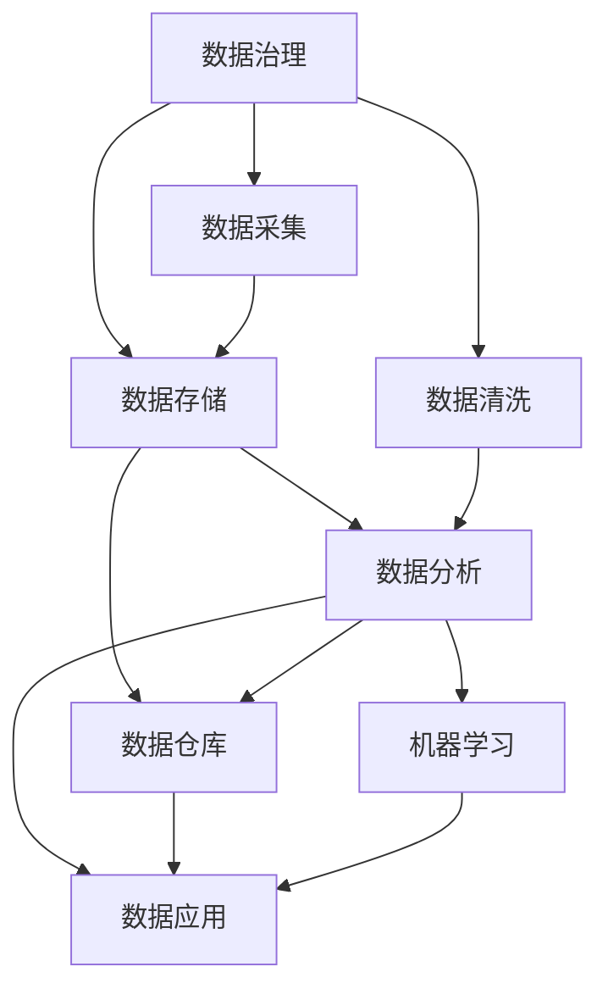

                 

# AI创业：数据管理的策略与工具探讨

> 关键词：AI创业, 数据管理, 策略与工具, 数据治理, 数据安全, 大数据平台

## 1. 背景介绍

### 1.1 问题由来

在AI创业的征程中，数据管理无疑是重中之重。优质的数据是AI系统性能和可靠性的保障，但如何高效地采集、存储、分析和利用数据，同时保障数据安全和合规，是每个AI创业者必须面对的难题。本文将深入探讨数据管理的策略与工具，帮助创业者在AI创业的道路上披荆斩棘，最终构建稳定可靠的数据管理生态。

### 1.2 问题核心关键点

数据管理涉及数据收集、存储、清洗、处理、分析和应用等多个环节。其核心关键点包括：

- **数据采集**：从哪些渠道采集数据？如何确保数据的完整性和准确性？
- **数据存储**：如何高效存储大量数据？如何保证数据的可靠性和可扩展性？
- **数据清洗**：如何处理数据中的噪声、异常值和冗余信息？
- **数据分析**：如何利用数据挖掘、机器学习等技术进行数据洞察和模型训练？
- **数据应用**：如何将数据转化为可行的商业决策和解决方案？

## 2. 核心概念与联系

### 2.1 核心概念概述

为更好地理解数据管理的策略与工具，本节将介绍几个关键概念：

- **数据治理(Data Governance)**：通过制度、流程和技术手段，管理和优化数据资产的收集、存储、处理和应用，确保数据的质量、安全、合规和可追溯性。
- **数据安全(Data Security)**：保障数据在存储、传输和使用过程中免受未授权访问、泄露和破坏的保护措施。
- **大数据平台(Big Data Platform)**：利用分布式存储、处理和分析技术，构建高效的数据管理和处理环境。
- **数据仓库(Data Warehouse)**：集中管理和查询海量数据，为决策支持提供数据支持。
- **数据挖掘(Data Mining)**：通过算法和统计方法，从数据中发现隐藏的模式、趋势和关联。
- **机器学习(Machine Learning)**：利用算法和模型，使计算机从数据中自动学习和改进，实现数据驱动的决策。

这些概念之间存在紧密联系，相互支撑，共同构成了数据管理的整体架构。

### 2.2 核心概念原理和架构的 Mermaid 流程图



## 3. 核心算法原理 & 具体操作步骤

### 3.1 算法原理概述

数据管理的核心算法原理基于数据治理、数据安全和数据分析三大块展开。

- **数据治理**：通过定义数据标准、实施数据流程、监控数据使用情况，确保数据的质量和安全。
- **数据安全**：采用加密、访问控制、审计等手段，保护数据免受未授权访问和破坏。
- **数据分析**：通过数据挖掘和机器学习，从数据中提取有价值的信息和模式，支持业务决策。

### 3.2 算法步骤详解

#### 数据治理

1. **定义数据标准**：确定数据的格式、命名规范、质量要求等，保证数据的一致性和可理解性。
2. **设计数据流程**：明确数据从采集、存储、清洗到应用的整个生命周期流程，确保数据的完整性和准确性。
3. **实施监控机制**：通过数据质量管理工具和仪表板，实时监控数据使用情况，及时发现和解决数据问题。

#### 数据安全

1. **加密数据**：采用对称加密和非对称加密技术，保护数据在传输和存储过程中的安全。
2. **访问控制**：使用身份验证、授权机制，限制数据访问权限，确保数据只能被授权用户访问。
3. **审计日志**：记录数据访问和操作日志，方便事后审计和问题追踪。

#### 数据分析

1. **数据挖掘**：使用算法如关联规则、聚类、分类等，从数据中发现隐藏的模式和关联。
2. **机器学习**：构建和训练模型，通过数据训练，实现预测和分类等功能。
3. **结果应用**：将分析结果应用于商业决策、产品推荐、风险控制等场景。

### 3.3 算法优缺点

**数据治理的优点**：

- 确保数据的质量和安全，降低数据管理风险。
- 提升数据一致性和可理解性，提高数据使用效率。

**数据治理的缺点**：

- 需要投入大量时间和资源进行规划和实施。
- 对数据管理和技术能力要求较高，可能需要专业团队支持。

**数据安全的优点**：

- 保障数据在各环节中的安全，防止数据泄露和破坏。
- 增强用户对数据的信任，促进数据共享和合作。

**数据安全的缺点**：**

- 技术复杂，实施成本较高。
- 可能影响数据访问效率，增加数据使用难度。

**数据分析的优点**：

- 通过数据洞察，支持决策和优化，提升业务效率。
- 揭示数据间的潜在关联和规律，挖掘更多商业价值。

**数据分析的缺点**：**

- 数据处理和分析过程复杂，需要专业技能。
- 结果解释性不足，难以直观理解分析结果。

### 3.4 算法应用领域

数据治理、数据安全、数据分析等算法广泛应用于以下领域：

- **金融科技(Fintech)**：保障金融数据的安全和合规，支持风险评估和交易决策。
- **医疗健康**：保护患者隐私，支持疾病预测和健康管理。
- **电子商务**：优化用户行为分析，提升营销和销售效果。
- **智能制造**：优化生产过程和设备管理，提高生产效率和质量。
- **智慧城市**：整合各类数据，支持城市管理和公共服务优化。
- **社交媒体**：保护用户隐私，支持内容推荐和情感分析。

## 4. 数学模型和公式 & 详细讲解 & 举例说明

### 4.1 数学模型构建

构建数据管理策略的数学模型，需要考虑数据的采集、存储、清洗和分析等环节。以下是一个简化的数据管理数学模型：

$$
\text{Model} = \text{Data Acquisition} \times \text{Data Storage} \times \text{Data Cleaning} \times \text{Data Analysis}
$$

### 4.2 公式推导过程

1. **数据采集**：
   $$
   \text{Data Acquisition} = \sum_{i=1}^{n} a_i \times b_i
   $$
   其中 $a_i$ 表示采集渠道的权重，$b_i$ 表示数据质量。

2. **数据存储**：
   $$
   \text{Data Storage} = \sum_{i=1}^{m} c_i \times d_i
   $$
   其中 $c_i$ 表示存储技术的权重，$d_i$ 表示存储效率和可靠性。

3. **数据清洗**：
   $$
   \text{Data Cleaning} = \sum_{j=1}^{p} e_j \times f_j
   $$
   其中 $e_j$ 表示清洗技术的权重，$f_j$ 表示清洗效果和数据质量提升。

4. **数据分析**：
   $$
   \text{Data Analysis} = \sum_{k=1}^{q} g_k \times h_k
   $$
   其中 $g_k$ 表示分析方法的权重，$h_k$ 表示分析结果的实用性和价值。

### 4.3 案例分析与讲解

以一个电商平台为例，分析其数据管理策略。

- **数据采集**：
  - 从多个电商平台、社交媒体、用户评论中采集数据。
  - 使用数据标准化的工具，确保数据的格式和质量一致。

- **数据存储**：
  - 采用分布式存储技术，如Hadoop、Spark等，存储海量数据。
  - 使用数据压缩和分片技术，提高存储效率和可扩展性。

- **数据清洗**：
  - 使用数据清洗工具，如ETL工具，处理缺失值、异常值和重复数据。
  - 使用数据校验算法，确保清洗后的数据质量。

- **数据分析**：
  - 使用数据挖掘算法，如聚类、分类、关联规则等，分析用户行为和产品销售。
  - 使用机器学习模型，如线性回归、决策树、神经网络等，预测用户购买行为和市场趋势。

## 5. 项目实践：代码实例和详细解释说明

### 5.1 开发环境搭建

进行数据管理项目开发，需要搭建一个完整的环境。以下是Python开发环境的搭建步骤：

1. 安装Python：
   ```bash
   sudo apt-get update
   sudo apt-get install python3
   ```

2. 安装Pip：
   ```bash
   sudo apt-get install python3-pip
   ```

3. 安装数据管理工具包：
   ```bash
   pip install pandas numpy scikit-learn
   ```

4. 安装数据安全和治理工具包：
   ```bash
   pip install oauth2client google-api-python-client google-auth google-auth-oauthlib google-auth-httplib2
   ```

### 5.2 源代码详细实现

以下是一个简化的数据管理项目的Python代码实现：

```python
import pandas as pd
from google.cloud import bigquery
from oauth2client.client import OAuth2WebServerFlow

# 连接Google BigQuery
flow = OAuth2WebServerFlow(
    client_secrets_file='client_secrets.json',
    scope='https://www.googleapis.com/auth/bigquery',
    token_store=oauth2client.filestore.DictFilestore('bigquery.oauth2store')
)
credentials = flow.run()

client = bigquery.Client(credentials=credentials)

# 从BigQuery读取数据
query = 'SELECT * FROM `bigquery-public-data.samples.natality`'
df = client.query(query).to_dataframe()

# 数据清洗
df.dropna(inplace=True)
df.drop_duplicates(inplace=True)

# 数据存储
client.insert_rows_json('your_table', df.to_dict('records'))

# 数据分析
from sklearn.ensemble import RandomForestClassifier
from sklearn.model_selection import train_test_split

# 构建分类器
X_train, X_test, y_train, y_test = train_test_split(df.drop('class', axis=1), df['class'], test_size=0.3, random_state=42)
clf = RandomForestClassifier(n_estimators=100, random_state=42)
clf.fit(X_train, y_train)

# 预测
y_pred = clf.predict(X_test)
print('Accuracy:', clf.score(X_test, y_test))
```

### 5.3 代码解读与分析

**连接Google BigQuery**：

- 使用OAuth2WebServerFlow连接Google Cloud，获取访问权限。
- 通过Client对象执行SQL查询，并将结果转换为Pandas DataFrame。

**数据清洗**：

- 使用Pandas的dropna和drop_duplicates方法，去除缺失值和重复记录。

**数据存储**：

- 将处理后的数据插入到BigQuery表中，利用分布式存储优势。

**数据分析**：

- 使用Scikit-Learn的RandomForestClassifier构建分类器。
- 通过train_test_split方法进行数据划分，使用fit方法训练模型，并使用score方法评估模型准确率。

**运行结果展示**：

- 打印分类器的准确率。

## 6. 实际应用场景

### 6.1 智能推荐系统

智能推荐系统依赖大量的用户行为数据，如何高效管理这些数据，是推荐系统成功的关键。通过数据治理、数据安全和数据分析，可以构建稳定可靠的推荐系统。

**数据治理**：

- 定义数据采集标准，确保数据来源的可靠性和一致性。
- 设计数据存储流程，保证数据的可用性和可扩展性。

**数据安全**：

- 加密用户行为数据，确保数据在传输和存储过程中的安全。
- 使用访问控制机制，限制数据访问权限，保护用户隐私。

**数据分析**：

- 使用数据挖掘算法，分析用户行为和兴趣，构建推荐模型。
- 使用机器学习模型，预测用户偏好，实时调整推荐结果。

### 6.2 金融风控系统

金融风控系统涉及大量的敏感数据，数据管理的安全性和合规性至关重要。通过数据治理、数据安全和数据分析，可以构建高效的金融风控系统。

**数据治理**：

- 定义数据标准，确保数据格式和质量的一致性。
- 设计数据存储流程，保证数据的可靠性和可追溯性。

**数据安全**：

- 加密敏感数据，防止数据泄露和破坏。
- 使用访问控制机制，限制数据访问权限，确保数据安全。

**数据分析**：

- 使用数据挖掘算法，分析交易数据和风险信号，构建风险评估模型。
- 使用机器学习模型，预测违约风险，实时调整风险控制策略。

### 6.3 智慧城市平台

智慧城市平台需要整合各类数据，支持城市管理和公共服务优化。通过数据治理、数据安全和数据分析，可以构建高效稳定的智慧城市平台。

**数据治理**：

- 定义数据采集标准，确保数据来源的可靠性和一致性。
- 设计数据存储流程，保证数据的可用性和可扩展性。

**数据安全**：

- 加密城市数据，防止数据泄露和破坏。
- 使用访问控制机制，限制数据访问权限，保护城市数据安全。

**数据分析**：

- 使用数据挖掘算法，分析城市运行数据，识别异常和问题。
- 使用机器学习模型，预测城市发展趋势，优化城市管理策略。

## 7. 工具和资源推荐

### 7.1 学习资源推荐

为帮助开发者系统掌握数据管理的策略与工具，以下是一些优质的学习资源：

1. **《数据治理之道》**：介绍数据治理的基本概念和实践方法，适合初学者入门。
2. **《Python数据科学手册》**：详细讲解Python在数据处理、分析和可视化方面的应用，适合进阶学习。
3. **Google Cloud BigQuery文档**：提供BigQuery的全面文档和教程，帮助开发者熟练使用BigQuery。
4. **Scikit-Learn官方文档**：提供Scikit-Learn的详细文档和示例，帮助开发者深入学习机器学习模型。
5. **Kaggle竞赛和教程**：提供大量的数据集和竞赛，实践数据治理和数据分析的策略。

### 7.2 开发工具推荐

在数据管理项目的开发过程中，需要使用多种工具，以下是几款推荐的工具：

1. **Pandas**：数据处理和分析的Python库，提供高效的数据操作和分析功能。
2. **Google Cloud BigQuery**：基于云计算的大数据处理平台，支持大规模数据的存储和分析。
3. **Scikit-Learn**：机器学习库，提供丰富的算法和模型支持。
4. **Docker**：容器化技术，方便构建和管理数据管理应用的开发环境。
5. **Jupyter Notebook**：交互式编程环境，支持数据分析和模型训练的快速迭代。

### 7.3 相关论文推荐

数据管理的研究涉及多个领域，以下是几篇具有代表性的相关论文：

1. **《数据治理框架》**：提出数据治理的框架和方法，探讨数据治理的策略和工具。
2. **《大数据平台设计》**：介绍大数据平台的设计和实现方法，提供平台构建的详细指南。
3. **《数据安全和隐私保护》**：讨论数据安全和隐私保护的基本技术和方法，为数据管理提供安全保障。
4. **《机器学习与数据挖掘》**：阐述机器学习和数据挖掘的基本概念和技术，提供数据分析的策略和方法。

## 8. 总结：未来发展趋势与挑战

### 8.1 总结

本文系统探讨了AI创业中数据管理的策略与工具，包括数据治理、数据安全、数据分析等核心内容。通过详细的算法原理、操作步骤和案例分析，帮助创业者掌握数据管理的技巧和方法。

### 8.2 未来发展趋势

数据管理的未来趋势包括：

1. **数据自动化治理**：通过AI技术实现数据治理的自动化，降低人工成本，提高治理效率。
2. **数据隐私保护**：加强数据隐私保护技术，确保用户数据的安全和合规。
3. **跨平台数据整合**：实现不同平台和系统间的数据整合和共享，提升数据利用率。
4. **实时数据处理**：采用流式计算技术，实现实时数据处理和分析，提升数据响应速度。
5. **智能数据分析**：引入AI技术，提升数据分析的深度和广度，支持更复杂的数据洞察。

### 8.3 面临的挑战

数据管理面临的挑战包括：

1. **数据质量**：数据质量的不确定性对数据治理和分析带来挑战。
2. **数据安全和隐私**：数据安全和隐私保护的复杂性和多样性。
3. **技术复杂度**：数据管理技术的高复杂度和资源需求。
4. **数据整合难度**：不同数据源和格式的数据整合难度。
5. **实时性要求**：数据处理的实时性和延迟要求。

### 8.4 研究展望

未来，数据管理的研究方向包括：

1. **数据治理自动化**：利用AI技术实现数据治理的自动化，降低人工成本，提高治理效率。
2. **数据隐私保护技术**：研究数据隐私保护的新技术和新方法，确保数据安全和隐私保护。
3. **跨平台数据整合**：实现不同平台和系统间的数据整合和共享，提升数据利用率。
4. **实时数据处理技术**：采用流式计算技术，实现实时数据处理和分析，提升数据响应速度。
5. **智能数据分析**：引入AI技术，提升数据分析的深度和广度，支持更复杂的数据洞察。

## 9. 附录：常见问题与解答

**Q1：什么是数据治理？其重要性何在？**

A: 数据治理是指通过制度、流程和技术手段，管理和优化数据资产的收集、存储、处理和应用，确保数据的质量、安全、合规和可追溯性。数据治理的重要性在于保障数据的质量和安全，降低数据管理风险，提升数据使用效率，确保数据符合法规要求，保护数据隐私。

**Q2：如何进行数据治理？**

A: 数据治理主要包括以下步骤：
1. 定义数据标准，确保数据的一致性和可理解性。
2. 设计数据流程，明确数据从采集、存储、清洗到应用的整个生命周期流程。
3. 实施监控机制，通过数据质量管理工具和仪表板，实时监控数据使用情况。

**Q3：数据安全和隐私保护有哪些技术手段？**

A: 数据安全和隐私保护技术主要包括：
1. 数据加密，保护数据在传输和存储过程中的安全。
2. 访问控制，使用身份验证和授权机制，限制数据访问权限。
3. 审计日志，记录数据访问和操作日志，方便事后审计和问题追踪。
4. 数据匿名化，对敏感数据进行处理，保护用户隐私。

**Q4：如何构建一个高效的数据平台？**

A: 构建高效的数据平台需要考虑以下因素：
1. 选择合适的数据存储和处理技术，如Hadoop、Spark等。
2. 设计高效的数据处理和分析流程，确保数据的可靠性和可扩展性。
3. 引入智能数据分析工具，提升数据洞察和决策支持能力。

**Q5：数据治理和数据安全的关系是什么？**

A: 数据治理和数据安全是数据管理的两大支柱。数据治理通过制度和流程保障数据的质量和安全，数据安全通过技术手段保护数据免受未授权访问和破坏。两者相辅相成，共同构建稳定可靠的数据管理生态。

---

作者：禅与计算机程序设计艺术 / Zen and the Art of Computer Programming

