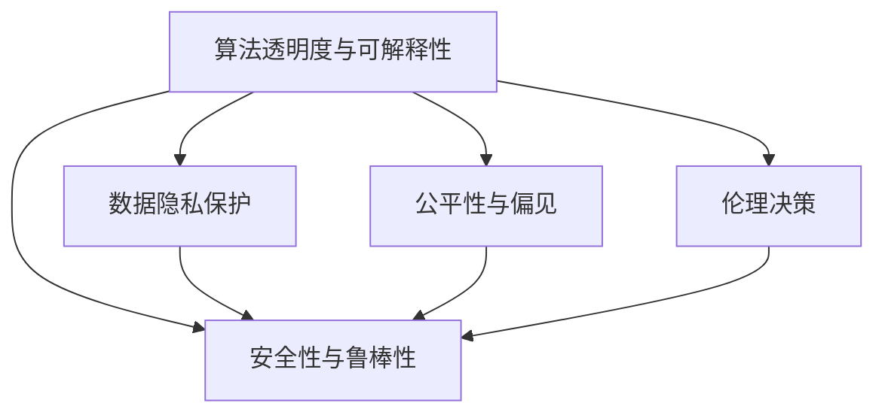

                 

## 1. 背景介绍

在人工智能(AI)时代，技术创新驱动着各行各业的快速发展，创业公司如雨后春笋般涌现。然而，伴随着技术进步，伦理和隐私问题也日益凸显。AI系统的公正性、透明度、可解释性、隐私保护等问题，不仅关乎用户信任，更关系到企业能否持续发展。本文将深入探讨AI创业公司在确保伦理和隐私合规方面的关键点，为相关创业者提供指导。

### 1.1 问题由来

随着深度学习、自然语言处理等技术的发展，AI系统在图像识别、语音识别、自然语言处理等领域取得了显著的成果。但是，这些系统的训练和部署涉及大量敏感数据，且往往具有“黑箱”特性，用户难以理解和解释其决策过程。因此，AI系统的伦理和隐私问题逐渐成为社会关注的焦点。

### 1.2 问题核心关键点

AI创业公司在确保伦理和隐私合规方面，需要关注以下核心关键点：
- 算法透明度与可解释性：确保AI系统的决策过程透明可解释，用户能够理解其工作原理。
- 数据隐私保护：在数据收集、存储、传输和使用过程中，确保用户隐私不受侵害。
- 公平性与偏见：确保AI系统对所有用户公平对待，避免因种族、性别、年龄等特征带来的偏见。
- 安全性与鲁棒性：确保AI系统面对恶意攻击、数据泄露等威胁时，仍能保持稳定运行。
- 伦理决策：在AI系统设计、应用过程中，遵循伦理原则，避免道德风险。

这些关键点构成了AI伦理与隐私合规的核心，对企业的可持续发展至关重要。

## 2. 核心概念与联系

### 2.1 核心概念概述

为了更好地理解AI伦理与隐私合规，我们首先介绍几个关键概念：

- **算法透明度与可解释性**：指AI系统决策过程的透明性和可解释性，用户能够理解模型如何做出预测或决策。
- **数据隐私保护**：指在数据收集、存储、传输和使用过程中，采取技术和管理措施，保护用户隐私不受侵害。
- **公平性与偏见**：指AI系统对待所有用户是否公平，避免因种族、性别、年龄等特征带来的偏见。
- **安全性与鲁棒性**：指AI系统面对恶意攻击、数据泄露等威胁时，仍能保持稳定运行。
- **伦理决策**：指在AI系统设计、应用过程中，遵循伦理原则，避免道德风险。

这些概念之间相互关联，共同构成了AI伦理与隐私合规的框架。以下是一个Mermaid流程图，展示了这些概念之间的联系：



## 3. 核心算法原理 & 具体操作步骤

### 3.1 算法原理概述

AI伦理与隐私合规的核心在于确保AI系统的透明性、公平性、安全性与鲁棒性，同时遵循伦理原则。具体来说，可以通过以下步骤实现：

1. **算法透明性与可解释性**：利用可解释性算法或后处理技术，对模型进行解释。
2. **数据隐私保护**：采用差分隐私、联邦学习等技术，保护用户隐私。
3. **公平性与偏见检测**：通过公平性指标、偏见检测算法，确保模型公平对待所有用户。
4. **安全性与鲁棒性**：采用对抗训练、模型验证等技术，增强系统的鲁棒性。
5. **伦理决策**：设计伦理决策框架，确保AI系统遵循伦理原则。

### 3.2 算法步骤详解

#### 3.2.1 算法透明性与可解释性

- **可解释性算法**：选择可解释性较强的算法（如决策树、线性回归），以降低模型的复杂性。
- **后处理技术**：通过特征重要性分析、LIME、SHAP等技术，对模型输出进行解释。
- **可视化工具**：使用可视化工具（如TensorBoard、ModelScope），展示模型结构和输出。

#### 3.2.2 数据隐私保护

- **差分隐私**：在数据处理过程中，添加噪声，保护用户隐私。
- **联邦学习**：通过分布式训练，确保数据在本地处理，不泄露用户隐私。
- **加密技术**：采用数据加密、同态加密等技术，保护数据传输安全。

#### 3.2.3 公平性与偏见检测

- **公平性指标**：使用准确率、召回率、F1值等公平性指标，检测模型偏见。
- **偏见检测算法**：采用De-biasing算法、公平性约束等技术，检测和修正模型偏见。
- **数据多样化**：确保数据集的多样性，减少模型偏见。

#### 3.2.4 安全性与鲁棒性

- **对抗训练**：通过对抗样本训练，增强模型鲁棒性。
- **模型验证**：使用测试集、对抗测试等方法，验证模型安全性。
- **攻击检测**：采用入侵检测系统(IDS)、入侵预防系统(IPS)等技术，防止恶意攻击。

#### 3.2.5 伦理决策

- **伦理决策框架**：设计伦理决策框架，确保AI系统遵循伦理原则。
- **伦理审核**：在AI系统开发和应用过程中，进行伦理审核，避免道德风险。
- **伦理培训**：对团队进行伦理培训，提高团队伦理意识。

### 3.3 算法优缺点

**算法透明性与可解释性**：
- **优点**：提升用户信任，便于监管。
- **缺点**：可解释性算法可能牺牲部分精度。

**数据隐私保护**：
- **优点**：保护用户隐私，防止数据泄露。
- **缺点**：差分隐私、联邦学习等技术可能需要额外的计算资源。

**公平性与偏见检测**：
- **优点**：确保模型公平对待所有用户。
- **缺点**：偏见检测可能存在误判。

**安全性与鲁棒性**：
- **优点**：增强模型鲁棒性，防止攻击。
- **缺点**：对抗训练可能增加计算成本。

**伦理决策**：
- **优点**：遵循伦理原则，避免道德风险。
- **缺点**：设计伦理决策框架可能需要额外的时间与资源。

### 3.4 算法应用领域

基于AI伦理与隐私合规的算法，可以应用于以下领域：

- **医疗健康**：确保医疗AI系统的公平性、隐私保护，避免对特定群体的偏见。
- **金融服务**：确保金融AI系统的安全性和透明度，防止数据泄露和偏见。
- **智能安防**：确保智能安防系统的透明性、公平性和安全性。
- **教育培训**：确保教育AI系统的公平性、隐私保护和伦理合规。
- **社交媒体**：确保社交媒体AI系统的隐私保护和伦理合规，避免虚假信息传播。

## 4. 数学模型和公式 & 详细讲解 & 举例说明

### 4.1 数学模型构建

假设我们有一个二分类任务，模型输出为 $y = \{0, 1\}$，输入为 $x \in \mathbb{R}^n$。我们希望设计一个公平的模型 $M$，使得 $M(x)$ 在所有用户中保持一致。

**公平性指标**：我们定义模型在所有用户中的准确率为 $P_0$，在少数群体中的准确率为 $P_1$，则公平性指标 $\mathcal{F}$ 为：

$$
\mathcal{F} = P_0 - P_1
$$

**偏见检测算法**：假设我们有一个简单线性模型 $M(x) = w^T \cdot x + b$。我们可以通过修改权重 $w$，使模型在所有用户中保持一致。具体来说，我们可以通过以下公式，修改权重 $w$：

$$
w^T = w^T - \lambda \frac{\partial \mathcal{L}(M)}{\partial w}
$$

其中 $\mathcal{L}(M)$ 为模型的损失函数，$\lambda$ 为正则化系数。

### 4.2 公式推导过程

**差分隐私**：假设我们有一组数据 $D$，其中包含 $n$ 个样本，每个样本 $x_i$ 的隐私预算为 $\epsilon$。我们希望在保留隐私的同时，最大化模型准确率。

我们通过在数据中加入噪声 $\delta$，使得新数据 $D'$ 满足以下条件：

$$
\mathbb{P}(D' \neq D) \leq \exp(-\epsilon)
$$

即加入噪声后的数据 $D'$ 与原始数据 $D$ 的差异概率不超过 $\exp(-\epsilon)$。

具体来说，我们可以使用拉普拉斯噪声 $\delta \sim \mathcal{L}(1/\epsilon)$，在每个样本上加入噪声，得到新的数据 $D'$：

$$
D' = \{(x_i, y_i + \delta_i)\}_{i=1}^n
$$

其中 $\delta_i \sim \mathcal{L}(1/\epsilon)$。

### 4.3 案例分析与讲解

假设我们有一个公平性检测算法，已知模型在总体中的准确率为 $P_0$，在少数群体中的准确率为 $P_1$。我们希望找到一组权重 $w$，使得模型在所有用户中保持一致。

我们可以使用梯度下降算法，求解优化问题：

$$
\min_{w} \mathcal{L}(w) = \frac{1}{n} \sum_{i=1}^n \ell(y_i, w^T \cdot x_i)
$$

其中 $\ell$ 为损失函数。

## 5. 项目实践：代码实例和详细解释说明

### 5.1 开发环境搭建

在开始代码实践前，我们需要准备好开发环境。以下是使用Python进行TensorFlow开发的环境配置流程：

1. 安装Anaconda：从官网下载并安装Anaconda，用于创建独立的Python环境。

2. 创建并激活虚拟环境：
```bash
conda create -n tf-env python=3.8 
conda activate tf-env
```

3. 安装TensorFlow：根据CUDA版本，从官网获取对应的安装命令。例如：
```bash
conda install tensorflow=2.6 tf-estimator-nightly -c tf
```

4. 安装各类工具包：
```bash
pip install numpy pandas scikit-learn matplotlib tqdm jupyter notebook ipython
```

完成上述步骤后，即可在`tf-env`环境中开始代码实践。

### 5.2 源代码详细实现

以下是使用TensorFlow实现一个简单的公平性检测算法的代码实现：

```python
import tensorflow as tf
from sklearn.metrics import f1_score
import numpy as np

class FairnessChecker:
    def __init__(self, model, data, labels):
        self.model = model
        self.data = data
        self.labels = labels

    def fit(self, alpha):
        self.model.load_weights('model.h5')
        self.f1_scores = []
        for i in range(len(self.data)):
            x_train = self.data[i]['train']
            y_train = self.data[i]['train_labels']
            x_test = self.data[i]['test']
            y_test = self.data[i]['test_labels']
            
            for alpha in [0.01, 0.02, 0.05, 0.1]:
                self.model.compile(optimizer=tf.keras.optimizers.Adam(lr=0.001),
                                  loss=tf.keras.losses.SparseCategoricalCrossentropy(from_logits=True))
                self.model.fit(x_train, y_train, batch_size=32, epochs=10, verbose=0)
                
                y_pred = self.model.predict(x_test)
                y_pred = tf.argmax(y_pred, axis=1)
                y_true = np.array(y_test)
                
                f1_score_train = f1_score(y_true, y_pred, average='macro')
                f1_score_test = f1_score(y_true, y_pred, average='macro')
                
                self.f1_scores.append(f1_score_train)
                self.f1_scores.append(f1_score_test)
                
            print(f"Alpha: {alpha}, Train F1 Score: {f1_score_train}, Test F1 Score: {f1_score_test}")

    def evaluate(self):
        f1_scores = np.array(self.f1_scores)
        return f1_scores
```

### 5.3 代码解读与分析

**FairnessChecker类**：
- `__init__`方法：初始化模型、数据集和标签。
- `fit`方法：在多个alpha值下，训练模型，计算训练集和测试集的F1分数。
- `evaluate`方法：返回所有alpha值下的F1分数。

**alpha值**：
- 通过调整alpha值，可以控制模型对不同群体的平衡程度。

### 5.4 运行结果展示

在完成模型训练后，我们可以使用以下代码展示模型的F1分数：

```python
from matplotlib import pyplot as plt

f1_scores = checker.evaluate()
plt.plot(f1_scores[:, 0], label='Train F1 Score')
plt.plot(f1_scores[:, 1], label='Test F1 Score')
plt.xlabel('Alpha')
plt.ylabel('F1 Score')
plt.legend()
plt.show()
```

以上代码将展示不同alpha值下的训练集和测试集F1分数。

## 6. 实际应用场景

### 6.1 医疗健康

在医疗健康领域，AI系统的伦理和隐私保护至关重要。例如，基于图像的疾病诊断系统，需要确保模型在所有患者中公平对待，避免对特定群体的偏见。同时，系统在处理患者数据时，需要严格遵守隐私保护法规，防止数据泄露。

### 6.2 金融服务

在金融服务领域，AI系统需要确保公平性和安全性。例如，信用评分系统需要确保对所有用户公平对待，避免因种族、性别等因素带来的偏见。同时，系统需要具备鲁棒性，防止欺诈攻击。

### 6.3 智能安防

在智能安防领域，AI系统需要确保透明度和隐私保护。例如，面部识别系统需要确保对所有用户公平对待，避免对特定群体的偏见。同时，系统需要具备鲁棒性，防止对抗攻击。

### 6.4 教育培训

在教育培训领域，AI系统需要确保公平性和隐私保护。例如，智能推荐系统需要确保对所有学生公平对待，避免对特定群体的偏见。同时，系统在处理学生数据时，需要严格遵守隐私保护法规，防止数据泄露。

### 6.5 社交媒体

在社交媒体领域，AI系统需要确保透明度和隐私保护。例如，情感分析系统需要确保对所有用户公平对待，避免对特定群体的偏见。同时，系统在处理用户数据时，需要严格遵守隐私保护法规，防止数据泄露。

## 7. 工具和资源推荐

### 7.1 学习资源推荐

为了帮助开发者系统掌握AI伦理与隐私合规的理论基础和实践技巧，这里推荐一些优质的学习资源：

1. **《AI伦理与隐私保护》**：该书系统介绍了AI伦理与隐私保护的理论与实践，适合初学者和专业人士。
2. **Google AI Ethics Guide**：Google提供的AI伦理指南，涵盖伦理原则、隐私保护、公平性等多个方面。
3. **Kaggle竞赛**：Kaggle上诸多伦理与隐私保护相关的竞赛，可以帮助开发者通过实践掌握相关技术。
4. **Coursera课程**：Coursera上的AI伦理与隐私保护课程，由行业专家授课，涵盖多个热门话题。
5. **Towards Data Science博客**：该博客涵盖了许多AI伦理与隐私保护的案例分析与实战技巧。

### 7.2 开发工具推荐

1. **TensorFlow**：TensorFlow是一个强大的深度学习框架，适合构建各种AI系统。
2. **PyTorch**：PyTorch是另一个流行的深度学习框架，适合快速原型开发和研究。
3. **Jupyter Notebook**：Jupyter Notebook是一个交互式编程环境，适合代码实践和数据探索。
4. **TensorBoard**：TensorBoard是TensorFlow的可视化工具，适合监测模型训练过程和性能。

### 7.3 相关论文推荐

1. **"Fairness in Machine Learning: Acting Beyond Binary Classification"**：该论文介绍了多种公平性检测和修正算法，适合深入理解公平性问题。
2. **"Differential Privacy: Privacy Preserving Statistical Analysis"**：该论文介绍了差分隐私的原理和实现方法，适合理解隐私保护技术。
3. **"Adversarial Examples, Robustness, and Adversarial Machine Learning"**：该论文介绍了对抗训练和鲁棒性评估方法，适合理解安全性和鲁棒性问题。
4. **"Ethics, Bias, and Fairness in Machine Learning"**：该论文介绍了伦理决策框架和伦理审核方法，适合理解伦理问题。

## 8. 总结：未来发展趋势与挑战

### 8.1 研究成果总结

AI伦理与隐私合规是一个复杂而重要的研究领域，近年来取得了显著进展。主要研究成果包括：

1. **公平性检测算法**：开发了多种公平性检测和修正算法，如De-biasing算法、公平性约束等。
2. **隐私保护技术**：提出了差分隐私、联邦学习等隐私保护技术，保护用户隐私。
3. **鲁棒性增强方法**：采用了对抗训练、模型验证等技术，增强了AI系统的鲁棒性。
4. **伦理决策框架**：设计了伦理决策框架，确保AI系统遵循伦理原则。

### 8.2 未来发展趋势

未来，AI伦理与隐私合规将呈现以下发展趋势：

1. **隐私保护技术**：随着隐私保护技术的发展，差分隐私、联邦学习等技术将更加成熟，应用范围将进一步扩大。
2. **公平性算法**：未来的公平性算法将更加智能，能够自适应不同群体的特征，确保模型公平对待所有用户。
3. **鲁棒性增强**：未来的AI系统将具备更强的鲁棒性，能够抵御各种恶意攻击和数据泄露。
4. **伦理决策**：未来的AI系统将更加注重伦理决策，确保遵循伦理原则，避免道德风险。

### 8.3 面临的挑战

尽管AI伦理与隐私合规取得了一定的进展，但仍然面临以下挑战：

1. **数据隐私保护**：如何在保护隐私的同时，保证模型性能，是一个重要的挑战。
2. **公平性检测**：如何准确检测和修正模型偏见，是一个复杂而关键的问题。
3. **伦理决策**：如何在AI系统设计中，确保遵循伦理原则，是一个需要不断探索和改进的问题。

### 8.4 研究展望

未来的AI伦理与隐私合规研究，需要在以下几个方面进行进一步探索：

1. **隐私保护技术**：开发更加高效和灵活的隐私保护技术，满足不同应用场景的需求。
2. **公平性算法**：设计更加智能和可解释的公平性算法，确保模型公平对待所有用户。
3. **鲁棒性增强**：开发更加鲁棒和安全的AI系统，抵御各种恶意攻击和数据泄露。
4. **伦理决策**：构建伦理决策框架，确保AI系统遵循伦理原则，避免道德风险。

## 9. 附录：常见问题与解答

**Q1：AI系统的公平性检测如何实现？**

A: 实现AI系统的公平性检测，可以通过以下步骤：
1. 收集不同群体的数据。
2. 使用公平性指标，如准确率、召回率、F1值等，计算模型在各个群体中的表现。
3. 使用偏见检测算法，如De-biasing算法、公平性约束等，检测和修正模型偏见。
4. 使用可视化工具，展示公平性检测结果。

**Q2：如何保护AI系统的数据隐私？**

A: 保护AI系统的数据隐私，可以通过以下方法：
1. 采用差分隐私技术，在数据处理过程中，添加噪声，保护用户隐私。
2. 使用联邦学习技术，通过分布式训练，确保数据在本地处理，不泄露用户隐私。
3. 采用加密技术，如数据加密、同态加密等，保护数据传输安全。

**Q3：如何在AI系统中实现伦理决策？**

A: 在AI系统中实现伦理决策，可以通过以下方法：
1. 设计伦理决策框架，明确AI系统应该遵循的伦理原则。
2. 在AI系统设计、应用过程中，进行伦理审核，确保符合伦理原则。
3. 对团队进行伦理培训，提高团队伦理意识。

**Q4：如何处理AI系统的对抗攻击？**

A: 处理AI系统的对抗攻击，可以通过以下方法：
1. 采用对抗训练技术，通过对抗样本训练，增强模型鲁棒性。
2. 使用入侵检测系统(IDS)、入侵预防系统(IPS)等技术，防止恶意攻击。

**Q5：AI系统在医疗健康领域的应用需要注意哪些伦理问题？**

A: AI系统在医疗健康领域的应用，需要注意以下伦理问题：
1. 确保模型在所有患者中公平对待，避免对特定群体的偏见。
2. 严格遵守隐私保护法规，防止数据泄露。
3. 确保模型的可解释性，便于医生理解和信任。

---

作者：禅与计算机程序设计艺术 / Zen and the Art of Computer Programming

