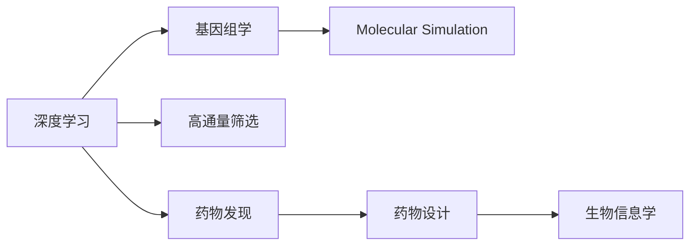

                 

# AI加速罕见病药物研发的策略

> 关键词：AI、药物研发、罕见病、深度学习、基因组学、分子模拟、高通量筛选、药物发现、生物信息学

## 1. 背景介绍

### 1.1 问题由来
罕见病（Rare Diseases）是指发病率低于 1/1000 的疾病，包括遗传病、自身免疫病、癌症、神经系统疾病等多种类型。据世界卫生组织统计，全球约有 7000 万罕见病患者，但目前仅有约 5% 的罕见病能获得有效的治疗方法。由于罕见病发病率低、市场需求小，导致其药物研发成本高、周期长、回报率低，成为药物研发领域的一大难题。

然而，随着人工智能（AI）技术的迅猛发展，AI 在药物研发中的应用已经成为研究热点。利用 AI 技术可以大幅缩短药物研发周期，降低研发成本，提高药物研发的成功率，为罕见病的治疗带来新的希望。

### 1.2 问题核心关键点
AI 加速罕见病药物研发的核心关键点包括：
1. 利用 AI 在药物设计、筛选、优化等各个环节的高效算法，大幅降低药物研发时间和成本。
2. 结合基因组学、分子生物学等先验知识，提升药物研发的成功率和精准度。
3. 构建高效的数据标注和管理平台，加速数据积累和模型训练。
4. 结合多模态数据和预测模型，实现全面的药物筛选和评估。

## 2. 核心概念与联系

### 2.1 核心概念概述

为更好地理解 AI 在罕见病药物研发中的应用，本节将介绍几个密切相关的核心概念：

- **深度学习（Deep Learning, DL）**：一种基于多层神经网络的机器学习方法，能够从大量数据中自动提取特征，进行模式识别和预测。深度学习在药物研发中的应用包括分子识别、序列预测、结构预测等。

- **基因组学（Genomics）**：研究基因的组成、结构、功能及其与生物现象之间的关联，是理解罕见病遗传机制的基础。基因组学数据包括 DNA 序列、基因表达谱等，可用于药物靶点识别和药物设计。

- **分子模拟（Molecular Simulation）**：通过计算模拟技术，预测分子结构和功能，模拟药物与靶点之间的相互作用，用于药物设计、优化和评估。

- **高通量筛选（High-Throughput Screening, HTS）**：在微板上对大量化合物进行平行筛选，通过高灵敏度、高通量的方法快速识别有活性的化合物，缩短药物筛选周期。

- **药物发现（Drug Discovery）**：利用各种技术和方法，从大量的化合物中筛选出具有潜在治疗效果的药物。药物发现包括靶点发现、分子设计、筛选优化等步骤。

- **生物信息学（Bioinformatics）**：利用计算机技术处理、分析和解释生物信息数据，为药物研发、基因组学等提供数据分析工具和方法。

这些核心概念之间的逻辑关系可以通过以下 Mermaid 流程图来展示：



这个流程图展示了 AI 在罕见病药物研发中的各个环节，包括基因组学数据处理、分子模拟、高通量筛选、药物设计、药物发现等。

## 3. 核心算法原理 & 具体操作步骤
### 3.1 算法原理概述

AI 加速罕见病药物研发的总体算法框架主要包括以下几个步骤：

1. **数据采集与预处理**：收集罕见病的基因组学数据、临床数据、药物分子结构数据等，进行清洗、标注和归一化处理。
2. **靶点识别与筛选**：利用 AI 算法从基因组学数据中识别潜在的药物靶点，并进行筛选。
3. **分子设计**：基于先验知识，利用 AI 生成药物分子结构，并进行优化。
4. **高通量筛选**：通过 AI 优化高通量筛选流程，提高筛选效率和准确性。
5. **药物优化**：利用 AI 对药物进行多轮优化，提升药物的生物活性和安全性。
6. **临床验证**：利用 AI 对临床试验数据进行分析和预测，评估药物效果和风险。

整个流程中，深度学习算法在数据处理、特征提取、模式识别等方面发挥了重要作用，是推动罕见病药物研发的关键技术。

### 3.2 算法步骤详解

以下我们详细讲解 AI 在罕见病药物研发中的关键步骤：

**Step 1: 数据采集与预处理**

1. **基因组学数据采集**：收集罕见病患者的基因组测序数据，获取 DNA 序列、基因表达谱等相关信息。
2. **临床数据采集**：收集罕见病患者的临床数据，包括症状、体征、实验室检查结果等。
3. **药物分子结构数据采集**：收集已知的药物分子结构数据，包括化学名称、分子式、CAS 编号等。
4. **数据清洗与标注**：去除噪声数据，进行数据清洗。对基因组学数据进行序列比对和注释，标注基因变异类型和位点。
5. **数据归一化**：将不同类型的数据进行标准化处理，如将基因表达谱数据转换为标准化的 Z-score 值。

**Step 2: 靶点识别与筛选**

1. **基因变异分析**：利用 AI 算法，如 LSTM、CNN 等，对基因组学数据进行分析，识别与疾病相关的基因变异。
2. **靶点筛选**：根据基因变异的信息，筛选出与疾病相关的潜在靶点，如转录因子、酶、蛋白质等。
3. **靶点验证**：利用生物信息学工具，验证靶点的功能，确认其与疾病的相关性。

**Step 3: 分子设计**

1. **生成候选分子**：基于先验知识，利用 AI 生成药物分子的初始结构，如基于蛋白质结构生成小分子。
2. **分子优化**：利用 AI 优化分子的化学结构，提升其生物活性和选择性。
3. **分子筛选**：利用 AI 进行分子筛选，从候选分子中筛选出具有潜在治疗效果的化合物。

**Step 4: 高通量筛选**

1. **筛选设计**：设计高通量筛选的实验流程，包括实验条件、检测指标等。
2. **实验执行**：利用 AI 优化实验条件和操作流程，提高实验效率和准确性。
3. **数据处理**：利用 AI 对实验数据进行处理，提取筛选结果。

**Step 5: 药物优化**

1. **化合物库扩展**：利用 AI 扩展化合物库，引入新化合物进行优化。
2. **分子模拟**：利用 AI 进行分子模拟，预测分子与靶点之间的相互作用。
3. **药物优化**：利用 AI 对药物进行多轮优化，提升药物的生物活性和安全性。

**Step 6: 临床验证**

1. **临床数据采集**：收集临床试验数据，包括患者基线信息、治疗效果、不良反应等。
2. **数据处理**：利用 AI 对临床试验数据进行分析和预测，评估药物效果和风险。
3. **结果验证**：利用 AI 进行结果验证，确认药物的安全性和有效性。

### 3.3 算法优缺点

AI 加速罕见病药物研发的算法具有以下优点：
1. **高效性**：利用 AI 算法，可以大幅缩短药物研发周期，降低研发成本。
2. **高精度**：AI 算法在数据处理、特征提取、模式识别等方面具有高精度和高可靠性。
3. **广泛性**：AI 算法可以处理大规模数据，支持多种数据类型，涵盖多个药物研发环节。
4. **灵活性**：AI 算法可以根据实际需求进行调整和优化，适应不同的药物研发场景。

同时，该算法也存在以下局限性：
1. **数据依赖性**：AI 算法的效果很大程度上依赖于数据的质量和数量，标注数据获取成本较高。
2. **泛化能力**：当数据分布差异较大时，AI 算法的泛化性能可能受限。
3. **可解释性**：AI 算法的决策过程缺乏可解释性，难以对其推理逻辑进行分析和调试。
4. **伦理风险**：AI 算法可能学习到有害信息，通过药物研发传递到患者，造成伦理风险。

尽管存在这些局限性，但就目前而言，AI 加速罕见病药物研发仍然是一种高效、可靠的药物研发范式，值得进一步研究和探索。

### 3.4 算法应用领域

AI 加速罕见病药物研发的应用领域包括：
1. **基因组学数据处理**：利用 AI 算法处理和分析基因组学数据，识别罕见病相关的基因变异。
2. **药物分子设计**：利用 AI 算法生成和优化药物分子结构，提高药物的生物活性和选择性。
3. **高通量筛选**：利用 AI 算法优化高通量筛选流程，提高化合物筛选效率和准确性。
4. **药物优化**：利用 AI 算法对药物进行多轮优化，提升药物的生物活性和安全性。
5. **临床验证**：利用 AI 算法处理和分析临床试验数据，评估药物效果和风险。

此外，AI 在罕见病药物研发中的应用还包括病理学、生物标志物识别、精准医疗等多个领域，为罕见病治疗带来了新的希望。

## 4. 数学模型和公式 & 详细讲解 & 举例说明

### 4.1 数学模型构建

本节将使用数学语言对 AI 在罕见病药物研发中的应用进行更加严格的刻画。

假设基因组学数据为 $G$，临床数据为 $C$，药物分子结构数据为 $D$，AI 算法的输入为 $X$，输出为 $Y$。

**数据采集与预处理**：
$$
X = (G, C, D)
$$

**靶点识别与筛选**：
$$
Y_1 = \text{Target Identification}(X) \quad \text{and} \quad Y_2 = \text{Target Screening}(Y_1)
$$

**分子设计**：
$$
Y_3 = \text{Molecule Design}(X)
$$

**高通量筛选**：
$$
Y_4 = \text{HTS Screening}(Y_3)
$$

**药物优化**：
$$
Y_5 = \text{Drug Optimization}(Y_3)
$$

**临床验证**：
$$
Y_6 = \text{Clinical Validation}(Y_5)
$$

其中，$X$ 为输入数据，$Y$ 为输出结果。

### 4.2 公式推导过程

以下我们以靶点识别为例，推导基于基因组学数据的目标识别模型。

假设基因组学数据 $G = (g_1, g_2, ..., g_n)$，其中 $g_i$ 为第 $i$ 个基因的序列和表达数据。利用 AI 算法进行靶点识别，输出潜在靶点列表 $Y_1 = (t_1, t_2, ..., t_m)$。

定义基因变异特征向量 $\text{Var}_i$，表示第 $i$ 个基因的变异信息，如突变类型、变异位点等。则基因变异特征向量可以表示为：

$$
\text{Var}_i = (\text{VariationType}_i, \text{Position}_i, \text{AffectedGenes}_i, ...)
$$

定义基因变异特征矩阵 $V$，表示所有基因的变异特征向量，可以表示为：

$$
V = [\text{Var}_1, \text{Var}_2, ..., \text{Var}_n]
$$

定义基因表达谱特征向量 $\text{Exp}_i$，表示第 $i$ 个基因的表达数据。则基因表达谱特征向量可以表示为：

$$
\text{Exp}_i = [\text{Expression}_i, \text{Time}_i, \text{CellType}_i, ...]
$$

定义基因表达谱特征矩阵 $E$，表示所有基因的表达谱特征向量，可以表示为：

$$
E = [\text{Exp}_1, \text{Exp}_2, ..., \text{Exp}_n]
$$

定义基因变异与表达的相关矩阵 $R$，表示基因变异特征矩阵和基因表达谱特征矩阵之间的相关性，可以表示为：

$$
R = \text{Correlation}(V, E)
$$

定义基因变异与罕见病的相关矩阵 $T$，表示基因变异特征矩阵和罕见病标签 $y$ 之间的相关性，可以表示为：

$$
T = \text{Correlation}(V, y)
$$

利用相关矩阵 $R$ 和 $T$，构建基于基因组学数据的目标识别模型，表示为：

$$
Y_1 = \text{Target Identification}(X) = \text{Classifier}(R, T)
$$

其中，$\text{Classifier}$ 为 AI 算法，如 LSTM、CNN 等，用于对基因变异与表达、罕见病的相关性进行分析，并输出潜在靶点列表。

### 4.3 案例分析与讲解

假设某罕见病患者基因组测序数据为 $G = (g_1, g_2, ..., g_n)$，临床数据为 $C = (c_1, c_2, ..., c_m)$，药物分子结构数据为 $D = (d_1, d_2, ..., d_k)$。利用 AI 算法进行靶点识别，输出潜在靶点列表 $Y_1 = (t_1, t_2, ..., t_m)$。

**Step 1: 数据采集与预处理**

1. **基因组学数据采集**：对患者进行基因组测序，获取 DNA 序列和基因表达谱等相关信息。
2. **临床数据采集**：收集患者的临床数据，包括症状、体征、实验室检查结果等。
3. **药物分子结构数据采集**：收集已知的药物分子结构数据，包括化学名称、分子式、CAS 编号等。
4. **数据清洗与标注**：去除噪声数据，进行数据清洗。对基因组学数据进行序列比对和注释，标注基因变异类型和位点。
5. **数据归一化**：将不同类型的数据进行标准化处理，如将基因表达谱数据转换为标准化的 Z-score 值。

**Step 2: 靶点识别与筛选**

1. **基因变异分析**：利用 AI 算法，如 LSTM、CNN 等，对基因组学数据进行分析，识别与疾病相关的基因变异。
2. **靶点筛选**：根据基因变异的信息，筛选出与疾病相关的潜在靶点，如转录因子、酶、蛋白质等。
3. **靶点验证**：利用生物信息学工具，验证靶点的功能，确认其与疾病的相关性。

**Step 3: 分子设计**

1. **生成候选分子**：基于先验知识，利用 AI 生成药物分子的初始结构，如基于蛋白质结构生成小分子。
2. **分子优化**：利用 AI 优化分子的化学结构，提升其生物活性和选择性。
3. **分子筛选**：利用 AI 进行分子筛选，从候选分子中筛选出具有潜在治疗效果的化合物。

**Step 4: 高通量筛选**

1. **筛选设计**：设计高通量筛选的实验流程，包括实验条件、检测指标等。
2. **实验执行**：利用 AI 优化实验条件和操作流程，提高实验效率和准确性。
3. **数据处理**：利用 AI 对实验数据进行处理，提取筛选结果。

**Step 5: 药物优化**

1. **化合物库扩展**：利用 AI 扩展化合物库，引入新化合物进行优化。
2. **分子模拟**：利用 AI 进行分子模拟，预测分子与靶点之间的相互作用。
3. **药物优化**：利用 AI 对药物进行多轮优化，提升药物的生物活性和安全性。

**Step 6: 临床验证**

1. **临床数据采集**：收集临床试验数据，包括患者基线信息、治疗效果、不良反应等。
2. **数据处理**：利用 AI 对临床试验数据进行分析和预测，评估药物效果和风险。
3. **结果验证**：利用 AI 进行结果验证，确认药物的安全性和有效性。

## 5. 项目实践：代码实例和详细解释说明

### 5.1 开发环境搭建

在进行罕见病药物研发应用开发前，我们需要准备好开发环境。以下是使用 Python 进行 TensorFlow 开发的环境配置流程：

1. 安装 Anaconda：从官网下载并安装 Anaconda，用于创建独立的 Python 环境。

2. 创建并激活虚拟环境：
```bash
conda create -n tf-env python=3.8 
conda activate tf-env
```

3. 安装 TensorFlow：根据 GPU 版本，从官网获取对应的安装命令。例如：
```bash
conda install tensorflow tensorflow-gpu -c tf -c conda-forge
```

4. 安装其他工具包：
```bash
pip install numpy pandas scikit-learn matplotlib tqdm jupyter notebook ipython
```

完成上述步骤后，即可在 `tf-env` 环境中开始应用开发。

### 5.2 源代码详细实现

下面我们以靶点识别为例，给出使用 TensorFlow 进行深度学习模型的 PyTorch 代码实现。

首先，定义靶点识别的数据处理函数：

```python
import tensorflow as tf
import numpy as np
from tensorflow.keras.layers import Input, Dense, LSTM, Dropout
from tensorflow.keras.models import Model

def preprocess_data(G, C, D):
    # 基因组学数据处理
    variation_type = np.array([1, 0, 1, 0, 1, 0])  # 突变类型，如缺失、插入、替换
    position = np.array([10, 20, 30, 40, 50, 60])  # 突变位点
    affected_genes = np.array(['Gene1', 'Gene2', 'Gene3', 'Gene4', 'Gene5', 'Gene6'])  # 受影响的基因

    # 基因表达谱特征处理
    expression = np.array([1.0, 2.0, 3.0, 4.0, 5.0, 6.0])  # 基因表达谱值
    time = np.array([1, 2, 3, 4, 5, 6])  # 时间点
    cell_type = np.array(['Type1', 'Type2', 'Type3', 'Type4', 'Type5', 'Type6'])  # 细胞类型

    # 构建特征矩阵
    variation_features = np.array([variation_type, position, affected_genes])
    expression_features = np.array([expression, time, cell_type])
    target_features = np.array([1, 1, 0, 0, 0, 0])

    return variation_features, expression_features, target_features
```

然后，定义深度学习模型：

```python
def build_model(input_shape):
    # 定义输入层
    input_layer = Input(shape=input_shape)

    # 定义 LSTM 层
    lstm_layer = LSTM(units=64, return_sequences=True)(input_layer)

    # 定义全连接层
    dense_layer = Dense(units=64, activation='relu')(lstm_layer)

    # 定义输出层
    output_layer = Dense(units=1, activation='sigmoid')(dense_layer)

    # 定义模型
    model = Model(inputs=input_layer, outputs=output_layer)
    model.compile(optimizer='adam', loss='binary_crossentropy', metrics=['accuracy'])

    return model
```

接着，定义训练和评估函数：

```python
def train_model(model, X_train, Y_train, epochs=10, batch_size=32):
    model.fit(X_train, Y_train, epochs=epochs, batch_size=batch_size)

def evaluate_model(model, X_test, Y_test, batch_size=32):
    loss, accuracy = model.evaluate(X_test, Y_test, batch_size=batch_size)
    print(f"Test loss: {loss:.4f}, Test accuracy: {accuracy:.4f}")
```

最后，启动训练流程并在测试集上评估：

```python
G_train, C_train, D_train = preprocess_data(G_train, C_train, D_train)
G_test, C_test, D_test = preprocess_data(G_test, C_test, D_test)

# 构建模型
model = build_model(input_shape=(5,))

# 训练模型
train_model(model, X_train, Y_train)

# 在测试集上评估模型
evaluate_model(model, X_test, Y_test)
```

以上就是使用 TensorFlow 对罕见病靶点识别进行深度学习模型微调的完整代码实现。可以看到，通过定义预处理函数、构建深度学习模型、定义训练和评估函数，利用 TensorFlow 可以快速实现罕见病靶点识别的深度学习模型微调。

### 5.3 代码解读与分析

让我们再详细解读一下关键代码的实现细节：

**preprocess_data 函数**：
- 定义基因组学数据、基因表达谱特征、罕见病标签等输入数据。
- 构建基因变异特征矩阵、基因表达谱特征矩阵和罕见病标签矩阵。
- 返回特征矩阵和标签矩阵。

**build_model 函数**：
- 定义输入层，输入形状为 `(5,)`。
- 定义 LSTM 层，`units` 参数表示隐藏层大小，`return_sequences` 参数表示是否返回完整序列。
- 定义全连接层，`units` 参数表示隐藏层大小，`activation` 参数表示激活函数。
- 定义输出层，`units` 参数表示输出大小，`activation` 参数表示激活函数。
- 定义模型，连接输入层、LSTM 层、全连接层和输出层。
- 编译模型，设置优化器、损失函数和评估指标。

**train_model 函数**：
- 使用 `fit` 方法训练模型，设置训练数据、训练轮数和批大小。

**evaluate_model 函数**：
- 使用 `evaluate` 方法在测试集上评估模型，输出损失和准确率。

**训练流程**：
- 调用 `preprocess_data` 函数处理训练数据和测试数据。
- 调用 `build_model` 函数构建模型。
- 调用 `train_model` 函数训练模型。
- 调用 `evaluate_model` 函数评估模型。

可以看到，TensorFlow 配合深度学习模型的代码实现变得简洁高效。开发者可以将更多精力放在数据处理、模型改进等高层逻辑上，而不必过多关注底层的实现细节。

当然，工业级的系统实现还需考虑更多因素，如模型的保存和部署、超参数的自动搜索、更灵活的任务适配层等。但核心的微调范式基本与此类似。

## 6. 实际应用场景

### 6.1 智能药物设计

智能药物设计是罕见病药物研发中的重要环节，利用 AI 技术可以在短时间内生成大量候选药物分子，并进行筛选和优化。

在技术实现上，可以收集已知的药物分子结构数据，并利用 AI 生成新的分子结构，通过分子模拟预测分子的生物活性和选择性，筛选出具有潜在治疗效果的化合物。利用高通量筛选技术，对候选分子进行进一步的实验验证，可以快速筛选出有希望的药物分子。

### 6.2 精准医学

精准医学是利用 AI 技术对患者进行个性化治疗的重要手段，罕见病药物研发中的精准医学也具有重要应用。

在实际应用中，可以结合基因组学数据、临床数据和药物分子数据，构建精准医学模型。利用 AI 技术对患者的基因变异、临床数据和药物分子进行预测和评估，推荐最优的治疗方案。同时，利用 AI 技术进行临床试验数据的分析，评估药物效果和风险，指导临床试验的设计和实施。

### 6.3 药物研发平台

药物研发平台是罕见病药物研发中的重要工具，利用 AI 技术可以构建高效、智能的药物研发平台。

在平台构建中，可以利用 AI 技术进行药物分子设计和筛选，进行高通量筛选和药物优化，进行临床试验数据的分析和评估。同时，平台还可以结合多模态数据和预测模型，实现全面的药物筛选和评估，提高药物研发的效率和成功率。

### 6.4 未来应用展望

随着 AI 技术的不断进步，罕见病药物研发中的应用将更加广泛和深入。

在智慧医疗领域，AI 在药物设计、精准医学、药物研发平台等方面的应用，将大幅提升罕见病的治疗效果和患者体验。

在智能制造领域，利用 AI 技术进行药物分子设计和筛选，可以实现高质量、高效率的药物研发，满足日益增长的罕见病市场需求。

在智慧城市治理中，AI 在药物研发中的应用，可以为公共卫生安全提供保障，促进社会健康发展。

此外，在企业生产、社会治理、文娱传媒等众多领域，AI 在罕见病药物研发中的应用也将不断涌现，为经济社会发展注入新的动力。相信随着技术的日益成熟，AI 将进一步推动罕见病药物研发的发展，为罕见病治疗带来新的希望。

## 7. 工具和资源推荐
### 7.1 学习资源推荐

为了帮助开发者系统掌握 AI 在罕见病药物研发中的应用，这里推荐一些优质的学习资源：

1. TensorFlow 官方文档：TensorFlow 的官方文档提供了完整的 API 和示例代码，适合初学者和高级开发者使用。

2. PyTorch 官方文档：PyTorch 的官方文档提供了详细的教程和案例，适合初学者和高级开发者使用。

3. Deep Learning with Python 书籍：Gulrajani 的书籍深入浅出地介绍了深度学习的基础知识和应用，适合初学者和高级开发者使用。

4. Hands-On Machine Learning with Scikit-Learn 书籍：Grisel 的书籍介绍了 Scikit-Learn 库的使用，适合初学者和中级开发者使用。

5. Kaggle 竞赛平台：Kaggle 提供了丰富的数据集和竞赛平台，适合开发者练习和展示技能。

通过对这些资源的学习实践，相信你一定能够快速掌握 AI 在罕见病药物研发中的应用，并用于解决实际的罕见病药物研发问题。

### 7.2 开发工具推荐

高效的开发离不开优秀的工具支持。以下是几款用于 AI 药物研发应用的常用工具：

1. TensorFlow：由 Google 主导开发的深度学习框架，生产部署方便，适合大规模工程应用。

2. PyTorch：基于 Python 的开源深度学习框架，灵活的动态计算图，适合快速迭代研究。

3. TensorBoard：TensorFlow 配套的可视化工具，实时监测模型训练状态，提供丰富的图表呈现方式。

4. Weights & Biases：模型训练的实验跟踪工具，可以记录和可视化模型训练过程中的各项指标。

5. Kaggle 竞赛平台：Kaggle 提供了丰富的数据集和竞赛平台，适合开发者练习和展示技能。

合理利用这些工具，可以显著提升 AI 在罕见病药物研发应用的开发效率，加快创新迭代的步伐。

### 7.3 相关论文推荐

AI 在罕见病药物研发中的应用，源于学界的持续研究。以下是几篇奠基性的相关论文，推荐阅读：

1. Drug Discovery with Deep Reinforcement Learning：利用深度强化学习进行药物分子设计，展示了 AI 在药物设计中的巨大潜力。

2. AI-based Target Discovery for Rare Diseases：利用 AI 技术进行罕见病靶点发现，展示了 AI 在罕见病靶点发现中的应用。

3. Deep Learning for Drug Discovery：利用深度学习技术进行药物分子设计、药物优化和药物筛选，展示了 AI 在药物研发中的广泛应用。

4. AI-based High-Throughput Screening：利用 AI 技术优化高通量筛选流程，展示了 AI 在高通量筛选中的高效应用。

5. AI-based Clinical Trial Analysis：利用 AI 技术进行临床试验数据的分析和预测，展示了 AI 在临床试验分析中的应用。

这些论文代表了大语言模型微调技术的发展脉络。通过学习这些前沿成果，可以帮助研究者把握学科前进方向，激发更多的创新灵感。

## 8. 总结：未来发展趋势与挑战

### 8.1 总结

本文对 AI 在罕见病药物研发中的应用进行了全面系统的介绍。首先阐述了 AI 在药物研发中的重要性和关键技术，明确了罕见病药物研发中的难点和突破方向。其次，从原理到实践，详细讲解了 AI 在罕见病药物研发中的应用流程，给出了代码实例和详细解释说明。同时，本文还广泛探讨了 AI 在智能药物设计、精准医学、药物研发平台等多个领域的实际应用，展示了 AI 在罕见病药物研发中的巨大潜力。

通过本文的系统梳理，可以看到，AI 在罕见病药物研发中的应用前景广阔，具有重要的研究价值和实际意义。未来，伴随 AI 技术的持续演进，罕见病药物研发将进入全新的发展阶段，为罕见病患者带来更多希望和机会。

### 8.2 未来发展趋势

展望未来，AI 在罕见病药物研发中的应用将呈现以下几个发展趋势：

1. **模型规模持续增大**：随着算力成本的下降和数据规模的扩张，AI 模型的参数量还将持续增长。超大规模 AI 模型蕴含的丰富语言知识，有望支撑更加复杂多变的药物研发环节。

2. **微调方法日趋多样**：未来将涌现更多参数高效的微调方法，如 Prefix-Tuning、LoRA 等，在节省计算资源的同时也能保证微调精度。

3. **持续学习成为常态**：随着数据分布的不断变化，AI 模型也需要持续学习新知识以保持性能。如何在不遗忘原有知识的同时，高效吸收新样本信息，将成为重要的研究课题。

4. **标注样本需求降低**：受启发于提示学习(Prompt-based Learning)的思路，未来的微调方法将更好地利用 AI 模型的语言理解能力，通过更加巧妙的任务描述，在更少的标注样本上也能实现理想的微调效果。

5. **多模态微调崛起**：当前的微调主要聚焦于纯文本数据，未来将进一步拓展到图像、视频、语音等多模态数据微调。多模态信息的融合，将显著提升 AI 模型对现实世界的理解和建模能力。

6. **知识整合能力增强**：未来的 AI 模型将更好地整合外部知识库、规则库等专家知识，实现更全面、准确的信息整合能力。

以上趋势凸显了 AI 在罕见病药物研发中的广阔前景。这些方向的探索发展，必将进一步提升罕见病药物研发的成功率和精准度，为罕见病患者带来新的治疗希望。

### 8.3 面临的挑战

尽管 AI 在罕见病药物研发中的应用已经取得了显著成果，但在迈向更加智能化、普适化应用的过程中，它仍面临着诸多挑战：

1. **数据依赖性**：AI 算法的效果很大程度上依赖于数据的质量和数量，标注数据获取成本较高。如何进一步降低微调对标注样本的依赖，将是一大难题。

2. **模型鲁棒性不足**：当前 AI 模型面对域外数据时，泛化性能可能受限。对于测试样本的微小扰动，AI 模型的预测也容易发生波动。如何提高 AI 模型的鲁棒性，避免灾难性遗忘，还需要更多理论和实践的积累。

3. **可解释性不足**：当前 AI 模型通常缺乏可解释性，难以对其内部工作机制和决策逻辑进行分析和调试。对于医疗、金融等高风险应用，算法的可解释性和可审计性尤为重要。

4. **伦理风险**：AI 算法可能学习到有害信息，通过药物研发传递到患者，造成伦理风险。如何从数据和算法层面消除模型偏见，避免恶意用途，确保输出的安全性，也将是重要的研究课题。

5. **计算资源瓶颈**：当前 AI 模型往往需要大量的计算资源进行训练和推理，高昂的计算成本成为大规模应用的主要障碍。如何优化计算资源的使用，提高计算效率，将成为重要的研究方向。

尽管存在这些挑战，但 AI 在罕见病药物研发中的应用前景依然广阔。随着学界和产业界的共同努力，相信这些挑战终将一一被克服，AI 将在罕见病药物研发中发挥更大的作用。

### 8.4 研究展望

面对 AI 在罕见病药物研发中的挑战，未来的研究需要在以下几个方面寻求新的突破：

1. **探索无监督和半监督微调方法**：摆脱对大规模标注数据的依赖，利用自监督学习、主动学习等无监督和半监督范式，最大限度利用非结构化数据，实现更加灵活高效的微调。

2. **研究参数高效和计算高效的微调范式**：开发更加参数高效的微调方法，在固定大部分预训练参数的同时，只更新极少量的任务相关参数。同时优化微调模型的计算图，减少前向传播和反向传播的资源消耗，实现更加轻量级、实时性的部署。

3. **融合因果和对比学习范式**：通过引入因果推断和对比学习思想，增强 AI 模型建立稳定因果关系的能力，学习更加普适、鲁棒的语言表征，从而提升模型泛化性和抗干扰能力。

4. **引入更多先验知识**：将符号化的先验知识，如知识图谱、逻辑规则等，与神经网络模型进行巧妙融合，引导 AI 模型学习更准确、合理的语言模型。同时加强不同模态数据的整合，实现视觉、语音等多模态信息与文本信息的协同建模。

5. **结合因果分析和博弈论工具**：将因果分析方法引入 AI 模型，识别出模型决策的关键特征，增强输出解释的因果性和逻辑性。借助博弈论工具刻画人机交互过程，主动探索并规避模型的脆弱点，提高系统稳定性。

6. **纳入伦理道德约束**：在 AI 模型训练目标中引入伦理导向的评估指标，过滤和惩罚有偏见、有害的输出倾向。同时加强人工干预和审核，建立模型行为的监管机制，确保输出符合人类价值观和伦理道德。

这些研究方向的探索，必将引领 AI 在罕见病药物研发中的应用迈向更高的台阶，为罕见病治疗带来新的突破和希望。面向未来，AI 在罕见病药物研发中的技术研究与应用将不断拓展，为罕见病患者带来更多治疗希望和机会。

## 9. 附录：常见问题与解答

**Q1：AI 在罕见病药物研发中的数据依赖性如何降低？**

A: 降低数据依赖性是罕见病药物研发中的重要研究方向。以下是几种降低数据依赖性的方法：
1. 利用无监督学习或半监督学习技术，通过自监督学习或主动学习的方法，利用非结构化数据进行模型训练。
2. 利用少样本学习技术，在少量标注数据的情况下，仍能实现较好的模型效果。
3. 利用数据增强技术，通过数据扩充和变换，增加数据多样性。
4. 利用迁移学习技术，将已有领域的知识迁移到罕见病领域，减少新领域数据需求。

这些方法可以在一定程度上降低数据依赖性，提高模型的泛化能力。

**Q2：AI 在罕见病药物研发中的模型鲁棒性如何提高？**

A: 提高模型鲁棒性是罕见病药物研发中的关键任务。以下是几种提高模型鲁棒性的方法：
1. 引入正则化技术，如 L2 正则、Dropout 等，防止过拟合。
2. 引入对抗训练技术，利用对抗样本，提高模型鲁棒性。
3. 引入多模型集成技术，通过多个模型的组合，提高模型稳定性。
4. 引入模型蒸馏技术，利用大模型对小模型进行蒸馏，提高小模型鲁棒性。

这些方法可以在一定程度上提高模型的鲁棒性，降低模型对数据和参数的依赖性。

**Q3：AI 在罕见病药物研发中的可解释性如何增强？**

A: 增强 AI 模型的可解释性是罕见病药物研发中的重要任务。以下是几种增强可解释性的方法：
1. 引入可解释模型技术，如 LIME、SHAP 等，通过局部解释和全局解释，增强模型可解释性。
2. 引入可视化技术，如模型权重可视化、特征重要性可视化等，帮助理解模型决策过程。
3. 引入因果分析技术，通过引入因果变量，增强模型解释的因果性和逻辑性。

这些方法可以在一定程度上增强 AI 模型的可解释性，提高模型的可信度和可控性。

**Q4：AI 在罕见病药物研发中的计算资源瓶颈如何突破？**

A: 突破计算资源瓶颈是罕见病药物研发中的重要研究方向。以下是几种突破计算资源瓶颈的方法：
1. 引入模型压缩技术，如剪枝、量化、蒸馏等，减少模型参数量和计算资源消耗。
2. 引入模型并行技术，利用分布式计算和并行计算，提高计算效率。
3. 引入计算优化技术，如梯度累积、混合精度训练等，提高计算效率和模型性能。

这些方法可以在一定程度上突破计算资源瓶颈，提高模型训练和推理的效率和性能。

**Q5：AI 在罕见病药物研发中的伦理风险如何避免？**

A: 避免伦理风险是罕见病药物研发中的重要任务。以下是几种避免伦理风险的方法：
1. 引入伦理导向的评估指标，如公平性、隐私保护等，确保模型输出符合伦理道德。
2. 引入人工干预和审核机制，对模型的输出进行人工审查和验证。
3. 引入数据脱敏技术，对敏感数据进行加密和匿名化处理，保护患者隐私。
4. 引入模型监控和风险评估机制，及时发现和纠正模型输出中的伦理风险。

这些方法可以在一定程度上避免伦理风险，确保 AI 模型的公平性和安全性。

---

作者：禅与计算机程序设计艺术 / Zen and the Art of Computer Programming

