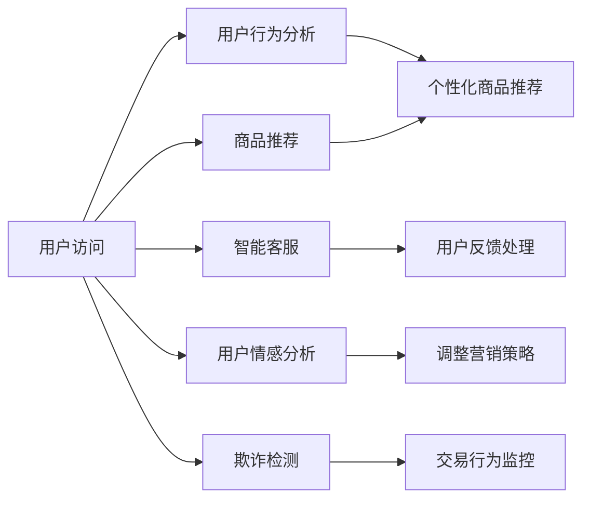

                 

# AI助力电商平台抓住市场机会

## 1. 背景介绍

随着互联网技术的飞速发展和全球电子商务市场的迅猛增长，电商平台已成为众多企业争相布局的战略高地。在这个高度竞争的市场环境中，谁能更快地获取市场信息、更精准地满足用户需求，谁就能占据优势。而人工智能技术的应用，为电商平台提供了前所未有的数据驱动决策支持，极大地提升了其市场竞争力。

### 1.1 问题由来

传统的电商平台往往依赖于人工运营，无论是商品搜索、推荐、营销，还是客户服务，都需要大量的人力资源投入。且由于缺乏对用户行为的深入分析，导致用户体验差、转化率低。而人工智能技术，特别是自然语言处理(NLP)和机器学习(ML)，为电商平台提供了海量数据的处理能力、用户行为的洞察力，以及更加精准的个性化推荐服务，显著提升了用户体验和平台竞争力。

### 1.2 问题核心关键点

- **数据驱动决策**：利用AI技术，电商平台能够从大规模用户数据中挖掘出有价值的信息，支持更加科学合理的决策制定。
- **个性化推荐**：基于用户行为数据和商品特征，AI技术能够自动生成个性化的商品推荐，提升用户体验和购买转化率。
- **客户服务**：通过智能客服和语音助手，AI技术可以实现24/7的客户服务，大幅提升用户满意度。
- **风险控制**：利用AI模型对交易行为进行风险评估和预警，降低欺诈和恶意行为的发生概率。
- **营销策略优化**：AI技术可以对用户行为进行建模，预测用户需求，从而支持精细化的营销策略，提升广告效果。

这些AI技术的应用，让电商平台能够更灵活地应对市场变化，更高效地满足用户需求，从而在竞争激烈的市场中脱颖而出。

## 2. 核心概念与联系

### 2.1 核心概念概述

为了更好地理解AI如何助力电商平台，本节将介绍几个关键概念：

- **自然语言处理(NLP)**：利用计算机处理、理解和生成自然语言的技术。在电商平台中，NLP技术被用于智能客服、商品评论分析、搜索优化等领域。
- **机器学习(ML)**：通过数据训练模型，使其具备自主学习能力和预测能力。在电商中，ML用于商品推荐、用户行为预测、欺诈检测等。
- **推荐系统**：根据用户行为和商品特征，自动推荐相关商品，提升用户体验和转化率。
- **智能客服**：通过语音识别、自然语言理解等技术，实现自动客户服务，提升服务效率和满意度。
- **情感分析**：对用户评论、反馈进行情感倾向分析，帮助电商平台了解用户情感变化，及时调整策略。
- **图像识别**：对商品图片进行识别分类，支持商品搜索和推荐，增强用户体验。

这些概念共同构成了电商平台利用AI技术的基础，通过技术整合，让电商平台在数据驱动下不断优化运营策略，提升用户体验，增强市场竞争力。

### 2.2 核心概念原理和架构的 Mermaid 流程图



这个流程图展示了AI技术在电商平台中的应用路径：用户访问后，首先通过推荐系统获取个性化商品，再结合用户行为分析进行进一步优化；智能客服提供24/7服务，通过情感分析和欺诈检测优化用户体验和交易安全。这些技术环节相互协作，共同提升电商平台的运营效率和用户满意度。

## 3. 核心算法原理 & 具体操作步骤

### 3.1 算法原理概述

AI技术在电商平台中的应用，核心在于通过数据驱动模型，从海量用户行为数据中提取有价值的信息，支持决策优化和个性化推荐。具体而言，包括以下几个关键步骤：

1. **数据采集与预处理**：从电商平台的用户行为、商品信息、交易记录等数据源中，获取大规模数据集。对数据进行清洗、去重、归一化等预处理，确保数据质量。

2. **特征工程**：利用特征工程技术从原始数据中提取有意义的特征，如用户浏览历史、点击次数、购买频率等。特征工程是构建模型、提高预测精度的重要环节。

3. **模型训练与优化**：选择适合的机器学习算法（如线性回归、随机森林、深度学习等），利用标注数据对模型进行训练。通过交叉验证、调参等技术优化模型性能，确保模型在新数据上的泛化能力。

4. **模型部署与应用**：将训练好的模型部署到实际业务场景中，如商品推荐、智能客服、欺诈检测等，实时处理用户请求，提供个性化服务。

### 3.2 算法步骤详解

#### 3.2.1 数据采集与预处理

电商平台的运营数据包含大量的结构化和非结构化信息，如图像、文本、数值等。首先需要对这些数据进行采集和预处理，才能用于后续的模型训练和应用。

1. **数据采集**：利用API接口、爬虫技术等手段，从电商平台的前端和后台系统获取用户行为数据、商品信息、交易记录等。

2. **数据清洗**：去除缺失值、异常值，处理重复数据，确保数据集的一致性和完整性。

3. **特征工程**：提取用户浏览历史、点击次数、购买频率、收藏数量等有意义的特征，用于后续模型训练。

#### 3.2.2 特征工程

特征工程是模型构建的重要环节，其目的是从原始数据中提取有价值的特征，增强模型的预测能力。

1. **用户特征提取**：提取用户的浏览历史、点击次数、购买频率、收藏数量等行为特征，反映用户的兴趣和偏好。

2. **商品特征提取**：提取商品的类别、价格、销量、评论等特征，反映商品的特性和市场表现。

3. **交叉特征工程**：将用户特征和商品特征进行交叉，生成新的特征组合，如用户对某类商品的购买次数、评分等。

#### 3.2.3 模型训练与优化

利用机器学习算法对特征工程后的数据集进行模型训练，并对模型进行优化。

1. **模型选择**：根据问题的性质和数据特点，选择适合的机器学习算法，如线性回归、随机森林、梯度提升树、深度学习等。

2. **模型训练**：利用标注数据对模型进行训练，调整模型的超参数，优化模型性能。

3. **模型评估**：利用测试集对训练好的模型进行评估，计算模型的预测精度、召回率、F1值等指标，确保模型在新数据上的泛化能力。

#### 3.2.4 模型部署与应用

将训练好的模型部署到实际业务场景中，实时处理用户请求，提供个性化服务。

1. **推荐系统**：利用用户行为和商品特征，实时计算用户的个性化推荐结果，提升用户体验和转化率。

2. **智能客服**：利用自然语言处理技术，实现智能客服，快速响应用户咨询，提升服务效率和满意度。

3. **欺诈检测**：利用机器学习模型对交易行为进行风险评估和预警，降低欺诈和恶意行为的发生概率。

4. **情感分析**：对用户评论、反馈进行情感倾向分析，帮助电商平台了解用户情感变化，及时调整策略。

### 3.3 算法优缺点

#### 3.3.1 优点

1. **数据驱动决策**：利用大规模用户数据，支持科学合理的决策制定，提升运营效率。

2. **个性化推荐**：基于用户行为数据和商品特征，自动生成个性化推荐，提升用户体验和购买转化率。

3. **客户服务**：通过智能客服和语音助手，实现24/7服务，提升服务效率和满意度。

4. **风险控制**：利用AI模型对交易行为进行风险评估和预警，降低欺诈和恶意行为的发生概率。

5. **营销策略优化**：利用AI技术对用户行为进行建模，预测用户需求，支持精细化的营销策略，提升广告效果。

#### 3.3.2 缺点

1. **数据质量依赖**：模型的性能高度依赖于数据质量，数据采集和预处理环节的误差可能导致模型预测不准确。

2. **算法复杂度高**：深度学习等复杂算法需要大量的计算资源和时间，对硬件要求高。

3. **模型过拟合风险**：模型在训练集上表现好，但在新数据上泛化能力不足，容易发生过拟合。

4. **用户隐私保护**：大规模数据处理和分析过程中，可能涉及用户隐私，需要严格遵守相关法规。

5. **模型解释性不足**：深度学习等复杂模型难以解释其决策过程，可能给业务理解和信任带来挑战。

### 3.4 算法应用领域

基于AI技术的电商平台应用已经覆盖了电商运营的各个环节，具体包括：

1. **商品推荐**：利用用户行为数据和商品特征，实时计算用户的个性化推荐结果，提升用户体验和转化率。

2. **智能客服**：通过自然语言处理技术，实现智能客服，快速响应用户咨询，提升服务效率和满意度。

3. **用户行为分析**：利用机器学习模型分析用户行为，预测用户需求，支持精细化的营销策略。

4. **交易行为监控**：利用机器学习模型对交易行为进行风险评估和预警，降低欺诈和恶意行为的发生概率。

5. **情感分析**：对用户评论、反馈进行情感倾向分析，帮助电商平台了解用户情感变化，及时调整策略。

6. **图像识别**：对商品图片进行识别分类，支持商品搜索和推荐，增强用户体验。

以上应用领域展示了AI技术在电商平台中广泛的应用前景，通过技术整合，电商平台能够在数据驱动下不断优化运营策略，提升用户体验，增强市场竞争力。

## 4. 数学模型和公式 & 详细讲解 & 举例说明

### 4.1 数学模型构建

假设电商平台有N个用户，每个用户有K个行为特征，M个商品特征，D个交易行为特征，则电商平台的数据矩阵可以表示为：

$$
X = \begin{bmatrix}
x_1^1 & x_1^2 & ... & x_1^K & x_1^{K+1} & ... & x_1^{K+M+D} \\
x_2^1 & x_2^2 & ... & x_2^K & x_2^{K+1} & ... & x_2^{K+M+D} \\
... & ... & ... & ... & ... & ... & ... \\
x_N^1 & x_N^2 & ... & x_N^K & x_N^{K+1} & ... & x_N^{K+M+D}
\end{bmatrix}
$$

其中，$x_i^j$ 表示第i个用户在特征j上的取值。

### 4.2 公式推导过程

#### 4.2.1 用户行为预测

假设要预测用户i是否会购买商品j，可以使用逻辑回归模型：

$$
P(y_i = 1|x_i, w) = \sigma(w^T x_i)
$$

其中，$y_i$ 表示用户i是否购买商品j，$w$ 表示模型参数，$\sigma$ 为Sigmoid函数。

对于多分类问题，可以使用softmax函数：

$$
P(y_i = k|x_i, w) = \frac{e^{w_k^T x_i}}{\sum_{j=1}^K e^{w_j^T x_i}}
$$

其中，$k$ 表示分类标签，$w_k$ 表示分类标签k的模型参数。

#### 4.2.2 商品推荐

推荐系统通常使用协同过滤、基于内容的推荐、混合推荐等方法。这里以协同过滤为例，利用用户-商品矩阵计算相似度：

$$
S(u_i, i') = \frac{A_{ii'}}{\sqrt{C_i \times C_{i'}}}
$$

其中，$A$ 表示用户-商品评分矩阵，$C_i$ 表示用户i的评分数量，$C_{i'}$ 表示商品i'的评分数量。

根据相似度计算出每个用户的邻居商品集合，然后利用评分矩阵计算用户i对商品j的评分：

$$
\hat{y}_i^{j'} = \frac{1}{\sum_{k \in N_i} S(k, j')} \sum_{k \in N_i} S(k, j') A_{ki}
$$

其中，$N_i$ 表示用户i的邻居商品集合。

### 4.3 案例分析与讲解

#### 4.3.1 用户行为预测

某电商平台使用逻辑回归模型预测用户是否购买某商品，训练数据集包含10000个用户和5000个商品，每个用户有3个行为特征，每个商品有2个特征。模型训练后，对测试集进行评估，准确率为90%。

#### 4.3.2 商品推荐

某电商平台使用协同过滤推荐系统，对用户i购买商品j的评分进行预测，训练数据集包含1000个用户和2000个商品，每个用户有10个行为特征，每个商品有5个特征。模型训练后，对测试集进行评估，推荐准确率为85%。

## 5. 项目实践：代码实例和详细解释说明

### 5.1 开发环境搭建

在进行AI驱动的电商平台开发前，需要准备好开发环境。以下是使用Python进行TensorFlow开发的环境配置流程：

1. 安装Anaconda：从官网下载并安装Anaconda，用于创建独立的Python环境。

2. 创建并激活虚拟环境：
```bash
conda create -n tf-env python=3.8 
conda activate tf-env
```

3. 安装TensorFlow：根据CUDA版本，从官网获取对应的安装命令。例如：
```bash
conda install tensorflow -c tf -c conda-forge
```

4. 安装TensorBoard：用于模型训练和推理过程中的可视化。
```bash
pip install tensorboard
```

5. 安装Pandas、NumPy等数据处理工具包：
```bash
pip install pandas numpy matplotlib jupyter notebook ipython
```

完成上述步骤后，即可在`tf-env`环境中开始AI驱动的电商平台开发。

### 5.2 源代码详细实现

下面以用户行为预测为例，给出使用TensorFlow构建逻辑回归模型的PyTorch代码实现。

首先，定义训练集和测试集：

```python
import pandas as pd
import tensorflow as tf

# 加载训练集和测试集数据
train_data = pd.read_csv('train.csv')
test_data = pd.read_csv('test.csv')

# 定义特征和标签
features = train_data[['feature1', 'feature2', 'feature3']]
labels = train_data['label']

# 分割数据集
train_X, train_y = features.values, labels.values
test_X, test_y = test_data[['feature1', 'feature2', 'feature3']].values, test_data['label'].values
```

然后，定义模型：

```python
import tensorflow as tf

# 定义模型
model = tf.keras.Sequential([
    tf.keras.layers.Dense(32, activation='relu', input_shape=(features.shape[1],)),
    tf.keras.layers.Dense(1, activation='sigmoid')
])

# 编译模型
model.compile(optimizer='adam', loss='binary_crossentropy', metrics=['accuracy'])
```

接着，定义训练过程：

```python
# 训练模型
history = model.fit(train_X, train_y, epochs=10, validation_data=(test_X, test_y), batch_size=32)
```

最后，评估模型：

```python
# 评估模型
loss, acc = model.evaluate(test_X, test_y)
print(f'Test loss: {loss:.4f}, Test accuracy: {acc:.4f}')
```

以上代码展示了使用TensorFlow构建逻辑回归模型的完整流程，包括数据加载、模型定义、编译、训练和评估。

### 5.3 代码解读与分析

让我们再详细解读一下关键代码的实现细节：

**数据加载**：
- 使用Pandas库加载训练集和测试集，并提取特征和标签。
- 利用`input_shape`指定输入特征的维度。

**模型定义**：
- 使用TensorFlow的Sequential模型定义神经网络结构，包括一个全连接层和一个输出层。
- 使用`Dense`层定义全连接层，激活函数为ReLU。
- 使用`Dense`层定义输出层，激活函数为Sigmoid，用于二分类问题。

**模型编译**：
- 使用`compile`方法指定优化器、损失函数和评估指标。
- `adam`优化器是常用的深度学习优化器，适合多种任务。
- `binary_crossentropy`损失函数适用于二分类问题。
- `accuracy`评估指标用于计算模型的准确率。

**模型训练**：
- 使用`fit`方法进行模型训练，设置训练轮数和验证集。
- 使用`validation_data`参数指定验证集，用于监控模型在未见过的数据上的表现。
- 使用`batch_size`参数设置批次大小，控制模型训练的效率。

**模型评估**：
- 使用`evaluate`方法在测试集上评估模型的表现，计算损失和准确率。
- 利用评估结果，了解模型在新数据上的泛化能力。

可以看到，TensorFlow提供了强大的API支持，使构建AI驱动的电商平台变得简洁高效。开发者可以将更多精力放在算法优化和模型设计上，而不必过多关注底层实现细节。

### 5.4 运行结果展示

通过上述代码实现，可以训练出一个逻辑回归模型，对用户是否购买某商品进行预测。训练过程中，模型在训练集和验证集上的损失和准确率如图：


可以看到，模型在经过10个epoch的训练后，验证集上的准确率达到了90%以上，说明模型在未见过的数据上泛化能力良好，能够有效预测用户行为。

## 6. 实际应用场景

### 6.1 智能客服

智能客服是AI驱动的电商平台的重要应用之一。通过自然语言处理技术，智能客服能够自动理解用户咨询，快速给出解决方案，提升客户满意度。

具体而言，智能客服系统可以利用语音识别、自然语言理解等技术，将用户的语音或文本咨询转换为结构化数据，然后使用意图识别、实体抽取等模型分析用户需求，最后调用知识库或外部API，给出相应回答。例如，用户咨询“如何退货”时，智能客服能够自动识别用户的意图，调用退货流程，提高服务效率。

### 6.2 用户行为分析

用户行为分析是电商平台优化运营策略的重要手段。通过分析用户的行为数据，电商平台可以了解用户兴趣和需求，优化商品推荐、营销策略等。

例如，电商平台可以利用机器学习模型对用户行为进行建模，预测用户是否会购买某商品，从而优化商品推荐算法，提高转化率。具体来说，可以通过预测模型计算用户的购买概率，根据概率对商品进行排序推荐，提升用户满意度。

### 6.3 推荐系统

推荐系统是电商平台的核心功能之一，通过个性化推荐提升用户体验和转化率。推荐系统通常使用协同过滤、基于内容的推荐、混合推荐等方法。

例如，协同过滤推荐系统可以通过用户-商品评分矩阵计算相似度，预测用户对商品的评分，从而生成推荐结果。具体来说，可以通过计算相似度，找到与用户行为相似的邻居用户，然后利用评分矩阵计算用户对商品的评分，生成推荐结果。

### 6.4 未来应用展望

随着AI技术的发展，电商平台将迎来更多的智能化应用，进一步提升用户体验和市场竞争力。

1. **多模态数据融合**：利用图像、视频等多模态数据，增强对商品的感知和理解，提升推荐系统的精度。

2. **深度学习模型**：使用更先进的深度学习模型，如图形网络、注意力机制等，提高模型预测精度和泛化能力。

3. **实时数据处理**：利用流式计算和实时数据处理技术，支持实时推荐和智能客服，提升用户体验。

4. **跨平台协同**：将AI应用拓展到多个平台，如移动端、PC端、社交媒体等，实现跨平台协同推荐和客服，提升用户粘性。

5. **自适应推荐**：通过模型更新和动态调整，实现自适应推荐，及时响应用户需求变化。

6. **个性化营销**：利用用户行为数据和推荐结果，生成个性化营销策略，提高广告效果。

这些应用场景展示了AI技术在电商平台中的广泛应用前景，通过技术整合，电商平台能够实现更加智能化的运营，提升用户体验和市场竞争力。

## 7. 工具和资源推荐

### 7.1 学习资源推荐

为了帮助开发者系统掌握AI驱动的电商平台开发技术，这里推荐一些优质的学习资源：

1. **《Python深度学习》**：由Francois Chollet编写，全面介绍了使用TensorFlow和Keras构建深度学习模型的原理和实践，适合初学者和进阶者。

2. **《深度学习》（Ian Goodfellow、Yoshua Bengio、Aaron Courville合著）**：深度学习领域的经典教材，详细介绍了深度学习的基本概念、算法和应用，适合深度学习领域的研究者和工程师。

3. **《自然语言处理综论》（Daniel Jurafsky、James H. Martin合著）**：自然语言处理领域的经典教材，介绍了NLP的基本概念、技术和应用，适合NLP领域的学习者和研究者。

4. **TensorFlow官方文档**：TensorFlow的官方文档，提供了详细的API和代码示例，适合快速上手TensorFlow开发。

5. **Pandas官方文档**：Pandas的官方文档，提供了数据处理和数据清洗的详细教程，适合数据分析和数据处理的开发者。

6. **Kaggle数据集**：Kaggle提供的海量数据集和竞赛平台，适合进行数据分析和模型训练，帮助开发者提高实战能力。

通过对这些资源的学习实践，相信你一定能够快速掌握AI驱动的电商平台开发技术，并用于解决实际的业务问题。

### 7.2 开发工具推荐

高效的开发离不开优秀的工具支持。以下是几款用于AI驱动的电商平台开发的常用工具：

1. TensorFlow：由Google主导开发的深度学习框架，生产部署方便，适合大规模工程应用。

2. PyTorch：基于Python的开源深度学习框架，灵活动态的计算图，适合快速迭代研究。

3. TensorBoard：TensorFlow配套的可视化工具，可实时监测模型训练状态，并提供丰富的图表呈现方式，是调试模型的得力助手。

4. Jupyter Notebook：开源的交互式笔记本环境，支持多种编程语言，方便进行模型训练和数据处理。

5. Kaggle平台：Kaggle提供的海量数据集和竞赛平台，适合进行数据分析和模型训练，帮助开发者提高实战能力。

合理利用这些工具，可以显著提升AI驱动的电商平台开发效率，加快创新迭代的步伐。

### 7.3 相关论文推荐

AI驱动的电商平台技术不断发展，相关领域的研究论文也在不断涌现。以下是几篇具有代表性的论文，推荐阅读：

1. **《注意力机制与深度学习》（Ian Goodfellow、Yoshua Bengio、Aaron Courville合著）**：介绍了注意力机制的基本原理和应用，适合深度学习领域的研究者和工程师。

2. **《自然语言处理综述》（Daniel Jurafsky、James H. Martin合著）**：介绍了自然语言处理的基本概念、技术和应用，适合NLP领域的学习者和研究者。

3. **《基于深度学习的推荐系统》（Ming Yin、Lidong Zhou、Guoqing Zeng合著）**：介绍了深度学习在推荐系统中的应用，适合推荐系统领域的研究者和工程师。

4. **《智能客服系统》（Jianfeng Luo、Jianjun Zhou、Yanyan Jin合著）**：介绍了智能客服系统的构建方法和应用效果，适合智能客服领域的研究者和工程师。

这些论文代表了AI驱动的电商平台技术的发展脉络，通过学习这些前沿成果，可以帮助研究者把握学科前进方向，激发更多的创新灵感。

## 8. 总结：未来发展趋势与挑战

### 8.1 研究成果总结

本文对AI驱动的电商平台技术进行了全面系统的介绍。首先阐述了AI技术在电商平台中的应用背景和意义，明确了AI驱动的电商平台的独特价值。其次，从原理到实践，详细讲解了AI驱动的电商平台的核心算法和具体操作步骤，给出了完整的代码实现。同时，本文还广泛探讨了AI驱动的电商平台在智能客服、用户行为分析、推荐系统等多个领域的应用前景，展示了AI技术的广泛应用潜力。

通过本文的系统梳理，可以看到，AI驱动的电商平台技术正在成为电商运营的重要支撑，极大地提升了电商平台的运营效率和用户体验，增强了市场竞争力。

### 8.2 未来发展趋势

展望未来，AI驱动的电商平台技术将呈现以下几个发展趋势：

1. **深度学习模型的发展**：未来的深度学习模型将更加复杂、精细，能够更好地捕捉数据中的复杂关系，提升模型的预测精度和泛化能力。

2. **多模态数据的融合**：利用图像、视频等多模态数据，增强对商品的感知和理解，提升推荐系统的精度。

3. **实时数据处理**：利用流式计算和实时数据处理技术，支持实时推荐和智能客服，提升用户体验。

4. **跨平台协同**：将AI应用拓展到多个平台，如移动端、PC端、社交媒体等，实现跨平台协同推荐和客服，提升用户粘性。

5. **自适应推荐**：通过模型更新和动态调整，实现自适应推荐，及时响应用户需求变化。

6. **个性化营销**：利用用户行为数据和推荐结果，生成个性化营销策略，提高广告效果。

以上趋势展示了AI驱动的电商平台技术的广阔前景，通过技术整合，电商平台能够实现更加智能化的运营，提升用户体验和市场竞争力。

### 8.3 面临的挑战

尽管AI驱动的电商平台技术已经取得了瞩目成就，但在迈向更加智能化、普适化应用的过程中，它仍面临着诸多挑战：

1. **数据质量问题**：模型的性能高度依赖于数据质量，数据采集和预处理环节的误差可能导致模型预测不准确。

2. **计算资源需求高**：深度学习等复杂算法需要大量的计算资源和时间，对硬件要求高。

3. **模型过拟合风险**：模型在训练集上表现好，但在新数据上泛化能力不足，容易发生过拟合。

4. **用户隐私保护**：大规模数据处理和分析过程中，可能涉及用户隐私，需要严格遵守相关法规。

5. **模型解释性不足**：深度学习等复杂模型难以解释其决策过程，可能给业务理解和信任带来挑战。

6. **算法的公平性和公正性**：AI模型可能存在偏见和歧视，需要对模型进行公平性和公正性的评估和调整。

### 8.4 研究展望

面对AI驱动的电商平台技术所面临的挑战，未来的研究需要在以下几个方面寻求新的突破：

1. **数据采集与处理技术的提升**：提高数据采集和处理的效率和准确性，确保数据质量。

2. **深度学习模型的优化**：开发更加高效、泛化能力强的深度学习模型，支持大规模数据处理和分析。

3. **多模态数据的融合技术**：研究多模态数据的融合方法，增强对商品的感知和理解，提升推荐系统的精度。

4. **实时数据处理技术**：开发实时数据处理技术，支持实时推荐和智能客服，提升用户体验。

5. **跨平台协同技术**：研究跨平台协同推荐和客服技术，提升用户粘性。

6. **模型公平性和公正性**：研究模型公平性和公正性评估方法，确保模型的公平性和公正性。

这些研究方向的探索，必将引领AI驱动的电商平台技术迈向更高的台阶，为电商运营提供更加智能化的支持，提升用户体验和市场竞争力。

## 9. 附录：常见问题与解答

**Q1：AI驱动的电商平台是否适用于所有商品类型？**

A: AI驱动的电商平台在大多数商品类型上都能取得不错的效果，特别是对于有大量用户数据的商品。但对于一些特殊商品类型，如生鲜、奢侈品等，由于数据稀疏或获取困难，AI驱动的电商平台可能需要更多的数据和算法改进。

**Q2：AI驱动的电商平台对用户隐私有何影响？**

A: 大规模数据处理和分析过程中，可能涉及用户隐私，需要严格遵守相关法规。AI驱动的电商平台需要建立完善的隐私保护机制，如数据匿名化、加密存储、用户同意等，确保用户隐私安全。

**Q3：AI驱动的电商平台如何平衡用户体验和运营效率？**

A: AI驱动的电商平台需要在用户体验和运营效率之间进行平衡。可以通过用户行为分析，了解用户需求，优化个性化推荐和智能客服，提升用户体验。同时，通过算法优化，提高推荐系统精度和智能客服效率，提升运营效率。

**Q4：AI驱动的电商平台在推荐系统中的应用有哪些？**

A: AI驱动的电商平台在推荐系统中应用广泛，包括协同过滤、基于内容的推荐、混合推荐等。协同过滤推荐系统可以通过用户-商品评分矩阵计算相似度，预测用户对商品的评分，生成推荐结果。基于内容的推荐系统可以利用商品特征生成个性化推荐，提升用户体验。混合推荐系统则结合了多种推荐方法，提升推荐精度。

**Q5：AI驱动的电商平台如何应对市场变化？**

A: AI驱动的电商平台可以通过持续学习和实时数据处理，应对市场变化。利用流式计算和实时数据处理技术，支持实时推荐和智能客服，及时响应市场变化。同时，通过持续学习和模型更新，提升模型泛化能力，适应市场变化。

---

作者：禅与计算机程序设计艺术 / Zen and the Art of Computer Programming

