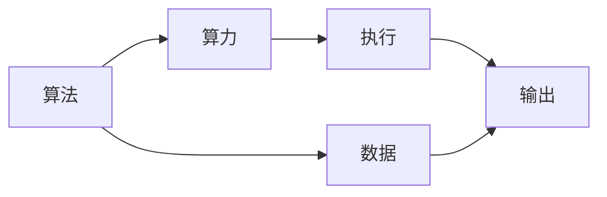

                 

# AI发展的三大动力源：算法、算力与数据

## 1. 背景介绍

### 1.1 问题由来
人工智能(AI)自诞生以来，始终围绕算法、算力与数据这三大核心要素展开。算法、算力与数据相互促进、相辅相成，共同驱动了AI技术从理论到应用、从实验室到产业的跨越式发展。然而，在AI发展的不同阶段，这三大要素的作用权重存在明显差异，影响了AI研究与应用的侧重点。本文旨在系统阐述算法、算力与数据在AI发展中的关键作用及其相互关系，为未来的AI技术探索与产业化应用提供参考。

### 1.2 问题核心关键点
- **算法**：人工智能的核心，决定了模型能否准确有效地处理和分析数据。
- **算力**：硬件基础，决定了算法能否快速高效地执行。
- **数据**：信息源泉，决定了算法的训练效果和模型的泛化能力。

## 2. 核心概念与联系

### 2.1 核心概念概述

在探讨算法、算力与数据的关系之前，首先需要明确它们各自的定义和作用：

- **算法**：算法是解决问题的规则和步骤。在AI中，算法主要指用于数据处理、模式识别、决策制定等的计算方法。常见的算法包括深度学习、强化学习、优化算法等。

- **算力**：算力是计算机硬件和软件的综合表现。算力越强，处理大规模数据和复杂算法的能力越强。主要衡量指标包括CPU、GPU、TPU等的计算能力。

- **数据**：数据是AI的基础，提供了模型的训练样本和知识源泉。数据的质量和多样性直接影响模型的性能。

### 2.2 核心概念原理和架构的 Mermaid 流程图



这个流程图展示了算法、算力与数据之间的关系：算法依赖于算力和数据，通过算力的执行得到输出结果；同时，算力也需要数据来支撑算法的运行。

## 3. 核心算法原理 & 具体操作步骤

### 3.1 算法原理概述

算法是AI发展的核心驱动力。从最初的决策树、支持向量机，到后来的深度学习、强化学习等，不同的算法对应着不同的问题域。本文重点介绍深度学习算法及其应用。

**深度学习算法原理**：
- **神经网络**：由多个神经元组成的计算图，通过反向传播算法不断调整权重，优化模型的预测能力。
- **卷积神经网络(CNN)**：主要用于图像处理，通过卷积层提取特征，池化层降维，全连接层分类。
- **循环神经网络(RNN)**：主要用于序列数据处理，通过循环结构记忆历史信息。
- **生成对抗网络(GAN)**：由生成器和判别器组成的对抗结构，用于生成新的数据样本。

### 3.2 算法步骤详解

深度学习算法一般分为以下几个步骤：

1. **数据预处理**：将原始数据转换为算法可以处理的格式，如标准化、归一化、数据增强等。
2. **模型构建**：根据问题类型选择合适的深度学习模型结构。
3. **模型训练**：使用标注数据对模型进行训练，通过反向传播更新权重。
4. **模型评估**：使用测试数据集评估模型性能，调整模型参数。
5. **模型应用**：将训练好的模型应用于实际问题中，进行预测或决策。

### 3.3 算法优缺点

**深度学习算法的优点**：
- **处理复杂数据**：深度学习算法可以处理图像、语音、文本等多种数据类型。
- **自动特征提取**：无需手动设计特征，通过网络自动学习特征。
- **泛化能力强**：通过大量数据训练，深度学习模型具有较强的泛化能力。

**深度学习算法的缺点**：
- **数据需求高**：深度学习需要大量标注数据，数据收集和标注成本高。
- **计算资源消耗大**：深度学习模型参数多，计算复杂度高，需要强大的算力支持。
- **模型黑盒**：深度学习模型复杂，难以解释其内部工作机制。

### 3.4 算法应用领域

深度学习算法广泛应用于计算机视觉、自然语言处理、语音识别、推荐系统等领域：

- **计算机视觉**：图像分类、目标检测、图像生成等任务。
- **自然语言处理**：机器翻译、情感分析、问答系统等任务。
- **语音识别**：语音转文本、语音合成等任务。
- **推荐系统**：个性化推荐、广告推荐等任务。

## 4. 数学模型和公式 & 详细讲解 & 举例说明

### 4.1 数学模型构建

深度学习模型的数学模型通常由多个神经元组成，每个神经元接收多个输入，通过加权求和和激活函数进行计算。以全连接神经网络为例，其数学模型可表示为：

$$y = \sigma(Wx + b)$$

其中，$W$为权重矩阵，$x$为输入向量，$b$为偏置向量，$\sigma$为激活函数。

### 4.2 公式推导过程

以多层感知器(Multilayer Perceptron, MLP)为例，推导其前向传播和反向传播公式。

- **前向传播**：

$$y^{(l)} = \sigma(W^{(l)}x^{(l-1)} + b^{(l)})$$

其中，$x^{(l)}$为第$l$层的输入，$y^{(l)}$为第$l$层的输出。

- **反向传播**：

$$\Delta^{(l)} = \nabla_{W^{(l)}}J \cdot (\sigma'(W^{(l)}x^{(l-1)} + b^{(l)})\nabla_{x^{(l-1)}}J$$

其中，$J$为损失函数，$\Delta^{(l)}$为第$l$层的梯度，$\nabla_{W^{(l)}}J$为权重梯度，$\nabla_{x^{(l-1)}}J$为输入梯度。

### 4.3 案例分析与讲解

以图像分类任务为例，介绍如何构建和训练卷积神经网络(CNN)。

1. **数据预处理**：将图像数据标准化为0-1之间的值，并进行归一化。
2. **模型构建**：使用Conv2D层提取特征，MaxPool2D层降维，Flatten层将特征向量展开，全连接层进行分类。
3. **模型训练**：使用交叉熵损失函数和Adam优化器进行训练，设置合适的学习率和批大小。
4. **模型评估**：在测试集上评估模型准确率和损失，进行调参。
5. **模型应用**：将训练好的模型应用于新的图像数据，进行分类预测。

## 5. 项目实践：代码实例和详细解释说明

### 5.1 开发环境搭建

在使用TensorFlow构建CNN进行图像分类时，需要以下环境配置：

1. 安装Anaconda，并创建新的虚拟环境。
2. 安装TensorFlow和相关依赖库。
3. 安装Keras或TensorFlow的高层API，方便快速构建模型。

### 5.2 源代码详细实现

以下是一个简单的CNN图像分类模型代码实现：

```python
import tensorflow as tf
from tensorflow.keras import layers

# 定义模型
model = tf.keras.Sequential([
    layers.Conv2D(32, (3, 3), activation='relu', input_shape=(28, 28, 1)),
    layers.MaxPooling2D((2, 2)),
    layers.Flatten(),
    layers.Dense(64, activation='relu'),
    layers.Dense(10, activation='softmax')
])

# 编译模型
model.compile(optimizer='adam', loss='sparse_categorical_crossentropy', metrics=['accuracy'])

# 训练模型
model.fit(train_images, train_labels, epochs=10, validation_data=(test_images, test_labels))

# 评估模型
model.evaluate(test_images, test_labels)
```

### 5.3 代码解读与分析

上述代码中，我们首先定义了一个包含卷积层、池化层、全连接层的CNN模型。然后使用Adam优化器和交叉熵损失函数编译模型，并使用训练数据进行训练。最后，在测试集上评估模型性能。

**卷积层**：使用3x3的卷积核进行特征提取，激活函数为ReLU。
**池化层**：使用2x2的最大池化层进行特征降维。
**全连接层**：包含64个神经元的全连接层，激活函数为ReLU。
**输出层**：包含10个神经元的输出层，激活函数为Softmax，用于10类分类的概率分布。

## 6. 实际应用场景

### 6.1 计算机视觉

计算机视觉领域，深度学习算法广泛应用于图像分类、目标检测、人脸识别等任务。例如，YOLO算法在目标检测任务中取得了优异性能，ResNet算法在图像分类任务中提升了模型深度。

### 6.2 自然语言处理

自然语言处理领域，深度学习算法主要用于机器翻译、情感分析、问答系统等任务。例如，BERT算法在语言理解任务中表现卓越，GPT算法在文本生成任务中取得了突破性成果。

### 6.3 语音识别

语音识别领域，深度学习算法主要用于语音转文本、语音合成等任务。例如，基于CNN和LSTM的声学模型在语音识别任务中表现出色，Tacotron 2算法在语音合成任务中取得了重大进展。

### 6.4 推荐系统

推荐系统领域，深度学习算法主要用于个性化推荐、广告推荐等任务。例如，基于协同过滤和深度学习的推荐系统在电商、新闻、视频等领域得到了广泛应用。

## 7. 工具和资源推荐

### 7.1 学习资源推荐

- **TensorFlow官方文档**：提供了TensorFlow的全面介绍和教程，是学习深度学习算法的重要资源。
- **PyTorch官方文档**：提供了PyTorch的全面介绍和教程，支持GPU加速，适合深度学习研究和实践。
- **深度学习入门教程**：《深度学习》（Ian Goodfellow著）是一本经典教材，系统介绍了深度学习算法和实践。

### 7.2 开发工具推荐

- **TensorFlow**：由Google开发的深度学习框架，支持GPU加速，适合大规模深度学习任务。
- **PyTorch**：由Facebook开发的深度学习框架，支持动态图和GPU加速，适合研究与实验。
- **Jupyter Notebook**：一个交互式的开发环境，支持Python代码和数学公式的混合编写和展示。

### 7.3 相关论文推荐

- **《Deep Learning》（Ian Goodfellow, Yoshua Bengio, Aaron Courville著）**：介绍了深度学习的基本原理和最新进展。
- **《Neural Networks and Deep Learning》（Michael Nielsen著）**：讲解了神经网络和深度学习的核心概念和实现。
- **《Convolutional Neural Networks for Visual Recognition》（Fei-Fei Li, Justin Johnson, Sergei Jurie著）**：介绍了卷积神经网络的理论和实践。

## 8. 总结：未来发展趋势与挑战

### 8.1 研究成果总结

算法、算力与数据是AI发展的三大核心要素。算法决定了模型能否处理特定问题，算力提供了计算能力，数据提供了模型的训练样本和知识源泉。这三大要素相互促进，共同推动了AI技术的进步。

### 8.2 未来发展趋势

未来AI的发展将更加注重算力与数据的协同提升。随着算力资源的持续增长，如GPU、TPU等，AI算法将能够处理更大规模、更复杂的数据，提升模型的性能和泛化能力。同时，数据的获取与处理将更加自动化和智能化，降低数据标注成本，提升数据质量和多样性。

### 8.3 面临的挑战

尽管AI技术取得了显著进展，但仍面临诸多挑战：

- **数据隐私与安全**：大规模数据收集和处理带来了隐私和安全性问题。如何保护用户数据隐私，防止数据泄露，是未来AI应用的重要挑战。
- **模型可解释性**：深度学习模型的复杂性使其难以解释其内部工作机制。如何提高模型的可解释性，增强用户信任，是未来AI发展的重要方向。
- **跨领域应用**：现有AI技术更多聚焦于特定领域，如何实现跨领域的知识迁移和应用，提升AI技术的通用性，是一个重要挑战。
- **资源消耗**：深度学习算法和模型对计算资源和存储资源的需求高，如何优化算法和模型结构，降低资源消耗，是未来AI研究的重要课题。

### 8.4 研究展望

未来AI研究需要在以下几个方面进行突破：

- **多模态学习**：将视觉、语音、文本等多种模态数据进行协同学习，提升模型的多模态处理能力。
- **自监督学习**：利用未标注数据进行自监督学习，减少对标注数据的依赖。
- **强化学习**：结合强化学习，使AI系统能够进行自主探索和决策，提升系统的自主性。
- **跨领域知识图谱**：构建跨领域的知识图谱，促进不同领域知识的迁移和应用。
- **联邦学习**：通过联邦学习，在保护数据隐私的前提下，实现数据分布式协同训练。

这些研究方向的探索将进一步推动AI技术的发展，解决现有难题，开拓新的应用场景。

## 9. 附录：常见问题与解答

**Q1：深度学习算法和传统机器学习算法有哪些区别？**

A: 深度学习算法和传统机器学习算法的主要区别在于处理复杂数据和结构化数据的能力。深度学习算法能够处理非结构化数据（如图像、语音、文本），并通过多层次的神经网络提取特征。而传统机器学习算法更多依赖手工设计的特征，难以处理复杂数据。

**Q2：如何提高深度学习模型的泛化能力？**

A: 提高深度学习模型的泛化能力可以从以下几个方面入手：
1. **数据增强**：通过数据增强技术，扩充训练集，增加数据多样性。
2. **正则化**：使用L2正则、Dropout等方法，防止过拟合。
3. **模型结构优化**：使用较小的网络结构，或者采用残差连接、批归一化等优化技术。
4. **迁移学习**：利用预训练模型，在特定任务上进行微调，提升模型泛化能力。
5. **对抗训练**：引入对抗样本，提高模型鲁棒性，增强泛化能力。

**Q3：如何选择合适的深度学习框架？**

A: 选择合适的深度学习框架需要考虑以下几个因素：
1. **模型复杂度**：对于复杂模型，选择支持动态图和GPU加速的框架（如PyTorch）。
2. **开发效率**：对于快速迭代和实验，选择提供高层API的框架（如TensorFlow）。
3. **生态系统**：选择具有活跃社区和丰富资源支持的框架，便于问题解决和资源共享。

**Q4：深度学习算法在实际应用中面临哪些挑战？**

A: 深度学习算法在实际应用中面临以下挑战：
1. **数据标注成本高**：深度学习需要大量标注数据，标注成本较高。
2. **计算资源消耗大**：深度学习模型参数多，计算复杂度高，需要强大的算力支持。
3. **模型黑盒**：深度学习模型复杂，难以解释其内部工作机制。
4. **过拟合**：深度学习模型容易过拟合，需要引入正则化技术。
5. **跨领域应用**：现有深度学习模型更多聚焦于特定领域，跨领域应用存在挑战。

**Q5：如何保护数据隐私？**

A: 保护数据隐私可以从以下几个方面入手：
1. **数据匿名化**：对数据进行匿名化处理，防止个人隐私泄露。
2. **差分隐私**：在数据处理过程中引入噪声，保护个体隐私。
3. **联邦学习**：在保护数据隐私的前提下，实现数据分布式协同训练。
4. **加密存储**：采用加密技术，保护数据在存储和传输过程中的安全。

---

作者：禅与计算机程序设计艺术 / Zen and the Art of Computer Programming

