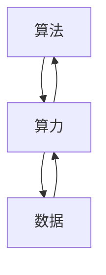

                 

# AI发展的三大支柱：算法、算力与数据

> 关键词：人工智能,算法,算力,数据,机器学习,深度学习,计算机视觉,自然语言处理

## 1. 背景介绍

在人工智能（AI）的发展历程中，算法、算力与数据始终是推动其进步的三大核心支柱。无论是一步三尺的机器人技术，还是看似遥不可及的宇宙探索，其背后都离不开这三大支柱的支撑。

### 1.1 背景
人工智能是一门涉及计算机科学、认知科学、神经科学等多个学科的交叉学科。从最初的符号逻辑到现代的深度学习，人工智能的发展经历了多次革命。每一次革命都离不开对算法、算力与数据三者的不断革新。

在20世纪60年代到80年代，人工智能进入了第一个黄金时期。在这一时期，专家系统（Expert Systems）成为了人工智能的主要应用形式。专家系统利用专家知识构建规则，用于解决特定领域的问题。然而，由于规则的复杂性，专家系统的适用范围受到了很大限制。

到了80年代中期，神经网络（Neural Networks）开始受到重视。神经网络通过模拟人类大脑的神经元网络，对输入数据进行分类、回归等处理。然而，由于计算机算力的限制，神经网络的训练过程非常缓慢，其应用范围和效果均受到了限制。

进入21世纪，随着深度学习（Deep Learning）技术的崛起，神经网络重新焕发了生命力。深度学习通过多层次的神经网络结构，在图像识别、语音识别、自然语言处理等领域取得了显著效果。其背后的推动力，离不开计算机算力的显著提升和大量高质量数据的积累。

在21世纪20年代，人工智能进入了第三次浪潮。这一时期，生成对抗网络（GANs）、自监督学习、自注意力机制等新技术层出不穷，推动了人工智能在各个领域的突破性进展。与此同时，大数据、云计算、边缘计算等基础设施的不断完善，为人工智能的发展提供了坚实的算力保障。

### 1.2 问题由来
在当前人工智能的发展过程中，算法、算力与数据之间存在着相互依存、相互影响的关系。随着算法的不断发展，需要更强大的算力来支撑其计算需求。而随着数据的激增，又需要更高效的算法来处理和利用这些数据。

以深度学习为例，算力的大幅提升使得神经网络可以训练更深的层次，而数据的不断积累使得神经网络可以处理更加复杂的任务。然而，尽管算力与数据得到了显著提升，算法的性能提升仍然是一个重要课题。算法是决定人工智能系统性能的核心因素，其优化程度直接影响了系统的效率和准确性。

因此，本文将从算法的角度切入，探讨算法、算力与数据在人工智能发展中的重要性，并分析未来三者之间的协同发展趋势。

## 2. 核心概念与联系

### 2.1 核心概念概述

在探讨算法、算力与数据的关系之前，我们需要先了解几个核心概念：

- **算法（Algorithm）**：算法是一系列解决问题的步骤，用于解决特定领域的问题。在人工智能中，算法是实现模型训练和推理的关键。
- **算力（Computing Power）**：算力指计算机的处理能力，包括计算速度、存储能力、网络带宽等。算力是算法得以实现的硬件保障。
- **数据（Data）**：数据是算法训练的基础，包括训练集、验证集和测试集等。数据的质量和数量直接影响了算法的性能。

### 2.2 核心概念原理和架构的 Mermaid 流程图



从图中可以看出，算法、算力和数据三者之间存在着相互依赖的关系。算法的优劣直接决定了其对数据的利用效率，而算力则提供了算法实现的硬件保障。

## 3. 核心算法原理 & 具体操作步骤

### 3.1 算法原理概述

算法是人工智能的核心，其优劣直接影响着系统的性能。在算法的选择上，需要考虑数据量、任务类型、计算资源等多方面的因素。

当前，深度学习是人工智能的主流算法之一。深度学习通过多层次的神经网络结构，对输入数据进行自动化的特征提取和分类。深度学习算法包括卷积神经网络（CNNs）、循环神经网络（RNNs）、变分自编码器（VAEs）等。这些算法通过不断优化，在图像识别、语音识别、自然语言处理等领域取得了显著成效。

### 3.2 算法步骤详解

深度学习算法的训练和推理过程通常包括以下步骤：

1. **数据预处理**：对输入数据进行归一化、标准化、分词等预处理，以便于模型训练和推理。
2. **模型构建**：根据任务类型选择合适的神经网络模型，并进行模型搭建。
3. **模型训练**：使用训练集对模型进行训练，通过反向传播算法更新模型参数，以最小化损失函数。
4. **模型评估**：使用验证集对训练好的模型进行评估，防止过拟合。
5. **模型部署**：将训练好的模型部署到生产环境，进行实时推理和应用。

### 3.3 算法优缺点

深度学习算法具有以下优点：

- **自动特征提取**：深度学习算法能够自动从数据中提取特征，减少了人工设计的复杂度。
- **高精度**：深度学习算法在处理复杂任务时，能够取得较高的精度。
- **广泛应用**：深度学习算法在图像识别、语音识别、自然语言处理等领域有着广泛的应用。

同时，深度学习算法也存在以下缺点：

- **计算资源需求高**：深度学习算法需要大量的计算资源，特别是在训练过程中，模型的计算复杂度较高。
- **数据需求大**：深度学习算法需要大量的标注数据进行训练，数据获取和标注成本较高。
- **可解释性差**：深度学习模型通常是一个黑盒模型，其决策过程难以解释和理解。

### 3.4 算法应用领域

深度学习算法在各个领域都有着广泛的应用：

- **计算机视觉**：图像分类、目标检测、图像分割等。
- **自然语言处理**：机器翻译、文本分类、情感分析等。
- **语音识别**：语音识别、语音合成等。
- **推荐系统**：个性化推荐、用户行为预测等。
- **医疗诊断**：医学影像分析、疾病诊断等。

## 4. 数学模型和公式 & 详细讲解 & 举例说明

### 4.1 数学模型构建

在深度学习中，常用的数学模型包括损失函数、激活函数、正则化等。以下以多分类任务为例，介绍深度学习模型的构建过程。

### 4.2 公式推导过程

假设我们有一个包含 $m$ 个样本的数据集 $D$，每个样本包含 $n$ 个特征和一个类别标签 $y_i \in \{1,2,\ldots,c\}$，其中 $c$ 是类别数。我们的目标是训练一个神经网络模型 $M_{\theta}$，使得模型在给定输入 $x_i$ 的情况下，能够预测出正确的类别标签 $y_i$。

我们定义模型的损失函数为交叉熵损失函数，其公式如下：

$$
L(y_i,\hat{y}_i) = -\sum_{i=1}^{c} y_i \log \hat{y}_i
$$

其中 $\hat{y}_i$ 是模型预测的类别概率分布，$y_i$ 是真实类别标签。

在模型训练过程中，我们使用随机梯度下降（SGD）算法来最小化损失函数。其更新公式如下：

$$
\theta \leftarrow \theta - \eta \nabla_{\theta}L(y_i,\hat{y}_i)
$$

其中 $\eta$ 是学习率，$\nabla_{\theta}L(y_i,\hat{y}_i)$ 是损失函数对模型参数 $\theta$ 的梯度。

### 4.3 案例分析与讲解

假设我们有一个包含1000个训练样本和10个类别标签的分类任务。我们使用一个包含3个隐藏层的全连接神经网络，每个隐藏层包含128个神经元。我们使用交叉熵损失函数和SGD算法进行训练。训练过程中，我们采用正则化技术（如L2正则化）来防止过拟合。

## 5. 项目实践：代码实例和详细解释说明

### 5.1 开发环境搭建

在进行深度学习项目开发之前，我们需要准备好开发环境。以下是使用Python进行TensorFlow和PyTorch开发的环境配置流程：

1. 安装Anaconda：从官网下载并安装Anaconda，用于创建独立的Python环境。

2. 创建并激活虚拟环境：
```bash
conda create -n tf-env python=3.7
conda activate tf-env
```

3. 安装TensorFlow和PyTorch：
```bash
conda install tensorflow=2.3.0
pip install torch torchvision torchaudio
```

4. 安装各类工具包：
```bash
pip install numpy pandas scikit-learn matplotlib tqdm jupyter notebook ipython
```

完成上述步骤后，即可在`tf-env`环境中开始深度学习项目开发。

### 5.2 源代码详细实现

以下是一个使用TensorFlow进行多分类任务训练的Python代码示例：

```python
import tensorflow as tf
from tensorflow.keras import layers, models

# 定义模型架构
model = models.Sequential([
    layers.Dense(128, activation='relu', input_shape=(784,)),
    layers.Dense(128, activation='relu'),
    layers.Dense(10, activation='softmax')
])

# 定义损失函数和优化器
loss_fn = tf.keras.losses.CategoricalCrossentropy()
optimizer = tf.keras.optimizers.Adam(learning_rate=0.001)

# 定义训练数据集
(x_train, y_train), (x_test, y_test) = tf.keras.datasets.mnist.load_data()
x_train = x_train.reshape(-1, 784)
x_test = x_test.reshape(-1, 784)

# 定义数据增强器
data_augmentation = tf.keras.Sequential([
    layers.Rescaling(1./255),
    layers.RandomRotation(0.1),
    layers.RandomZoom(0.1),
    layers.RandomFlip('horizontal_and_vertical')
])

# 数据增强
data_augmentation_layer = data_augmentation(x_train)

# 定义数据集
train_dataset = tf.data.Dataset.from_tensor_slices((data_augmentation_layer, y_train))
test_dataset = tf.data.Dataset.from_tensor_slices((x_test, y_test))

# 定义训练步骤
@tf.function
def train_step(images, labels):
    with tf.GradientTape() as tape:
        predictions = model(images, training=True)
        loss_value = loss_fn(labels, predictions)
    gradients = tape.gradient(loss_value, model.trainable_variables)
    optimizer.apply_gradients(zip(gradients, model.trainable_variables))
    return loss_value

# 训练模型
EPOCHS = 10
BATCH_SIZE = 32

for epoch in range(EPOCHS):
    for batch in train_dataset.batch(BATCH_SIZE):
        loss_value = train_step(*batch)
        print(f'Epoch {epoch+1}, Loss: {loss_value:.4f}')
```

### 5.3 代码解读与分析

让我们再详细解读一下关键代码的实现细节：

**定义模型架构**：
- `Sequential`：定义一个顺序模型。
- `Dense`：定义全连接层。

**定义损失函数和优化器**：
- `CategoricalCrossentropy`：定义交叉熵损失函数。
- `Adam`：定义Adam优化器。

**定义数据集**：
- `tf.data.Dataset`：定义数据集。
- `from_tensor_slices`：从张量切片中创建数据集。

**定义数据增强器**：
- `Sequential`：定义数据增强器。
- `Rescaling`：归一化数据。
- `RandomRotation`：随机旋转图像。
- `RandomZoom`：随机缩放图像。
- `RandomFlip`：随机翻转图像。

**训练模型**：
- `tf.function`：定义训练步骤函数。
- `GradientTape`：计算梯度。
- `apply_gradients`：应用梯度。

可以看到，TensorFlow提供了简单易用的接口，使深度学习模型的开发和训练变得非常便捷。开发者可以根据具体任务，灵活调整模型的架构和训练参数，快速实现模型的训练和推理。

## 6. 实际应用场景

### 6.1 自动驾驶

自动驾驶技术是当前人工智能领域的热点之一。自动驾驶系统需要实时处理大量的传感器数据，并进行路径规划和决策。深度学习算法在自动驾驶中得到了广泛应用，用于图像识别、目标检测、路径规划等任务。

在自动驾驶中，深度学习算法可以通过传感器数据提取特征，并用于环境感知、物体识别等任务。通过多层次的神经网络结构，深度学习算法能够学习到复杂的特征表示，从而提高系统的性能和鲁棒性。同时，由于自动驾驶任务对实时性和精度要求较高，算力保障成为其关键因素。自动驾驶系统通常需要配备高性能的硬件设备，如GPU、FPGA等，以支撑深度学习算法的计算需求。

### 6.2 医疗影像分析

医疗影像分析是深度学习在医学领域的重要应用之一。深度学习算法可以通过对医学影像的自动分析，辅助医生进行疾病诊断和治疗。在医疗影像分析中，深度学习算法可以学习到影像中的高层次特征，从而提高诊断的准确性和效率。

在医疗影像分析中，深度学习算法通常需要处理大规模的医学影像数据。这些数据具有高维、噪声多等特点，对算力和数据的需求较高。为了应对这一挑战，医疗影像分析通常需要在高性能计算平台（如GPU集群、TPU等）上进行，以提高计算速度和数据处理能力。

### 6.3 金融风险控制

金融风险控制是深度学习在金融领域的重要应用之一。深度学习算法可以通过对金融数据的分析，辅助银行和金融机构进行风险评估和控制。在金融风险控制中，深度学习算法可以学习到金融数据中的复杂模式，从而提高风险评估的准确性和效率。

在金融风险控制中，深度学习算法通常需要处理大量的金融数据，这些数据具有高维、实时等特点，对算力和数据的需求较高。为了应对这一挑战，金融风险控制通常需要在高性能计算平台（如GPU集群、TPU等）上进行，以提高计算速度和数据处理能力。

### 6.4 未来应用展望

随着深度学习算法的不断发展，其在各个领域的应用将更加广泛。未来，深度学习算法将在以下几个方面得到突破性进展：

1. **联邦学习**：联邦学习是一种分布式机器学习技术，可以在不泄露数据隐私的情况下，对分布式数据进行模型训练。未来，深度学习算法将在联邦学习框架下得到更广泛的应用，实现跨机构、跨设备的数据共享和协作。

2. **自监督学习**：自监督学习是一种不需要标注数据的机器学习技术，通过从数据中自动生成标注信息，对模型进行训练。未来，自监督学习将进一步降低深度学习对标注数据的依赖，提高数据利用效率。

3. **生成对抗网络（GANs）**：GANs是一种生成模型，可以通过训练生成对抗网络，生成高质量的伪造数据。未来，GANs将在图像生成、视频生成、自然语言生成等领域得到广泛应用。

4. **强化学习**：强化学习是一种通过试错来优化决策的技术，通过奖励和惩罚机制，对模型进行训练。未来，强化学习将在游戏AI、机器人控制等领域得到广泛应用。

5. **跨模态学习**：跨模态学习是一种将不同模态的数据进行融合，构建更加全面的信息表示的技术。未来，跨模态学习将进一步提高深度学习在多模态数据处理中的性能。

## 7. 工具和资源推荐

### 7.1 学习资源推荐

为了帮助开发者系统掌握深度学习算法的理论基础和实践技巧，这里推荐一些优质的学习资源：

1. **《深度学习》（Ian Goodfellow）**：深度学习领域的经典教材，详细介绍了深度学习的基本概念和算法。
2. **DeepLearning.AI深度学习专业课程**：由Andrew Ng教授主讲，涵盖了深度学习算法、框架、实践等多个方面。
3. **TensorFlow官方文档**：TensorFlow的官方文档，提供了丰富的教程、示例和API文档，是学习TensorFlow的必备资源。
4. **PyTorch官方文档**：PyTorch的官方文档，提供了详细的API文档和示例代码，是学习PyTorch的必备资源。
5. **Kaggle数据集和竞赛**：Kaggle是全球最大的数据科学竞赛平台，提供了丰富的数据集和竞赛机会，可以实践深度学习算法。

通过对这些资源的学习实践，相信你一定能够快速掌握深度学习算法的精髓，并用于解决实际的AI问题。

### 7.2 开发工具推荐

高效的开发离不开优秀的工具支持。以下是几款用于深度学习算法开发的常用工具：

1. **TensorFlow**：由Google主导开发的开源深度学习框架，生产部署方便，适合大规模工程应用。
2. **PyTorch**：由Facebook主导开发的开源深度学习框架，灵活动态的计算图，适合快速迭代研究。
3. **JAX**：由Google开发的可微自动化的机器学习库，提供了高性能计算和自动微分功能，适合研究复杂模型。
4. **MXNet**：由Apache软件基金会开发的开源深度学习框架，支持多种编程语言和硬件平台，适合分布式计算。
5. **PyTorch Lightning**：基于PyTorch的快速原型开发框架，提供了自动化的超参数优化、模型调度等功能，适合快速原型开发。

合理利用这些工具，可以显著提升深度学习算法开发和研究的效率，加快创新迭代的步伐。

### 7.3 相关论文推荐

深度学习算法的发展源于学界的持续研究。以下是几篇奠基性的相关论文，推荐阅读：

1. **《ImageNet Classification with Deep Convolutional Neural Networks》（AlexNet论文）**：提出了卷积神经网络（CNNs），开创了深度学习在计算机视觉领域的先河。
2. **《Deep Residual Learning for Image Recognition》（ResNet论文）**：提出了残差网络（ResNets），解决了深层网络训练困难的问题。
3. **《Attention is All You Need》（Transformer论文）**：提出了Transformer模型，开启了深度学习在自然语言处理领域的革命。
4. **《Generative Adversarial Nets》（GANs论文）**：提出了生成对抗网络（GANs），实现了高质量的图像生成。
5. **《Self-Training with Data Consistency》（自训练论文）**：提出了自训练方法，通过从标注数据中生成无标签数据，提高深度学习模型的泛化能力。

这些论文代表了大深度学习算法的发展脉络。通过学习这些前沿成果，可以帮助研究者把握学科前进方向，激发更多的创新灵感。

## 8. 总结：未来发展趋势与挑战

### 8.1 总结

本文从算法的角度切入，探讨了算法、算力与数据在人工智能发展中的重要性。算法是实现人工智能系统的核心，其优劣直接影响着系统的性能。算力是算法得以实现的硬件保障，而数据则是算法训练的基础。未来，算法、算力与数据三者之间的协同发展将成为人工智能技术进步的关键。

### 8.2 未来发展趋势

展望未来，深度学习算法将在以下几个方面得到突破性进展：

1. **联邦学习**：联邦学习是一种分布式机器学习技术，可以在不泄露数据隐私的情况下，对分布式数据进行模型训练。未来，深度学习算法将在联邦学习框架下得到更广泛的应用，实现跨机构、跨设备的数据共享和协作。

2. **自监督学习**：自监督学习是一种不需要标注数据的机器学习技术，通过从数据中自动生成标注信息，对模型进行训练。未来，自监督学习将进一步降低深度学习对标注数据的依赖，提高数据利用效率。

3. **生成对抗网络（GANs）**：GANs是一种生成模型，可以通过训练生成对抗网络，生成高质量的伪造数据。未来，GANs将在图像生成、视频生成、自然语言生成等领域得到广泛应用。

4. **强化学习**：强化学习是一种通过试错来优化决策的技术，通过奖励和惩罚机制，对模型进行训练。未来，强化学习将在游戏AI、机器人控制等领域得到广泛应用。

5. **跨模态学习**：跨模态学习是一种将不同模态的数据进行融合，构建更加全面的信息表示的技术。未来，跨模态学习将进一步提高深度学习在多模态数据处理中的性能。

### 8.3 面临的挑战

尽管深度学习算法已经取得了瞩目成就，但在迈向更加智能化、普适化应用的过程中，它仍面临着诸多挑战：

1. **数据隐私和安全**：深度学习算法通常需要大量的数据进行训练，数据隐私和安全问题亟待解决。如何在保障数据隐私的同时，提高模型的性能，是一个重要的研究方向。

2. **计算资源需求高**：深度学习算法需要大量的计算资源，特别是在训练过程中，模型的计算复杂度较高。如何降低计算资源需求，提高模型的训练和推理效率，是一个重要的研究方向。

3. **可解释性和透明性**：深度学习模型通常是一个黑盒模型，其决策过程难以解释和理解。如何提高深度学习模型的可解释性和透明性，是一个重要的研究方向。

4. **跨领域应用**：深度学习算法在特定领域的应用往往存在局限性，如何使深度学习算法在跨领域中得到广泛应用，是一个重要的研究方向。

5. **对抗攻击**：深度学习算法在对抗攻击面前容易出现脆弱性。如何提高深度学习模型的鲁棒性，对抗攻击，是一个重要的研究方向。

6. **模型公平性**：深度学习模型在处理某些特定数据时，可能存在偏见。如何提高深度学习模型的公平性，减少偏见，是一个重要的研究方向。

### 8.4 研究展望

面对深度学习算法所面临的挑战，未来的研究需要在以下几个方面寻求新的突破：

1. **联邦学习**：联邦学习是一种分布式机器学习技术，可以在不泄露数据隐私的情况下，对分布式数据进行模型训练。未来，深度学习算法将在联邦学习框架下得到更广泛的应用，实现跨机构、跨设备的数据共享和协作。

2. **自监督学习**：自监督学习是一种不需要标注数据的机器学习技术，通过从数据中自动生成标注信息，对模型进行训练。未来，自监督学习将进一步降低深度学习对标注数据的依赖，提高数据利用效率。

3. **生成对抗网络（GANs）**：GANs是一种生成模型，可以通过训练生成对抗网络，生成高质量的伪造数据。未来，GANs将在图像生成、视频生成、自然语言生成等领域得到广泛应用。

4. **强化学习**：强化学习是一种通过试错来优化决策的技术，通过奖励和惩罚机制，对模型进行训练。未来，强化学习将在游戏AI、机器人控制等领域得到广泛应用。

5. **跨模态学习**：跨模态学习是一种将不同模态的数据进行融合，构建更加全面的信息表示的技术。未来，跨模态学习将进一步提高深度学习在多模态数据处理中的性能。

6. **对抗训练**：对抗训练是一种通过引入对抗样本，提高深度学习模型的鲁棒性和泛化能力的技术。未来，对抗训练将进一步提升深度学习模型的性能和鲁棒性。

## 9. 附录：常见问题与解答

**Q1：深度学习算法是否适用于所有领域？**

A: 深度学习算法在大多数领域都能取得不错的效果，特别是对于数据量较大的任务。但对于一些特定领域的任务，如医学、法律等，仅依靠通用数据和算法可能无法达到理想效果。此时需要在特定领域数据上进行预训练，再进行微调，才能获得理想效果。

**Q2：深度学习算法在训练过程中面临哪些问题？**

A: 深度学习算法在训练过程中面临的问题主要有：
1. 过拟合：深度学习模型容易在训练集上出现过拟合，即模型在训练集上表现很好，但在测试集上表现不佳。
2. 计算资源需求高：深度学习模型需要大量的计算资源，特别是在训练过程中，模型的计算复杂度较高。
3. 数据隐私和安全：深度学习模型需要大量的数据进行训练，数据隐私和安全问题亟待解决。

**Q3：深度学习算法在应用过程中面临哪些问题？**

A: 深度学习算法在应用过程中面临的问题主要有：
1. 可解释性差：深度学习模型通常是一个黑盒模型，其决策过程难以解释和理解。
2. 对抗攻击：深度学习模型在对抗攻击面前容易出现脆弱性。
3. 数据隐私和安全：深度学习模型在处理某些特定数据时，可能存在偏见。
4. 计算资源需求高：深度学习模型需要大量的计算资源，特别是在推理过程中，模型的计算复杂度较高。

**Q4：如何提高深度学习模型的可解释性和透明性？**

A: 提高深度学习模型的可解释性和透明性，可以从以下几个方面入手：
1. 可视化技术：使用可视化工具，展示模型的中间表示，帮助理解模型的决策过程。
2. 模型压缩：使用模型压缩技术，减少模型的复杂度，提高模型的可解释性。
3. 可解释模型：使用可解释模型，如决策树、线性回归等，提高模型的可解释性。

**Q5：如何应对深度学习算法在应用过程中面临的挑战？**

A: 应对深度学习算法在应用过程中面临的挑战，可以从以下几个方面入手：
1. 对抗训练：通过引入对抗样本，提高深度学习模型的鲁棒性和泛化能力。
2. 自监督学习：通过从数据中自动生成标注信息，降低深度学习算法对标注数据的依赖。
3. 联邦学习：通过分布式计算，提高深度学习算法的性能和泛化能力。
4. 跨模态学习：将不同模态的数据进行融合，构建更加全面的信息表示。

这些措施可以帮助提高深度学习算法的性能和鲁棒性，使其更好地适应实际应用场景。

