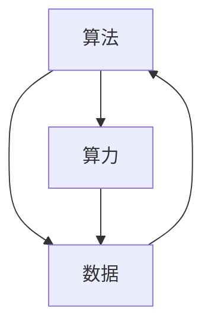

                 

## 1. 背景介绍

### 1.1 问题由来
人工智能（AI）是当前科技领域最热的关键词之一，其发展和应用已经渗透到各个行业。在AI的演进过程中，算法、算力和数据被视为其发展的三大驱动力。算法赋予AI逻辑和推理能力，算力为AI提供了强大的计算资源，数据则为AI提供了学习的素材。三者相互作用，推动AI技术的不断进步和应用。

### 1.2 问题核心关键点
深入理解AI发展的驱动力，有助于我们更好地把握AI技术的发展方向和应用潜力。三者之间的紧密关系，也使得在AI研究和发展中，需要综合考虑算法、算力和数据三个方面的因素。本文将系统地分析AI发展的算法、算力与数据这三个关键驱动力，探讨其相互关系和未来趋势。

## 2. 核心概念与联系

### 2.1 核心概念概述

#### 算法（Algorithm）
算法是解决问题的一种具体步骤和方法。在AI领域，算法通常指用于数据处理、模型训练和推理的各种算法。算法是AI实现其智能行为的核心，不同算法能够适应不同的应用场景，提升AI的效率和效果。

#### 算力（Computational Power）
算力指的是计算机系统处理和执行计算任务的能力，通常用每秒执行的浮点运算次数（FLOPS）来衡量。算力是AI实现其智能行为的基础，强大的算力支持，可以使得AI模型更快地训练和推理。

#### 数据（Data）
数据是AI学习的素材，通过数据，AI能够学习和理解世界规律，进行预测和决策。数据质量对AI模型的性能有着直接影响，高质量的数据能够帮助AI模型更好地学习。

### 2.2 核心概念原理和架构的 Mermaid 流程图



### 2.3 核心概念关系解读
算法、算力和数据是AI发展的三大驱动力。算法提供了解决问题的具体步骤和方法，算力保证了算法执行的效率和效果，数据则提供了算法的学习素材。这三者相互作用，共同推动了AI技术的进步和应用。算法、算力与数据之间的关系可以形象地比喻为"车"、"路"和"油"，缺少任何一项，AI的智能行为都无法正常运转。

## 3. 核心算法原理 & 具体操作步骤
### 3.1 算法原理概述

AI算法可以分为两个主要类别：监督学习和无监督学习。监督学习通过已有的标注数据来训练模型，使其能够预测新的未标注数据。无监督学习则不需要标注数据，通过数据自身的特征来发现其中的模式和规律。

在AI应用中，常见的算法包括：
- 回归算法（如线性回归、决策树回归）
- 分类算法（如逻辑回归、支持向量机）
- 聚类算法（如K-Means、层次聚类）
- 神经网络（如前馈神经网络、卷积神经网络、循环神经网络）
- 强化学习算法（如Q-learning、Deep Q Network）

这些算法在不同的应用场景中都有广泛的应用，通过不断迭代和优化，提升了AI的智能水平和应用能力。

### 3.2 算法步骤详解

以深度学习算法为例，其训练和推理步骤主要包括以下几个环节：

**Step 1: 数据预处理**
- 对数据进行清洗、归一化、特征工程等预处理操作。
- 将数据划分为训练集、验证集和测试集。

**Step 2: 构建模型**
- 选择合适的神经网络结构，如卷积神经网络（CNN）、循环神经网络（RNN）、长短期记忆网络（LSTM）等。
- 确定网络层数、每层的神经元个数等参数。

**Step 3: 模型训练**
- 使用训练集数据，通过反向传播算法进行模型训练，优化模型参数。
- 使用验证集数据，评估模型性能，防止过拟合。

**Step 4: 模型评估**
- 使用测试集数据，评估模型的泛化能力和性能表现。
- 对比不同模型的性能，选择最优模型。

**Step 5: 模型部署**
- 将模型集成到实际应用系统中，进行推理计算。
- 使用模型服务接口，方便调用和部署。

### 3.3 算法优缺点
深度学习算法具有以下优点：
- 可以处理大规模数据集，学习能力较强。
- 通过神经网络的多层结构，可以学习到数据中的复杂模式和规律。
- 具有较强的泛化能力，能够在新的数据集上表现良好。

但深度学习算法也存在一些缺点：
- 需要大量的标注数据进行训练，数据获取成本较高。
- 模型复杂度高，训练时间长，需要强大的算力支持。
- 容易过拟合，需要额外的正则化技术来防止。

### 3.4 算法应用领域

深度学习算法已经在多个领域得到了广泛的应用，包括：
- 计算机视觉：如图像识别、目标检测、人脸识别等。
- 自然语言处理：如机器翻译、情感分析、文本生成等。
- 语音识别：如语音转文本、语音合成等。
- 推荐系统：如商品推荐、内容推荐等。

## 4. 数学模型和公式 & 详细讲解 & 举例说明

### 4.1 数学模型构建

在深度学习算法中，常见的数学模型包括线性回归模型、神经网络模型等。这里以神经网络模型为例，介绍其数学模型构建过程。

#### 线性回归模型
线性回归模型的一般形式为：
$$
y = \theta^T x + b
$$
其中，$y$ 表示输出，$x$ 表示输入，$\theta$ 表示模型参数，$b$ 表示偏置项。

#### 神经网络模型
神经网络模型由多个神经元层构成，每层神经元通过连接权重和偏置项进行计算。以三层前馈神经网络为例，其数学模型构建过程如下：
- 输入层：$x = [x_1, x_2, ..., x_n]$
- 隐藏层：$h = \sigma(\theta_1^T x + b_1)$
- 输出层：$y = \theta_2^T h + b_2$
其中，$\theta_1$ 和 $\theta_2$ 表示不同层的权重，$b_1$ 和 $b_2$ 表示偏置项，$\sigma$ 表示激活函数。

### 4.2 公式推导过程

以神经网络模型的前向传播和反向传播为例，介绍其公式推导过程。

#### 前向传播
神经网络的前向传播过程如下：
- 输入层：$x = [x_1, x_2, ..., x_n]$
- 隐藏层：$h = \sigma(\theta_1^T x + b_1)$
- 输出层：$y = \theta_2^T h + b_2$

其中，激活函数 $\sigma$ 通常使用sigmoid函数或ReLU函数。

#### 反向传播
神经网络的反向传播过程如下：
- 输出层的误差：$e = y - y_{pred}$
- 隐藏层的误差：$e_h = \theta_2^T \delta_y + b_2 \delta_y$
- 输入层的误差：$e_x = \theta_1^T \delta_h + b_1 \delta_h$
其中，$\delta_y$ 和 $\delta_h$ 表示误差项，$y_{pred}$ 表示预测输出。

通过反向传播算法，可以计算出每个神经元对误差的贡献，从而更新模型参数。

### 4.3 案例分析与讲解

以手写数字识别为例，介绍神经网络模型的应用过程。

#### 数据预处理
- 收集手写数字图片数据集。
- 将图片转换为向量形式。
- 将数据集划分为训练集、验证集和测试集。

#### 模型构建
- 使用三层前馈神经网络，每层包含10个神经元。
- 使用sigmoid函数作为激活函数。

#### 模型训练
- 使用训练集数据进行模型训练，调整模型参数。
- 使用验证集数据评估模型性能，防止过拟合。

#### 模型评估
- 使用测试集数据评估模型性能，对比不同模型的表现。

#### 模型部署
- 将模型集成到实际应用系统中，进行推理计算。

## 5. 项目实践：代码实例和详细解释说明

### 5.1 开发环境搭建

在进行神经网络模型的项目实践前，需要准备以下开发环境：

- 安装Python：从官网下载并安装Python 3.x版本。
- 安装NumPy、Pandas、Matplotlib等数据处理和可视化工具。
- 安装TensorFlow或PyTorch等深度学习框架。
- 安装Keras等高级接口，方便模型的快速搭建和调试。

### 5.2 源代码详细实现

以TensorFlow为例，以下是手写数字识别的神经网络模型代码实现。

```python
import tensorflow as tf
from tensorflow.keras import layers, models

# 定义模型结构
model = models.Sequential()
model.add(layers.Dense(10, input_shape=(784,), activation='sigmoid'))
model.add(layers.Dense(10, activation='sigmoid'))

# 编译模型
model.compile(optimizer='adam', loss='binary_crossentropy', metrics=['accuracy'])

# 训练模型
model.fit(train_images, train_labels, epochs=10, validation_data=(val_images, val_labels))

# 评估模型
test_loss, test_acc = model.evaluate(test_images, test_labels)
print('Test accuracy:', test_acc)
```

### 5.3 代码解读与分析

以上代码实现了手写数字识别的神经网络模型。具体解读如下：

- 定义模型结构：使用Sequential模型，添加两个Dense层，每层包含10个神经元，使用sigmoid函数作为激活函数。
- 编译模型：使用adam优化器，二元交叉熵损失函数，准确率作为评估指标。
- 训练模型：使用训练集数据进行模型训练，设置10个epochs。
- 评估模型：使用测试集数据评估模型性能，输出测试集准确率。

## 6. 实际应用场景

### 6.1 智能医疗
智能医疗是AI应用的重要领域之一，通过AI算法、算力和数据的结合，可以实现疾病的早期预测、个性化治疗、智能诊断等。

#### 应用案例
- 基于深度学习的图像识别算法，能够从医学影像中自动识别出肿瘤、病变等异常情况。
- 使用自然语言处理算法，可以对病历记录进行自动分析和归类，辅助医生诊断。
- 强化学习算法可以用于智能治疗方案的优化，实现个性化治疗。

### 6.2 自动驾驶
自动驾驶是AI在交通领域的最新应用，需要高效处理和分析海量传感器数据，进行路径规划和决策。

#### 应用案例
- 使用卷积神经网络（CNN）对摄像头采集的图像数据进行实时分析，识别道路标志、行人、车辆等。
- 通过激光雷达和雷达数据，使用深度学习算法进行障碍物检测和距离测量。
- 使用强化学习算法进行路径规划和决策，实现自动驾驶。

### 6.3 金融风控
金融风控是AI在金融领域的重要应用，通过AI算法、算力和数据的结合，可以实现风险评估、欺诈检测、智能投顾等。

#### 应用案例
- 使用机器学习算法对用户行为数据进行分析，评估信用风险。
- 使用深度学习算法对金融市场数据进行预测和分析，优化投资策略。
- 使用强化学习算法进行交易策略的优化，实现智能投顾。

## 7. 工具和资源推荐

### 7.1 学习资源推荐

为了更好地学习和掌握AI算法的原理和应用，以下是一些优质的学习资源：

- 《深度学习》（Ian Goodfellow）：深度学习领域的经典教材，详细介绍了深度学习的基本概念和算法。
- 《Python深度学习》（Francois Chollet）：介绍TensorFlow等深度学习框架的入门教程，适合初学者。
- Coursera的《深度学习专项课程》：由深度学习领域的知名教授授课，涵盖深度学习的基本概念和应用。
- Udacity的《深度学习纳米学位》：提供深度学习的系统学习，涵盖深度学习的各个方面。

### 7.2 开发工具推荐

为了更好地进行AI项目开发，以下是一些常用的开发工具：

- Jupyter Notebook：可视化编程环境，适合进行数据处理和模型训练。
- TensorBoard：可视化工具，可以实时监测模型训练状态，输出训练结果。
- Visual Studio Code：轻量级的IDE，支持Python和TensorFlow等工具的安装和使用。
- Anaconda：科学计算的发行版，支持Python、NumPy、Pandas等工具的安装和使用。

### 7.3 相关论文推荐

AI算法和应用的发展离不开学界的持续研究，以下是几篇重要的相关论文：

- 《ImageNet Classification with Deep Convolutional Neural Networks》（AlexNet论文）：提出卷积神经网络（CNN），成为深度学习领域的里程碑。
- 《Deep Residual Learning for Image Recognition》（ResNet论文）：提出残差网络（ResNet），解决深度网络训练中的梯度消失问题。
- 《Attention is All You Need》：提出Transformer架构，开启了大模型时代。
- 《BERT: Pre-training of Deep Bidirectional Transformers for Language Understanding》：提出BERT模型，实现无监督预训练，提升了自然语言处理任务的性能。
- 《AlphaGo Zero》：通过强化学习算法，实现围棋自动通关。

这些论文代表了AI算法和应用的发展脉络，通过学习这些前沿成果，可以更好地把握AI技术的发展方向和应用潜力。

## 8. 总结：未来发展趋势与挑战

### 8.1 研究成果总结

AI算法、算力与数据是AI发展的三大驱动力，它们相互作用，共同推动了AI技术的不断进步和应用。算法提供了解决问题的具体步骤和方法，算力保证了算法执行的效率和效果，数据则为算法提供了学习的素材。在未来，随着算力、数据和算法的不断提升，AI将具备更强的智能水平和应用能力。

### 8.2 未来发展趋势

未来，AI算法、算力与数据将呈现以下趋势：

1. **算法复杂度提升**：随着深度学习和强化学习的不断发展，AI算法将变得更加复杂，能够处理更复杂的任务。
2. **算力水平提升**：随着硬件技术的不断进步，AI算力将大幅提升，能够支持更大规模的数据处理和更高效的模型训练。
3. **数据规模扩大**：随着大数据技术的发展，AI数据将更加丰富，能够更好地支持算法的训练和优化。

### 8.3 面临的挑战

尽管AI算法、算力与数据的发展取得了一定的成果，但在未来发展中仍面临诸多挑战：

1. **数据隐私和安全**：随着数据量的增加，数据隐私和安全问题也更加突出，需要更好的数据保护技术。
2. **算法透明性**：AI算法常常被视为"黑箱"，缺乏可解释性，难以理解其内部工作机制。
3. **计算成本**：大规模数据和复杂模型的训练和推理需要大量的计算资源，计算成本较高。
4. **模型泛化能力**：AI模型在不同数据集上的泛化能力不足，需要更好的模型选择和优化方法。
5. **伦理和社会影响**：AI技术的广泛应用可能带来伦理和社会问题，需要更好的规范和监管。

### 8.4 研究展望

未来，AI算法、算力与数据的研究方向将更加多样化，涉及以下方面：

1. **无监督学习和自适应学习**：探索更高效的无监督学习方法和自适应学习算法，降低对标注数据的需求。
2. **跨模态学习和融合**：研究跨模态数据融合技术，将不同模态的数据进行融合，提升AI的感知能力和推理能力。
3. **可解释性和透明性**：研究更可解释的AI算法和模型，提高算法的透明性和可信度。
4. **联邦学习和隐私保护**：研究联邦学习技术，提升数据隐私保护能力，同时提升模型性能。
5. **伦理和社会影响**：研究AI技术的伦理和社会影响，制定更好的规范和监管政策。

## 9. 附录：常见问题与解答

**Q1：AI算法、算力与数据之间的关系是什么？**

A: AI算法、算力与数据是AI发展的三大驱动力，它们相互作用，共同推动了AI技术的不断进步和应用。算法提供了解决问题的具体步骤和方法，算力保证了算法执行的效率和效果，数据则为算法提供了学习的素材。

**Q2：AI算法和算力对数据有什么影响？**

A: AI算法和算力对数据的影响主要体现在以下方面：
1. 高质量的数据可以显著提升AI算法的性能，降低算力消耗。
2. 算力水平的提升可以支持更大规模的数据处理和更复杂的算法训练，提高AI算法的性能和应用效果。
3. 数据的隐私和安全问题也是AI算法和算力需要考虑的重要因素，需要更好的数据保护技术。

**Q3：AI算法、算力与数据在实际应用中需要注意什么？**

A: 在实际应用中，AI算法、算力与数据需要注意以下方面：
1. 数据的质量和隐私保护，确保数据的合法性和安全性。
2. 算力资源的合理配置，降低计算成本，提升模型性能。
3. 算法的透明性和可解释性，提高算法的可信度。
4. 算法的复杂度和训练时间，选择合适的算法和优化方法。

**Q4：未来AI算法、算力与数据的发展趋势是什么？**

A: 未来AI算法、算力与数据的发展趋势主要包括以下几个方面：
1. 算法的复杂度提升，能够处理更复杂的任务。
2. 算力水平提升，能够支持更大规模的数据处理和更高效的模型训练。
3. 数据规模扩大，能够更好地支持算法的训练和优化。
4. 无监督学习和自适应学习的研究将更加深入，降低对标注数据的需求。
5. 跨模态学习和融合技术将不断发展，提升AI的感知能力和推理能力。

**Q5：AI算法、算力与数据在实际应用中需要注意什么？**

A: 在实际应用中，AI算法、算力与数据需要注意以下方面：
1. 数据的质量和隐私保护，确保数据的合法性和安全性。
2. 算力资源的合理配置，降低计算成本，提升模型性能。
3. 算法的透明性和可解释性，提高算法的可信度。
4. 算法的复杂度和训练时间，选择合适的算法和优化方法。

---

作者：禅与计算机程序设计艺术 / Zen and the Art of Computer Programming

