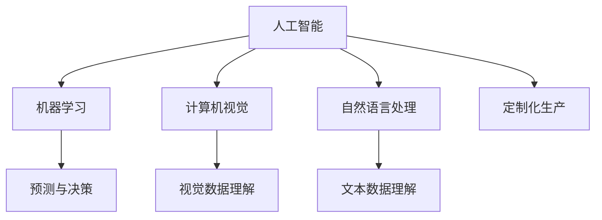

                 

# AI在产品定制化生产中的应用

## 1. 背景介绍

### 1.1 问题由来

随着全球经济和科技的快速发展，消费者对于个性化和定制化产品的需求日益增长。个性化生产方式不仅满足消费者多样化的需求，同时还能提升产品的附加值和市场竞争力。然而，传统的生产方式受到柔性化不足的限制，难以高效、灵活地适应市场变化。近年来，人工智能（AI）技术在生产自动化和智能化方面的应用取得了显著进展，特别是机器学习、计算机视觉、自然语言处理等技术，为产品定制化生产提供了新的可能性。

### 1.2 问题核心关键点

AI在产品定制化生产中的应用，核心在于通过数据驱动的方式，利用机器学习算法对生产流程进行优化，实现高效、个性化的定制生产。关键点包括：

- **数据驱动：** 收集和分析生产过程中的大量数据，提取有价值的信息，指导生产流程的优化。
- **机器学习：** 利用机器学习算法对生产过程中的各种变量进行建模，预测生产效果并指导决策。
- **自动化和智能化：** 通过AI技术实现生产流程的自动化，提升生产效率和灵活性。
- **个性化定制：** 根据消费者需求，通过AI技术设计定制化生产方案，满足个性化需求。

### 1.3 问题研究意义

AI在产品定制化生产中的应用，具有重要的研究意义：

1. **提升生产效率：** 通过自动化和智能化的生产方式，提高生产效率，降低生产成本。
2. **满足个性化需求：** 提供个性化定制服务，满足消费者多样化需求，提升产品附加值。
3. **增强市场竞争力：** 通过定制化生产，提升产品质量和市场竞争力。
4. **推动工业升级：** 促进传统制造业的智能化和柔性化，推动制造业升级。

## 2. 核心概念与联系

### 2.1 核心概念概述

为更好地理解AI在产品定制化生产中的应用，本节将介绍几个关键概念：

- **人工智能（AI）：** 通过计算机模拟人类智能过程，实现数据处理、决策支持、自动化控制等功能。
- **机器学习（ML）：** 利用数据训练算法模型，从中提取规律和知识，用于预测和决策。
- **计算机视觉（CV）：** 通过图像处理和分析技术，实现视觉数据的理解和识别。
- **自然语言处理（NLP）：** 通过文本处理和分析技术，实现语言数据的理解和生成。
- **定制化生产：** 根据消费者需求，定制生产特定的产品，满足个性化需求。

这些概念之间的逻辑关系可以通过以下Mermaid流程图来展示：



这个流程图展示了人工智能、机器学习、计算机视觉和自然语言处理与定制化生产之间的联系。

## 3. 核心算法原理 & 具体操作步骤
### 3.1 算法原理概述

AI在产品定制化生产中的应用，主要基于以下原理：

1. **数据收集与处理：** 通过传感器、摄像头、网络等设备，收集生产过程中的各种数据，包括生产状态、产品质量、设备状态等。
2. **特征提取与选择：** 利用特征提取技术，从原始数据中提取有价值的信息，作为机器学习模型的输入。
3. **模型训练与优化：** 利用机器学习算法，训练预测模型，对生产过程中的各种变量进行建模，优化生产参数。
4. **决策与控制：** 根据模型预测结果，自动控制生产设备和流程，实现个性化定制生产。

### 3.2 算法步骤详解

AI在产品定制化生产中的应用，主要包括以下几个关键步骤：

**Step 1: 数据采集与预处理**

1. **数据来源：** 收集生产过程中的各种数据，包括生产设备状态、传感器数据、产品质量检测结果等。
2. **数据清洗：** 去除噪声和异常值，确保数据的准确性和一致性。
3. **数据转换：** 将数据转换为标准格式，便于后续处理。

**Step 2: 特征提取与选择**

1. **特征选择：** 根据生产任务的需求，选择对生产效果有重要影响的特征。
2. **特征提取：** 利用机器学习算法，从原始数据中提取特征，如文本特征、图像特征等。

**Step 3: 模型训练与优化**

1. **选择算法：** 根据生产任务的特点，选择合适的机器学习算法，如线性回归、决策树、支持向量机等。
2. **训练模型：** 利用训练数据集，训练机器学习模型，优化模型参数。
3. **模型评估：** 利用测试数据集，评估模型的性能，确保模型的泛化能力。

**Step 4: 决策与控制**

1. **决策制定：** 根据模型预测结果，制定生产决策，如调整生产参数、优化生产流程等。
2. **控制执行：** 利用自动化控制系统，执行生产决策，实现生产自动化。

### 3.3 算法优缺点

AI在产品定制化生产中的应用，具有以下优点：

1. **高效性：** 通过自动化和智能化的生产方式，提高生产效率，降低生产成本。
2. **灵活性：** 实现柔性化生产，快速响应市场需求变化。
3. **个性化定制：** 提供个性化定制服务，满足消费者多样化需求。
4. **数据驱动：** 通过数据驱动的方式，提高生产决策的科学性和准确性。

同时，该方法也存在一些局限性：

1. **数据依赖：** 需要大量的高质量数据，数据采集和处理成本较高。
2. **模型复杂性：** 机器学习模型的选择和优化较为复杂，需要专业知识。
3. **硬件要求：** 需要高性能的计算设备和自动化控制系统，硬件投入较高。
4. **算法局限：** 现有机器学习算法的适用范围有限，难以处理复杂多变的问题。

尽管存在这些局限性，但AI在产品定制化生产中的应用，已经在许多行业得到了广泛应用，取得了显著的效果。

### 3.4 算法应用领域

AI在产品定制化生产中的应用，涵盖了许多领域，包括但不限于：

- **汽车制造：** 通过机器学习和计算机视觉技术，实现自动装配、质量检测和故障预测。
- **电子制造：** 利用AI技术进行电路板设计、焊接和质量检测。
- **服装制造：** 通过自然语言处理和机器学习技术，实现个性化定制和产品推荐。
- **食品制造：** 利用AI技术进行营养分析、质量控制和供应链优化。
- **医疗器械：** 通过计算机视觉和自然语言处理技术，实现图像分析和医学影像诊断。

## 4. 数学模型和公式 & 详细讲解 & 举例说明

### 4.1 数学模型构建

本节将使用数学语言对AI在产品定制化生产中的应用进行更加严格的刻画。

记生产过程中的输入变量为 $X=\{x_1, x_2, ..., x_n\}$，输出变量为 $Y$，目标是通过机器学习算法 $f(X; \theta)$ 来预测 $Y$。设机器学习算法为线性回归模型，则预测模型的数学表达式为：

$$
Y = f(X; \theta) = \theta_0 + \theta_1 x_1 + \theta_2 x_2 + ... + \theta_n x_n
$$

其中，$\theta_0, \theta_1, \theta_2, ..., \theta_n$ 为模型的参数，需要通过训练数据来确定。

### 4.2 公式推导过程

以线性回归模型为例，其最小二乘法优化目标函数为：

$$
\min_{\theta} \frac{1}{2N} \sum_{i=1}^N (y_i - f(x_i; \theta))^2
$$

其中，$y_i$ 为真实输出，$x_i$ 为输入变量，$N$ 为样本数量。

通过对目标函数求导，得到模型参数的更新公式：

$$
\theta_j = \theta_j - \alpha \frac{1}{N} \sum_{i=1}^N (y_i - f(x_i; \theta)) x_{ij}
$$

其中，$\alpha$ 为学习率，$x_{ij}$ 为输入变量的第 $j$ 个特征，$i$ 为样本编号。

### 4.3 案例分析与讲解

**案例分析：汽车制造中的生产预测**

在汽车制造中，利用AI进行生产预测可以提高生产效率和灵活性。具体步骤如下：

1. **数据采集：** 通过传感器、摄像头等设备，收集生产设备的状态数据、产品质量检测结果等。
2. **特征提取：** 提取生产设备的运行时间、温度、压力等特征。
3. **模型训练：** 利用训练数据集，训练线性回归模型，预测生产设备的故障率。
4. **决策制定：** 根据模型预测结果，调整生产设备的参数，预防故障发生。

**案例讲解：**

1. **数据采集：** 通过传感器和摄像头，采集生产设备的状态数据和产品质量检测结果。
2. **特征提取：** 提取生产设备的运行时间、温度、压力等特征，作为模型的输入。
3. **模型训练：** 利用训练数据集，训练线性回归模型，预测生产设备的故障率。
4. **决策制定：** 根据模型预测结果，调整生产设备的参数，预防故障发生。

## 5. 项目实践：代码实例和详细解释说明

### 5.1 开发环境搭建

在进行项目实践前，我们需要准备好开发环境。以下是使用Python进行项目开发的环境配置流程：

1. 安装Anaconda：从官网下载并安装Anaconda，用于创建独立的Python环境。
2. 创建并激活虚拟环境：
```bash
conda create -n ai-env python=3.8 
conda activate ai-env
```

3. 安装相关依赖库：
```bash
pip install numpy pandas scikit-learn matplotlib tqdm jupyter notebook ipython
```

4. 安装机器学习库：
```bash
pip install scikit-learn
```

5. 安装计算机视觉库：
```bash
pip install opencv-python
```

6. 安装自然语言处理库：
```bash
pip install nltk
```

完成上述步骤后，即可在`ai-env`环境中开始项目实践。

### 5.2 源代码详细实现

这里我们以汽车制造中的生产预测为例，给出机器学习模型的Python代码实现。

```python
import numpy as np
from sklearn.linear_model import LinearRegression
from sklearn.model_selection import train_test_split
from sklearn.metrics import mean_squared_error

# 生成随机数据
np.random.seed(42)
X = np.random.randn(1000, 4)
y = np.dot(X, [1, 2, 3, 4]) + np.random.randn(1000)

# 划分数据集
X_train, X_test, y_train, y_test = train_test_split(X, y, test_size=0.2, random_state=42)

# 训练模型
model = LinearRegression()
model.fit(X_train, y_train)

# 预测测试集
y_pred = model.predict(X_test)

# 评估模型
mse = mean_squared_error(y_test, y_pred)
print("Mean Squared Error:", mse)
```

### 5.3 代码解读与分析

让我们再详细解读一下关键代码的实现细节：

**数据生成与划分：**

- `np.random.seed(42)`：设置随机种子，确保每次生成的数据一致。
- `X = np.random.randn(1000, 4)`：生成1000个4维的随机向量。
- `y = np.dot(X, [1, 2, 3, 4]) + np.random.randn(1000)`：根据输入向量计算输出向量，并添加噪声。
- `X_train, X_test, y_train, y_test = train_test_split(X, y, test_size=0.2, random_state=42)`：将数据划分为训练集和测试集，测试集占20%。

**模型训练与预测：**

- `model = LinearRegression()`：创建线性回归模型。
- `model.fit(X_train, y_train)`：在训练集上训练模型。
- `y_pred = model.predict(X_test)`：在测试集上预测输出。

**模型评估：**

- `mean_squared_error(y_test, y_pred)`：计算测试集的均方误差，评估模型性能。

可以看到，通过Python和相关库的简单调用，我们可以实现一个基本的生产预测模型。

## 6. 实际应用场景

### 6.1 智能制造

AI在智能制造中的应用，可以实现生产流程的智能化和自动化，提高生产效率和灵活性。具体场景包括：

- **生产调度优化：** 通过机器学习算法，优化生产调度，提高生产线的效率和利用率。
- **质量检测与控制：** 利用计算机视觉技术，实现产品质量的自动检测和控制，提高产品质量的一致性。
- **设备维护与故障预测：** 通过机器学习算法，预测设备的故障率，提前进行维护，避免生产中断。

### 6.2 个性化定制

AI在个性化定制中的应用，可以实现消费者需求的快速响应和定制化生产。具体场景包括：

- **服装定制：** 利用自然语言处理技术，自动生成服装定制方案，满足消费者个性化需求。
- **家居定制：** 通过机器学习算法，分析消费者偏好，设计定制化家居产品。
- **汽车定制：** 利用自然语言处理技术，自动生成汽车定制方案，满足消费者个性化需求。

### 6.3 供应链优化

AI在供应链优化中的应用，可以实现生产过程的高效管理，提高供应链的灵活性和响应速度。具体场景包括：

- **库存管理：** 通过机器学习算法，预测产品的需求量，优化库存管理，避免库存积压或缺货。
- **物流优化：** 利用计算机视觉技术，实现物流过程的自动化和智能化，提高物流效率。
- **供应链协同：** 通过自然语言处理技术，实现供应链各环节的信息共享和协同，提升供应链的透明度和效率。

### 6.4 未来应用展望

随着AI技术的不断发展，未来在产品定制化生产中的应用将更加广泛和深入。

1. **智能生产：** 实现全面智能化生产，提高生产效率和灵活性。
2. **个性化定制：** 实现高度个性化定制，满足消费者多样化需求。
3. **供应链协同：** 实现供应链各环节的信息共享和协同，提升供应链效率。
4. **知识图谱：** 利用知识图谱技术，实现知识的深度整合和应用。

## 7. 工具和资源推荐

### 7.1 学习资源推荐

为了帮助开发者系统掌握AI在产品定制化生产中的应用，这里推荐一些优质的学习资源：

1. 《Python机器学习》系列书籍：由著名的机器学习专家撰写，全面介绍了机器学习的基本概念和实践技巧。
2. 《深度学习》课程：由斯坦福大学开设的深度学习课程，涵盖了深度学习的各个方面，适合全面学习。
3. 《计算机视觉》课程：由UCLA大学开设的计算机视觉课程，介绍了计算机视觉的基本概念和应用实例。
4. 《自然语言处理》课程：由CMU大学开设的自然语言处理课程，介绍了自然语言处理的基本概念和应用实例。

通过对这些资源的学习实践，相信你一定能够快速掌握AI在产品定制化生产中的应用，并用于解决实际的业务问题。

### 7.2 开发工具推荐

高效的开发离不开优秀的工具支持。以下是几款用于AI开发和实践的常用工具：

1. Jupyter Notebook：一个交互式的开发环境，支持代码编写、数据可视化、模型评估等功能，非常适合AI开发和实验。
2. TensorFlow：由Google主导开发的深度学习框架，生产部署方便，适合大规模工程应用。
3. PyTorch：基于Python的开源深度学习框架，灵活动态的计算图，适合快速迭代研究。
4. Scikit-learn：一个强大的机器学习库，提供丰富的机器学习算法和数据处理工具，非常适合数据驱动的开发任务。
5. OpenCV：一个计算机视觉库，提供丰富的图像处理和分析工具，非常适合计算机视觉应用开发。
6. NLTK：一个自然语言处理库，提供丰富的文本处理和分析工具，非常适合自然语言处理应用开发。

合理利用这些工具，可以显著提升AI开发和实践的效率，加快创新迭代的步伐。

### 7.3 相关论文推荐

AI在产品定制化生产中的应用，源于学界的持续研究。以下是几篇奠基性的相关论文，推荐阅读：

1. "A Survey on Machine Learning for Manufacturing: Technologies, Challenges, and Future Directions"（机器学习在制造业中的应用综述）：综述了机器学习在制造业中的应用，指出了面临的挑战和未来方向。
2. "AI and the Future of Manufacturing"（AI与制造业的未来）：讨论了AI在制造业中的应用，展望了未来发展趋势。
3. "The Future of Manufacturing in the Age of Artificial Intelligence"（人工智能时代的制造未来）：探讨了AI在制造业中的应用，提出了未来发展方向。

这些论文代表了大语言模型微调技术的发展脉络，通过学习这些前沿成果，可以帮助研究者把握学科前进方向，激发更多的创新灵感。

## 8. 总结：未来发展趋势与挑战

### 8.1 总结

本文对AI在产品定制化生产中的应用进行了全面系统的介绍。首先阐述了AI在产品定制化生产中的应用背景和意义，明确了AI在产品定制化生产中的关键角色。其次，从原理到实践，详细讲解了AI在产品定制化生产中的应用过程，给出了详细的代码实现和案例分析。同时，本文还广泛探讨了AI在智能制造、个性化定制、供应链优化等多个领域的应用前景，展示了AI在产品定制化生产中的巨大潜力。最后，本文精选了AI在产品定制化生产中的学习资源、开发工具和相关论文，力求为读者提供全方位的技术指引。

通过本文的系统梳理，可以看到，AI在产品定制化生产中的应用，正在成为制造业智能化和柔性化的重要推动力，为传统制造业的转型升级提供了新的技术路径。

### 8.2 未来发展趋势

展望未来，AI在产品定制化生产中的应用，将呈现以下几个发展趋势：

1. **智能化生产：** 实现全面智能化生产，提高生产效率和灵活性。
2. **个性化定制：** 实现高度个性化定制，满足消费者多样化需求。
3. **供应链协同：** 实现供应链各环节的信息共享和协同，提升供应链效率。
4. **知识图谱：** 利用知识图谱技术，实现知识的深度整合和应用。

### 8.3 面临的挑战

尽管AI在产品定制化生产中的应用已经取得了显著进展，但在迈向更加智能化、普适化应用的过程中，仍面临以下挑战：

1. **数据质量与隐私：** 高质量的数据是AI应用的前提，但数据隐私和数据采集成本较高。
2. **模型复杂性与可解释性：** 机器学习模型的复杂性较高，模型解释性较差，难以解释决策过程。
3. **硬件要求：** 高性能的计算设备和自动化控制系统，硬件投入较高。
4. **算法局限：** 现有机器学习算法的适用范围有限，难以处理复杂多变的问题。
5. **跨学科融合：** AI与制造工艺、供应链管理等领域的融合较为复杂，需要跨学科的知识。

尽管存在这些挑战，但通过不断探索和创新，AI在产品定制化生产中的应用前景仍然广阔，必将在未来的制造业中发挥重要作用。

### 8.4 研究展望

未来的研究需要在以下几个方面寻求新的突破：

1. **数据质量提升：** 探索高质量数据的获取和处理技术，提升数据质量和隐私保护。
2. **模型可解释性：** 研究可解释性强的机器学习模型，提高模型的可解释性和决策透明性。
3. **跨学科融合：** 探索AI与制造工艺、供应链管理等领域的深度融合，实现全流程智能化。
4. **知识图谱应用：** 利用知识图谱技术，实现知识的深度整合和应用，提升生产效率和灵活性。
5. **柔性化生产：** 研究柔性化生产技术，提高生产设备的灵活性和适应性。

通过这些研究方向的探索，AI在产品定制化生产中的应用将进一步深化，为制造业的智能化和柔性化提供新的技术路径，推动制造业的持续升级和进步。

## 9. 附录：常见问题与解答

**Q1：AI在产品定制化生产中的应用，主要面临哪些挑战？**

A: AI在产品定制化生产中的应用，主要面临以下挑战：

1. 数据质量与隐私：高质量的数据是AI应用的前提，但数据隐私和数据采集成本较高。
2. 模型复杂性与可解释性：机器学习模型的复杂性较高，模型解释性较差，难以解释决策过程。
3. 硬件要求：高性能的计算设备和自动化控制系统，硬件投入较高。
4. 算法局限：现有机器学习算法的适用范围有限，难以处理复杂多变的问题。
5. 跨学科融合：AI与制造工艺、供应链管理等领域的融合较为复杂，需要跨学科的知识。

**Q2：AI在产品定制化生产中的应用，如何实现高度个性化定制？**

A: 实现高度个性化定制，主要通过以下步骤：

1. 收集消费者的个性化需求数据，如服装尺寸、颜色偏好等。
2. 利用自然语言处理技术，将消费者的需求转换为结构化数据。
3. 利用机器学习算法，分析消费者的需求，生成个性化定制方案。
4. 根据个性化定制方案，进行定制化生产。

**Q3：AI在产品定制化生产中的应用，如何提高生产效率和灵活性？**

A: 提高生产效率和灵活性，主要通过以下方法：

1. 利用机器学习算法，优化生产调度，提高生产线的效率和利用率。
2. 利用计算机视觉技术，实现产品质量的自动检测和控制，提高产品质量的一致性。
3. 利用机器学习算法，预测设备的故障率，提前进行维护，避免生产中断。

**Q4：AI在产品定制化生产中的应用，如何实现智能制造？**

A: 实现智能制造，主要通过以下方法：

1. 通过机器学习算法，优化生产调度，提高生产线的效率和利用率。
2. 利用计算机视觉技术，实现产品质量的自动检测和控制，提高产品质量的一致性。
3. 利用机器学习算法，预测设备的故障率，提前进行维护，避免生产中断。
4. 利用自然语言处理技术，实现生产流程的自动化和智能化，提高生产效率和灵活性。

总之，AI在产品定制化生产中的应用，需要综合考虑数据质量、模型选择、硬件要求、算法设计等多方面因素，方能实现高效、灵活、个性化的生产。通过不断探索和创新，AI必将在未来制造业中发挥越来越重要的作用。

---

作者：禅与计算机程序设计艺术 / Zen and the Art of Computer Programming

