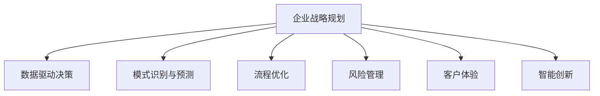

                 

# AI在企业战略规划中的辅助作用

## 1. 背景介绍

### 1.1 问题由来

随着人工智能(AI)技术的飞速发展，AI在企业中的应用日益广泛，从自动化流程优化到决策支持，从客户关系管理到运营分析，AI技术正在深刻地改变着企业的运营方式和战略布局。如何有效利用AI，辅助企业制定科学合理的战略规划，已成为企业管理者关注的焦点。

### 1.2 问题核心关键点

AI在企业战略规划中的辅助作用主要体现在以下几个方面：

- **数据驱动决策**：AI通过分析大量数据，能够识别出企业运营中的关键指标和趋势，辅助管理者做出更为客观和精准的决策。
- **模式识别与预测**：AI能够识别出历史数据中的模式，并基于这些模式进行未来趋势的预测，帮助企业更好地应对未来的挑战和机遇。
- **自动化流程优化**：AI通过优化流程、减少瓶颈，提升企业运营效率，从而在战略规划中考虑资源的最佳配置。
- **智能风险管理**：AI能够识别出潜在的风险因素，并提供风险评估和缓解策略，帮助企业在战略规划中更好地规避风险。

### 1.3 问题研究意义

研究AI在企业战略规划中的辅助作用，对于提升企业管理水平、增强企业竞争力、推动企业可持续发展具有重要意义：

1. **提升决策质量**：利用AI提供的深度洞察和预测分析，企业能够制定更为科学合理的战略规划，避免因主观判断造成的决策失误。
2. **优化资源配置**：AI能够帮助企业识别出运营中的瓶颈和低效环节，优化资源配置，提升整体运营效率。
3. **增强风险管理**：AI通过预测和识别潜在风险，帮助企业提前制定应对策略，降低风险对企业运营的影响。
4. **提升客户体验**：AI技术的应用能够增强企业的客户互动，提供个性化服务，提升客户满意度和忠诚度。
5. **加速创新发展**：AI技术的应用能够推动企业不断创新，保持竞争优势，引领行业发展方向。

## 2. 核心概念与联系

### 2.1 核心概念概述

为了更好地理解AI在企业战略规划中的辅助作用，本节将介绍几个密切相关的核心概念：

- **企业战略规划**：指企业根据内外部环境变化，制定长期发展目标、策略和实施计划的过程。
- **数据驱动决策**：基于数据分析和模型构建的决策过程，强调数据在决策中的核心作用。
- **模式识别与预测**：通过统计分析、机器学习等方法，从历史数据中识别出模式，并预测未来趋势。
- **流程优化**：通过自动化、智能化的方式，改进企业运营流程，提升效率和质量。
- **风险管理**：识别、评估和缓解潜在风险，确保企业运营的稳定性和持续性。
- **客户体验**：通过数据分析和AI技术，提升客户互动和满意度，增强客户忠诚度。
- **智能创新**：利用AI技术推动企业的技术创新和产品开发，保持竞争优势。

这些核心概念之间的逻辑关系可以通过以下Mermaid流程图来展示：



这个流程图展示了几大核心概念之间的相互联系和支持关系：

1. 企业战略规划是整个企业运营的顶层设计，其他概念均在其基础上进行优化和提升。
2. 数据驱动决策、模式识别与预测、流程优化、风险管理、客户体验和智能创新，共同支撑企业战略规划的科学性和有效性。

## 3. 核心算法原理 & 具体操作步骤

### 3.1 算法原理概述

AI在企业战略规划中的辅助作用主要基于以下几个核心原理：

- **数据挖掘与分析**：利用机器学习算法，从海量数据中提取有价值的信息，提供决策支持。
- **预测建模**：使用时间序列分析、回归分析等方法，对未来趋势进行预测，辅助战略规划。
- **优化算法**：通过线性规划、整数规划等方法，优化资源配置和流程设计。
- **风险评估**：采用风险模型和风险指标，识别和评估潜在风险。
- **自然语言处理(NLP)**：利用NLP技术，从非结构化数据中提取结构化信息，提供更深层次的分析。

### 3.2 算法步骤详解

以下是AI在企业战略规划中的具体操作步骤：

1. **数据收集与整理**：收集企业内外部的数据，包括运营数据、市场数据、财务数据、客户数据等，进行清洗和整理，确保数据的质量和一致性。

2. **数据挖掘与分析**：利用机器学习算法，如聚类、分类、回归等，从数据中提取有价值的信息，生成报表和洞察，辅助战略规划。

3. **模式识别与预测**：通过时间序列分析、回归分析等方法，构建预测模型，对未来趋势进行预测，如销售预测、市场趋势预测等。

4. **流程优化**：通过自动化、智能化的方式，优化企业的运营流程，减少瓶颈和浪费，提升整体效率。

5. **风险管理**：使用风险评估模型和指标，识别潜在的风险因素，并提供缓解策略，如风险控制、应急预案等。

6. **客户体验优化**：利用AI技术，提升客户互动和满意度，增强客户忠诚度，如推荐系统、情感分析等。

7. **智能创新推动**：利用AI技术推动企业的技术创新和产品开发，保持竞争优势，如AI辅助研发、智能制造等。

### 3.3 算法优缺点

AI在企业战略规划中具有以下优点：

- **数据驱动**：基于数据进行决策，减少主观判断，提升决策的科学性和准确性。
- **高效性**：自动化流程优化和智能风险管理，提升运营效率，降低风险。
- **全面性**：综合考虑数据驱动、流程优化、风险管理、客户体验和智能创新，提供全方位的支持。
- **可扩展性**：随着数据和技术的不断进步，AI在企业战略规划中的应用可以不断扩展和优化。

同时，也存在以下缺点：

- **依赖数据质量**：数据的质量和完整性直接影响AI分析的结果，需要投入大量时间和资源进行数据处理和清洗。
- **模型复杂性**：构建准确的预测模型和优化算法，需要深厚的技术背景和丰富的经验。
- **技术门槛高**：AI技术的应用需要专业的技术人员，增加了企业的技术门槛和成本。
- **伦理和隐私问题**：AI在处理敏感数据时，需要注意伦理和隐私保护，避免数据滥用。

### 3.4 算法应用领域

AI在企业战略规划中的应用领域非常广泛，包括但不限于以下几个方面：

- **财务规划**：利用AI对企业财务数据进行分析，辅助财务规划和预算编制。
- **市场分析**：通过AI技术分析市场数据，识别市场趋势和机会，辅助市场策略制定。
- **运营优化**：利用AI优化生产流程、物流管理等运营环节，提升效率和降低成本。
- **客户关系管理**：利用AI技术提升客户互动和满意度，增强客户忠诚度，推动客户关系管理。
- **人力资源管理**：利用AI分析员工数据，优化招聘、培训和绩效管理。
- **供应链管理**：通过AI技术优化供应链管理，提升供应链的效率和稳定性。
- **产品研发**：利用AI辅助产品研发，提升产品创新能力和市场竞争力。

## 4. 数学模型和公式 & 详细讲解 & 举例说明

### 4.1 数学模型构建

为了更好地理解AI在企业战略规划中的应用，本节将介绍几个常用的数学模型：

- **线性回归模型**：用于预测企业销售额等连续型变量的模型，公式如下：
$$
y = \beta_0 + \beta_1 x_1 + \beta_2 x_2 + \ldots + \beta_n x_n + \epsilon
$$
其中，$y$ 为目标变量，$x_1, x_2, \ldots, x_n$ 为解释变量，$\beta_0, \beta_1, \beta_2, \ldots, \beta_n$ 为回归系数，$\epsilon$ 为误差项。

- **时间序列模型**：用于预测未来趋势的模型，公式如下：
$$
y_t = \alpha + \beta t + \gamma X_t + \delta \epsilon_t
$$
其中，$y_t$ 为第$t$期的目标变量，$t$ 为时间变量，$X_t$ 为解释变量，$\alpha, \beta, \gamma, \delta$ 为模型参数，$\epsilon_t$ 为误差项。

- **聚类分析模型**：用于对数据进行分类的模型，公式如下：
$$
d_{ij} = \sum_{k=1}^{n} |x_{ik} - x_{jk}|^2
$$
其中，$d_{ij}$ 为样本$i$和样本$j$之间的距离，$x_{ik}$ 为样本$i$在第$k$个特征上的值，$n$ 为特征数量。

### 4.2 公式推导过程

以下是几个数学模型的推导过程：

1. **线性回归模型**：
   - **假设检验**：假设数据满足线性关系，即$y = \beta_0 + \beta_1 x_1 + \beta_2 x_2 + \ldots + \beta_n x_n + \epsilon$。
   - **最小二乘法**：求解回归系数$\beta_0, \beta_1, \beta_2, \ldots, \beta_n$，使得残差平方和最小。
   - **模型评估**：使用$R^2$、均方误差(MSE)等指标评估模型性能。

2. **时间序列模型**：
   - **差分自回归模型**：将原序列转化为平稳序列，即$\Delta y_t = \alpha + \beta \Delta y_{t-1} + \gamma X_t + \delta \epsilon_t$。
   - **自回归模型**：考虑序列自身的滞后项，即$y_t = \alpha + \beta y_{t-1} + \gamma X_t + \delta \epsilon_t$。
   - **模型预测**：使用模型对未来数据进行预测，生成预测结果。

3. **聚类分析模型**：
   - **欧氏距离**：计算样本之间的距离，即$d_{ij} = \sum_{k=1}^{n} |x_{ik} - x_{jk}|^2$。
   - **K-means算法**：通过迭代优化，将样本分为$K$个簇，每个簇的质心为该簇所有样本的平均值。
   - **模型评估**：使用轮廓系数等指标评估聚类效果。

### 4.3 案例分析与讲解

**案例1：财务数据分析**

某企业希望通过AI技术对财务数据进行分析，辅助财务规划和预算编制。首先，收集过去几年的销售数据、成本数据、市场数据等，构建线性回归模型，预测未来一年的销售额和成本。其次，利用时间序列模型，对未来的销售趋势进行预测。最后，结合财务预算模型，生成综合预算方案，辅助管理层决策。

**案例2：客户关系管理**

某零售企业希望通过AI技术提升客户关系管理水平，增强客户忠诚度。首先，收集客户的历史购买数据、浏览数据、反馈数据等，利用聚类分析模型，将客户分为不同的客户群体。其次，利用推荐系统，为不同客户群体提供个性化的推荐服务。最后，结合情感分析模型，监测客户对品牌的情感变化，优化产品和服务策略。

## 5. 项目实践：代码实例和详细解释说明

### 5.1 开发环境搭建

在进行AI在企业战略规划中的应用实践前，我们需要准备好开发环境。以下是使用Python进行Scikit-Learn和TensorFlow开发的简单环境配置流程：

1. 安装Anaconda：从官网下载并安装Anaconda，用于创建独立的Python环境。

2. 创建并激活虚拟环境：
```bash
conda create -n py3.8 python=3.8 
conda activate py3.8
```

3. 安装Scikit-Learn和TensorFlow：
```bash
pip install scikit-learn tensorflow
```

4. 安装各类工具包：
```bash
pip install pandas numpy matplotlib seaborn jupyter notebook
```

完成上述步骤后，即可在`py3.8`环境中开始AI项目实践。

### 5.2 源代码详细实现

这里我们以线性回归模型的应用为例，给出使用Scikit-Learn库进行财务数据分析的Python代码实现。

```python
from sklearn.linear_model import LinearRegression
from sklearn.metrics import mean_squared_error, r2_score
import numpy as np

# 构建样本数据
X = np.array([[1, 2], [2, 3], [3, 4], [4, 5], [5, 6]])
y = np.array([1, 2, 3, 4, 5])

# 构建线性回归模型
model = LinearRegression().fit(X, y)

# 预测新数据
X_new = np.array([[6, 7], [7, 8]])
y_pred = model.predict(X_new)

# 模型评估
mse = mean_squared_error(y, y_pred)
r2 = r2_score(y, y_pred)

print(f"Mean Squared Error: {mse}")
print(f"R-squared: {r2}")
```

### 5.3 代码解读与分析

让我们再详细解读一下关键代码的实现细节：

**线性回归模型**：
- `LinearRegression`类：Scikit-Learn提供的线性回归模型，用于拟合线性关系。
- `fit(X, y)`方法：拟合模型，将样本数据$X$和目标变量$y$作为输入，输出模型参数。
- `predict(X_new)`方法：对新数据$X_new$进行预测，返回预测结果。
- `mean_squared_error(y, y_pred)`函数：计算预测结果与真实值之间的均方误差。
- `r2_score(y, y_pred)`函数：计算预测结果与真实值之间的R-squared系数，衡量模型拟合程度。

**代码解读与分析**：
- `X`和`y`分别代表样本数据和目标变量的数组。
- `model.fit(X, y)`方法拟合模型，生成线性回归方程$\beta_0 + \beta_1 x_1 + \beta_2 x_2$。
- `X_new`代表新数据，`y_pred`代表预测结果。
- `mse`和`r2`分别代表均方误差和R-squared系数，用于评估模型性能。

## 6. 实际应用场景

### 6.1 智能财务规划

AI技术在财务规划中的应用，可以通过自动化财务分析和预测，辅助企业制定更为科学合理的财务规划。通过收集企业的历史财务数据，构建线性回归和时间序列模型，预测未来一年的收入、成本、利润等财务指标，帮助企业制定更精准的预算方案和资金分配策略。

### 6.2 市场分析与趋势预测

AI技术在市场分析中的应用，可以通过数据分析和预测，识别市场趋势和机会，辅助企业制定市场策略。通过收集市场数据、竞争对手数据、行业数据等，构建聚类分析和回归模型，预测市场规模、增长趋势、竞争格局等，为企业的市场扩展和产品研发提供决策依据。

### 6.3 运营流程优化

AI技术在运营流程优化中的应用，可以通过自动化和智能化，提升企业运营效率。通过收集企业的运营数据，构建流程优化模型，识别流程瓶颈和低效环节，优化资源配置，提升整体运营效率。例如，利用机器学习算法优化生产调度，提升生产效率；利用优化算法优化物流管理，降低物流成本。

### 6.4 智能风险管理

AI技术在风险管理中的应用，可以通过识别和评估潜在风险，辅助企业制定风险应对策略。通过收集企业的内部和外部数据，构建风险评估模型，识别潜在风险因素，提供风险预警和缓解策略，帮助企业应对市场变化和不可预测事件，保障运营稳定性和持续性。

### 6.5 客户关系管理

AI技术在客户关系管理中的应用，可以通过数据分析和个性化推荐，提升客户互动和满意度。通过收集客户的购买数据、浏览数据、反馈数据等，构建聚类分析和推荐系统，提供个性化的推荐服务，提升客户体验和忠诚度。例如，利用推荐系统为每个客户推荐感兴趣的产品，利用情感分析模型监测客户情感变化，优化产品和服务策略。

## 7. 工具和资源推荐

### 7.1 学习资源推荐

为了帮助开发者系统掌握AI在企业战略规划中的应用，这里推荐一些优质的学习资源：

1. **《Python数据科学手册》**：全面介绍了Python在数据分析和机器学习中的应用，适合初学者和进阶者学习。
2. **Coursera《机器学习》课程**：斯坦福大学提供的机器学习课程，涵盖机器学习的基础和高级内容，适合学习者系统学习。
3. **Kaggle**：数据科学和机器学习竞赛平台，提供大量公开数据集和竞赛，适合实践和竞赛练习。
4. **Google Cloud AI & Machine Learning**：Google提供的AI和机器学习平台，包含丰富的教程和实例，适合实战练习。
5. **《深度学习入门》系列书籍**：深入浅出地介绍了深度学习的基本原理和实践技巧，适合初学者和从业人员学习。

通过对这些资源的学习实践，相信你一定能够快速掌握AI在企业战略规划中的应用，并用于解决实际的业务问题。

### 7.2 开发工具推荐

高效的开发离不开优秀的工具支持。以下是几款用于AI在企业战略规划开发的常用工具：

1. **Python**：作为数据科学和机器学习的主流语言，Python提供了丰富的科学计算库和机器学习框架，如Scikit-Learn、TensorFlow等。
2. **Jupyter Notebook**：Python的交互式开发环境，支持代码块的运行和输出，适合进行数据探索和模型验证。
3. **TensorFlow**：Google提供的开源深度学习框架，支持大规模模型训练和优化，适合处理复杂的数据分析和预测任务。
4. **Scikit-Learn**：基于Python的科学计算库，提供了丰富的机器学习算法和模型评估工具，适合进行数据分析和模型构建。
5. **RapidMiner**：数据科学和机器学习平台，支持数据预处理、模型构建、可视化等多种功能，适合企业应用。

合理利用这些工具，可以显著提升AI在企业战略规划中的应用效率，加快创新迭代的步伐。

### 7.3 相关论文推荐

AI在企业战略规划中的应用源于学界的持续研究。以下是几篇奠基性的相关论文，推荐阅读：

1. **《企业战略规划中的数据驱动决策：案例研究》**：介绍数据驱动决策在企业战略规划中的应用，分析数据驱动决策的优势和挑战。
2. **《基于AI的财务规划与预算编制》**：探讨AI技术在财务规划中的应用，介绍线性回归和时间序列模型在财务预测中的应用。
3. **《AI在市场分析与趋势预测中的应用》**：分析AI技术在市场分析和趋势预测中的应用，探讨聚类分析和回归模型在市场预测中的应用。
4. **《智能风险管理中的AI技术应用》**：研究AI在风险管理中的应用，介绍风险评估模型和缓解策略。
5. **《客户关系管理中的AI应用》**：探讨AI技术在客户关系管理中的应用，介绍聚类分析和推荐系统在客户互动中的应用。

这些论文代表了大语言模型微调技术的发展脉络。通过学习这些前沿成果，可以帮助研究者把握学科前进方向，激发更多的创新灵感。

## 8. 总结：未来发展趋势与挑战

### 8.1 总结

本文对AI在企业战略规划中的辅助作用进行了全面系统的介绍。首先阐述了AI技术在企业战略规划中的重要性和应用场景，明确了AI技术在数据驱动决策、模式识别与预测、流程优化、风险管理、客户体验和智能创新等方面的核心作用。其次，从原理到实践，详细讲解了AI在企业战略规划中的操作步骤和数学模型，给出了具体的代码实现和案例分析。同时，本文还广泛探讨了AI技术在企业战略规划中的未来发展趋势和面临的挑战，展示了AI技术的广阔前景和巨大潜力。

通过本文的系统梳理，可以看到，AI技术在企业战略规划中的应用正在逐渐深入，成为企业决策和运营的重要工具。得益于AI技术的不断进步，企业能够在数据驱动、预测分析、流程优化、风险管理、客户体验和智能创新等方面取得显著提升，提升整体竞争力和运营效率。未来，伴随AI技术的进一步发展和应用，相信企业战略规划将迎来更多创新和突破。

### 8.2 未来发展趋势

展望未来，AI在企业战略规划中的应用将呈现以下几个发展趋势：

1. **数据驱动决策的普及**：随着数据获取和处理技术的进步，企业将越来越依赖数据驱动的决策方式，提升决策的科学性和准确性。
2. **预测分析的深入**：AI技术在预测分析方面的应用将越来越广泛，覆盖更多领域和维度，提供更为精准的预测结果。
3. **流程优化的自动化**：自动化流程优化将逐渐普及，利用AI技术提升企业运营效率，降低运营成本。
4. **风险管理的智能化**：AI技术在风险管理中的应用将更加智能化和实时化，提高企业应对风险的能力。
5. **客户体验的个性化**：AI技术将更多地应用于客户互动和个性化推荐，提升客户体验和忠诚度。
6. **智能创新的引领**：AI技术将推动企业的技术创新和产品开发，引领行业发展方向。

以上趋势凸显了AI在企业战略规划中的巨大潜力。这些方向的探索发展，必将进一步提升企业的决策水平、运营效率和市场竞争力。

### 8.3 面临的挑战

尽管AI在企业战略规划中已经取得了显著成就，但在迈向更加智能化、普适化应用的过程中，仍面临诸多挑战：

1. **数据质量和数量**：AI技术的应用依赖于高质量和大量数据，企业需要投入大量资源进行数据收集和处理。
2. **技术复杂性**：AI技术的复杂性和高门槛需要企业投入专业的技术人员，增加了技术实施难度。
3. **伦理和隐私问题**：AI技术在处理敏感数据时，需要注意伦理和隐私保护，避免数据滥用。
4. **系统集成难度**：AI技术的应用需要与企业现有系统进行集成，增加了系统集成的复杂性和成本。
5. **模型可解释性**：AI模型通常具有"黑盒"特性，缺乏可解释性，需要进一步提高模型的透明性和可解释性。

这些挑战需要企业在技术、管理和伦理等方面进行全面考虑和应对。只有在技术和应用的各个环节进行优化和改进，才能充分发挥AI在企业战略规划中的辅助作用，实现企业的高质量发展和可持续发展。

### 8.4 研究展望

面对AI在企业战略规划中面临的挑战，未来的研究需要在以下几个方面寻求新的突破：

1. **数据获取与处理**：探索更加高效的数据获取和处理技术，降低数据获取成本，提高数据处理效率。
2. **模型简化与优化**：简化模型结构，优化算法效率，降低技术门槛，提高应用的可扩展性。
3. **伦理与隐私保护**：加强数据隐私保护和伦理约束，确保AI技术的应用符合道德和法律规范。
4. **系统集成与互操作性**：提升系统集成能力，增强企业系统的互操作性和兼容性。
5. **模型透明性与可解释性**：提高AI模型的透明性和可解释性，增强模型的可信度和可解释性。

这些研究方向的探索，必将引领AI在企业战略规划中走向更加智能化、普适化和可持续发展，为企业的创新发展提供强有力的技术支撑。

## 9. 附录：常见问题与解答

**Q1：AI在企业战略规划中的优势是什么？**

A: AI在企业战略规划中的优势主要体现在以下几个方面：
1. **数据驱动决策**：基于大量数据进行分析，减少主观判断，提升决策的科学性和准确性。
2. **自动化流程优化**：利用AI技术，自动化企业运营流程，提升效率和降低成本。
3. **智能化风险管理**：通过AI技术，识别和评估潜在风险，提供风险预警和缓解策略，保障企业运营稳定。
4. **个性化客户体验**：利用AI技术，提升客户互动和满意度，增强客户忠诚度。
5. **创新驱动发展**：利用AI技术，推动企业技术创新和产品开发，保持竞争优势。

**Q2：如何选择合适的AI模型？**

A: 选择合适的AI模型需要考虑以下几个方面：
1. **问题类型**：根据具体问题类型选择合适的模型，如回归问题选择线性回归模型，分类问题选择决策树模型等。
2. **数据特征**：考虑数据的特征和分布，选择适合的模型，如稀疏数据选择随机森林模型，高维度数据选择降维模型等。
3. **计算资源**：考虑模型的计算复杂度和资源需求，选择适合的模型，如线性模型计算复杂度低，适合大规模数据集，深度学习模型计算复杂度高，适合小规模数据集。
4. **模型可解释性**：考虑模型的透明性和可解释性，选择适合的模型，如决策树模型透明性强，适合解释性要求高的场景。

**Q3：如何提高AI模型的性能？**

A: 提高AI模型的性能需要从以下几个方面进行优化：
1. **数据质量**：提高数据的质量和数量，增加样本多样性和代表性，减少噪音和异常值。
2. **模型选择**：选择合适的模型，考虑问题类型、数据特征和计算资源，选择最适合的模型。
3. **模型调参**：优化模型的参数，如学习率、正则化系数等，提高模型的准确性和泛化能力。
4. **特征工程**：优化特征提取和选择，提高模型的特征表达能力。
5. **模型集成**：采用模型集成技术，如Bagging、Boosting等，提高模型的稳定性和鲁棒性。

**Q4：AI在企业战略规划中的应用前景如何？**

A: AI在企业战略规划中的应用前景非常广阔，未来将会有更多的创新和突破：
1. **数据驱动决策**：未来数据驱动决策将成为企业决策的主流方式，AI技术将深入各个业务环节，提升决策的科学性和准确性。
2. **预测分析**：未来预测分析将覆盖更多领域和维度，提供更为精准的预测结果，为企业战略规划提供更为可靠的依据。
3. **流程自动化**：未来自动化流程优化将成为企业运营的标准配置，利用AI技术提升企业运营效率，降低运营成本。
4. **智能风险管理**：未来AI技术在风险管理中的应用将更加智能化和实时化，提高企业应对风险的能力。
5. **个性化客户体验**：未来AI技术将更多地应用于客户互动和个性化推荐，提升客户体验和忠诚度。
6. **智能创新引领**：未来AI技术将推动企业的技术创新和产品开发，引领行业发展方向。

---

作者：禅与计算机程序设计艺术 / Zen and the Art of Computer Programming

