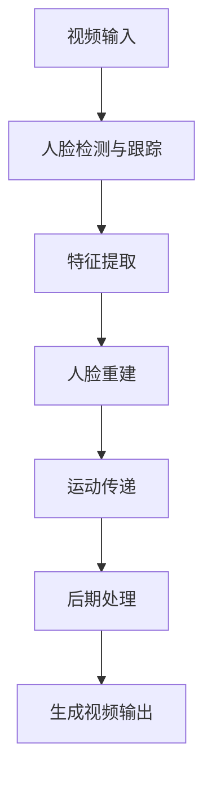

以下是技术博客文章的正文内容：

# AIGC从入门到实战：登录 D-ID

## 1. 背景介绍

### 1.1 人工智能生成内容(AIGC)的兴起

人工智能生成内容(AIGC)是指利用人工智能技术生成文本、图像、音频、视频等各种形式的内容。近年来,AIGC技术取得了长足进步,在各个领域都有广泛应用。其中,文本生成、图像生成、视频生成等技术尤为突出。

### 1.2 D-ID公司简介

D-ID是一家专注于人工智能驱动的视觉生成技术的先驱公司。它开发了一种独特的技术,可以生成逼真的人脸视频,并将其应用于广告、娱乐和安全等多个行业。D-ID的技术通过分析现有视频并提取关键特征,然后结合人工智能算法生成全新的人脸视频。

## 2. 核心概念与联系

### 2.1 生成对抗网络(GAN)

生成对抗网络(Generative Adversarial Networks, GAN)是AIGC领域的核心技术之一。GAN由两个神经网络组成:生成器(Generator)和判别器(Discriminator)。生成器的目标是生成逼真的数据样本,而判别器则试图区分生成的样本和真实数据。通过这种对抗训练,生成器不断改进以欺骗判别器,最终可以生成高质量的数据。


### 2.2 人脸捕捉与重建

人脸捕捉是指从视频或图像中提取人脸特征和运动信息。人脸重建则是根据捕捉到的信息,生成全新的人脸视频。D-ID的技术就是利用GAN结合人脸捕捉与重建技术,实现逼真人脸视频的生成。

### 2.3 深度学习与迁移学习

深度学习是AIGC技术的核心基础。D-ID利用卷积神经网络(CNN)和递归神经网络(RNN)等深度学习模型,从大量真实视频数据中学习人脸特征和运动模式。此外,D-ID还采用了迁移学习技术,将在大型数据集上预训练的模型应用到特定任务,提高了模型的准确性和效率。

## 3. 核心算法原理具体操作步骤

D-ID的人脸视频生成技术主要包括以下几个步骤:

1. **人脸检测与跟踪**:利用深度学习模型从视频中检测和跟踪人脸区域。
2. **特征提取**:从检测到的人脸区域中提取关键特征,如面部姿态、表情、纹理等。
3. **人脸重建**:根据提取的特征,结合GAN生成新的人脸图像序列。
4. **运动传递**:将原始视频中的运动信息传递到生成的人脸视频中,使其看起来更加自然流畅。
5. **后期处理**:对生成的人脸视频进行去噪、增强等后期处理,提高视频质量。



## 4. 数学模型和公式详细讲解举例说明

### 4.1 生成对抗网络数学模型

生成对抗网络的目标是训练生成器 $G$ 和判别器 $D$,使得生成的数据分布 $p_g$ 尽可能接近真实数据分布 $p_{data}$。数学上可以表示为:

$$\min_G \max_D V(D, G) = \mathbb{E}_{x \sim p_{data}(x)}[\log D(x)] + \mathbb{E}_{z \sim p_z(z)}[\log(1 - D(G(z)))]$$

其中, $x$ 是真实数据样本, $z$ 是随机噪声向量, $G(z)$ 是生成器输出的假样本。判别器 $D$ 试图最大化对真实样本的评分和对假样本的否定评分,而生成器 $G$ 则试图最小化判别器对假样本的否定评分。

### 4.2 人脸重建算法

D-ID采用了基于3D模型的人脸重建算法。首先,从视频中提取人脸特征,包括面部姿态、表情参数等。然后,将这些特征映射到一个3D人脸模型上,生成对应的3D人脸网格。最后,将3D人脸网格渲染成2D图像序列,即生成的人脸视频。

设 $\mathbf{p}$ 为人脸特征向量, $\mathbf{M}$ 为3D人脸模型,那么人脸重建过程可以表示为:

$$\mathbf{V} = \mathcal{R}(\mathbf{M}(\mathbf{p}))$$

其中, $\mathbf{M}(\mathbf{p})$ 是将人脸特征映射到3D模型的函数, $\mathcal{R}$ 是将3D模型渲染成2D图像序列的渲染函数, $\mathbf{V}$ 是生成的人脸视频。

## 5. 项目实践: 代码实例和详细解释说明

以下是使用PyTorch实现的简化版D-ID人脸视频生成代码:

```python
import torch
import torch.nn as nn

# 定义生成器
class Generator(nn.Module):
    def __init__(self, z_dim, img_shape):
        super(Generator, self).__init__()
        self.z_dim = z_dim
        self.img_shape = img_shape
        
        # 定义生成器网络结构
        # ...

    def forward(self, z):
        # 生成人脸视频
        # ...
        return fake_video

# 定义判别器
class Discriminator(nn.Module):
    def __init__(self, img_shape):
        super(Discriminator, self).__init__()
        self.img_shape = img_shape
        
        # 定义判别器网络结构
        # ...

    def forward(self, video):
        # 判别真实或假视频
        # ...
        return validity

# 初始化生成器和判别器
z_dim = 100
img_shape = (3, 64, 64)
G = Generator(z_dim, img_shape)
D = Discriminator(img_shape)

# 定义损失函数和优化器
criterion = nn.BCELoss()
g_optimizer = torch.optim.Adam(G.parameters(), lr=0.0002)
d_optimizer = torch.optim.Adam(D.parameters(), lr=0.0002)

# 训练循环
for epoch in range(num_epochs):
    for real_videos, _ in dataloader:
        # 训练判别器
        z = torch.randn(batch_size, z_dim)
        fake_videos = G(z)
        
        d_real = D(real_videos)
        d_fake = D(fake_videos.detach())
        
        d_loss = criterion(d_real, torch.ones_like(d_real)) + criterion(d_fake, torch.zeros_like(d_fake))
        d_loss.backward()
        d_optimizer.step()
        
        # 训练生成器
        z = torch.randn(batch_size, z_dim)
        fake_videos = G(z)
        
        g_fake = D(fake_videos)
        g_loss = criterion(g_fake, torch.ones_like(g_fake))
        g_loss.backward()
        g_optimizer.step()

# 生成人脸视频
z = torch.randn(1, z_dim)
fake_video = G(z)
```

这段代码实现了一个简化版的生成对抗网络,用于生成人脸视频。生成器 `Generator` 接受一个随机噪声向量 `z`,并生成一个假的人脸视频 `fake_video`。判别器 `Discriminator` 则判断输入的视频是真实的还是生成的。

在训练过程中,首先训练判别器,使其能够很好地区分真实视频和生成视频。然后,训练生成器,目标是使生成的假视频能够欺骗判别器,即判别器将假视频判断为真实视频。通过这种对抗训练,生成器最终能够生成逼真的人脸视频。

## 6. 实际应用场景

D-ID的人脸视频生成技术在多个领域都有广泛的应用:

1. **广告与营销**:可以生成知名人物的虚拟代言视频,提高广告的吸引力和影响力。
2. **娱乐业**:可以为电影、电视剧等创作全新的虚拟角色,降低制作成本。
3. **教育培训**:生成逼真的虚拟教师视频,提供更加生动和互动的教学体验。
4. **安全领域**:生成虚拟人物视频,用于训练人脸识别系统,提高系统的鲁棒性。
5. **社交媒体**:用户可以创建自己的虚拟形象,增强社交体验。

## 7. 工具和资源推荐

以下是一些与AIGC和D-ID技术相关的工具和资源:

- **PyTorch**:一个流行的深度学习框架,D-ID的技术就是基于PyTorch实现的。
- **TensorFlow**:另一个广泛使用的深度学习框架,也支持AIGC相关任务。
- **OpenCV**:一个强大的计算机视觉库,可用于人脸检测和跟踪等任务。
- **Dlib**:一个C++库,提供了人脸landmark检测等功能。
- **FaceSwap**:一个开源项目,实现了人脸交换功能。
- **DeepFaceLab**:另一个开源项目,专注于人脸替换和生成。

## 8. 总结: 未来发展趋势与挑战

AIGC技术正在快速发展,未来将会有更多令人兴奋的进展和应用。但同时,也面临着一些挑战和问题:

1. **伦理和隐私问题**:AIGC技术可能被滥用于制作虚假信息和深度伪造视频,引发安全和隐私风险。
2. **版权和知识产权**:生成的内容可能侵犯原创作品的版权,需要制定相应的法律法规。
3. **算力和计算资源**:训练大型AIGC模型需要巨大的算力和计算资源,成本高昂。
4. **数据质量和偏差**:训练数据的质量和多样性直接影响模型的表现,需要注意数据偏差问题。
5. **模型解释性**:大多数AIGC模型是黑箱模型,缺乏解释性,难以理解其内部工作原理。

未来,AIGC技术将继续推动人工智能在各个领域的应用,但也需要解决上述挑战,以确保技术的可持续发展和负责任的使用。

## 9. 附录: 常见问题与解答

1. **AIGC技术真的能生成逼真的人脸视频吗?**

答:是的,AIGC技术已经可以生成非常逼真的人脸视频。D-ID等公司的技术就证明了这一点。但需要注意,生成的视频仍然可能存在细微的缺陷和不自然之处。

2. **AIGC生成的内容是否会侵犯版权?**

答:这是一个值得关注的问题。生成的内容如果过于接近原创作品,可能会构成版权侵犯。目前,相关法律法规仍在不断完善中。

3. **AIGC技术会不会导致某些行业的从业者失业?**

答:AIGC技术的确可能会对某些行业产生一定影响,例如广告、营销、内容创作等领域。但同时,它也会带来新的就业机会和发展空间。关键是要适应技术变革,提升自身技能。

4. **如何防止AIGC技术被滥用于制作虚假信息?**

答:这需要多方面的努力,包括加强技术监管、提高公众媒体素养、开发检测伪造内容的工具等。同时,AIGC技术本身也需要加入一些防伪机制。

5. **AIGC技术的发展前景如何?**

答:AIGC技术未来将会得到更广泛的应用,在内容创作、虚拟现实、人机交互等领域发挥重要作用。但同时也需要解决一些技术和伦理挑战,以确保其可持续发展。

作者: 禅与计算机程序设计艺术 / Zen and the Art of Computer Programming