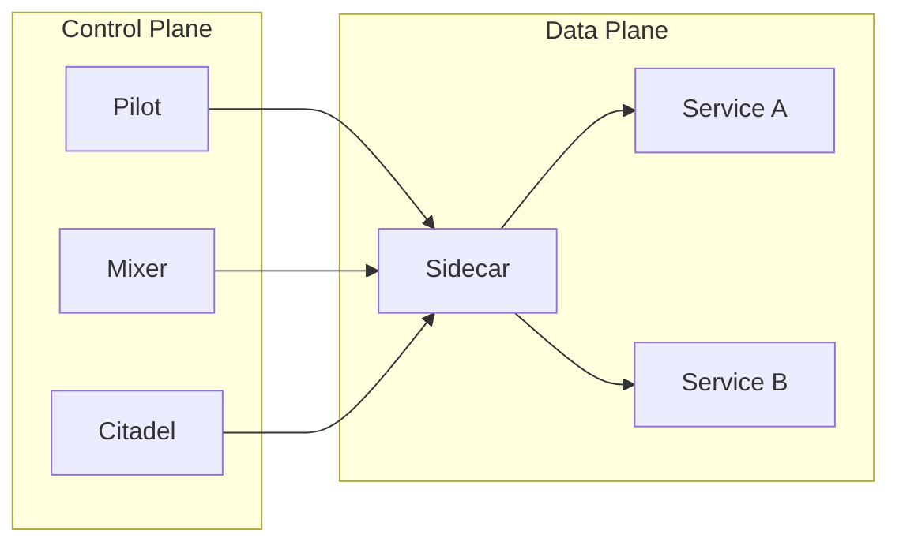

# AI系统Istio原理与代码实战案例讲解

## 1. 背景介绍
### 1.1 服务网格的兴起
在现代微服务架构中,服务之间的通信变得越来越复杂。为了应对这种复杂性,服务网格(Service Mesh)应运而生。服务网格是一种基础设施层,它负责处理服务间的通信、安全、可观测性等问题,让开发人员可以专注于业务逻辑的开发。

### 1.2 Istio的诞生
Istio是目前最流行的服务网格实现之一。它由Google、IBM和Lyft联合开发,于2017年开源。Istio提供了一种透明的方式来管理微服务,包括流量管理、安全认证、监控等功能。

### 1.3 Istio的优势
与传统的微服务框架相比,Istio有以下优势:

1. 语言无关:Istio可以与任何编程语言编写的微服务一起工作。
2. 平台无关:Istio可以运行在各种环境中,包括本地机器、云平台等。
3. 可扩展:Istio采用了插件化的架构设计,可以方便地扩展其功能。

## 2. 核心概念与联系
### 2.1 服务网格的核心概念
服务网格中有几个核心概念:

- 数据平面(Data Plane):负责处理服务间的实际通信。
- 控制平面(Control Plane):负责配置和管理数据平面。
- Sidecar:与应用服务部署在一起的代理,用于处理服务间的通信。

### 2.2 Istio的架构
Istio采用了一种分层的架构设计,主要分为数据平面和控制平面两部分:

- 数据平面:由一组智能代理(Envoy)组成,它们与应用服务部署在一起,负责处理服务间的通信。
- 控制平面:包括Pilot、Mixer、Citadel等组件,负责配置管理、策略控制和安全认证。

下图展示了Istio的整体架构:



### 2.3 Istio的关键功能
Istio提供了以下关键功能:

- 流量管理:控制服务之间的流量和API调用,实现灰度发布、A/B测试等。
- 可观测性:提供了服务间的调用链追踪、监控指标收集等功能。
- 安全:提供了服务间的认证、鉴权和加密通信等安全特性。
- 策略执行:允许对服务应用访问控制策略。

## 3. 核心算法原理具体操作步骤
### 3.1 流量管理
Istio的流量管理主要通过以下步骤实现:

1. 定义服务网格:在Kubernetes中部署Istio控制平面和数据平面。
2. 配置路由规则:通过VirtualService和DestinationRule定义服务间的路由规则。
3. 注入Sidecar:在应用的Pod中注入Istio Sidecar代理。
4. 应用路由规则:Pilot将路由规则下发到Sidecar代理,由代理负责转发流量。

### 3.2 可观测性
Istio的可观测性主要通过以下步骤实现:

1. 收集指标:Mixer从Sidecar代理收集各种指标,如请求数、响应时间等。
2. 生成调用链:Sidecar代理在请求头中插入Trace相关的信息,最终生成分布式调用链。
3. 可视化展示:通过Grafana、Jaeger等工具展示收集到的指标和调用链信息。

### 3.3 安全
Istio的安全功能主要通过以下步骤实现:

1. 身份验证:Citadel为每个服务颁发证书,用于服务间的身份验证。
2. 通信加密:Sidecar代理之间通过mTLS进行加密通信,保证数据安全。
3. 访问控制:通过AuthorizationPolicy定义服务的访问控制策略。

## 4. 数学模型和公式详细讲解举例说明
### 4.1 流量分割
Istio支持按比例对流量进行分割,这里用到了权重的概念。假设有两个版本的服务,分别为v1和v2,要将20%的流量导向v2,可以这样定义:

```yaml
apiVersion: networking.istio.io/v1alpha3
kind: VirtualService
metadata:
  name: my-service
spec:
  hosts:
  - my-service
  http:
  - route:
    - destination:
        host: my-service
        subset: v1
      weight: 80
    - destination:
        host: my-service
        subset: v2
      weight: 20
```

数学模型如下:

$$
P(v1) = \frac{weight(v1)}{weight(v1) + weight(v2)} = \frac{80}{80 + 20} = 0.8 \\
P(v2) = \frac{weight(v2)}{weight(v1) + weight(v2)} = \frac{20}{80 + 20} = 0.2
$$

其中,$P(v1)$和$P(v2)$分别表示请求被路由到v1和v2的概率。

### 4.2 断路器
Istio支持断路器(Circuit Breaker)功能,用于在服务出现故障时快速失败,防止故障扩散。断路器的数学模型可以用泊松分布来描述。

假设请求的到达服务的速率为$\lambda$,服务的处理时间服从参数为$\mu$的指数分布,那么系统的稳态分布为:

$$
P(X = k) = \frac{(\lambda/\mu)^k}{k!}e^{-\lambda/\mu}
$$

其中,$X$表示系统中请求的数量,$P(X = k)$表示系统中有$k$个请求的概率。

当$\lambda/\mu$超过某个阈值时,就会触发断路器,快速失败新到来的请求,防止系统过载。

## 5. 项目实践:代码实例和详细解释说明
下面通过一个简单的示例来演示Istio的基本使用。

### 5.1 部署应用
首先,部署一个简单的Bookinfo应用,它由四个微服务组成:

```bash
kubectl apply -f samples/bookinfo/platform/kube/bookinfo.yaml
```

### 5.2 注入Sidecar
为应用的Pod注入Istio Sidecar代理:

```bash
kubectl apply -f samples/bookinfo/platform/kube/bookinfo-add-sidecar.yaml
```

### 5.3 定义路由规则
创建一个VirtualService,将流量都路由到v1版本的服务:

```yaml
apiVersion: networking.istio.io/v1alpha3 
kind: VirtualService
metadata:
  name: bookinfo
spec:
  hosts:
  - "*"
  gateways:
  - bookinfo-gateway
  http:
  - match:
    - uri:
        exact: /productpage
    route:
    - destination:
        host: productpage
        subset: v1
```

### 5.4 验证路由规则
访问应用,可以看到流量都被路由到了v1版本的服务。

### 5.5 切换流量
修改VirtualService,将90%的流量导向v1,10%导向v2:

```yaml
apiVersion: networking.istio.io/v1alpha3
kind: VirtualService
metadata:
  name: bookinfo
spec:
  hosts:
  - "*" 
  gateways:
  - bookinfo-gateway
  http:
  - route:
    - destination:
        host: productpage
        subset: v1
      weight: 90
    - destination:
        host: productpage
        subset: v2
      weight: 10
```

多次访问应用,可以看到大约有10%的请求返回的是v2版本的结果。

## 6. 实际应用场景
Istio在实际生产环境中有非常广泛的应用,下面列举几个典型场景:

### 6.1 灰度发布
通过Istio可以很容易地实现灰度发布。例如,可以先将新版本服务的流量配置为10%,观察一段时间后再逐渐增加流量,最终完全切换到新版本。

### 6.2 A/B测试
Istio支持按请求内容路由,可以用于A/B测试。例如,可以将来自特定用户群的请求路由到某个特定版本的服务。

### 6.3 故障注入
Istio支持故障注入,可以用于测试应用的健壮性。例如,可以模拟服务的延迟或异常,观察应用的行为。

### 6.4 安全加固
Istio提供了服务间的认证和加密通信,可以大大提高应用的安全性。例如,可以为敏感服务启用严格的访问控制策略。

## 7. 工具和资源推荐
下面推荐一些学习和使用Istio的工具和资源:

- [官方文档](https://istio.io/latest/docs/):Istio的官方文档,包含了详尽的概念解释、使用指南等。
- [Katacoda教程](https://www.katacoda.com/courses/istio):一个交互式的Istio教程,可以在线动手实践。
- [Istio Handbook](https://www.servicemesher.com/istio-handbook/):由ServiceMesher社区出品的Istio实践指南。
- [Istio官方博客](https://istio.io/latest/blog/):Istio官方博客,定期发布最新动态和技术文章。

## 8. 总结:未来发展趋势与挑战
### 8.1 发展趋势
Istio正在快速发展,未来的一些发展趋势包括:

- 与无服务器(Serverless)架构的结合
- 支持更多的数据平面,如Apache APISIX
- 简化配置,提高易用性
- 提供更多开箱即用的功能,如分布式事务

### 8.2 挑战
Istio也面临着一些挑战,例如:

- 性能开销:引入Sidecar代理不可避免地会带来一定的性能损失。
- 学习成本:Istio的概念和配置较为复杂,学习曲线较陡峭。
- 生态集成:与现有的微服务框架和工具集成还需要进一步加强。

尽管存在挑战,但Istio仍然是服务网格领域的佼佼者,相信通过社区的共同努力,Istio会变得越来越成熟和易用。

## 9. 附录:常见问题与解答
### 9.1 Istio与Kubernetes的关系是什么?
Istio是一个独立的服务网格,可以运行在Kubernetes之上,但并不依赖Kubernetes。Istio利用了Kubernetes的一些概念(如Service、Deployment等),但也可以运行在其他平台上。

### 9.2 Istio是否支持异构环境?
支持。Istio可以管理不同语言、不同框架开发的微服务,也支持虚机和容器混合环境。

### 9.3 Sidecar代理会不会成为性能瓶颈?
Sidecar代理会带来一定的性能开销,但Istio使用了高性能的Envoy代理,经过优化后,性能损失可以控制在一个比较小的范围内。而且,Istio带来的好处(如安全、可观测性等)通常可以抵消这些性能损失。

### 9.4 Istio是否有控制平面的单点故障问题?
Istio支持控制平面的高可用部署,可以避免单点故障。例如,可以部署多个Pilot实例,Sidecar代理会自动连接到可用的Pilot实例。

作者:禅与计算机程序设计艺术 / Zen and the Art of Computer Programming