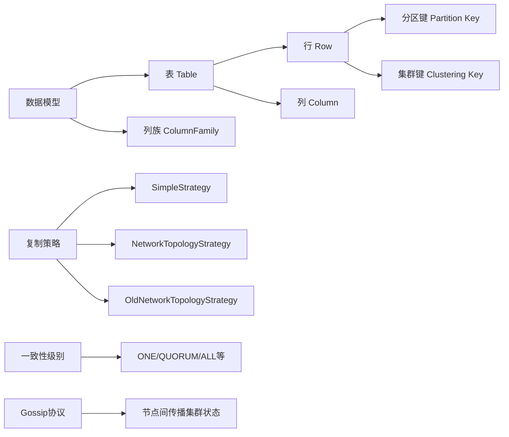

# Cassandra原理与代码实例讲解

## 1. 背景介绍

### 1.1 Cassandra的起源与发展历程
Cassandra最初由Facebook开发,用于支撑其收件箱搜索功能。2008年Facebook将Cassandra作为开源项目发布,此后Cassandra成为Apache软件基金会的顶级项目之一。多年来,Cassandra不断发展完善,成为了一款高度可扩展、高可用、高性能的分布式NoSQL数据库。

### 1.2 Cassandra的特点与优势
Cassandra具有如下特点和优势:  
- 分布式架构,可线性扩展
- 无单点故障,高可用性
- 灵活的数据模型
- 强一致性与最终一致性可调
- 多数据中心支持
- 丰富的查询语言CQL

### 1.3 Cassandra的应用场景
Cassandra非常适合应用于对写入性能、可扩展性、高可用性要求较高的场景,如:
- 物联网数据
- 时序数据 
- 用户活动记录
- 消息系统
- 内容管理系统等

## 2. 核心概念与联系

### 2.1 数据模型
Cassandra使用了宽列存储模型,数据以表(Table)的形式存储。一个表由多行(Row)组成,每行可以包含多个列(Column)。表可以在一个列族(ColumnFamily)中定义,列族类似于关系型数据库中的表。

### 2.2 分区键与集群键
Cassandra通过分区键(Partition Key)将数据分发到不同的节点。在一个分区内,数据按照集群键(Clustering Key)排序。合理设计分区键和集群键可以显著提升查询性能。

### 2.3 复制策略
Cassandra通过复制(Replication)保证数据的高可用和容错。常见的复制策略有:  
- SimpleStrategy: 适用于单数据中心
- NetworkTopologyStrategy: 适用于多数据中心
- OldNetworkTopologyStrategy: 早期版本使用,已废弃

### 2.4 一致性级别
Cassandra提供了多种一致性级别(Consistency Level),用户可根据需求在延迟和一致性间权衡,常见的有:
- ONE,TWO,THREE...
- QUORUM
- LOCAL_QUORUM 
- EACH_QUORUM
- ALL

### 2.5 Gossip协议
Cassandra使用Gossip协议在节点间传播集群状态信息,使得每个节点都能及时发现新加入和退出的节点。

### 2.6 核心概念联系图


## 3. 核心算法原理具体操作步骤

### 3.1 数据分发算法
Cassandra使用一致性哈希(Consistent Hashing)算法将数据分发到各个节点。具体步骤如下:
1. 对每个节点计算其Token值
2. 将Token值映射到一个0到2^127-1的数值空间形成一个哈希环
3. 对每个行的分区键计算其哈希值
4. 将行存储在顺时针方向第一个Token值大于等于其哈希值的节点上

### 3.2 数据复制算法
对于每个行,Cassandra根据复制因子(Replication Factor)确定需要存储的副本数。然后按照以下步骤进行复制:
1. 从第一个存储该行的节点开始,顺时针选择复制因子个节点作为副本节点
2. 将行写入所有副本节点
3. 根据一致性级别要求,判断写入是否成功

### 3.3 读写请求处理流程
#### 3.3.1 写请求
1. 客户端将写请求发送给任意一个节点 
2. 收到请求的节点作为协调者(Coordinator)节点
3. 协调者根据一致性级别确定需要向多少个副本节点发送写请求
4. 协调者并行将写请求发送给选定的副本节点
5. 副本节点将数据写入CommitLog和MemTable
6. 副本节点返回写入结果给协调者
7. 协调者根据一致性级别判断写入是否成功并返回结果给客户端

#### 3.3.2 读请求
1. 客户端将读请求发送给任意一个节点
2. 收到请求的节点作为协调者节点
3. 协调者根据一致性级别确定需要向多少个副本节点发送读请求
4. 协调者并行将读请求发送给选定的副本节点 
5. 副本节点依次在MemTable、SSTable中查找数据
6. 副本节点返回数据给协调者
7. 协调者根据一致性级别判断读取是否成功,并返回结果给客户端

### 3.4 数据压缩算法
Cassandra支持以下数据压缩算法以节省存储空间:
- LZ4(默认)
- Deflate 
- Snappy
- Zstd

数据压缩在将MemTable刷写到SSTable时进行。

## 4. 数学模型和公式详细讲解举例说明

### 4.1 一致性哈希
一致性哈希用于将数据均匀分布到各个节点。设有$n$个节点,令$N=2^{127}$,则第$i$个节点的Token值为:

$$Token_i=\frac{i}{n}\times N$$

对于一个分区键为$key$的行,其存储在顺时针方向第一个满足以下条件的节点上:

$$Token_{node} \ge hash(key)$$

其中$hash(.)$为一个哈希函数,如Murmur3。

举例说明:假设有3个节点,$N=2^{127}$,则3个节点的Token值分别为:
- 节点1: $Token_1=0$
- 节点2: $Token_2=\frac{1}{3}\times 2^{127}$
- 节点3: $Token_3=\frac{2}{3}\times 2^{127}$

若某行的分区键哈希值为$\frac{1}{2}\times 2^{127}$,则该行存储在节点2上。

### 4.2 布隆过滤器
Cassandra使用布隆过滤器(Bloom Filter)快速判断一个key是否不存在,从而避免不必要的磁盘I/O。布隆过滤器的数学模型如下:

设布隆过滤器长度为$m$,哈希函数个数为$k$,已插入元素个数为$n$,则布隆过滤器中某一位为0的概率为:

$$(1-\frac{1}{m})^{kn} \approx e^{-\frac{kn}{m}}$$

假阳性(False Positive)的概率为:

$$(1-(1-\frac{1}{m})^{kn})^k \approx (1-e^{-\frac{kn}{m}})^k$$

举例说明:设$m=1024,k=3,n=100$,则布隆过滤器中某一位为0的概率约为0.74,假阳性概率约为0.07。

## 5. 项目实践：代码实例和详细解释说明

### 5.1 使用CQL创建KeySpace和Table
```sql
-- 创建KeySpace
CREATE KEYSPACE mykeyspace WITH replication = {'class': 'SimpleStrategy', 'replication_factor' : 3};

-- 切换到mykeyspace 
USE mykeyspace;

-- 创建Table
CREATE TABLE users (
  user_id int PRIMARY KEY,
  name text,
  email text
);
```

说明:
- 首先使用`CREATE KEYSPACE`语句创建一个名为`mykeyspace`的KeySpace,指定复制策略为`SimpleStrategy`,复制因子为3
- 使用`USE`语句切换到刚创建的`mykeyspace`
- 使用`CREATE TABLE`语句创建一个名为`users`的表,指定`user_id`为主键

### 5.2 使用CQL进行增删改查
```sql
-- 插入数据
INSERT INTO users (user_id, name, email) VALUES (1, 'Alice', 'alice@example.com');
INSERT INTO users (user_id, name, email) VALUES (2, 'Bob', 'bob@example.com');

-- 查询数据
SELECT * FROM users;
SELECT * FROM users WHERE user_id = 1;

-- 更新数据 
UPDATE users SET email = 'alice@example.org' WHERE user_id = 1;

-- 删除数据
DELETE FROM users WHERE user_id = 2;
```

说明:
- 使用`INSERT`语句插入数据,指定表名、列名和对应的值
- 使用`SELECT`语句查询数据,可以查询整表或指定主键查询
- 使用`UPDATE`语句更新数据,指定要更新的列和值,以及`WHERE`子句选择要更新的行
- 使用`DELETE`语句删除数据,指定`WHERE`子句选择要删除的行

### 5.3 使用Java Driver操作Cassandra
```java
import com.datastax.driver.core.Cluster;
import com.datastax.driver.core.ResultSet;
import com.datastax.driver.core.Row;
import com.datastax.driver.core.Session;

public class CassandraExample {
    public static void main(String[] args) {
        // 连接到Cassandra集群
        Cluster cluster = Cluster.builder().addContactPoint("127.0.0.1").build();
        Session session = cluster.connect("mykeyspace");

        // 插入数据
        String insertCql = "INSERT INTO users (user_id, name, email) VALUES (3, 'Jack', 'jack@example.com')";
        session.execute(insertCql);

        // 查询数据
        String selectCql = "SELECT * FROM users";
        ResultSet resultSet = session.execute(selectCql);
        for (Row row : resultSet) {
            System.out.println(String.format("id: %d, name: %s, email: %s",
                    row.getInt("user_id"), row.getString("name"), row.getString("email")));
        }

        // 关闭连接
        session.close();
        cluster.close();
    }
}
```

说明:
- 首先创建一个`Cluster`对象,指定Cassandra集群的IP地址,然后通过`connect`方法连接到指定的KeySpace
- 通过`session.execute`方法执行CQL语句
- 执行`SELECT`语句后返回一个`ResultSet`对象,可通过`row.getXXX`方法获取列值
- 最后关闭`Session`和`Cluster`

## 6. 实际应用场景

### 6.1 物联网数据存储
在物联网场景下,大量传感器持续产生时序数据,对写入性能要求很高。Cassandra凭借其线性可扩展、高吞吐量的写入能力,非常适合存储物联网数据。可以将传感器ID作为分区键,时间戳作为集群键。

### 6.2 用户活动记录
在互联网应用中,常需要记录用户的各种活动,如登录、购买等。Cassandra可以很好地支持这一场景。以用户ID作为分区键可以将同一用户的活动记录分布到一起,便于查询。

### 6.3 消息系统
Cassandra可用于构建高性能、可扩展的消息系统。每个队列对应一张表,将消息ID作为主键。Cassandra的高可用特性可确保消息不会丢失。

### 6.4 推荐系统
Cassandra可以存储用户对商品、文章等的评分、点击等行为数据,用于离线和实时计算推荐结果。

## 7. 工具和资源推荐

### 7.1 管理工具
- DataStax DevCenter: 用于执行CQL、查看数据的GUI工具
- Cassandra Reaper: 提供自动修复、备份等功能
- Medusa: 另一款数据备份和恢复工具

### 7.2 集成组件
- Apache Spark: 分布式计算框架,提供Spark-Cassandra-Connector用于集成
- Kafka Connect: 可将Kafka中的数据同步到Cassandra
- Elasticsearch: 全文搜索引擎,常与Cassandra联合使用

### 7.3 学习资源
- 官方文档: https://cassandra.apache.org/doc/latest/
- DataStax Academy: https://academy.datastax.com/ 在线学习平台
- Cassandra权威指南(O'Reilly): Jeff Carpenter, Eben Hewitt著

## 8. 总结：未来发展趋势与挑战

### 8.1 云原生化
随着云计算的普及,Cassandra也逐步走向云原生化。各大云厂商提供了托管的Cassandra服务。未来Cassandra会更多采用云原生技术栈,如容器、Kubernetes等。

### 8.2 Serverless化
Serverless是一种新兴的软件架构理念。未来Cassandra有望实现Serverless化,让用户无需关心服务器管理,按需付费,进一步降低使用门槛。

###