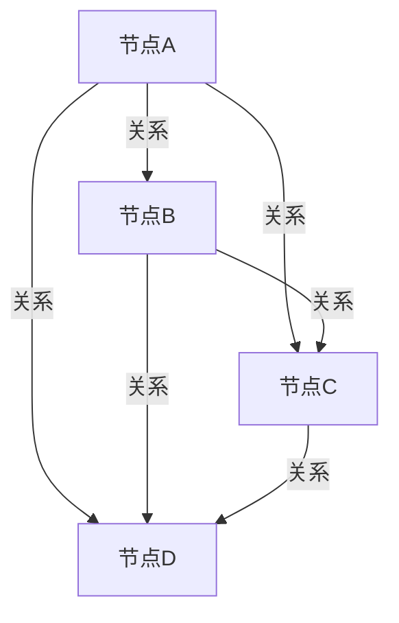

# Neo4j图数据库原理与Cypher代码实例讲解

## 1.背景介绍

在现代数据管理和分析中，传统的关系型数据库（RDBMS）在处理复杂关系和大规模数据时显得力不从心。图数据库作为一种新兴的数据存储和管理技术，因其在处理复杂关系和高效查询方面的优势，逐渐受到广泛关注。Neo4j作为图数据库领域的佼佼者，以其高性能、灵活性和易用性，成为众多企业和开发者的首选。

Neo4j是一种基于图理论的数据库管理系统，使用节点（Node）、关系（Relationship）和属性（Property）来表示和存储数据。其查询语言Cypher以其类SQL的语法和强大的查询能力，使得开发者能够轻松地进行复杂的图查询和数据分析。

## 2.核心概念与联系

在深入探讨Neo4j的原理和使用之前，我们需要了解一些核心概念：

### 2.1 节点（Node）

节点是图数据库中的基本单位，类似于关系型数据库中的表记录。每个节点可以有多个属性，用于存储节点的具体信息。

### 2.2 关系（Relationship）

关系是连接两个节点的边，用于表示节点之间的关联。关系也可以有属性，用于存储关系的具体信息。

### 2.3 属性（Property）

属性是节点和关系的具体信息，类似于关系型数据库中的字段。属性可以是各种数据类型，如字符串、数字、布尔值等。

### 2.4 标签（Label）

标签用于对节点进行分类，类似于关系型数据库中的表。一个节点可以有一个或多个标签。

### 2.5 Cypher查询语言

Cypher是Neo4j的查询语言，类似于SQL。它使用声明式语法，使得查询图数据变得直观和高效。

以下是一个简单的Mermaid图示例，展示了节点、关系和属性之间的关系：



## 3.核心算法原理具体操作步骤

Neo4j的核心算法基于图理论中的遍历和搜索算法，如深度优先搜索（DFS）、广度优先搜索（BFS）和Dijkstra算法。以下是这些算法的具体操作步骤：

### 3.1 深度优先搜索（DFS）

深度优先搜索是一种遍历或搜索图的算法，沿着图的深度进行搜索，直到找到目标节点或遍历完所有节点。

#### 操作步骤：

1. 从起始节点开始，将其标记为已访问。
2. 递归地访问每个未访问的相邻节点。
3. 如果所有相邻节点都已访问，则回溯到上一个节点。

### 3.2 广度优先搜索（BFS）

广度优先搜索是一种遍历或搜索图的算法，沿着图的广度进行搜索，逐层访问节点。

#### 操作步骤：

1. 从起始节点开始，将其标记为已访问并加入队列。
2. 从队列中取出一个节点，访问其所有未访问的相邻节点，并将这些节点加入队列。
3. 重复步骤2，直到队列为空或找到目标节点。

### 3.3 Dijkstra算法

Dijkstra算法是一种用于计算图中最短路径的算法，适用于加权图。

#### 操作步骤：

1. 初始化起始节点的距离为0，其他节点的距离为无穷大。
2. 将所有节点加入未访问节点集合。
3. 从未访问节点集合中选择距离最小的节点，标记为已访问。
4. 更新该节点的相邻节点的距离。
5. 重复步骤3和4，直到所有节点都被访问或找到目标节点。

## 4.数学模型和公式详细讲解举例说明

图数据库的数学模型基于图理论，图由节点和边组成。以下是一些关键的数学公式和模型：

### 4.1 图的表示

一个图 $G$ 可以表示为 $G = (V, E)$，其中 $V$ 是节点的集合，$E$ 是边的集合。

### 4.2 距离和路径

在图中，两个节点之间的距离可以表示为路径的长度。路径 $P$ 可以表示为 $P = (v_1, v_2, ..., v_n)$，其中 $v_i$ 是路径上的节点。

### 4.3 最短路径

最短路径问题可以使用Dijkstra算法解决。设 $d(v)$ 为节点 $v$ 的最短路径距离，$w(u, v)$ 为边 $(u, v)$ 的权重，则更新公式为：

$$
d(v) = \min(d(v), d(u) + w(u, v))
$$

### 4.4 示例

假设我们有一个图 $G$，其中节点 $V = \{A, B, C, D\}$，边 $E = \{(A, B), (A, C), (B, C), (B, D), (C, D)\}$，边的权重分别为 $1, 2, 1, 3, 1$。我们可以使用Dijkstra算法计算从节点 $A$ 到其他节点的最短路径。

## 5.项目实践：代码实例和详细解释说明

在这一部分，我们将通过一个具体的项目实例，展示如何使用Neo4j和Cypher进行图数据的存储和查询。

### 5.1 环境搭建

首先，我们需要安装Neo4j数据库。可以从Neo4j官方网站下载并安装Neo4j Desktop或使用Docker进行安装。

### 5.2 数据导入

假设我们有一个社交网络的数据集，包括用户和他们之间的关系。我们可以使用以下Cypher代码将数据导入Neo4j：

```cypher
CREATE (Alice:Person {name: 'Alice', age: 30})
CREATE (Bob:Person {name: 'Bob', age: 25})
CREATE (Carol:Person {name: 'Carol', age: 35})
CREATE (Dave:Person {name: 'Dave', age: 40})

CREATE (Alice)-[:FRIEND]->(Bob)
CREATE (Alice)-[:FRIEND]->(Carol)
CREATE (Bob)-[:FRIEND]->(Dave)
CREATE (Carol)-[:FRIEND]->(Dave)
```

### 5.3 数据查询

我们可以使用Cypher查询语言进行数据查询。例如，查询Alice的所有朋友：

```cypher
MATCH (Alice:Person {name: 'Alice'})-[:FRIEND]->(friend)
RETURN friend
```

### 5.4 复杂查询

我们还可以进行更复杂的查询，例如查找Alice的朋友的朋友：

```cypher
MATCH (Alice:Person {name: 'Alice'})-[:FRIEND]->()-[:FRIEND]->(fof)
RETURN fof
```

## 6.实际应用场景

图数据库在许多实际应用场景中具有显著优势，以下是一些典型的应用场景：

### 6.1 社交网络分析

图数据库可以高效地存储和查询社交网络中的用户和关系，支持复杂的社交网络分析，如社区检测、影响力分析等。

### 6.2 推荐系统

基于图数据库的推荐系统可以利用用户和物品之间的关系，进行个性化推荐，提高推荐的准确性和用户满意度。

### 6.3 知识图谱

知识图谱是图数据库的典型应用，通过存储和查询实体及其关系，支持复杂的知识推理和问答系统。

### 6.4 供应链管理

图数据库可以用于供应链管理，跟踪产品的生产、运输和销售过程，提高供应链的透明度和效率。

## 7.工具和资源推荐

在使用Neo4j和Cypher进行图数据管理和分析时，以下工具和资源可以提供帮助：

### 7.1 Neo4j Desktop

Neo4j Desktop是Neo4j的官方桌面应用，提供图形化界面，方便用户进行数据管理和查询。

### 7.2 Neo4j Browser

Neo4j Browser是Neo4j的Web界面，支持Cypher查询和数据可视化，适合开发和调试。

### 7.3 Neo4j Aura

Neo4j Aura是Neo4j的云服务，提供高可用性和可扩展的图数据库解决方案，适合企业级应用。

### 7.4 官方文档和教程

Neo4j的官方网站提供了丰富的文档和教程，涵盖从入门到高级的各种主题，帮助用户快速上手和深入学习。

## 8.总结：未来发展趋势与挑战

图数据库作为一种新兴的数据存储和管理技术，具有广阔的发展前景。随着数据规模和复杂性的不断增加，图数据库在处理复杂关系和高效查询方面的优势将更加突出。

### 8.1 未来发展趋势

1. **性能优化**：随着硬件和算法的不断进步，图数据库的性能将进一步提升，支持更大规模的数据和更复杂的查询。
2. **标准化**：图数据库的标准化工作将逐步推进，促进不同图数据库之间的互操作性和兼容性。
3. **应用场景扩展**：图数据库的应用场景将不断扩展，涵盖更多领域，如金融、医疗、物联网等。

### 8.2 挑战

1. **数据一致性**：在分布式环境中，保持数据的一致性和完整性是一个重要挑战。
2. **查询优化**：复杂查询的优化仍然是一个难题，需要不断改进算法和技术。
3. **用户教育**：图数据库的普及需要加强用户教育，帮助用户理解和掌握图数据库的概念和使用方法。

## 9.附录：常见问题与解答

### 9.1 如何选择合适的图数据库？

选择图数据库时，需要考虑数据规模、查询需求、性能要求和成本等因素。Neo4j作为市场领先的图数据库，适合大多数应用场景。

### 9.2 如何优化Cypher查询性能？

优化Cypher查询性能可以从以下几个方面入手：

1. **使用索引**：为常用的查询字段创建索引，提高查询速度。
2. **简化查询**：尽量简化查询语句，避免不必要的复杂操作。
3. **分解查询**：将复杂查询分解为多个简单查询，逐步执行。

### 9.3 如何处理图数据库中的数据一致性问题？

在分布式环境中，保持数据一致性可以使用分布式事务和一致性协议，如Paxos和Raft。此外，定期进行数据校验和修复也是必要的。

### 9.4 Neo4j与其他图数据库的比较？

Neo4j在性能、易用性和社区支持方面具有显著优势，但在某些特定场景下，其他图数据库如Amazon Neptune、ArangoDB等也有其独特的优势。选择合适的图数据库需要根据具体需求进行评估。

---

作者：禅与计算机程序设计艺术 / Zen and the Art of Computer Programming