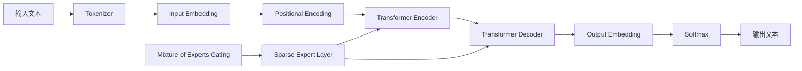

# PaLM原理与代码实例讲解

## 1.背景介绍
### 1.1 大语言模型的发展历程
#### 1.1.1 早期的语言模型
#### 1.1.2 Transformer的出现
#### 1.1.3 预训练语言模型的兴起
### 1.2 PaLM的诞生
#### 1.2.1 Google的研究背景
#### 1.2.2 PaLM的创新之处
### 1.3 PaLM的影响力
#### 1.3.1 学术界的反响
#### 1.3.2 工业界的应用前景

## 2.核心概念与联系
### 2.1 语言模型的基本原理
#### 2.1.1 统计语言模型
#### 2.1.2 神经网络语言模型
### 2.2 Transformer架构
#### 2.2.1 自注意力机制
#### 2.2.2 多头注意力
#### 2.2.3 位置编码
### 2.3 预训练与微调
#### 2.3.1 无监督预训练
#### 2.3.2 有监督微调
### 2.4 PaLM的关键创新
#### 2.4.1 Pathways架构
#### 2.4.2 稀疏专家模型
#### 2.4.3 混合专家门控

## 3.核心算法原理具体操作步骤
### 3.1 Transformer编码器
#### 3.1.1 输入嵌入
#### 3.1.2 自注意力层
#### 3.1.3 前馈神经网络层 
### 3.2 Transformer解码器
#### 3.2.1 掩码自注意力
#### 3.2.2 编码器-解码器注意力
#### 3.2.3 前馈神经网络层
### 3.3 PaLM的Pathways架构
#### 3.3.1 稀疏专家路由
#### 3.3.2 混合专家门控
#### 3.3.3 专家并行化

## 4.数学模型和公式详细讲解举例说明
### 4.1 注意力机制的数学表示
#### 4.1.1 缩放点积注意力
$$Attention(Q,K,V) = softmax(\frac{QK^T}{\sqrt{d_k}})V$$
#### 4.1.2 多头注意力
$$MultiHead(Q,K,V) = Concat(head_1,...,head_h)W^O$$
其中$head_i=Attention(QW_i^Q,KW_i^K,VW_i^V)$
### 4.2 Transformer的数学表示 
#### 4.2.1 编码器层
$$Encoder(x) = LayerNorm(x+SubLayer(x))$$
其中$SubLayer(x)=FFN(LayerNorm(x+MultiHead(x,x,x)))$
#### 4.2.2 解码器层
$$Decoder(x,m) = LayerNorm(x+SubLayer(x,m))$$
其中$SubLayer(x,m)=FFN(LayerNorm(x+MultiHead(x,m,m)))$
### 4.3 PaLM的数学表示
#### 4.3.1 稀疏专家路由
$$y_i=\sum_{j=1}^{N}G_{ij}E_j(x_i)$$
其中$G_{ij}$为第$i$个样本到第$j$个专家的门控值
#### 4.3.2 混合专家门控
$$G_{ij}=\frac{exp(h_i^TW_jh_i)}{\sum_{k=1}^{N}exp(h_i^TW_kh_i)}$$
其中$h_i$为第$i$个样本的隐状态，$W_j$为第$j$个专家的参数

## 5.项目实践：代码实例和详细解释说明
### 5.1 使用Hugging Face Transformers库实现PaLM
#### 5.1.1 安装依赖
```bash
pip install transformers
```
#### 5.1.2 加载预训练模型
```python
from transformers import AutoTokenizer, AutoModelForCausalLM

tokenizer = AutoTokenizer.from_pretrained("google/palm-2b")
model = AutoModelForCausalLM.from_pretrained("google/palm-2b")
```
#### 5.1.3 生成文本
```python
prompt = "PaLM is a large language model developed by"
input_ids = tokenizer(prompt, return_tensors="pt").input_ids

outputs = model.generate(input_ids, max_length=100, num_return_sequences=1)
print(tokenizer.decode(outputs[0], skip_special_tokens=True))
```
### 5.2 使用PyTorch从头实现Transformer
#### 5.2.1 定义模型结构
```python
import torch
import torch.nn as nn

class SelfAttention(nn.Module):
    def __init__(self, embed_size, heads):
        super(SelfAttention, self).__init__()
        self.embed_size = embed_size
        self.heads = heads
        self.head_dim = embed_size // heads
        
        assert (self.head_dim * heads == embed_size), "Embed size needs to be div by heads"
        
        self.values = nn.Linear(self.head_dim, self.head_dim, bias=False)
        self.keys = nn.Linear(self.head_dim, self.head_dim, bias=False)
        self.queries = nn.Linear(self.head_dim, self.head_dim, bias=False)
        self.fc_out = nn.Linear(heads*self.head_dim, embed_size)
    
    def forward(self, values, keys, query, mask):
        N = query.shape[0]
        value_len, key_len, query_len = values.shape[1], keys.shape[1], query.shape[1]
        
        # Split embedding into self.heads pieces
        values = values.reshape(N, value_len, self.heads, self.head_dim)
        keys = keys.reshape(N, key_len, self.heads, self.head_dim)
        queries = query.reshape(N, query_len, self.heads, self.head_dim)
        
        values = self.values(values)
        keys = self.keys(keys)
        queries = self.queries(queries)
        
        energy = torch.einsum("nqhd,nkhd->nhqk", [queries, keys])
        # queries shape: (N, query_len, heads, heads_dim)
        # keys shape: (N, key_len, heads, heads_dim)
        # energy shape: (N, heads, query_len, key_len)
        
        if mask is not None:
            energy = energy.masked_fill(mask == 0, float("-1e20"))
        
        attention = torch.softmax(energy / (self.embed_size ** (1/2)), dim=3)
        
        out = torch.einsum("nhql,nlhd->nqhd", [attention, values]).reshape(
            N, query_len, self.heads*self.head_dim
        )
        # attention shape: (N, heads, query_len, key_len)
        # values shape: (N, value_len, heads, heads_dim)
        # out shape: (N, query_len, heads, head_dim) then flatten last two dimensions
        
        out = self.fc_out(out)
        return out

class TransformerBlock(nn.Module):
    def __init__(self, embed_size, heads, dropout, forward_expansion):
        super(TransformerBlock, self).__init__()
        self.attention = SelfAttention(embed_size, heads)
        self.norm1 = nn.LayerNorm(embed_size)
        self.norm2 = nn.LayerNorm(embed_size)
        
        self.feed_forward = nn.Sequential(
            nn.Linear(embed_size, forward_expansion*embed_size),
            nn.ReLU(),
            nn.Linear(forward_expansion*embed_size, embed_size)
        )
        
        self.dropout = nn.Dropout(dropout)
        
    def forward(self, value, key, query, mask):
        attention = self.attention(value, key, query, mask)
        
        x = self.dropout(self.norm1(attention + query))
        forward = self.feed_forward(x)
        out = self.dropout(self.norm2(forward + x))
        return out
        
class Encoder(nn.Module):
    def __init__(
        self,
        src_vocab_size,
        embed_size,
        num_layers,
        heads,
        device,
        forward_expansion,
        dropout,
        max_length
    ):
        super(Encoder, self).__init__()
        self.embed_size = embed_size
        self.device = device
        self.word_embedding = nn.Embedding(src_vocab_size, embed_size)
        self.position_embedding = nn.Embedding(max_length, embed_size)
        
        self.layers = nn.ModuleList(
            [
                TransformerBlock(
                    embed_size,
                    heads,
                    dropout=dropout,
                    forward_expansion=forward_expansion
                )
                for _ in range(num_layers)
            ]
        )
        
        self.dropout = nn.Dropout(dropout)
        
    def forward(self, x, mask):
        N, seq_length = x.shape
        positions = torch.arange(0, seq_length).expand(N, seq_length).to(self.device)
        
        out = self.dropout(self.word_embedding(x) + self.position_embedding(positions))
        
        for layer in self.layers:
            out = layer(out, out, out, mask)
        
        return out
```
#### 5.2.2 训练模型
```python
import torch
import torch.nn as nn
import torch.optim as optim

device = torch.device("cuda" if torch.cuda.is_available() else "cpu")

# 定义超参数
src_vocab_size = 10000
embed_size = 256 
num_layers = 6
heads = 8
forward_expansion = 4
dropout = 0.1
max_length = 100

# 实例化模型
model = Encoder(
    src_vocab_size, 
    embed_size,
    num_layers,
    heads,
    device,
    forward_expansion,
    dropout,
    max_length
).to(device)

# 定义优化器和损失函数
optimizer = optim.Adam(model.parameters(), lr=0.0001)
criterion = nn.CrossEntropyLoss()

# 训练循环
for epoch in range(10):
    
    optimizer.zero_grad()
    
    input_data = torch.randint(0, src_vocab_size, (64, max_length)).to(device)
    mask = torch.ones(64, max_length).to(device)
    
    outputs = model(input_data, mask)
    
    loss = criterion(outputs.reshape(-1, embed_size), input_data.reshape(-1))
    
    loss.backward()
    optimizer.step()
    
    print(f"Epoch: {epoch}, Loss: {loss.item()}")
```

## 6.实际应用场景
### 6.1 自然语言理解
#### 6.1.1 语义相似度计算
#### 6.1.2 情感分析
#### 6.1.3 命名实体识别
### 6.2 自然语言生成
#### 6.2.1 文本摘要
#### 6.2.2 对话生成
#### 6.2.3 故事创作
### 6.3 知识问答
#### 6.3.1 阅读理解
#### 6.3.2 开放域问答

## 7.工具和资源推荐
### 7.1 开源实现
- Hugging Face Transformers
- Fairseq
- OpenNMT
### 7.2 预训练模型
- BERT
- GPT-3
- T5
- PaLM
### 7.3 数据集
- Wikipedia
- BookCorpus
- CommonCrawl
- C4

## 8.总结：未来发展趋势与挑战
### 8.1 模型规模的增长
### 8.2 多模态学习
### 8.3 低资源语言建模
### 8.4 模型效率与性能
### 8.5 可解释性与可控性
### 8.6 安全与伦理

## 9.附录：常见问题与解答 
### 9.1 如何选择合适的预训练模型？
### 9.2 预训练模型能否适应特定领域？
### 9.3 如何处理低资源语言的建模？
### 9.4 大模型的推理效率如何提升？
### 9.5 如何避免生成有害或偏见的内容？



PaLM是由Google发布的一个大型语言模型，其规模达到了5400亿参数，在许多自然语言理解和生成任务上取得了state-of-the-art的表现。PaLM采用了Transformer的编码器-解码器架构，但在其基础上进行了一些创新性的改进，包括Pathways架构、稀疏专家模型和混合专家门控等。

Pathways架构将模型划分为多个独立的专家子模型，每个专家负责处理不同的输入模式，从而提升了模型的表达能力和泛化能力。稀疏专家模型通过路由机制动态选择与输入最相关的少数专家来处理，大大降低了计算开销。混合专家门控根据输入的表示动态分配不同专家的权重，使得模型能够灵活地适应不同的任务。

PaLM在预训练阶段使用了大规模的无标签数据进行自监督学习，通过掩码语言建模等任务学习通用的语言表示。在微调阶段，PaLM可以在特定任务上进行监督学习，快速适应下游应用。实验表明，PaLM在机器翻译、问答、摘要、对话等任务上均优于此前最好的模型。

尽管PaLM在性能上取得了巨大的突破，但它同时也面临着一些挑战。首先是计