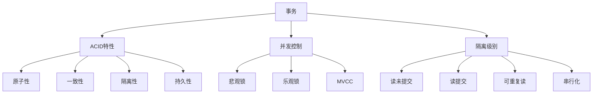

# 事务 原理与代码实例讲解

## 1.背景介绍
### 1.1 事务的定义
事务是数据库管理系统执行过程中的一个逻辑单位，由一个或多个数据库操作序列组成。事务通过将一系列数据库操作绑定在一起，从而保证数据的一致性和完整性。

### 1.2 事务的重要性
在实际应用系统开发中，事务发挥着至关重要的作用。它能够确保数据在并发访问、系统故障等异常情况下的正确性和一致性。合理运用事务可以有效地避免数据混乱和错误，提高系统的可靠性。

### 1.3 事务的应用场景
事务被广泛应用于各种需要保证数据一致性和完整性的场合，例如:

- 银行转账：确保转出账户扣款和转入账户收款的原子性。
- 电商下单：保证下单、减库存、生成订单等一系列操作的一致性。
- 抢票系统：避免同一张票被多次售出的问题。

## 2.核心概念与联系
### 2.1 ACID特性
事务必须满足ACID四大特性：

- 原子性(Atomicity)：事务中包含的操作要么全部成功执行，要么全部失败回滚。
- 一致性(Consistency)：事务执行的结果必须使数据库从一个一致性状态变到另一个一致性状态。
- 隔离性(Isolation)：一个事务的执行不能被其他事务干扰。
- 持久性(Durability)：一个事务一旦提交，它对数据库中数据的改变就应该是永久性的。

### 2.2 并发控制
并发控制是事务正确执行的关键，主要解决事务的隔离性问题。常见的并发控制机制有：

- 悲观锁：在整个事务过程中，对数据加锁，防止其他事务访问。适合写操作频繁的场景。
- 乐观锁：事务提交时检查数据是否被修改，如果被修改则回滚重试。适合读操作频繁的场景。
- MVCC：即多版本并发控制，通过保存数据的多个版本，实现无锁的并发控制。

### 2.3 事务隔离级别
为了在并发场景下平衡系统性能和数据一致性，事务提供了不同的隔离级别：

- 读未提交(Read Uncommitted)：一个事务可以读取另一个未提交事务的数据。
- 读提交(Read Committed)：一个事务要等另一个事务提交后才能读取数据。
- 可重复读(Repeatable Read)：一个事务在整个过程中可以多次重复读取同一数据，且结果不变。
- 串行化(Serializable)：所有事务串行化执行，可避免所有并发问题，但性能最差。

### 2.4 核心概念关系图
下面使用Mermaid流程图展示事务的核心概念及其关系：



## 3.核心算法原理具体操作步骤
### 3.1 两阶段提交(2PC)
两阶段提交是分布式事务实现原子性的经典算法，具体步骤如下：

1. 请求阶段(Prepare)：
   - 事务协调者向所有参与者发送Prepare请求。
   - 参与者执行事务操作，并将Undo和Redo信息记入日志。
   - 参与者响应协调者，如果事务执行成功则回应"同意"，否则回应"中止"。

2. 提交阶段(Commit/Rollback)：
   - 如果所有参与者都回应"同意"，协调者向所有参与者发送Commit请求，参与者执行Commit操作，并释放资源。
   - 如果任一参与者回应"中止"或者等待超时，协调者向所有参与者发送Rollback请求，参与者执行Rollback操作，并释放资源。

### 3.2 三阶段提交(3PC) 
三阶段提交是对两阶段提交的改进，增加了一个预提交阶段，降低了参与者的阻塞时间。具体步骤如下：

1. CanCommit阶段：
   - 协调者向参与者发送CanCommit请求。
   - 参与者响应CanCommit请求，如果可以执行事务则回应"YES"，否则回应"NO"。

2. PreCommit阶段：
   - 如果所有参与者都回应"YES"，协调者向所有参与者发送PreCommit请求。
   - 参与者接收到PreCommit请求后，执行事务操作，并将Undo和Redo信息记入日志，但不提交。
   - 参与者响应协调者，如果事务预提交成功则回应"ACK"，否则回应"NACK"。

3. DoCommit阶段：
   - 如果所有参与者都回应"ACK"，协调者向所有参与者发送DoCommit请求，参与者正式提交事务并释放资源。
   - 如果任一参与者回应"NACK"或者等待超时，协调者向所有参与者发送Rollback请求，参与者执行Rollback操作，并释放资源。

## 4.数学模型和公式详细讲解举例说明
### 4.1 CAP定理
CAP定理指出，在一个分布式系统中，Consistency(一致性)、Availability(可用性)、Partition tolerance(分区容错性)三者不可兼得，最多只能同时满足两个。

假设分布式系统有N个节点，每个节点的概率出现故障的概率为p，则：

- 整个系统不出现故障的概率为$(1-p)^N$。
- 系统出现故障的概率为$1-(1-p)^N$。

当节点数量N增大时，系统出现故障的概率也随之增大。因此，在设计分布式事务系统时，需要在C、A、P三者之间进行取舍。

### 4.2 BASE理论
BASE理论是对CAP定理的一种解决思路，包括三个方面：

- Basically Available(基本可用)：分布式系统在出现故障时，允许损失部分可用性，即保证核心功能可用。
- Soft State(软状态)：允许系统中的数据存在中间状态，并认为该中间状态不影响系统的整体可用性。
- Eventually Consistent(最终一致性)：系统中所有的数据副本经过一定时间后，最终能够达到一致的状态。

设分布式系统有N个节点，每个节点上的数据副本与其他节点不一致的概率为p，则：

- 所有节点数据最终达到一致的时间复杂度为$O(N)$。
- 在达到最终一致前，系统的数据一致性为$1-p^N$。

BASE理论通过牺牲强一致性，换取系统的可用性和性能，适用于对数据一致性要求不高的场景。

## 5.项目实践：代码实例和详细解释说明
下面以Java语言为例，演示如何使用Spring框架的声明式事务管理。

### 5.1 引入依赖
在pom.xml中引入Spring事务相关依赖：

```xml
<dependency>
    <groupId>org.springframework</groupId>
    <artifactId>spring-tx</artifactId>
    <version>5.2.12.RELEASE</version>
</dependency>
```

### 5.2 配置事务管理器
在Spring配置类中，配置事务管理器和启用事务注解：

```java
@Configuration
@EnableTransactionManagement
public class TransactionConfig {
    
    @Bean
    public PlatformTransactionManager transactionManager(DataSource dataSource) {
        return new DataSourceTransactionManager(dataSource);
    }
}
```

### 5.3 声明事务
在Service类的方法上，使用`@Transactional`注解声明事务：

```java
@Service
public class OrderService {

    @Autowired
    private OrderDao orderDao;
    
    @Autowired
    private ProductDao productDao;

    @Transactional
    public void createOrder(Order order) {
        // 插入订单
        orderDao.insert(order);
        
        // 减库存
        Product product = productDao.selectById(order.getProductId());
        if (product.getStock() < order.getQuantity()) {
            throw new RuntimeException("库存不足");
        }
        product.setStock(product.getStock() - order.getQuantity());
        productDao.updateById(product);
    }
}
```

在上面的代码中，`createOrder`方法被`@Transactional`注解标记，表示该方法内的数据库操作将以事务的方式执行。如果方法执行过程中抛出异常，事务将自动回滚，保证订单和库存数据的一致性。

### 5.4 事务传播
在`@Transactional`注解中，可以通过`propagation`属性指定事务传播行为，常用的事务传播行为包括：

- `REQUIRED`(默认)：如果当前存在事务，则加入该事务；如果当前没有事务，则创建一个新的事务。
- `REQUIRES_NEW`：创建一个新的事务，如果当前存在事务，则把当前事务挂起。
- `NESTED`：如果当前存在事务，则创建一个嵌套事务，否则等同于`REQUIRED`。

示例代码：

```java
@Transactional(propagation = Propagation.REQUIRES_NEW)
public void updateProduct(Product product) {
    productDao.updateById(product);
}
```

### 5.5 事务隔离级别
在`@Transactional`注解中，可以通过`isolation`属性指定事务隔离级别，常用的隔离级别包括：

- `DEFAULT`(默认)：使用底层数据库默认的隔离级别。
- `READ_UNCOMMITTED`：允许读取未提交的数据，可能导致脏读、不可重复读、幻读。
- `READ_COMMITTED`：只允许读取已提交的数据，可以防止脏读，但仍然可能发生不可重复读、幻读。
- `REPEATABLE_READ`：对同一字段的多次读取结果都是一致的，除非数据是被本身事务自己所修改，可以防止脏读和不可重复读，但仍然可能发生幻读。
- `SERIALIZABLE`：所有事务依次执行，可以防止脏读、不可重复读、幻读，但性能最低。

示例代码：

```java
@Transactional(isolation = Isolation.REPEATABLE_READ)
public void processOrder(Order order) {
    // ...
}
```

## 6.实际应用场景
事务在实际应用系统开发中有着广泛的应用，下面列举几个典型场景：

### 6.1 银行转账
银行转账是一个非常经典的事务应用场景。转账操作通常包括以下步骤：

1. 检查转出账户余额是否充足。
2. 从转出账户扣除转账金额。
3. 给转入账户增加转账金额。

这三个步骤必须以事务的方式执行，要么全部成功，要么全部回滚，不能出现转出账户扣除了金额而转入账户未收到金额的情况。

### 6.2 电商下单
电商下单也是一个常见的事务场景。下单操作通常包括以下步骤：

1. 创建订单。
2. 减少商品库存。
3. 生成支付单。

这些步骤也必须以事务的方式执行，只有所有步骤都成功，订单才能创建成功。如果库存不足或支付失败，则需要回滚订单。

### 6.3 抢票系统
在高并发的抢票系统中，事务可以有效地避免同一张票被多次售出的问题。抢票操作通常包括以下步骤：

1. 查询票的剩余数量。
2. 检查剩余数量是否大于0。
3. 剩余数量减1，创建订单。

这些步骤需要以事务的方式执行，并且需要采取悲观锁或乐观锁等并发控制机制，确保在高并发情况下数据的一致性。

## 7.工具和资源推荐
下面推荐一些学习和使用事务的相关工具和资源：

- Spring框架：提供了强大的声明式事务管理功能，简化了事务管理的编码工作。
- Java Transaction API (JTA)：Java提供的事务管理API，支持分布式事务。
- Atomikos：一个开源的分布式事务管理器，支持JTA规范。
- Seata：一款开源的分布式事务解决方案，提供了AT、TCC、SAGA和XA事务