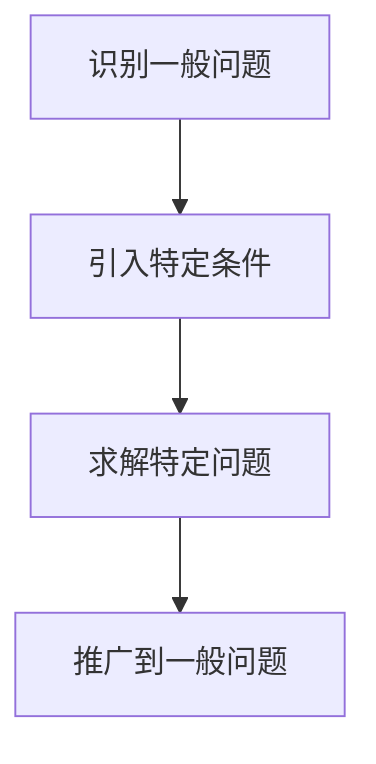

# 像数学家一样思考：特殊化原则

## 1.背景介绍

在计算机科学和软件工程领域，数学思维方式的应用无处不在。数学家们通过抽象和逻辑推理解决复杂问题，而这种思维方式同样适用于编程和系统设计。本文将探讨一种重要的数学思维方式——特殊化原则（Principle of Specialization），并展示其在IT领域中的应用。

特殊化原则是指通过将一般问题转化为特定问题来简化解决过程。这种方法不仅能帮助我们更好地理解问题，还能提高解决问题的效率。本文将详细介绍特殊化原则的核心概念、算法原理、数学模型、项目实践、实际应用场景、工具和资源推荐，并探讨其未来发展趋势与挑战。

## 2.核心概念与联系

### 2.1 特殊化原则的定义

特殊化原则是指在解决问题时，通过将一般问题转化为特定问题来简化解决过程。这种方法可以帮助我们更好地理解问题的本质，并找到更有效的解决方案。

### 2.2 特殊化原则与抽象化原则的关系

抽象化原则是指通过忽略不必要的细节来简化问题，而特殊化原则则是通过引入特定的细节来简化问题。两者相辅相成，共同构成了数学思维方式的重要组成部分。

### 2.3 特殊化原则在计算机科学中的应用

在计算机科学中，特殊化原则广泛应用于算法设计、数据结构、编程语言、软件工程等领域。例如，在算法设计中，我们常常通过将一般算法转化为特定算法来提高效率；在编程语言中，我们通过引入特定的语法和语义来简化编程过程。

## 3.核心算法原理具体操作步骤

### 3.1 特殊化原则的基本步骤

1. **识别一般问题**：首先，我们需要识别出需要解决的一般问题。
2. **引入特定条件**：接下来，我们通过引入特定的条件或假设，将一般问题转化为特定问题。
3. **求解特定问题**：然后，我们求解特定问题，并验证其正确性。
4. **推广到一般问题**：最后，我们将特定问题的解推广到一般问题。

### 3.2 示例：二分查找算法

二分查找算法是特殊化原则的一个经典应用。我们通过将一般的查找问题转化为有序数组中的查找问题，从而大大简化了查找过程。

#### 3.2.1 识别一般问题

一般查找问题是指在一个无序数组中查找特定元素。

#### 3.2.2 引入特定条件

我们引入特定条件，即数组是有序的。

#### 3.2.3 求解特定问题

在有序数组中，我们可以使用二分查找算法。具体步骤如下：

1. 初始化左右指针，分别指向数组的起始和结束位置。
2. 计算中间位置的索引。
3. 比较中间位置的元素与目标元素：
   - 如果相等，则找到目标元素，返回其索引。
   - 如果目标元素小于中间位置的元素，则将右指针移动到中间位置的左侧。
   - 如果目标元素大于中间位置的元素，则将左指针移动到中间位置的右侧。
4. 重复步骤2和3，直到找到目标元素或左右指针重合。

#### 3.2.4 推广到一般问题

通过引入有序数组的特定条件，我们将一般查找问题转化为特定查找问题，从而大大简化了查找过程。



## 4.数学模型和公式详细讲解举例说明

### 4.1 数学模型

在数学中，特殊化原则常常通过构建数学模型来实现。数学模型是对现实问题的抽象和简化，通过引入特定的假设和条件，将复杂问题转化为简单问题。

### 4.2 公式推导

#### 4.2.1 二分查找算法的时间复杂度

二分查找算法的时间复杂度可以通过数学公式来推导。假设数组的长度为 $n$，每次查找将数组分成两半，因此时间复杂度为 $O(\log n)$。

$$
T(n) = T(n/2) + O(1)
$$

通过递归公式，我们可以得到：

$$
T(n) = O(\log n)
$$

#### 4.2.2 其他算法的时间复杂度

类似地，我们可以通过引入特定条件，推导其他算法的时间复杂度。例如，快速排序算法的时间复杂度为 $O(n \log n)$，因为每次排序将数组分成两部分，并对每部分进行递归排序。

$$
T(n) = 2T(n/2) + O(n)
$$

通过递归公式，我们可以得到：

$$
T(n) = O(n \log n)
$$

## 5.项目实践：代码实例和详细解释说明

### 5.1 二分查找算法的实现

以下是二分查找算法的Python实现：

```python
def binary_search(arr, target):
    left, right = 0, len(arr) - 1
    while left <= right:
        mid = (left + right) // 2
        if arr[mid] == target:
            return mid
        elif arr[mid] < target:
            left = mid + 1
        else:
            right = mid - 1
    return -1

# 示例
arr = [1, 2, 3, 4, 5, 6, 7, 8, 9]
target = 5
index = binary_search(arr, target)
print(f"元素 {target} 的索引为 {index}")
```

### 5.2 代码解释

1. **初始化左右指针**：`left` 和 `right` 分别指向数组的起始和结束位置。
2. **计算中间位置**：`mid` 为左右指针的中间位置。
3. **比较中间位置的元素与目标元素**：
   - 如果相等，则找到目标元素，返回其索引。
   - 如果目标元素小于中间位置的元素，则将右指针移动到中间位置的左侧。
   - 如果目标元素大于中间位置的元素，则将左指针移动到中间位置的右侧。
4. **重复步骤2和3**，直到找到目标元素或左右指针重合。

## 6.实际应用场景

### 6.1 搜索引擎

搜索引擎需要在大量数据中快速查找特定信息。通过引入特定条件（如数据有序），可以大大提高查找效率。例如，Google的PageRank算法通过引入特定的链接结构，将网页排名问题转化为特定的矩阵运算问题。

### 6.2 数据库索引

数据库索引是通过引入特定的数据结构（如B树、哈希表）来提高查找效率的典型应用。通过将一般的查找问题转化为特定的数据结构操作，数据库可以在大规模数据中快速查找特定记录。

### 6.3 图像处理

在图像处理领域，特殊化原则同样广泛应用。例如，边缘检测算法通过引入特定的滤波器，将一般的图像处理问题转化为特定的卷积运算问题，从而提高处理效率。

## 7.工具和资源推荐

### 7.1 编程工具

- **Python**：Python是一种广泛使用的编程语言，具有丰富的库和工具，适合实现各种算法和数据结构。
- **Jupyter Notebook**：Jupyter Notebook是一种交互式编程环境，适合进行算法实验和数据分析。

### 7.2 数学工具

- **Mathematica**：Mathematica是一种强大的数学软件，适合进行数学建模和公式推导。
- **MATLAB**：MATLAB是一种广泛使用的数学软件，适合进行数值计算和数据分析。

### 7.3 在线资源

- **Coursera**：Coursera提供了丰富的计算机科学和数学课程，适合学习算法和数据结构。
- **Khan Academy**：Khan Academy提供了免费的数学和计算机科学课程，适合学习数学基础知识。

## 8.总结：未来发展趋势与挑战

### 8.1 未来发展趋势

随着计算机科学和数学的不断发展，特殊化原则将在更多领域得到应用。例如，在人工智能和机器学习领域，通过引入特定的假设和条件，可以大大提高算法的效率和准确性。

### 8.2 挑战

尽管特殊化原则具有广泛的应用前景，但在实际应用中仍面临一些挑战。例如，如何选择合适的特定条件，如何验证特定问题的解的正确性，都是需要深入研究的问题。

## 9.附录：常见问题与解答

### 9.1 特殊化原则与抽象化原则有何区别？

特殊化原则是通过引入特定的条件来简化问题，而抽象化原则是通过忽略不必要的细节来简化问题。两者相辅相成，共同构成了数学思维方式的重要组成部分。

### 9.2 如何在实际项目中应用特殊化原则？

在实际项目中，可以通过以下步骤应用特殊化原则：
1. 识别一般问题。
2. 引入特定条件，将一般问题转化为特定问题。
3. 求解特定问题，并验证其正确性。
4. 将特定问题的解推广到一般问题。

### 9.3 特殊化原则在人工智能领域有何应用？

在人工智能领域，特殊化原则广泛应用于算法设计和模型训练。例如，通过引入特定的假设和条件，可以大大提高机器学习算法的效率和准确性。

---

作者：禅与计算机程序设计艺术 / Zen and the Art of Computer Programming