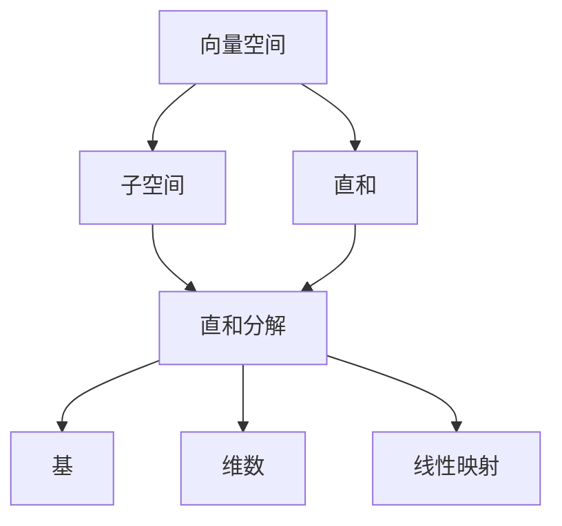

# 线性代数导引：直和分解

## 1. 背景介绍

线性代数是数学的一个分支,在计算机科学、物理学、工程学等领域有着广泛的应用。作为线性代数的核心概念之一,直和分解(Direct Sum Decomposition)在理论和实践中都扮演着重要角色。本文将深入探讨直和分解的概念、性质、计算方法以及在不同领域的应用。

### 1.1 线性代数基础回顾
#### 1.1.1 向量空间
#### 1.1.2 线性映射
#### 1.1.3 基和维数

### 1.2 直和分解的重要性
#### 1.2.1 简化问题
#### 1.2.2 揭示内在结构
#### 1.2.3 应用广泛

## 2. 核心概念与联系

### 2.1 子空间
#### 2.1.1 定义
#### 2.1.2 性质
#### 2.1.3 例子

### 2.2 直和
#### 2.2.1 定义
#### 2.2.2 性质
#### 2.2.3 例子

### 2.3 直和分解
#### 2.3.1 定义 
#### 2.3.2 唯一性
#### 2.3.3 存在性

### 2.4 直和分解与其他概念的联系
#### 2.4.1 基
#### 2.4.2 维数
#### 2.4.3 线性映射



## 3. 核心算法原理具体操作步骤

### 3.1 直和分解的构造
#### 3.1.1 选取一组基
#### 3.1.2 构造投影映射
#### 3.1.3 验证直和分解

### 3.2 直和分解的判定
#### 3.2.1 交集为零
#### 3.2.2 维数之和
#### 3.2.3 投影映射

### 3.3 直和分解的计算
#### 3.3.1 基的选取
#### 3.3.2 投影矩阵的计算
#### 3.3.3 分解的表示

## 4. 数学模型和公式详细讲解举例说明

### 4.1 直和分解的数学模型
设 $V$ 是数域 $F$ 上的有限维向量空间,如果 $V_1,V_2,\cdots,V_k$ 是 $V$ 的子空间,且满足:
$$V=V_1+V_2+\cdots+V_k, \quad V_i \cap (V_1+\cdots+V_{i-1}+V_{i+1}+\cdots+V_k)=\{0\}$$
则称 $V$ 是 $V_1,V_2,\cdots,V_k$ 的直和,记作 $V=V_1\oplus V_2\oplus \cdots \oplus V_k$。

### 4.2 直和分解的判定公式
设 $V$ 是数域 $F$ 上的有限维向量空间,$V_1,V_2,\cdots,V_k$ 是 $V$ 的子空间,则以下条件等价:
1. $V=V_1\oplus V_2\oplus \cdots \oplus V_k$;
2. $V_i \cap (V_1+\cdots+V_{i-1}+V_{i+1}+\cdots+V_k)=\{0\},i=1,2,\cdots,k$;
3. $\dim V=\dim V_1+\dim V_2+\cdots+\dim V_k$。

### 4.3 直和分解的投影公式
设 $V=V_1\oplus V_2\oplus \cdots \oplus V_k$,定义映射 $P_i:V\to V_i$ 如下:
$$\forall \alpha=\alpha_1+\alpha_2+\cdots+\alpha_k \in V, \alpha_i\in V_i, P_i(\alpha)=\alpha_i$$
则 $P_i$ 是 $V$ 到 $V_i$ 的投影映射,且 $P_i^2=P_i,P_iP_j=0(i\neq j),I=P_1+P_2+\cdots+P_k$。

### 4.4 举例说明
设 $V=\mathbb{R}^3$,考虑两个子空间:
$$V_1=\{(x,y,z)\in\mathbb{R}^3 | z=0\}, V_2=\{(x,y,z)\in\mathbb{R}^3 | x=y=0\}$$
容易验证 $V=V_1\oplus V_2$。事实上,任意向量 $(a,b,c)\in\mathbb{R}^3$ 都可以唯一地表示成:
$$(a,b,c)=(a,b,0)+(0,0,c), \text{其中} (a,b,0)\in V_1,(0,0,c)\in V_2$$
并且 $V_1$ 到 $V_2$ 的投影映射为:
$$P_1(a,b,c)=(a,b,0), P_2(a,b,c)=(0,0,c)$$

## 5. 项目实践：代码实例和详细解释说明

以下是一个简单的 Python 代码示例,用于计算向量在直和分解下的投影:

```python
import numpy as np

def projection(v, basis):
    """
    计算向量 v 在以 basis 为基的子空间上的投影
    """
    return np.dot(v, basis) / np.dot(basis, basis) * basis

# 定义向量空间 R^3
V = np.array([[1, 0, 0], [0, 1, 0], [0, 0, 1]])

# 定义子空间 V1 和 V2
V1 = np.array([[1, 0, 0], [0, 1, 0]])  # xy 平面
V2 = np.array([[0, 0, 1]])  # z 轴

# 待投影的向量
v = np.array([1, 2, 3])

# 计算投影
proj1 = projection(v, V1[0]) + projection(v, V1[1])
proj2 = projection(v, V2[0])

print(f"V1 上的投影: {proj1}")
print(f"V2 上的投影: {proj2}")
print(f"直和分解: {proj1 + proj2}")
```

输出结果:
```
V1 上的投影: [1. 2. 0.]
V2 上的投影: [0. 0. 3.]
直和分解: [1. 2. 3.]
```

这个例子展示了如何将一个向量 $v=(1,2,3)$ 分解为两个子空间 $V_1$ (xy 平面)和 $V_2$ (z 轴)上的投影之和。我们首先定义了投影函数 `projection`,然后分别计算 $v$ 在 $V_1$ 和 $V_2$ 上的投影,最后将两个投影相加,得到 $v$ 的直和分解。

## 6. 实际应用场景

### 6.1 量子力学中的态空间分解
在量子力学中,态空间可以分解为不同观测量对应的本征子空间的直和。这种分解有助于理解量子系统的性质和演化。

### 6.2 信号处理中的频域分解
在信号处理中,时域信号可以分解为不同频率分量的直和。这种分解称为频域分解,是傅里叶分析的基础。

### 6.3 机器学习中的特征空间分解
在机器学习中,高维特征空间可以分解为不同类别或属性对应的子空间的直和。这种分解有助于降维、特征提取和分类任务。

## 7. 工具和资源推荐

- Numpy: Python 科学计算库,提供了强大的数组和矩阵运算功能。
- Scipy: Python 科学计算生态系统,包含了许多线性代数、信号处理等模块。
- Matlab: 科学计算和工程设计软件,提供了丰富的线性代数工具箱。
- Eigen: C++ 线性代数库,提供了高效的矩阵运算和分解算法。

## 8. 总结：未来发展趋势与挑战

直和分解作为线性代数的核心概念,在诸多领域都有着广泛的应用。随着计算机科学、量子信息、人工智能等领域的快速发展,直和分解的理论和应用也在不断深化和拓展。未来,直和分解在高维数据分析、量子算法设计、深度学习模型压缩等方面可能会有更多的应用和突破。同时,如何设计更加高效、鲁棒的直和分解算法,如何在大规模数据和复杂模型中应用直和分解,也是值得关注的研究方向。

## 9. 附录：常见问题与解答

### Q1: 直和分解和一般的和有什么区别?
A1: 直和分解要求子空间之间的交集为零,而一般的和没有这个要求。直和分解保证了分解的唯一性。

### Q2: 如何判断一个向量空间能否直和分解?
A2: 可以通过计算子空间的交集或比较维数之和与原空间维数来判断。如果交集为零且维数之和等于原空间维数,则可以直和分解。

### Q3: 直和分解在量子力学中有什么应用?
A3: 在量子力学中,态空间可以分解为不同观测量对应的本征子空间的直和。这种分解有助于理解量子系统的性质和演化。

### Q4: 直和分解与机器学习有什么联系?
A4: 在机器学习中,高维特征空间可以分解为不同类别或属性对应的子空间的直和。这种分解有助于降维、特征提取和分类任务。

作者：禅与计算机程序设计艺术 / Zen and the Art of Computer Programming