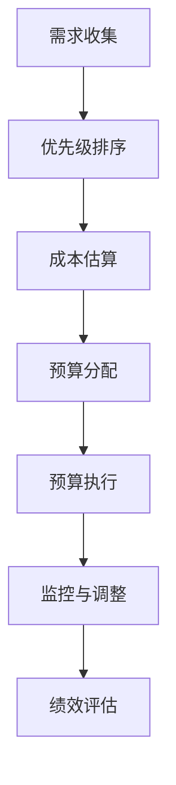

# 预算管理：制定并管理IT预算，确保资源得到高效分配，使IT投资为公司带来价值

## 1.背景介绍

### 1.1 IT预算管理的重要性

在当今瞬息万变的商业环境中，IT已经成为推动企业发展和保持竞争力的关键因素。有效的IT预算管理对于确保企业的IT资源得到合理分配和高效利用至关重要。良好的IT预算管理不仅可以控制成本,还能确保IT投资与企业战略目标保持一致,从而为公司创造价值。

### 1.2 IT预算管理的挑战

然而,IT预算管理面临着诸多挑战:

- 技术快速迭代,IT需求不断变化
- 业务需求与IT能力之间存在差距
- 预算资源有限,需要权衡不同项目的优先级
- 难以准确预测IT成本和投资回报率

因此,制定并执行一个合理、高效的IT预算管理策略对于企业来说至关重要。

## 2.核心概念与联系

### 2.1 IT预算的类型

IT预算通常可分为以下几种类型:

1. **资本支出预算(CapEx)**: 用于购买硬件、软件等长期资产的支出。
2. **运营支出预算(OpEx)**: 用于维护现有IT系统、人力资源等日常运营支出。
3. **项目预算**: 用于特定IT项目的支出,如系统升级、新应用开发等。

### 2.2 IT预算管理流程

IT预算管理流程通常包括以下几个阶段:



1. **需求收集**: 收集来自各部门的IT需求,了解业务目标和技术要求。
2. **优先级排序**: 根据企业战略和资源情况,对IT需求进行优先级排序。
3. **成本估算**: 估算每个IT需求的成本,包括硬件、软件、人力等各个方面。
4. **预算分配**: 根据优先级和成本估算,分配预算资源。
5. **预算执行**: 执行已批准的IT项目,并监控预算使用情况。
6. **监控与调整**: 持续监控项目进度和成本,必要时进行调整。
7. **绩效评估**: 评估IT投资的回报率和对业务目标的贡献度。

### 2.3 IT预算管理原则

有效的IT预算管理应当遵循以下原则:

1. **与企业战略保持一致**: IT投资应当服务于企业的整体战略目标。
2. **成本效益分析**: 对每个IT项目进行成本效益分析,优先考虑投资回报率高的项目。
3. **资源优化分配**: 根据业务优先级合理分配有限的IT资源。
4. **持续优化**: 持续监控和优化IT投资组合,提高资源利用效率。
5. **透明度和问责制**: 确保IT预算管理过程透明,并明确相关人员的职责和问责制度。

## 3.核心算法原理具体操作步骤

### 3.1 需求优先级排序算法

在IT预算管理中,由于资源有限,需要对收集到的IT需求进行优先级排序。一种常用的需求优先级排序算法是**加权评分法**。

加权评分法的具体步骤如下:

1. 确定评估标准及其权重。常用的评估标准包括:对业务目标的贡献度、投资回报率、风险水平、实施难度等。
2. 对每个IT需求根据各评估标准进行打分,通常采用1-5分或1-10分的评级制度。
3. 计算每个需求的加权评分,即将每个标准的分数乘以相应的权重,然后求和。

$$
加权评分 = \sum_{i=1}^{n}分数_i \times 权重_i
$$

其中,n为评估标准的个数。

4. 根据加权评分从高到低对需求进行排序,优先考虑评分较高的需求。

### 3.2 IT项目投资组合优化算法

在分配IT预算资源时,需要构建一个投资组合,使投资组合的总体收益最大化,同时满足预算和其他约束条件。这可以通过**整数规划算法**来实现。

整数规划算法的目标函数和约束条件如下:

目标函数:

$$
\max \sum_{i=1}^{n}R_i x_i
$$

其中,n为项目个数,$R_i$为第i个项目的预期收益,$x_i$为0-1变量,表示是否选择该项目。

约束条件:

$$
\sum_{i=1}^{n}C_i x_i \leq B
$$

$$
\sum_{i=1}^{n}D_i x_i \leq M
$$

$$
x_i \in \{0, 1\}, i=1,2,...,n
$$

其中,$C_i$为第i个项目的成本,$B$为总预算,$D_i$为第i个项目所需的资源量(如人力),$M$为可用资源总量。

通过求解这个整数规划问题,可以得到一个最优投资组合,使投资收益最大化,同时满足预算和资源约束。

## 4.数学模型和公式详细讲解举例说明

在IT预算管理中,常用的数学模型和公式包括:

### 4.1 投资回报率(ROI)

投资回报率是评估IT投资价值的重要指标,用于衡量投资收益与投资成本之比。投资回报率的计算公式如下:

$$
ROI = \frac{投资收益 - 投资成本}{投资成本} \times 100\%
$$

例如,某IT项目的投资成本为100万元,预计在5年内可带来300万元的收益,则该项目的投资回报率为:

$$
ROI = \frac{300万 - 100万}{100万} \times 100\% = 200\%
$$

通常,投资回报率越高,该项目的投资价值越大。

### 4.2 净现值(NPV)

净现值是另一个常用的投资评估指标,它考虑了资金的时间价值,计算公式如下:

$$
NPV = \sum_{t=0}^{n}\frac{C_t}{(1+r)^t}
$$

其中,$C_t$为第t年的现金流量,$r$为折现率(通常取加权平均资本成本WACC),n为项目期限(年)。

如果NPV大于0,则该项目的投资价值为正;如果NPV小于0,则该项目的投资价值为负。

### 4.3 内部收益率(IRR)

内部收益率是使净现值等于0时的折现率,可以用来评估项目的盈利能力。IRR的计算公式为:

$$
0 = \sum_{t=0}^{n}\frac{C_t}{(1+IRR)^t}
$$

通常,IRR越高,项目的盈利能力越强。

在评估IT投资时,可以综合考虑ROI、NPV和IRR等指标,并结合其他定性因素,从而做出合理的投资决策。

## 5.项目实践:代码实例和详细解释说明

为了更好地理解IT预算管理中的算法和模型,我们可以通过编程实现一个简单的IT投资组合优化示例。

假设有以下5个IT项目候选项:

| 项目 | 预期收益(万元) | 成本(万元) | 所需人力(人月) |
|------|-----------------|------------|-----------------|
| A    | 800             | 300        | 24              |
| B    | 500             | 200        | 18              |
| C    | 700             | 400        | 30              |
| D    | 400             | 150        | 12              |
| E    | 600             | 250        | 20              |

我们的目标是在总预算500万元、可用人力资源60人月的约束下,选择一个投资组合,使总收益最大化。

这可以通过整数规划算法来实现,下面是Python代码实现:

```python
from pulp import *

# 创建问题实例
prob = LpProblem("IT投资组合优化", LpMaximize)

# 创建决策变量
x = LpVariable.dicts("选择项目", [str(i) for i in range(5)], cat="Binary")

# 设置目标函数
prob += lpSum([800 * x[str(0)], 500 * x[str(1)], 700 * x[str(2)], 400 * x[str(3)], 600 * x[str(4)]])

# 设置约束条件
prob += lpSum([300 * x[str(0)], 200 * x[str(1)], 400 * x[str(2)], 150 * x[str(3)], 250 * x[str(4)]]) <= 500  # 总预算
prob += lpSum([24 * x[str(0)], 18 * x[str(1)], 30 * x[str(2)], 12 * x[str(3)], 20 * x[str(4)]]) <= 60  # 可用人力

# 求解问题
prob.solve()

# 输出结果
print("最优投资组合:")
for i in range(5):
    if x[str(i)].value() == 1:
        print(f"项目{chr(65+i)}")
print(f"总收益: {value(prob.objective)}")
```

代码解释:

1. 首先导入PuLP库,用于建模和求解整数规划问题。
2. 创建问题实例,设置目标为最大化总收益。
3. 创建5个0-1决策变量,表示是否选择对应的项目。
4. 设置目标函数,即各项目收益的线性组合。
5. 设置约束条件,包括总预算和可用人力资源。
6. 调用求解器求解整数规划问题。
7. 输出最优投资组合及其总收益。

运行上述代码,输出结果为:

```
最优投资组合:
项目A
项目B
项目E
总收益: 1900.0
```

即在给定约束下,选择A、B、E三个项目可以获得最大总收益1900万元。

通过编程实现,我们可以更好地理解和应用IT预算管理中的算法和模型,为制定合理的IT投资决策提供支持。

## 6.实际应用场景

IT预算管理在实际应用中扮演着重要角色,以下是一些典型场景:

### 6.1 企业IT治理

在企业IT治理中,IT预算管理是一个关键环节。通过有效的预算管理,企业可以确保IT投资与业务战略保持一致,并优化资源分配,提高IT投资回报率。

### 6.2 IT项目管理

在IT项目管理过程中,预算管理是一个重要组成部分。项目经理需要制定详细的项目预算,并持续监控和控制项目成本,确保项目按时按质按预算完成。

### 6.3 IT外包管理

对于外包IT服务的企业,预算管理也是必不可少的。企业需要评估外包服务的成本和收益,制定合理的预算,并与供应商协商合同条款,确保获得高质量的服务。

### 6.4 IT资产管理

IT资产管理包括硬件、软件和基础设施等,都需要进行预算管理。企业需要评估各类IT资产的使用寿命和替换成本,制定长期预算计划,确保IT资产得到及时更新和维护。

### 6.5 云计算和新兴技术

随着云计算、大数据、人工智能等新兴技术的兴起,企业需要评估这些技术的投资价值,并合理分配预算资源,以保持技术领先优势。

总之,无论是传统IT还是新兴技术领域,有效的IT预算管理都是确保企业IT投资价值最大化的关键。

## 7.工具和资源推荐

为了更好地实施IT预算管理,企业可以利用以下工具和资源:

### 7.1 预算管理软件

市面上有许多专业的预算管理软件,如Planview、Apptio、Niku等。这些软件可以帮助企业自动化预算流程,提高效率和透明度。

### 7.2 项目管理工具

项目管理工具如Microsoft Project、Jira等,可以用于跟踪项目进度和成本,为预算管理提供支持。

### 7.3 数据分析工具

数据分析工具如Power BI、Tableau等,可以帮助企业可视化和分析IT投资数据,为决策提供依据。

### 7.4 行业标准和最佳实践

一些行业组织如IT治理协会(ITGI)、项目管理协会(PMI)等,提供了IT预算管理的标准和最佳实践指南,可供企业参考。

### 7.5 外