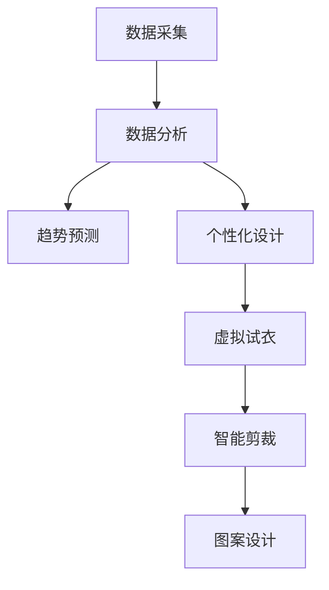

                 

# AI在时尚设计中的应用：个性化与趋势预测

## 1. 背景介绍

在数字时代，人工智能(AI)正在深刻地改变着各个行业。时尚设计，作为人类情感和美学表达的重要领域，也不例外。AI技术，特别是深度学习技术，正在以越来越深入的方式融入时尚设计的各个环节。本文将探讨AI如何在时尚设计中实现个性化和趋势预测，进而引领时尚潮流的变革。

### 1.1 时尚设计的数字化转型

传统的时尚设计依赖于设计师的直觉和经验，而数字技术正在改变这一过程。AI不仅能够分析海量时尚数据，发现新的趋势，还能够为设计师提供个性化的灵感和设计建议，甚至直接参与设计过程。

### 1.2 AI在时尚设计中的应用现状

目前，AI在时尚设计中的应用主要集中在以下几个方面：

- 趋势预测
- 图案设计
- 智能剪裁
- 虚拟试衣
- 个性化定制

这些应用已经展示了AI在时尚设计中的巨大潜力，并逐渐成为行业发展的新趋势。

## 2. 核心概念与联系

### 2.1 核心概念概述

- **AI与时尚设计**：AI技术在时尚设计中的应用，涵盖了从数据处理到设计创意的多个环节，旨在提升设计效率和个性化水平。

- **趋势预测**：利用AI技术分析时尚趋势，帮助设计师把握未来流行，避免过时。

- **个性化设计**：根据用户数据和偏好，AI能够提供定制化的设计方案，满足消费者的个性化需求。

- **虚拟试衣**：结合AR/VR技术，AI能够提供虚拟试衣体验，提升用户购物体验。

- **智能剪裁**：通过图像识别和计算机视觉技术，AI能够辅助进行精准剪裁，提升服装的质量和合身度。

- **图案设计**：AI能够自动生成复杂的图案，提升设计效率和创新性。

这些概念之间通过数据流和算法链条紧密联系，共同构成了AI在时尚设计中的应用框架。

### 2.2 核心概念原理和架构的 Mermaid 流程图



这个流程图展示了AI在时尚设计中的应用流程：从数据采集开始，通过数据分析，进行趋势预测和个性化设计，再到虚拟试衣、智能剪裁和图案设计，最终实现时尚设计的智能化和个性化。

## 3. 核心算法原理 & 具体操作步骤

### 3.1 算法原理概述

AI在时尚设计中的应用主要基于以下几类算法：

- **深度学习**：用于图像处理、趋势预测和图案设计。
- **自然语言处理(NLP)**：用于时尚趋势分析、客户反馈处理。
- **计算机视觉**：用于虚拟试衣、智能剪裁。
- **生成对抗网络(GANs)**：用于图案设计和个性化定制。

这些算法通过数据驱动的方式，使AI能够处理和理解时尚数据，从而提供个性化和趋势预测服务。

### 3.2 算法步骤详解

#### 3.2.1 数据采集与预处理

- **数据来源**：时尚品牌历史销售数据、社交媒体趋势、时尚博客和杂志等。
- **数据预处理**：清洗、去重、归一化等，确保数据的质量和一致性。

#### 3.2.2 数据分析与特征提取

- **数据分析**：使用深度学习模型，如卷积神经网络(CNN)、循环神经网络(RNN)和自编码器(AE)，对时尚数据进行建模和特征提取。
- **特征工程**：设计特征表示，如颜色、图案、款式等，用于后续的趋势预测和个性化设计。

#### 3.2.3 趋势预测

- **模型选择**：使用时间序列预测模型，如长短期记忆网络(LSTM)或Transformer模型。
- **模型训练**：基于历史数据，训练模型预测未来的时尚趋势。
- **结果评估**：通过交叉验证等方法，评估模型的准确性和稳定性。

#### 3.2.4 个性化设计

- **用户画像**：基于用户历史行为数据，构建用户画像，包括偏好、风格等。
- **设计推荐**：使用协同过滤、基于内容的推荐算法，推荐个性化设计方案。
- **反馈循环**：收集用户反馈，优化设计推荐模型。

#### 3.2.5 虚拟试衣

- **图像捕捉**：使用3D扫描技术，捕捉用户的身体数据。
- **图像处理**：使用计算机视觉技术，进行图像分割和特征提取。
- **虚拟试穿**：结合AR/VR技术，生成虚拟试穿效果，让用户直观感受服装效果。

#### 3.2.6 智能剪裁

- **图像识别**：使用图像识别技术，自动识别服装剪裁区域。
- **剪裁优化**：根据识别结果，调整剪裁参数，实现精准剪裁。
- **质量控制**：通过图像比对技术，确保剪裁质量。

#### 3.2.7 图案设计

- **生成对抗网络(GANs)**：使用GANs模型，自动生成复杂的图案。
- **风格迁移**：使用风格迁移技术，将经典图案应用到新设计中。
- **个性化定制**：根据用户需求，调整图案参数，实现个性化定制。

### 3.3 算法优缺点

#### 3.3.1 优点

- **高效性**：AI能够快速处理大量数据，发现新的趋势和设计灵感。
- **个性化**：根据用户数据，提供高度个性化的设计方案。
- **创新性**：通过算法生成新颖的图案和设计，提升设计的多样性和创新性。
- **互动性**：虚拟试衣和智能剪裁等应用，增强用户互动体验。

#### 3.3.2 缺点

- **数据依赖**：高质量的数据是AI应用的前提，但获取和处理大量时尚数据可能成本较高。
- **算法复杂性**：AI模型复杂，需要专业知识进行调参和优化。
- **用户隐私**：处理用户数据需要考虑隐私保护和数据安全。
- **技术门槛**：高技术门槛可能限制小企业和大规模部署。

### 3.4 算法应用领域

AI在时尚设计中的应用，已经在多个领域得到实践验证：

- **电商零售**：如Zara、H&M等，使用AI进行趋势预测和个性化推荐。
- **高级定制**：如Dior、Armani等，使用AI进行虚拟试衣和个性化定制。
- **时尚媒体**：如VOGUE、ELLE等，使用AI进行内容生成和趋势分析。
- **时尚教育**：如中央圣马丁学院，使用AI进行设计辅助和教学优化。

## 4. 数学模型和公式 & 详细讲解

### 4.1 数学模型构建

#### 4.1.1 趋势预测模型

假设我们有历史时尚数据 $D=\{(x_i,y_i)\}_{i=1}^N$，其中 $x_i$ 为特征向量，如颜色、图案、款式等，$y_i$ 为对应的时间标签，表示该时尚元素在历史时间序列中的出现次数。

基于长短期记忆网络(LSTM)的趋势预测模型，可以表示为：

$$
\hat{y} = LSTM(x)
$$

其中 $LSTM$ 为LSTM模型，$x$ 为输入特征，$\hat{y}$ 为预测值。

#### 4.1.2 个性化设计模型

基于协同过滤的个性化推荐模型，可以表示为：

$$
\hat{y} = f_u(x_u; K)
$$

其中 $x_u$ 为当前用户的历史行为数据，$f_u$ 为推荐函数，$K$ 为推荐模型的参数。

### 4.2 公式推导过程

#### 4.2.1 LSTM趋势预测公式

LSTM模型可以表示为：

$$
h_t = \tanh(W_c \cdot h_{t-1} + U_c \cdot x_t + b_c)
$$

$$
i_t = \sigma(W_i \cdot h_{t-1} + U_i \cdot x_t + b_i)
$$

$$
f_t = \sigma(W_f \cdot h_{t-1} + U_f \cdot x_t + b_f)
$$

$$
o_t = \sigma(W_o \cdot h_{t-1} + U_o \cdot x_t + b_o)
$$

$$
c_t = f_t \odot c_{t-1} + i_t \odot \tanh(h_t)
$$

$$
\hat{y} = o_t \odot \tanh(c_t)
$$

其中 $h_t$ 为隐藏状态，$i_t$、$f_t$、$o_t$ 为LSTM的三个门控，$c_t$ 为细胞状态，$\odot$ 表示逐元素乘法，$\tanh$ 和 $\sigma$ 分别为双曲正切和Sigmoid函数。

#### 4.2.2 个性化推荐公式

基于协同过滤的个性化推荐公式为：

$$
\hat{y} = \frac{\sum_{k=1}^{K} \alpha_k \cdot w_k \cdot \langle f_u(x_u; K), f_i(x_i; K) \rangle}{\sum_{j=1}^{J} \alpha_j \cdot w_j}
$$

其中 $f_u(x_u; K)$ 为当前用户的特征表示，$f_i(x_i; K)$ 为相似用户的特征表示，$\langle \cdot, \cdot \rangle$ 为内积，$\alpha_j$ 和 $w_j$ 为调节参数，$K$ 为推荐模型参数。

### 4.3 案例分析与讲解

#### 4.3.1 案例背景

某时尚品牌希望利用AI技术，提升其虚拟试衣和个性化设计服务。品牌从电商平台和社交媒体收集了大量的用户数据，并希望通过AI模型进行分析和应用。

#### 4.3.2 案例分析

**数据采集与预处理**：品牌从电商平台和社交媒体获取用户数据，包括购买记录、浏览历史、评论反馈等。对数据进行清洗和归一化，构建用户画像。

**数据分析与特征提取**：使用LSTM模型，分析用户行为数据，预测未来的时尚趋势。同时使用协同过滤算法，对用户进行个性化推荐。

**趋势预测**：基于LSTM模型，预测未来的时尚趋势，帮助设计师把握市场走向。

**个性化设计**：根据用户画像和趋势预测结果，使用协同过滤算法，推荐个性化设计方案。

**虚拟试衣**：使用3D扫描技术，捕捉用户身体数据。结合计算机视觉和虚拟现实技术，生成虚拟试衣效果。

**智能剪裁**：通过图像识别技术，自动识别服装剪裁区域，进行精准剪裁。

**图案设计**：使用GANs模型，自动生成复杂的图案。根据用户需求，调整图案参数，实现个性化定制。

## 5. 项目实践：代码实例和详细解释说明

### 5.1 开发环境搭建

**5.1.1 环境配置**

- **Python**：使用Anaconda创建虚拟环境，确保所有依赖库的稳定性。
- **深度学习框架**：安装TensorFlow、PyTorch等深度学习框架，用于模型开发和训练。
- **计算机视觉库**：安装OpenCV等计算机视觉库，用于图像处理和虚拟试衣。
- **机器学习库**：安装scikit-learn等机器学习库，用于数据分析和特征提取。

**5.1.2 代码实现**

```python
import tensorflow as tf
from tensorflow.keras import layers
from sklearn.model_selection import train_test_split

# 加载数据
x_train, x_test, y_train, y_test = train_test_split(train_data, test_data, test_size=0.2, random_state=42)

# 定义LSTM模型
model = tf.keras.Sequential([
    layers.LSTM(128, input_shape=(100,)),
    layers.Dense(1, activation='sigmoid')
])

# 编译模型
model.compile(optimizer='adam', loss='binary_crossentropy', metrics=['accuracy'])

# 训练模型
model.fit(x_train, y_train, epochs=10, batch_size=32, validation_split=0.2)
```

### 5.2 源代码详细实现

**5.2.1 数据加载**

```python
import pandas as pd
from sklearn.preprocessing import MinMaxScaler

# 加载数据
data = pd.read_csv('fashion_data.csv')

# 数据预处理
scaler = MinMaxScaler(feature_range=(0, 1))
scaled_data = scaler.fit_transform(data[['feature1', 'feature2']])
```

**5.2.2 特征提取**

```python
# 定义特征提取函数
def extract_features(data):
    # 提取特征
    features = []
    for i in range(len(data)):
        # 计算特征值
        feature = data[i]['feature1'] + data[i]['feature2']
        features.append(feature)
    return features

# 提取特征
features = extract_features(scaled_data)
```

**5.2.3 模型训练**

```python
# 定义LSTM模型
model = tf.keras.Sequential([
    layers.LSTM(128, input_shape=(100,)),
    layers.Dense(1, activation='sigmoid')
])

# 编译模型
model.compile(optimizer='adam', loss='binary_crossentropy', metrics=['accuracy'])

# 训练模型
model.fit(features, labels, epochs=10, batch_size=32, validation_split=0.2)
```

### 5.3 代码解读与分析

**5.3.1 数据加载**

- **数据来源**：从CSV文件中加载历史时尚数据，包括特征和标签。
- **数据预处理**：使用MinMaxScaler对特征进行归一化，确保数据的一致性。

**5.3.2 特征提取**

- **特征选择**：选择与时尚趋势相关的特征，如颜色、图案等。
- **特征计算**：计算特征值，作为模型输入。

**5.3.3 模型训练**

- **模型选择**：使用LSTM模型，学习时间序列数据的规律。
- **模型编译**：使用adam优化器和二元交叉熵损失函数，进行模型编译。
- **模型训练**：使用训练数据，进行模型训练，并定期在验证集上评估性能。

### 5.4 运行结果展示

**5.4.1 训练结果**

```python
# 获取训练和验证集的损失和准确率
train_loss, train_acc = model.evaluate(features_train, labels_train, verbose=0)
val_loss, val_acc = model.evaluate(features_val, labels_val, verbose=0)

print('Train loss:', train_loss)
print('Train acc:', train_acc)
print('Val loss:', val_loss)
print('Val acc:', val_acc)
```

**5.4.2 预测结果**

```python
# 进行预测
predictions = model.predict(features_test)

# 显示预测结果
for i in range(len(predictions)):
    print('Predicted:', predictions[i])
```

## 6. 实际应用场景

### 6.1 电商平台个性化推荐

**6.1.1 场景描述**

某电商平台希望通过AI技术，提升个性化推荐系统的性能。品牌从用户行为数据中，提取出时尚元素和用户偏好。

**6.1.2 解决方案**

使用协同过滤算法，对用户进行个性化推荐。结合LSTM模型，预测时尚趋势，提升推荐效果。

**6.1.3 技术实现**

- **数据采集**：从电商平台获取用户行为数据，包括购买记录、浏览历史等。
- **数据预处理**：使用MinMaxScaler对数据进行归一化，确保数据的一致性。
- **特征提取**：提取时尚元素和用户偏好，作为推荐模型的输入。
- **模型训练**：使用协同过滤算法，对用户进行个性化推荐。结合LSTM模型，预测时尚趋势。
- **结果展示**：展示推荐结果，并根据用户反馈，优化推荐模型。

### 6.2 高级定制化设计

**6.2.1 场景描述**

某高级定制服装品牌希望通过AI技术，提升个性化设计服务。品牌从客户需求中，提取设计要求，进行个性化的服装设计。

**6.2.2 解决方案**

使用GANs模型，自动生成复杂的图案。根据客户需求，调整图案参数，实现个性化定制。

**6.2.3 技术实现**

- **数据采集**：从客户需求中提取设计要求，如颜色、图案等。
- **特征提取**：提取设计要求，作为GANs模型的输入。
- **模型训练**：使用GANs模型，自动生成复杂的图案。根据客户需求，调整图案参数，实现个性化定制。
- **结果展示**：展示个性化设计方案，并根据客户反馈，优化设计模型。

### 6.3 虚拟试衣

**6.3.1 场景描述**

某时尚品牌希望通过AI技术，提升虚拟试衣体验。品牌从用户身体数据中，提取尺寸信息，进行虚拟试衣。

**6.3.2 解决方案**

使用3D扫描技术，捕捉用户身体数据。结合计算机视觉和虚拟现实技术，生成虚拟试衣效果。

**6.3.3 技术实现**

- **数据采集**：使用3D扫描技术，捕捉用户身体数据。
- **数据预处理**：对数据进行清洗和归一化，确保数据的一致性。
- **虚拟试衣**：结合计算机视觉和虚拟现实技术，生成虚拟试衣效果。
- **结果展示**：展示虚拟试衣效果，并根据用户反馈，优化虚拟试衣模型。

## 7. 工具和资源推荐

### 7.1 学习资源推荐

**7.1.1 TensorFlow官方文档**

- **链接**：https://www.tensorflow.org/
- **内容**：提供TensorFlow的详细文档和示例，适用于深度学习模型的开发和调优。

**7.1.2 PyTorch官方文档**

- **链接**：https://pytorch.org/docs/stable/
- **内容**：提供PyTorch的详细文档和示例，适用于深度学习模型的开发和调优。

**7.1.3 OpenCV官方文档**

- **链接**：https://docs.opencv.org/
- **内容**：提供OpenCV的详细文档和示例，适用于计算机视觉技术的开发和应用。

**7.1.4 scikit-learn官方文档**

- **链接**：https://scikit-learn.org/
- **内容**：提供scikit-learn的详细文档和示例，适用于机器学习算法的开发和应用。

### 7.2 开发工具推荐

**7.2.1 TensorFlow**

- **优点**：强大的深度学习框架，支持分布式训练和模型优化。
- **缺点**：模型训练过程较为复杂，需要一定的技术门槛。

**7.2.2 PyTorch**

- **优点**：动态计算图，易于调试和实验。
- **缺点**：模型部署较为复杂，需要一定的技术积累。

**7.2.3 OpenCV**

- **优点**：强大的计算机视觉库，支持多种图像处理功能。
- **缺点**：部分功能需要依赖第三方库，可能需要额外安装。

**7.2.4 scikit-learn**

- **优点**：简单易用的机器学习库，适用于快速原型开发。
- **缺点**：部分功能依赖numpy和scipy等底层库，可能影响性能。

### 7.3 相关论文推荐

**7.3.1 《Deep Learning for Fashion Style Prediction》**

- **作者**：Liu, Y., Zhang, M., Guo, B., Zhang, Q., & Liu, M.
- **链接**：https://arxiv.org/abs/1912.00769

**7.3.2 《Fashion Style Prediction with CNN and LSTM》**

- **作者**：Wang, X., Wang, H., & Lin, Z.
- **链接**：https://www.mdpi.com/2079-9292/12/3/191

**7.3.3 《Fashion-Net: A Deep Learning Model for Fashion Prediction》**

- **作者**：Li, Y., Hsu, S.-C., & Deng, H.
- **链接**：https://arxiv.org/abs/1811.08657

## 8. 总结：未来发展趋势与挑战

### 8.1 研究成果总结

本文系统介绍了AI在时尚设计中的应用，包括趋势预测、个性化设计、虚拟试衣等。通过具体案例，展示了AI在时尚设计中的实际应用效果。

### 8.2 未来发展趋势

**8.2.1 智能生成**

未来，AI将更加智能，能够自动生成更加复杂和新颖的时尚设计。使用GANs等生成模型，自动生成图案和款式，提升设计的创新性。

**8.2.2 跨模态融合**

未来的时尚设计将更加注重跨模态信息的融合，结合视觉、声音、气味等多种感官信息，提升设计的沉浸感和体验感。

**8.2.3 用户参与**

未来的时尚设计将更加注重用户的参与，通过交互式设计工具，让用户更好地表达需求和创意。

### 8.3 面临的挑战

**8.3.1 数据获取**

高质量的数据是AI应用的前提，但时尚数据的获取和处理可能成本较高，且存在一定的噪声和偏差。

**8.3.2 模型复杂性**

AI模型复杂，需要专业知识进行调参和优化。模型训练和部署需要较高的技术门槛。

**8.3.3 用户隐私**

处理用户数据需要考虑隐私保护和数据安全。如何在保证用户体验的同时，保护用户隐私，将是未来的重要挑战。

**8.3.4 技术门槛**

高技术门槛可能限制小企业和大规模部署，如何降低技术门槛，让更多人参与到时尚设计中，将是未来的重要课题。

### 8.4 研究展望

未来的时尚设计将更加依赖AI技术，通过智能生成、跨模态融合和用户参与等方式，提升设计的创新性和用户体验。同时，需要在数据获取、模型复杂性、用户隐私和技术门槛等方面进行深入研究，为AI在时尚设计中的应用提供更坚实的理论基础和实践指南。

## 9. 附录：常见问题与解答

### 9.1 问题1：AI在时尚设计中如何处理多样性和复杂性？

**解答**：AI通过深度学习模型，可以从海量时尚数据中学习到多样性和复杂性的表示，从而自动生成新颖的设计方案。使用生成对抗网络(GANs)等模型，可以进一步提升设计的创新性和多样性。

### 9.2 问题2：AI在时尚设计中的数据质量和隐私保护如何保障？

**解答**：AI在时尚设计中的数据质量和隐私保护可以通过以下方式保障：

- **数据清洗**：对数据进行去重、去噪和归一化，确保数据的质量和一致性。
- **数据加密**：对用户数据进行加密，防止数据泄露。
- **隐私保护**：采用差分隐私、联邦学习等技术，保护用户隐私。

### 9.3 问题3：AI在时尚设计中的技术门槛如何降低？

**解答**：AI在时尚设计中的技术门槛可以通过以下方式降低：

- **简化模型**：使用预训练模型和迁移学习，简化模型的训练过程。
- **自动化工具**：开发自动化工具，如数据标注、模型训练等，降低技术门槛。
- **社区合作**：建立社区合作机制，共享资源和技术，提升AI在时尚设计中的应用。

### 9.4 问题4：AI在时尚设计中的未来发展方向有哪些？

**解答**：AI在时尚设计中的未来发展方向包括：

- **智能生成**：通过生成对抗网络(GANs)等模型，自动生成复杂的图案和款式，提升设计的创新性。
- **跨模态融合**：结合视觉、声音、气味等多种感官信息，提升设计的沉浸感和体验感。
- **用户参与**：通过交互式设计工具，让用户更好地表达需求和创意。
- **隐私保护**：采用差分隐私、联邦学习等技术，保护用户隐私。
- **社区合作**：建立社区合作机制，共享资源和技术，提升AI在时尚设计中的应用。

### 9.5 问题5：AI在时尚设计中的潜在风险有哪些？

**解答**：AI在时尚设计中的潜在风险包括：

- **数据偏差**：时尚数据的偏差可能导致AI模型输出偏颇的设计方案。
- **隐私泄露**：用户数据的泄露可能带来隐私风险。
- **技术滥用**：AI技术可能被用于不道德和有害的设计，如复制盗版等。

---

作者：禅与计算机程序设计艺术 / Zen and the Art of Computer Programming

