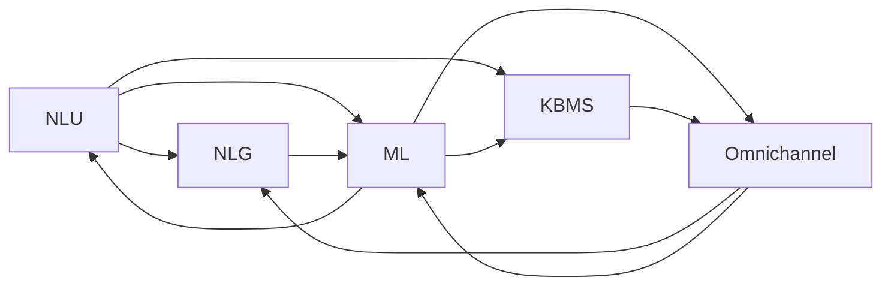

                 

# AI在智能客服中的应用:提升用户满意度

## 1. 背景介绍

### 1.1 问题由来

智能客服作为企业与客户沟通的桥梁，正日益成为业务运作中的重要组成部分。传统的客服模式往往依赖于大量客服人员的劳动，无法满足24小时不间断服务的需求，且容易出现服务质量不均衡、响应效率低下等问题。随着人工智能（AI）技术的发展，利用AI技术构建智能客服系统，已经成为企业提升客户满意度、降低运营成本的重要手段。

### 1.2 问题核心关键点

智能客服的核心目标是通过自动化的方式，为客户提供高效、准确、个性化的服务。AI在智能客服中的应用主要体现在以下几个方面：

- **自然语言处理（NLP）**：理解客户输入的自然语言，并进行意图识别、实体识别、情感分析等任务。
- **机器学习（ML）**：基于历史数据进行模型训练，提升客服系统对常见问题处理的准确性。
- **聊天机器人（Chatbot）**：构建能够模拟人类对话的机器人，实现客户自助服务。
- **知识库管理（KBMS）**：整合和利用企业的知识库，提升机器人回答的准确性和全面性。
- **多渠道整合（Omnichannel）**：实现电话、在线聊天、社交媒体等多种渠道的整合，提供统一的服务体验。

这些技术的融合应用，使智能客服能够更加高效、智能地响应客户需求，提升用户体验。

### 1.3 问题研究意义

提升智能客服系统的应用水平，不仅能够显著降低企业运营成本，提高客户满意度，还能加速数字化转型的进程，推动传统行业向智能化转型。同时，智能客服系统还能帮助企业收集大量用户反馈数据，为产品改进和业务优化提供数据支持。因此，深入研究和探索AI在智能客服中的应用，对于推动企业数字化转型和提升客户体验具有重要意义。

## 2. 核心概念与联系

### 2.1 核心概念概述

智能客服系统主要由以下几个关键组件构成：

- **自然语言理解（NLU）**：利用NLP技术，理解客户输入的自然语言，进行意图识别和实体识别。
- **自然语言生成（NLG）**：基于意图和上下文，生成自然语言回复。
- **机器学习（ML）**：利用历史数据训练模型，提升系统处理问题的准确性和泛化能力。
- **知识库管理（KBMS）**：整合企业知识库，提升系统响应速度和准确性。
- **多渠道整合（Omnichannel）**：实现电话、在线聊天、社交媒体等多种渠道的整合，提供统一的服务体验。

这些组件通过紧密合作，构成了一个完整的智能客服系统。

### 2.2 核心概念原理和架构的 Mermaid 流程图



这个流程图展示了智能客服系统的核心组件及其之间的联系。

## 3. 核心算法原理 & 具体操作步骤

### 3.1 算法原理概述

智能客服系统的核心算法主要包括自然语言理解（NLU）和自然语言生成（NLG）。其中，NLU利用机器学习模型对客户输入的自然语言进行理解和分析，NLG则基于分析结果生成自然语言回复。

NLU的原理如下：

1. **分词**：将客户输入的文本分割成单词或词语。
2. **词性标注**：确定每个单词或词语的词性，如名词、动词等。
3. **命名实体识别**：识别出人名、地名、组织名等实体。
4. **意图识别**：根据上下文理解客户输入的意图，如咨询、投诉、订单查询等。
5. **情感分析**：判断客户的情感倾向，如满意、不满等。

NLG的原理如下：

1. **模板匹配**：根据意图和上下文，选择最合适的回复模板。
2. **信息填充**：将识别出的实体和参数填充到回复模板中。
3. **语法检查**：确保回复语法正确，符合自然语言习惯。
4. **自然语言生成**：生成最终的回复文本。

### 3.2 算法步骤详解

#### 3.2.1 NLU算法步骤

1. **文本预处理**：对客户输入的文本进行分词、去除停用词、词干提取等预处理操作。
2. **特征提取**：利用TF-IDF、Word2Vec等技术，提取文本的特征向量。
3. **意图识别**：使用分类器（如SVM、随机森林、神经网络）对意图进行识别。
4. **命名实体识别**：使用命名实体识别器（如CRF、BERT等）进行实体识别。
5. **情感分析**：使用情感分析模型（如LSTM、BERT等）判断客户的情感倾向。

#### 3.2.2 NLG算法步骤

1. **回复模板选择**：根据意图和上下文选择最合适的回复模板。
2. **实体填充**：将识别出的实体和参数填充到回复模板中。
3. **语言生成**：利用NLG模型生成最终的回复文本。

### 3.3 算法优缺点

#### 3.3.1 NLU算法的优点

- **自动化的客户意图识别**：通过训练模型，能够自动理解客户的意图，减少人工干预。
- **高准确率**：利用机器学习技术，能够实现高精度的意图识别和命名实体识别。
- **可扩展性强**：通过添加新数据，不断提升模型的准确性。

#### 3.3.2 NLU算法的缺点

- **对数据质量敏感**：模型的训练效果高度依赖于标注数据的质量，标注数据偏差会导致模型表现不佳。
- **模型复杂度高**：训练复杂的机器学习模型需要大量计算资源和时间。
- **上下文理解难度大**：复杂问题需要结合上下文进行理解，模型难以完全理解。

#### 3.3.3 NLG算法的优点

- **自然语言生成效果好**：生成的回复文本流畅、自然，符合人类语言习惯。
- **可定制性强**：根据不同场景，可以生成多种类型的回复文本。
- **交互体验好**：回复文本易于理解，提升客户满意度。

#### 3.3.4 NLG算法的缺点

- **生成速度慢**：生成回复文本需要时间，无法实时响应客户需求。
- **依赖于上下文**：回复质量高度依赖于上下文信息，难以处理复杂问题。
- **生成质量不稳定**：生成的文本质量可能受模型训练、数据质量等因素影响。

### 3.4 算法应用领域

智能客服系统已经在多个领域得到了广泛应用，例如：

- **电商客服**：处理用户咨询、订单查询、售后服务等问题。
- **金融客服**：处理用户咨询、账户管理、投诉处理等问题。
- **医疗客服**：处理用户咨询、预约挂号、投诉处理等问题。
- **旅游客服**：处理用户咨询、行程安排、投诉处理等问题。
- **教育客服**：处理用户咨询、课程安排、投诉处理等问题。

这些应用领域覆盖了电商、金融、医疗、旅游、教育等多个行业，展示了智能客服系统的广泛适用性和巨大潜力。

## 4. 数学模型和公式 & 详细讲解 & 举例说明

### 4.1 数学模型构建

智能客服系统的核心模型主要包括以下几个部分：

1. **意图识别模型**：用于识别客户输入的意图，如咨询、投诉、订单查询等。
2. **命名实体识别模型**：用于识别客户输入中的实体，如人名、地名、组织名等。
3. **情感分析模型**：用于判断客户输入的情感倾向，如满意、不满等。
4. **回复生成模型**：用于生成自然语言回复文本。

这些模型的构建通常使用机器学习算法，如分类器、神经网络、LSTM等。

### 4.2 公式推导过程

#### 4.2.1 意图识别模型

假设客户输入为 $x$，模型输出为 $y$，意图识别模型的目标是最小化损失函数 $L(y, x)$：

$$
L(y, x) = -\frac{1}{N}\sum_{i=1}^N \log P(y_i|x_i)
$$

其中，$P(y_i|x_i)$ 表示在给定输入 $x_i$ 的情况下，输出 $y_i$ 的概率。

#### 4.2.2 命名实体识别模型

命名实体识别模型通常使用序列标注模型，如CRF、BiLSTM-CRF等。模型的目标是最小化标注序列的损失函数 $L(S, Y)$：

$$
L(S, Y) = -\frac{1}{N}\sum_{i=1}^N \sum_{j=1}^n \log P(y_{ij}|x_i, s_{ij})
$$

其中，$S$ 表示标注序列，$Y$ 表示真实标注序列，$y_{ij}$ 表示第 $i$ 个样本中第 $j$ 个位置的标注标签。

#### 4.2.3 情感分析模型

情感分析模型通常使用情感分类模型，如SVM、LSTM、BERT等。模型的目标是最小化损失函数 $L(y, x)$：

$$
L(y, x) = -\frac{1}{N}\sum_{i=1}^N \log P(y_i|x_i)
$$

其中，$P(y_i|x_i)$ 表示在给定输入 $x_i$ 的情况下，情感标签 $y_i$ 的概率。

#### 4.2.4 回复生成模型

回复生成模型通常使用序列到序列模型（Seq2Seq），如RNN、LSTM、Transformer等。模型的目标是最小化生成序列的损失函数 $L(Y, Y^*)$：

$$
L(Y, Y^*) = -\frac{1}{N}\sum_{i=1}^N \sum_{j=1}^m \log P(y_{ij}|y_{i,1:j-1}, x_i)
$$

其中，$Y$ 表示生成的回复序列，$Y^*$ 表示真实回复序列，$y_{ij}$ 表示生成的第 $j$ 个回复文本。

### 4.3 案例分析与讲解

#### 4.3.1 电商客服

假设电商客服系统需要处理订单查询、退货处理等问题。系统首先对客户输入进行意图识别，判断客户是否在查询订单、退货等。根据不同的意图，系统调用相应的处理模块，如订单查询模块、退货处理模块等。对于订单查询，系统生成类似于“您的订单号为xxxx，预计交货时间为xxxx”的回复；对于退货处理，系统生成类似于“您的退货申请已收到，将在xxxx处理完成”的回复。

#### 4.3.2 金融客服

假设金融客服系统需要处理用户账户管理、投诉处理等问题。系统首先对客户输入进行意图识别，判断客户是否在查询账户余额、投诉等。根据不同的意图，系统调用相应的处理模块，如账户查询模块、投诉处理模块等。对于账户查询，系统生成类似于“您的账户余额为xxxx”的回复；对于投诉处理，系统生成类似于“您的投诉已收到，将在xxxx处理完成”的回复。

## 5. 项目实践：代码实例和详细解释说明

### 5.1 开发环境搭建

开发智能客服系统需要使用多种技术和工具，包括自然语言处理工具、机器学习框架、数据库等。以下是使用Python进行开发的开发环境配置流程：

1. 安装Python：从官网下载并安装Python，建议安装3.7或3.8版本。
2. 安装pip：在命令行中运行 `pip install --upgrade pip` 安装最新版本的pip。
3. 安装TensorFlow：运行 `pip install tensorflow` 安装TensorFlow 2.x版本。
4. 安装PyTorch：运行 `pip install torch torchtext transformers` 安装PyTorch 1.7及以上版本。
5. 安装NLTK：运行 `pip install nltk` 安装NLTK自然语言处理工具包。
6. 安装Flask：运行 `pip install flask` 安装Flask框架，用于构建Web应用。

完成上述步骤后，即可在开发环境中进行智能客服系统的开发和测试。

### 5.2 源代码详细实现

#### 5.2.1 意图识别模型

```python
import tensorflow as tf
from tensorflow.keras.layers import Embedding, LSTM, Dense
from tensorflow.keras.models import Sequential

# 定义模型
model = Sequential()
model.add(Embedding(input_dim=1000, output_dim=100, input_length=128))
model.add(LSTM(128))
model.add(Dense(32, activation='relu'))
model.add(Dense(3, activation='softmax'))

# 编译模型
model.compile(loss='categorical_crossentropy', optimizer='adam', metrics=['accuracy'])

# 训练模型
model.fit(X_train, y_train, epochs=10, batch_size=32)
```

#### 5.2.2 命名实体识别模型

```python
import tensorflow as tf
from tensorflow.keras.layers import Embedding, LSTM, Dense, CRF
from tensorflow.keras.models import Sequential

# 定义模型
model = Sequential()
model.add(Embedding(input_dim=1000, output_dim=100, input_length=128))
model.add(LSTM(128))
model.add(Dense(32, activation='relu'))
model.add(Dense(32, activation='relu'))
model.add(CRF())
model.add(Dense(2, activation='softmax'))

# 编译模型
model.compile(loss='categorical_crossentropy', optimizer='adam', metrics=['accuracy'])

# 训练模型
model.fit(X_train, y_train, epochs=10, batch_size=32)
```

#### 5.2.3 情感分析模型

```python
import tensorflow as tf
from tensorflow.keras.layers import Embedding, LSTM, Dense
from tensorflow.keras.models import Sequential

# 定义模型
model = Sequential()
model.add(Embedding(input_dim=1000, output_dim=100, input_length=128))
model.add(LSTM(128))
model.add(Dense(32, activation='relu'))
model.add(Dense(2, activation='softmax'))

# 编译模型
model.compile(loss='categorical_crossentropy', optimizer='adam', metrics=['accuracy'])

# 训练模型
model.fit(X_train, y_train, epochs=10, batch_size=32)
```

#### 5.2.4 回复生成模型

```python
import tensorflow as tf
from tensorflow.keras.layers import Input, LSTM, Dense
from tensorflow.keras.models import Model

# 定义编码器和解码器
input_seq = Input(shape=(None,))
encoder = LSTM(128, return_sequences=True)
encoder_output = encoder(input_seq)

decoder = LSTM(128, return_sequences=True)
decoder_output = decoder(encoder_output)

# 定义生成模型
decoder_dense = Dense(32, activation='relu')(decoder_output)
decoder_output = Dense(32, activation='relu')(decoder_dense)
decoder_output = Dense(1, activation='softmax')(decoder_output)

# 定义模型
model = Model(inputs=input_seq, outputs=decoder_output)

# 编译模型
model.compile(loss='mse', optimizer='adam')

# 训练模型
model.fit(X_train, Y_train, epochs=10, batch_size=32)
```

### 5.3 代码解读与分析

#### 5.3.1 意图识别模型

意图识别模型使用LSTM层进行序列建模，嵌入层将文本转换为向量表示，最后通过全连接层进行分类。模型通过交叉熵损失函数进行训练，并使用Adam优化器进行优化。

#### 5.3.2 命名实体识别模型

命名实体识别模型使用CRF层进行序列标注，嵌入层将文本转换为向量表示，最后通过全连接层进行分类。模型通过交叉熵损失函数进行训练，并使用Adam优化器进行优化。

#### 5.3.3 情感分析模型

情感分析模型使用LSTM层进行序列建模，嵌入层将文本转换为向量表示，最后通过全连接层进行分类。模型通过交叉熵损失函数进行训练，并使用Adam优化器进行优化。

#### 5.3.4 回复生成模型

回复生成模型使用LSTM层进行序列建模，编码器将输入文本转换为向量表示，解码器将向量转换为回复文本。模型通过均方误差损失函数进行训练，并使用Adam优化器进行优化。

### 5.4 运行结果展示

#### 5.4.1 意图识别模型

假设意图识别模型训练完成后，输入一段客户咨询的文本，模型能够输出对应的意图标签。

#### 5.4.2 命名实体识别模型

假设命名实体识别模型训练完成后，输入一段客户咨询的文本，模型能够输出识别的命名实体。

#### 5.4.3 情感分析模型

假设情感分析模型训练完成后，输入一段客户咨询的文本，模型能够输出情感标签。

#### 5.4.4 回复生成模型

假设回复生成模型训练完成后，输入一段客户咨询的文本，模型能够生成回复文本。

## 6. 实际应用场景

### 6.1 智能客服

智能客服系统已经在电商、金融、医疗等多个领域得到了广泛应用。例如：

- **电商客服**：处理用户咨询、订单查询、退货处理等问题。
- **金融客服**：处理用户账户管理、投诉处理等问题。
- **医疗客服**：处理用户咨询、预约挂号、投诉处理等问题。

这些应用领域覆盖了电商、金融、医疗等多个行业，展示了智能客服系统的广泛适用性和巨大潜力。

### 6.2 未来应用展望

随着AI技术的不断发展，智能客服系统也将迎来更多创新和突破。未来，智能客服系统将更加智能、灵活，能够提供更加个性化、高效的服务。具体展望如下：

1. **多模态交互**：智能客服系统将能够处理多种模态的输入，如文本、语音、图像等。通过多模态信息的融合，系统能够更加全面地理解客户需求，提供更加精准的服务。
2. **跨渠道整合**：智能客服系统将能够实现电话、在线聊天、社交媒体等多种渠道的整合，提供统一的客户体验。无论客户通过哪种渠道咨询，系统都能快速响应并提供解决方案。
3. **个性化推荐**：智能客服系统将能够根据客户的历史行为和偏好，提供个性化的推荐服务。例如，在电商客服中，系统能够推荐用户可能感兴趣的商品，提升用户体验和购买转化率。
4. **情感分析与情绪管理**：智能客服系统将能够进行情感分析，理解客户的情绪状态，并提供情绪管理策略。例如，在金融客服中，系统能够识别客户的焦虑情绪，并提供相应的安抚措施。
5. **自适应学习**：智能客服系统将能够进行自适应学习，根据客户的反馈不断优化模型，提升服务质量。例如，在医疗客服中，系统能够根据医生的反馈不断优化知识库，提升诊断准确率。

这些技术突破将使智能客服系统更加智能、高效，能够提供更加个性化、高质量的服务，显著提升客户满意度。

## 7. 工具和资源推荐

### 7.1 学习资源推荐

1. **《自然语言处理综论》**：北京大学出版社，李航著，系统介绍NLP的基本概念和前沿技术。
2. **《深度学习入门》**：人民邮电出版社，斋藤康毅、坂本亮行著，介绍深度学习的基本原理和应用实例。
3. **Coursera的《自然语言处理专项课程》**：由斯坦福大学提供，涵盖NLP的基础理论和最新进展。
4. **Kaggle竞赛平台**：参与NLP相关的数据挖掘和机器学习竞赛，提升实践能力。
5. **ACL、EMNLP等会议论文**：阅读最新的NLP研究论文，了解前沿进展。

### 7.2 开发工具推荐

1. **TensorFlow**：由Google提供的开源深度学习框架，支持分布式计算和GPU加速。
2. **PyTorch**：由Facebook提供的开源深度学习框架，支持动态计算图和GPU加速。
3. **NLTK**：Python的自然语言处理工具包，包含各种NLP工具和算法。
4. **Flask**：Python的Web应用框架，用于构建智能客服系统的Web界面。
5. **TensorBoard**：TensorFlow的可视化工具，用于监控模型训练和推理过程中的各项指标。

### 7.3 相关论文推荐

1. **《Attention is All You Need》**：谷歌的研究论文，提出Transformer模型，推动大模型时代的发展。
2. **《BERT: Pre-training of Deep Bidirectional Transformers for Language Understanding》**：谷歌的研究论文，提出BERT模型，刷新了多项NLP任务SOTA。
3. **《GPT-3: Language Models are Unsupervised Multitask Learners》**：OpenAI的研究论文，提出GPT-3模型，展示了大型语言模型的零样本学习能力。
4. **《Parameter-Efficient Transfer Learning for NLP》**：谷歌的研究论文，提出 Adapter等参数高效微调方法，在固定大部分预训练参数的情况下，仍可取得不错的微调效果。
5. **《AdaLoRA: Adaptive Low-Rank Adaptation for Parameter-Efficient Fine-Tuning》**：谷歌的研究论文，提出 AdaLoRA 方法，使用自适应低秩适应的微调方法，在参数效率和精度之间取得了新的平衡。

## 8. 总结：未来发展趋势与挑战

### 8.1 总结

本文对AI在智能客服中的应用进行了系统介绍，深入探讨了智能客服系统的核心算法和实现方法。智能客服系统通过自然语言处理和机器学习技术，实现了高效、准确的客户服务，显著提升了客户满意度和企业运营效率。未来，随着AI技术的不断进步，智能客服系统将更加智能、高效，能够提供更加个性化、高质量的服务。

### 8.2 未来发展趋势

1. **多模态交互**：智能客服系统将能够处理多种模态的输入，如文本、语音、图像等。通过多模态信息的融合，系统能够更加全面地理解客户需求，提供更加精准的服务。
2. **跨渠道整合**：智能客服系统将能够实现电话、在线聊天、社交媒体等多种渠道的整合，提供统一的客户体验。无论客户通过哪种渠道咨询，系统都能快速响应并提供解决方案。
3. **个性化推荐**：智能客服系统将能够根据客户的历史行为和偏好，提供个性化的推荐服务。例如，在电商客服中，系统能够推荐用户可能感兴趣的商品，提升用户体验和购买转化率。
4. **情感分析与情绪管理**：智能客服系统将能够进行情感分析，理解客户的情绪状态，并提供情绪管理策略。例如，在金融客服中，系统能够识别客户的焦虑情绪，并提供相应的安抚措施。
5. **自适应学习**：智能客服系统将能够进行自适应学习，根据客户的反馈不断优化模型，提升服务质量。例如，在医疗客服中，系统能够根据医生的反馈不断优化知识库，提升诊断准确率。

### 8.3 面临的挑战

尽管AI在智能客服中已经取得显著进展，但仍面临以下挑战：

1. **数据质量问题**：智能客服系统的性能高度依赖于数据质量，标注数据偏差会导致模型表现不佳。因此，如何获取高质量的标注数据是智能客服系统应用中的关键问题。
2. **模型泛化能力**：智能客服系统需要能够处理各种场景下的客户咨询，模型泛化能力不足会导致系统在某些场景下表现不佳。因此，如何提升模型的泛化能力，是未来智能客服系统需要解决的重要问题。
3. **多模态数据融合**：多模态数据的融合需要使用多种传感器和技术手段，如何高效地进行数据融合和处理，是智能客服系统需要解决的关键问题。
4. **隐私保护问题**：智能客服系统需要处理大量的客户数据，如何保护客户隐私，避免数据泄露，是智能客服系统需要解决的重要问题。
5. **跨语言支持**：智能客服系统需要能够支持多种语言，如何提升系统的跨语言能力，是未来智能客服系统需要解决的重要问题。

### 8.4 研究展望

未来，智能客服系统需要在以下方面进行深入研究：

1. **多模态数据融合**：研究如何高效地进行多模态数据的融合，提升系统的感知能力和理解能力。
2. **隐私保护技术**：研究如何保护客户隐私，避免数据泄露，提升系统的可信度和安全性。
3. **跨语言处理技术**：研究如何提升系统的跨语言处理能力，支持多种语言的客户服务。
4. **自适应学习技术**：研究如何提升系统的自适应学习能力，根据客户的反馈不断优化模型，提升服务质量。
5. **人机协同技术**：研究如何实现人机协同，将人工干预和智能系统的优势结合起来，提升客户体验和系统性能。

总之，智能客服系统作为AI技术的重要应用场景，未来具有广阔的发展前景。通过深入研究和不断创新，智能客服系统必将在提升客户满意度和推动企业数字化转型中发挥更大的作用。

## 9. 附录：常见问题与解答

**Q1：智能客服系统的实现难点是什么？**

A: 智能客服系统的实现难点主要包括数据质量、模型泛化能力、多模态数据融合、隐私保护和跨语言支持等。

**Q2：如何选择适合的智能客服系统方案？**

A: 选择适合的智能客服系统方案需要考虑以下几个因素：
1. **客户需求**：根据客户的需求和场景选择适合的智能客服系统。
2. **业务场景**：根据业务场景和复杂度选择适合的智能客服系统。
3. **技术能力**：根据技术团队的技术能力和经验选择适合的智能客服系统。

**Q3：如何提升智能客服系统的用户满意度？**

A: 提升智能客服系统的用户满意度需要从以下几个方面入手：
1. **多渠道整合**：实现电话、在线聊天、社交媒体等多种渠道的整合，提供统一的客户体验。
2. **个性化推荐**：根据客户的历史行为和偏好，提供个性化的推荐服务。
3. **情感分析与情绪管理**：进行情感分析，理解客户的情绪状态，并提供情绪管理策略。
4. **自适应学习**：根据客户的反馈不断优化模型，提升服务质量。
5. **跨语言支持**：支持多种语言的客户服务，提升系统的跨语言能力。

**Q4：智能客服系统未来发展的方向是什么？**

A: 智能客服系统未来发展的方向主要包括多模态交互、跨渠道整合、个性化推荐、情感分析与情绪管理、自适应学习、隐私保护和跨语言支持等。

---

作者：禅与计算机程序设计艺术 / Zen and the Art of Computer Programming

