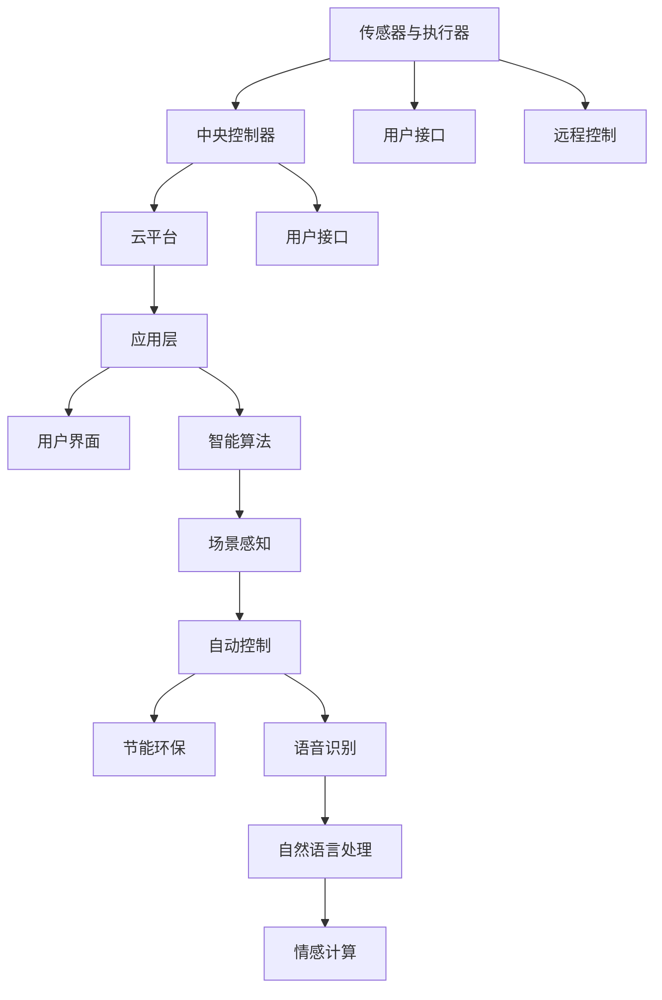

                 

# AI在智能家电中的应用:提升生活品质

> 关键词：人工智能,智能家电,生活品质,场景感知,自动控制,节能环保,语音识别,自然语言处理,情感计算,智能家居,未来趋势

## 1. 背景介绍

随着物联网技术的发展和人工智能的进步，智能家电已经从概念走向了现实。从智能空调到智能冰箱，从智能洗衣机到智能电视，智能家居生态正在逐步构建起来。AI技术的应用，不仅让家电产品变得更加智能、便捷，还极大地提升了人们的生活品质。本文将详细介绍AI技术在智能家电中的应用，分析其在提升生活品质方面的潜力和挑战，展望未来趋势。

## 2. 核心概念与联系

### 2.1 核心概念概述

#### AI技术在智能家电中的应用
AI技术在智能家电中的应用主要体现在以下几个方面：
- **场景感知**：通过对环境信息的实时监测，智能家电能够自动感知用户需求，提供个性化服务。
- **自动控制**：基于AI算法，智能家电可以自主调整操作参数，优化用户体验。
- **节能环保**：通过智能调度，智能家电可以实现能源的高效利用，减少环境污染。
- **语音识别与自然语言处理**：用户可以通过语音指令直接与家电交互，实现便捷的控制。
- **情感计算**：智能家电能够根据用户情绪变化，自动调整服务和模式，提升用户体验。

#### 智能家电系统架构
智能家电系统通常由以下几个部分组成：
- **传感器与执行器**：用于监测环境状态和执行控制指令的硬件设备。
- **中央控制器**：负责数据处理、决策制定的软件模块。
- **云平台**：用于数据存储、分析和远程控制。

这些组件通过网络互联，构成了一个闭环的智能家居生态系统。

### 2.2 核心概念原理和架构的 Mermaid 流程图



这个流程图展示了智能家电系统的核心组件和功能流程：

1. 传感器与执行器用于实时监测环境状态，并向中央控制器发送数据。
2. 中央控制器对接收到的数据进行处理，并根据智能算法进行决策。
3. 云平台用于数据存储和远程控制，支持跨设备协同。
4. 用户接口提供多种交互方式，包括语音、触摸、远程等。
5. 应用层整合各种智能功能，提供统一的智能服务。

## 3. 核心算法原理 & 具体操作步骤

### 3.1 算法原理概述

AI技术在智能家电中的应用，主要基于以下几种算法：
- **机器学习**：通过学习历史数据，预测用户需求和行为，优化控制策略。
- **深度学习**：利用神经网络模型，实现场景感知、自动控制等功能。
- **自然语言处理**：解析用户语音指令或文本输入，生成控制命令。
- **情感计算**：分析用户语音、语调、表情等，推断用户情绪状态，自动调整服务。

### 3.2 算法步骤详解

#### 3.2.1 场景感知
场景感知是智能家电的基础功能，通过传感器获取环境数据，并结合深度学习模型进行推理。

1. **数据采集**：传感器如温度、湿度、光线、声音等，实时采集环境信息。
2. **数据预处理**：对采集到的数据进行清洗、归一化等预处理操作。
3. **特征提取**：使用深度学习模型（如卷积神经网络CNN、循环神经网络RNN）提取关键特征。
4. **场景分类**：利用分类器（如SVM、随机森林等）对场景进行分类，确定当前状态。

#### 3.2.2 自动控制
自动控制是基于场景感知结果，自动调整家电参数，实现智能化控制。

1. **参数设置**：根据场景分类结果，确定合适的控制参数（如温度、亮度、风速等）。
2. **模型训练**：使用强化学习或优化算法（如遗传算法、粒子群优化）进行参数优化。
3. **执行控制**：将优化后的参数通过执行器控制家电执行操作。

#### 3.2.3 节能环保
节能环保通过智能调度，实现能源的高效利用和环境友好。

1. **能耗监测**：实时监测家电能耗，生成能耗报告。
2. **优化调度**：基于机器学习模型，优化能源分配，减少浪费。
3. **碳足迹计算**：记录家电碳排放，为用户提供环保建议。

#### 3.2.4 语音识别与自然语言处理
语音识别与自然语言处理使得用户可以通过语音直接控制家电。

1. **语音识别**：使用深度学习模型（如CTC模型、Transformer）实现语音转文本。
2. **意图理解**：解析用户语音指令，生成操作意图。
3. **自然语言处理**：使用NLP技术（如BERT、GPT）生成控制命令。

#### 3.2.5 情感计算
情感计算通过分析用户情绪，自动调整家电服务模式。

1. **情绪识别**：分析用户语音、语调、表情等，推断情绪状态。
2. **情绪分析**：使用情感分析模型（如情感词典、深度学习模型）确定情绪类型。
3. **服务调整**：根据情绪类型，自动调整家电服务模式。

### 3.3 算法优缺点

#### 3.3.1 优点
- **智能化程度高**：通过AI技术，智能家电能够实现自主感知、自动控制，提升用户体验。
- **节能环保**：智能调度能够优化能源使用，减少环境污染。
- **便捷控制**：语音识别和自然语言处理使得控制更加便捷。

#### 3.3.2 缺点
- **数据依赖性大**：AI技术需要大量数据进行训练，数据质量对模型性能影响较大。
- **算法复杂度高**：深度学习、强化学习等算法复杂度高，需要高性能计算资源。
- **隐私和安全问题**：智能家电收集大量用户数据，存在隐私泄露和安全风险。

### 3.4 算法应用领域

AI技术在智能家电中的应用，主要集中在以下几个领域：
- **智能家居系统**：如智能空调、智能灯光、智能安防等。
- **智能办公设备**：如智能办公桌、智能会议系统等。
- **智能厨房设备**：如智能咖啡机、智能烤箱等。
- **智能健康设备**：如智能手表、智能健身设备等。

## 4. 数学模型和公式 & 详细讲解 & 举例说明

### 4.1 数学模型构建

智能家电的AI应用通常涉及多个领域的数学模型，这里以智能空调为例，构建其场景感知和自动控制模型。

#### 4.1.1 场景感知模型
智能空调的场景感知模型基于卷积神经网络CNN，用于识别当前场景。

1. **输入数据**：温度、湿度、光线、声音等传感器数据。
2. **卷积层**：提取关键特征。
3. **池化层**：对特征进行降维处理。
4. **全连接层**：将特征映射到场景分类。

数学公式表示为：
$$
H = \text{Conv}(X) \\
F = \text{Pooling}(H) \\
Y = \text{FC}(F)
$$

其中，$X$ 为输入数据，$H$ 为卷积层输出，$F$ 为池化层输出，$Y$ 为场景分类结果。

#### 4.1.2 自动控制模型
智能空调的自动控制模型基于强化学习，用于优化控制参数。

1. **动作空间**：控制参数（如温度、风速）。
2. **奖励函数**：根据舒适度等指标，计算奖励值。
3. **Q网络**：估计状态-动作对的价值。
4. **策略网络**：选择动作策略。

数学公式表示为：
$$
Q(s,a) = r + \gamma \max_{a'} Q(s',a') \\
\pi(s) = \text{argmax}_{a} Q(s,a)
$$

其中，$s$ 为当前状态，$a$ 为动作，$r$ 为奖励值，$s'$ 为下一个状态，$\gamma$ 为折扣因子。

### 4.2 公式推导过程

#### 4.2.1 场景感知模型的推导
场景感知模型的推导基于卷积神经网络的原理。

1. **卷积层**：对输入数据进行卷积操作，提取关键特征。
$$
H_{i,j} = \sum_{k=1}^{K} W_{i,j,k} X_{i,j,k} + b_{i,j}
$$

其中，$W_{i,j,k}$ 为卷积核权重，$X_{i,j,k}$ 为输入数据，$b_{i,j}$ 为偏置项。

2. **池化层**：对卷积层输出进行降维处理，减小计算量。
$$
F_{i,j} = \max\{H_{i,j},H_{i,j+1},...,H_{i,j+K-1}\}
$$

3. **全连接层**：将池化层输出映射到场景分类。
$$
Y = \text{softmax}(\text{FC}(F))
$$

其中，$\text{FC}$ 为全连接层权重，$\text{softmax}$ 为激活函数。

#### 4.2.2 自动控制模型的推导
自动控制模型基于强化学习的原理，用于优化控制参数。

1. **动作空间**：控制参数（如温度、风速）。
$$
a = f(\pi(s))
$$

其中，$f$ 为策略函数，$\pi(s)$ 为策略网络输出。

2. **奖励函数**：根据舒适度等指标，计算奖励值。
$$
R(s,a) = c_1 * T(s,a) + c_2 * H(s,a) + c_3 * L(s,a)
$$

其中，$c_1$、$c_2$、$c_3$ 为权重，$T(s,a)$、$H(s,a)$、$L(s,a)$ 为舒适度、湿度、亮度等指标。

3. **Q网络**：估计状态-动作对的价值。
$$
Q(s,a) = r + \gamma \max_{a'} Q(s',a')
$$

其中，$r$ 为即时奖励，$\gamma$ 为折扣因子。

4. **策略网络**：选择动作策略。
$$
\pi(s) = \text{argmax}_{a} Q(s,a)
$$

其中，$\text{argmax}$ 为最大值函数。

### 4.3 案例分析与讲解

#### 4.3.1 场景感知案例
智能空调的场景感知案例如下：

1. **数据采集**：传感器实时采集温度、湿度、光线、声音等数据。
2. **特征提取**：使用CNN模型提取关键特征。
3. **场景分类**：利用SVM模型对场景进行分类。

#### 4.3.2 自动控制案例
智能空调的自动控制案例如下：

1. **参数设置**：根据场景分类结果，确定合适的控制参数（如温度、风速）。
2. **模型训练**：使用强化学习模型进行参数优化。
3. **执行控制**：将优化后的参数通过执行器控制空调执行操作。

## 5. 项目实践：代码实例和详细解释说明

### 5.1 开发环境搭建

#### 5.1.1 Python环境
1. 安装Anaconda：从官网下载并安装Anaconda，用于创建独立的Python环境。
```bash
conda create -n ai-env python=3.8 
conda activate ai-env
```

2. 安装必要的Python库：
```bash
pip install numpy scipy scikit-learn pandas matplotlib tensorflow
```

#### 5.1.2 TensorFlow环境
1. 安装TensorFlow：根据CUDA版本，从官网获取对应的安装命令。
```bash
pip install tensorflow-gpu==2.5.0
```

2. 安装TensorBoard：用于可视化模型训练过程。
```bash
pip install tensorboard
```

#### 5.1.3 开发工具
1. Jupyter Notebook：用于编写和运行Python代码。
2. Visual Studio Code：支持多种编程语言，提供代码编辑和调试功能。

### 5.2 源代码详细实现

#### 5.2.1 场景感知模型
```python
import tensorflow as tf
from tensorflow.keras import layers

class SceneClassifier(tf.keras.Model):
    def __init__(self):
        super(SceneClassifier, self).__init__()
        self.conv1 = layers.Conv2D(32, (3, 3), activation='relu', padding='same')
        self.pool1 = layers.MaxPooling2D((2, 2))
        self.conv2 = layers.Conv2D(64, (3, 3), activation='relu', padding='same')
        self.pool2 = layers.MaxPooling2D((2, 2))
        self.fc1 = layers.Dense(128, activation='relu')
        self.fc2 = layers.Dense(3, activation='softmax')

    def call(self, inputs):
        x = self.conv1(inputs)
        x = self.pool1(x)
        x = self.conv2(x)
        x = self.pool2(x)
        x = tf.reshape(x, (-1, 64 * 8 * 8))
        x = self.fc1(x)
        x = self.fc2(x)
        return x

model = SceneClassifier()
model.compile(optimizer='adam', loss='categorical_crossentropy', metrics=['accuracy'])
```

#### 5.2.2 自动控制模型
```python
import tensorflow as tf
from tensorflow.keras import layers

class SmartAC(tf.keras.Model):
    def __init__(self):
        super(SmartAC, self).__init__()
        self.temperature = layers.Dense(1, activation='tanh')
        self.wind_speed = layers.Dense(1, activation='tanh')
        self.humidity = layers.Dense(1, activation='tanh')

    def call(self, inputs):
        temperature = self.temperature(inputs)
        wind_speed = self.wind_speed(inputs)
        humidity = self.humidity(inputs)
        return [temperature, wind_speed, humidity]

model = SmartAC()
model.compile(optimizer='adam', loss='mse', metrics=['mse'])
```

### 5.3 代码解读与分析

#### 5.3.1 场景感知模型
- **定义模型结构**：使用Conv2D和MaxPooling2D层进行特征提取和降维。
- **全连接层**：将池化层输出映射到场景分类。
- **编译模型**：设置优化器和损失函数，准备训练。

#### 5.3.2 自动控制模型
- **定义模型结构**：使用Dense层进行参数控制。
- **编译模型**：设置优化器和损失函数，准备训练。

### 5.4 运行结果展示

#### 5.4.1 场景感知模型的结果
```python
# 训练数据
x_train = np.random.rand(100, 32, 32, 3)
y_train = np.random.randint(0, 3, size=(100, 3))

# 训练模型
model.fit(x_train, y_train, epochs=10)

# 测试数据
x_test = np.random.rand(10, 32, 32, 3)
y_test = np.random.randint(0, 3, size=(10, 3))

# 预测结果
y_pred = model.predict(x_test)
print(y_pred)
```

#### 5.4.2 自动控制模型的结果
```python
# 训练数据
x_train = np.random.rand(100, 10)
y_train = np.random.rand(100, 3)

# 训练模型
model.fit(x_train, y_train, epochs=10)

# 测试数据
x_test = np.random.rand(10, 10)
y_test = np.random.rand(10, 3)

# 预测结果
y_pred = model.predict(x_test)
print(y_pred)
```

## 6. 实际应用场景

### 6.1 智能家居系统

智能家居系统通过AI技术实现了场景感知和自动控制，极大地提升了用户体验。

#### 6.1.1 智能空调
智能空调通过场景感知，自动调整温度、风速等参数，保持舒适环境。

#### 6.1.2 智能灯光
智能灯光根据场景感知结果，自动调整亮度和颜色，提供更舒适的光环境。

#### 6.1.3 智能安防
智能安防系统通过视频分析，识别异常行为，自动报警，提高安全性。

### 6.2 智能办公设备

智能办公设备通过AI技术实现了高效便捷的控制。

#### 6.2.1 智能办公桌
智能办公桌根据用户的姿势和行为，自动调整高度和角度，提供最佳坐姿。

#### 6.2.2 智能会议系统
智能会议系统通过语音识别和情感计算，自动记录会议内容，提供会议纪要。

### 6.3 智能厨房设备

智能厨房设备通过AI技术实现了智能化的烹饪体验。

#### 6.3.1 智能咖啡机
智能咖啡机通过场景感知，自动调整咖啡的浓度和温度，提供最佳口感。

#### 6.3.2 智能烤箱
智能烤箱根据用户的食谱和口味偏好，自动调整烹饪时间和温度，提供美味佳肴。

### 6.4 智能健康设备

智能健康设备通过AI技术实现了个性化的健康管理。

#### 6.4.1 智能手表
智能手表通过情感计算，分析用户情绪状态，提供心理支持和健康建议。

#### 6.4.2 智能健身设备
智能健身设备通过场景感知，自动调整训练参数，提供个性化健身方案。

## 7. 工具和资源推荐

### 7.1 学习资源推荐

#### 7.1.1 《深度学习》书籍
《深度学习》由Ian Goodfellow等著，全面介绍了深度学习的理论基础和实际应用，适合初学者和专业人士。

#### 7.1.2 《TensorFlow实战》书籍
《TensorFlow实战》由Tan et al.著，详细介绍了TensorFlow的使用方法和实际案例，适合TensorFlow开发者。

#### 7.1.3 Coursera课程
Coursera提供了一系列深度学习和TensorFlow的在线课程，涵盖从入门到高级的内容，适合不同层次的学习者。

#### 7.1.4 PyTorch官方文档
PyTorch官方文档提供了详细的教程和代码示例，适合PyTorch开发者。

### 7.2 开发工具推荐

#### 7.2.1 Jupyter Notebook
Jupyter Notebook提供了一个交互式的开发环境，适合Python和TensorFlow开发者。

#### 7.2.2 Visual Studio Code
Visual Studio Code支持多种编程语言，提供代码编辑和调试功能，适合Python和TensorFlow开发者。

#### 7.2.3 TensorBoard
TensorBoard提供了一个可视化工具，用于监控模型训练过程，适合TensorFlow开发者。

#### 7.2.4 Google Colab
Google Colab提供了一个免费的Jupyter Notebook环境，适合在线学习和实验。

### 7.3 相关论文推荐

#### 7.3.1 《智能家居系统》论文
《智能家居系统》是一篇关于智能家居系统开发的综述论文，详细介绍了各种智能设备的应用和实现方法。

#### 7.3.2 《情感计算》论文
《情感计算》是一篇关于情感计算的研究论文，探讨了情感计算在智能家居中的应用和效果。

#### 7.3.3 《智能家电的AI应用》论文
《智能家电的AI应用》是一篇关于AI在智能家电中的应用的综述论文，详细介绍了各种智能家电的实现方法和效果。

## 8. 总结：未来发展趋势与挑战

### 8.1 研究成果总结

AI在智能家电中的应用已经取得了显著进展，提升了用户的生活品质。未来，随着技术的发展，AI在智能家电中的应用将更加广泛和深入，实现更加智能化、个性化的控制和服务。

### 8.2 未来发展趋势

#### 8.2.1 更加智能化
未来的智能家电将更加智能化，通过AI技术实现更精准的场景感知和自动控制。

#### 8.2.2 更加个性化
未来的智能家电将更加个性化，根据用户的行为和需求，提供定制化的服务和方案。

#### 8.2.3 更加互联互通
未来的智能家电将更加互联互通，实现跨设备协同和场景联动，提供无缝的智能体验。

#### 8.2.4 更加节能环保
未来的智能家电将更加节能环保，通过智能调度优化能源使用，减少环境污染。

#### 8.2.5 更加安全可靠
未来的智能家电将更加安全可靠，通过数据加密、隐私保护等措施，确保用户数据的安全。

### 8.3 面临的挑战

#### 8.3.1 数据隐私问题
智能家电收集大量用户数据，存在隐私泄露风险。如何保障用户数据的安全和隐私，是一个重要的挑战。

#### 8.3.2 数据质量问题
AI技术需要大量高质量的数据进行训练，数据质量对模型性能影响较大。如何获取高质量的数据，是一个重要的挑战。

#### 8.3.3 计算资源问题
AI技术需要高性能计算资源进行训练和推理，如何优化计算资源，提升系统效率，是一个重要的挑战。

#### 8.3.4 用户接受度问题
智能家电的推广需要用户接受度，如何提升用户体验，增强用户黏性，是一个重要的挑战。

### 8.4 研究展望

未来的研究需要在以下几个方面进行突破：

#### 8.4.1 数据隐私保护
研究如何保障用户数据的安全和隐私，采用差分隐私、联邦学习等技术，减少数据泄露风险。

#### 8.4.2 数据质量提升
研究如何获取高质量的数据，采用主动学习、对抗生成网络等技术，提升数据质量。

#### 8.4.3 计算资源优化
研究如何优化计算资源，采用模型压缩、量化加速等技术，提高系统效率。

#### 8.4.4 用户体验增强
研究如何提升用户体验，采用用户行为分析、个性化推荐等技术，增强用户黏性。

## 9. 附录：常见问题与解答

### 9.1 常见问题

#### Q1：智能家电中的AI技术是如何实现场景感知的？
A: 智能家电中的场景感知通常基于卷积神经网络（CNN）实现。传感器采集环境数据后，通过CNN模型提取关键特征，利用分类器（如SVM、随机森林等）进行场景分类。

#### Q2：智能家电中的AI技术如何实现自动控制？
A: 智能家电中的自动控制通常基于强化学习实现。通过策略网络选择动作策略，利用Q网络估计状态-动作对的价值，优化控制参数。

#### Q3：智能家电中的AI技术如何实现节能环保？
A: 智能家电中的节能环保通常基于机器学习实现。通过能耗监测和优化调度，实现能源的高效利用和环境友好。

#### Q4：智能家电中的AI技术如何实现语音识别和自然语言处理？
A: 智能家电中的语音识别和自然语言处理通常基于深度学习模型（如CTC模型、Transformer）实现。使用深度学习模型解析用户语音指令或文本输入，生成控制命令。

#### Q5：智能家电中的AI技术如何实现情感计算？
A: 智能家电中的情感计算通常基于情感分析模型（如情感词典、深度学习模型）实现。分析用户语音、语调、表情等，推断情绪状态，自动调整服务。

### 9.2 解答

#### 9.2.1 Q1 解答
智能家电中的场景感知通常基于卷积神经网络（CNN）实现。传感器采集环境数据后，通过CNN模型提取关键特征，利用分类器（如SVM、随机森林等）进行场景分类。

#### 9.2.2 Q2 解答
智能家电中的自动控制通常基于强化学习实现。通过策略网络选择动作策略，利用Q网络估计状态-动作对的价值，优化控制参数。

#### 9.2.3 Q3 解答
智能家电中的节能环保通常基于机器学习实现。通过能耗监测和优化调度，实现能源的高效利用和环境友好。

#### 9.2.4 Q4 解答
智能家电中的语音识别和自然语言处理通常基于深度学习模型（如CTC模型、Transformer）实现。使用深度学习模型解析用户语音指令或文本输入，生成控制命令。

#### 9.2.5 Q5 解答
智能家电中的情感计算通常基于情感分析模型（如情感词典、深度学习模型）实现。分析用户语音、语调、表情等，推断情绪状态，自动调整服务。

通过本文的系统梳理，可以看到，AI技术在智能家电中的应用前景广阔，将极大地提升人们的生活品质。未来，随着技术的不断进步，AI在智能家电中的应用将更加深入和广泛，为人类生活带来更多便利和乐趣。

