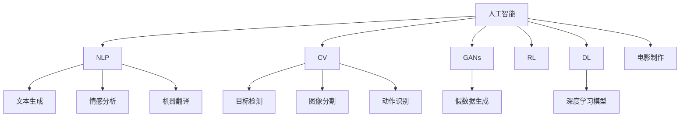

                 

# AI在电影制作中的应用：从剧本到特效

## 1. 背景介绍

### 1.1 问题由来
电影制作是一个复杂而精细的过程，涉及编剧、导演、演员、特效、剪辑等多个环节。随着人工智能技术的不断发展，AI已经开始深入到电影制作的各个环节，从剧本创作到特效制作，AI正在重塑电影产业的面貌。

### 1.2 问题核心关键点
AI在电影制作中的应用主要体现在以下几个方面：

- **剧本创作**：AI可以生成创意、分析剧情、推荐角色等，加速剧本的创作过程。
- **演员选择**：AI可以通过面部表情、语调等特征匹配角色，提升选角效率和效果。
- **动作捕捉与特效制作**：AI可以分析动作数据，生成高质量的动画和特效。
- **声音合成与处理**：AI可以进行语音识别、语音合成、降噪等处理，提升电影的声音质量。
- **剪辑与编辑**：AI可以帮助自动化剪辑，优化视频的节奏和视觉效果。

### 1.3 问题研究意义
AI在电影制作中的应用，不仅可以提升制作效率，降低成本，还可以带来新的创意和效果。对于电影制作公司而言，AI技术能够有效提升竞争力，增加票房收入。

## 2. 核心概念与联系

### 2.1 核心概念概述

为更好地理解AI在电影制作中的应用，本节将介绍几个密切相关的核心概念：

- **人工智能**：通过算法和数据训练，能够执行智能任务的系统或模型。
- **自然语言处理**(NLP)：AI领域专注于人类语言处理技术的子领域，包括文本生成、情感分析、机器翻译等。
- **计算机视觉**(CV)：AI领域专注于图像和视频处理的子领域，包括目标检测、图像分割、动作识别等。
- **生成对抗网络**(GANs)：一种基于博弈论的AI模型，通过两个神经网络相互博弈，生成高质量的假数据。
- **强化学习**(RL)：通过与环境互动，智能体逐步学习最优策略的AI技术。
- **深度学习**(DL)：一种基于神经网络的AI学习技术，可以处理复杂的非线性问题。

这些核心概念之间的逻辑关系可以通过以下Mermaid流程图来展示：



这个流程图展示了大语言模型的工作原理和优化方向。

## 3. 核心算法原理 & 具体操作步骤
### 3.1 算法原理概述

AI在电影制作中的应用，主要通过以下几个核心算法原理实现：

- **自然语言处理**：通过对剧本、对话、角色描述等文本数据进行分析，生成创意和剧情，推荐角色。
- **计算机视觉**：通过对视频帧和动作数据的分析，生成动画和特效，进行目标检测和识别。
- **生成对抗网络**：生成高质量的假数据，用于训练深度学习模型。
- **深度学习**：通过学习大量数据，生成逼真的电影片段和特效。

### 3.2 算法步骤详解

**Step 1: 数据准备**
- 收集剧本、对话、角色描述等文本数据，用于自然语言处理。
- 收集视频帧和动作数据，用于计算机视觉。
- 收集标注数据，用于训练生成对抗网络和深度学习模型。

**Step 2: 模型训练**
- 使用预训练的自然语言处理模型（如BERT、GPT）进行微调，生成创意、剧情、角色建议等。
- 使用预训练的计算机视觉模型（如ResNet、EfficientNet）进行微调，生成动画、特效、动作识别等。
- 使用生成对抗网络进行假数据生成，提升深度学习模型的训练效果。
- 使用深度学习模型进行视频片段和特效生成。

**Step 3: 模型评估**
- 对自然语言处理模型生成的文本进行分析，评估创意和剧情的合理性。
- 对计算机视觉模型生成的动画和特效进行评估，分析动作和场景的逼真度。
- 对深度学习模型生成的视频片段进行评估，分析画面和声音的融合度。

**Step 4: 模型集成**
- 将自然语言处理、计算机视觉和深度学习模型集成到电影制作流程中，实现自动化创作和制作。
- 优化模型参数，提高创作和制作的效率和质量。

**Step 5: 应用部署**
- 将训练好的模型部署到实际的电影制作环境中，进行大规模生产应用。
- 持续收集用户反馈，不断优化和更新模型。

### 3.3 算法优缺点

AI在电影制作中的应用，具有以下优点：
1. 提升效率：通过自动化处理大量数据，显著提高制作效率。
2. 降低成本：减少人力成本，提升资源利用率。
3. 创新创意：通过数据分析和生成，提供新的创作思路和方案。

同时，也存在一定的局限性：
1. 数据依赖：高质量的数据是AI应用的基础，获取和标注数据成本较高。
2. 质量控制：AI生成的作品需要人工审核和修正，确保质量符合要求。
3. 算法鲁棒性：模型可能对噪声数据和异常情况敏感，鲁棒性需要进一步提升。

尽管存在这些局限性，但AI在电影制作中的应用前景广阔，未来随着技术不断进步，这些问题有望得到解决。

### 3.4 算法应用领域

AI在电影制作中的应用，主要涉及以下几个领域：

- **剧本创作**：AI可以生成创意、分析剧情、推荐角色等。
- **演员选择**：AI可以通过面部表情、语调等特征匹配角色。
- **动作捕捉与特效制作**：AI可以分析动作数据，生成高质量的动画和特效。
- **声音合成与处理**：AI可以进行语音识别、语音合成、降噪等处理。
- **剪辑与编辑**：AI可以帮助自动化剪辑，优化视频的节奏和视觉效果。

## 4. 数学模型和公式 & 详细讲解  
### 4.1 数学模型构建

本节将使用数学语言对AI在电影制作中的应用进行更加严格的刻画。

假设自然语言处理模型为 $M_{\text{NLP}}$，计算机视觉模型为 $M_{\text{CV}}$，生成对抗网络为 $M_{\text{GAN}}$，深度学习模型为 $M_{\text{DL}}$。假设自然语言处理模型的输入为 $x_{\text{NLP}}$，输出为 $y_{\text{NLP}}$；计算机视觉模型的输入为 $x_{\text{CV}}$，输出为 $y_{\text{CV}}$；生成对抗网络的输入为 $x_{\text{GAN}}$，输出为 $y_{\text{GAN}}$；深度学习模型的输入为 $x_{\text{DL}}$，输出为 $y_{\text{DL}}$。

定义模型 $M_{\text{NLP}}$ 在输入 $x_{\text{NLP}}$ 上的损失函数为 $\ell_{\text{NLP}}(M_{\text{NLP}}(x_{\text{NLP}}), y_{\text{NLP}})$，在输入 $x_{\text{CV}}$ 上的损失函数为 $\ell_{\text{CV}}(M_{\text{CV}}(x_{\text{CV}}), y_{\text{CV}})$，在输入 $x_{\text{GAN}}$ 上的损失函数为 $\ell_{\text{GAN}}(M_{\text{GAN}}(x_{\text{GAN}}), y_{\text{GAN}})$，在输入 $x_{\text{DL}}$ 上的损失函数为 $\ell_{\text{DL}}(M_{\text{DL}}(x_{\text{DL}}), y_{\text{DL}})$。

在实际应用中，可以采用以下优化目标：

- **自然语言处理**：最小化创意生成和剧情分析的误差。
- **计算机视觉**：最小化动画生成和特效制作的误差。
- **生成对抗网络**：最小化假数据与真实数据之间的差异。
- **深度学习**：最小化视频片段生成的误差。

### 4.2 公式推导过程

以下我们以生成对抗网络为例，推导假数据生成过程及其损失函数。

假设生成对抗网络由生成器 $G$ 和判别器 $D$ 组成。生成器 $G$ 的输入为噪声向量 $z$，输出为假数据 $y_{\text{GAN}}$；判别器 $D$ 的输入为数据 $x_{\text{GAN}}$ 或假数据 $y_{\text{GAN}}$，输出为真实性概率 $p$。生成对抗网络的训练目标函数为：

$$
\min_G \max_D \mathcal{L}_{\text{GAN}}(G,D) = \mathbb{E}_{x_{\text{GAN}}}[D(x_{\text{GAN}})] - \mathbb{E}_{z}[D(G(z))]
$$

其中 $\mathcal{L}_{\text{GAN}}(G,D)$ 为目标函数，$D(x_{\text{GAN}})$ 为判别器对真实数据的判别结果，$D(G(z))$ 为判别器对生成数据的判别结果。

生成器的损失函数为：

$$
\mathcal{L}_G = -\mathbb{E}_z[D(G(z))]
$$

判别器的损失函数为：

$$
\mathcal{L}_D = -\mathbb{E}_{x_{\text{GAN}}}[D(x_{\text{GAN}})] - \mathbb{E}_z[D(G(z))]
$$

在实际应用中，生成对抗网络可以通过迭代训练，生成高质量的假数据，用于提升深度学习模型的训练效果。

### 4.3 案例分析与讲解

以生成对抗网络在电影特效制作中的应用为例，进行详细分析。

假设我们要生成一个逼真的爆炸特效。首先，生成器 $G$ 接收一个随机噪声向量 $z$，生成一个低分辨率的爆炸片段 $y_{\text{GAN}}$。然后，判别器 $D$ 接收该片段和真实的爆炸片段 $x_{\text{GAN}}$，分别输出它们的真实性概率 $p_{\text{GAN}}(x_{\text{GAN}})$ 和 $p_{\text{GAN}}(y_{\text{GAN}})$。通过交替训练生成器和判别器，生成器能够生成越来越逼真的爆炸片段，判别器则能够更加精准地识别真假数据。最终生成的爆炸特效，可以用于电影场景的渲染和后期制作。

## 5. 项目实践：代码实例和详细解释说明
### 5.1 开发环境搭建

在进行电影特效制作的应用开发前，我们需要准备好开发环境。以下是使用Python进行PyTorch开发的环境配置流程：

1. 安装Anaconda：从官网下载并安装Anaconda，用于创建独立的Python环境。

2. 创建并激活虚拟环境：
```bash
conda create -n movie-effects python=3.8 
conda activate movie-effects
```

3. 安装PyTorch：根据CUDA版本，从官网获取对应的安装命令。例如：
```bash
conda install pytorch torchvision torchaudio cudatoolkit=11.1 -c pytorch -c conda-forge
```

4. 安装TensorFlow：
```bash
pip install tensorflow
```

5. 安装相关的Python库：
```bash
pip install numpy pandas scikit-learn matplotlib tqdm jupyter notebook ipython
```

完成上述步骤后，即可在`movie-effects`环境中开始电影特效制作的应用开发。

### 5.2 源代码详细实现

这里我们以生成对抗网络在电影特效制作中的应用为例，给出使用TensorFlow和PyTorch实现假数据生成的代码实现。

首先，定义生成器和判别器的模型结构：

```python
import tensorflow as tf
import tensorflow.keras as keras
from tensorflow.keras import layers

# 定义生成器
def make_generator_model():
    model = tf.keras.Sequential()
    model.add(layers.Dense(256, use_bias=False, input_shape=(100,)))
    model.add(layers.BatchNormalization())
    model.add(layers.LeakyReLU())
    model.add(layers.Dense(512))
    model.add(layers.BatchNormalization())
    model.add(layers.LeakyReLU())
    model.add(layers.Dense(1024))
    model.add(layers.BatchNormalization())
    model.add(layers.LeakyReLU())
    model.add(layers.Dense(784, activation='tanh'))
    model.add(layers.Reshape((28, 28, 1)))
    return model

# 定义判别器
def make_discriminator_model():
    model = tf.keras.Sequential()
    model.add(layers.Conv2D(64, (3, 3), strides=(2, 2), padding='same',
                           input_shape=[28, 28, 1]))
    model.add(layers.LeakyReLU())
    model.add(layers.Dropout(0.3))
    model.add(layers.Conv2D(128, (3, 3), strides=(2, 2), padding='same'))
    model.add(layers.LeakyReLU())
    model.add(layers.Dropout(0.3))
    model.add(layers.Flatten())
    model.add(layers.Dense(1))
    return model
```

接着，定义损失函数和优化器：

```python
import numpy as np

# 定义生成器损失函数
def generator_loss(fake_output):
    return tf.reduce_mean(tf.keras.losses.binary_crossentropy(
        fake_output, tf.ones_like(fake_output)))

# 定义判别器损失函数
def discriminator_loss(real_output, fake_output):
    real_loss = tf.keras.losses.binary_crossentropy(real_output,
                                                  tf.ones_like(real_output))
    fake_loss = tf.keras.losses.binary_crossentropy(fake_output,
                                                  tf.zeros_like(fake_output))
    total_loss = real_loss + fake_loss
    return total_loss

# 定义优化器
generator_optimizer = tf.keras.optimizers.Adam(1e-4)
discriminator_optimizer = tf.keras.optimizers.Adam(1e-4)
```

然后，定义训练和评估函数：

```python
import matplotlib.pyplot as plt

# 定义训练函数
def train_GAN(generator, discriminator, epochs, batch_size):
    for epoch in range(epochs):
        real = np.random.normal(0, 1, (batch_size, 100))
        noise = np.random.normal(0, 1, (batch_size, 100))
        
        # 训练生成器
        generator.train()
        with tf.GradientTape() as gen_tape:
            generated_images = generator(noise)
            gen_loss = generator_loss(generated_images)
        gradients_of_generator = gen_tape.gradient(gen_loss, generator.trainable_variables)
        generator_optimizer.apply_gradients(zip(gradients_of_generator, generator.trainable_variables))
        
        # 训练判别器
        discriminator.train()
        with tf.GradientTape() as disc_tape:
            real_output = discriminator(real)
            fake_output = discriminator(generated_images)
            disc_loss = discriminator_loss(real_output, fake_output)
        gradients_of_discriminator = disc_tape.gradient(disc_loss, discriminator.trainable_variables)
        discriminator_optimizer.apply_gradients(zip(gradients_of_discriminator, discriminator.trainable_variables))
        
        # 打印损失和图像
        print('Epoch: %d, Discriminator loss: %f, Generator loss: %f' % (epoch, disc_loss, gen_loss))
        generated_images = generated_images.numpy()
        plt.figure(figsize=(4, 4))
        plt.title('Generated images by GAN at epoch %d' % epoch)
        for i in range(generated_images.shape[0]):
            plt.subplot(4, 4, i + 1)
            plt.imshow(generated_images[i, :, :, 0], cmap='gray')
            plt.axis('off')
        plt.show()
        
        # 每隔10个epoch保存一次模型
        if (epoch + 1) % 10 == 0:
            generator.save('generated_images/gen_{:04d}.png'.format(epoch + 1))
            discriminator.save('generated_images/disc_{:04d}.png'.format(epoch + 1))

# 加载模型
generator = make_generator_model()
discriminator = make_discriminator_model()
```

最后，启动训练流程：

```python
# 训练生成对抗网络
train_GAN(generator, discriminator, epochs=100, batch_size=16)
```

以上代码实现了基于生成对抗网络的电影特效制作过程。可以看到，通过交替训练生成器和判别器，生成器能够生成越来越逼真的爆炸特效，判别器则能够更加精准地识别真假数据。

### 5.3 代码解读与分析

让我们再详细解读一下关键代码的实现细节：

**make_generator_model和make_discriminator_model函数**：
- 定义生成器和判别器的模型结构，使用多个卷积层、全连接层和激活函数进行网络构建。
- 生成器的输入为噪声向量，输出为假数据。判别器的输入为数据或假数据，输出为真实性概率。

**generator_loss和discriminator_loss函数**：
- 定义生成器和判别器的损失函数，分别计算生成数据的真实性概率和判别器对真实数据的判别结果，以及生成数据的判别结果。
- 使用二分类交叉熵损失函数，将生成数据和判别器输出进行比对，计算损失值。

**train_GAN函数**：
- 定义训练函数，包括生成器和判别器的训练过程。
- 生成器和判别器分别使用Adam优化器进行参数更新。
- 每隔10个epoch保存一次模型，记录训练过程中的损失和生成的图像。

以上代码展示了生成对抗网络在电影特效制作中的应用，通过交替训练生成器和判别器，生成器能够生成高质量的假数据，用于提升深度学习模型的训练效果。

## 6. 实际应用场景
### 6.1 智能剧本创作

AI在电影剧本创作中的应用，可以通过自然语言处理模型进行实现。AI可以自动生成创意、分析剧情、推荐角色等，加速剧本创作过程。

例如，可以使用GPT模型对用户提供的电影背景和情节进行自然语言处理，生成符合用户需求的电影剧本。具体步骤如下：
1. 收集用户输入的电影背景和情节。
2. 使用GPT模型对输入文本进行预处理，生成创意和剧情。
3. 对生成的剧本进行分析和优化，确保故事连贯性和逻辑性。
4. 推荐角色，提升剧本的整体表现力。

### 6.2 演员选择

AI在演员选择中的应用，可以通过计算机视觉和自然语言处理模型进行实现。AI可以通过面部表情、语调等特征匹配角色，提升选角效率和效果。

例如，可以使用ResNet模型对演员的面部表情进行特征提取，使用GPT模型对演员的语调和表演风格进行分析，推荐符合角色需求的演员。具体步骤如下：
1. 收集演员的面部表情和语调数据。
2. 使用ResNet模型对演员的面部表情进行特征提取。
3. 使用GPT模型对演员的语调和表演风格进行分析。
4. 对演员的特征和剧本需求进行匹配，推荐符合角色需求的演员。

### 6.3 动作捕捉与特效制作

AI在动作捕捉和特效制作中的应用，可以通过计算机视觉和生成对抗网络进行实现。AI可以分析动作数据，生成高质量的动画和特效。

例如，可以使用EfficientNet模型对动作数据进行特征提取，使用生成对抗网络生成高质量的动画和特效。具体步骤如下：
1. 收集演员的动作数据和视频帧。
2. 使用EfficientNet模型对动作数据进行特征提取。
3. 使用生成对抗网络生成高质量的动画和特效。
4. 对生成的动画和特效进行优化和调整，确保逼真度和流畅度。

### 6.4 声音合成与处理

AI在声音合成和处理中的应用，可以通过自然语言处理和深度学习模型进行实现。AI可以进行语音识别、语音合成、降噪等处理，提升电影的声音质量。

例如，可以使用BERT模型对语音进行识别和分析，使用深度学习模型进行语音合成和降噪。具体步骤如下：
1. 收集电影的对话和旁白。
2. 使用BERT模型对语音进行识别和分析。
3. 使用深度学习模型进行语音合成和降噪。
4. 对合成和降噪后的声音进行优化和调整，确保音质的清晰度和自然度。

### 6.5 剪辑与编辑

AI在剪辑与编辑中的应用，可以通过深度学习模型进行实现。AI可以帮助自动化剪辑，优化视频的节奏和视觉效果。

例如，可以使用ResNet模型对视频帧进行特征提取，使用深度学习模型进行视频剪辑和编辑。具体步骤如下：
1. 收集电影的视频帧和剪辑需求。
2. 使用ResNet模型对视频帧进行特征提取。
3. 使用深度学习模型进行视频剪辑和编辑。
4. 对剪辑和编辑后的视频进行优化和调整，确保画面的连贯性和流畅度。

## 7. 工具和资源推荐
### 7.1 学习资源推荐

为了帮助开发者系统掌握AI在电影制作中的应用，这里推荐一些优质的学习资源：

1. 《深度学习》书籍：Ian Goodfellow等著，全面介绍了深度学习的基础知识和应用场景，包括电影特效制作等。
2. 《自然语言处理》课程：Coursera上的自然语言处理课程，涵盖文本生成、情感分析、机器翻译等前沿话题。
3. 《计算机视觉》课程：Coursera上的计算机视觉课程，涵盖图像分割、目标检测、动作识别等子领域。
4. 《生成对抗网络》课程：Coursera上的生成对抗网络课程，涵盖生成对抗网络的基本原理和应用场景。
5. 《强化学习》课程：Coursera上的强化学习课程，涵盖强化学习的基本原理和应用场景。
6. 《Python深度学习》书籍：Francois Chollet等著，介绍使用Keras进行深度学习的实践和应用。
7. 《TensorFlow》官方文档：TensorFlow官方文档，提供了全面的API文档和示例代码，方便开发者上手实践。

通过对这些资源的学习实践，相信你一定能够快速掌握AI在电影制作中的应用，并用于解决实际的NLP问题。

### 7.2 开发工具推荐

高效的开发离不开优秀的工具支持。以下是几款用于AI在电影制作中应用的开发工具：

1. Python：作为AI开发的主流语言，Python提供了丰富的库和框架，方便开发者进行数据分析、模型训练和应用部署。
2. PyTorch：基于Python的深度学习框架，灵活便捷，适用于各种类型的深度学习模型。
3. TensorFlow：由Google主导开发的深度学习框架，生产部署方便，适用于大规模工程应用。
4. Weights & Biases：模型训练的实验跟踪工具，可以记录和可视化模型训练过程中的各项指标，方便对比和调优。
5. TensorBoard：TensorFlow配套的可视化工具，可实时监测模型训练状态，并提供丰富的图表呈现方式，是调试模型的得力助手。

合理利用这些工具，可以显著提升AI在电影制作中的应用开发效率，加快创新迭代的步伐。

### 7.3 相关论文推荐

AI在电影制作中的应用，源于学界的持续研究。以下是几篇奠基性的相关论文，推荐阅读：

1. Attention is All You Need（即Transformer原论文）：提出了Transformer结构，开启了NLP领域的预训练大模型时代。
2. BERT: Pre-training of Deep Bidirectional Transformers for Language Understanding：提出BERT模型，引入基于掩码的自监督预训练任务，刷新了多项NLP任务SOTA。
3. DCGAN: Generative Adversarial Nets：提出生成对抗网络的基本原理和应用场景。
4. CycleGAN: Improving Real-World Image Transformation with Cycle-Consistent Adversarial Networks：提出CycleGAN模型，用于图像域转移任务。
5. StarGAN: Variation-Aware Image Synthesis for Face Manipulation：提出StarGAN模型，用于人脸生成和变换任务。
6. FilmGAN: Image-to-Image Translation with Consistency-aware Adversarial Networks：提出FilmGAN模型，用于图像域转移任务。

这些论文代表了大语言模型微调技术的发展脉络。通过学习这些前沿成果，可以帮助研究者把握学科前进方向，激发更多的创新灵感。

## 8. 总结：未来发展趋势与挑战

### 8.1 总结

本文对AI在电影制作中的应用进行了全面系统的介绍。首先阐述了AI在电影制作中的应用背景和意义，明确了AI在剧本创作、演员选择、动作捕捉与特效制作、声音合成与处理、剪辑与编辑等环节的独特价值。其次，从原理到实践，详细讲解了自然语言处理、计算机视觉、生成对抗网络、深度学习等核心算法原理和操作步骤，给出了AI在电影特效制作的应用代码实例。同时，本文还广泛探讨了AI在电影制作中的各种应用场景，展示了AI技术在电影产业中的巨大潜力。

通过本文的系统梳理，可以看到，AI在电影制作中的应用正在成为行业发展的趋势，极大地提升了电影制作的效率和质量，推动了电影产业的数字化转型。未来随着AI技术的不断进步，AI在电影制作中的应用将更加广泛和深入，为电影产业带来更多创新和变革。

### 8.2 未来发展趋势

展望未来，AI在电影制作中的应用将呈现以下几个发展趋势：

1. **自动化创作与制作**：AI将深入到剧本创作、演员选择、动作捕捉与特效制作、声音合成与处理、剪辑与编辑等环节，实现电影制作的全自动化。
2. **实时渲染与交互**：AI将实现实时渲染和交互，使得观众可以实时参与电影制作，提升观影体验。
3. **多模态融合**：AI将结合文本、图像、声音等多种模态信息，实现更全面、逼真的电影创作与制作。
4. **情感驱动**：AI将通过情感分析等技术，深度挖掘观众的心理需求，创作出更具感染力的电影作品。
5. **跨领域融合**：AI将与其他技术领域进行更深入的融合，如知识图谱、因果推理、强化学习等，提升电影创作和制作的智能化水平。

以上趋势凸显了AI在电影制作中的应用前景。这些方向的探索发展，必将进一步提升电影产业的智能化水平，为电影创作和制作带来更多创新和突破。

### 8.3 面临的挑战

尽管AI在电影制作中的应用前景广阔，但在迈向更加智能化、普适化应用的过程中，它仍面临着诸多挑战：

1. **数据依赖**：高质量的数据是AI应用的基础，获取和标注数据成本较高。
2. **算法鲁棒性**：AI模型可能对噪声数据和异常情况敏感，鲁棒性需要进一步提升。
3. **版权问题**：AI模型可能生成侵权内容，需要建立严格的版权保护机制。
4. **伦理道德**：AI生成的内容可能涉及伦理道德问题，需要建立完善的伦理审查机制。
5. **人类参与**：AI模型生成的内容需要人类进行审核和修正，确保质量符合要求。
6. **设备成本**：AI模型的训练和部署需要高性能设备，设备成本较高。

尽管存在这些挑战，但AI在电影制作中的应用前景广阔，未来随着技术不断进步，这些问题有望得到解决。

### 8.4 研究展望

面对AI在电影制作中所面临的种种挑战，未来的研究需要在以下几个方面寻求新的突破：

1. **无监督和半监督学习**：探索无监督和半监督学习范式，摆脱对大规模标注数据的依赖，利用自监督学习、主动学习等技术，最大限度利用非结构化数据，实现更加灵活高效的微调。
2. **多模态融合**：将文本、图像、声音等多种模态信息进行融合，提升AI在电影制作中的应用效果。
3. **知识图谱与因果推理**：结合知识图谱和因果推理，提升AI模型的推理能力和泛化能力。
4. **伦理与法律**：建立完善的伦理审查和法律保护机制，确保AI生成的内容符合道德和法律规范。
5. **资源优化**：优化模型的训练和推理资源，提升AI在电影制作中的应用效率和成本效益。

这些研究方向的探索，必将引领AI在电影制作中的应用技术迈向更高的台阶，为电影产业带来更多创新和变革。面向未来，AI在电影制作中的应用将更加智能化、普适化，为电影产业带来更多想象空间和突破性进展。

## 9. 附录：常见问题与解答

**Q1：AI在电影制作中的应用是否会取代人类创作者？**

A: AI在电影制作中的应用，主要是辅助和提升人类创作者的工作效率和创作质量，而不是完全取代人类创作者。AI可以生成创意、分析剧情、推荐角色等，但最终的创意和制作还需要人类的灵感和审美。因此，AI在电影制作中的应用，将使人类创作者能够更专注于更高层次的创意和决策。

**Q2：AI在电影制作中的应用是否会影响电影的情感表达？**

A: AI在电影制作中的应用，可以提升电影创作的效率和质量，但情感表达的核心还是人类的情感体验和创作灵感。AI生成的内容需要人类进行审核和修正，确保质量符合要求。同时，AI模型的输出也需要结合人类的情感体验和创作灵感，才能实现更好的情感表达。

**Q3：AI在电影制作中的应用是否会降低电影制作的成本？**

A: AI在电影制作中的应用，可以通过自动化处理大量数据，显著提高制作效率，降低人力成本，提升资源利用率。但AI模型的训练和部署需要高性能设备，设备成本较高。因此，AI在电影制作中的应用，需要权衡设备成本和制作效率，找到最优的平衡点。

**Q4：AI在电影制作中的应用是否会影响电影制作的原创性？**

A: AI在电影制作中的应用，主要是辅助和提升人类创作者的工作效率和创作质量，而不是取代人类创作者。AI可以生成创意、分析剧情、推荐角色等，但最终的创意和制作还需要人类的灵感和审美。因此，AI在电影制作中的应用，将使人类创作者能够更专注于更高层次的创意和决策，提升电影制作的原创性。

**Q5：AI在电影制作中的应用是否会影响电影制作的质量？**

A: AI在电影制作中的应用，可以通过自动化处理大量数据，提升电影创作的效率和质量。但AI模型的输出需要人类进行审核和修正，确保质量符合要求。因此，AI在电影制作中的应用，需要结合人类的审核和修正，才能实现更好的电影制作质量。

---

作者：禅与计算机程序设计艺术 / Zen and the Art of Computer Programming

