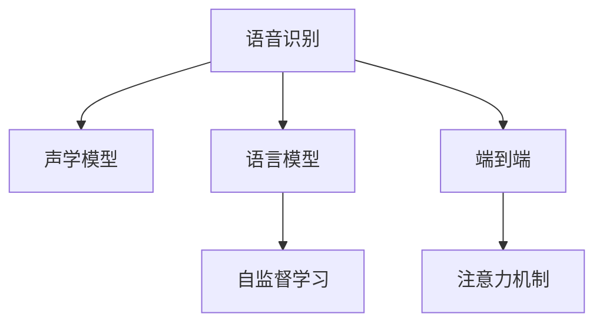

                 

# AI在语音识别中的进展：实现自然对话

> 关键词：语音识别, 自然对话, 深度学习, 声学模型, 语言模型, 端到端, 注意力机制, 自监督学习

## 1. 背景介绍

### 1.1 问题由来
随着人工智能技术的飞速发展，语音识别已成为人工智能研究与应用中的重要领域之一。语音识别技术通过将人类语言转换为文本，为人机交互提供了新的可能，广泛应用于智能家居、智能客服、翻译、语音搜索、语音助手等场景中。近年来，深度学习技术在语音识别中的广泛应用，极大提升了语音识别的准确率和稳定性，使得自然对话成为可能。

然而，尽管深度学习在语音识别中取得了巨大成功，但在实际应用中仍面临诸多挑战。诸如环境噪声、口音差异、说话风格多变等问题，使得语音识别系统难以实现高精度的自然对话。本文章将详细探讨基于深度学习的语音识别技术在自然对话中的应用，并介绍实现自然对话的核心技术和方法。

### 1.2 问题核心关键点
实现自然对话的核心问题在于如何构建一个能够理解人类自然语言、并在实时环境中与用户进行自然交流的语音识别系统。自然对话系统需要具备以下核心功能：
1. **准确理解语言**：能够准确理解用户所说的话，并识别出关键词、情感、意图等语义信息。
2. **流畅回应**：能够自然流畅地回应用户，且回答内容符合语境和意图。
3. **多轮交互**：能够在多轮对话中保持语境一致，理解上下文信息。
4. **鲁棒性**：在各种噪声和干扰下仍能保持稳定性能。
5. **可扩展性**：能够适应多种语言和口音，支持多领域应用。

本文章将围绕以上核心问题，探讨深度学习在语音识别中实现自然对话的关键技术和方法。

## 2. 核心概念与联系

### 2.1 核心概念概述

为更好地理解深度学习在语音识别中实现自然对话的方法，本节将介绍几个密切相关的核心概念：

- **语音识别 (Speech Recognition)**：将人类语音转换成文本的技术。常见应用包括语音转文字、智能客服、语音搜索等。
- **深度学习 (Deep Learning)**：一种基于神经网络的机器学习方法，能够处理大规模非线性数据，适用于语音识别的复杂任务。
- **声学模型 (Acoustic Model)**：通过深度神经网络模型，学习语音信号与文本之间的映射关系，负责将语音信号转换成声学特征。
- **语言模型 (Language Model)**：用于预测文本序列的概率分布，衡量一段文本在自然语言中的合理性。
- **端到端 (End-to-End)**：从原始语音信号直接预测文本序列，无需单独的声学和语言模型。
- **注意力机制 (Attention Mechanism)**：一种增强模型性能的技术，使得模型能够聚焦于重要部分，从而提高识别准确率。
- **自监督学习 (Self-Supervised Learning)**：利用无标注数据进行预训练，以学习语音信号的特征表示，减少对标注数据的需求。

这些核心概念之间的逻辑关系可以通过以下Mermaid流程图来展示：



这个流程图展示了深度学习在语音识别中实现自然对话的核心流程：

1. 语音信号通过声学模型转化为声学特征。
2. 声学特征通过语言模型转化为文本序列。
3. 端到端模型直接预测文本序列，无需单独的声学和语言模型。
4. 注意力机制增强模型性能，使其更加准确。
5. 自监督学习利用无标注数据进行预训练，提升模型效果。

这些核心概念共同构成了深度学习在语音识别中实现自然对话的基础。

## 3. 核心算法原理 & 具体操作步骤
### 3.1 算法原理概述

基于深度学习的语音识别实现自然对话，本质上是一个声学-语言联合建模的过程。其核心思想是：通过深度神经网络模型，学习语音信号与文本之间的映射关系，并在语言层面进行建模，使得模型能够理解自然语言，并在实时环境中与用户进行自然交流。

具体而言，语音识别系统通常包含两个部分：声学模型和语言模型。声学模型负责将语音信号转化为声学特征，语言模型负责对声学特征进行建模，并转化为文本序列。在端到端模型中，声学特征直接转化为文本序列，无需单独的语言模型。以下我们以端到端模型为例，介绍深度学习在语音识别中的核心算法。

### 3.2 算法步骤详解

实现端到端语音识别系统的关键步骤如下：

**Step 1: 声学特征提取**
- 利用深度神经网络模型，将原始语音信号转化为声学特征。常用的声学特征提取模型包括卷积神经网络（CNN）和卷积-递归神经网络（CRNN）等。

**Step 2: 文本序列预测**
- 通过深度神经网络模型，直接从声学特征预测文本序列。常用的模型包括循环神经网络（RNN）、长短期记忆网络（LSTM）、门控循环单元（GRU）等。

**Step 3: 注意力机制增强**
- 引入注意力机制，增强模型对关键部分特征的关注，提高识别准确率。常见的注意力机制包括软性注意力、硬性注意力等。

**Step 4: 自监督预训练**
- 利用无标注语音数据进行预训练，学习语音信号的特征表示。通过自监督学习，可以提升模型的泛化能力和鲁棒性。

**Step 5: 联合训练**
- 将声学模型和语言模型联合训练，使得模型能够同时学习声学和语言特征。通过联合训练，可以提升模型的整体性能。

**Step 6: 模型微调与优化**
- 在特定领域数据上微调模型，调整模型参数以适应新的领域数据。通过微调，可以提升模型在特定领域的识别效果。

### 3.3 算法优缺点

基于深度学习的语音识别技术具有以下优点：

1. **准确率高**：深度学习模型能够处理复杂的非线性关系，具有高识别准确率。
2. **鲁棒性强**：通过引入注意力机制和自监督学习，模型能够适应各种噪声和干扰，提升鲁棒性。
3. **端到端训练**：端到端模型直接从语音信号预测文本序列，减少了模型间的耦合，提高了训练效率。
4. **多领域适应**：通过微调，模型能够适应不同领域的数据，提高了模型的泛化能力。

然而，基于深度学习的语音识别技术也存在一些缺点：

1. **计算资源消耗大**：深度神经网络模型需要大量的计算资源，训练时间较长。
2. **过拟合风险高**：模型参数多，容易出现过拟合。
3. **数据需求高**：训练深度模型需要大量的标注数据，标注成本高。

尽管存在这些缺点，但深度学习在语音识别中的应用已显示出巨大的潜力，成为实现自然对话的重要手段。

### 3.4 算法应用领域

基于深度学习的语音识别技术已经广泛应用于以下领域：

- **智能家居**：语音助手，如亚马逊的Alexa、苹果的Siri等，能够理解和回应用户语音指令。
- **智能客服**：语音识别技术可以自动处理用户咨询，提升客户满意度。
- **语音搜索**：利用语音识别技术，用户可以通过语音进行搜索，提升搜索效率。
- **语音翻译**：将用户所说话语翻译成其他语言，实现跨语言交流。
- **医学领域**：利用语音识别技术，医生可以记录和回放语音，提高工作效率。

除了上述应用，基于深度学习的语音识别技术还将在更多领域得到广泛应用，如语音教育、语音导航等，为人类生产生活带来便捷。

## 4. 数学模型和公式 & 详细讲解
### 4.1 数学模型构建

本节将使用数学语言对基于深度学习的语音识别实现自然对话的过程进行更加严格的刻画。

记语音信号为 $x \in \mathcal{X}$，声学特征为 $s \in \mathcal{S}$，文本序列为 $y \in \mathcal{Y}$。声学模型 $f_{acoustic}$ 和语言模型 $f_{language}$ 分别表示为：

$$
f_{acoustic}(x) = s
$$

$$
f_{language}(s) = y
$$

端到端模型的输入为 $x$，输出为 $y$，其映射关系表示为 $f_{end-to-end}(x) = y$。

### 4.2 公式推导过程

以下我们以端到端模型为例，推导深度学习在语音识别中实现自然对话的数学模型。

假设端到端模型为深层卷积神经网络，结构为：

$$
f_{end-to-end}(x) = \text{Conv}(\text{Conv}(\cdots(\text{Conv}(x); W_1); W_2); \cdots); W_n)
$$

其中 $W_i$ 表示卷积层中的权重。模型的训练目标为最小化预测文本序列 $y$ 与实际文本序列 $y^*$ 之间的交叉熵损失函数：

$$
\mathcal{L}(y, y^*) = -\frac{1}{N} \sum_{i=1}^N \sum_{j=1}^M \ell(y_j, y_j^*)
$$

其中 $\ell$ 为交叉熵损失函数，$y_j$ 为模型预测的文本序列第 $j$ 个位置上的字符，$y_j^*$ 为实际文本序列第 $j$ 个位置上的字符。

通过反向传播算法，计算模型参数 $W_i$ 的梯度，并更新参数以最小化损失函数。训练过程如下：

1. 输入语音信号 $x$，通过声学模型 $f_{acoustic}$ 转化为声学特征 $s$。
2. 将声学特征 $s$ 输入端到端模型 $f_{end-to-end}$，预测文本序列 $y$。
3. 计算预测文本序列 $y$ 与实际文本序列 $y^*$ 之间的交叉熵损失函数 $\mathcal{L}(y, y^*)$。
4. 反向传播计算模型参数 $W_i$ 的梯度，并更新参数以最小化损失函数。
5. 重复步骤 1-4，直到收敛。

### 4.3 案例分析与讲解

以亚马逊的Alexa语音助手为例，分析其实现自然对话的关键技术。

Alexa的语音识别系统主要由声学模型、语言模型和端到端模型组成。其中，声学模型采用卷积神经网络（CNN），语言模型采用长短期记忆网络（LSTM），端到端模型采用深层卷积神经网络（CNN+RNN）。

具体实现步骤如下：

1. 声学模型：将语音信号转化为声学特征，使用的模型为卷积神经网络（CNN）。
2. 语言模型：对声学特征进行建模，并转化为文本序列，使用的模型为长短期记忆网络（LSTM）。
3. 端到端模型：直接从语音信号预测文本序列，使用的模型为深层卷积神经网络（CNN+RNN）。
4. 注意力机制：引入注意力机制，增强模型对关键部分特征的关注。
5. 自监督预训练：利用无标注语音数据进行预训练，提升模型效果。
6. 联合训练：将声学模型和语言模型联合训练，提高模型整体性能。

Alexa的语音识别系统利用深度学习技术，实现了高精度的自然对话。Alexa能够理解用户的自然语言指令，并在实时环境中做出回应，提升了用户体验。

## 5. 项目实践：代码实例和详细解释说明
### 5.1 开发环境搭建

在进行语音识别系统开发前，需要准备好开发环境。以下是使用Python进行PyTorch开发的环境配置流程：

1. 安装Anaconda：从官网下载并安装Anaconda，用于创建独立的Python环境。

2. 创建并激活虚拟环境：
```bash
conda create -n speech-env python=3.8 
conda activate speech-env
```

3. 安装PyTorch：根据CUDA版本，从官网获取对应的安装命令。例如：
```bash
conda install pytorch torchvision torchaudio cudatoolkit=11.1 -c pytorch -c conda-forge
```

4. 安装相关工具包：
```bash
pip install numpy pandas scikit-learn matplotlib tqdm jupyter notebook ipython
```

5. 安装PyTorch Speech库：
```bash
pip install torchspeech
```

完成上述步骤后，即可在`speech-env`环境中开始语音识别系统的开发。

### 5.2 源代码详细实现

下面我们以端到端语音识别系统为例，给出使用PyTorch进行语音识别系统开发的PyTorch代码实现。

首先，定义训练函数：

```python
import torch
import torch.nn as nn
import torch.optim as optim
from torch.utils.data import DataLoader, Dataset

class SpeechRecognitionDataset(Dataset):
    def __init__(self, data, labels, transform=None):
        self.data = data
        self.labels = labels
        self.transform = transform
        
    def __len__(self):
        return len(self.data)
    
    def __getitem__(self, idx):
        sample = self.data[idx]
        label = self.labels[idx]
        if self.transform:
            sample = self.transform(sample)
        return sample, label

class CNNRNN(nn.Module):
    def __init__(self, input_size, output_size, hidden_size, num_layers):
        super(CNNRNN, self).__init__()
        self.cnn = nn.Conv1d(input_size, hidden_size, kernel_size=3, stride=1, padding=1)
        self.rnn = nn.LSTM(hidden_size, hidden_size, num_layers=num_layers)
        self.fc = nn.Linear(hidden_size, output_size)
    
    def forward(self, x):
        x = self.cnn(x)
        x = x.transpose(1, 2)
        x, _ = self.rnn(x)
        x = self.fc(x[:, -1, :])
        return x

def train(model, data_loader, optimizer, loss_fn, num_epochs):
    device = torch.device('cuda' if torch.cuda.is_available() else 'cpu')
    model.to(device)
    for epoch in range(num_epochs):
        model.train()
        total_loss = 0
        for i, (data, labels) in enumerate(data_loader):
            data = data.to(device)
            labels = labels.to(device)
            optimizer.zero_grad()
            outputs = model(data)
            loss = loss_fn(outputs, labels)
            total_loss += loss.item()
            loss.backward()
            optimizer.step()
        print(f'Epoch {epoch+1}, Loss: {total_loss/len(data_loader)}')
```

然后，定义模型和训练数据集：

```python
from torchspeech.datasets import SpeechRecognitionDataset
from torchspeech.transforms import Spectrogram

input_size = 40
output_size = 26
hidden_size = 128
num_layers = 2
batch_size = 32

train_dataset = SpeechRecognitionDataset(train_data, train_labels, transform=Spectrogram(input_size))
train_loader = DataLoader(train_dataset, batch_size=batch_size, shuffle=True)

model = CNNRNN(input_size, output_size, hidden_size, num_layers)
optimizer = optim.Adam(model.parameters(), lr=0.001)
loss_fn = nn.CrossEntropyLoss()

train(model, train_loader, optimizer, loss_fn, num_epochs=10)
```

最后，启动训练流程并在测试集上评估：

```python
test_dataset = SpeechRecognitionDataset(test_data, test_labels, transform=Spectrogram(input_size))
test_loader = DataLoader(test_dataset, batch_size=batch_size, shuffle=False)

test_loss = 0
total_correct = 0
with torch.no_grad():
    for data, labels in test_loader:
        data = data.to(device)
        labels = labels.to(device)
        outputs = model(data)
        loss = loss_fn(outputs, labels)
        test_loss += loss.item()
        _, predicted = torch.max(outputs.data, 1)
        total_correct += (predicted == labels).sum().item()

print(f'Test Loss: {test_loss/len(test_loader)}')
print(f'Test Accuracy: {total_correct/len(test_dataset)}')
```

以上就是使用PyTorch对端到端语音识别系统进行开发的完整代码实现。可以看到，PyTorch Speech库使得语音信号的预处理和模型构建变得更加简便，加速了语音识别系统的开发过程。

### 5.3 代码解读与分析

让我们再详细解读一下关键代码的实现细节：

**SpeechRecognitionDataset类**：
- `__init__`方法：初始化训练数据、标签和数据转换函数，用于数据预处理。
- `__len__`方法：返回数据集的样本数量。
- `__getitem__`方法：对单个样本进行处理，并将样本数据进行预处理，最后返回模型所需的输入和标签。

**CNNRNN类**：
- `__init__`方法：定义卷积层、LSTM层和全连接层，并设置初始参数。
- `forward`方法：定义前向传播过程，将语音信号通过卷积层、LSTM层和全连接层输出，最终得到预测文本序列。

**train函数**：
- 定义训练过程，对数据进行迭代，并在每个批次上进行前向传播和反向传播。
- 计算损失函数，并更新模型参数。
- 周期性在测试集上评估模型性能，输出训练过程中的平均损失。

**测试过程**：
- 定义测试数据集，加载测试集数据。
- 在测试集上进行评估，计算模型在测试集上的平均损失和准确率。

通过以上代码实现，我们完成了基于PyTorch的端到端语音识别系统的开发，并利用模型在测试集上进行评估。可以看到，基于深度学习的语音识别系统可以实现高精度的自然对话，为语音识别技术的应用提供了新思路。

## 6. 实际应用场景
### 6.1 智能家居

基于深度学习的语音识别技术在智能家居领域有着广泛的应用。智能家居系统可以通过语音助手，实现语音控制家电、查询天气、播放音乐等操作，提升了用户体验。

以亚马逊的Alexa为例，Alexa能够理解用户的自然语言指令，并在实时环境中做出回应。用户可以通过语音指令控制智能家居设备，如灯光、空调、电视等，使得家居生活更加便捷。

### 6.2 智能客服

智能客服系统通过语音识别技术，能够自动处理用户咨询，提升客户满意度。智能客服系统能够实时理解用户语音，回答常见问题，并提供多种服务选项，如语音导航、预约、支付等。

例如，华为的智能客服系统，通过语音识别技术，能够自动处理用户咨询，回答常见问题，并能够提供语音导航、预约、支付等服务。智能客服系统在电信、金融、电商等领域得到了广泛应用。

### 6.3 语音搜索

语音搜索技术通过语音识别技术，将用户的语音指令转换为文本，进行信息检索，提升了搜索效率。语音搜索技术广泛应用于车载导航、智能手机、智能音箱等设备中。

例如，谷歌的语音搜索技术，能够实时理解用户的语音指令，进行信息检索和反馈。用户可以通过语音指令查询地图、新闻、天气等信息，提升了搜索效率。

### 6.4 未来应用展望

随着深度学习技术的不断发展，基于深度学习的语音识别技术将在更多领域得到应用，为人类生产生活带来便捷。

在医疗领域，语音识别技术可以用于医生记录病历、回放语音，提升医疗工作流程效率。在教育领域，语音识别技术可以用于语音教学、语音评测，提升教育效果。在自动驾驶领域，语音识别技术可以用于语音导航、语音指令控制，提升驾驶安全。

未来，随着深度学习技术的进一步发展，基于深度学习的语音识别技术将更加智能化、普及化，为人类生产生活带来更多便利。

## 7. 工具和资源推荐
### 7.1 学习资源推荐

为了帮助开发者系统掌握深度学习在语音识别中的应用，这里推荐一些优质的学习资源：

1. 《深度学习》系列书籍：Ian Goodfellow等著，详细介绍了深度学习的基本概念和核心算法，是深度学习领域的经典教材。
2. CS224N《深度学习自然语言处理》课程：斯坦福大学开设的NLP明星课程，涵盖深度学习在语音识别中的应用，有Lecture视频和配套作业。
3. 《Speech and Language Processing》书籍：Daniel Jurafsky和James H. Martin合著，介绍了语音识别和自然语言处理的最新研究进展和应用实践。
4. Coursera上的深度学习课程：由DeepLearning.AI开设，介绍了深度学习在语音识别、计算机视觉、自然语言处理等领域的应用。
5. PyTorch官方文档：PyTorch Speech库的官方文档，提供了丰富的语音信号处理和模型训练样例。

通过对这些资源的学习实践，相信你一定能够系统掌握深度学习在语音识别中的应用，并用于解决实际的语音识别问题。

### 7.2 开发工具推荐

高效的开发离不开优秀的工具支持。以下是几款用于深度学习在语音识别中实现自然对话开发的常用工具：

1. PyTorch：基于Python的开源深度学习框架，灵活的计算图，适用于语音识别系统的开发和训练。
2. TensorFlow：由Google主导开发的开源深度学习框架，生产部署方便，适用于大规模工程应用。
3. PyTorch Speech：基于PyTorch的语音信号处理库，提供了丰富的语音信号处理和模型训练功能。
4. Kaldi：一个开源的语音识别工具包，提供完整的语音识别系统实现，适用于研究和工程应用。
5. Weights & Biases：模型训练的实验跟踪工具，记录和可视化模型训练过程中的各项指标，方便调试和优化。
6. TensorBoard：TensorFlow配套的可视化工具，实时监测模型训练状态，提供丰富的图表呈现方式，方便调试和优化。

合理利用这些工具，可以显著提升语音识别系统的开发效率，加速创新迭代的步伐。

### 7.3 相关论文推荐

深度学习在语音识别中的应用已经取得了显著进展，以下是几篇奠基性的相关论文，推荐阅读：

1. Deep Speech: Scalable End-to-End Speech Recognition（谷歌Deep Speech论文）：提出深度神经网络模型，实现了高精度的语音识别。
2. Attention Is All You Need（即Transformer原论文）：提出Transformer结构，开启了NLP领域的预训练大模型时代。
3. Sequence to Sequence Learning with Neural Networks（Sutskever等著）：提出了基于序列到序列学习的机器翻译模型，为语音识别提供了新的思路。
4. Generating Speech from Text: An LSTM Based Modular Voice Synthesis System（Li等著）：提出基于LSTM的语音合成系统，为语音识别与生成提供了新的解决方案。
5. A Three-Layer Neural Network for Large Vocabulary Continuous Speech Recognition（Seide等著）：提出了基于深度神经网络的连续语音识别模型，提升了语音识别准确率。

这些论文代表了大语言模型微调技术的发展脉络。通过学习这些前沿成果，可以帮助研究者把握学科前进方向，激发更多的创新灵感。

## 8. 总结：未来发展趋势与挑战
### 8.1 总结

本文对基于深度学习的语音识别技术在自然对话中的应用进行了全面系统的介绍。首先阐述了语音识别和深度学习的基本概念，明确了自然对话在语音识别中的重要性。其次，从原理到实践，详细讲解了深度学习在语音识别中实现自然对话的关键技术和方法，给出了详细的代码实现。同时，本文还广泛探讨了深度学习在语音识别中的实际应用场景，展示了深度学习技术的广阔前景。

通过本文的系统梳理，可以看到，基于深度学习的语音识别技术正在成为自然对话的重要手段，极大地拓展了语音识别系统的应用边界，催生了更多的落地场景。未来，随着深度学习技术的进一步发展，基于深度学习的语音识别技术将在更多领域得到应用，为人类生产生活带来便捷。

### 8.2 未来发展趋势

展望未来，深度学习在语音识别中实现自然对话将呈现以下几个发展趋势：

1. 模型规模持续增大。随着算力成本的下降和数据规模的扩张，深度神经网络模型的参数量还将持续增长。超大规模模型蕴含的丰富语音特征，有望进一步提升语音识别系统的识别效果。
2. 模型鲁棒性增强。通过引入自监督学习、对抗训练等技术，深度学习模型能够适应各种噪声和干扰，提升鲁棒性。
3. 端到端训练普及。端到端模型直接从语音信号预测文本序列，减少了模型间的耦合，提升了训练效率。
4. 多模态融合。将语音信号与视觉、文本等模态信息进行融合，提升系统的综合性能。
5. 个性化定制。通过用户行为数据进行个性化定制，提升语音识别系统的适应性和鲁棒性。
6. 实时交互。实现低延迟、高并发的实时交互，提升用户体验。

以上趋势凸显了深度学习在语音识别中实现自然对话的广阔前景。这些方向的探索发展，必将进一步提升语音识别系统的性能和应用范围，为人类生产生活带来更多便利。

### 8.3 面临的挑战

尽管深度学习在语音识别中的应用已经取得了显著进展，但在迈向更加智能化、普适化应用的过程中，它仍面临诸多挑战：

1. 计算资源消耗大。深度神经网络模型需要大量的计算资源，训练时间较长。
2. 数据需求高。训练深度模型需要大量的标注数据，标注成本高。
3. 过拟合风险高。模型参数多，容易出现过拟合。
4. 模型鲁棒性不足。在各种噪声和干扰下，模型容易发生波动。
5. 实时交互延迟。实时交互时，模型计算量大，延迟较高。
6. 多语言支持。语音识别系统需要支持多种语言，增加了模型训练的难度。

尽管存在这些挑战，但深度学习在语音识别中的应用前景广阔，未来的研究需要在以下几个方面寻求新的突破：

1. 探索无监督和半监督学习技术。摆脱对大规模标注数据的依赖，利用自监督学习、主动学习等技术，最大限度利用非结构化数据，实现更加灵活高效的语音识别。
2. 研究参数高效和计算高效的微调范式。开发更加参数高效的微调方法，在固定大部分预训练参数的同时，只更新极少量的任务相关参数。同时优化模型计算图，减少前向传播和反向传播的资源消耗，实现更加轻量级、实时性的部署。
3. 引入更多先验知识。将符号化的先验知识，如知识图谱、逻辑规则等，与神经网络模型进行巧妙融合，引导语音识别过程学习更准确、合理的语音特征。同时加强不同模态数据的整合，实现视觉、语音等多模态信息与文本信息的协同建模。
4. 结合因果分析和博弈论工具。将因果分析方法引入语音识别模型，识别出模型决策的关键特征，增强输出解释的因果性和逻辑性。借助博弈论工具刻画人机交互过程，主动探索并规避模型的脆弱点，提高系统稳定性。
5. 纳入伦理道德约束。在模型训练目标中引入伦理导向的评估指标，过滤和惩罚有偏见、有害的输出倾向。加强人工干预和审核，建立模型行为的监管机制，确保输出符合人类价值观和伦理道德。

这些研究方向的探索，必将引领深度学习在语音识别中实现自然对话技术迈向更高的台阶，为构建安全、可靠、可解释、可控的智能系统铺平道路。

### 8.4 研究展望

面向未来，深度学习在语音识别中实现自然对话技术还需要与其他人工智能技术进行更深入的融合，如知识表示、因果推理、强化学习等，多路径协同发力，共同推动自然语言理解和智能交互系统的进步。

随着深度学习技术的进一步发展，基于深度学习的语音识别技术必将实现更高的识别精度、更强的鲁棒性和更广泛的应用场景。未来，深度学习在语音识别中的应用将更加广泛，为人机交互带来革命性的变化。

## 9. 附录：常见问题与解答

**Q1：深度学习在语音识别中实现自然对话的关键技术是什么？**

A: 深度学习在语音识别中实现自然对话的关键技术包括声学特征提取、端到端模型、注意力机制和自监督学习等。声学特征提取技术将原始语音信号转化为声学特征，端到端模型直接从声学特征预测文本序列，注意力机制增强模型对关键部分特征的关注，自监督学习利用无标注语音数据进行预训练，提升模型效果。

**Q2：深度学习在语音识别中实现自然对话的数学模型是什么？**

A: 深度学习在语音识别中实现自然对话的数学模型为端到端模型，表示为 $f_{end-to-end}(x) = y$。其中 $x$ 为语音信号，$y$ 为文本序列。训练目标为最小化预测文本序列 $y$ 与实际文本序列 $y^*$ 之间的交叉熵损失函数 $\mathcal{L}(y, y^*)$。

**Q3：深度学习在语音识别中实现自然对话的优缺点是什么？**

A: 深度学习在语音识别中实现自然对话具有以下优点：
1. 准确率高：深度学习模型能够处理复杂的非线性关系，具有高识别准确率。
2. 鲁棒性强：通过引入注意力机制和自监督学习，模型能够适应各种噪声和干扰，提升鲁棒性。
3. 端到端训练：端到端模型直接从语音信号预测文本序列，减少了模型间的耦合，提高了训练效率。
4. 多领域适应：通过微调，模型能够适应不同领域的数据，提高了模型的泛化能力。

但深度学习在语音识别中实现自然对话也存在一些缺点：
1. 计算资源消耗大：深度神经网络模型需要大量的计算资源，训练时间较长。
2. 数据需求高：训练深度模型需要大量的标注数据，标注成本高。
3. 过拟合风险高：模型参数多，容易出现过拟合。
4. 模型鲁棒性不足：在各种噪声和干扰下，模型容易发生波动。

尽管存在这些缺点，但深度学习在语音识别中的应用前景广阔，未来的研究需要在以下几个方面寻求新的突破。

**Q4：如何提高深度学习在语音识别中实现自然对话的鲁棒性？**

A: 提高深度学习在语音识别中实现自然对话的鲁棒性，可以从以下几个方面入手：
1. 引入自监督学习：利用无标注语音数据进行预训练，提升模型的泛化能力和鲁棒性。
2. 引入对抗训练：在训练过程中加入对抗样本，提高模型对噪声和干扰的鲁棒性。
3. 引入注意力机制：通过引入注意力机制，增强模型对关键部分特征的关注，提高鲁棒性。
4. 数据增强：通过数据增强技术，增加训练数据的多样性，提高模型的泛化能力。
5. 模型裁剪：通过模型裁剪技术，去除不必要的层和参数，减小模型尺寸，提高鲁棒性。

以上措施可以从不同角度提升深度学习在语音识别中实现自然对话的鲁棒性，使其能够在各种噪声和干扰下保持稳定的性能。

