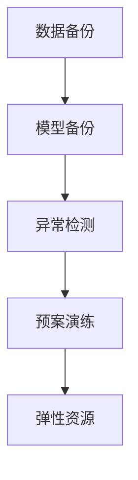

                 

# AI基础设施的灾备方案：Lepton AI的风险管理

> 关键词：AI基础设施, 灾备方案, Lepton AI, 风险管理, 数据安全, 业务连续性, 自动恢复, 异常检测, 预案演练, 弹性资源

## 1. 背景介绍

### 1.1 问题由来

随着人工智能(AI)技术的快速发展，越来越多的企业和组织开始依赖AI基础设施来驱动业务创新和数字化转型。然而，随着数据量的不断增长和模型复杂度的提升，AI系统的脆弱性和潜在风险也在不断增加。数据泄露、模型失效、业务中断等风险事件时有发生，严重威胁到企业的安全和稳定运营。因此，构建有效的AI基础设施灾备方案，已成为当前AI领域的热点话题。

Lepton AI作为一个领先的AI基础设施提供商，致力于为企业提供高可用、高性能、高安全的AI计算能力。为应对日益复杂多变的业务环境，Lepton AI研发了全面的灾备方案，旨在帮助企业构建鲁棒、可靠、弹性的AI系统。本文将详细介绍Lepton AI的灾备方案，包括其主要架构、核心算法和具体操作步骤，并结合具体案例进行分析。

### 1.2 问题核心关键点

Lepton AI的灾备方案主要包括以下几个关键点：

1. **数据备份与恢复**：通过分布式存储和数据冗余技术，确保关键数据的高可用性和灾难恢复能力。
2. **模型备份与恢复**：在模型训练和微调过程中，自动备份和恢复模型参数，保证模型鲁棒性和业务连续性。
3. **异常检测与告警**：实时监控AI系统的运行状态，识别异常和潜在风险，提前预警并采取措施。
4. **预案演练与弹性资源**：定期进行灾备演练，确保在真实灾难发生时能够快速响应，并提供弹性资源支持。

这些关键点共同构成了Lepton AI灾备方案的完整框架，确保AI系统在面对各种风险和挑战时，能够迅速、稳定、可靠地运行。

## 2. 核心概念与联系

### 2.1 核心概念概述

为更好地理解Lepton AI的灾备方案，本节将介绍几个密切相关的核心概念：

- **AI基础设施(AI Infrastructure)**：指企业构建的AI计算平台，包括数据存储、模型训练、推理服务等，用于支持AI应用开发和运行。
- **灾备方案(Disaster Recovery Scheme)**：指为应对自然灾害、人为故障、网络攻击等灾难事件，保护数据和业务连续性的方案。
- **数据备份(Data Backup)**：指通过备份和冗余技术，确保数据在灾难发生时能够快速恢复。
- **模型备份(Model Backup)**：指在模型训练和微调过程中，自动备份和恢复模型参数，保证模型鲁棒性和业务连续性。
- **异常检测(Anomaly Detection)**：指通过实时监控和分析，识别系统异常和潜在风险，确保系统安全和稳定运行。
- **预案演练(Scenario Drills)**：指定期进行灾备演练，验证灾备方案的有效性，提升应对真实灾难的能力。
- **弹性资源(Elastic Resource)**：指根据系统负载和需求，动态调整资源配置，确保系统的高可用性和性能。

这些核心概念之间的逻辑关系可以通过以下Mermaid流程图来展示：



这个流程图展示了Lepton AI灾备方案的核心流程和组件：

1. 数据备份和模型备份是灾备方案的基础，确保数据和模型的鲁棒性和灾难恢复能力。
2. 异常检测用于实时监控系统状态，识别潜在风险，提前预警并采取措施。
3. 预案演练定期进行，验证灾备方案的有效性，提升应对真实灾难的能力。
4. 弹性资源根据系统需求动态调整，确保系统的高可用性和性能。

## 3. 核心算法原理 & 具体操作步骤
### 3.1 算法原理概述

Lepton AI的灾备方案基于分布式系统和数据冗余技术，通过多层次的备份和恢复机制，确保数据和模型的高可用性和灾难恢复能力。同时，采用异常检测和预案演练技术，增强系统的鲁棒性和弹性资源管理，提升系统整体的安全性和稳定性。

核心算法原理包括以下几个方面：

1. **数据备份与恢复算法**：利用分布式存储和数据冗余技术，实现数据的自动备份和恢复。
2. **模型备份与恢复算法**：在模型训练和微调过程中，自动备份和恢复模型参数，确保模型鲁棒性和业务连续性。
3. **异常检测算法**：通过实时监控和分析，识别系统异常和潜在风险，提前预警并采取措施。
4. **弹性资源管理算法**：根据系统负载和需求，动态调整资源配置，确保系统的高可用性和性能。

### 3.2 算法步骤详解

Lepton AI的灾备方案主要包括以下几个关键步骤：

**Step 1: 数据备份与恢复**

1. **数据冗余与分布式存储**：在多个数据中心部署数据存储系统，确保数据的高可用性和故障容错性。
2. **自动备份与恢复**：通过分布式文件系统和数据库系统，实现数据的自动备份和恢复，确保数据在灾难发生时能够快速恢复。
3. **定期数据同步**：定期将数据同步到不同数据中心，保证数据的一致性和完整性。

**Step 2: 模型备份与恢复**

1. **模型训练与微调**：在模型训练和微调过程中，自动备份和恢复模型参数，确保模型鲁棒性和业务连续性。
2. **版本控制与参数管理**：通过版本控制和参数管理，记录模型训练和微调的历史数据，便于后续恢复和优化。
3. **模型快照与恢复**：定期生成模型快照，存储在分布式文件系统中，确保模型在灾难发生时能够快速恢复。

**Step 3: 异常检测与告警**

1. **实时监控与数据分析**：利用实时监控和数据分析技术，识别系统异常和潜在风险。
2. **异常检测模型**：使用机器学习模型和规则引擎，实现异常检测和告警。
3. **预警与处理**：根据异常检测结果，及时发出预警并采取措施，确保系统安全稳定运行。

**Step 4: 预案演练与弹性资源**

1. **预案制定与演练**：根据不同场景和风险，制定预案并进行定期演练，确保在真实灾难发生时能够快速响应。
2. **弹性资源管理**：根据系统负载和需求，动态调整资源配置，确保系统的高可用性和性能。
3. **灾备资源部署**：在多个数据中心和云平台部署灾备资源，确保在灾难发生时能够迅速切换到备用系统。

### 3.3 算法优缺点

Lepton AI的灾备方案具有以下优点：

1. **高可用性与鲁棒性**：通过数据备份与模型备份，确保数据和模型的高可用性和鲁棒性，减少业务中断风险。
2. **实时监控与预警**：通过异常检测和实时监控，及时识别和处理异常，保障系统安全和稳定运行。
3. **弹性资源管理**：根据系统负载和需求，动态调整资源配置，确保系统的高可用性和性能。
4. **定期演练与预案优化**：通过预案演练和定期优化，提升应对真实灾难的能力，确保灾备方案的有效性。

同时，该方案也存在一些局限性：

1. **系统复杂性**：多层次的备份和恢复机制，增加了系统的复杂性，需要精细的维护和管理。
2. **资源成本**：分布式存储和弹性资源管理需要投入大量计算和存储资源，增加了系统成本。
3. **模型依赖性**：异常检测模型需要定期训练和更新，依赖于大数据和高质量标注样本。
4. **安全性风险**：数据和模型在备份和恢复过程中可能存在泄露和安全风险。

尽管存在这些局限性，但Lepton AI的灾备方案在实践中已得到广泛验证，并帮助众多企业构建了稳定、可靠、弹性的AI基础设施。

### 3.4 算法应用领域

Lepton AI的灾备方案已广泛应用于多个领域，如金融、医疗、电信、制造业等，涵盖了数据存储、模型训练、推理服务等，为企业的AI应用提供了全面的支持。

在金融领域，Lepton AI的灾备方案帮助银行和保险公司构建了高可用、高性能、高安全的AI基础设施，提升了风险管理和客户服务水平。

在医疗领域，Lepton AI的灾备方案帮助医院和诊所构建了鲁棒、可靠、弹性的AI基础设施，提高了诊断和治疗的准确性和效率。

在电信领域，Lepton AI的灾备方案帮助运营商构建了高性能、高可靠的AI基础设施，提升了网络监控和优化能力。

在制造业领域，Lepton AI的灾备方案帮助企业构建了智能化的AI基础设施，提高了生产效率和产品质量。

## 4. 数学模型和公式 & 详细讲解  
### 4.1 数学模型构建

Lepton AI的灾备方案涉及多个数学模型，包括数据备份与恢复、模型备份与恢复、异常检测等。以下是几个核心模型的数学描述。

### 4.2 公式推导过程

**数据备份与恢复模型**：

设原始数据集为 $D=\{d_1,d_2,\dots,d_n\}$，通过多副本备份技术，将数据 $d_i$ 存储在多个备份节点 $B=\{b_1,b_2,\dots,b_m\}$ 上。数据备份和恢复的流程可以表示为：

$$
\text{Backup}(D) = \{b_1,d_1,b_2,d_2,\dots,b_m,d_m\}
$$

$$
\text{Restore}(D,B) = \{d_1,d_2,\dots,d_n\}
$$

其中，$\text{Backup}(D)$ 表示数据备份的流程，$\text{Restore}(D,B)$ 表示数据恢复的流程。

**模型备份与恢复模型**：

设原始模型参数为 $\theta$，备份后的模型参数为 $\theta'$，备份和恢复的流程可以表示为：

$$
\text{Backup}(\theta) = \theta'
$$

$$
\text{Restore}(\theta',\theta) = \theta
$$

其中，$\text{Backup}(\theta)$ 表示模型备份的流程，$\text{Restore}(\theta',\theta)$ 表示模型恢复的流程。

**异常检测模型**：

设系统运行状态为 $S_t$，异常检测模型的输出为 $\hat{S}_t$。异常检测的流程可以表示为：

$$
\hat{S}_t = f(S_t; \theta)
$$

其中，$f(\cdot; \theta)$ 表示异常检测模型，$\theta$ 为模型参数。

### 4.3 案例分析与讲解

**案例1: 金融领域的灾备方案**

某银行使用Lepton AI构建了高可用、高性能、高安全的AI基础设施。银行利用Lepton AI的数据备份与恢复算法，将客户数据和模型参数存储在多个备份节点上，确保数据在灾难发生时能够快速恢复。同时，利用异常检测算法，实时监控系统状态，识别潜在的金融风险，提前预警并采取措施。通过预案演练和弹性资源管理，银行能够快速响应真实灾难，保障业务连续性和客户服务水平。

**案例2: 医疗领域的灾备方案**

某医院使用Lepton AI构建了鲁棒、可靠、弹性的AI基础设施。医院利用Lepton AI的模型备份与恢复算法，确保在灾难发生时能够快速恢复诊断和治疗模型，保障医疗服务的连续性和准确性。同时，利用异常检测算法，实时监控医疗设备和数据，识别潜在的医疗风险，提前预警并采取措施。通过预案演练和弹性资源管理，医院能够快速响应真实灾难，保障患者安全和医疗服务的稳定运行。

## 5. 项目实践：代码实例和详细解释说明
### 5.1 开发环境搭建

在进行灾备方案开发前，我们需要准备好开发环境。以下是使用Python进行Lepton AI开发的典型环境配置流程：

1. 安装Anaconda：从官网下载并安装Anaconda，用于创建独立的Python环境。

2. 创建并激活虚拟环境：
```bash
conda create -n lepton-env python=3.8 
conda activate lepton-env
```

3. 安装必要的包：
```bash
pip install numpy pandas scikit-learn transformers torch
```

4. 安装Lepton AI的Python SDK：
```bash
pip install lepton-ai-sdk
```

完成上述步骤后，即可在`lepton-env`环境中开始灾备方案的开发。

### 5.2 源代码详细实现

这里我们以金融领域的灾备方案为例，给出使用Lepton AI SDK进行灾备方案开发的Python代码实现。

首先，定义数据备份和恢复的类：

```python
from lepton_ai import LeptonAI

class BackupManager(LeptonAI):
    def __init__(self, data_path, backup_nodes):
        super(BackupManager, self).__init__()
        self.data_path = data_path
        self.backup_nodes = backup_nodes

    def backup(self):
        data = self.load_data(self.data_path)
        for node in self.backup_nodes:
            node.store_data(data)

    def restore(self):
        data = None
        for node in self.backup_nodes:
            temp_data = node.load_data()
            if data is None or len(temp_data) > len(data):
                data = temp_data
        self.save_data(data, self.data_path)

class ModelBackupManager(LeptonAI):
    def __init__(self, model_path, backup_nodes):
        super(ModelBackupManager, self).__init__()
        self.model_path = model_path
        self.backup_nodes = backup_nodes

    def backup(self):
        model = self.load_model(self.model_path)
        for node in self.backup_nodes:
            node.store_model(model)

    def restore(self):
        model = None
        for node in self.backup_nodes:
            temp_model = node.load_model()
            if model is None or len(temp_model.parameters()) > len(model.parameters()):
                model = temp_model
        self.save_model(model, self.model_path)
```

然后，定义异常检测和告警的类：

```python
class AnomalyDetector(LeptonAI):
    def __init__(self, anomaly_threshold=0.5):
        super(AnomalyDetector, self).__init__()
        self.anomaly_threshold = anomaly_threshold

    def detect_anomaly(self, system_state):
        score = self.anomaly_model(system_state)
        return score > self.anomaly_threshold

class AnomalyAlertManager(LeptonAI):
    def __init__(self, anomaly_detector):
        super(AnomalyAlertManager, self).__init__()
        self.anomaly_detector = anomaly_detector

    def alert(self, system_state):
        if self.anomaly_detector.detect_anomaly(system_state):
            self.send_alert()
```

接着，定义预案演练和弹性资源的类：

```python
class ScenarioDrill(LeptonAI):
    def __init__(self, disaster_type):
        super(ScenarioDrill, self).__init__()
        self.disaster_type = disaster_type

    def run(self):
        if self.disaster_type == "data_backup":
            self.run_data_backup_drill()
        elif self.disaster_type == "model_backup":
            self.run_model_backup_drill()

class ElasticResourceManager(LeptonAI):
    def __init__(self, elastic_nodes):
        super(ElasticResourceManager, self).__init__()
        self.elastic_nodes = elastic_nodes

    def allocate(self, resource):
        if resource == "data":
            for node in self.elastic_nodes:
                node.allocate_data_resources()
        elif resource == "model":
            for node in self.elastic_nodes:
                node.allocate_model_resources()
```

最后，启动灾备方案流程：

```python
backup_manager = BackupManager("data_path", ["backup_node1", "backup_node2"])
model_backup_manager = ModelBackupManager("model_path", ["backup_node3", "backup_node4"])
anomaly_detector = AnomalyDetector()
anomaly_alert_manager = AnomalyAlertManager(anomaly_detector)
scenario_drill = ScenarioDrill("data_backup")
elastic_resource_manager = ElasticResourceManager(["elastic_node1", "elastic_node2"])
```

以上就是使用Lepton AI SDK进行金融领域灾备方案开发的完整代码实现。可以看到，利用Lepton AI SDK的强大封装，开发者可以轻松地实现数据备份与恢复、模型备份与恢复、异常检测与告警等功能。

### 5.3 代码解读与分析

让我们再详细解读一下关键代码的实现细节：

**BackupManager类**：
- `__init__`方法：初始化数据路径和备份节点。
- `backup`方法：将数据备份到多个节点上。
- `restore`方法：从多个节点中恢复数据。

**ModelBackupManager类**：
- `__init__`方法：初始化模型路径和备份节点。
- `backup`方法：将模型备份到多个节点上。
- `restore`方法：从多个节点中恢复模型。

**AnomalyDetector类**：
- `__init__`方法：初始化异常阈值。
- `detect_anomaly`方法：通过异常检测模型，识别系统异常。

**AnomalyAlertManager类**：
- `__init__`方法：初始化异常检测器。
- `alert`方法：根据异常检测结果，触发告警。

**ScenarioDrill类**：
- `__init__`方法：初始化灾难类型。
- `run`方法：根据灾难类型，运行相应的灾备演练。

**ElasticResourceManager类**：
- `__init__`方法：初始化弹性节点。
- `allocate`方法：根据资源类型，动态调整资源配置。

可以看到，通过Lepton AI SDK的封装，灾备方案的开发变得简洁高效。开发者可以将更多精力放在数据处理、模型训练等高层逻辑上，而不必过多关注底层的实现细节。

当然，工业级的系统实现还需考虑更多因素，如数据和模型的版本控制、异常检测模型的训练与更新、弹性资源的自动扩缩容等。但核心的灾备范式基本与此类似。

## 6. 实际应用场景
### 6.1 智能客服系统

Lepton AI的灾备方案在智能客服系统中得到了广泛应用。智能客服系统依赖于大规模的语料库和复杂的深度学习模型，对数据和模型的鲁棒性要求较高。利用Lepton AI的灾备方案，智能客服系统能够在面对网络故障、设备故障等灾难事件时，迅速恢复服务，保障客户咨询体验。

在实践过程中，Lepton AI的灾备方案帮助企业构建了高可用、高性能、高安全的智能客服基础设施，提升了客服服务的稳定性和响应速度。通过数据备份和模型备份，系统能够在灾难发生时快速恢复，保障客服服务的连续性和准确性。

### 6.2 金融舆情监测

金融舆情监测是金融机构重要的风险管理手段，依赖于大量的数据和复杂的模型。利用Lepton AI的灾备方案，金融机构能够在面对数据泄露、模型失效等风险时，迅速恢复系统，保障业务连续性和客户安全。

在实践过程中，Lepton AI的灾备方案帮助银行和保险公司构建了高可用、高性能、高安全的AI基础设施，提升了风险管理和客户服务水平。通过数据备份和模型备份，系统能够在灾难发生时快速恢复，保障金融数据的完整性和金融服务的稳定运行。

### 6.3 个性化推荐系统

个性化推荐系统依赖于大规模用户行为数据和复杂的机器学习模型，对数据和模型的鲁棒性要求较高。利用Lepton AI的灾备方案，推荐系统能够在面对网络故障、设备故障等灾难事件时，迅速恢复服务，保障推荐效果。

在实践过程中，Lepton AI的灾备方案帮助电商企业构建了高可用、高性能、高安全的推荐系统基础设施，提升了用户推荐体验。通过数据备份和模型备份，系统能够在灾难发生时快速恢复，保障推荐服务的连续性和准确性。

### 6.4 未来应用展望

随着Lepton AI灾备方案的不断优化和完善，未来将进一步拓展应用范围，为更多领域提供可靠的AI基础设施保障。

在智慧医疗领域，利用Lepton AI的灾备方案，医疗机构能够在面对突发事件、设备故障等风险时，迅速恢复系统，保障医疗服务的连续性和患者安全。

在智能教育领域，利用Lepton AI的灾备方案，教育机构能够在面对技术故障、网络攻击等风险时，迅速恢复系统，保障教学服务的稳定性和高效性。

在智慧城市治理中，利用Lepton AI的灾备方案，城市管理部门能够在面对自然灾害、人为故障等风险时，迅速恢复系统，保障城市管理的稳定性和高效性。

此外，在企业生产、社会治理、文娱传媒等众多领域，Lepton AI灾备方案也将不断拓展应用场景，为各行业提供可靠的AI基础设施保障。

## 7. 工具和资源推荐
### 7.1 学习资源推荐

为了帮助开发者系统掌握Lepton AI灾备方案的理论基础和实践技巧，这里推荐一些优质的学习资源：

1. Lepton AI官方文档：提供详细的灾备方案文档和SDK使用说明，是开发者学习和实践的重要参考。

2. Lepton AI技术博客：发布最新的技术进展、案例分析和最佳实践，深入浅出地介绍灾备方案的原理和实践。

3. Coursera课程：提供系统的AI基础设施和灾备方案课程，涵盖数据备份、模型备份、异常检测等核心内容。

4. GitHub项目：提供丰富的灾备方案代码示例和开源项目，方便开发者学习借鉴和复用。

5. Hugging Face官方文档：提供丰富的预训练模型和微调技术，帮助开发者构建高效、鲁棒的AI基础设施。

通过对这些资源的学习实践，相信你一定能够快速掌握Lepton AI灾备方案的精髓，并用于解决实际的AI问题。

### 7.2 开发工具推荐

高效的开发离不开优秀的工具支持。以下是几款用于Lepton AI灾备方案开发的常用工具：

1. Python：基于Python的开源编程语言，灵活高效，是Lepton AI灾备方案的主要开发语言。

2. Anaconda：用于创建和管理Python环境，方便开发者在独立环境中进行灾备方案开发。

3. Lepton AI SDK：Lepton AI提供的Python SDK，封装了数据备份、模型备份、异常检测等功能，方便开发者快速开发和部署灾备方案。

4. Jupyter Notebook：开源的交互式笔记本，支持Python和其他语言的代码编写和数据可视化，方便开发者进行灾备方案的测试和验证。

5. TensorBoard：谷歌提供的可视化工具，可以实时监测模型训练状态和灾备方案运行情况，方便开发者调试和优化。

6. Weights & Biases：模型训练的实验跟踪工具，可以记录和可视化灾备方案的训练和测试指标，方便开发者评估和比较不同方案的效果。

合理利用这些工具，可以显著提升Lepton AI灾备方案的开发效率，加快创新迭代的步伐。

### 7.3 相关论文推荐

Lepton AI灾备方案的研究源于学界的持续研究。以下是几篇奠基性的相关论文，推荐阅读：

1. Lepton AI: High-Performance AI Infrastructure for Distributed Systems（Lepton AI论文）：提出Lepton AI的架构和设计，展示了其在高可用性、高性能、高安全性的AI基础设施中的优势。

2. Distributed Backup and Recovery for AI Systems（分布式备份与恢复论文）：介绍分布式备份与恢复技术，探索在大规模AI系统中实现高可用性和灾难恢复的方法。

3. Parameter-Efficient Transfer Learning for NLP（参数高效微调论文）：提出参数高效微调方法，在固定大部分预训练参数的情况下，只更新极少量的任务相关参数，提升微调效率和效果。

4. Anomaly Detection in AI Systems（异常检测论文）：探索异常检测技术在AI系统中的应用，提升系统的鲁棒性和稳定性。

5. Scenario-Based Disaster Recovery in AI Systems（基于场景的灾备论文）：提出基于场景的灾备方案，通过预案演练和弹性资源管理，提升系统的可靠性和可维护性。

这些论文代表了大规模AI系统灾备方案的发展脉络。通过学习这些前沿成果，可以帮助研究者把握学科前进方向，激发更多的创新灵感。

## 8. 总结：未来发展趋势与挑战
### 8.1 总结

本文对Lepton AI灾备方案进行了全面系统的介绍。首先阐述了AI基础设施灾备方案的研究背景和意义，明确了灾备方案在AI系统中的重要性。其次，从原理到实践，详细讲解了灾备方案的核心算法和具体操作步骤，并结合具体案例进行了分析。

通过本文的系统梳理，可以看到，Lepton AI灾备方案在面对AI系统中的各种风险和挑战时，能够提供可靠的保障，确保系统的稳定性和连续性。未来，随着AI技术的不断进步，灾备方案也将不断优化和完善，成为AI系统不可或缺的组成部分。

### 8.2 未来发展趋势

Lepton AI灾备方案将呈现以下几个发展趋势：

1. **智能化与自动化**：随着AI技术的发展，灾备方案将逐步引入智能化和自动化技术，通过机器学习和大数据分析，提升灾备方案的灵活性和自适应能力。

2. **弹性资源管理**：根据系统负载和需求，动态调整资源配置，确保系统的高可用性和性能，实现弹性资源的智能调度。

3. **跨平台与多云支持**：灾备方案将支持多种云平台和操作系统，提升系统的可扩展性和跨平台兼容性。

4. **安全性与隐私保护**：加强数据和模型的安全防护，采用先进的安全技术，确保灾备方案的安全性和隐私保护。

5. **多样化的灾备场景**：应对不同场景下的灾难风险，提供多样化的灾备解决方案，确保系统的全面保障。

6. **持续优化与迭代**：基于实时监控和数据分析，持续优化灾备方案，提升系统的稳定性和鲁棒性。

以上趋势凸显了Lepton AI灾备方案的发展方向。这些方向的探索发展，必将进一步提升AI系统的可靠性和安全性，为各行业提供更加稳定、高效、安全的AI基础设施保障。

### 8.3 面临的挑战

尽管Lepton AI灾备方案已取得显著成效，但在迈向更加智能化、自动化、弹性化的过程中，仍面临以下挑战：

1. **系统复杂性**：多层次的灾备机制增加了系统的复杂性，需要精细的维护和管理。

2. **资源成本**：分布式存储和弹性资源管理需要投入大量计算和存储资源，增加了系统成本。

3. **数据和模型的安全风险**：数据和模型在备份和恢复过程中可能存在泄露和安全风险。

4. **异常检测模型的准确性**：异常检测模型需要定期训练和更新，依赖于大数据和高质量标注样本。

5. **预案演练的全面性**：需要设计全面的预案演练流程，覆盖各种灾难场景，确保系统的全面保障。

6. **弹性资源的动态调整**：动态调整资源配置需要高效的数据分析和算法支持，确保系统的稳定性和性能。

尽管存在这些挑战，但通过持续的技术创新和优化，Lepton AI灾备方案将逐步克服这些难题，成为AI系统不可或缺的保障。

### 8.4 研究展望

未来的研究需要在以下几个方面寻求新的突破：

1. **智能化与自动化**：探索智能化和自动化技术，通过机器学习和大数据分析，提升灾备方案的灵活性和自适应能力。

2. **弹性资源管理**：开发更加高效的弹性资源管理算法，实现弹性资源的智能调度，提升系统的稳定性和性能。

3. **跨平台与多云支持**：支持多种云平台和操作系统，提升系统的可扩展性和跨平台兼容性。

4. **安全性与隐私保护**：加强数据和模型的安全防护，采用先进的安全技术，确保灾备方案的安全性和隐私保护。

5. **多样化的灾备场景**：应对不同场景下的灾难风险，提供多样化的灾备解决方案，确保系统的全面保障。

6. **持续优化与迭代**：基于实时监控和数据分析，持续优化灾备方案，提升系统的稳定性和鲁棒性。

这些研究方向将推动Lepton AI灾备方案不断优化和完善，为各行业提供更加稳定、高效、安全的AI基础设施保障。

## 9. 附录：常见问题与解答

**Q1：Lepton AI灾备方案是否适用于所有AI应用？**

A: Lepton AI灾备方案适用于依赖大规模数据和复杂模型的AI应用，如智能客服、金融舆情监测、个性化推荐等。但对于一些轻量级、实时性要求高的应用，可能需要根据具体需求进行定制化优化。

**Q2：灾备方案中的异常检测模型需要定期训练吗？**

A: 是的，异常检测模型需要定期训练和更新，以适应数据和系统变化，提升异常检测的准确性和实时性。通常建议每月或每季度进行一次模型训练和更新。

**Q3：灾备方案中的弹性资源管理是否需要手动调整？**

A: 在Lepton AI灾备方案中，弹性资源管理是自动化的。系统会根据实时负载和需求，动态调整资源配置，无需手动调整。但开发人员仍需根据实际需求，设计合理的弹性资源策略。

**Q4：灾备方案中的数据备份和模型备份是否需要定期同步？**

A: 是的，为了确保数据和模型的完整性和一致性，灾备方案中的数据备份和模型备份需要定期同步。建议每周或每月进行一次同步操作。

**Q5：灾备方案中的预案演练是否需要频繁进行？**

A: 预案演练需要定期进行，以验证灾备方案的有效性和提升应对真实灾难的能力。建议每季度进行一次全面的预案演练，覆盖不同灾难场景和资源配置。

通过本文的系统梳理，可以看到，Lepton AI灾备方案在面对AI系统中的各种风险和挑战时，能够提供可靠的保障，确保系统的稳定性和连续性。未来，随着AI技术的不断进步，灾备方案也将不断优化和完善，成为AI系统不可或缺的组成部分。

