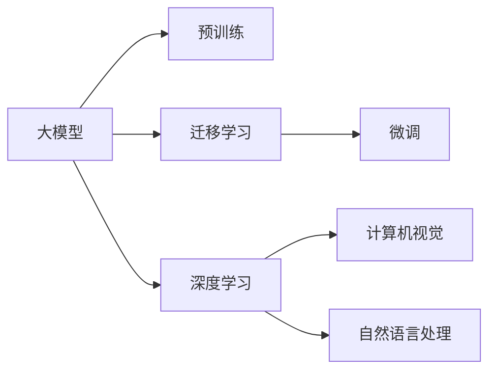

                 

# AI大模型创业：如何应对技术挑战？

> 关键词：大模型，创业，技术挑战，自然语言处理(NLP)，计算机视觉(CV)，深度学习，迁移学习

## 1. 背景介绍

### 1.1 问题由来

在人工智能(AI)领域，大模型(即大规模预训练模型)已成为推动技术发展的核心引擎。无论是自然语言处理(NLP)、计算机视觉(CV)还是推荐系统等领域，大模型都展现了其在提升性能和效率方面的巨大潜力。然而，创业公司在尝试构建基于大模型的产品和服务时，面临着许多技术挑战，包括数据获取、模型训练、性能优化、部署和维护等。

### 1.2 问题核心关键点

这些技术挑战主要集中在以下几个方面：
1. **数据需求**：构建大模型需要海量数据，这对数据获取和标注提出了极高的要求。
2. **计算资源**：大模型的训练和推理需要强大的计算资源，这对硬件设备提出了挑战。
3. **模型优化**：如何在大规模数据和复杂任务上优化模型性能，以实现高效的推理和预测。
4. **部署与维护**：如何将大模型有效地部署到生产环境中，并确保其稳定性和可维护性。

解决这些挑战不仅需要深入的技术知识，还需要跨学科的合作和创新思维。本文将详细探讨这些挑战，并提供应对策略，以帮助创业公司在AI大模型领域取得成功。

## 2. 核心概念与联系

### 2.1 核心概念概述

为了更好地理解这些技术挑战，我们先介绍几个关键概念：

- **大模型**：指通过大规模数据预训练得到的深度学习模型，如BERT、GPT等。大模型具有强大的泛化能力，能够处理复杂的自然语言处理任务。
- **迁移学习**：指利用已有模型在大规模数据上学到的知识，在新任务上进行调整和优化，以提升模型性能。
- **预训练**：在大规模无标签数据上训练模型，使其学习到通用的语言表示，为下游任务提供基础。
- **微调(Fine-Tuning)**：在大规模预训练模型的基础上，通过下游任务的少量标注数据进行进一步训练，以适应特定任务。
- **深度学习**：基于神经网络的机器学习范式，通过多层次的非线性变换，实现复杂模式识别和预测。
- **计算机视觉**：研究如何让计算机“看”并理解图像和视频，是AI大模型应用的重要领域之一。
- **自然语言处理**：让计算机理解和处理人类语言，涉及语言模型、文本分类、机器翻译等任务。

这些概念之间通过数据、模型、算法和应用等维度紧密联系，共同构成了大模型创业的技术基础。

### 2.2 核心概念原理和架构的 Mermaid 流程图



## 3. 核心算法原理 & 具体操作步骤

### 3.1 算法原理概述

大模型的核心算法原理主要基于深度学习框架，特别是基于Transformer架构的神经网络。这些模型通过大规模数据进行预训练，学习到通用的语言表示和特征表示，然后在下游任务上进行微调，以适应具体任务的需求。

### 3.2 算法步骤详解

以下是构建基于大模型的AI应用的主要步骤：

1. **数据收集与预处理**：
   - 收集大量无标签数据进行预训练，确保数据的多样性和质量。
   - 对数据进行清洗、标注和处理，以提高数据质量和可用性。

2. **模型选择与设计**：
   - 选择合适的预训练模型，如BERT、GPT等。
   - 设计适合任务的模型结构，通常为多层次的Transformer网络。

3. **预训练**：
   - 使用大规模无标签数据对模型进行预训练，学习通用的语言表示。
   - 优化模型的超参数，如学习率、批次大小等。

4. **微调**：
   - 选择下游任务，收集少量标注数据。
   - 使用微调算法（如Fine-Tuning）对模型进行进一步训练，以适应特定任务。

5. **模型评估与部署**：
   - 在验证集上评估模型性能，调整模型参数和超参数。
   - 将模型部署到生产环境中，进行实时推理和预测。

6. **监控与优化**：
   - 持续监控模型性能，及时发现和解决性能问题。
   - 根据业务需求进行模型更新和优化。

### 3.3 算法优缺点

基于大模型的算法具有以下优点：
- **泛化能力强**：通过大规模预训练，模型能够学习到丰富的语言和视觉知识，适用于多种任务。
- **高效适应**：在少量标注数据下，通过微调可以快速适应新任务，提升模型性能。

同时，这些算法也存在一些缺点：
- **数据依赖高**：预训练和微调都需要大量高质量数据，数据获取和标注成本高。
- **计算资源需求大**：训练和推理需要强大的计算资源，对硬件设备要求高。
- **模型复杂**：大模型参数量庞大，模型结构和超参数设计复杂，调试和优化难度大。

### 3.4 算法应用领域

大模型算法广泛应用于多个领域，包括但不限于：

- **自然语言处理**：文本分类、情感分析、机器翻译、问答系统等。
- **计算机视觉**：图像识别、物体检测、人脸识别、视频分析等。
- **推荐系统**：个性化推荐、广告推荐、电商推荐等。
- **智能客服**：智能对话、智能问答、客服机器人等。
- **智能家居**：语音识别、智能控制、情感分析等。

## 4. 数学模型和公式 & 详细讲解 & 举例说明

### 4.1 数学模型构建

大模型通常基于Transformer架构进行构建，其数学模型可以表示为：

$$
M(x) = \text{Encoder}(x) \cdot \text{Decoder}(\text{Embedding}(x))
$$

其中，$M(x)$ 表示模型对输入 $x$ 的输出，$\text{Encoder}$ 和 $\text{Decoder}$ 分别表示编码器和解码器，$\text{Embedding}(x)$ 表示将输入 $x$ 转换为模型可接受的向量表示。

### 4.2 公式推导过程

以BERT模型为例，其预训练任务包括掩码语言模型和下一句预测。具体推导过程如下：

- 掩码语言模型：给定一个句子 $x$，随机掩盖部分单词，模型需要预测被掩盖单词的正确位置和单词。

  设 $x$ 的掩码表示为 $m$，模型输出为 $y$，则掩码语言模型的损失函数为：

  $$
  \mathcal{L}_{m} = -\sum_{i=1}^n \log P(y_i|m,x)
  $$

- 下一句预测：给定两个句子 $x_1$ 和 $x_2$，模型需要预测它们是否为下一句。

  设模型输出为 $y$，则下一句预测的损失函数为：

  $$
  \mathcal{L}_{p} = -\sum_{i=1}^n \log P(y_i|x_1,x_2)
  $$

### 4.3 案例分析与讲解

以BERT模型在情感分析任务上的微调为例，其数学模型和推导过程如下：

- 输入 $x$ 为电影评论，输出 $y$ 为情感标签（正面或负面）。

  设 $\text{Embedding}(x)$ 为输入 $x$ 的向量表示，$\text{Encoder}$ 为预训练的BERT模型，$\text{Decoder}$ 为全连接层。则模型的输出可以表示为：

  $$
  y = \text{softmax}(\text{Decoder}(\text{Encoder}(\text{Embedding}(x))))
  $$

  其中，$\text{softmax}$ 函数将输出转化为概率分布，$\text{Decoder}$ 层将编码器的输出转换为情感标签。

  通过交叉熵损失函数，可以定义微调的损失函数为：

  $$
  \mathcal{L} = -\frac{1}{N}\sum_{i=1}^N y_i \log \hat{y_i}
  $$

## 5. 项目实践：代码实例和详细解释说明

### 5.1 开发环境搭建

开发大模型应用通常需要使用Python语言和深度学习框架，如PyTorch或TensorFlow。以下是开发环境的搭建步骤：

1. 安装Anaconda：从官网下载并安装Anaconda，用于创建独立的Python环境。
2. 创建并激活虚拟环境：
   ```bash
   conda create -n pytorch-env python=3.8 
   conda activate pytorch-env
   ```
3. 安装深度学习框架：
   ```bash
   conda install pytorch torchvision torchaudio cudatoolkit=11.1 -c pytorch -c conda-forge
   ```
4. 安装TensorFlow：
   ```bash
   pip install tensorflow
   ```

### 5.2 源代码详细实现

以下是一个简单的基于BERT模型的情感分析微调示例：

```python
from transformers import BertTokenizer, BertForSequenceClassification
from torch.utils.data import Dataset, DataLoader
from torch.nn import CrossEntropyLoss
import torch

# 定义数据集
class SentimentDataset(Dataset):
    def __init__(self, texts, labels):
        self.texts = texts
        self.labels = labels
        self.tokenizer = BertTokenizer.from_pretrained('bert-base-cased')

    def __len__(self):
        return len(self.texts)

    def __getitem__(self, item):
        text = self.texts[item]
        label = self.labels[item]
        
        encoding = self.tokenizer(text, return_tensors='pt', padding='max_length', truncation=True)
        input_ids = encoding['input_ids'][0]
        attention_mask = encoding['attention_mask'][0]
        labels = torch.tensor(label, dtype=torch.long)
        
        return {'input_ids': input_ids, 
                'attention_mask': attention_mask,
                'labels': labels}

# 定义模型和优化器
model = BertForSequenceClassification.from_pretrained('bert-base-cased', num_labels=2)
optimizer = AdamW(model.parameters(), lr=2e-5)

# 定义损失函数
criterion = CrossEntropyLoss()

# 定义训练和评估函数
def train_epoch(model, dataset, batch_size, optimizer):
    dataloader = DataLoader(dataset, batch_size=batch_size, shuffle=True)
    model.train()
    epoch_loss = 0
    for batch in dataloader:
        input_ids = batch['input_ids'].to(device)
        attention_mask = batch['attention_mask'].to(device)
        labels = batch['labels'].to(device)
        model.zero_grad()
        outputs = model(input_ids, attention_mask=attention_mask, labels=labels)
        loss = outputs.loss
        epoch_loss += loss.item()
        loss.backward()
        optimizer.step()
    return epoch_loss / len(dataloader)

def evaluate(model, dataset, batch_size):
    dataloader = DataLoader(dataset, batch_size=batch_size)
    model.eval()
    preds, labels = [], []
    with torch.no_grad():
        for batch in dataloader:
            input_ids = batch['input_ids'].to(device)
            attention_mask = batch['attention_mask'].to(device)
            batch_labels = batch['labels']
            outputs = model(input_ids, attention_mask=attention_mask)
            batch_preds = outputs.logits.argmax(dim=1).to('cpu').tolist()
            batch_labels = batch_labels.to('cpu').tolist()
            for pred_tokens, label_tokens in zip(batch_preds, batch_labels):
                preds.append(pred_tokens)
                labels.append(label_tokens)
    
    print(classification_report(labels, preds))

# 训练模型
device = torch.device('cuda' if torch.cuda.is_available() else 'cpu')
model.to(device)
epochs = 5
batch_size = 16

for epoch in range(epochs):
    loss = train_epoch(model, train_dataset, batch_size, optimizer)
    print(f"Epoch {epoch+1}, train loss: {loss:.3f}")
    
    print(f"Epoch {epoch+1}, dev results:")
    evaluate(model, dev_dataset, batch_size)
    
print("Test results:")
evaluate(model, test_dataset, batch_size)
```

### 5.3 代码解读与分析

这个代码示例展示了如何使用BERT模型进行情感分析任务的微调。其中，`SentimentDataset`类定义了数据集，`BertForSequenceClassification`模型是BERT模型，用于进行情感分类。训练函数`train_epoch`和评估函数`evaluate`分别用于模型的训练和评估。

代码中使用了PyTorch框架，并通过`transformers`库加载了BERT模型和分词器。`SentimentDataset`类将文本和标签转换为模型可以接受的输入格式。训练函数中，模型在每个批次上进行前向传播和反向传播，计算损失并更新参数。评估函数中，模型在测试集上进行推理，输出预测结果和评估指标。

## 6. 实际应用场景

### 6.1 智能客服系统

智能客服系统可以大幅提升客服效率和客户满意度，通过大模型进行微调，可以实现自然语言理解和生成的智能化。系统通过对话历史数据训练模型，能够理解客户意图，提供个性化的服务。例如，针对常见问题，模型可以快速生成回答，并根据对话内容动态调整回答策略，实现智能客服的自动化。

### 6.2 金融舆情监测

金融舆情监测系统可以实时监控市场动态，帮助金融机构及时应对舆情变化。通过大模型进行微调，系统能够自动识别舆情主题和情感倾向，生成舆情报告，供决策者参考。例如，针对负面舆情，系统可以及时预警，帮助金融机构规避风险。

### 6.3 个性化推荐系统

个性化推荐系统通过用户行为数据进行微调，能够提供更加精准的推荐结果。系统在用户浏览、点击、评论等数据上进行训练，学习用户的兴趣偏好，并结合商品特征进行推荐。例如，根据用户浏览过的商品，系统可以推荐类似商品或相关商品。

### 6.4 未来应用展望

未来，大模型微调技术将在更多领域得到应用，推动AI技术的普及和发展。

- **智慧医疗**：通过微调大模型，可以实现医疗问答、病历分析等智能化应用，辅助医生诊断和治疗。
- **智能教育**：微调模型可以用于作业批改、学情分析、知识推荐等，实现个性化教育。
- **智慧城市**：微调模型可以用于城市事件监测、舆情分析、应急指挥等，提升城市治理效率。

## 7. 工具和资源推荐

### 7.1 学习资源推荐

- **深度学习与自然语言处理**：斯坦福大学CS224N课程，涵盖NLP基本概念和前沿技术。
- **Transformers官方文档**：HuggingFace的Transformers库官方文档，提供了详细的使用指南和示例代码。
- **自然语言处理综述**： paper "A Survey on Natural Language Processing"，介绍了NLP的基本框架和经典模型。
- **自然语言处理基础**： paper "An Introduction to Natural Language Processing"，介绍了NLP的基本概念和技术。

### 7.2 开发工具推荐

- **PyTorch**：高性能深度学习框架，易于使用且支持丰富的预训练模型。
- **TensorFlow**：Google开发的深度学习框架，支持大规模分布式训练。
- **TensorBoard**：TensorFlow的可视化工具，用于实时监控和调试模型。
- **Weights & Biases**：实验跟踪工具，记录和分析模型训练过程。
- **Jupyter Notebook**：交互式编程环境，支持代码编写和调试。

### 7.3 相关论文推荐

- **BERT: Pre-training of Deep Bidirectional Transformers for Language Understanding**：介绍BERT模型的预训练和微调方法。
- **Attention is All You Need**：介绍Transformer模型的原理和应用。
- **Fine-Tuning Tasks in Few-shot Setting**：介绍参数高效微调和少样本学习的方法。
- **AdaLoRA: Adaptive Low-Rank Adaptation for Parameter-Efficient Fine-Tuning**：介绍参数高效微调的方法。
- **Prefix-Tuning: Optimizing Continuous Prompts for Generation**：介绍基于连续型Prompt的微调方法。

## 8. 总结：未来发展趋势与挑战

### 8.1 研究成果总结

本文介绍了大模型在创业中的技术挑战和应对策略，包括数据获取、模型训练、性能优化、部署和维护等方面。通过实际案例和数学模型推导，详细讲解了大模型的构建和微调过程。

### 8.2 未来发展趋势

未来，大模型将向更大规模、更高效、更智能的方向发展。主要趋势包括：

- **模型规模增大**：预训练模型参数量将继续增加，学习到的知识将更加全面。
- **计算效率提升**：优化模型结构和训练算法，提升大模型的推理和训练效率。
- **应用领域扩展**：大模型将应用于更多领域，如智慧医疗、智能教育等。

### 8.3 面临的挑战

尽管大模型在许多领域取得了成功，但仍面临一些挑战：

- **数据依赖**：数据获取和标注成本高，难以覆盖所有应用场景。
- **计算资源**：大模型的训练和推理需要高性能硬件，成本高。
- **模型复杂性**：大模型参数量大，调试和优化难度大。

### 8.4 研究展望

未来研究将集中在以下几个方面：

- **数据增强**：通过数据增强技术，提升模型对小样本数据的适应能力。
- **计算优化**：优化模型结构，提升训练和推理效率。
- **模型可解释性**：增强模型的可解释性，确保模型输出的可信度。
- **跨领域迁移**：实现大模型在多个领域间的迁移和复用。

## 9. 附录：常见问题与解答

**Q1：如何选择合适的预训练模型？**

A: 选择预训练模型应考虑任务类型和数据特点。对于文本分类和情感分析等任务，BERT、GPT等通用模型表现较好；对于图像识别等任务，ResNet、Inception等计算机视觉模型更适用。

**Q2：数据预处理和标注有哪些技巧？**

A: 数据预处理和标注是构建大模型的关键步骤。应使用工具如NLTK、SpaCy等进行文本清洗和分词；标注时应注意标注数据的完备性和一致性，使用众包平台如Amazon Mechanical Turk获取高质量标注数据。

**Q3：微调模型时需要注意哪些问题？**

A: 微调模型时需要注意学习率、批次大小、正则化等超参数的设定，避免过拟合。应使用交叉验证和早停策略等方法，评估模型性能。

**Q4：如何评估微调后的模型？**

A: 评估微调后的模型应使用验证集进行评估，计算准确率、精确率、召回率等指标。应定期更新验证集，确保模型性能稳定。

**Q5：模型部署和维护有哪些技巧？**

A: 模型部署时应考虑模型的推理速度和资源消耗，可以使用模型压缩和量化等技术进行优化。维护时应注意模型参数的定期更新和版本管理。

通过深入理解和灵活应用上述技术和方法，相信人工智能创业公司能够在AI大模型领域取得更大的成功。

