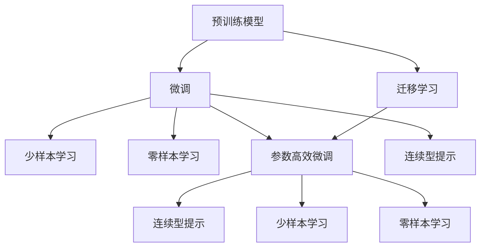

                 

# AI大模型创业：如何应对未来技术挑战？

> 关键词：大模型,创业,技术挑战,未来趋势,创新路径

## 1. 背景介绍

### 1.1 问题由来

近年来，人工智能技术在各个领域取得了突破性进展，尤其是在自然语言处理(NLP)、计算机视觉(CV)等领域，大规模预训练模型(DLMs)成为了新的技术潮流。这些预训练模型，如BERT、GPT-3等，通过在海量数据上进行预训练，具备了强大的通用表示能力，能够在各种任务上获得卓越的性能。

然而，这些预训练模型通常需要高昂的计算资源和时间成本，普通创业公司难以承担。同时，预训练模型的泛化能力在特定领域内可能不足，直接应用效果不佳。因此，如何在创业阶段，通过有限的资源和数据，高效利用大模型技术，提升应用性能，成为当前AI创业公司的核心问题。

### 1.2 问题核心关键点

大模型技术的应用，尤其是微调（Fine-Tuning）和迁移学习（Transfer Learning），成为了AI创业公司探索的重要方向。通过预训练模型作为特征提取器，对特定任务进行微调，可以极大地提升模型的性能。但这一过程也面临着诸多挑战，如过拟合、数据需求高、模型复杂性等。

面对这些挑战，本文将介绍如何在大模型创业过程中，通过策略性的技术选择和应用，应对未来的技术挑战，实现高效且具有竞争力的AI应用开发。

## 2. 核心概念与联系

### 2.1 核心概念概述

为更好地理解如何在大模型创业过程中应对技术挑战，本节将介绍几个密切相关的核心概念：

- **预训练模型（Pre-trained Models）**：如BERT、GPT等，在大规模无标签数据上通过自监督任务预训练得到的通用表示模型。
- **微调（Fine-Tuning）**：在预训练模型基础上，使用下游任务的有标签数据进行有监督学习，优化模型在特定任务上的性能。
- **迁移学习（Transfer Learning）**：将一个任务学到的知识迁移到另一个相关任务上，以减少从头训练的成本。
- **参数高效微调（Parameter-Efficient Fine-Tuning, PEFT）**：在微调过程中只更新少量的模型参数，以提高微调效率。
- **少样本学习（Few-Shot Learning）**：模型仅在少量标注数据上学习，即能在极少量的数据下进行高效学习。
- **零样本学习（Zero-Shot Learning）**：模型仅凭任务描述就能执行新任务。
- **连续型提示（Continuous Prompt Tuning）**：通过调整提示模板，引导模型生成特定输出，减少微调参数。

这些核心概念之间的逻辑关系可以通过以下Mermaid流程图来展示：



### 2.2 核心概念原理和架构的 Mermaid 流程图

这个流程图展示了大模型技术的核心概念及其之间的关系：

1. **预训练模型**通过大规模无标签数据进行预训练，学习到通用的语言/视觉表示。
2. **微调**和**迁移学习**利用预训练模型的泛化能力，针对特定任务进行参数更新。
3. **参数高效微调**、**少样本学习**和**零样本学习**进一步优化微调过程，减少数据需求和计算资源消耗。
4. **连续型提示**通过调整输入格式，实现高效的学习方式，减少微调参数。

这些概念共同构成了大模型技术的核心框架，在大规模数据和计算资源有限的创业阶段，尤其具有重要意义。

## 3. 核心算法原理 & 具体操作步骤

### 3.1 算法原理概述

在大模型创业过程中，核心的技术挑战是如何高效地利用有限的资源和数据，优化模型的性能。这主要通过微调和迁移学习来实现。

微调的核心思想是利用预训练模型的泛化能力，通过有监督学习进一步优化特定任务的性能。其数学公式为：

$$
\theta^* = \mathop{\arg\min}_{\theta} \mathcal{L}(M_{\theta},D)
$$

其中，$M_{\theta}$为预训练模型，$D$为下游任务的有标签数据集，$\theta$为模型参数。

迁移学习则是将一个领域学到的知识迁移到另一个领域，以加速新领域的学习过程。典型的迁移学习模型为：

$$
M_{\theta} = f_{P1} \times f_{P2}
$$

其中，$f_{P1}$为源领域的预训练模型，$f_{P2}$为下游领域的微调模型。

### 3.2 算法步骤详解

大模型创业过程中的核心算法步骤包括以下几个环节：

1. **选择预训练模型**：根据应用领域选择合适的预训练模型，如BERT、GPT、ResNet等。
2. **数据预处理**：将数据集进行分批处理，生成输入输出对，准备数据增强技术。
3. **模型初始化**：加载预训练模型，设置微调超参数。
4. **模型微调**：通过有监督学习更新模型参数，使用训练数据集进行迭代训练。
5. **模型评估**：在验证集上评估模型性能，调整超参数。
6. **部署应用**：将微调后的模型部署到实际应用中，进行业务集成。

### 3.3 算法优缺点

基于预训练模型的微调方法具有以下优点：

- **高效性**：通过微调，模型可以在少量数据上快速获得较好的性能，节省时间和计算资源。
- **泛化能力**：预训练模型已经在大规模数据上学习到通用特征，微调后能更好地适应特定任务。
- **通用性**：预训练模型可以应用于多种下游任务，具有良好的通用性。

同时，该方法也存在一定的局限性：

- **数据需求高**：微调需要高质量的有标签数据，而标注数据的获取成本较高。
- **计算资源需求高**：预训练模型通常参数量庞大，对计算资源和内存有较高要求。
- **模型复杂性**：微调过程复杂，需要精心设计训练过程和超参数。

### 3.4 算法应用领域

预训练模型和微调技术在以下领域得到了广泛应用：

- **自然语言处理（NLP）**：如问答系统、文本分类、机器翻译等。
- **计算机视觉（CV）**：如图像分类、物体检测、语义分割等。
- **语音处理**：如语音识别、说话人识别、语音生成等。
- **推荐系统**：如电商推荐、内容推荐等。
- **医疗**：如医学影像分析、病历分析等。

## 4. 数学模型和公式 & 详细讲解 & 举例说明

### 4.1 数学模型构建

微调的数学模型构建包括以下几个步骤：

1. **损失函数**：定义任务的损失函数，如交叉熵损失、均方误差损失等。
2. **模型参数**：设置模型的参数，如学习率、批大小等。
3. **模型更新**：使用梯度下降等优化算法更新模型参数。

### 4.2 公式推导过程

以分类任务为例，其微调过程的数学公式为：

$$
\theta^* = \mathop{\arg\min}_{\theta} \frac{1}{N} \sum_{i=1}^N \ell(M_{\theta}(x_i),y_i)
$$

其中，$\ell$为损失函数，$M_{\theta}(x_i)$为模型在输入$x_i$上的预测输出，$y_i$为真实标签。

### 4.3 案例分析与讲解

以图像分类任务为例，使用ResNet-50作为预训练模型，使用ImageNet数据集进行微调。微调过程中，首先将ImageNet数据集分为训练集和验证集，加载预训练模型ResNet-50。设置学习率为0.001，使用SGD优化算法，训练50个epoch。在每个epoch结束后，在验证集上评估模型性能，调整学习率。最后，将微调后的模型部署到实际应用中。

## 5. 项目实践：代码实例和详细解释说明

### 5.1 开发环境搭建

为了进行大模型创业中的微调实践，需要搭建一个Python开发环境。具体步骤如下：

1. 安装Anaconda：从官网下载并安装Anaconda，用于创建独立的Python环境。
2. 创建并激活虚拟环境：
```bash
conda create -n myenv python=3.7
conda activate myenv
```

3. 安装必要的库：
```bash
pip install torch torchvision torchaudio
pip install numpy pandas scikit-learn
```

### 5.2 源代码详细实现

以下是一个使用PyTorch进行图像分类任务微调的代码实现示例：

```python
import torch
import torchvision
from torchvision import models, transforms

# 加载预训练模型
model = models.resnet50(pretrained=True)

# 定义数据增强操作
transform = transforms.Compose([
    transforms.Resize(256),
    transforms.CenterCrop(224),
    transforms.ToTensor(),
    transforms.Normalize(mean=[0.485, 0.456, 0.406], std=[0.229, 0.224, 0.225])
])

# 加载训练数据集
train_dataset = torchvision.datasets.ImageFolder(root='train_dir', transform=transform)
train_loader = torch.utils.data.DataLoader(train_dataset, batch_size=32, shuffle=True)

# 加载验证数据集
valid_dataset = torchvision.datasets.ImageFolder(root='valid_dir', transform=transform)
valid_loader = torch.utils.data.DataLoader(valid_dataset, batch_size=32, shuffle=False)

# 设置模型和优化器
criterion = torch.nn.CrossEntropyLoss()
optimizer = torch.optim.SGD(model.parameters(), lr=0.001, momentum=0.9)

# 定义训练过程
def train(epoch):
    model.train()
    for batch_idx, (data, target) in enumerate(train_loader):
        optimizer.zero_grad()
        output = model(data)
        loss = criterion(output, target)
        loss.backward()
        optimizer.step()
        if batch_idx % 100 == 0:
            print('Train Epoch: {} [{}/{} ({:.0f}%)]\tLoss: {:.6f}'.format(
                epoch, batch_idx * len(data), len(train_loader.dataset),
                100. * batch_idx / len(train_loader), loss.item()))

# 定义验证过程
def validate():
    model.eval()
    total_correct = 0
    total_samples = 0
    with torch.no_grad():
        for data, target in valid_loader:
            output = model(data)
            _, predicted = torch.max(output, 1)
            total_correct += (predicted == target).sum().item()
            total_samples += target.size(0)
    print('Accuracy of the network on the 10000 test images: {} %'.format(
        100. * total_correct / total_samples))

# 训练模型
for epoch in range(1, 51):
    train(epoch)
    validate()
```

### 5.3 代码解读与分析

**数据预处理**：
- 使用ImageFolder加载数据集，并将其分批处理。
- 使用数据增强技术，如Resizing、Cropping等，增强模型的泛化能力。

**模型初始化**：
- 加载预训练的ResNet-50模型。
- 设置优化器和损失函数。

**模型训练**：
- 在训练集上使用SGD优化器进行参数更新。
- 在每个epoch结束时，在验证集上评估模型性能。

**模型评估**：
- 在验证集上计算准确率，输出评估结果。

## 6. 实际应用场景

### 6.1 医疗影像分析

在医疗影像分析领域，大模型创业公司可以利用微调技术开发精准的影像分类和诊断工具。例如，使用预训练的ResNet-50进行肺部影像分类，微调模型以适应特定病种（如肺癌、肺结核等）的影像数据，从而提升诊断的准确性和效率。

### 6.2 智能推荐系统

电商企业可以利用大模型创业，通过微调技术开发智能推荐系统。例如，使用预训练的BERT模型进行商品描述处理，微调模型以适应推荐系统任务，提升推荐的个性化和准确性。

### 6.3 个性化医疗

个性化医疗领域可以利用大模型创业，开发针对个体基因组的疾病预测和健康管理工具。例如，使用预训练的GPT模型进行基因序列处理，微调模型以适应个性化医疗任务，提供个性化的健康建议和治疗方案。

### 6.4 未来应用展望

随着大模型和微调技术的不断进步，未来的应用场景将更加广泛。例如：

- **智慧城市**：利用大模型进行城市交通流量预测、智能安防等，提升城市管理效率和安全性。
- **智能制造**：利用大模型进行工业设备状态监测和故障预测，提升生产效率和质量。
- **教育**：利用大模型进行个性化教育推荐和智能辅导，提升教育效果和学习体验。

## 7. 工具和资源推荐

### 7.1 学习资源推荐

为了帮助大模型创业者掌握核心技术，推荐以下学习资源：

1. 《深度学习》一书：由Ian Goodfellow等著，系统介绍深度学习的理论基础和实践方法。
2. 《自然语言处理综论》一书：由Christopher D. Manning等著，全面介绍NLP领域的核心技术和应用场景。
3. HuggingFace官方文档：提供丰富的预训练模型和微调教程。
4. Coursera的深度学习课程：由Andrew Ng等主讲，涵盖深度学习的基本概念和前沿技术。
5. GitHub上的开源项目：提供大量的预训练模型和微调样例代码。

### 7.2 开发工具推荐

为了提高开发效率，推荐以下开发工具：

1. PyTorch：灵活的深度学习框架，适合进行模型设计和实验。
2. TensorFlow：广泛使用的深度学习框架，适合大规模工程应用。
3. Jupyter Notebook：交互式的Python开发环境，便于实验和协作。
4. Weights & Biases：模型训练和实验跟踪工具，便于监控和调优。
5. TensorBoard：模型可视化工具，便于调试和展示。

### 7.3 相关论文推荐

为了深入理解大模型和微调技术的最新进展，推荐以下相关论文：

1. "BERT: Pre-training of Deep Bidirectional Transformers for Language Understanding"：BERT模型，使用自监督学习任务进行预训练和微调。
2. "Attention is All You Need"：Transformer模型，提出注意力机制，提升模型的表示能力。
3. "Parameter-Efficient Transfer Learning for NLP"： Adapter技术，只更新少量任务相关参数，提高微调效率。
4. "Fine-tune Classifier-free Language Models with Denoising Pre-training"：FSDP技术，通过预训练和微调结合，提高模型的泛化能力。
5. "CoLA: Continuous Label Assignment for Language Model Fine-Tuning"：CoLA技术，通过连续型提示，实现高效的少样本学习。

## 8. 总结：未来发展趋势与挑战

### 8.1 研究成果总结

在大模型创业过程中，微调和迁移学习技术已展现出显著的性能提升和应用潜力。通过微调，模型可以在少量数据上快速获得理想的效果，提升任务性能。同时，迁移学习技术能够将预训练模型的泛化能力应用到特定任务，减少从头训练的成本。

### 8.2 未来发展趋势

未来，大模型创业将呈现以下几个趋势：

1. **更高效的微调方法**：研究参数高效和计算高效的微调方法，进一步减少资源消耗。
2. **更广泛的迁移学习**：拓展迁移学习的应用范围，适应更多领域和任务。
3. **更智能的提示学习**：开发更智能的连续型提示技术，实现零样本和少样本学习。
4. **更普适的预训练模型**：开发更普适的预训练模型，提高模型的泛化能力。
5. **更强大的知识整合**：将预训练模型与外部知识库和规则库结合，提高模型的综合能力。

### 8.3 面临的挑战

大模型创业在大规模应用中也面临一些挑战：

1. **数据获取成本高**：高质量标注数据的获取成本较高，限制了微调技术的应用。
2. **计算资源需求高**：大规模预训练模型和微调模型对计算资源和内存有较高要求。
3. **模型复杂性高**：微调过程复杂，需要精心设计训练过程和超参数。
4. **模型鲁棒性差**：微调模型在特定领域或特定数据上的泛化能力有限。
5. **模型可解释性差**：大模型的决策过程缺乏可解释性，难以理解和调试。

### 8.4 研究展望

未来的研究应聚焦于以下几个方向：

1. **探索更高效的数据获取方法**：研究如何通过无监督和半监督学习，减少对标注数据的依赖。
2. **开发更高效的计算优化技术**：研究如何优化计算图，减少资源消耗，提高推理速度。
3. **引入更多的先验知识**：将符号化的先验知识与预训练模型结合，提高模型的综合能力。
4. **提升模型的可解释性**：开发可解释性更强的模型，提供更好的决策依据。
5. **保障模型安全性和鲁棒性**：通过伦理导向和对抗训练，确保模型的安全性和鲁棒性。

## 9. 附录：常见问题与解答

**Q1：大模型创业的主要技术难点是什么？**

A: 大模型创业的主要技术难点包括：
1. 数据获取成本高，难以获得高质量标注数据。
2. 计算资源需求高，大规模预训练和微调模型对计算资源和内存有较高要求。
3. 模型复杂性高，微调过程和超参数设计复杂。
4. 模型鲁棒性差，特定领域或特定数据上的泛化能力有限。
5. 模型可解释性差，难以理解和调试。

**Q2：如何在有限的资源下进行大模型微调？**

A: 在有限的资源下进行大模型微调，可以采取以下策略：
1. 使用参数高效微调技术，如Adapter、LoRA等，只更新少量任务相关参数。
2. 采用数据增强技术，如回译、近义替换等，扩充训练集。
3. 优化模型结构，如剪枝、量化加速等，提高推理效率。
4. 利用预训练模型的通用特征，减少从头训练的工作量。
5. 引入外部知识库和规则库，提高模型的综合能力。

**Q3：大模型创业过程中需要注意哪些问题？**

A: 大模型创业过程中需要注意以下问题：
1. 数据质量：确保训练数据的高质量，减少过拟合风险。
2. 计算资源：合理配置计算资源，避免资源浪费。
3. 模型结构：选择合适模型结构和参数量，避免复杂度太高。
4. 超参数：精心设计超参数，避免过拟合和欠拟合。
5. 模型评估：及时评估模型性能，进行必要的调优。

---

作者：禅与计算机程序设计艺术 / Zen and the Art of Computer Programming

