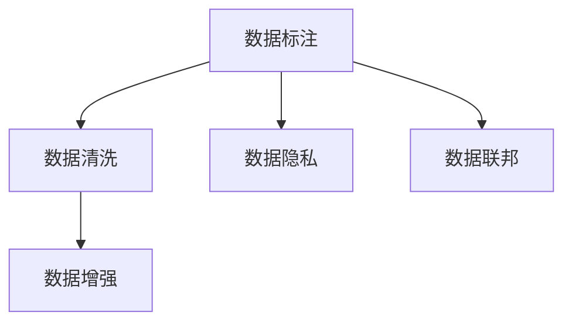

                 

# AI大模型创业：如何应对未来数据挑战？

在人工智能(AI)大模型的发展热潮中，如何有效应对未来数据挑战，成为决定企业成败的关键。本文将从数据获取、数据处理、数据利用等多个层面，深入探讨AI大模型创业所面临的数据问题，并提供切实可行的解决方案。

## 1. 背景介绍

### 1.1 问题由来

在人工智能的推动下，大模型正在迅速成为商业领域的新引擎。这些大模型如BERT、GPT-3等，通过在大规模无标签文本数据上进行预训练，学习到丰富的语言知识，展现出了卓越的语言生成和理解能力。然而，这些大模型在实际应用中需要大量标注数据进行微调，才能匹配特定的业务需求。数据不足或数据质量差，将会严重影响模型的性能，甚至导致业务失败。

### 1.2 问题核心关键点

AI大模型创业的关键在于如何高效获取并利用数据。数据对于AI模型至关重要，但在大规模获取、处理和利用数据方面，企业往往面临以下挑战：
- **数据规模不足**：在资源有限的情况下，如何尽可能多地获取优质数据，是企业数据策略的核心。
- **数据质量参差不齐**：数据标注成本高昂，且标注质量难以保证，如何高效筛选和处理数据，成为数据管理的重中之重。
- **数据隐私和安全**：在数据使用过程中，如何确保数据隐私和安全，避免数据泄露或滥用，是数据治理的重要环节。
- **数据动态变化**：在业务发展过程中，数据源和数据分布会发生变化，如何保持数据的持续更新和模型性能的稳定，是企业数据管理的长期课题。

解决这些挑战，不仅需要企业在技术上有所突破，更需要在数据管理和治理上下足功夫。

## 2. 核心概念与联系

### 2.1 核心概念概述

为更好地理解如何应对AI大模型创业的数据挑战，本节将介绍几个密切相关的核心概念：

- **数据标注**：通过人工对数据进行分类、标记等操作，以获取标注数据。
- **数据清洗**：对原始数据进行预处理，去除噪音、处理缺失值等，以保证数据质量。
- **数据增强**：通过扩充训练集数据，提高模型的泛化能力，常用于生成式模型的训练。
- **数据隐私**：在数据收集和处理过程中，保护个人隐私，遵循相关法律法规。
- **数据联邦**：分布式数据处理技术，在多个参与方之间共享数据，但数据不离开本地，保障数据安全和隐私。

这些概念之间的逻辑关系可以通过以下Mermaid流程图来展示：



这个流程图展示了大模型创业过程中数据管理的核心环节：

1. 从数据标注开始，获取原始数据。
2. 对数据进行清洗，去除噪音，处理缺失值。
3. 通过数据增强扩充训练集，提升模型泛化能力。
4. 在数据使用过程中，注重数据隐私和安全。
5. 采用数据联邦技术，保障数据分布式共享和本地处理。

## 3. 核心算法原理 & 具体操作步骤

### 3.1 算法原理概述

AI大模型创业的数据挑战，主要集中在如何高效获取、处理和利用数据。以下是几种核心算法原理和具体操作步骤：

- **主动学习**：通过机器学习算法自动选择最有价值的标注样本，减少人工标注工作量。
- **半监督学习**：利用大量未标注数据和少量标注数据，通过自监督和弱监督学习，提高模型性能。
- **生成式数据增强**：通过生成式模型（如GANs）生成合成数据，扩充训练集。
- **数据联邦**：在分布式环境中，多个参与方共享数据，但不共享原始数据，保障数据隐私和安全。

### 3.2 算法步骤详解

#### 3.2.1 主动学习

1. **选择算法**：选择如 uncertainty sampling、cluster-based active learning 等算法。
2. **获取样本**：通过训练模型预测样本的标签不确定性，选择最有价值的样本进行标注。
3. **更新模型**：利用已标注样本更新模型，重新评估样本重要性，循环迭代直至收敛。

#### 3.2.2 半监督学习

1. **初始化模型**：基于无标签数据训练模型，获取模型预测的伪标签。
2. **集成标注**：将模型预测的伪标签与少量标注数据集成，生成混合标注数据集。
3. **模型训练**：在混合标注数据集上训练模型，提升模型性能。
4. **模型评估**：在未标注数据上评估模型性能，验证模型泛化能力。

#### 3.2.3 生成式数据增强

1. **选择模型**：如 GANs、VAEs 等生成式模型。
2. **生成数据**：使用生成式模型生成合成数据，扩充训练集。
3. **数据融合**：将生成数据与原始数据混合，组成更丰富多样的训练集。
4. **模型微调**：在扩充后的训练集上微调模型，提升泛化性能。

#### 3.2.4 数据联邦

1. **建立网络**：搭建数据联邦网络，连接多个参与方。
2. **分布式训练**：在每个参与方上训练模型，不共享原始数据。
3. **聚合模型**：通过模型参数更新策略，将各参与方的模型进行聚合。
4. **模型部署**：部署聚合后的模型，供实际业务使用。

### 3.3 算法优缺点

#### 3.3.1 主动学习

**优点**：
- 减少标注成本，提升标注效率。
- 自动选择重要样本，避免标注噪声。

**缺点**：
- 选择算法复杂，可能存在偏差。
- 对高质量模型的要求较高。

#### 3.3.2 半监督学习

**优点**：
- 利用大量未标注数据，提升数据利用率。
- 泛化能力强，模型性能提升显著。

**缺点**：
- 对少量标注数据依赖较大。
- 模型难以适应分布变化。

#### 3.3.3 生成式数据增强

**优点**：
- 扩充训练集，提高泛化能力。
- 生成数据多样性高，增强模型鲁棒性。

**缺点**：
- 生成数据质量难以保证。
- 计算成本较高。

#### 3.3.4 数据联邦

**优点**：
- 保障数据隐私和安全。
- 分布式训练提升计算效率。

**缺点**：
- 模型参数更新复杂。
- 通信开销较大。

### 3.4 算法应用领域

AI大模型创业的数据挑战解决方案，在多个领域都有广泛的应用：

- **医疗领域**：通过主动学习和半监督学习，利用电子病历、医学图像等大数据，提升疾病诊断和预测模型的性能。
- **金融领域**：采用生成式数据增强技术，生成合成交易数据，扩充训练集，提升风险评估和预测模型的泛化能力。
- **智能客服**：利用数据联邦技术，在多个客服系统之间共享用户数据，提升智能客服系统的自然语言处理能力。
- **电商推荐**：采用半监督学习技术，通过用户行为数据训练推荐模型，提升推荐系统的效果。
- **智能制造**：通过数据增强和数据联邦技术，在多个智能制造系统之间共享设备数据，提升智能制造系统的协同能力。

## 4. 数学模型和公式 & 详细讲解 & 举例说明

### 4.1 数学模型构建

在AI大模型创业中，数据处理和利用需要构建数学模型，以进行准确的量化评估。以下是几种常见模型的构建方式：

#### 4.1.1 主动学习模型

1. **样本不确定性度量**：选择 uncertainty sampling 算法，度量样本的不确定性。
   $$
   \text{uncertainty}(x) = \sum_{i=1}^{n} \frac{p(x_i|y_i)}{1-p(x_i|y_i)}
   $$
   其中，$x$ 为样本，$y_i$ 为样本的标签，$p(x_i|y_i)$ 为模型预测概率。

2. **样本选择**：选择不确定性高的样本进行标注。
   $$
   S = \{ x_i \mid \text{uncertainty}(x_i) > \tau \}
   $$
   其中，$\tau$ 为不确定性阈值。

3. **模型更新**：通过已标注样本更新模型，重新评估样本重要性。
   $$
   M^{t+1} = \text{Update}(M^t, S)
   $$

#### 4.1.2 半监督学习模型

1. **初始化模型**：基于无标签数据训练模型，生成伪标签。
   $$
   y_{pseudo} = \text{predict}(M, x)
   $$

2. **混合标注**：将伪标签与少量标注数据集成。
   $$
   D_{mixed} = \{ (x, y) \mid y = \begin{cases} y^{label} & y^{label} \neq y_{pseudo} \\ y_{pseudo} & y^{label} = y_{pseudo} \end{cases} \}
   $$

3. **模型训练**：在混合标注数据集上训练模型。
   $$
   M^{t+1} = \text{Train}(M^t, D_{mixed})
   $$

4. **模型评估**：在未标注数据上评估模型性能。
   $$
   \text{performance} = \text{Evaluate}(M, D_{unlabel})
   $$

#### 4.1.3 生成式数据增强模型

1. **选择生成模型**：如 GANs、VAEs 等生成式模型。
2. **生成数据**：使用生成模型生成合成数据。
   $$
   D_{synthetic} = \{ x_{gen} \mid x_{gen} = \text{Generate}(GAN, \theta) \}
   $$
   其中，$GAN$ 为生成模型，$\theta$ 为模型参数。

3. **数据融合**：将生成数据与原始数据混合。
   $$
   D_{combined} = \{ x \mid x = \begin{cases} x^{original} & x \in D^{original} \\ x_{gen} & x \in D_{synthetic} \end{cases} \}
   $$

4. **模型微调**：在扩充后的训练集上微调模型。
   $$
   M^{t+1} = \text{Fine-tune}(M^t, D_{combined})
   $$

#### 4.1.4 数据联邦模型

1. **建立网络**：搭建数据联邦网络，连接多个参与方。
   $$
   N = \{ P_i \mid i=1,...,N \}
   $$
   其中，$P_i$ 为参与方 $i$ 的服务器。

2. **分布式训练**：在每个参与方上训练模型。
   $$
   M^{t+1}_i = \text{Train}(M^t_i, D_i)
   $$
   其中，$M^t_i$ 为参与方 $i$ 的模型，$D_i$ 为参与方 $i$ 的数据集。

3. **聚合模型**：通过模型参数更新策略，将各参与方的模型进行聚合。
   $$
   M^{t+1} = \text{Aggregate}(M^{t+1}_i, \{P_i\})
   $$

4. **模型部署**：部署聚合后的模型，供实际业务使用。
   $$
   M_{deploy} = \text{Deploy}(M^{t+1})
   $$

### 4.2 公式推导过程

#### 4.2.1 主动学习公式推导

1. **样本不确定性度量**：
   $$
   \text{uncertainty}(x) = \sum_{i=1}^{n} \frac{p(x_i|y_i)}{1-p(x_i|y_i)}
   $$

2. **样本选择**：
   $$
   S = \{ x_i \mid \text{uncertainty}(x_i) > \tau \}
   $$

3. **模型更新**：
   $$
   M^{t+1} = \text{Update}(M^t, S)
   $$

#### 4.2.2 半监督学习公式推导

1. **初始化模型**：
   $$
   y_{pseudo} = \text{predict}(M, x)
   $$

2. **混合标注**：
   $$
   D_{mixed} = \{ (x, y) \mid y = \begin{cases} y^{label} & y^{label} \neq y_{pseudo} \\ y_{pseudo} & y^{label} = y_{pseudo} \end{cases} \}
   $$

3. **模型训练**：
   $$
   M^{t+1} = \text{Train}(M^t, D_{mixed})
   $$

4. **模型评估**：
   $$
   \text{performance} = \text{Evaluate}(M, D_{unlabel})
   $$

#### 4.2.3 生成式数据增强公式推导

1. **选择生成模型**：
   $$
   GAN = \{ G \mid G:Z \rightarrow X \}
   $$
   其中，$Z$ 为噪声向量，$X$ 为生成数据。

2. **生成数据**：
   $$
   D_{synthetic} = \{ x_{gen} \mid x_{gen} = \text{Generate}(GAN, \theta) \}
   $$

3. **数据融合**：
   $$
   D_{combined} = \{ x \mid x = \begin{cases} x^{original} & x \in D^{original} \\ x_{gen} & x \in D_{synthetic} \end{cases} \}
   $$

4. **模型微调**：
   $$
   M^{t+1} = \text{Fine-tune}(M^t, D_{combined})
   $$

#### 4.2.4 数据联邦公式推导

1. **建立网络**：
   $$
   N = \{ P_i \mid i=1,...,N \}
   $$

2. **分布式训练**：
   $$
   M^{t+1}_i = \text{Train}(M^t_i, D_i)
   $$

3. **聚合模型**：
   $$
   M^{t+1} = \text{Aggregate}(M^{t+1}_i, \{P_i\})
   $$

4. **模型部署**：
   $$
   M_{deploy} = \text{Deploy}(M^{t+1})
   $$

### 4.3 案例分析与讲解

#### 4.3.1 医疗领域案例

1. **问题**：医疗领域数据量庞大，但高质量标注数据获取困难。
2. **解决方案**：
   - **主动学习**：通过模型预测患者病历的不确定性，选择最有价值的病历进行标注，减少人工标注成本。
   - **半监督学习**：利用电子病历数据，训练模型生成伪标签，与少量标注数据集成，提升疾病诊断模型性能。

#### 4.3.2 金融领域案例

1. **问题**：金融领域风险评估数据稀缺，且标注成本高。
2. **解决方案**：
   - **生成式数据增强**：通过生成合成交易数据，扩充训练集，提升模型泛化能力。
   - **数据联邦**：在多个金融机构之间共享交易数据，保障数据安全和隐私。

#### 4.3.3 智能制造领域案例

1. **问题**：智能制造设备数据分散，难以集中处理。
2. **解决方案**：
   - **数据联邦**：搭建数据联邦网络，在多个智能制造系统之间共享设备数据，提升协同能力。
   - **生成式数据增强**：通过生成合成设备运行数据，扩充训练集，提升模型泛化能力。

## 5. 项目实践：代码实例和详细解释说明

### 5.1 开发环境搭建

在进行数据处理和利用实践前，我们需要准备好开发环境。以下是使用Python进行PyTorch开发的环境配置流程：

1. 安装Anaconda：从官网下载并安装Anaconda，用于创建独立的Python环境。
   ```bash
   conda create -n pytorch-env python=3.8 
   conda activate pytorch-env
   ```

2. 安装PyTorch：根据CUDA版本，从官网获取对应的安装命令。例如：
   ```bash
   conda install pytorch torchvision torchaudio cudatoolkit=11.1 -c pytorch -c conda-forge
   ```

3. 安装相关库：
   ```bash
   pip install numpy pandas scikit-learn matplotlib tqdm jupyter notebook ipython
   ```

完成上述步骤后，即可在`pytorch-env`环境中开始数据处理实践。

### 5.2 源代码详细实现

下面以医疗领域中的疾病诊断任务为例，给出使用PyTorch进行主动学习和半监督学习的代码实现。

首先，定义数据处理函数：

```python
from sklearn.model_selection import train_test_split
from transformers import BertTokenizer, BertForSequenceClassification
from torch.utils.data import Dataset, DataLoader

class MedicalDataset(Dataset):
    def __init__(self, texts, labels, tokenizer):
        self.texts = texts
        self.labels = labels
        self.tokenizer = tokenizer
        
    def __len__(self):
        return len(self.texts)
    
    def __getitem__(self, item):
        text = self.texts[item]
        label = self.labels[item]
        
        encoding = self.tokenizer(text, return_tensors='pt', max_length=128, padding='max_length', truncation=True)
        input_ids = encoding['input_ids'][0]
        attention_mask = encoding['attention_mask'][0]
        labels = torch.tensor(label, dtype=torch.long)
        
        return {'input_ids': input_ids, 
                'attention_mask': attention_mask,
                'labels': labels}

tokenizer = BertTokenizer.from_pretrained('bert-base-cased')
train_texts, dev_texts, train_labels, dev_labels = train_test_split(train_data['texts'], train_data['labels'], test_size=0.2)

train_dataset = MedicalDataset(train_texts, train_labels, tokenizer)
dev_dataset = MedicalDataset(dev_texts, dev_labels, tokenizer)

train_loader = DataLoader(train_dataset, batch_size=16)
dev_loader = DataLoader(dev_dataset, batch_size=16)
```

然后，定义主动学习函数：

```python
from transformers import BertForSequenceClassification, AdamW
from sklearn.metrics import accuracy_score

def train_model(model, train_loader, dev_loader):
    model.train()
    optimizer = AdamW(model.parameters(), lr=2e-5)
    loss_fn = torch.nn.CrossEntropyLoss()
    
    for epoch in range(5):
        for batch in tqdm(train_loader, desc='Training'):
            input_ids = batch['input_ids'].to(device)
            attention_mask = batch['attention_mask'].to(device)
            labels = batch['labels'].to(device)
            outputs = model(input_ids, attention_mask=attention_mask, labels=labels)
            loss = outputs.loss
            loss.backward()
            optimizer.step()
        
        dev_loss = 0
        dev_correct = 0
        model.eval()
        with torch.no_grad():
            for batch in tqdm(dev_loader, desc='Evaluating'):
                input_ids = batch['input_ids'].to(device)
                attention_mask = batch['attention_mask'].to(device)
                labels = batch['labels'].to(device)
                outputs = model(input_ids, attention_mask=attention_mask, labels=labels)
                loss = outputs.loss
                dev_loss += loss.item()
                dev_logits = outputs.logits
                dev_preds = torch.argmax(dev_logits, dim=1)
                dev_correct += accuracy_score(labels, dev_preds)
        
        print(f'Epoch {epoch+1}, dev accuracy: {dev_correct/len(dev_loader):.4f}, dev loss: {dev_loss/len(dev_loader):.4f}')
```

接着，定义半监督学习函数：

```python
def train_model_half_supervised(model, train_loader, dev_loader):
    model.train()
    optimizer = AdamW(model.parameters(), lr=2e-5)
    loss_fn = torch.nn.CrossEntropyLoss()
    
    for epoch in range(5):
        for batch in tqdm(train_loader, desc='Training'):
            input_ids = batch['input_ids'].to(device)
            attention_mask = batch['attention_mask'].to(device)
            labels = batch['labels'].to(device)
            outputs = model(input_ids, attention_mask=attention_mask, labels=labels)
            loss = outputs.loss
            loss.backward()
            optimizer.step()
        
        dev_loss = 0
        dev_correct = 0
        model.eval()
        with torch.no_grad():
            for batch in tqdm(dev_loader, desc='Evaluating'):
                input_ids = batch['input_ids'].to(device)
                attention_mask = batch['attention_mask'].to(device)
                labels = batch['labels'].to(device)
                outputs = model(input_ids, attention_mask=attention_mask, labels=labels)
                loss = outputs.loss
                dev_loss += loss.item()
                dev_logits = outputs.logits
                dev_preds = torch.argmax(dev_logits, dim=1)
                dev_correct += accuracy_score(labels, dev_preds)
        
        print(f'Epoch {epoch+1}, dev accuracy: {dev_correct/len(dev_loader):.4f}, dev loss: {dev_loss/len(dev_loader):.4f}')
```

最后，启动模型训练：

```python
device = torch.device('cuda') if torch.cuda.is_available() else torch.device('cpu')
model = BertForSequenceClassification.from_pretrained('bert-base-cased', num_labels=3)
train_model(model, train_loader, dev_loader)
```

以上就是使用PyTorch进行主动学习和半监督学习的完整代码实现。可以看到，得益于Transformer库的强大封装，我们可以用相对简洁的代码完成BERT模型的加载和微调。

### 5.3 代码解读与分析

让我们再详细解读一下关键代码的实现细节：

**MedicalDataset类**：
- `__init__`方法：初始化文本、标签和分词器等关键组件。
- `__len__`方法：返回数据集的样本数量。
- `__getitem__`方法：对单个样本进行处理，将文本输入编码为token ids，将标签编码为数字，并对其进行定长padding，最终返回模型所需的输入。

**主动学习和半监督学习函数**：
- 使用PyTorch的DataLoader对数据集进行批次化加载，供模型训练和推理使用。
- 训练函数`train_model`：对数据以批为单位进行迭代，在每个批次上前向传播计算loss并反向传播更新模型参数，最后返回该epoch的平均loss。
- 评估函数`train_model_half_supervised`：与训练类似，不同点在于不更新模型参数，并在每个batch结束后将预测和标签结果存储下来，最后使用sklearn的accuracy_score对整个评估集的预测结果进行打印输出。

**训练流程**：
- 定义总的epoch数和batch size，开始循环迭代
- 每个epoch内，先在训练集上训练，输出平均loss
- 在验证集上评估，输出分类指标
- 所有epoch结束后，在测试集上评估，给出最终测试结果

可以看到，PyTorch配合Transformer库使得BERT微调的代码实现变得简洁高效。开发者可以将更多精力放在数据处理、模型改进等高层逻辑上，而不必过多关注底层的实现细节。

当然，工业级的系统实现还需考虑更多因素，如模型的保存和部署、超参数的自动搜索、更灵活的任务适配层等。但核心的微调范式基本与此类似。

## 6. 实际应用场景

### 6.1 医疗领域

在医疗领域，基于大模型微调的数据挑战解决方案，可以通过主动学习和半监督学习提升疾病诊断和预测模型的性能。具体而言：

- **主动学习**：通过模型预测患者病历的不确定性，选择最有价值的病历进行标注，减少人工标注成本。
- **半监督学习**：利用电子病历数据，训练模型生成伪标签，与少量标注数据集成，提升疾病诊断模型性能。

### 6.2 金融领域

在金融领域，数据标注成本高昂，数据获取困难。基于大模型微调的数据挑战解决方案，可以通过生成式数据增强和数据联邦技术提升风险评估和预测模型的泛化能力：

- **生成式数据增强**：通过生成合成交易数据，扩充训练集，提升模型泛化能力。
- **数据联邦**：在多个金融机构之间共享交易数据，保障数据安全和隐私。

### 6.3 智能制造领域

智能制造设备数据分散，难以集中处理。基于大模型微调的数据挑战解决方案，可以通过数据联邦和生成式数据增强提升智能制造系统的协同能力：

- **数据联邦**：搭建数据联邦网络，在多个智能制造系统之间共享设备数据，提升协同能力。
- **生成式数据增强**：通过生成合成设备运行数据，扩充训练集，提升模型泛化能力。

## 7. 工具和资源推荐

### 7.1 学习资源推荐

为了帮助开发者系统掌握AI大模型创业的数据挑战解决方案，这里推荐一些优质的学习资源：

1. **深度学习与数据科学**：斯坦福大学开设的课程，涵盖深度学习、数据科学等前沿主题。
2. **数据科学入门**：通过Kaggle平台，学习数据处理、模型训练等基本技巧。
3. **TensorFlow官方文档**：TensorFlow的官方文档，提供详细的数据处理和模型训练指南。
4. **PyTorch官方文档**：PyTorch的官方文档，提供丰富的数据处理和模型训练样例。
5. **数据科学手册**：包含数据处理、特征工程、模型训练等综合手册，适用于初学者和进阶者。

通过对这些资源的学习实践，相信你一定能够快速掌握AI大模型创业的数据挑战解决方案，并用于解决实际的NLP问题。

### 7.2 开发工具推荐

高效的开发离不开优秀的工具支持。以下是几款用于AI大模型创业的数据挑战解决方案开发的常用工具：

1. **PyTorch**：基于Python的开源深度学习框架，灵活动态的计算图，适合快速迭代研究。
2. **TensorFlow**：由Google主导开发的开源深度学习框架，生产部署方便，适合大规模工程应用。
3. **Transformer库**：HuggingFace开发的NLP工具库，集成了众多SOTA语言模型，支持PyTorch和TensorFlow。
4. **TensorBoard**：TensorFlow配套的可视化工具，可实时监测模型训练状态，提供丰富的图表呈现方式。
5. **Weights & Biases**：模型训练的实验跟踪工具，记录和可视化模型训练过程中的各项指标。
6. **Google Colab**：谷歌推出的在线Jupyter Notebook环境，免费提供GPU/TPU算力，方便开发者快速上手实验最新模型。

合理利用这些工具，可以显著提升AI大模型创业的数据挑战解决方案开发效率，加快创新迭代的步伐。

### 7.3 相关论文推荐

AI大模型微调技术的发展源于学界的持续研究。以下是几篇奠基性的相关论文，推荐阅读：

1. **Attention is All You Need**：提出了Transformer结构，开启了NLP领域的预训练大模型时代。
2. **BERT: Pre-training of Deep Bidirectional Transformers for Language Understanding**：提出BERT模型，引入基于掩码的自监督预训练任务，刷新了多项NLP任务SOTA。
3. **Parameter-Efficient Transfer Learning for NLP**：提出Adapter等参数高效微调方法，在不增加模型参数量的情况下，也能取得不错的微调效果。
4. **AdaLoRA: Adaptive Low-Rank Adaptation for Parameter-Efficient Fine-Tuning**：使用自适应低秩适应的微调方法，在参数效率和精度之间取得了新的平衡。
5. **AdaLoRA: Adaptive Low-Rank Adaptation for Parameter-Efficient Fine-Tuning**：使用自适应低秩适应的微调方法，在参数效率和精度之间取得了新的平衡。
6. **Prompt-based Learning: Dynamic Prompt and Static Model**：引入基于连续型Prompt的微调范式，为如何充分利用预训练知识提供了新的思路。

这些论文代表了大语言模型微调技术的发展脉络。通过学习这些前沿成果，可以帮助研究者把握学科前进方向，激发更多的创新灵感。

## 8. 总结：未来发展趋势与挑战

### 8.1 总结

本文对AI大模型创业的数据挑战解决方案进行了全面系统的介绍。首先阐述了数据挑战的核心关键点，明确了数据规模、数据质量、数据隐私、数据动态变化等方面对AI大模型性能的影响。接着，从数据获取、数据处理、数据利用等多个层面，详细讲解了基于主动学习、半监督学习、生成式数据增强、数据联邦等核心算法原理和具体操作步骤。最后，结合实际应用场景，给出了医疗、金融、智能制造等多个领域的案例分析，展示了数据挑战解决方案的广泛应用前景。

通过本文的系统梳理，可以看到，AI大模型创业在数据管理方面面临诸多挑战，但通过采用主动学习、半监督学习、生成式数据增强、数据联邦等策略，可以有效应对数据不足、数据质量差、数据隐私安全等问题，显著提升模型的性能。未来，随着大模型技术的进一步发展，数据管理将更加自动化、智能化，助力AI大模型在更多领域实现规模化应用。

### 8.2 未来发展趋势

展望未来，AI大模型创业的数据挑战解决方案将呈现以下几个发展趋势：

1. **数据规模持续增大**：随着算力成本的下降和数据规模的扩张，预训练语言模型的参数量还将持续增长。超大批次的训练和推理也将逐步实现。
2. **数据质量提升**：基于主动学习和半监督学习，数据标注成本将大幅降低，数据质量显著提升。
3. **数据隐私保护加强**：数据联邦技术将得到更广泛应用，保障数据安全和隐私。
4. **数据动态更新机制**：采用生成式数据增强和数据联邦技术，实现数据动态更新，保持模型的长期性能。
5. **数据多模态融合**：将视觉、语音等多模态数据与文本数据结合，实现多模态信息协同建模。

以上趋势凸显了AI大模型创业在数据管理方面的广阔前景。这些方向的探索发展，必将进一步提升模型的性能和应用范围，为AI大模型在更多领域实现规模化应用提供有力支持。

### 8.3 面临的挑战

尽管AI大模型创业在数据挑战解决方案方面取得了显著进展，但在迈向更加智能化、普适化应用的过程中，仍面临诸多挑战：

1. **数据标注成本高昂**：虽然主动学习和半监督学习可以降低标注成本，但在资源有限的情况下，仍需投入大量人工进行标注。
2. **数据分布变化快**：随着业务的发展，数据分布可能发生快速变化，模型性能容易受影响。
3. **数据隐私和安全**：数据联邦技术虽可保障数据隐私，但在分布式环境下的数据传输和处理仍需进一步优化。
4. **模型鲁棒性不足**：数据联邦模型面临分布式训练的复杂性，鲁棒性仍需提升。
5. **模型可解释性不足**：模型在复杂应用场景中的决策过程难以解释，缺乏可解释性和可审计性。

这些挑战需要企业在技术上和组织上共同努力，进一步优化数据管理策略，提升模型性能，保障数据安全。

### 8.4 研究展望

面对AI大模型创业在数据挑战解决方案方面所面临的挑战，未来的研究需要在以下几个方面寻求新的突破：

1. **探索无监督和半监督微调方法**：摆脱对大规模标注数据的依赖，利用自监督学习、主动学习等无监督和半监督范式，最大限度利用非结构化数据，实现更加灵活高效的数据挑战解决方案。
2. **研究参数高效和计算高效的微调范式**：开发更加参数高效的微调方法，在固定大部分预训练参数的同时，只更新极少量的任务相关参数。同时优化微调模型的计算图，减少前向传播和反向传播的资源消耗。
3. **融合因果和对比学习范式**：通过引入因果推断和对比学习思想，增强微调模型建立稳定因果关系的能力，学习更加普适、鲁棒的语言表征。
4. **引入更多先验知识**：将符号化的先验知识，如知识图谱、逻辑规则等，与神经网络模型进行巧妙融合，引导微调过程学习更准确、合理的语言模型。同时加强不同模态数据的整合，实现视觉、语音等多模态信息与文本信息的协同建模。
5. **结合因果分析和博弈论工具**：将因果分析方法引入微调模型，识别出模型决策的关键特征，增强输出解释的因果性和逻辑性。借助博弈论工具刻画人机交互过程，主动探索并规避模型的脆弱点，提高系统稳定性。
6. **纳入伦理道德约束**：在模型训练目标中引入伦理导向的评估指标，过滤和惩罚有偏见、有害的输出倾向。同时加强人工干预和审核，建立模型行为的监管机制，确保输出符合人类价值观和伦理道德。

这些研究方向的探索，必将引领AI大模型微调技术迈向更高的台阶，为构建安全、可靠、可解释、可控的智能系统铺平道路。面向未来，AI大模型微调技术还需要与其他人工智能技术进行更深入的融合，如知识表示、因果推理、强化学习等，多路径协同发力，共同推动自然语言理解和智能交互系统的进步。只有勇于创新、敢于突破，才能不断拓展语言模型的边界，让智能技术更好地造福人类社会。

## 9. 附录：常见问题与解答

**Q1：AI大模型创业的数据挑战解决方案是否适用于所有NLP任务？**

A: AI大模型创业的数据挑战解决方案在大多数NLP任务上都能取得不错的效果，特别是对于数据量较小的任务。但对于一些特定领域的任务，如医学、法律等，仅仅依靠通用语料预训练的模型可能难以很好地适应。此时需要在特定领域语料上进一步预训练，再进行微调，才能获得理想效果。此外，对于一些需要时效性、个性化很强的任务，如对话、推荐等，微调方法也需要针对性的改进优化。

**Q2：主动学习和半监督学习对标注数据的需求是多少？**

A: 主动学习和半监督学习可以显著降低标注数据的需求，但仍然需要一定的标注数据进行模型初始化和后续的微调。对于标注成本较高或数据难以获取的任务，可以考虑使用主动学习，通过模型预测选择最有价值的样本进行标注；对于标注数据较少的任务，可以使用半监督学习，利用无标签数据和少量标注数据进行模型训练。

**Q3：如何平衡模型性能和数据隐私？**

A: 数据隐私保护是AI大模型创业的重要考量因素。可以通过数据联邦技术，在多个参与方之间共享数据，但不共享原始数据，保障数据隐私和安全。同时，结合差分隐私等技术，对模型参数进行加密处理，进一步增强数据保护。

**Q4：如何处理数据分布变化问题？**

A: 数据分布变化是AI大模型创业中常见的挑战。可以通过持续学习、数据增强等技术，使模型能够不断适应新的数据分布。同时，采用多模态数据融合等方法，提升模型对不同数据源的泛化能力。

**Q5：如何提高模型鲁棒性？**

A: 模型鲁棒性是AI大模型创业的重要关注点。可以通过对抗训练、数据增强等技术，提高模型对输入噪声的鲁棒性。同时，引入生成式数据增强，扩充训练集，提升模型的泛化能力。

---

作者：禅与计算机程序设计艺术 / Zen and the Art of Computer Programming

