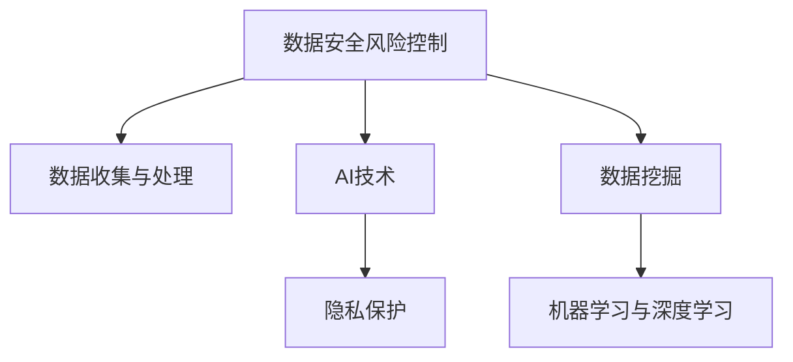

                 

# AI如何帮助电商企业进行用户数据安全风险控制

> 关键词：电商, 数据安全, 风险控制, AI, 机器学习, 隐私保护, 数据挖掘

## 1. 背景介绍

### 1.1 问题由来
随着电子商务的快速发展，商家对用户数据的依赖越来越深。用户数据不仅包括购物行为数据，还涵盖了用户个人信息、交易记录、浏览记录等敏感信息。然而，与此同时，用户数据的安全风险也日益突出。

> 举例说明：某电商平台的交易记录被黑客窃取，导致大量用户信息泄露，用户面临财产损失和隐私风险。

用户数据安全风险不仅给电商企业带来法律风险和信任危机，还可能导致业务损失和品牌声誉受损。因此，构建一个安全、可靠的数据安全风险控制系统变得至关重要。

### 1.2 问题核心关键点
构建一个有效的用户数据安全风险控制系统需要考虑以下几个核心关键点：

1. **数据收集与处理**：收集和整理来自用户和系统的数据，建立数据仓库。
2. **风险检测与评估**：利用AI技术识别和评估潜在的数据安全风险。
3. **风险响应与处置**：根据风险评估结果，采取相应的风险响应和处置措施。
4. **合规与审计**：确保数据处理和风险控制过程符合相关法律法规要求，并提供有效的审计和报告机制。

### 1.3 问题研究意义
研究用户数据安全风险控制系统，对于提升电商企业的合规性、保护用户隐私、保障业务安全和维护品牌声誉具有重要意义。

> 举例说明：通过构建强大的数据安全风险控制系统，某电商平台成功应对了多次黑客攻击，未出现数据泄露事件，获得了用户的信任和市场的认可。

此外，数据安全风险控制系统的构建也是推动电商企业智能化、自动化发展的重要驱动力。通过AI技术的应用，可以实现更加高效、智能的风险管理和决策支持。

## 2. 核心概念与联系

### 2.1 核心概念概述

为更好地理解用户数据安全风险控制系统的构建，本节将介绍几个密切相关的核心概念：

- **数据安全风险控制**：指通过技术手段识别和控制数据安全风险的过程，包括数据收集、存储、传输和使用各个环节的安全防护。
- **AI技术**：指基于机器学习、深度学习等技术，通过数据分析、模式识别和预测，辅助决策的系统。
- **隐私保护**：指在数据收集、处理和使用过程中，保障用户隐私权益的措施和技术。
- **数据挖掘**：指从大量数据中提取有用信息、模式和知识的过程，辅助决策和风险评估。
- **机器学习与深度学习**：指通过算法模型学习数据分布，进行数据预测、分类和聚类等任务。

这些核心概念之间的逻辑关系可以通过以下Mermaid流程图来展示：



这个流程图展示了几大核心概念之间的关联：

1. 数据安全风险控制需要依赖于数据收集与处理，数据质量是系统构建的基础。
2. 利用AI技术进行数据处理和风险评估，辅助决策和响应。
3. 数据挖掘与隐私保护是数据安全风险控制的重要组成部分，保障数据隐私和合法合规使用。
4. 机器学习与深度学习提供强大的分析能力，支持数据挖掘和风险评估的实现。

## 3. 核心算法原理 & 具体操作步骤

### 3.1 算法原理概述

用户数据安全风险控制系统利用AI技术进行风险识别、评估、响应和处置。其核心算法包括：

- **数据清洗与预处理**：通过清洗和预处理，提高数据质量，减少噪声。
- **异常检测**：利用机器学习算法，识别异常数据和行为。
- **风险评估**：通过深度学习模型，评估数据泄露和攻击的风险等级。
- **风险响应**：根据风险评估结果，采取相应措施，如数据备份、隔离、删除等。
- **数据审计与合规检查**：定期审计和检查数据处理和风险控制过程，确保合规。

### 3.2 算法步骤详解

用户数据安全风险控制系统的构建步骤如下：

**Step 1: 数据收集与处理**
- 收集来自用户、系统、第三方等多渠道的数据，建立数据仓库。
- 进行数据清洗和预处理，包括去重、填充缺失值、标准化等。
- 使用数据挖掘技术，发现数据之间的关联和模式。

**Step 2: 异常检测**
- 利用机器学习算法，如One-Class SVM、孤立森林等，检测数据中的异常点和行为。
- 对于检测到的异常点，进行进一步的分析，确认是否为风险点。

**Step 3: 风险评估**
- 使用深度学习模型，如卷积神经网络(CNN)、循环神经网络(RNN)等，对数据进行特征提取和建模。
- 通过训练数据集，学习数据分布和异常行为特征。
- 使用测试集验证模型性能，评估数据泄露和攻击的风险等级。

**Step 4: 风险响应**
- 根据风险评估结果，采取相应的风险响应措施，如数据备份、隔离、删除等。
- 对风险点进行隔离和监控，防止进一步泄露和攻击。

**Step 5: 数据审计与合规检查**
- 定期审计和检查数据处理和风险控制过程，确保合规性。
- 生成审计报告，提供对风险控制过程的可视化分析。

### 3.3 算法优缺点

用户数据安全风险控制系统利用AI技术进行风险检测和控制，具有以下优点：

1. **高效性**：AI算法可以快速处理和分析大量数据，提高风险识别和评估的效率。
2. **精确性**：利用深度学习等先进算法，提高风险检测和评估的准确性。
3. **自动化**：AI技术可以自动执行数据处理和风险响应过程，减少人工干预。
4. **实时性**：AI系统可以实现实时监控和响应，保障数据安全。

但同时也存在一些局限性：

1. **数据依赖性**：AI系统依赖高质量的数据进行训练，数据质量问题可能影响结果。
2. **复杂性**：AI系统构建和维护复杂，需要专业知识和技术支持。
3. **隐私问题**：AI系统可能涉及用户隐私数据的处理，需要严格遵守隐私保护法规。

### 3.4 算法应用领域

用户数据安全风险控制系统在多个领域具有广泛的应用，包括：

- **电子商务平台**：如淘宝、京东、Amazon等电商平台，通过AI技术进行交易异常检测、风险评估和处理。
- **金融服务**：如银行、支付平台，利用AI技术进行欺诈检测和防范。
- **医疗健康**：如医院、健康应用，保障患者隐私和数据安全。
- **物流管理**：如物流公司、供应链系统，进行数据安全和隐私保护。
- **社交网络**：如社交媒体平台，保护用户数据和隐私。

## 4. 数学模型和公式 & 详细讲解 & 举例说明

### 4.1 数学模型构建

用户数据安全风险控制系统涉及多个数学模型和算法，这里以异常检测和风险评估为例进行说明。

#### 异常检测
假设数据集为 $\mathcal{D}=\{(x_i,y_i)\}_{i=1}^N$，其中 $x_i$ 为输入特征，$y_i$ 为标签（正常/异常）。异常检测的目标是找到模型 $M_{\theta}$，使得 $M_{\theta}(x_i)$ 与 $y_i$ 尽可能接近。

对于异常检测，可以使用如下异常检测模型：

$$
M_{\theta}(x_i) = \theta^T f(x_i)
$$

其中 $f(x_i)$ 为特征映射函数，$\theta$ 为模型参数。常用的特征映射函数包括：

- 线性映射：$f(x_i) = \sum_{j=1}^d x_{ij}\theta_j$
- 多项式映射：$f(x_i) = \sum_{j=1}^d (x_{ij}+\theta_j)^k$
- 核函数映射：$f(x_i) = \phi(x_i)^T \phi(x_i)$

#### 风险评估
风险评估的目标是评估数据泄露和攻击的风险等级，可以使用如下风险评估模型：

$$
R_i = \sum_{j=1}^N w_j \cdot f_i(x_j)
$$

其中 $f_i(x_j)$ 为数据 $x_j$ 对数据点 $x_i$ 的风险贡献函数，$w_j$ 为权重向量。常用的风险评估模型包括：

- 集成学习：通过集成多个模型，提高风险评估的准确性。
- 深度学习：使用深度神经网络模型，对数据进行特征提取和建模。

### 4.2 公式推导过程

以异常检测为例，推导常用的一类异常检测模型：

假设数据集为 $\mathcal{D}=\{(x_i,y_i)\}_{i=1}^N$，其中 $x_i$ 为输入特征，$y_i$ 为标签（正常/异常）。异常检测的目标是找到模型 $M_{\theta}$，使得 $M_{\theta}(x_i)$ 与 $y_i$ 尽可能接近。

假设 $M_{\theta}$ 为线性异常检测模型，则有：

$$
M_{\theta}(x_i) = \theta^T x_i
$$

其中 $x_i$ 为特征向量，$\theta$ 为模型参数。对于每个数据点 $x_i$，其残差 $e_i$ 定义为：

$$
e_i = y_i - M_{\theta}(x_i)
$$

假设 $e_i$ 服从高斯分布，则异常检测可以通过统计学方法进行。假设数据中包含 $k$ 个异常点，异常点的位置未知，因此需要估计异常点的位置和权重。

可以采用EM算法求解，其目标函数为：

$$
\max_{\theta,\lambda} \sum_{i=1}^N \log p(y_i | M_{\theta}(x_i), \lambda)
$$

其中 $p(y_i | M_{\theta}(x_i), \lambda)$ 为残差 $e_i$ 的概率密度函数。

假设 $e_i$ 服从正态分布 $N(\mu,\sigma^2)$，则有：

$$
p(e_i | \mu,\sigma^2) = \frac{1}{\sqrt{2\pi\sigma^2}} \exp(-\frac{e_i^2}{2\sigma^2})
$$

将 $e_i$ 定义为残差，可以估计 $\mu$ 和 $\sigma^2$ 的参数，从而进行异常检测。

### 4.3 案例分析与讲解

假设某电商平台收集了用户的购物行为数据，用于异常检测和风险评估。具体步骤如下：

1. **数据收集与处理**
   - 收集用户的购物记录、浏览记录、交易记录等数据，建立数据仓库。
   - 对数据进行清洗和预处理，包括去重、填充缺失值、标准化等。

2. **异常检测**
   - 利用孤立森林算法，对数据进行异常检测，识别异常行为。
   - 对检测到的异常点，进行进一步的分析，确认是否为风险点。

3. **风险评估**
   - 使用卷积神经网络(CNN)模型，对数据进行特征提取和建模。
   - 通过训练数据集，学习数据分布和异常行为特征。
   - 使用测试集验证模型性能，评估数据泄露和攻击的风险等级。

4. **风险响应**
   - 根据风险评估结果，采取相应的风险响应措施，如数据备份、隔离、删除等。
   - 对风险点进行隔离和监控，防止进一步泄露和攻击。

## 5. 项目实践：代码实例和详细解释说明

### 5.1 开发环境搭建

在进行项目实践前，我们需要准备好开发环境。以下是使用Python进行Keras开发的环境配置流程：

1. 安装Anaconda：从官网下载并安装Anaconda，用于创建独立的Python环境。

2. 创建并激活虚拟环境：
```bash
conda create -n keras-env python=3.8 
conda activate keras-env
```

3. 安装Keras和相关依赖：
```bash
conda install keras
conda install tensorflow scikit-learn pandas numpy matplotlib
```

4. 安装TensorBoard：用于可视化模型训练过程。
```bash
pip install tensorboard
```

完成上述步骤后，即可在`keras-env`环境中开始项目实践。

### 5.2 源代码详细实现

这里以异常检测为例，给出使用Keras实现异常检测模型的代码实现。

首先，定义异常检测模型的函数：

```python
import numpy as np
from keras.models import Sequential
from keras.layers import Dense, Dropout
from keras.datasets import mnist
from keras.utils import to_categorical

def create_anomaly_detection_model(input_dim, hidden_units, dropout_rate, num_classes):
    model = Sequential()
    model.add(Dense(hidden_units, input_dim=input_dim, activation='relu'))
    model.add(Dropout(dropout_rate))
    model.add(Dense(hidden_units, activation='relu'))
    model.add(Dropout(dropout_rate))
    model.add(Dense(num_classes, activation='softmax'))
    return model
```

然后，加载和预处理数据集：

```python
# 加载数据集
(x_train, y_train), (x_test, y_test) = mnist.load_data()

# 数据预处理
x_train = x_train.reshape(-1, 784) / 255.0
x_test = x_test.reshape(-1, 784) / 255.0
y_train = to_categorical(y_train, num_classes=10)
y_test = to_categorical(y_test, num_classes=10)
```

接着，训练和评估模型：

```python
# 定义模型
model = create_anomaly_detection_model(input_dim=784, hidden_units=64, dropout_rate=0.5, num_classes=2)

# 编译模型
model.compile(optimizer='adam', loss='binary_crossentropy', metrics=['accuracy'])

# 训练模型
model.fit(x_train, y_train, batch_size=64, epochs=10, validation_data=(x_test, y_test))

# 评估模型
loss, accuracy = model.evaluate(x_test, y_test)
print(f"Test loss: {loss:.4f}, Test accuracy: {accuracy:.4f}")
```

以上就是使用Keras进行异常检测模型的代码实现。可以看到，Keras提供了丰富的深度学习模型和工具，使得模型构建和训练变得简洁高效。

### 5.3 代码解读与分析

让我们再详细解读一下关键代码的实现细节：

**create_anomaly_detection_model函数**：
- 定义了一个包含两个隐藏层和一个输出层的神经网络模型。
- 使用ReLU激活函数和Dropout正则化技术，防止过拟合。
- 输出层使用Softmax函数，进行二分类预测。

**数据预处理**：
- 对MNIST数据集进行去重、归一化、填充缺失值等预处理操作。
- 将标签转换为one-hot编码，以便模型处理。

**模型训练和评估**：
- 使用Adam优化器和二分类交叉熵损失函数进行模型训练。
- 在训练过程中，使用验证集进行模型性能评估。
- 最终在测试集上评估模型的准确率和损失。

## 6. 实际应用场景

### 6.1 电商平台异常检测

电商平台可以利用AI技术对用户的购物行为进行异常检测，识别可能存在风险的交易和行为。具体步骤如下：

1. **数据收集与处理**
   - 收集用户的购物记录、浏览记录、交易记录等数据，建立数据仓库。
   - 对数据进行清洗和预处理，包括去重、填充缺失值、标准化等。

2. **异常检测**
   - 利用机器学习算法，如孤立森林、支持向量机等，检测数据中的异常点和行为。
   - 对于检测到的异常点，进行进一步的分析，确认是否为风险点。

3. **风险评估**
   - 使用深度学习模型，如卷积神经网络(CNN)、循环神经网络(RNN)等，对数据进行特征提取和建模。
   - 通过训练数据集，学习数据分布和异常行为特征。
   - 使用测试集验证模型性能，评估数据泄露和攻击的风险等级。

4. **风险响应**
   - 根据风险评估结果，采取相应的风险响应措施，如数据备份、隔离、删除等。
   - 对风险点进行隔离和监控，防止进一步泄露和攻击。

### 6.2 金融服务欺诈检测

金融服务公司可以利用AI技术对客户的交易行为进行异常检测和欺诈防范。具体步骤如下：

1. **数据收集与处理**
   - 收集客户的交易记录、行为记录等数据，建立数据仓库。
   - 对数据进行清洗和预处理，包括去重、填充缺失值、标准化等。

2. **异常检测**
   - 利用机器学习算法，如孤立森林、K近邻等，检测数据中的异常点和行为。
   - 对于检测到的异常点，进行进一步的分析，确认是否为风险点。

3. **风险评估**
   - 使用深度学习模型，如卷积神经网络(CNN)、循环神经网络(RNN)等，对数据进行特征提取和建模。
   - 通过训练数据集，学习数据分布和异常行为特征。
   - 使用测试集验证模型性能，评估数据泄露和攻击的风险等级。

4. **风险响应**
   - 根据风险评估结果，采取相应的风险响应措施，如隔离、冻结账户等。
   - 对风险点进行监控和跟踪，防止进一步泄露和攻击。

## 7. 工具和资源推荐

### 7.1 学习资源推荐

为了帮助开发者系统掌握AI在电商用户数据安全风险控制中的应用，这里推荐一些优质的学习资源：

1. **《深度学习》课程**：斯坦福大学开设的深度学习课程，涵盖了深度学习的基本概念、算法和应用。
2. **《机器学习实战》书籍**：通俗易懂的机器学习入门书籍，介绍了常用的机器学习算法和应用实例。
3. **Kaggle竞赛平台**：参与Kaggle竞赛，学习实战经验，提升数据分析和模型构建能力。
4. **TensorFlow官方文档**：TensorFlow的官方文档，提供了丰富的API和样例代码，方便学习使用。
5. **Keras官方文档**：Keras的官方文档，介绍了Keras的API和样例代码，方便学习使用。

通过对这些资源的学习实践，相信你一定能够快速掌握AI在电商用户数据安全风险控制中的应用，并用于解决实际的电商数据安全问题。

### 7.2 开发工具推荐

高效的开发离不开优秀的工具支持。以下是几款用于电商用户数据安全风险控制开发的常用工具：

1. **TensorFlow**：基于Python的开源深度学习框架，支持分布式计算和GPU加速，适合大规模模型训练和应用。
2. **Keras**：基于TensorFlow和Theano的高层次深度学习API，提供简洁的API和丰富的模型构建工具。
3. **Pandas**：Python数据分析库，支持高效的数据处理和预处理。
4. **Scikit-learn**：Python机器学习库，提供丰富的机器学习算法和模型评估工具。
5. **TensorBoard**：TensorFlow配套的可视化工具，实时监测模型训练状态，提供丰富的图表呈现方式。

合理利用这些工具，可以显著提升电商用户数据安全风险控制开发的效率，加快创新迭代的步伐。

### 7.3 相关论文推荐

AI技术在电商用户数据安全风险控制中的应用，源于学界的持续研究。以下是几篇奠基性的相关论文，推荐阅读：

1. **《异常检测与机器学习》**：介绍异常检测的基本概念和常用算法，包括统计学方法、机器学习算法和深度学习算法。
2. **《深度学习在金融欺诈检测中的应用》**：利用深度学习模型进行金融欺诈检测的实践，详细介绍模型构建和训练过程。
3. **《基于KNN的电商用户行为异常检测》**：利用K近邻算法进行电商用户行为异常检测的实践，详细介绍数据处理和算法实现。

这些论文代表了大数据安全和风险控制技术的发展脉络。通过学习这些前沿成果，可以帮助研究者把握学科前进方向，激发更多的创新灵感。

## 8. 总结：未来发展趋势与挑战

### 8.1 总结

本文对AI如何帮助电商企业进行用户数据安全风险控制进行了全面系统的介绍。首先阐述了电商企业面临的数据安全风险问题，明确了AI技术在数据安全风险控制中的独特价值。其次，从原理到实践，详细讲解了AI技术在异常检测和风险评估中的应用，给出了电商数据安全风险控制系统的完整代码实例。同时，本文还广泛探讨了AI技术在电商数据安全风险控制中的应用前景，展示了AI技术的强大潜力。

通过本文的系统梳理，可以看到，AI技术在电商企业的数据安全风险控制中扮演着重要角色，极大地提升了电商企业的安全防护水平，保护了用户隐私和财产安全。未来，伴随AI技术的不断进步，用户数据安全风险控制系统将更加智能化、自动化，为电商企业提供更加高效、可靠的风险管理和决策支持。

### 8.2 未来发展趋势

展望未来，AI在电商用户数据安全风险控制领域将呈现以下几个发展趋势：

1. **智能化**：AI系统将变得更加智能化，能够自主学习、自主决策，提高风险控制的准确性和效率。
2. **自动化**：AI系统将实现自动化部署和监控，减少人工干预，提高系统的稳定性和可靠性。
3. **实时性**：AI系统将实现实时监控和响应，保障数据安全，防止数据泄露和攻击。
4. **融合性**：AI系统将与其他技术进行深度融合，如大数据分析、区块链等，提供更加全面的风险控制解决方案。
5. **可解释性**：AI系统将具备更好的可解释性，提高模型的透明性和可信度。
6. **多模态融合**：AI系统将融合多模态数据，提高风险评估的全面性和准确性。

以上趋势凸显了AI技术在电商企业用户数据安全风险控制中的广阔前景。这些方向的探索发展，必将进一步提升电商企业的安全防护水平，保护用户隐私和财产安全。

### 8.3 面临的挑战

尽管AI在电商用户数据安全风险控制中已经取得了瞩目成就，但在迈向更加智能化、自动化应用的过程中，它仍面临着诸多挑战：

1. **数据依赖性**：AI系统依赖高质量的数据进行训练，数据质量问题可能影响结果。
2. **算法复杂性**：AI系统构建和维护复杂，需要专业知识和技术支持。
3. **隐私问题**：AI系统可能涉及用户隐私数据的处理，需要严格遵守隐私保护法规。
4. **安全性**：AI系统可能存在算法漏洞和安全隐患，需要不断进行安全检测和修复。
5. **性能瓶颈**：AI系统在处理大规模数据时，可能面临计算资源和存储资源瓶颈，需要优化算法和模型结构。
6. **合规性**：AI系统需要符合相关法律法规要求，提供有效的审计和报告机制。

### 8.4 研究展望

面对AI在电商企业用户数据安全风险控制中面临的挑战，未来的研究需要在以下几个方面寻求新的突破：

1. **数据增强与预处理**：优化数据收集和预处理流程，提高数据质量，减少噪声。
2. **算法优化与融合**：优化算法模型，提高异常检测和风险评估的准确性，融合多模态数据，提高系统全面性。
3. **隐私保护与合规性**：加强隐私保护和合规性研究，保障用户隐私权益，符合法律法规要求。
4. **安全性提升**：加强安全性研究，优化模型结构，提高系统安全性和可靠性。
5. **实时性优化**：优化系统部署和监控，提高实时性和响应速度。

这些研究方向的探索，必将引领AI在电商用户数据安全风险控制技术迈向更高的台阶，为电商企业提供更加高效、可靠的风险管理和决策支持。总之，AI技术在未来电商用户数据安全风险控制中仍需不断优化和创新，以应对不断变化的安全需求和环境挑战。

## 9. 附录：常见问题与解答

**Q1：电商企业如何进行数据安全风险控制？**

A: 电商企业可以利用AI技术进行数据安全风险控制，具体步骤如下：

1. **数据收集与处理**：收集来自用户和系统的数据，建立数据仓库。对数据进行清洗和预处理，包括去重、填充缺失值、标准化等。

2. **异常检测**：利用机器学习算法，如孤立森林、K近邻等，检测数据中的异常点和行为。对于检测到的异常点，进行进一步的分析，确认是否为风险点。

3. **风险评估**：使用深度学习模型，如卷积神经网络(CNN)、循环神经网络(RNN)等，对数据进行特征提取和建模。通过训练数据集，学习数据分布和异常行为特征。使用测试集验证模型性能，评估数据泄露和攻击的风险等级。

4. **风险响应**：根据风险评估结果，采取相应的风险响应措施，如数据备份、隔离、删除等。对风险点进行隔离和监控，防止进一步泄露和攻击。

5. **数据审计与合规检查**：定期审计和检查数据处理和风险控制过程，确保合规性。生成审计报告，提供对风险控制过程的可视化分析。

**Q2：AI在电商数据安全风险控制中的优势是什么？**

A: AI在电商数据安全风险控制中具有以下优势：

1. **高效性**：AI算法可以快速处理和分析大量数据，提高风险识别和评估的效率。
2. **精确性**：利用深度学习等先进算法，提高风险检测和评估的准确性。
3. **自动化**：AI技术可以自动执行数据处理和风险响应过程，减少人工干预。
4. **实时性**：AI系统可以实现实时监控和响应，保障数据安全。
5. **智能性**：AI系统可以自主学习、自主决策，提高风险控制的准确性和效率。

**Q3：AI在电商数据安全风险控制中需要考虑哪些因素？**

A: AI在电商数据安全风险控制中需要考虑以下因素：

1. **数据质量**：高质量的数据是AI系统训练和评估的基础。需要确保数据完整性、准确性和一致性。
2. **算法选择**：根据具体任务选择适当的算法模型，如机器学习、深度学习等。
3. **模型训练**：选择合适的优化器和损失函数，避免过拟合和欠拟合。
4. **隐私保护**：确保数据处理和风险控制过程符合隐私保护法规，保护用户隐私权益。
5. **系统部署**：优化系统部署和监控，提高实时性和响应速度。
6. **合规性**：确保系统符合相关法律法规要求，提供有效的审计和报告机制。

**Q4：电商企业如何利用AI技术进行异常检测？**

A: 电商企业可以利用AI技术进行异常检测，具体步骤如下：

1. **数据收集与处理**：收集用户的购物记录、浏览记录、交易记录等数据，建立数据仓库。对数据进行清洗和预处理，包括去重、填充缺失值、标准化等。

2. **异常检测**：利用机器学习算法，如孤立森林、K近邻等，检测数据中的异常点和行为。对于检测到的异常点，进行进一步的分析，确认是否为风险点。

3. **风险评估**：使用深度学习模型，如卷积神经网络(CNN)、循环神经网络(RNN)等，对数据进行特征提取和建模。通过训练数据集，学习数据分布和异常行为特征。使用测试集验证模型性能，评估数据泄露和攻击的风险等级。

4. **风险响应**：根据风险评估结果，采取相应的风险响应措施，如数据备份、隔离、删除等。对风险点进行隔离和监控，防止进一步泄露和攻击。

5. **数据审计与合规检查**：定期审计和检查数据处理和风险控制过程，确保合规性。生成审计报告，提供对风险控制过程的可视化分析。

**Q5：AI在电商数据安全风险控制中的局限性是什么？**

A: AI在电商数据安全风险控制中存在以下局限性：

1. **数据依赖性**：AI系统依赖高质量的数据进行训练，数据质量问题可能影响结果。
2. **算法复杂性**：AI系统构建和维护复杂，需要专业知识和技术支持。
3. **隐私问题**：AI系统可能涉及用户隐私数据的处理，需要严格遵守隐私保护法规。
4. **安全性**：AI系统可能存在算法漏洞和安全隐患，需要不断进行安全检测和修复。
5. **性能瓶颈**：AI系统在处理大规模数据时，可能面临计算资源和存储资源瓶颈，需要优化算法和模型结构。
6. **合规性**：AI系统需要符合相关法律法规要求，提供有效的审计和报告机制。

---

作者：禅与计算机程序设计艺术 / Zen and the Art of Computer Programming

