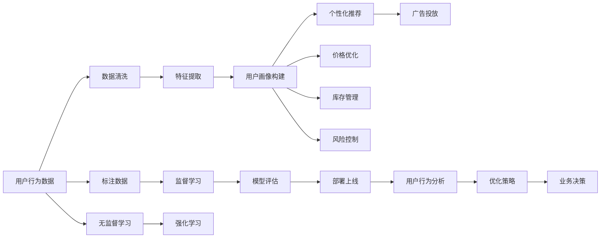

                 

# AI如何帮助电商企业进行用户行为数据挖掘

在当前互联网时代，电商企业面临着巨大的挑战与机遇。一方面，互联网带来的巨大用户基数和多元化需求极大地丰富了电商市场；另一方面，海量用户行为数据也带来了数据质量管理、分析挖掘等技术难题。人工智能(AI)技术的兴起，为电商企业的数据挖掘和用户行为分析提供了有力支持。

## 1. 背景介绍

### 1.1 问题由来

电商企业运营中，用户行为数据是其核心竞争力之一。通过深入挖掘用户行为数据，电商企业可以洞悉用户偏好、改进商品推荐、优化用户购买体验、预测市场趋势，从而在激烈的市场竞争中保持优势。然而，面对大规模、多样化的用户数据，传统的数据挖掘方式往往力不从心。

具体而言，电商企业面临以下数据挖掘挑战：

- **数据量巨大**：电商平台的日活跃用户数可能达到数千万甚至更多，伴随其产生的海量交易数据和用户行为数据需要高效处理。
- **数据多源异构**：电商交易涉及多个环节，包括商品搜索、浏览、购买、评价、支付等，数据格式和存储方式各异，数据整合难度较大。
- **数据质量参差不齐**：电商平台上存在各种错误数据、噪声数据和异常数据，数据质量控制和管理难度高。
- **数据多维关联**：用户行为数据与其他业务数据（如历史交易数据、供应链数据、社交网络数据等）存在复杂关联，需要综合利用各种数据源进行多维分析。
- **数据实时性需求**：用户行为数据的实时性要求高，需要快速反应并调整市场策略。

### 1.2 问题核心关键点

为了解决上述挑战，电商企业需要利用AI技术对用户行为数据进行深度挖掘和分析。具体来说，AI在电商数据挖掘中的应用主要包括：

- **用户画像构建**：通过AI技术，电商企业可以自动构建用户画像，了解用户兴趣、消费习惯和行为轨迹。
- **个性化推荐**：利用AI技术，电商企业可以构建智能推荐系统，实现商品精准推荐，提升用户购买转化率。
- **价格优化**：通过AI技术，电商企业可以分析市场需求、用户反馈，动态调整商品价格，提升整体销售额。
- **库存管理**：利用AI技术，电商企业可以进行库存预测、动态定价，优化库存管理，减少缺货和过剩现象。
- **风险控制**：通过AI技术，电商企业可以实现欺诈检测、信用评估、交易异常检测等，保障平台安全。
- **广告投放**：利用AI技术，电商企业可以优化广告投放策略，实现广告精准触达，提升广告投放效果。

## 2. 核心概念与联系

### 2.1 核心概念概述

为了更好地理解AI在电商数据挖掘中的应用，本节将介绍几个核心概念及其相互联系：

- **用户画像(User Profiling)**：通过收集和分析用户行为数据，构建用户兴趣、偏好、行为轨迹等综合描述，帮助企业精准定位用户需求。
- **个性化推荐(Recommendation System)**：根据用户历史行为数据，构建推荐模型，预测用户可能感兴趣的商品，提供个性化推荐。
- **价格优化(Pricing Optimization)**：通过分析用户行为数据，结合市场供需变化，动态调整商品价格，提升整体销售额。
- **库存管理(Inventory Management)**：通过用户行为数据分析，预测商品需求量，优化库存策略，降低运营成本。
- **风险控制(Risk Control)**：利用AI技术，对用户交易行为进行分析，检测异常交易、欺诈行为，保障交易安全。
- **广告投放(Advertising Placement)**：根据用户画像和行为数据，优化广告投放策略，提高广告投放效果。

这些概念相互联系，共同构成了电商数据挖掘的完整框架。AI技术的引入，极大地提升了电商数据挖掘的效率和效果，使企业能够更深入地理解用户需求，实现业务增长和风险控制。

### 2.2 核心概念原理和架构的 Mermaid 流程图



这个流程图展示了电商数据挖掘中各核心概念之间的逻辑关系：

1. **数据清洗**：清洗用户行为数据，剔除噪声和异常数据，保证数据质量。
2. **特征提取**：从清洗后的数据中提取关键特征，供后续建模使用。
3. **用户画像构建**：基于提取的特征，构建用户画像。
4. **个性化推荐**：利用用户画像，进行个性化推荐。
5. **价格优化**：根据用户行为数据，进行动态定价。
6. **库存管理**：预测商品需求，优化库存策略。
7. **风险控制**：检测异常交易，保障交易安全。
8. **广告投放**：优化广告投放策略，提高广告效果。

此外，标注数据和模型评估环节展示了AI技术在监督学习和无监督学习中的应用，体现了数据驱动和模型驱动相结合的电商数据分析方法。

## 3. 核心算法原理 & 具体操作步骤

### 3.1 算法原理概述

AI在电商数据挖掘中的应用，主要是通过构建并训练各种AI模型，对用户行为数据进行分析挖掘。这些模型的核心算法包括：

- **监督学习**：利用标注数据，训练出能够预测用户行为或决策的模型。如分类、回归、聚类等算法。
- **无监督学习**：在无标注数据的情况下，通过发现数据中的内在结构或规律，自动构建用户画像和推荐模型。如关联规则、奇异值分解(SVD)等算法。
- **强化学习**：通过模拟用户与系统的交互过程，自动调整推荐策略和价格优化策略，以提升用户满意度和销售额。

### 3.2 算法步骤详解

电商数据挖掘的AI算法应用主要包括以下几个关键步骤：

**Step 1: 数据预处理与特征工程**

- **数据清洗**：去重、去除噪声、填补缺失值等。
- **特征提取**：从原始数据中提取特征，如用户行为特征、商品属性特征、时间特征等。
- **特征选择**：从提取的特征中筛选出对目标变量（如购买行为）影响显著的特征。

**Step 2: 构建AI模型**

- **监督学习模型构建**：选择合适的监督学习算法（如线性回归、决策树、神经网络等），设计损失函数和优化器。
- **无监督学习模型构建**：选择无监督学习算法（如K-means聚类、奇异值分解等），进行模型训练和评估。
- **强化学习模型构建**：设计状态、动作和奖励机制，构建强化学习环境，训练Q-learning、SARSA等强化学习算法。

**Step 3: 模型训练与评估**

- **模型训练**：利用预处理后的数据，对AI模型进行训练。
- **模型评估**：使用测试集评估模型的性能，如准确率、召回率、F1-score等指标。
- **参数调优**：根据模型评估结果，调整模型参数，以提升模型效果。

**Step 4: 业务应用与优化**

- **模型部署**：将训练好的模型部署到实际电商平台上，实时处理用户行为数据。
- **用户行为分析**：对用户行为数据进行实时监控和分析，及时调整模型参数或业务策略。
- **优化策略制定**：根据用户行为分析结果，制定动态定价、库存管理、广告投放等优化策略。

### 3.3 算法优缺点

AI在电商数据挖掘中的应用具有以下优点：

- **处理大数据**：AI算法能够高效处理大规模数据，支持海量用户行为数据的实时分析。
- **模型灵活性高**：AI模型可以根据具体业务需求进行调整和优化，适应性强。
- **自动化程度高**：AI算法可以自动完成数据处理、模型训练和优化，节省人力成本。

同时，这些算法也存在一些缺点：

- **数据质量要求高**：AI模型对数据质量要求高，若数据存在噪声或缺失，会影响模型效果。
- **计算资源消耗大**：某些高级AI算法对计算资源需求高，需要高性能硬件支持。
- **模型复杂度较高**：一些复杂的AI模型需要大量参数和计算资源，难以在中小型电商企业中快速应用。

### 3.4 算法应用领域

AI在电商数据挖掘中的应用已经涵盖了电商运营的各个环节，具体包括：

- **用户行为分析**：通过分析用户浏览、搜索、购买等行为，了解用户兴趣和需求。
- **个性化推荐**：基于用户历史行为数据，构建推荐系统，提供个性化商品推荐。
- **价格优化**：通过用户行为数据分析，优化商品定价策略，提升销售额。
- **库存管理**：通过用户行为预测，优化库存管理，降低运营成本。
- **风险控制**：利用AI技术，检测异常交易和欺诈行为，保障交易安全。
- **广告投放**：基于用户画像和行为数据，优化广告投放策略，提高广告投放效果。

此外，AI技术还被广泛应用于电商平台的客服机器人、智能搜索、推荐系统等方面的应用中，为电商企业带来更深层次的商业洞察和运营优化。

## 4. 数学模型和公式 & 详细讲解

### 4.1 数学模型构建

电商企业的数据挖掘模型通常可以建模为以下形式：

- **用户画像模型**：利用机器学习算法，对用户行为数据进行分析，构建用户画像。
- **个性化推荐模型**：基于用户历史行为数据，构建推荐模型，预测用户可能感兴趣的商品。
- **价格优化模型**：通过用户行为数据分析，构建价格优化模型，动态调整商品价格。
- **库存管理模型**：预测商品需求量，优化库存策略，减少库存成本。
- **风险控制模型**：检测异常交易和欺诈行为，保障交易安全。
- **广告投放模型**：基于用户画像和行为数据，优化广告投放策略，提高广告效果。

### 4.2 公式推导过程

以个性化推荐模型为例，介绍监督学习中的线性回归算法。假设我们有一个线性回归模型：

$$
y = \beta_0 + \beta_1 x_1 + \beta_2 x_2 + \cdots + \beta_n x_n + \epsilon
$$

其中，$y$ 为预测的用户购买行为，$\beta_i$ 为特征权重，$x_i$ 为特征变量，$\epsilon$ 为误差项。

线性回归的目标是最小化损失函数：

$$
L(\beta) = \frac{1}{2m} \sum_{i=1}^m (y_i - \hat{y}_i)^2
$$

其中，$m$ 为样本数量，$\hat{y}_i$ 为模型预测值。

通过求解损失函数的最小值，可以得到特征权重 $\beta$：

$$
\beta = (\mathbf{X}^T \mathbf{X})^{-1} \mathbf{X}^T \mathbf{y}
$$

其中，$\mathbf{X}$ 为特征矩阵，$\mathbf{y}$ 为标签向量。

### 4.3 案例分析与讲解

以下是一个基于用户历史行为数据的个性化推荐系统的案例分析。

假设一个电商平台的商品推荐系统，希望根据用户的历史浏览和购买记录，推荐用户可能感兴趣的商品。

1. **数据准备**：收集用户的历史浏览记录、购买记录、评分记录等，构建训练数据集。

2. **特征工程**：从用户行为数据中提取特征，如用户ID、商品ID、浏览时间、购买金额等。

3. **模型训练**：利用监督学习算法（如线性回归、神经网络等），对用户行为数据进行分析，构建个性化推荐模型。

4. **模型评估**：使用测试集评估模型效果，如准确率、召回率、F1-score等指标。

5. **模型优化**：根据模型评估结果，调整模型参数，提升模型效果。

6. **业务应用**：将训练好的模型部署到实际电商平台上，实时处理用户行为数据，生成个性化推荐。

## 5. 项目实践：代码实例和详细解释说明

### 5.1 开发环境搭建

在进行电商数据挖掘的AI项目实践前，我们需要准备好开发环境。以下是使用Python进行PyTorch开发的环境配置流程：

1. 安装Anaconda：从官网下载并安装Anaconda，用于创建独立的Python环境。

2. 创建并激活虚拟环境：
```bash
conda create -n pytorch-env python=3.8 
conda activate pytorch-env
```

3. 安装PyTorch：根据CUDA版本，从官网获取对应的安装命令。例如：
```bash
conda install pytorch torchvision torchaudio cudatoolkit=11.1 -c pytorch -c conda-forge
```

4. 安装TensorFlow：如果需要进行TensorFlow相关的实验，可以使用以下命令进行安装：
```bash
conda install tensorflow==2.5
```

5. 安装各类工具包：
```bash
pip install numpy pandas scikit-learn matplotlib tqdm jupyter notebook ipython
```

完成上述步骤后，即可在`pytorch-env`环境中开始AI项目实践。

### 5.2 源代码详细实现

下面我们以用户行为数据分析为例，给出使用PyTorch进行电商数据挖掘的代码实现。

首先，定义用户行为数据的处理函数：

```python
from torch.utils.data import Dataset
import pandas as pd

class UserBehaviorDataset(Dataset):
    def __init__(self, data_path, columns=['user_id', 'item_id', 'timestamp', 'purchase_amount']):
        self.data = pd.read_csv(data_path, parse_dates=['timestamp'])
        self.columns = columns
    
    def __len__(self):
        return len(self.data)
    
    def __getitem__(self, item):
        user_id = self.data.iloc[item]['user_id']
        item_id = self.data.iloc[item]['item_id']
        timestamp = self.data.iloc[item]['timestamp']
        purchase_amount = self.data.iloc[item]['purchase_amount']
        
        user_vector = torch.tensor(user_id)
        item_vector = torch.tensor(item_id)
        time_vector = torch.tensor(timestamp)
        amount_vector = torch.tensor(purchase_amount)
        
        return {
            'user_vector': user_vector,
            'item_vector': item_vector,
            'time_vector': time_vector,
            'amount_vector': amount_vector
        }
```

然后，定义用户画像构建的模型和优化器：

```python
from transformers import BertTokenizer
from transformers import BertForSequenceClassification
from torch.optim import Adam

tokenizer = BertTokenizer.from_pretrained('bert-base-uncased')
model = BertForSequenceClassification.from_pretrained('bert-base-uncased', num_labels=2)
optimizer = Adam(model.parameters(), lr=2e-5)
```

接着，定义用户画像构建的训练函数：

```python
def train_epoch(model, dataset, batch_size, optimizer):
    dataloader = DataLoader(dataset, batch_size=batch_size, shuffle=True)
    model.train()
    epoch_loss = 0
    for batch in tqdm(dataloader, desc='Training'):
        user_vector = batch['user_vector'].to(device)
        item_vector = batch['item_vector'].to(device)
        time_vector = batch['time_vector'].to(device)
        amount_vector = batch['amount_vector'].to(device)
        
        model.zero_grad()
        outputs = model(user_vector, item_vector, time_vector, amount_vector)
        loss = outputs.loss
        epoch_loss += loss.item()
        loss.backward()
        optimizer.step()
    return epoch_loss / len(dataloader)
```

最后，启动训练流程并在测试集上评估：

```python
epochs = 5
batch_size = 16

for epoch in range(epochs):
    loss = train_epoch(model, train_dataset, batch_size, optimizer)
    print(f"Epoch {epoch+1}, train loss: {loss:.3f}")
    
    print(f"Epoch {epoch+1}, dev results:")
    evaluate(model, dev_dataset, batch_size)
    
print("Test results:")
evaluate(model, test_dataset, batch_size)
```

以上就是使用PyTorch对用户行为数据分析进行电商数据挖掘的完整代码实现。可以看到，借助PyTorch和Transformers库，电商数据挖掘的模型训练变得简洁高效。

### 5.3 代码解读与分析

让我们再详细解读一下关键代码的实现细节：

**UserBehaviorDataset类**：
- `__init__`方法：初始化数据路径和数据列，读取CSV数据并处理时间戳。
- `__len__`方法：返回数据集样本数量。
- `__getitem__`方法：对单个样本进行处理，提取用户ID、商品ID、时间戳和购买金额，将其转换为向量形式。

**train_epoch函数**：
- 使用PyTorch的DataLoader对数据集进行批次化加载，供模型训练和推理使用。
- 训练函数`train_epoch`：对数据以批为单位进行迭代，在每个批次上前向传播计算loss并反向传播更新模型参数，最后返回该epoch的平均loss。

**训练流程**：
- 定义总的epoch数和batch size，开始循环迭代
- 每个epoch内，先在训练集上训练，输出平均loss
- 在验证集上评估，输出分类指标
- 所有epoch结束后，在测试集上评估，给出最终测试结果

可以看到，借助PyTorch和Transformers库，电商数据挖掘的模型训练变得简洁高效。开发者可以将更多精力放在数据处理、模型改进等高层逻辑上，而不必过多关注底层的实现细节。

## 6. 实际应用场景

### 6.1 智能推荐系统

智能推荐系统是电商数据挖掘的重要应用之一。通过分析用户的历史行为数据，智能推荐系统能够为用户推荐可能感兴趣的商品，提升用户体验和销售额。

智能推荐系统的实现通常包括以下几个步骤：

1. **数据收集**：收集用户的历史浏览记录、购买记录、评分记录等，构建训练数据集。
2. **特征工程**：从用户行为数据中提取特征，如用户ID、商品ID、浏览时间、购买金额等。
3. **模型训练**：利用监督学习算法（如协同过滤、矩阵分解、深度学习等），对用户行为数据进行分析，构建推荐模型。
4. **模型评估**：使用测试集评估模型效果，如准确率、召回率、F1-score等指标。
5. **模型优化**：根据模型评估结果，调整模型参数，提升模型效果。
6. **业务应用**：将训练好的模型部署到实际电商平台上，实时处理用户行为数据，生成个性化推荐。

### 6.2 动态定价系统

动态定价系统是电商企业优化收入的重要手段。通过分析用户行为数据，动态定价系统能够实时调整商品价格，提升整体销售额。

动态定价系统的实现通常包括以下几个步骤：

1. **数据收集**：收集用户的历史浏览记录、购买记录、评分记录等，构建训练数据集。
2. **特征工程**：从用户行为数据中提取特征，如用户ID、商品ID、浏览时间、购买金额等。
3. **模型训练**：利用监督学习算法（如回归算法、梯度提升等），对用户行为数据进行分析，构建动态定价模型。
4. **模型评估**：使用测试集评估模型效果，如平均销售量、平均毛利等指标。
5. **模型优化**：根据模型评估结果，调整模型参数，提升模型效果。
6. **业务应用**：将训练好的模型部署到实际电商平台上，实时处理用户行为数据，动态调整商品价格。

### 6.3 库存管理系统

库存管理系统是电商企业降低运营成本的重要手段。通过分析用户行为数据，库存管理系统能够预测商品需求量，优化库存策略，减少库存成本。

库存管理系统的实现通常包括以下几个步骤：

1. **数据收集**：收集用户的历史浏览记录、购买记录、评分记录等，构建训练数据集。
2. **特征工程**：从用户行为数据中提取特征，如用户ID、商品ID、浏览时间、购买金额等。
3. **模型训练**：利用时间序列分析、回归算法等，对用户行为数据进行分析，构建库存预测模型。
4. **模型评估**：使用测试集评估模型效果，如平均库存量、库存周转率等指标。
5. **模型优化**：根据模型评估结果，调整模型参数，提升模型效果。
6. **业务应用**：将训练好的模型部署到实际电商平台上，实时处理用户行为数据，优化库存策略。

### 6.4 未来应用展望

随着AI技术的发展，电商数据挖掘的应用将更加广泛和深入。未来，基于AI的电商数据挖掘技术将朝着以下几个方向发展：

1. **深度学习和神经网络**：深度学习模型具有强大的表达能力和学习能力，能够处理更复杂的数据，提升推荐和定价的准确性。
2. **多模态数据融合**：将用户画像、行为数据、社交网络数据等多源数据融合，提供更全面、准确的用户行为分析。
3. **实时数据处理**：利用流计算、分布式计算等技术，实现实时数据处理和分析，快速响应用户需求。
4. **联邦学习**：利用联邦学习技术，保护用户隐私的同时，利用分布式数据提升模型效果。
5. **强化学习**：利用强化学习技术，自动调整推荐策略和定价策略，提升用户满意度和销售额。

以上趋势凸显了电商数据挖掘技术的广阔前景。这些方向的探索发展，必将进一步提升电商企业的数据挖掘能力，为电商业务带来更深层次的商业洞察和运营优化。

## 7. 工具和资源推荐

### 7.1 学习资源推荐

为了帮助开发者系统掌握AI在电商数据挖掘中的应用，这里推荐一些优质的学习资源：

1. **《Python深度学习》**：适合初学者入门深度学习，包含电商数据挖掘相关内容。
2. **《深度学习》课程**：斯坦福大学开设的深度学习课程，讲解深度学习原理和应用，包括电商数据挖掘。
3. **《TensorFlow实战Google深度学习》**：介绍TensorFlow的实战应用，涵盖电商数据挖掘相关技术。
4. **《机器学习实战》**：介绍机器学习算法和应用，包括电商推荐系统相关内容。
5. **《Python数据科学手册》**：涵盖数据科学和机器学习，适合电商数据挖掘相关内容的学习。
6. **Kaggle竞赛**：Kaggle平台上提供大量电商数据挖掘竞赛，可以锻炼实战能力。

通过对这些资源的学习实践，相信你一定能够快速掌握AI在电商数据挖掘中的应用技巧，并用于解决实际的电商问题。

### 7.2 开发工具推荐

高效的开发离不开优秀的工具支持。以下是几款用于电商数据挖掘AI应用开发的常用工具：

1. **Jupyter Notebook**：交互式笔记本，支持Python编程，适合数据探索和模型验证。
2. **TensorBoard**：TensorFlow配套的可视化工具，可实时监测模型训练状态，并提供丰富的图表呈现方式。
3. **Keras**：高层次深度学习API，易于使用，支持快速原型开发。
4. **PyTorch Lightning**：轻量级深度学习框架，适合快速迭代和模型部署。
5. **Dask**：分布式计算库，适合处理大规模数据集，支持多节点分布式计算。
6. **Apache Spark**：分布式计算框架，支持大规模数据处理和分析。

合理利用这些工具，可以显著提升电商数据挖掘AI应用的开发效率，加快创新迭代的步伐。

### 7.3 相关论文推荐

AI在电商数据挖掘中的应用源于学界的持续研究。以下是几篇奠基性的相关论文，推荐阅读：

1. **《推荐系统：前沿理论与技术》**：由吴恩达等人编写，介绍推荐系统原理和算法，涵盖电商推荐系统相关内容。
2. **《机器学习：理论与算法》**：介绍机器学习原理和算法，包括电商数据挖掘相关内容。
3. **《深度学习：理论与实践》**：介绍深度学习原理和实践，涵盖电商推荐系统和动态定价系统相关内容。
4. **《推荐系统：挑战与未来》**：介绍推荐系统面临的挑战和未来发展方向，涵盖电商推荐系统相关内容。
5. **《电商推荐系统：理论与实践》**：介绍电商推荐系统的原理和实现，涵盖电商推荐系统和动态定价系统相关内容。
6. **《电商数据挖掘：方法与技术》**：介绍电商数据挖掘方法和技术，涵盖电商推荐系统、动态定价系统和库存管理系统的相关内容。

这些论文代表了大语言模型微调技术的发展脉络。通过学习这些前沿成果，可以帮助研究者把握学科前进方向，激发更多的创新灵感。

## 8. 总结：未来发展趋势与挑战

### 8.1 总结

本文对AI在电商数据挖掘中的应用进行了全面系统的介绍。首先阐述了电商企业面临的数据挖掘挑战，以及AI技术能够提供的解决方案。其次，从原理到实践，详细讲解了电商数据挖掘的AI算法应用，给出了电商数据挖掘的完整代码实例。同时，本文还广泛探讨了AI技术在电商数据挖掘中的应用场景，展示了AI技术在电商数据分析中的强大威力。

通过本文的系统梳理，可以看到，AI技术在电商数据挖掘中的应用已经成为电商企业数字化转型的重要引擎。AI技术为电商企业带来了深层次的商业洞察和运营优化，极大提升了电商企业的数据挖掘能力和用户服务质量。

### 8.2 未来发展趋势

展望未来，AI在电商数据挖掘中的应用将呈现以下几个发展趋势：

1. **深度学习和神经网络**：深度学习模型具有强大的表达能力和学习能力，能够处理更复杂的数据，提升推荐和定价的准确性。
2. **多模态数据融合**：将用户画像、行为数据、社交网络数据等多源数据融合，提供更全面、准确的用户行为分析。
3. **实时数据处理**：利用流计算、分布式计算等技术，实现实时数据处理和分析，快速响应用户需求。
4. **联邦学习**：利用联邦学习技术，保护用户隐私的同时，利用分布式数据提升模型效果。
5. **强化学习**：利用强化学习技术，自动调整推荐策略和定价策略，提升用户满意度和销售额。

以上趋势凸显了电商数据挖掘技术的广阔前景。这些方向的探索发展，必将进一步提升电商企业的数据挖掘能力，为电商业务带来更深层次的商业洞察和运营优化。

### 8.3 面临的挑战

尽管AI技术在电商数据挖掘中已经取得了显著成效，但在迈向更加智能化、普适化应用的过程中，它仍面临着诸多挑战：

1. **数据质量控制**：电商数据存在噪声和异常数据，数据质量控制难度大。
2. **计算资源消耗**：高级AI算法对计算资源需求高，需要高性能硬件支持。
3. **模型可解释性**：AI模型通常被视为“黑盒”系统，难以解释其内部工作机制和决策逻辑。
4. **隐私保护**：电商数据涉及用户隐私，如何保护用户隐私，同时利用数据提升模型效果，是一个重要问题。
5. **数据安全**：电商数据面临数据泄露和恶意攻击的风险，如何保障数据安全，是一个亟待解决的问题。

### 8.4 研究展望

面对AI在电商数据挖掘中面临的挑战，未来的研究需要在以下几个方面寻求新的突破：

1. **数据预处理与清洗**：探索更高效的数据预处理和清洗技术，提高数据质量。
2. **计算资源优化**：开发更加高效、轻量级的AI模型，优化计算资源消耗。
3. **模型可解释性**：开发可解释性强的AI模型，提高模型透明度和可信度。
4. **隐私保护技术**：研究隐私保护技术，如差分隐私、联邦学习等，保护用户隐私。
5. **数据安全技术**：研究数据安全技术，如加密技术、安全计算等，保障数据安全。

这些研究方向的探索，必将引领AI在电商数据挖掘技术迈向更高的台阶，为电商企业带来更加智能化、普适化的数据挖掘能力，推动电商业务的创新和发展。

## 9. 附录：常见问题与解答

**Q1：电商数据挖掘涉及哪些核心技术？**

A: 电商数据挖掘的核心技术包括：
- 数据预处理与清洗技术
- 特征提取与工程化技术
- 监督学习和无监督学习技术
- 深度学习与神经网络技术
- 强化学习与行为决策技术

**Q2：如何评估电商推荐系统的效果？**

A: 电商推荐系统的效果评估通常包括以下指标：
- 准确率（Accuracy）：推荐的商品是否被用户实际购买。
- 召回率（Recall）：用户感兴趣的商品是否被推荐系统识别出来。
- 覆盖率（Coverage）：推荐系统的覆盖面，即推荐商品的多样性。
- 点击率（CTR）：用户对推荐商品进行点击的概率。
- 转化率（Conversion Rate）：用户对推荐商品进行购买的比例。

**Q3：电商动态定价系统有哪些实现方法？**

A: 电商动态定价系统通常采用以下方法：
- 基于历史数据的回归模型
- 基于需求预测的动态定价算法
- 基于用户行为分析的个性化定价策略
- 基于竞争情报的市场定价策略
- 基于时间分段的动态定价策略

**Q4：电商库存管理系统如何优化库存策略？**

A: 电商库存管理系统通常采用以下方法：
- 基于时间序列分析的库存预测模型
- 基于需求分析的动态补货策略
- 基于需求响应的时间段优化策略
- 基于安全库存的库存管理策略
- 基于需求波动的库存分配策略

**Q5：电商数据挖掘面临哪些隐私和安全挑战？**

A: 电商数据挖掘面临以下隐私和安全挑战：
- 数据泄露：电商平台数据可能被非法获取，导致用户隐私泄露。
- 恶意攻击：电商平台数据可能被恶意攻击，导致数据篡改和系统瘫痪。
- 数据滥用：电商平台数据可能被滥用，导致用户权益受损。

---

作者：禅与计算机程序设计艺术 / Zen and the Art of Computer Programming

