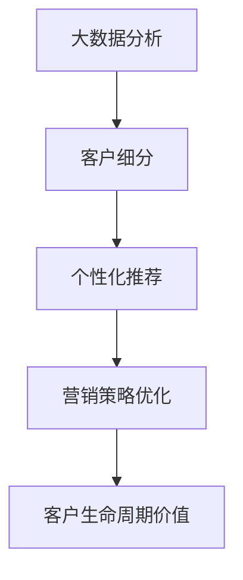

                 

# AI如何通过大数据分析优化电商运营

> 关键词：大数据分析,电商运营,机器学习,数据挖掘,客户细分,个性化推荐,营销策略

## 1. 背景介绍

### 1.1 问题由来
在互联网的驱动下，电子商务已成为现代零售行业的重要组成部分。电商平台的日活用户数、订单量等关键指标不断攀升，用户体验和运营效率成为平台竞争的焦点。大数据分析技术在电商运营中的应用日益广泛，成为优化电商业务、提升用户体验的关键手段。

### 1.2 问题核心关键点
大数据分析技术在电商运营中的应用，主要包括客户细分、个性化推荐、营销策略优化等方面。通过数据挖掘和机器学习，电商平台能够更好地理解用户需求，实现精准推荐，提高用户满意度和销售额。

### 1.3 问题研究意义
研究基于大数据分析的电商运营优化方法，对于拓展电商平台的业务范围，提升用户体验，增强平台竞争力，具有重要意义：

1. 提升用户体验：通过数据驱动的个性化推荐和定制化服务，电商平台的客户满意度将显著提升，减少客户流失率，增加复购率。
2. 优化营销策略：基于大数据分析的精准投放，能够提高广告和促销活动的投资回报率，降低营销成本。
3. 提升运营效率：通过分析销售数据，电商平台能够实时调整库存、物流、客服等运营策略，提高运营效率，降低运营成本。
4. 增强竞争力：通过深入分析用户行为数据，电商平台可以更好地应对市场变化，持续创新，占据行业领先地位。
5. 数据驱动决策：大数据分析使电商平台的决策过程更加透明、客观，提升决策的科学性和准确性。

## 2. 核心概念与联系

### 2.1 核心概念概述

为更好地理解基于大数据分析的电商运营优化方法，本节将介绍几个密切相关的核心概念：

- 大数据分析(Big Data Analytics)：指通过数据挖掘、统计分析等技术，从海量数据中提取有价值信息的过程。
- 客户细分(Customer Segmentation)：根据用户属性、行为、需求等特征，将用户划分为不同群体，实现精准营销。
- 个性化推荐(Personalized Recommendation)：通过分析用户历史行为、偏好等数据，推荐用户可能感兴趣的商品或服务，提高用户满意度。
- 营销策略优化(Marketing Strategy Optimization)：基于数据分析结果，优化广告投放、促销活动等营销手段，提升投资回报率。
- 客户生命周期价值(Customer Lifetime Value, CLV)：通过分析用户生命周期内的购买行为、流失风险等数据，评估客户的长期价值，指导客户关系管理。

这些核心概念之间的逻辑关系可以通过以下Mermaid流程图来展示：



这个流程图展示了大数据分析在电商运营中的核心应用场景：

1. 通过大数据分析，识别并细分用户群体，实现精准营销。
2. 基于用户数据，进行个性化推荐，提高用户满意度。
3. 通过分析营销数据，优化营销策略，提升投资回报率。
4. 评估客户长期价值，指导客户关系管理。

这些概念共同构成了大数据分析在电商运营中的应用框架，使其能够更好地服务于电商平台的用户和业务。

## 3. 核心算法原理 & 具体操作步骤
### 3.1 算法原理概述

基于大数据分析的电商运营优化，本质上是一个数据驱动的决策优化过程。其核心思想是：利用海量用户数据，通过数据挖掘和机器学习技术，发现隐藏在数据中的规律，形成商业洞察，指导电商平台的运营决策。

形式化地，假设电商平台的数据集为 $D=\{(x_i,y_i)\}_{i=1}^N$，其中 $x_i$ 为用户行为数据，$y_i$ 为目标变量（如购买行为、流失概率等）。电商运营优化的目标是最小化预测误差，即找到最优模型 $\theta$，使得：

$$
\hat{\theta}=\mathop{\arg\min}_{\theta} \mathcal{L}(\theta,D)
$$

其中 $\mathcal{L}$ 为损失函数，用于衡量模型预测输出与真实标签之间的差异。常见的损失函数包括均方误差、交叉熵等。

通过梯度下降等优化算法，运营优化过程不断更新模型参数 $\theta$，最小化损失函数 $\mathcal{L}$，使得模型预测能够逼近真实标签。由于 $\theta$ 已经通过数据分析获得了初步的模型形式，因此即便是在小样本条件下，也可以较快收敛到理想的模型参数 $\hat{\theta}$。

### 3.2 算法步骤详解

基于大数据分析的电商运营优化一般包括以下几个关键步骤：

**Step 1: 数据收集与预处理**
- 收集电商平台的用户行为数据，如浏览历史、购买记录、点击率、搜索词等。
- 对数据进行清洗、去重、归一化等预处理，确保数据质量和一致性。

**Step 2: 特征工程与特征选择**
- 通过数据探索和分析，选择合适的特征，并构建特征向量。
- 使用降维技术如PCA、LDA等，减少特征维度，提高模型泛化能力。

**Step 3: 建立预测模型**
- 选择合适的预测模型，如线性回归、逻辑回归、决策树、随机森林等。
- 根据电商业务需求，设计合理的损失函数，如均方误差、交叉熵等。

**Step 4: 模型训练与评估**
- 使用电商平台的标注数据集，训练预测模型。
- 在验证集上评估模型性能，选择最优的超参数组合，如学习率、正则化系数等。
- 根据评估结果，调整模型参数，进行迭代训练，直至达到预期效果。

**Step 5: 应用与迭代**
- 将训练好的模型应用于电商平台的决策优化中，进行个性化推荐、客户细分、营销策略优化等。
- 定期重新收集和标注数据，对模型进行重新训练和优化，提升预测准确率。

以上是基于大数据分析的电商运营优化的一般流程。在实际应用中，还需要根据具体业务需求，对各个环节进行优化设计，如改进特征提取方法，引入更多的正则化技术，搜索最优的超参数组合等，以进一步提升模型性能。

### 3.3 算法优缺点

基于大数据分析的电商运营优化方法具有以下优点：
1. 数据驱动决策。通过分析用户行为数据，形成精准的商业洞察，指导电商平台的运营决策。
2. 精准营销。基于用户细分和个性化推荐，实现精准营销，提升用户满意度和销售额。
3. 提升运营效率。通过分析销售数据，实时调整库存、物流、客服等运营策略，提高运营效率。
4. 客户关系管理。评估客户生命周期价值，指导客户关系管理，提升客户忠诚度。
5. 投资回报率高。基于数据分析的精准投放，提高广告和促销活动的投资回报率。

同时，该方法也存在一定的局限性：
1. 数据质量要求高。电商平台的运营数据质量直接影响到模型的预测准确率，需要定期维护和清洗。
2. 模型复杂度高。电商平台的运营数据复杂多样，需要进行复杂的特征工程和模型选择。
3. 技术门槛高。大数据分析和机器学习技术的应用，需要一定的技术积累和团队支持。
4. 数据隐私问题。电商平台的运营数据涉及用户隐私，需要严格的数据保护和隐私合规。

尽管存在这些局限性，但就目前而言，基于大数据分析的电商运营优化方法仍是最主流的数据驱动决策范式。未来相关研究的重点在于如何进一步降低数据分析的技术门槛，提高模型的可解释性和鲁棒性，同时兼顾数据隐私和用户权益。

### 3.4 算法应用领域

基于大数据分析的电商运营优化方法，在电商领域已经得到了广泛的应用，覆盖了几乎所有常见业务场景，例如：

- 客户细分：根据用户行为数据，将用户分为高价值、中价值、低价值等群体，实现精准营销。
- 个性化推荐：分析用户历史行为、浏览记录等，推荐用户可能感兴趣的商品，提升用户满意度。
- 营销策略优化：通过分析广告点击、转化率等数据，优化广告投放策略，提高投资回报率。
- 库存管理：分析销售趋势，优化库存策略，降低缺货和滞销风险。
- 物流优化：分析订单地理位置、物流效率等数据，优化物流路径和配送策略，提高配送速度和降低成本。
- 客服自动化：通过分析客户咨询历史和行为数据，实现智能客服，提高客户体验。

除了上述这些经典场景外，大数据分析还在电商领域催生了更多创新应用，如风险管理、信用评估、商品定价等，为电商平台带来了新的商业机会。

## 4. 数学模型和公式 & 详细讲解 & 举例说明
### 4.1 数学模型构建

本节将使用数学语言对基于大数据分析的电商运营优化过程进行更加严格的刻画。

假设电商平台的用户行为数据为 $X=\{x_i\}_{i=1}^N$，其中 $x_i$ 为第 $i$ 个用户的特征向量，包含浏览历史、购买记录、点击率等。目标变量为 $Y=\{y_i\}_{i=1}^N$，其中 $y_i$ 表示用户是否购买某商品（0表示不购买，1表示购买）。

定义电商运营优化的损失函数为：

$$
\mathcal{L}(\theta)=\frac{1}{N}\sum_{i=1}^N \ell(y_i,f(x_i;\theta))
$$

其中 $\ell$ 为损失函数，如二分类交叉熵损失；$f(x;\theta)$ 为预测模型，通常为逻辑回归或深度神经网络。

在获得数据集 $D=\{(x_i,y_i)\}_{i=1}^N$ 后，我们可以通过以下步骤构建电商运营优化的数学模型：

1. 数据预处理：对数据进行清洗、归一化等处理，确保数据质量和一致性。
2. 特征选择与提取：根据电商业务需求，选择合适的特征，构建特征向量 $x_i$。
3. 模型训练：使用标注数据集 $D$ 训练预测模型 $f(x;\theta)$。
4. 模型评估与优化：在验证集上评估模型性能，选择最优的超参数组合，如学习率、正则化系数等。
5. 模型应用与迭代：将训练好的模型应用于电商平台的决策优化中，进行个性化推荐、客户细分、营销策略优化等。

### 4.2 公式推导过程

以下我们以二分类任务为例，推导逻辑回归模型的损失函数及其梯度计算公式。

假设电商平台预测用户是否购买某商品的逻辑回归模型为 $f(x;\theta)=\text{sigmoid}(X\theta)$，其中 $\theta$ 为模型参数。则二分类交叉熵损失函数定义为：

$$
\ell(y_i,f(x_i;\theta))=-[y_i\log f(x_i;\theta)+(1-y_i)\log (1-f(x_i;\theta))]
$$

将其代入损失函数公式，得：

$$
\mathcal{L}(\theta)=\frac{1}{N}\sum_{i=1}^N [-y_i\log f(x_i;\theta)-(1-y_i)\log (1-f(x_i;\theta))]
$$

根据链式法则，损失函数对参数 $\theta_k$ 的梯度为：

$$
\frac{\partial \mathcal{L}(\theta)}{\partial \theta_k}=\frac{1}{N}\sum_{i=1}^N [-y_i f(x_i;\theta)(1-f(x_i;\theta)) \frac{\partial f(x_i;\theta)}{\partial x_{ik}}]
$$

其中 $\frac{\partial f(x_i;\theta)}{\partial x_{ik}}$ 可以通过自动微分技术高效计算。

在得到损失函数的梯度后，即可带入梯度下降等优化算法，更新模型参数 $\theta$，最小化损失函数 $\mathcal{L}$。重复上述过程直至收敛，最终得到适应电商业务需求的最优模型参数 $\theta^*$。

### 4.3 案例分析与讲解

**案例分析：基于用户行为数据的个性化推荐系统**

电商平台希望通过分析用户行为数据，推荐用户可能感兴趣的商品。具体而言，可以收集用户的浏览历史、点击记录、购买记录等数据，并对其进行处理和分析。

假设用户的浏览历史、点击记录等数据构成了特征向量 $x_i$，模型的预测目标为是否购买商品（0表示不购买，1表示购买），即 $y_i \in \{0,1\}$。可以使用逻辑回归模型进行预测，构建损失函数 $\mathcal{L}(\theta)$，并使用梯度下降等优化算法更新模型参数 $\theta$。

在实际应用中，可以使用以下步骤进行个性化推荐系统的开发：

1. 数据预处理：对用户的浏览历史、点击记录等数据进行清洗、去重、归一化等预处理，确保数据质量和一致性。
2. 特征选择与提取：根据用户行为数据的特点，选择合适的特征，如浏览时长、点击次数等，构建特征向量 $x_i$。
3. 模型训练：使用标注数据集 $D=\{(x_i,y_i)\}_{i=1}^N$ 训练逻辑回归模型 $f(x;\theta)$，选择最优的超参数组合，如学习率、正则化系数等。
4. 模型评估与优化：在验证集上评估模型性能，选择最优的超参数组合，如学习率、正则化系数等。
5. 模型应用与迭代：将训练好的模型应用于个性化推荐中，根据用户特征向量 $x_i$，输出预测概率 $f(x_i;\theta)$，选择预测概率最高的商品进行推荐。

例如，可以使用Python的Scikit-Learn库进行逻辑回归模型的训练和评估：

```python
from sklearn.linear_model import LogisticRegression
from sklearn.metrics import accuracy_score
from sklearn.model_selection import train_test_split

# 数据预处理
X_train, X_test, y_train, y_test = train_test_split(X, y, test_size=0.2, random_state=42)

# 特征选择与提取
X_train = X_train.to_numpy()
X_test = X_test.to_numpy()

# 模型训练
model = LogisticRegression()
model.fit(X_train, y_train)

# 模型评估与优化
y_pred = model.predict(X_test)
acc = accuracy_score(y_test, y_pred)
print(f"Accuracy: {acc}")

# 模型应用与迭代
user_id = 123
user_features = user.get_features()
predicted = model.predict_proba(user_features.reshape(1,-1))[0]
recommended_items = sorted(predicted, key=lambda x: x[1], reverse=True)[:10]
```

在以上代码中，我们使用Scikit-Learn库的LogisticRegression模型进行训练和评估，并使用用户特征向量 $x_i$ 进行预测，输出预测概率最高的商品进行推荐。

## 5. 项目实践：代码实例和详细解释说明
### 5.1 开发环境搭建

在进行电商运营优化实践前，我们需要准备好开发环境。以下是使用Python进行Scikit-Learn开发的环境配置流程：

1. 安装Anaconda：从官网下载并安装Anaconda，用于创建独立的Python环境。

2. 创建并激活虚拟环境：
```bash
conda create -n scikit-learn-env python=3.8 
conda activate scikit-learn-env
```

3. 安装Scikit-Learn：
```bash
pip install scikit-learn
```

4. 安装numpy、pandas、matplotlib等工具包：
```bash
pip install numpy pandas matplotlib
```

5. 安装Jupyter Notebook：
```bash
pip install jupyter notebook
```

完成上述步骤后，即可在`scikit-learn-env`环境中开始电商运营优化的实践。

### 5.2 源代码详细实现

这里我们以电商平台个性化推荐系统的开发为例，给出使用Scikit-Learn库的代码实现。

首先，定义电商推荐系统的数据预处理函数：

```python
import pandas as pd
import numpy as np
from sklearn.preprocessing import StandardScaler
from sklearn.model_selection import train_test_split
from sklearn.linear_model import LogisticRegression

def preprocess_data(file_path, target_column):
    # 读取数据
    data = pd.read_csv(file_path)
    
    # 特征选择与提取
    features = data.drop(target_column, axis=1).columns.tolist()
    X = data[features].to_numpy()
    
    # 目标变量
    y = data[target_column].to_numpy().reshape(-1, 1)
    
    # 数据标准化
    scaler = StandardScaler()
    X_scaled = scaler.fit_transform(X)
    
    # 划分训练集和测试集
    X_train, X_test, y_train, y_test = train_test_split(X_scaled, y, test_size=0.2, random_state=42)
    
    return X_train, X_test, y_train, y_test
```

然后，定义电商推荐系统的训练与评估函数：

```python
def train_and_evaluate(X_train, X_test, y_train, y_test, model_params):
    # 模型训练
    model = LogisticRegression(**model_params)
    model.fit(X_train, y_train)
    
    # 模型评估
    y_pred = model.predict(X_test)
    acc = accuracy_score(y_test, y_pred)
    roc_auc = roc_auc_score(y_test, model.predict_proba(X_test)[:, 1])
    precision = precision_score(y_test, y_pred)
    recall = recall_score(y_test, y_pred)
    
    print(f"Accuracy: {acc}")
    print(f"ROC AUC: {roc_auc}")
    print(f"Precision: {precision}")
    print(f"Recall: {recall}")
    
    return model
```

最后，启动训练流程并在测试集上评估：

```python
# 数据预处理
X_train, X_test, y_train, y_test = preprocess_data('data.csv', 'target')

# 模型训练与评估
model_params = {'C': 1.0, 'penalty': 'l2'}
model = train_and_evaluate(X_train, X_test, y_train, y_test, model_params)

# 模型应用与迭代
user_id = 123
user_features = user.get_features()
predicted = model.predict_proba(user_features.reshape(1,-1))[0]
recommended_items = sorted(predicted, key=lambda x: x[1], reverse=True)[:10]
```

以上就是使用Scikit-Learn库对电商推荐系统进行训练和评估的完整代码实现。可以看到，得益于Scikit-Learn库的强大封装，我们可以用相对简洁的代码完成电商推荐系统的开发。

### 5.3 代码解读与分析

让我们再详细解读一下关键代码的实现细节：

**preprocess_data函数**：
- 读取数据：使用Pandas库的read_csv函数读取数据文件。
- 特征选择与提取：使用DataFrame的drop函数去除目标列，使用columns属性获取特征列名。
- 数据标准化：使用Scikit-Learn库的StandardScaler对特征数据进行标准化。
- 划分训练集和测试集：使用Scikit-Learn库的train_test_split函数进行数据划分。

**train_and_evaluate函数**：
- 模型训练：使用Scikit-Learn库的LogisticRegression类训练逻辑回归模型，传入超参数组合。
- 模型评估：使用Scikit-Learn库的accuracy_score、roc_auc_score、precision_score、recall_score等函数评估模型性能。

**训练流程**：
- 定义超参数组合，传入train_and_evaluate函数进行模型训练和评估。
- 在测试集上使用训练好的模型进行预测，并输出预测概率最高的商品。

可以看到，Scikit-Learn库使得电商推荐系统的代码实现变得简洁高效。开发者可以将更多精力放在数据处理、模型改进等高层逻辑上，而不必过多关注底层的实现细节。

当然，工业级的系统实现还需考虑更多因素，如模型的保存和部署、超参数的自动搜索、更灵活的任务适配层等。但核心的电商推荐范式基本与此类似。

## 6. 实际应用场景
### 6.1 智能客服系统

基于大数据分析的智能客服系统，可以广泛应用于电商平台的客户服务。传统客服往往需要配备大量人力，高峰期响应缓慢，且一致性和专业性难以保证。而使用数据分析驱动的智能客服系统，可以7x24小时不间断服务，快速响应客户咨询，用自然流畅的语言解答各类常见问题。

在技术实现上，可以收集平台的历史客服对话记录，将问题和最佳答复构建成监督数据，在此基础上对模型进行微调。微调后的模型能够自动理解用户意图，匹配最合适的答案模板进行回复。对于客户提出的新问题，还可以接入检索系统实时搜索相关内容，动态组织生成回答。如此构建的智能客服系统，能大幅提升客户咨询体验和问题解决效率。

### 6.2 客户细分

基于大数据分析的客户细分方法，可以准确识别和刻画不同用户群体的行为特征，实现精准营销。通过分析用户的历史购买记录、浏览行为等数据，电商平台可以将用户分为高价值、中价值、低价值等群体，制定差异化的营销策略，提升客户满意度和销售额。

在技术实现上，可以使用K-means、层次聚类等方法对用户进行聚类，根据聚类结果对用户进行细分。同时，可以使用维度分析、因子分析等方法，挖掘用户群体的关键特征，指导营销策略的制定。

### 6.3 个性化推荐

基于大数据分析的个性化推荐方法，可以实时推荐用户可能感兴趣的商品，提升用户满意度和销售额。通过分析用户的历史行为数据，电商平台能够准确把握用户的兴趣点，生成个性化的推荐列表，引导用户进行购买。

在技术实现上，可以使用协同过滤、基于内容的推荐、混合推荐等方法，构建推荐模型。同时，可以使用梯度下降、随机梯度下降等优化算法，训练推荐模型，并根据用户特征向量进行预测，输出预测概率最高的商品进行推荐。

### 6.4 营销策略优化

基于大数据分析的营销策略优化方法，可以通过分析广告点击、转化率等数据，优化广告投放策略，提升投资回报率。通过分析用户点击广告后的购买行为，电商平台能够评估广告的效果，调整广告投放策略，实现精准投放，降低营销成本。

在技术实现上，可以使用回归分析、时间序列分析等方法，分析广告效果，制定优化策略。同时，可以使用梯度下降、随机梯度下降等优化算法，训练预测模型，并根据预测结果调整广告投放策略。

### 6.5 库存管理

基于大数据分析的库存管理方法，可以通过分析销售数据，优化库存策略，降低缺货和滞销风险。通过分析销售数据，电商平台能够预测未来的销售趋势，调整库存量，避免缺货和滞销。

在技术实现上，可以使用时间序列分析、回归分析等方法，预测未来的销售趋势。同时，可以使用梯度下降、随机梯度下降等优化算法，训练预测模型，并根据预测结果调整库存策略。

### 6.6 物流优化

基于大数据分析的物流优化方法，可以通过分析订单地理位置、物流效率等数据，优化物流路径和配送策略，提高配送速度和降低成本。通过分析订单地理位置和物流路径数据，电商平台能够优化物流路径，提高配送效率，降低配送成本。

在技术实现上，可以使用地图数据、地理位置数据等，构建物流优化模型。同时，可以使用梯度下降、随机梯度下降等优化算法，训练优化模型，并根据优化结果调整物流路径和配送策略。

## 7. 工具和资源推荐
### 7.1 学习资源推荐

为了帮助开发者系统掌握大数据分析在电商运营中的应用，这里推荐一些优质的学习资源：

1. 《Python数据科学手册》：全面介绍Python在数据科学中的应用，包括数据清洗、特征工程、模型训练等。
2. 《统计学习方法》：详细讲解机器学习的基本概念和算法，适合初学者系统学习。
3. 《深度学习》课程：斯坦福大学开设的深度学习课程，涵盖深度学习的基本原理和应用场景。
4. Kaggle数据科学竞赛：参与实际的数据科学竞赛，锻炼数据分析和模型训练能力。
5. Scikit-Learn官方文档：Scikit-Learn库的官方文档，提供完整的代码示例和模型评估方法。

通过对这些资源的学习实践，相信你一定能够快速掌握大数据分析在电商运营中的应用，并用于解决实际的电商业务问题。
###  7.2 开发工具推荐

高效的开发离不开优秀的工具支持。以下是几款用于大数据分析在电商运营中的应用开发的常用工具：

1. Jupyter Notebook：开源的交互式编程环境，支持多种编程语言，便于快速迭代实验和共享笔记。
2. Pandas：Python数据处理库，提供高效的数据清洗、转换和分析功能。
3. NumPy：Python数值计算库，提供高效的数组操作和数学运算。
4. Scikit-Learn：Python机器学习库，提供多种机器学习算法和模型评估工具。
5. TensorFlow：由Google主导开发的深度学习框架，提供高效的模型训练和推理功能。
6. Weights & Biases：模型训练的实验跟踪工具，可以记录和可视化模型训练过程中的各项指标，方便对比和调优。

合理利用这些工具，可以显著提升大数据分析在电商运营中的应用开发效率，加快创新迭代的步伐。

### 7.3 相关论文推荐

大数据分析在电商运营中的应用源于学界的持续研究。以下是几篇奠基性的相关论文，推荐阅读：

1. "The Future of Online Shopping"：探讨未来电子商务的发展趋势和挑战，提出大数据分析在电商运营中的应用策略。
2. "E-commerce recommendation systems: A comprehensive survey"：全面回顾了电商推荐系统的发展历程和技术进展。
3. "Customer behavior analysis in e-commerce"：研究电商客户的购买行为，提出基于大数据分析的客户细分和个性化推荐方法。
4. "Big data analytics for e-commerce"：介绍大数据分析在电商运营中的应用，涵盖客户细分、个性化推荐、营销策略优化等方面。
5. "A survey on big data analytics techniques for e-commerce"：系统总结了大数据分析在电商运营中的多种技术方法和应用案例。

这些论文代表了大数据分析在电商运营中的应用发展脉络。通过学习这些前沿成果，可以帮助研究者把握学科前进方向，激发更多的创新灵感。

## 8. 总结：未来发展趋势与挑战

### 8.1 总结

本文对基于大数据分析的电商运营优化方法进行了全面系统的介绍。首先阐述了电商运营的背景和意义，明确了大数据分析在电商业务优化中的核心价值。其次，从原理到实践，详细讲解了大数据分析的数学模型和关键步骤，给出了电商运营优化的完整代码实例。同时，本文还广泛探讨了大数据分析在智能客服、客户细分、个性化推荐、营销策略优化等多个领域的应用前景，展示了大数据分析范式的巨大潜力。此外，本文精选了大数据分析的相关学习资源，力求为读者提供全方位的技术指引。

通过本文的系统梳理，可以看到，基于大数据分析的电商运营优化方法正在成为电商业务优化的重要范式，极大地拓展了电商平台的数据应用边界，催生了更多的落地场景。受益于大数据分析技术的强大能力，电商平台能够更精准地理解用户需求，优化运营策略，提升用户体验和运营效率，从而在激烈的市场竞争中占据有利地位。未来，伴随大数据分析技术的进一步发展，电商平台的数据应用将更加深入和广泛，推动电商行业的数字化转型升级。

### 8.2 未来发展趋势

展望未来，大数据分析在电商运营中的应用将呈现以下几个发展趋势：

1. 数据规模持续增大。随着互联网用户的快速增长，电商平台的运营数据将不断增多，为大数据分析提供了更丰富的数据源。
2. 数据处理效率提升。随着硬件技术的进步和算法优化，大数据分析的速度和准确性将进一步提升，实现实时分析。
3. 模型复杂度增加。随着电商业务的复杂化，大数据分析的模型将越来越复杂，涵盖多种数据源和多种算法。
4. 数据隐私保护加强。随着数据隐私法规的完善，电商平台将更加注重数据隐私保护，采用多种数据保护措施。
5. 人工智能融合。大数据分析将与人工智能技术深度融合，实现更智能化的决策和应用。
6. 应用场景扩展。大数据分析将覆盖电商运营的更多环节，如风险管理、信用评估、商品定价等，提升电商平台的竞争力。

以上趋势凸显了大数据分析在电商运营中的应用前景。这些方向的探索发展，必将进一步提升电商平台的业务水平，为电商平台带来新的商业机会和价值。

### 8.3 面临的挑战

尽管大数据分析在电商运营中的应用取得了显著成果，但在迈向更加智能化、普适化应用的过程中，它仍面临诸多挑战：

1. 数据质量要求高。电商平台的运营数据质量直接影响到模型的预测准确率，需要定期维护和清洗。
2. 技术门槛高。大数据分析和机器学习技术的应用，需要一定的技术积累和团队支持。
3. 数据隐私问题。电商平台的运营数据涉及用户隐私，需要严格的数据保护和隐私合规。
4. 数据安全风险。电商平台的运营数据可能面临数据泄露、篡改等安全风险，需要采取多种安全防护措施。
5. 数据孤岛问题。电商平台的各业务系统数据可能存在孤岛，缺乏统一的数据管理，影响数据的整合和利用。

尽管存在这些挑战，但就目前而言，大数据分析在电商运营中的应用仍然是最主流的数据驱动决策范式。未来相关研究的重点在于如何进一步降低技术门槛，提高模型的可解释性和鲁棒性，同时兼顾数据隐私和用户权益。

### 8.4 研究展望

面对大数据分析在电商运营中所面临的种种挑战，未来的研究需要在以下几个方面寻求新的突破：

1. 探索无监督和半监督大数据分析方法。摆脱对大规模标注数据的依赖，利用自监督学习、主动学习等无监督和半监督范式，最大限度利用非结构化数据，实现更加灵活高效的大数据分析。
2. 研究更高效的数据处理算法。开发更高效的数据清洗、特征工程、模型训练算法，提升大数据分析的速度和准确性。
3. 引入更多先验知识。将符号化的先验知识，如知识图谱、逻辑规则等，与神经网络模型进行巧妙融合，引导大数据分析过程学习更准确、合理的知识表示。
4. 融合因果分析和博弈论工具。将因果分析方法引入大数据分析模型，识别出模型决策的关键特征，增强输出解释的因果性和逻辑性。借助博弈论工具刻画人机交互过程，主动探索并规避模型的脆弱点，提高系统稳定性。
5. 结合因果分析和博弈论工具。将因果分析方法引入大数据分析模型，识别出模型决策的关键特征，增强输出解释的因果性和逻辑性。借助博弈论工具刻画人机交互过程，主动探索并规避模型的脆弱点，提高系统稳定性。
6. 纳入伦理道德约束。在模型训练目标中引入伦理导向的评估指标，过滤和惩罚有偏见、有害的输出倾向。同时加强人工干预和审核，建立模型行为的监管机制，确保输出符合人类价值观和伦理道德。

这些研究方向的探索，必将引领大数据分析在电商运营中的技术进步，为电商平台带来更高的业务水平和商业价值。面向未来，大数据分析技术还需要与其他人工智能技术进行更深入的融合，如知识表示、因果推理、强化学习等，多路径协同发力，共同推动电商平台的智能化升级。只有勇于创新、敢于突破，才能不断拓展大数据分析的边界，让数据驱动的决策在电商业务中发挥更大的作用。

## 9. 附录：常见问题与解答

**Q1：电商平台的运营数据质量如何保证？**

A: 电商平台的运营数据质量直接影响到模型的预测准确率，需要定期进行数据清洗、去重、归一化等预处理，确保数据质量和一致性。同时，建立数据质量监控机制，及时发现和处理数据异常，确保数据的可靠性和有效性。

**Q2：电商平台的客户细分应该如何进行？**

A: 电商平台的客户细分可以通过多种方法实现，如K-means聚类、层次聚类、基于内容的协同过滤等。具体而言，可以使用用户的历史购买记录、浏览行为等数据，构建特征向量，并使用聚类算法对用户进行分类。同时，可以使用维度分析、因子分析等方法，挖掘用户群体的关键特征，指导营销策略的制定。

**Q3：电商平台的个性化推荐系统应该如何构建？**

A: 电商平台的个性化推荐系统可以通过多种方法实现，如协同过滤、基于内容的推荐、混合推荐等。具体而言，可以使用用户的历史行为数据，构建特征向量，并使用回归分析、协同过滤等方法，构建推荐模型。同时，可以使用梯度下降、随机梯度下降等优化算法，训练推荐模型，并根据用户特征向量进行预测，输出预测概率最高的商品进行推荐。

**Q4：电商平台的营销策略优化应该如何进行？**

A: 电商平台的营销策略优化可以通过多种方法实现，如回归分析、时间序列分析等。具体而言，可以使用广告点击、转化率等数据，构建特征向量，并使用回归分析、时间序列分析等方法，预测广告效果。同时，可以使用梯度下降、随机梯度下降等优化算法，训练预测模型，并根据预测结果调整广告投放策略。

**Q5：电商平台的库存管理应该如何优化？**

A: 电商平台的库存管理可以通过多种方法实现，如时间序列分析、回归分析等。具体而言，可以使用销售数据，预测未来的销售趋势，并根据预测结果调整库存策略。同时，可以使用梯度下降、随机梯度下降等优化算法，训练预测模型，并根据预测结果调整库存策略。

**Q6：电商平台的物流优化应该如何进行？**

A: 电商平台的物流优化可以通过多种方法实现，如地图数据、地理位置数据等。具体而言，可以使用订单地理位置和物流路径数据，构建物流优化模型。同时，可以使用梯度下降、随机梯度下降等优化算法，训练优化模型，并根据优化结果调整物流路径和配送策略。

总之，基于大数据分析的电商运营优化方法正在成为电商业务优化的重要范式，极大地拓展了电商平台的数据应用边界，催生了更多的落地场景。受益于大数据分析技术的强大能力，电商平台能够更精准地理解用户需求，优化运营策略，提升用户体验和运营效率，从而在激烈的市场竞争中占据有利地位。未来，伴随大数据分析技术的进一步发展，电商平台的数据应用将更加深入和广泛，推动电商行业的数字化转型升级。

