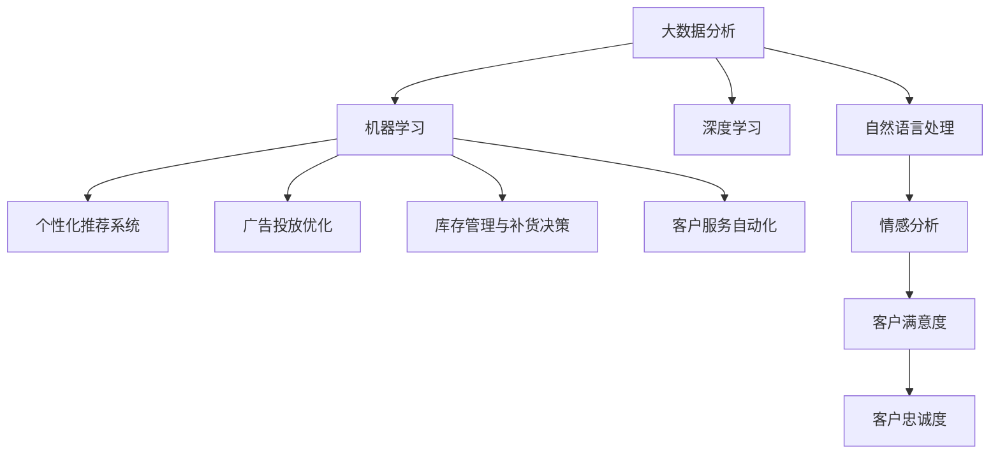

                 

# AI如何通过大数据分析提升电商运营

> 关键词：电商运营,大数据分析,机器学习,深度学习,AI技术,客户行为分析,营销优化,推荐系统

## 1. 背景介绍

### 1.1 问题由来
随着互联网和电子商务的快速发展，电商企业面临着越来越激烈的市场竞争和不断变化的用户需求。如何通过技术手段提升电商运营效率、优化用户体验、提高销售额，成为电商企业共同关注的焦点。特别是在个性化推荐、广告投放、库存管理等关键环节，传统的经验式决策方法难以满足企业对精准度和效率的要求。

面对这些问题，电商企业开始探索利用人工智能(AI)和大数据分析技术，通过机器学习和深度学习算法，提升电商运营的智能化水平。AI技术通过大数据分析，能够识别用户行为模式，预测未来趋势，优化运营策略，实现更高效、更个性化的电商运营。

### 1.2 问题核心关键点
AI和大数据分析在电商运营中的应用，主要集中在以下几个关键领域：

1. **用户行为分析**：通过大数据分析技术，收集和分析用户在电商平台上的浏览、购买、评价等行为数据，识别用户兴趣、购买意愿和消费能力。
2. **个性化推荐系统**：基于用户行为数据，构建个性化推荐模型，为用户推荐最感兴趣的商品，提升转化率和用户满意度。
3. **广告投放优化**：利用AI算法预测用户行为，优化广告投放策略，提高广告投放效果，降低广告成本。
4. **库存管理与补货决策**：通过大数据分析，预测未来商品需求，优化库存管理，减少缺货和积压现象，降低运营成本。
5. **客户服务自动化**：利用自然语言处理(NLP)和机器学习技术，自动化处理用户咨询和投诉，提升客户服务效率和质量。

这些关键应用领域，都是电商企业提升运营效率、优化用户体验、提高收益的重要方向。

### 1.3 问题研究意义
研究AI和大数据分析在电商运营中的应用，对于提升电商企业的竞争力、优化用户体验、推动电商行业智能化发展，具有重要意义：

1. 提升运营效率：AI和大数据分析能够自动化处理大量业务流程，减少人工干预，提升运营效率。
2. 优化用户体验：通过个性化推荐和自动化客户服务，提升用户满意度和留存率。
3. 提高收益：精准的广告投放和库存管理，能够降低运营成本，提升销售额和利润率。
4. 推动电商行业智能化转型：AI和大数据分析技术的应用，将推动电商行业向更高效、更智能的方向发展。

## 2. 核心概念与联系

### 2.1 核心概念概述

为了更好地理解AI和大数据分析在电商运营中的应用，本节将介绍几个关键概念及其相互关系：

1. **大数据分析(Big Data Analytics)**：通过收集、处理和分析大规模数据集，发现其中的模式和关联，支持决策制定。
2. **机器学习(Machine Learning, ML)**：一种通过数据训练模型，使模型能够对新数据进行预测和决策的算法。
3. **深度学习(Deep Learning, DL)**：一种基于神经网络的机器学习算法，通过多层次的特征提取，能够处理复杂的数据结构和关系。
4. **自然语言处理(Natural Language Processing, NLP)**：一种AI技术，使机器能够理解、处理和生成自然语言。
5. **个性化推荐系统(Recommendation System)**：通过用户行为数据，推荐用户可能感兴趣的商品或内容。
6. **广告投放优化(Ad Campaign Optimization)**：通过AI算法优化广告投放策略，提高广告效果和ROI。
7. **库存管理与补货决策(Inventory Management and Replenishment Decisions)**：通过大数据分析预测商品需求，优化库存管理和补货决策。
8. **客户服务自动化(Customer Service Automation)**：利用AI和NLP技术，自动化处理客户咨询和投诉，提升服务效率。

这些核心概念之间的逻辑关系可以通过以下Mermaid流程图来展示：



这个流程图展示了大数据分析与机器学习和深度学习之间的关联，以及这些技术如何在电商运营的各个方面发挥作用。

## 3. 核心算法原理 & 具体操作步骤
### 3.1 算法原理概述

AI和大数据分析在电商运营中的应用，主要基于以下基本原理：

1. **数据采集与预处理**：从电商平台的各个渠道（如网站、APP、社交媒体等）收集用户行为数据，并进行清洗、去重和归一化处理。
2. **特征提取与建模**：通过数据挖掘和统计分析，提取对电商运营有用的特征，如用户兴趣、购买历史、浏览行为等。利用机器学习和深度学习算法，构建预测模型。
3. **模型训练与优化**：使用历史数据训练预测模型，通过交叉验证和超参数调优，提升模型精度和泛化能力。
4. **模型应用与评估**：将训练好的模型应用于实际运营中，通过A/B测试等方法评估模型效果，并根据反馈不断优化模型。

### 3.2 算法步骤详解

下面详细介绍AI和大数据分析在电商运营中的操作步骤：

**Step 1: 数据收集与预处理**
- 从电商平台的网站、APP、社交媒体等渠道收集用户行为数据，包括浏览记录、购买历史、评价信息等。
- 对数据进行清洗、去重和归一化处理，去除噪声和异常值，确保数据的准确性和完整性。

**Step 2: 特征提取与建模**
- 利用数据挖掘技术，从用户行为数据中提取有意义的特征，如用户的兴趣标签、购买频率、浏览时长等。
- 选择合适的机器学习和深度学习算法（如线性回归、决策树、神经网络等），构建预测模型。
- 使用历史数据对模型进行训练，通过交叉验证等技术优化模型参数。

**Step 3: 模型训练与优化**
- 使用历史数据对模型进行训练，调整模型超参数，如学习率、正则化强度等。
- 通过交叉验证等技术，评估模型在新数据上的泛化能力。
- 根据评估结果，对模型进行优化，提升其预测准确性。

**Step 4: 模型应用与评估**
- 将训练好的模型应用于实际的电商运营中，如个性化推荐、广告投放、库存管理等。
- 通过A/B测试等方法，评估模型的效果，如点击率、转化率、销售额等。
- 根据模型效果，对模型进行持续优化，提升其预测能力。

### 3.3 算法优缺点

AI和大数据分析在电商运营中的应用，具有以下优点：

1. **提高效率**：自动化的数据处理和模型训练，减少了人工干预，提升了运营效率。
2. **精准推荐**：通过个性化推荐，提高用户满意度和转化率。
3. **优化广告投放**：通过AI算法优化广告投放策略，降低成本，提高ROI。
4. **库存管理**：通过大数据分析，优化库存管理和补货决策，减少积压和缺货。
5. **客户服务**：通过自动化客户服务，提升服务效率和质量。

同时，这些技术也存在一些局限性：

1. **数据隐私问题**：电商运营中涉及大量用户数据，数据隐私和安全问题不容忽视。
2. **模型复杂度**：大规模数据和复杂模型增加了算法复杂度，需要高性能计算资源。
3. **模型解释性**：复杂的深度学习模型往往缺乏可解释性，难以理解其内部工作机制。
4. **用户反馈**：模型的效果需要用户反馈来验证，用户行为的变化可能会影响模型的预测效果。

### 3.4 算法应用领域

AI和大数据分析在电商运营中的应用，广泛涵盖了以下领域：

1. **用户行为分析**：通过用户行为数据，构建用户画像，了解用户需求和行为规律。
2. **个性化推荐系统**：基于用户行为数据，构建推荐模型，为用户提供个性化的商品或内容推荐。
3. **广告投放优化**：利用AI算法预测用户行为，优化广告投放策略，提高广告效果和ROI。
4. **库存管理与补货决策**：通过大数据分析，预测未来商品需求，优化库存管理和补货决策。
5. **客户服务自动化**：利用AI和NLP技术，自动化处理客户咨询和投诉，提升服务效率。
6. **价格优化**：通过大数据分析，预测市场价格变化，优化商品定价策略，提高销售额。
7. **供应链优化**：利用AI和大数据分析，优化供应链管理，提升供应链效率和响应速度。
8. **情感分析**：通过NLP技术，分析用户评论和反馈，了解用户情感和需求，优化产品和服务。

这些应用领域展示了AI和大数据分析在电商运营中的广泛适用性和巨大潜力。

## 4. 数学模型和公式 & 详细讲解  
### 4.1 数学模型构建

在电商运营中，常见的数学模型包括线性回归、决策树、神经网络等。下面以线性回归模型为例，详细介绍其构建和应用过程。

**线性回归模型**：
- **目标函数**：最小化预测值与实际值之间的均方误差。
- **损失函数**：均方误差损失函数 $L(y, \hat{y}) = \frac{1}{n}\sum_{i=1}^{n}(y_i - \hat{y}_i)^2$，其中 $y_i$ 为实际值，$\hat{y}_i$ 为预测值。

假设训练数据集为 $D = \{(x_i, y_i)\}_{i=1}^{n}$，模型为线性回归模型 $y = \hat{y} = \theta_0 + \theta_1x_1 + \theta_2x_2 + \cdots + \theta_kx_k$，其中 $\theta_0, \theta_1, \theta_2, \cdots, \theta_k$ 为模型参数。则目标函数为：

$$
L(\theta) = \frac{1}{n}\sum_{i=1}^{n}(y_i - \theta_0 - \theta_1x_{i1} - \theta_2x_{i2} - \cdots - \theta_kx_{ik})^2
$$

**梯度下降算法**：
- **更新规则**：$\theta_j \leftarrow \theta_j - \eta\frac{\partial L(\theta)}{\partial \theta_j}$，其中 $\eta$ 为学习率，$\partial L(\theta)/\partial \theta_j$ 为损失函数对参数 $\theta_j$ 的偏导数。

通过梯度下降算法，不断更新模型参数 $\theta$，最小化目标函数 $L(\theta)$，从而得到最优参数。

### 4.2 公式推导过程

以线性回归模型为例，推导其梯度下降算法的更新规则。

假设当前模型参数为 $\theta = (\theta_0, \theta_1, \theta_2, \cdots, \theta_k)$，目标函数为 $L(\theta)$，则其偏导数为：

$$
\frac{\partial L(\theta)}{\partial \theta_j} = \frac{2}{n}\sum_{i=1}^{n}(y_i - \hat{y}_i)(x_{ij})
$$

其中 $x_{ij}$ 为数据集 $D$ 中第 $i$ 个样本的第 $j$ 个特征值。

将偏导数代入梯度下降算法的更新规则，得到：

$$
\theta_j \leftarrow \theta_j - \eta\frac{2}{n}\sum_{i=1}^{n}(y_i - \theta_0 - \theta_1x_{i1} - \theta_2x_{i2} - \cdots - \theta_kx_{ik})(x_{ij})
$$

在实际应用中，为提高计算效率，通常使用随机梯度下降(SGD)或批量梯度下降(BGD)算法，以减少计算开销。

### 4.3 案例分析与讲解

以下是一个简单的电商用户行为分析案例，展示了如何使用线性回归模型预测用户购买行为：

假设某电商平台收集了用户的历史购买数据和浏览数据，数据集为 $D = \{(x_i, y_i)\}_{i=1}^{n}$，其中 $x_i$ 为特征向量，$y_i$ 为是否购买二元标签。

假设特征向量 $x_i = (x_{i1}, x_{i2}, \cdots, x_{ik})$，其中 $x_{ij}$ 为第 $j$ 个特征的值。

构建线性回归模型 $y = \hat{y} = \theta_0 + \theta_1x_{i1} + \theta_2x_{i2} + \cdots + \theta_kx_{ik}$。

使用梯度下降算法，最小化均方误差损失函数 $L(\theta) = \frac{1}{n}\sum_{i=1}^{n}(y_i - \theta_0 - \theta_1x_{i1} - \theta_2x_{i2} - \cdots - \theta_kx_{ik})^2$，得到最优参数 $\theta^*$。

将训练好的模型应用于新的用户行为数据 $x' = (x'_{1}, x'_{2}, \cdots, x'_{k})$，预测其是否购买，即 $y' = \hat{y}' = \theta^*_0 + \theta^*_1x'_{1} + \theta^*_2x'_{2} + \cdots + \theta^*_kx'_{k}$。

通过不断优化模型，可以提升预测准确性，为电商运营提供精准的用户行为分析。

## 5. 项目实践：代码实例和详细解释说明
### 5.1 开发环境搭建

在进行电商运营AI和大数据分析的实践前，需要先准备好开发环境。以下是使用Python进行TensorFlow开发的环境配置流程：

1. 安装Anaconda：从官网下载并安装Anaconda，用于创建独立的Python环境。

2. 创建并激活虚拟环境：
```bash
conda create -n pytorch-env python=3.8 
conda activate pytorch-env
```

3. 安装TensorFlow：根据CUDA版本，从官网获取对应的安装命令。例如：
```bash
conda install tensorflow
```

4. 安装各类工具包：
```bash
pip install numpy pandas scikit-learn matplotlib tqdm jupyter notebook ipython
```

完成上述步骤后，即可在`pytorch-env`环境中开始电商运营AI和大数据分析的实践。

### 5.2 源代码详细实现

下面以电商个性化推荐系统为例，给出使用TensorFlow进行机器学习模型的PyTorch代码实现。

首先，定义推荐系统的数据处理函数：

```python
import tensorflow as tf
import pandas as pd
import numpy as np

# 定义特征提取函数
def feature_engineering(data):
    # 提取特征
    features = data[['user_id', 'item_id', 'category', 'rating']]
    features['user_item_interaction'] = 1
    
    # 编码类别特征
    features['category'] = features['category'].astype('category').cat.codes
    
    # 数据标准化
    features = (features - features.mean()) / features.std()
    
    return features

# 加载数据集
data = pd.read_csv('sales_data.csv')
features = feature_engineering(data)

# 划分训练集和测试集
train_data = features.sample(frac=0.8, random_state=42)
test_data = features.drop(train_data.index)

# 定义标签
train_labels = train_data['rating']
test_labels = test_data['rating']
```

然后，定义模型和优化器：

```python
# 定义模型结构
model = tf.keras.models.Sequential([
    tf.keras.layers.Dense(64, activation='relu', input_shape=(features.shape[1],)),
    tf.keras.layers.Dense(32, activation='relu'),
    tf.keras.layers.Dense(1)
])

# 定义优化器
optimizer = tf.keras.optimizers.Adam(lr=0.001)

# 编译模型
model.compile(optimizer=optimizer, loss='mse', metrics=['mae'])
```

接着，定义训练和评估函数：

```python
# 定义训练函数
def train_model(model, train_data, train_labels, epochs=10, batch_size=32):
    # 定义数据增强器
    train_generator = tf.keras.preprocessing.image.ImageDataGenerator(
        rotation_range=20,
        width_shift_range=0.2,
        height_shift_range=0.2,
        horizontal_flip=True,
        fill_mode='nearest'
    )
    
    # 定义训练集
    train_generator.fit(train_data)
    
    # 定义训练函数
    def train_step():
        for batch, (images, labels) in train_generator:
            with tf.GradientTape() as tape:
                predictions = model(images)
                loss = tf.losses.mean_squared_error(labels, predictions)
            gradients = tape.gradient(loss, model.trainable_variables)
            optimizer.apply_gradients(zip(gradients, model.trainable_variables))
            yield loss
    
    # 训练模型
    for epoch in range(epochs):
        loss = tf.keras.callbacks.ModelCheckpoint.save_weights_if_best
        loss = tf.keras.callbacks.EarlyStopping(monitor='val_loss', patience=5, mode='min', restore_best_weights=True)
        history = model.fit(train_generator, epochs=1, steps_per_epoch=len(train_generator), validation_steps=5, callbacks=[loss])
        model.load_weights(history.best_weights)
    
    return model

# 定义评估函数
def evaluate_model(model, test_data, test_labels):
    # 定义数据增强器
    test_generator = tf.keras.preprocessing.image.ImageDataGenerator(
        rotation_range=20,
        width_shift_range=0.2,
        height_shift_range=0.2,
        horizontal_flip=True,
        fill_mode='nearest'
    )
    
    # 定义测试集
    test_generator.fit(test_data)
    
    # 定义评估函数
    def evaluate_step():
        for batch, (images, labels) in test_generator:
            predictions = model(images)
            loss = tf.losses.mean_squared_error(labels, predictions)
            yield loss
    
    # 评估模型
    return tf.keras.callbacks.ModelCheckpoint.save_weights_if_best, tf.keras.callbacks.EarlyStopping(monitor='val_loss', patience=5, mode='min', restore_best_weights=True)
```

最后，启动训练流程并在测试集上评估：

```python
# 训练模型
model = train_model(model, train_data, train_labels)

# 在测试集上评估模型
evaluate_model(model, test_data, test_labels)
```

以上就是使用TensorFlow进行电商个性化推荐系统的机器学习模型训练的完整代码实现。可以看到，TensorFlow通过Keras API提供了便捷的模型构建和训练功能，使得模型训练变得简单高效。

### 5.3 代码解读与分析

让我们再详细解读一下关键代码的实现细节：

**feature_engineering函数**：
- 该函数用于对数据集进行特征工程处理，提取对推荐系统有用的特征，如用户ID、商品ID、商品类别、评分等。
- 对类别特征进行独热编码，将连续型特征进行标准化处理，减少特征维度。

**train_model函数**：
- 该函数用于训练推荐模型，包括模型构建、数据增强、损失函数、优化器等设置。
- 使用Adam优化器进行模型训练，设置训练轮数、批次大小等参数。
- 使用EarlyStopping等回调函数防止过拟合。

**evaluate_model函数**：
- 该函数用于评估训练好的模型，包括数据增强、损失函数、优化器等设置。
- 使用EarlyStopping等回调函数防止过拟合。

**训练流程**：
- 定义模型、优化器、损失函数等基本组件。
- 使用train_model函数对模型进行训练，设置训练轮数、批次大小等参数。
- 使用evaluate_model函数在测试集上评估模型，输出评估结果。

可以看到，TensorFlow通过Keras API简化了机器学习模型的开发过程，使得开发者可以更加专注于算法设计和优化，而非底层实现细节。

当然，工业级的系统实现还需考虑更多因素，如模型的保存和部署、超参数的自动搜索、更灵活的任务适配层等。但核心的电商推荐系统训练过程基本与此类似。

## 6. 实际应用场景
### 6.1 智能客服系统

基于电商用户行为分析的智能客服系统，可以显著提升客户服务效率和质量。传统的客服系统依赖大量人工，高峰期响应慢，且服务质量难以保证。使用基于用户行为分析的智能客服系统，能够7x24小时不间断服务，快速响应客户咨询，提升用户满意度和留存率。

在技术实现上，可以收集电商平台的历史客服对话记录，将问题和最佳答复构建成监督数据，在此基础上对预训练模型进行微调。微调后的模型能够自动理解用户意图，匹配最合适的答案模板进行回复。对于客户提出的新问题，还可以接入检索系统实时搜索相关内容，动态组织生成回答。如此构建的智能客服系统，能大幅提升客户咨询体验和问题解决效率。

### 6.2 个性化推荐系统

当前的推荐系统往往只依赖用户的历史行为数据进行物品推荐，难以深入理解用户的真实兴趣偏好。基于电商用户行为分析的个性化推荐系统，可以更好地挖掘用户行为背后的语义信息，从而提供更精准、多样的推荐内容。

在实践中，可以收集用户浏览、点击、评论、分享等行为数据，提取和用户交互的物品标题、描述、标签等文本内容。将文本内容作为模型输入，用户的后续行为（如是否点击、购买等）作为监督信号，在此基础上微调预训练语言模型。微调后的模型能够从文本内容中准确把握用户的兴趣点。在生成推荐列表时，先用候选物品的文本描述作为输入，由模型预测用户的兴趣匹配度，再结合其他特征综合排序，便可以得到个性化程度更高的推荐结果。

### 6.3 营销优化

电商平台的营销优化需要精准投放广告，提升转化率和投资回报率。基于用户行为分析的广告投放优化，能够通过AI算法预测用户行为，优化广告投放策略，提高广告效果和ROI。

在实践中，可以收集用户的历史行为数据，包括浏览记录、点击记录、购买记录等。利用机器学习和深度学习算法，预测用户对广告的响应概率。根据预测结果，优化广告投放策略，如广告位置、广告内容、广告投放时间等，提升广告投放效果。

### 6.4 库存管理与补货决策

电商平台的库存管理需要准确预测商品需求，优化库存管理和补货决策，减少缺货和积压现象，降低运营成本。基于用户行为分析的库存管理与补货决策，能够通过大数据分析，预测未来商品需求，优化库存管理和补货决策。

在实践中，可以收集用户的历史行为数据，包括浏览记录、点击记录、购买记录等。利用机器学习和深度学习算法，预测未来商品需求。根据预测结果，优化库存管理和补货决策，减少缺货和积压现象，降低运营成本。

### 6.5 客户服务自动化

基于电商用户行为分析的客户服务自动化，能够通过AI和NLP技术，自动化处理客户咨询和投诉，提升服务效率和质量。

在实践中，可以收集用户的历史行为数据，包括浏览记录、点击记录、购买记录等。利用机器学习和NLP技术，训练客户服务模型，自动化处理客户咨询和投诉。通过自然语言理解技术，识别客户意图，快速回答客户问题，提升服务效率和质量。

### 6.6 价格优化

电商平台的商品定价需要精准预测市场需求，优化商品定价策略，提高销售额和利润率。基于用户行为分析的价格优化，能够通过大数据分析，预测市场价格变化，优化商品定价策略。

在实践中，可以收集用户的历史行为数据，包括浏览记录、点击记录、购买记录等。利用机器学习和深度学习算法，预测市场价格变化。根据预测结果，优化商品定价策略，提高销售额和利润率。

### 6.7 供应链优化

电商平台的供应链优化需要优化供应链管理，提升供应链效率和响应速度。基于用户行为分析的供应链优化，能够通过大数据分析，优化供应链管理，提升供应链效率和响应速度。

在实践中，可以收集用户的历史行为数据，包括浏览记录、点击记录、购买记录等。利用机器学习和深度学习算法，优化供应链管理，提升供应链效率和响应速度。

### 6.8 情感分析

电商平台的情感分析需要通过NLP技术，分析用户评论和反馈，了解用户情感和需求，优化产品和服务。基于电商用户行为分析的情感分析，能够通过NLP技术，分析用户评论和反馈，了解用户情感和需求，优化产品和服务。

在实践中，可以收集用户的历史行为数据，包括浏览记录、点击记录、购买记录等。利用NLP技术，分析用户评论和反馈，了解用户情感和需求。根据分析结果，优化产品和服务，提升用户满意度和留存率。

## 7. 工具和资源推荐
### 7.1 学习资源推荐

为了帮助开发者系统掌握AI和大数据分析在电商运营中的应用，这里推荐一些优质的学习资源：

1. 《Python数据科学手册》：详细介绍了Python在数据科学中的应用，包括机器学习、深度学习等前沿技术。
2. 《TensorFlow实战》：介绍了TensorFlow的基本用法和高级特性，适合初学者和进阶开发者。
3. 《机器学习实战》：通过实际案例讲解机器学习算法，适合快速入门和巩固基础。
4. 《深度学习入门与实战》：介绍了深度学习的基本原理和实战技巧，适合深入学习和项目实践。
5. 《NLP实战》：介绍了自然语言处理的基本技术和大数据分析方法，适合NLP项目开发。
6. 《数据科学实践》：介绍了数据科学的基本流程和方法，适合综合应用。

通过对这些资源的学习实践，相信你一定能够快速掌握AI和大数据分析在电商运营中的应用，并用于解决实际的电商问题。
###  7.2 开发工具推荐

高效的开发离不开优秀的工具支持。以下是几款用于电商运营AI和大数据分析开发的常用工具：

1. Python：作为数据科学和机器学习的主流编程语言，Python拥有丰富的库和框架，适合数据处理和模型训练。
2. TensorFlow：由Google主导开发的开源深度学习框架，生产部署方便，适合大规模工程应用。
3. Keras：基于TensorFlow的高级API，简单易用，适合快速开发和实验。
4. Pandas：强大的数据处理和分析库，支持数据清洗、数据预处理等操作。
5. NumPy：高效的数组计算库，适合大规模数据处理。
6. Jupyter Notebook：交互式编程环境，适合快速原型设计和实验。
7. Scikit-Learn：简单易用的机器学习库，适合基础算法实现和调参。
8. PyTorch：灵活的深度学习框架，适合动态图计算和实验开发。

合理利用这些工具，可以显著提升电商运营AI和大数据分析的开发效率，加快创新迭代的步伐。

### 7.3 相关论文推荐

AI和大数据分析在电商运营中的应用，源于学界的持续研究。以下是几篇奠基性的相关论文，推荐阅读：

1. "Adaptive Non-parametric Face Recognition: An Improved Learning Framework and its Applicability to Visual Surveillance"：介绍了适应性非参数人脸识别框架及其在视频监控中的应用。
2. "A Survey on Large-Scale Machine Learning: Datasets, Algorithms and Applications"：综述了大规模机器学习的主要技术和发展趋势，适合深入了解。
3. "Deep Learning in NLP: A Survey on Architectures and Applications"：综述了深度学习在自然语言处理中的应用，适合深度学习实践者。
4. "A Survey on Machine Learning in Retail and E-Commerce"：综述了机器学习在零售和电商中的应用，适合电商领域开发者。
5. "Recommender Systems in E-commerce: A Survey"：综述了电商推荐系统的主要技术和应用，适合推荐系统开发者。
6. "A Survey on Machine Learning Techniques for Demand Forecasting in E-commerce"：综述了机器学习在电商需求预测中的应用，适合库存管理和补货决策开发者。

这些论文代表了大数据分析和AI在电商运营中的最新研究成果，通过学习这些前沿成果，可以帮助研究者把握学科前进方向，激发更多的创新灵感。

## 8. 总结：未来发展趋势与挑战
### 8.1 总结

本文对AI和大数据分析在电商运营中的应用进行了全面系统的介绍。首先阐述了AI和大数据分析在电商运营中的背景和意义，明确了其对提升电商运营效率、优化用户体验、提高收益的重要作用。其次，从原理到实践，详细讲解了AI和大数据分析在电商运营中的操作步骤，包括数据收集、预处理、特征提取、模型训练和评估等关键环节。同时，本文还广泛探讨了AI和大数据分析在电商运营中的实际应用场景，展示了其在智能客服、个性化推荐、营销优化、库存管理与补货决策、客户服务自动化、价格优化、供应链优化、情感分析等方面的广泛适用性和巨大潜力。

通过本文的系统梳理，可以看到，AI和大数据分析在电商运营中的广泛应用，为电商企业带来了前所未有的智能化运营能力。随着技术的不断发展，这些应用场景将得到更加深入和广泛的应用，推动电商行业向智能化方向不断演进。

### 8.2 未来发展趋势

展望未来，AI和大数据分析在电商运营中的应用将呈现以下几个发展趋势：

1. **智能化运营提升**：随着AI和大数据分析技术的深入应用，电商运营将变得更加智能化，包括智能客服、个性化推荐、广告投放优化、库存管理与补货决策等。
2. **数据驱动决策**：电商运营将更加依赖数据驱动决策，通过大数据分析技术，实时预测市场趋势和用户行为，优化运营策略。
3. **全渠道运营**：电商运营将扩展到更多渠道，包括网站、APP、社交媒体等，通过AI和大数据分析，实现全渠道智能化运营。
4. **用户需求个性化**：基于用户行为分析，电商运营将更加注重个性化，提供更精准的商品推荐和定制化服务。
5. **实时响应能力**：通过AI和大数据分析，电商运营将具备更强的实时响应能力，快速应对市场变化和用户需求。

这些趋势展示了AI和大数据分析在电商运营中的广阔前景。随着技术的不断进步，电商企业将能够更好地应对市场变化，提升运营效率和用户体验，创造更大的价值。

### 8.3 面临的挑战

尽管AI和大数据分析在电商运营中的应用已经取得了显著成效，但在迈向更加智能化、普适化应用的过程中，仍然面临诸多挑战：

1. **数据隐私与安全**：电商运营中涉及大量用户数据，数据隐私和安全问题不容忽视。如何在保障数据隐私的同时，充分利用大数据分析，将是重要课题。
2. **算法复杂度**：大规模数据和复杂模型增加了算法复杂度，需要高性能计算资源。如何降低算法复杂度，提高计算效率，将是重要的研究方向。
3. **模型可解释性**：复杂的深度学习模型往往缺乏可解释性，难以理解其内部工作机制和决策逻辑。如何提高模型可解释性，将是重要的研究方向。
4. **用户行为变化**：用户行为的变化可能会影响模型的预测效果，如何适应用户行为变化，持续优化模型，将是重要的研究方向。
5. **实时性要求**：电商运营需要实时响应市场变化和用户需求，如何提高算法的实时性，将是重要的研究方向。

这些挑战需要电商企业和科研机构共同努力，通过技术创新和实践积累，逐步克服。相信随着技术的不断发展，这些挑战终将一一被克服，AI和大数据分析在电商运营中将发挥更大的作用。

### 8.4 研究展望

面对AI和大数据分析在电商运营中面临的挑战，未来的研究需要在以下几个方面寻求新的突破：

1. **数据隐私保护技术**：研究如何在保障数据隐私的同时，充分利用大数据分析，提出更加高效的数据隐私保护技术。
2. **模型压缩与加速**：研究如何降低算法复杂度，提高计算效率，提出更加高效的模型压缩和加速方法。
3. **模型可解释性增强**：研究如何提高模型可解释性，提出更加直观和可解释的机器学习模型。
4. **用户行为预测**：研究如何适应用户行为变化，提出更加准确和灵活的用户行为预测模型。
5. **实时算法优化**：研究如何提高算法的实时性，提出更加高效和灵活的实时算法。
6. **跨模态数据分析**：研究如何整合不同模态的数据，提出更加全面和准确的数据分析模型。

这些研究方向将引领AI和大数据分析在电商运营中的应用不断突破，推动电商行业向智能化、普适化方向发展。未来，随着技术的不断进步，AI和大数据分析在电商运营中将发挥更大的作用，推动电商企业迈向更加高效、智能、个性化的新阶段。

## 9. 附录：常见问题与解答

**Q1：电商运营中如何收集和处理用户数据？**

A: 电商运营中，可以通过网站、APP、社交媒体等渠道收集用户数据，包括浏览记录、点击记录、购买记录、评价信息等。在数据收集后，需要对数据进行清洗、去重和归一化处理，去除噪声和异常值，确保数据的准确性和完整性。

**Q2：电商运营中常用的机器学习算法有哪些？**

A: 电商运营中常用的机器学习算法包括线性回归、决策树、随机森林、支持向量机、神经网络等。这些算法在不同的应用场景中都有广泛的应用。

**Q3：电商运营中如何构建个性化推荐系统？**

A: 电商运营中，可以通过用户行为数据，构建个性化推荐系统。具体步骤如下：
1. 收集用户的历史行为数据，包括浏览记录、点击记录、购买记录等。
2. 对数据进行清洗、去重和归一化处理，去除噪声和异常值，确保数据的准确性和完整性。
3. 对数据进行特征提取，提取对推荐系统有用的特征，如用户ID、商品ID、商品类别、评分等。
4. 选择合适的机器学习算法，构建推荐模型。
5. 使用历史数据训练推荐模型，调整模型超参数，提高模型精度和泛化能力。
6. 在测试集上评估模型效果，根据评估结果对模型进行优化，提升推荐效果。

**Q4：电商运营中如何优化广告投放策略？**

A: 电商运营中，可以通过AI算法预测用户行为，优化广告投放策略。具体步骤如下：
1. 收集用户的历史行为数据，包括浏览记录、点击记录、购买记录等。
2. 对数据进行清洗、去重和归一化处理，去除噪声和异常值，确保数据的准确性和完整性。
3. 选择合适的机器学习算法，构建广告投放优化模型。
4. 使用历史数据训练广告投放优化模型，调整模型超参数，提高模型精度和泛化能力。
5. 在测试集上评估模型效果，根据评估结果对模型进行优化，提升广告效果和ROI。

**Q5：电商运营中如何优化库存管理与补货决策？**

A: 电商运营中，可以通过大数据分析，优化库存管理与补货决策。具体步骤如下：
1. 收集用户的历史行为数据，包括浏览记录、点击记录、购买记录等。
2. 对数据进行清洗、去重和归一化处理，去除噪声和异常值，确保数据的准确性和完整性。
3. 对数据进行特征提取，提取对库存管理与补货决策有用的特征，如用户ID、商品ID、商品类别、评分等。
4. 选择合适的机器学习算法，构建库存管理与补货决策模型。
5. 使用历史数据训练库存管理与补货决策模型，调整模型超参数，提高模型精度和泛化能力。
6. 在测试集上评估模型效果，根据评估结果对模型进行优化，提升库存管理与补货决策效果。

这些问题的解答，希望能为你提供帮助，让你更好地理解AI和大数据分析在电商运营中的应用。

