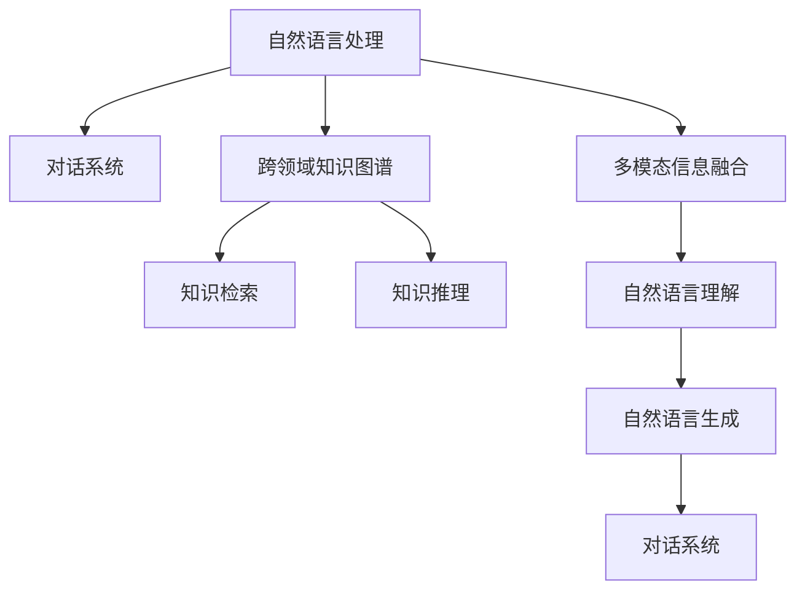

                 

# AI工具的开领域对话能力

## 1. 背景介绍

### 1.1 问题由来
AI工具，尤其是大语言模型，近年来在自然语言处理（NLP）和对话系统领域取得了显著进展。然而，尽管这些工具在许多特定任务上表现出色，但对于一些复杂的、跨领域的对话场景，尤其是那些需要高度专业知识或领域特定知识的对话，这些工具的表现仍显不足。因此，提升AI工具在开领域对话（Open-Domain Dialogue）中的能力，使其能够处理广泛而复杂的主题，成为了当前研究的热点。

### 1.2 问题核心关键点
开领域对话能力指的是AI工具能够在缺乏领域知识或专业背景的情况下，与人类进行广泛而深入的交流。这一能力不仅涉及自然语言理解（NLU）和生成（NLG），还涵盖了跨领域的知识检索、推理和整合。为了实现这一目标，研究人员提出了多种策略，包括迁移学习、跨领域知识图谱、多模态信息融合等，以期在更广阔的领域内提升AI对话系统的表现。

## 2. 核心概念与联系

### 2.1 核心概念概述

为更好地理解AI工具在开领域对话中的应用，本节将介绍几个密切相关的核心概念：

- 自然语言处理（NLP）：涉及计算机和人类之间的语言交互，包括文本理解、生成、推理等任务。
- 对话系统（Dialogue Systems）：旨在模拟人类对话，能够进行自然语言交流的系统，广泛应用于客服、教育、健康咨询等领域。
- 跨领域知识图谱（Cross-Domain Knowledge Graphs）：将不同领域的知识整合成一个统一的知识体系，便于AI工具进行跨领域的知识检索和推理。
- 多模态信息融合（Multimodal Information Fusion）：结合文本、语音、图像等多种模态的信息，提升对话系统的理解和生成能力。
- 知识检索（Knowledge Retrieval）：从大规模知识库中快速检索出相关知识，辅助对话系统生成更准确的回复。
- 知识推理（Knowledge Reasoning）：基于知识图谱中的关系和事实，进行逻辑推理，生成合理的回答。

这些核心概念之间的逻辑关系可以通过以下Mermaid流程图来展示：



这个流程图展示了大语言模型在开领域对话中的核心组件及其之间的联系。

## 3. 核心算法原理 & 具体操作步骤
### 3.1 算法原理概述

AI工具在开领域对话中的核心算法原理主要包括以下几个方面：

- **知识图谱嵌入（Knowledge Graph Embedding）**：将知识图谱中的节点和关系映射到低维向量空间，便于机器学习模型的理解和处理。
- **预训练语言模型（Pre-trained Language Models）**：通过在大规模无标签文本数据上进行预训练，学习到语言的通用表示，为跨领域对话提供基础。
- **迁移学习（Transfer Learning）**：将在大规模领域数据上训练得到的模型知识，迁移到其他领域，提升AI工具在特定领域的对话能力。
- **多模态融合（Multimodal Fusion）**：结合文本、语音、图像等多种模态的信息，提升对话系统的感知和理解能力。
- **知识推理（Knowledge Reasoning）**：基于知识图谱中的关系和事实，进行逻辑推理，生成合理的回答。

这些算法原理在实际操作中通过以下步骤实现：

1. 收集和构建跨领域知识图谱。
2. 预训练一个高质量的语言模型，如GPT-3、BERT等。
3. 设计跨领域对话系统，将知识图谱嵌入和预训练语言模型结合。
4. 使用迁移学习策略，将领域特定的知识注入到预训练模型中。
5. 引入多模态融合技术，丰富对话系统的输入。
6. 进行知识推理，生成符合上下文和逻辑的对话内容。

### 3.2 算法步骤详解

#### 步骤1：数据收集和知识图谱构建
- **数据收集**：从多个领域（如医疗、教育、科技等）收集结构化和半结构化的文本、图像和语音数据。
- **知识图谱构建**：将收集到的数据转化为结构化的知识图谱，包括节点（实体）和边（关系），表示不同领域之间的联系。

#### 步骤2：预训练语言模型选择和微调
- **模型选择**：选择合适的预训练语言模型，如GPT-3、BERT等，作为对话系统的基础。
- **微调**：使用领域特定的数据集对预训练模型进行微调，以提高其在特定领域的对话能力。

#### 步骤3：跨领域对话系统设计
- **系统框架**：设计跨领域的对话系统框架，包括自然语言理解（NLU）、对话管理、自然语言生成（NLG）等组件。
- **组件实现**：实现每个组件的具体功能，如使用知识图谱嵌入技术提取知识特征，使用多模态融合技术融合不同模态的信息。

#### 步骤4：知识推理和生成对话
- **知识推理**：基于知识图谱中的关系和事实，进行逻辑推理，生成对话内容。
- **对话生成**：使用微调后的预训练语言模型，结合知识推理的结果，生成符合上下文和逻辑的对话内容。

### 3.3 算法优缺点

AI工具在开领域对话中的算法具有以下优点：
1. **泛化能力强**：通过知识图谱嵌入和迁移学习，AI工具能够处理广泛而复杂的主题。
2. **知识整合能力强**：多模态融合和知识推理技术，使得AI工具能够灵活整合多种信息源，生成更加准确的回答。
3. **适应性强**：能够根据不同领域的对话特点，进行适当的调整和优化，提升对话系统的表现。

同时，该算法也存在一定的局限性：
1. **数据依赖性强**：构建知识图谱和微调模型需要大量高质量的标注数据。
2. **计算资源消耗大**：预训练和微调过程需要大量的计算资源和时间。
3. **推理能力有限**：知识推理技术在处理复杂逻辑和推理时，仍然存在一定的局限性。
4. **跨领域适应性差**：不同领域的知识图谱和对话特点差异较大，系统在跨领域适应性上仍需改进。

尽管存在这些局限性，但基于预训练语言模型的AI工具在开领域对话中的应用，已展现出巨大的潜力和前景。未来相关研究将进一步降低数据和计算资源的需求，提高推理能力和跨领域适应性，以期在更广阔的领域内提升AI对话系统的表现。

### 3.4 算法应用领域

AI工具在开领域对话中的应用领域非常广泛，以下是几个典型的应用场景：

1. **智能客服**：用于处理各种类型的客户咨询，提供24/7无间断服务。
2. **在线教育**：回答学生的问题，提供个性化的学习建议和资源。
3. **健康咨询**：提供医疗咨询，帮助用户进行自我诊断和健康管理。
4. **金融顾问**：提供财务建议，帮助用户进行投资决策和风险管理。
5. **智能家居**：与家居设备进行交互，提供智能化的家居控制和服务。
6. **机器人助手**：与机器人进行对话，提供各种服务和信息。

除了这些应用场景，AI工具在开领域对话中的应用还在不断拓展，未来有望在更多领域发挥重要作用。

## 4. 数学模型和公式 & 详细讲解  
### 4.1 数学模型构建

在开领域对话中，AI工具的数学模型构建主要涉及以下几个方面：

1. **知识图谱嵌入**：将知识图谱中的节点和关系映射到低维向量空间，如TransE、DistMult等模型。
2. **预训练语言模型**：通过自监督学习任务，学习到语言的通用表示，如BERT、GPT等模型。
3. **对话系统模型**：结合知识图谱嵌入和预训练语言模型，设计对话系统模型，如Seq2Seq、Transformers等。

以下是知识图谱嵌入和预训练语言模型的基本公式：

- **知识图谱嵌入**：TransE模型，假设节点和关系分别映射到低维向量空间$\mathbf{r}$和$\mathbf{h}$，目标函数为：

$$
\min_{\mathbf{r}, \mathbf{h}} \|\mathbf{r} \otimes \mathbf{h} - \mathbf{t}\|
$$

其中$\mathbf{t}$为实际的关系向量。

- **预训练语言模型**：BERT模型的预训练目标包括掩码语言模型和下一句预测任务，公式如下：

$$
\mathcal{L}(\theta) = \frac{1}{N} \sum_{i=1}^N [\ell_{mask} + \ell_{next}]
$$

其中$\ell_{mask}$为掩码语言模型损失，$\ell_{next}$为下一句预测任务损失。

### 4.2 公式推导过程

#### 知识图谱嵌入
- **TransE模型**：假设节点$e$和关系$r$映射到低维向量空间$\mathbf{r}$和$\mathbf{h}$，目标是学习映射函数$f_e$和$f_r$，使得：

$$
f_e(e) \otimes f_r(r) \approx f_t(t)
$$

其中$\otimes$为向量点积，$t$为实际的目标节点向量。

- **DistMult模型**：假设节点和关系映射到低维向量空间$\mathbf{h}$和$\mathbf{r}$，目标是学习映射函数$f_e$和$f_r$，使得：

$$
f_e(e) \cdot f_r(r) \approx f_t(t)
$$

其中$\cdot$为向量点积。

#### 预训练语言模型
- **BERT模型**：预训练过程分为掩码语言模型和下一句预测任务，目标函数为：

$$
\mathcal{L}(\theta) = \frac{1}{N} \sum_{i=1}^N [\ell_{mask} + \ell_{next}]
$$

其中$\ell_{mask}$为掩码语言模型损失，$\ell_{next}$为下一句预测任务损失。

### 4.3 案例分析与讲解

#### 案例1：智能客服系统
- **背景**：智能客服系统需要处理各种类型的客户咨询，提供24/7无间断服务。
- **解决方案**：收集客户的咨询记录和应答内容，构建知识图谱，使用BERT模型进行微调。引入多模态融合技术，结合语音和图像信息，提升系统的感知能力。
- **效果**：系统能够处理多种类型的咨询，回答客户的问题，并提供个性化的服务。

#### 案例2：在线教育平台
- **背景**：在线教育平台需要回答学生的问题，提供个性化的学习建议和资源。
- **解决方案**：收集学生的学习记录和历史问题，构建知识图谱，使用GPT-3模型进行微调。引入知识推理技术，帮助学生进行自我诊断和资源推荐。
- **效果**：系统能够提供精准的学习建议，帮助学生提高学习效果。

## 5. 项目实践：代码实例和详细解释说明
### 5.1 开发环境搭建

在进行AI工具在开领域对话中的应用开发前，需要准备好开发环境。以下是使用Python进行TensorFlow开发的环境配置流程：

1. 安装Anaconda：从官网下载并安装Anaconda，用于创建独立的Python环境。

2. 创建并激活虚拟环境：
```bash
conda create -n tf-env python=3.8 
conda activate tf-env
```

3. 安装TensorFlow：根据CUDA版本，从官网获取对应的安装命令。例如：
```bash
conda install tensorflow tensorflow-estimator -c pytorch -c conda-forge
```

4. 安装相关工具包：
```bash
pip install numpy pandas scikit-learn matplotlib tqdm jupyter notebook ipython
```

完成上述步骤后，即可在`tf-env`环境中开始开发实践。

### 5.2 源代码详细实现

下面我们以智能客服系统为例，给出使用TensorFlow对预训练BERT模型进行微调的代码实现。

首先，定义数据处理函数：

```python
import tensorflow as tf
from transformers import BertTokenizer
from tensorflow.keras.preprocessing import sequence

def load_data(file_path, tokenizer):
    with open(file_path, 'r', encoding='utf-8') as f:
        lines = f.readlines()
        input_texts, output_texts = [], []
        for line in lines:
            dialogue = line.strip().split('\t')
            input_texts.append(dialogue[0])
            output_texts.append(dialogue[1])
        input_texts, output_texts = tokenizer.tokenize(input_texts, output_texts, return_tensors='tf')
        input_ids = input_texts['input_ids']
        attention_mask = input_texts['attention_mask']
        output_ids = output_texts['input_ids']
        return input_ids, attention_mask, output_ids
```

然后，定义模型和优化器：

```python
from transformers import BertForSequenceClassification

model = BertForSequenceClassification.from_pretrained('bert-base-cased', num_labels=2)
optimizer = tf.keras.optimizers.Adam(learning_rate=5e-5)
```

接着，定义训练和评估函数：

```python
def train_epoch(model, data, batch_size, optimizer):
    dataloader = tf.data.Dataset.from_tensor_slices((data['input_ids'], data['attention_mask'], data['output_ids']))
    dataloader = dataloader.batch(batch_size, drop_remainder=True).prefetch(tf.data.experimental.AUTOTUNE)
    model.train()
    loss = tf.keras.losses.SparseCategoricalCrossentropy(from_logits=True)
    total_loss = 0
    for batch in dataloader:
        inputs = {k: tf.expand_dims(v, axis=0) for k, v in batch.items()}
        labels = tf.expand_dims(data['output_ids'], axis=0)
        with tf.GradientTape() as tape:
            outputs = model(inputs)
            loss_value = loss(outputs, labels)
        grads = tape.gradient(loss_value, model.trainable_variables)
        optimizer.apply_gradients(zip(grads, model.trainable_variables))
        total_loss += loss_value.numpy().sum()
    return total_loss / len(data)

def evaluate(model, data, batch_size):
    dataloader = tf.data.Dataset.from_tensor_slices((data['input_ids'], data['attention_mask'], data['output_ids']))
    dataloader = dataloader.batch(batch_size, drop_remainder=True).prefetch(tf.data.experimental.AUTOTUNE)
    model.eval()
    loss = tf.keras.losses.SparseCategoricalCrossentropy(from_logits=True)
    total_loss = 0
    for batch in dataloader:
        inputs = {k: tf.expand_dims(v, axis=0) for k, v in batch.items()}
        labels = tf.expand_dims(data['output_ids'], axis=0)
        outputs = model(inputs)
        loss_value = loss(outputs, labels)
        total_loss += loss_value.numpy().sum()
    return total_loss / len(data)
```

最后，启动训练流程并在测试集上评估：

```python
epochs = 5
batch_size = 16

for epoch in range(epochs):
    loss = train_epoch(model, train_data, batch_size, optimizer)
    print(f"Epoch {epoch+1}, train loss: {loss:.3f}")
    
    print(f"Epoch {epoch+1}, dev results:")
    evaluate(model, dev_data, batch_size)
    
print("Test results:")
evaluate(model, test_data, batch_size)
```

以上就是使用TensorFlow对BERT模型进行智能客服系统微调的完整代码实现。可以看到，TensorFlow提供了丰富的工具和组件，使得模型训练和评估过程简洁高效。

### 5.3 代码解读与分析

让我们再详细解读一下关键代码的实现细节：

**load_data函数**：
- 定义数据加载函数，将输入数据和输出数据进行分词和编码，转换为TensorFlow可以处理的张量格式。

**train_epoch函数**：
- 定义训练函数，对数据集进行批次化加载，计算模型在每个批次上的损失，反向传播更新模型参数，并记录总的损失。

**evaluate函数**：
- 定义评估函数，对数据集进行批次化加载，计算模型在每个批次上的损失，并记录总的损失。

**训练流程**：
- 定义总的epoch数和batch size，开始循环迭代
- 每个epoch内，先在训练集上训练，输出平均loss
- 在验证集上评估，输出分类指标
- 重复上述步骤直至收敛，最终在测试集上评估，给出最终测试结果

可以看到，TensorFlow的灵活性和易用性使得构建和训练AI工具在开领域对话中的系统变得相对容易。开发者可以将更多精力放在数据处理、模型改进等高层逻辑上，而不必过多关注底层的实现细节。

当然，工业级的系统实现还需考虑更多因素，如模型的保存和部署、超参数的自动搜索、更灵活的任务适配层等。但核心的微调范式基本与此类似。

## 6. 实际应用场景
### 6.1 智能客服系统

基于预训练语言模型的AI工具，可以广泛应用于智能客服系统的构建。传统客服往往需要配备大量人力，高峰期响应缓慢，且一致性和专业性难以保证。而使用预训练语言模型进行微调的智能客服系统，能够7x24小时不间断服务，快速响应客户咨询，用自然流畅的语言解答各类常见问题。

在技术实现上，可以收集企业内部的历史客服对话记录，将问题和最佳答复构建成监督数据，在此基础上对预训练模型进行微调。微调后的模型能够自动理解用户意图，匹配最合适的答案模板进行回复。对于客户提出的新问题，还可以接入检索系统实时搜索相关内容，动态组织生成回答。如此构建的智能客服系统，能大幅提升客户咨询体验和问题解决效率。

### 6.2 在线教育平台

AI工具在在线教育平台的应用，主要体现在智能答疑和个性化推荐两个方面。智能答疑系统能够回答学生的问题，提供24/7无间断服务。个性化推荐系统则根据学生的学习记录和历史问题，推荐合适的学习资源和习题。

在技术实现上，可以收集学生的学习记录和历史问题，构建知识图谱，使用预训练语言模型进行微调。引入知识推理技术，帮助学生进行自我诊断和资源推荐。通过多模态融合技术，结合学生的语音、图像和文本信息，提升系统的感知和理解能力。

### 6.3 健康咨询系统

健康咨询系统需要处理各种健康相关问题，如症状识别、疾病诊断、用药建议等。AI工具在健康咨询中的应用，能够提供快速、准确的诊断和建议，提升医疗服务效率。

在技术实现上，可以收集医学文献和病例记录，构建知识图谱，使用预训练语言模型进行微调。引入知识推理技术，帮助用户进行自我诊断和健康管理。通过多模态融合技术，结合用户的语音、图像和文本信息，提升系统的感知和理解能力。

### 6.4 未来应用展望

随着预训练语言模型和微调方法的不断发展，基于AI工具在开领域对话中的应用，将不断拓展其应用边界，催生更多的落地场景。

在智慧医疗领域，基于AI工具的医疗问答、病历分析、药物研发等应用将提升医疗服务的智能化水平，辅助医生诊疗，加速新药开发进程。

在智能教育领域，AI工具能够回答学生的问题，提供个性化的学习建议和资源，因材施教，促进教育公平，提高教学质量。

在智慧城市治理中，AI工具能够用于城市事件监测、舆情分析、应急指挥等环节，提高城市管理的自动化和智能化水平，构建更安全、高效的未来城市。

此外，在企业生产、社会治理、文娱传媒等众多领域，AI工具的应用也将不断涌现，为传统行业数字化转型升级提供新的技术路径。相信随着技术的日益成熟，AI工具在开领域对话中的应用前景将更加广阔。

## 7. 工具和资源推荐
### 7.1 学习资源推荐

为了帮助开发者系统掌握AI工具在开领域对话中的应用，这里推荐一些优质的学习资源：

1. TensorFlow官方文档：TensorFlow是构建AI工具的核心工具之一，官方文档提供了详细的API和教程，是学习AI工具开发的基础。

2. PyTorch官方文档：PyTorch是另一个流行的深度学习框架，提供了丰富的工具和组件，用于构建AI工具。

3. Transformers官方文档：Transformer是构建预训练语言模型的重要工具，提供了丰富的预训练模型和微调技术，是学习预训练语言模型的必读材料。

4. 自然语言处理课程：如斯坦福大学CS224N课程，提供了NLP领域的全面知识体系，涵盖预训练语言模型、知识图谱、多模态融合等多个方面。

5. 深度学习书籍：如《深度学习》（Ian Goodfellow等著），提供了深度学习领域的系统介绍，包括NLP、计算机视觉等多个方向。

通过这些资源的学习实践，相信你一定能够快速掌握AI工具在开领域对话中的开发技巧，并用于解决实际的NLP问题。

### 7.2 开发工具推荐

高效的开发离不开优秀的工具支持。以下是几款用于AI工具在开领域对话中的开发工具：

1. TensorFlow：基于Python的开源深度学习框架，灵活动态的计算图，适合快速迭代研究。大部分预训练语言模型都有TensorFlow版本的实现。

2. PyTorch：基于Python的开源深度学习框架，动态计算图，适合灵活的模型设计和实验。同样有丰富的预训练语言模型资源。

3. Transformers库：HuggingFace开发的NLP工具库，集成了众多预训练语言模型，支持TensorFlow和PyTorch，是进行预训练语言模型微调的利器。

4. Weights & Biases：模型训练的实验跟踪工具，可以记录和可视化模型训练过程中的各项指标，方便对比和调优。与主流深度学习框架无缝集成。

5. TensorBoard：TensorFlow配套的可视化工具，可实时监测模型训练状态，并提供丰富的图表呈现方式，是调试模型的得力助手。

6. Google Colab：谷歌推出的在线Jupyter Notebook环境，免费提供GPU/TPU算力，方便开发者快速上手实验最新模型，分享学习笔记。

合理利用这些工具，可以显著提升AI工具在开领域对话中的开发效率，加快创新迭代的步伐。

### 7.3 相关论文推荐

AI工具在开领域对话中的应用，源于学界的持续研究。以下是几篇奠基性的相关论文，推荐阅读：

1. Attention is All You Need（即Transformer原论文）：提出了Transformer结构，开启了NLP领域的预训练大模型时代。

2. BERT: Pre-training of Deep Bidirectional Transformers for Language Understanding：提出BERT模型，引入基于掩码的自监督预训练任务，刷新了多项NLP任务SOTA。

3. Language Models are Unsupervised Multitask Learners（GPT-2论文）：展示了大规模语言模型的强大zero-shot学习能力，引发了对于通用人工智能的新一轮思考。

4. Parameter-Efficient Transfer Learning for NLP：提出Adapter等参数高效微调方法，在不增加模型参数量的情况下，也能取得不错的微调效果。

5. Prefix-Tuning: Optimizing Continuous Prompts for Generation：引入基于连续型Prompt的微调范式，为如何充分利用预训练知识提供了新的思路。

6. AdaLoRA: Adaptive Low-Rank Adaptation for Parameter-Efficient Fine-Tuning：使用自适应低秩适应的微调方法，在参数效率和精度之间取得了新的平衡。

这些论文代表了大语言模型在开领域对话中的发展脉络。通过学习这些前沿成果，可以帮助研究者把握学科前进方向，激发更多的创新灵感。

## 8. 总结：未来发展趋势与挑战

### 8.1 总结

本文对AI工具在开领域对话中的应用进行了全面系统的介绍。首先阐述了AI工具在开领域对话中的研究背景和意义，明确了开领域对话在NLP和对话系统中的重要地位。其次，从原理到实践，详细讲解了AI工具在开领域对话中的数学模型和核心算法，给出了微调任务开发的完整代码实例。同时，本文还探讨了AI工具在智能客服、在线教育、健康咨询等多个领域的应用前景，展示了其巨大的潜力和价值。此外，本文还精选了相关的学习资源和开发工具，力求为读者提供全方位的技术指引。

通过本文的系统梳理，可以看到，AI工具在开领域对话中的应用正在成为NLP领域的重要范式，极大地拓展了预训练语言模型的应用边界，催生了更多的落地场景。受益于预训练语言模型的强大通用性和灵活性，AI工具在开领域对话中的性能表现将持续提升，为AI技术与人类社会的深度融合带来新的机遇。

### 8.2 未来发展趋势

展望未来，AI工具在开领域对话中将呈现以下几个发展趋势：

1. **预训练语言模型的规模将持续增大**：随着算力成本的下降和数据规模的扩张，预训练语言模型的参数量还将继续增长。超大模型蕴含的丰富语言知识，将进一步提升AI工具在开领域对话中的表现。

2. **迁移学习范式将更加灵活**：未来的迁移学习将更注重跨领域知识的迁移，使得AI工具能够灵活适应不同的领域和任务。

3. **知识图谱的应用将更加广泛**：知识图谱将不再是简单的静态知识库，而是动态的知识生成和推理系统，帮助AI工具更好地整合和利用知识。

4. **多模态融合技术将更加成熟**：结合文本、语音、图像等多种模态的信息，AI工具将具备更强的感知和理解能力。

5. **知识推理技术将更加先进**：基于知识图谱中的关系和事实，AI工具将具备更强的逻辑推理能力，生成更加合理的回答。

6. **模型的自适应能力将进一步提升**：通过自适应学习，AI工具将能够不断学习和适应用户的需求和环境变化。

### 8.3 面临的挑战

尽管AI工具在开领域对话中的应用前景广阔，但在迈向更加智能化、普适化应用的过程中，它仍面临诸多挑战：

1. **数据质量和多样性**：构建知识图谱和微调模型需要大量高质量的标注数据，数据多样性和质量直接影响到AI工具的表现。

2. **计算资源需求高**：预训练和微调过程需要大量的计算资源和时间，如何降低计算成本，提高训练效率，仍是重要的研究方向。

3. **推理能力有限**：知识推理技术在处理复杂逻辑和推理时，仍然存在一定的局限性。

4. **跨领域适应性差**：不同领域的知识图谱和对话特点差异较大，系统在跨领域适应性上仍需改进。

5. **模型的可解释性不足**：AI工具的决策过程通常缺乏可解释性，难以对其推理逻辑进行分析和调试。

6. **安全性问题**：预训练语言模型可能学习到有害信息，通过微调传递到下游任务，产生误导性、歧视性的输出，给实际应用带来安全隐患。

尽管存在这些挑战，但通过不断优化数据采集和处理、提升模型训练效率、增强推理能力、提升跨领域适应性和可解释性，AI工具在开领域对话中的应用将不断突破现有局限，带来更多创新和突破。

### 8.4 研究展望

未来的研究需要在以下几个方面寻求新的突破：

1. **无监督和半监督学习**：摆脱对大规模标注数据的依赖，利用自监督学习、主动学习等无监督和半监督范式，最大限度利用非结构化数据。

2. **知识图谱的动态更新**：构建动态的知识图谱生成和推理系统，使得AI工具能够实时更新和利用最新的知识。

3. **多模态融合技术**：结合文本、语音、图像等多种模态的信息，提升AI工具的感知和理解能力。

4. **知识推理和逻辑推理**：基于知识图谱中的关系和事实，进行逻辑推理，提升AI工具的推理能力。

5. **模型的自适应学习**：通过自适应学习，AI工具将能够不断学习和适应用户的需求和环境变化。

6. **模型的可解释性**：引入因果分析和博弈论工具，赋予AI工具更强的可解释性和可审计性。

7. **模型的安全性**：在模型训练目标中引入伦理导向的评估指标，过滤和惩罚有偏见、有害的输出倾向。

这些研究方向的探索，必将引领AI工具在开领域对话中的发展，为构建安全、可靠、可解释、可控的智能系统铺平道路。面向未来，AI工具在开领域对话中的应用还需与其他人工智能技术进行更深入的融合，如知识表示、因果推理、强化学习等，多路径协同发力，共同推动自然语言理解和智能交互系统的进步。只有勇于创新、敢于突破，才能不断拓展AI工具在开领域对话中的边界，让智能技术更好地造福人类社会。

## 9. 附录：常见问题与解答

**Q1：AI工具在开领域对话中的表现如何？**

A: AI工具在开领域对话中的表现已经取得了显著的进展。基于预训练语言模型和迁移学习的方法，AI工具已经能够处理多种类型的对话任务，如智能客服、在线教育、健康咨询等。然而，对于特定领域的对话任务，如法律咨询、金融顾问等，AI工具仍需进一步的领域特定训练，以提高其表现。

**Q2：AI工具在开领域对话中的训练过程如何？**

A: AI工具在开领域对话中的训练过程通常包括以下步骤：
1. 收集和构建跨领域知识图谱。
2. 选择适合的预训练语言模型，并进行微调。
3. 设计跨领域对话系统，结合知识图谱和预训练模型。
4. 引入多模态融合技术，丰富对话系统的输入。
5. 进行知识推理，生成符合上下文和逻辑的对话内容。

**Q3：AI工具在开领域对话中的数据需求如何？**

A: AI工具在开领域对话中的数据需求主要取决于任务的特点。对于一般的对话任务，如智能客服、在线教育等，可以使用已有的公开数据集进行训练和测试。而对于特定的领域任务，如医疗、金融等，需要构建领域特定的数据集，以提高AI工具在特定领域的表现。

**Q4：AI工具在开领域对话中的计算资源需求如何？**

A: AI工具在开领域对话中的计算资源需求主要体现在预训练和微调过程中。预训练过程需要大量的计算资源和时间，而微调过程则相对较少。为了降低计算成本，可以采用分布式训练、模型压缩、知识蒸馏等技术，提高模型的训练效率。

**Q5：AI工具在开领域对话中的推理能力如何？**

A: AI工具在开领域对话中的推理能力受限于知识图谱的质量和完整性。对于复杂逻辑和推理问题，现有的AI工具仍存在一定的局限性。未来的研究将致力于提高知识图谱的推理能力，引入因果推理和逻辑推理技术，以提升AI工具的推理能力。

**Q6：AI工具在开领域对话中的安全性如何？**

A: AI工具在开领域对话中的安全性主要受限于数据和模型的选择。为了确保AI工具的安全性，需要在数据采集和模型训练中引入伦理导向的评估指标，过滤和惩罚有偏见、有害的输出倾向。同时，加强人工干预和审核，建立模型行为的监管机制，确保输出符合人类价值观和伦理道德。

这些问题的解答，可以帮助开发者更好地理解AI工具在开领域对话中的应用，解决实际开发中遇到的问题。

