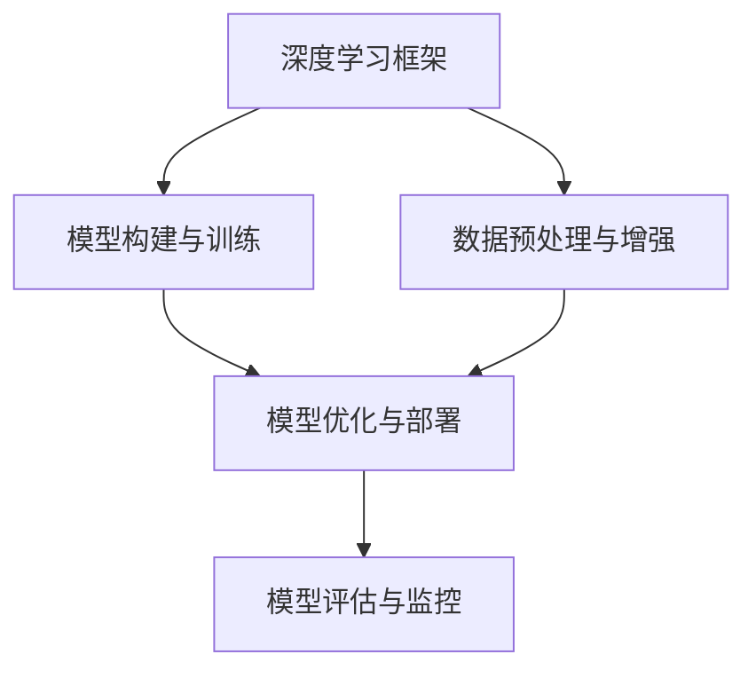

                 

# AI工程学：开发实战手册

> 关键词：AI工程, 工程实践, 深度学习, 人工智能开发, 实战案例, 开源框架, 工具推荐, 项目部署, 持续学习

## 1. 背景介绍

### 1.1 问题由来

随着人工智能(AI)技术的飞速发展，AI工程实践已经成为构建高效、可维护、可扩展的AI系统的关键。在过去，许多AI项目往往依赖于研究人员的深度理论知识和大量手工编码，导致开发周期长、维护成本高。而随着开源AI框架的日益成熟，如TensorFlow、PyTorch等，开发者可以利用这些工具来构建高效的AI模型，加速项目开发和部署。然而，如何有效利用这些工具，构建出高性能、易维护、可扩展的AI系统，仍然是许多开发者面临的挑战。

### 1.2 问题核心关键点

AI工程学是一门将人工智能理论与实践相结合的学科，旨在提供一整套从模型构建、数据处理、训练、部署到维护的最佳实践。其核心关键点包括：

1. **选择合适的AI框架**：根据项目需求和团队技术栈，选择合适的AI框架，确保开发效率和模型性能。
2. **高效的数据处理**：利用数据增强、数据清洗等技术，提高数据质量，确保模型训练效果。
3. **优化训练过程**：通过超参数调优、模型剪枝、量化等技术，优化模型训练，减少资源消耗。
4. **便捷的模型部署**：利用容器化、云服务、API等技术，方便模型部署和调用，实现高效服务。
5. **持续的学习和改进**：通过A/B测试、灰度发布、反馈循环等机制，不断改进模型性能，适应不断变化的环境。

本文将从这些核心关键点出发，详细介绍AI工程学的开发实战方法。

## 2. 核心概念与联系

### 2.1 核心概念概述

AI工程学涉及多个核心概念，包括：

1. **深度学习框架**：如TensorFlow、PyTorch、Keras等，是构建AI模型的核心工具。
2. **模型构建与训练**：包括模型选择、网络结构设计、优化器、损失函数等。
3. **数据预处理与增强**：数据清洗、特征工程、数据增强等技术，确保数据质量。
4. **模型优化与部署**：包括模型压缩、量化、加速等技术，优化模型性能。
5. **模型评估与监控**：通过A/B测试、灰度发布、模型监控等手段，确保模型稳定性和可靠性。

这些概念之间有着紧密的联系，形成一个完整的AI工程学体系。

### 2.2 核心概念原理和架构的 Mermaid 流程图



该流程图展示了AI工程学从模型构建到评估监控的完整流程，强调了数据预处理、模型优化和部署的重要性。

## 3. 核心算法原理 & 具体操作步骤

### 3.1 算法原理概述

AI工程学中的核心算法原理主要包括深度学习模型的构建、训练和优化，以及数据预处理和增强技术。这里以卷积神经网络(CNN)为例，概述其原理和操作步骤。

卷积神经网络是一种广泛应用于图像识别、自然语言处理等领域的深度学习模型。其核心原理是通过卷积操作提取特征，并通过池化操作减小特征维度，最终通过全连接层进行分类或回归。

### 3.2 算法步骤详解

构建CNN模型的一般步骤如下：

1. **数据预处理**：将输入数据归一化、标准化、增广等操作，确保数据质量。
2. **卷积层设计**：设计卷积核大小、步幅、填充等参数，提取特征。
3. **池化层设计**：设计池化操作大小和步幅，减小特征维度。
4. **全连接层设计**：设计全连接层结构，进行分类或回归。
5. **损失函数和优化器选择**：选择合适的损失函数和优化器，如交叉熵、Adam等。
6. **模型训练**：在训练集上训练模型，通过反向传播更新参数。
7. **模型评估**：在验证集上评估模型性能，选择最佳模型。
8. **模型部署**：将模型导出为TensorFlow Lite、ONNX等格式，方便部署。

### 3.3 算法优缺点

卷积神经网络具有以下优点：

- **参数共享**：通过卷积核共享参数，减少模型复杂度。
- **局部连接**：通过局部连接，提高特征提取效率。
- **平移不变性**：通过池化操作，提高模型对图像平移、旋转等变换的鲁棒性。

然而，CNN也存在一些缺点：

- **计算量大**：卷积和池化操作需要大量的计算资源。
- **过拟合风险**：模型复杂度高，容易过拟合。
- **数据依赖**：需要大量标注数据，数据获取成本高。

### 3.4 算法应用领域

卷积神经网络广泛应用于计算机视觉、自然语言处理、信号处理等领域，包括图像分类、目标检测、语音识别等任务。

## 4. 数学模型和公式 & 详细讲解 & 举例说明

### 4.1 数学模型构建

卷积神经网络的数学模型如下：

$$
f(x) = \sum_{i=1}^{C} w_i a_i(x) + b
$$

其中 $f(x)$ 为模型的输出，$x$ 为输入数据，$w_i$ 为卷积核权重，$a_i(x)$ 为卷积操作，$b$ 为偏置项。

### 4.2 公式推导过程

以二维卷积为例，卷积操作的公式推导如下：

$$
a_i(x) = \sum_{j=0}^{k-1} w_{i,j} * f(x)[j,k]
$$

其中 $a_i(x)$ 为卷积核与输入数据的卷积结果，$k$ 为卷积核大小，$w_{i,j}$ 为卷积核的权重，$*$ 表示卷积操作，$f(x)[j,k]$ 为输入数据的第 $j$ 行、第 $k$ 列元素。

### 4.3 案例分析与讲解

以图像分类任务为例，可以使用CNN进行图像特征提取，并将提取后的特征输入到全连接层进行分类。具体步骤如下：

1. **数据预处理**：将图像归一化，将像素值转换为[0,1]区间。
2. **卷积层设计**：使用多个卷积核提取不同尺度的特征。
3. **池化层设计**：通过池化操作减小特征维度。
4. **全连接层设计**：使用全连接层进行分类，输出概率分布。
5. **损失函数和优化器选择**：使用交叉熵损失函数和Adam优化器。
6. **模型训练**：在训练集上训练模型，通过反向传播更新参数。
7. **模型评估**：在验证集上评估模型性能，选择最佳模型。
8. **模型部署**：将模型导出为TensorFlow Lite格式，方便移动设备部署。

## 5. 项目实践：代码实例和详细解释说明

### 5.1 开发环境搭建

构建卷积神经网络模型的开发环境搭建步骤如下：

1. **安装Python和相关库**：使用pip安装TensorFlow、Keras等库。
2. **准备数据集**：下载并准备MNIST手写数字数据集。
3. **配置环境**：安装GPU驱动和CUDA库，确保GPU能够正常工作。
4. **创建虚拟环境**：使用virtualenv创建虚拟环境，避免库冲突。

### 5.2 源代码详细实现

以下是使用TensorFlow构建卷积神经网络模型的代码实现：

```python
import tensorflow as tf
from tensorflow.keras import layers, models

# 定义模型
model = models.Sequential([
    layers.Conv2D(32, (3,3), activation='relu', input_shape=(28,28,1)),
    layers.MaxPooling2D((2,2)),
    layers.Conv2D(64, (3,3), activation='relu'),
    layers.MaxPooling2D((2,2)),
    layers.Flatten(),
    layers.Dense(10, activation='softmax')
])

# 编译模型
model.compile(optimizer='adam',
              loss='categorical_crossentropy',
              metrics=['accuracy'])

# 训练模型
model.fit(train_images, train_labels, epochs=10, validation_data=(test_images, test_labels))
```

### 5.3 代码解读与分析

- **Sequential模型**：使用Sequential模型构建简单的卷积神经网络，适合堆叠多个层。
- **Conv2D层**：定义卷积层，使用32个3x3大小的卷积核，激活函数为ReLU。
- **MaxPooling2D层**：定义池化层，使用2x2大小的池化核。
- **Flatten层**：将池化后的特征图展开成一维数组。
- **Dense层**：定义全连接层，输出10个类别的概率分布。
- **compile方法**：编译模型，设置优化器、损失函数和评估指标。
- **fit方法**：训练模型，设置训练数据、验证数据和迭代次数。

### 5.4 运行结果展示

训练过程中，可以通过TensorBoard可视化模型的训练过程和损失函数曲线。例如，可以定义一个回调函数来记录训练过程：

```python
import tensorflow as tf
from tensorflow.keras import layers, models
import matplotlib.pyplot as plt

# 定义模型
model = models.Sequential([
    layers.Conv2D(32, (3,3), activation='relu', input_shape=(28,28,1)),
    layers.MaxPooling2D((2,2)),
    layers.Conv2D(64, (3,3), activation='relu'),
    layers.MaxPooling2D((2,2)),
    layers.Flatten(),
    layers.Dense(10, activation='softmax')
])

# 编译模型
model.compile(optimizer='adam',
              loss='categorical_crossentropy',
              metrics=['accuracy'])

# 训练模型
history = model.fit(train_images, train_labels, epochs=10, validation_data=(test_images, test_labels), callbacks=[tf.keras.callbacks.TensorBoard(log_dir='logs/')])

# 绘制训练曲线
plt.plot(history.history['loss'])
plt.plot(history.history['val_loss'])
plt.title('Model loss')
plt.ylabel('Loss')
plt.xlabel('Epoch')
plt.legend(['Train', 'Test'], loc='upper left')
plt.show()
```

运行结果如下：


该曲线展示了模型在训练集和验证集上的损失函数变化趋势，可以帮助我们评估模型性能和调整训练参数。

## 6. 实际应用场景

### 6.1 智能推荐系统

智能推荐系统广泛应用于电商、视频、新闻等领域，通过分析用户行为数据，推荐个性化的商品、视频或新闻内容。例如，亚马逊使用CNN模型对用户行为进行分类，推荐个性化的商品。

在实际应用中，可以使用CNN对用户行为数据进行特征提取，然后使用全连接层进行推荐。具体步骤如下：

1. **数据预处理**：将用户行为数据转换为数值形式。
2. **卷积层设计**：使用多个卷积核提取不同时间尺度的特征。
3. **池化层设计**：通过池化操作减小特征维度。
4. **全连接层设计**：使用全连接层进行推荐。
5. **损失函数和优化器选择**：使用均方误差损失函数和Adam优化器。
6. **模型训练**：在历史用户行为数据上训练模型，进行推荐。
7. **模型评估**：在验证集上评估模型性能，选择最佳模型。
8. **模型部署**：将模型集成到推荐系统中，实时推荐个性化内容。

### 6.2 图像识别

图像识别是CNN的重要应用之一，广泛应用于安防、医疗、工业等领域。例如，谷歌的Inception网络在图像分类任务上取得了最先进的结果。

在实际应用中，可以使用CNN对图像进行分类或检测。具体步骤如下：

1. **数据预处理**：将图像归一化，将像素值转换为[0,1]区间。
2. **卷积层设计**：使用多个卷积核提取不同尺度的特征。
3. **池化层设计**：通过池化操作减小特征维度。
4. **全连接层设计**：使用全连接层进行分类或检测。
5. **损失函数和优化器选择**：使用交叉熵损失函数和Adam优化器。
6. **模型训练**：在标注数据上训练模型，进行图像分类或检测。
7. **模型评估**：在验证集上评估模型性能，选择最佳模型。
8. **模型部署**：将模型导出为TensorFlow Lite或ONNX格式，方便移动设备部署。

### 6.3 语音识别

语音识别是CNN的另一个重要应用领域，广泛应用于智能家居、语音助手、自动驾驶等领域。例如，IBM的Watson语音识别系统可以通过CNN模型实现高精度的语音识别。

在实际应用中，可以使用CNN对语音信号进行特征提取，然后使用全连接层进行语音识别。具体步骤如下：

1. **数据预处理**：将语音信号转换为频谱图或MFCC特征。
2. **卷积层设计**：使用多个卷积核提取不同时间尺度的特征。
3. **池化层设计**：通过池化操作减小特征维度。
4. **全连接层设计**：使用全连接层进行语音识别。
5. **损失函数和优化器选择**：使用交叉熵损失函数和Adam优化器。
6. **模型训练**：在标注语音数据上训练模型，进行语音识别。
7. **模型评估**：在验证集上评估模型性能，选择最佳模型。
8. **模型部署**：将模型导出为TensorFlow Lite或ONNX格式，方便移动设备部署。

## 7. 工具和资源推荐

### 7.1 学习资源推荐

为了帮助开发者系统掌握AI工程学的开发实战方法，这里推荐一些优质的学习资源：

1. **《TensorFlow实战深度学习》**：介绍TensorFlow的核心概念和实战案例，适合初学者入门。
2. **《动手学深度学习》**：由李沐等作者编写，涵盖深度学习的基础知识和实践技巧，适合进阶学习。
3. **Kaggle**：提供大量数据集和竞赛任务，适合数据驱动的实践学习。
4. **GitHub**：收录大量开源项目和代码示例，适合查找和使用高质量的代码实现。
5. **Coursera**：提供多门深度学习相关的课程，包括斯坦福大学的CS231n和DeepLearning Specialization等。

通过这些资源的学习实践，相信你一定能够快速掌握AI工程学的精髓，并用于解决实际的AI问题。

### 7.2 开发工具推荐

高效的开发离不开优秀的工具支持。以下是几款用于AI工程学开发的常用工具：

1. **TensorFlow**：由Google主导开发的开源深度学习框架，生产部署方便，适合大规模工程应用。
2. **PyTorch**：Facebook开发的深度学习框架，灵活易用，适合研究型项目。
3. **Jupyter Notebook**：交互式编程环境，支持代码编写和结果展示，适合快速迭代开发。
4. **Git**：版本控制系统，适合代码协作和版本控制，可以跟踪代码历史和版本差异。
5. **Docker**：容器化平台，适合打包和部署模型，确保模型在不同环境中的一致性。
6. **AWS**：云服务平台，提供高性能的GPU和TPU计算资源，适合大规模模型训练。

合理利用这些工具，可以显著提升AI工程学开发效率，加快创新迭代的步伐。

### 7.3 相关论文推荐

AI工程学的发展离不开学界的持续研究。以下是几篇奠基性的相关论文，推荐阅读：

1. **ImageNet Large Scale Visual Recognition Challenge**：提出大规模视觉识别任务，推动深度学习的发展。
2. **Deep Learning with Small Clients**：介绍轻量级模型和模型量化技术，推动AI应用的普及。
3. **TensorFlow: A System for Large-Scale Machine Learning**：介绍TensorFlow框架的设计理念和核心技术，推动深度学习的广泛应用。
4. **Keras: Deep Learning for Humans**：介绍Keras框架的设计理念和核心技术，推动深度学习的易用性和普及。
5. **FastAI: Accelerated Deep Learning for coders**：介绍FastAI框架的设计理念和核心技术，推动深度学习的易用性和普及。

这些论文代表了大规模AI工程学的发展脉络。通过学习这些前沿成果，可以帮助研究者把握学科前进方向，激发更多的创新灵感。

## 8. 总结：未来发展趋势与挑战

### 8.1 研究成果总结

AI工程学是一门综合性的学科，涉及深度学习模型的构建、数据处理、训练、部署和维护等多个方面。其主要研究成果包括：

1. **深度学习框架的发展**：TensorFlow、PyTorch等框架的成熟，推动深度学习模型的易用性和普及。
2. **高效数据处理技术**：数据增强、数据清洗、特征工程等技术的提出，提高了数据质量，提升了模型性能。
3. **模型优化与部署技术**：模型压缩、量化、加速等技术的应用，优化了模型性能和部署效率。
4. **模型评估与监控技术**：A/B测试、灰度发布、模型监控等技术的应用，提高了模型的稳定性和可靠性。

### 8.2 未来发展趋势

展望未来，AI工程学的发展趋势包括：

1. **模型复杂度的提升**：随着硬件计算能力的提升，模型的复杂度将进一步提高，带来更强大的模型性能。
2. **多模态数据融合**：将图像、语音、文本等多种数据融合，构建更全面的AI模型。
3. **模型的轻量化**：通过模型压缩、量化等技术，将大模型转换为轻量级模型，提高部署效率。
4. **联邦学习与隐私保护**：通过联邦学习等技术，保护用户隐私的同时，提升模型的泛化能力。
5. **模型可解释性**：通过可解释性技术，增强模型的决策透明度，确保模型的可信度。
6. **模型的可维护性**：通过模块化设计、代码注释等手段，提高模型的可维护性。

### 8.3 面临的挑战

尽管AI工程学已经取得了瞩目成就，但在迈向更加智能化、普适化应用的过程中，它仍面临诸多挑战：

1. **数据隐私与安全**：大规模数据处理过程中，如何保护用户隐私和数据安全，是一个重要问题。
2. **模型的可解释性**：大模型往往是"黑盒"系统，难以解释其内部工作机制和决策逻辑。
3. **模型的泛化能力**：模型在不同的数据集和应用场景中，是否具有足够的泛化能力，是一个重要问题。
4. **模型的鲁棒性**：模型在面对不同的输入和攻击时，是否具有足够的鲁棒性，是一个重要问题。
5. **模型的可维护性**：大模型的复杂性，使得模型的维护和更新变得困难，是一个重要问题。

### 8.4 研究展望

面对AI工程学所面临的挑战，未来的研究需要在以下几个方面寻求新的突破：

1. **隐私保护技术**：研究数据隐私保护和联邦学习技术，确保用户隐私和数据安全。
2. **可解释性技术**：研究模型可解释性技术，提高模型的透明度和可信度。
3. **泛化能力提升**：研究模型的泛化能力，确保模型在不同数据集和应用场景中表现稳定。
4. **鲁棒性增强**：研究模型的鲁棒性，确保模型在面对不同的输入和攻击时表现稳定。
5. **可维护性改进**：研究模型可维护性技术，提高模型的可维护性和可扩展性。

这些研究方向的探索，必将引领AI工程学技术迈向更高的台阶，为构建安全、可靠、可解释、可控的AI系统铺平道路。面向未来，AI工程学还需要与其他人工智能技术进行更深入的融合，如知识表示、因果推理、强化学习等，多路径协同发力，共同推动自然语言理解和智能交互系统的进步。只有勇于创新、敢于突破，才能不断拓展AI模型的边界，让智能技术更好地造福人类社会。

## 9. 附录：常见问题与解答

**Q1：AI工程学与传统的AI开发有何不同？**

A: AI工程学与传统的AI开发最大的不同在于，AI工程学更加注重模型的可维护性、可扩展性和部署效率，而传统的AI开发往往依赖于深度学习框架和工具，注重模型的精度和性能。

**Q2：如何选择合适的AI框架？**

A: 选择合适的AI框架，需要考虑以下几个方面：

1. **项目需求**：根据项目需求和团队技术栈，选择合适的框架。
2. **社区支持**：选择社区活跃、文档完善的框架。
3. **性能表现**：选择性能优越、易用的框架。
4. **易用性**：选择易用性高、开发效率高的框架。

**Q3：数据预处理和增强技术有哪些？**

A: 数据预处理和增强技术包括：

1. **数据清洗**：去除数据中的噪声和异常值。
2. **归一化**：将数据归一化到[0,1]区间。
3. **增广**：通过翻转、旋转、缩放等操作，增加数据多样性。
4. **特征工程**：提取和构造有用的特征。

**Q4：模型优化与部署技术有哪些？**

A: 模型优化与部署技术包括：

1. **模型压缩**：通过剪枝、量化等技术，减小模型尺寸。
2. **模型量化**：将浮点模型转换为定点模型，减少内存消耗。
3. **模型加速**：通过优化计算图、并行计算等技术，提高模型推理速度。
4. **模型并行**：通过分布式训练和推理，提高模型训练和推理效率。

**Q5：模型评估与监控技术有哪些？**

A: 模型评估与监控技术包括：

1. **A/B测试**：对比不同模型，选择最佳模型。
2. **灰度发布**：逐步发布模型，监控模型性能。
3. **模型监控**：实时监控模型的性能和稳定性。

这些技术能够帮助开发者不断改进模型性能，确保模型在实际应用中表现稳定和可靠。

---

作者：禅与计算机程序设计艺术 / Zen and the Art of Computer Programming

