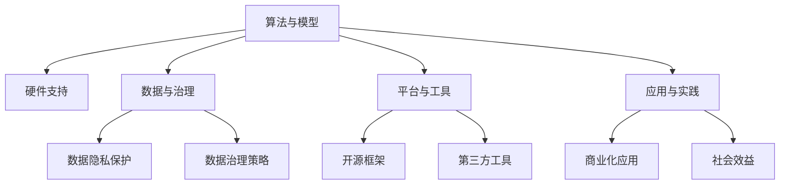

                 

## 1. 背景介绍

### 1.1 问题由来
人工智能(AI)作为21世纪最具潜力的技术之一，正以惊人的速度改变着人类社会的各个层面，从无人驾驶、智能家居到医疗健康、金融服务，AI技术已经渗透到生活的每一个角落。然而，构建一个强大的AI系统并非易事。它不仅需要高水平的算法和模型，还需要一整套从基础研究到工程实践的创新体系，支撑AI技术的持续进步和落地应用。

### 1.2 问题核心关键点
AI底层创新体系的构成要素，涉及算法、硬件、数据、模型、应用等多个方面。如何构建一个高效的、可持续发展的AI创新体系，已成为当前AI研究的关键问题。构建AI底层创新体系的核心在于，如何整合这些关键要素，并协同工作，为AI技术的发展提供坚实的基础。

### 1.3 问题研究意义
构建AI底层创新体系，对推动AI技术的发展具有重要意义：

1. **加速技术创新**：通过整合软硬件资源，加速AI算法的创新和应用落地。
2. **提升应用效率**：合理配置数据和计算资源，提升AI模型的训练和推理效率。
3. **保障数据安全**：建立健全的数据治理机制，保护数据隐私和安全。
4. **促进产业升级**：推动AI技术在各行业的深度应用，促进产业升级转型。
5. **提高决策质量**：通过科学、透明、可解释的AI决策模型，提升决策质量。

## 2. 核心概念与联系

### 2.1 核心概念概述

为了更好地理解AI底层创新体系的构成要素，本节将介绍几个密切相关的核心概念：

- **算法与模型**：AI的核心在于算法和模型，如深度学习、强化学习、迁移学习等。这些算法和模型构成了AI技术的骨架。
- **硬件支持**：包括CPU、GPU、TPU等高性能计算设备，以及它们对AI算法和模型的支持。
- **数据与治理**：高质量的数据是AI模型训练和优化的基石，数据治理和隐私保护至关重要。
- **平台与工具**：包括AI开发框架、工具链、云服务、测试环境等，支撑AI技术的工程实现。
- **应用与实践**：将AI技术应用到具体业务场景中，实现商业化和社会效益。

这些核心概念之间的逻辑关系可以通过以下Mermaid流程图来展示：



这个流程图展示了我们上述提及的核心概念及其之间的关系：

1. 算法和模型是AI技术的核心，依赖于高性能硬件和数据支持。
2. 数据与治理保障了AI模型的训练质量和应用效果。
3. 平台与工具为AI算法的开发和应用提供了强大的基础设施。
4. 应用与实践是AI技术落地和产生社会效益的重要环节。

这些概念共同构成了AI底层创新体系的框架，使AI技术能够在各行各业中发挥其强大的能力和价值。通过理解这些核心概念，我们可以更好地把握AI技术的开发和应用过程。

## 3. 核心算法原理 & 具体操作步骤
### 3.1 算法原理概述

AI底层创新体系的核心在于算法和模型。深度学习作为当前最流行的AI技术，其算法原理具有以下特点：

- **大规模数据驱动**：深度学习模型依赖大量标注数据进行训练，以学习到复杂的特征表示。
- **层次化结构**：深度学习模型由多个层次组成，每一层负责学习不同抽象层次的特征。
- **梯度下降优化**：通过反向传播算法，计算模型参数的梯度，最小化损失函数，实现参数优化。
- **可解释性差**：深度学习模型通常被视为"黑盒"，难以解释其内部决策逻辑。

基于这些原理，深度学习模型已经在图像识别、语音识别、自然语言处理等领域取得了巨大成功。

### 3.2 算法步骤详解

构建一个AI系统，通常需要经过以下几个关键步骤：

**Step 1: 准备数据集**
- 收集并预处理数据集，确保数据质量，满足模型训练需求。
- 对数据进行标注，生成监督学习信号。
- 划分数据集为训练集、验证集和测试集，供模型训练、调优和评估使用。

**Step 2: 选择合适的模型架构**
- 根据任务类型和数据特点，选择适合的深度学习模型，如卷积神经网络(CNN)、循环神经网络(RNN)、Transformer等。
- 对模型架构进行初始化，设置超参数，如学习率、批大小等。

**Step 3: 模型训练**
- 使用优化器(如Adam、SGD等)更新模型参数，最小化损失函数。
- 在训练集上进行迭代训练，周期性在验证集上评估模型性能。
- 根据性能指标决定是否调整超参数，如学习率、正则化参数等。
- 重复上述步骤，直到模型收敛或达到预设的迭代次数。

**Step 4: 模型评估与优化**
- 在测试集上评估模型性能，如准确率、召回率、F1值等。
- 根据评估结果，调整模型参数或进行模型融合，提升模型效果。
- 使用数据增强、对抗训练等技术，提高模型泛化能力和鲁棒性。

**Step 5: 模型部署与应用**
- 将训练好的模型部署到实际应用场景中，进行推理预测。
- 结合具体业务需求，进行模型优化和调整。
- 监控模型运行状态，确保稳定性和可靠性。

### 3.3 算法优缺点

深度学习算法在构建AI系统时具有以下优点：

- **高效表现**：深度学习模型在图像识别、语音识别等领域表现优异，取得了多项SOTA结果。
- **灵活性高**：可以用于各种类型的AI任务，如图像分类、物体检测、自然语言处理等。
- **自动特征提取**：无需手动设计特征，通过模型自动学习特征表示，提升模型性能。

同时，深度学习算法也存在一些局限性：

- **计算需求高**：深度学习模型通常需要大量计算资源进行训练和推理。
- **过拟合风险高**：依赖大量标注数据，容易发生过拟合。
- **可解释性差**：模型内部的决策逻辑难以解释，缺乏透明性。

尽管存在这些局限性，深度学习算法仍是当前构建AI系统的主流选择。未来研究需要关注如何在提升模型性能的同时，降低计算需求，增强模型可解释性，提高模型的泛化能力。

### 3.4 算法应用领域

深度学习算法已经在多个领域得到了广泛应用，包括：

- **计算机视觉**：图像分类、物体检测、人脸识别等。
- **自然语言处理**：机器翻译、情感分析、对话系统等。
- **语音识别**：语音转文本、语音合成等。
- **推荐系统**：商品推荐、内容推荐等。
- **游戏AI**：智能决策、自动对战等。

除了上述这些经典领域，深度学习算法还被创新性地应用到更多场景中，如医学影像分析、智能交通、智能制造等，为各行各业带来了全新的突破。随着深度学习算法的不断演进，相信在更多领域，深度学习算法还将展现出更大的潜力。

## 4. 数学模型和公式 & 详细讲解 & 举例说明

### 4.1 数学模型构建

在构建深度学习模型时，数学模型是非常重要的。这里我们以一个简单的二分类问题为例，构建一个基本的逻辑回归模型。

假设我们有 $N$ 个训练样本 $(x_i, y_i)$，其中 $x_i \in \mathbb{R}^d$ 是输入特征，$y_i \in \{0,1\}$ 是目标变量。我们的目标是学习一个函数 $f(x)$，使得对于给定的输入 $x$，能够准确预测目标 $y$。

定义线性回归模型的参数为 $\theta = [w, b]$，其中 $w \in \mathbb{R}^d$ 是权重向量，$b \in \mathbb{R}$ 是偏置项。模型的输出为：

$$
f(x) = \begin{cases} 
1 & \text{if } w^T x + b > 0 \\
0 & \text{otherwise} 
\end{cases}
$$

为了最小化分类误差，我们通常使用交叉熵损失函数：

$$
\mathcal{L}(\theta) = -\frac{1}{N} \sum_{i=1}^N (y_i \log \sigma(w^T x_i + b) + (1-y_i) \log(1-\sigma(w^T x_i + b)))
$$

其中 $\sigma(z) = \frac{1}{1+e^{-z}}$ 是sigmoid函数。

### 4.2 公式推导过程

我们对上述损失函数进行求导，以找到使损失函数最小的参数 $\theta$。使用链式法则，对 $w$ 和 $b$ 分别求导，得到：

$$
\frac{\partial \mathcal{L}}{\partial w_i} = -\frac{1}{N} \sum_{i=1}^N (y_i - \sigma(w^T x_i + b)) x_{i,j} \\
\frac{\partial \mathcal{L}}{\partial b} = -\frac{1}{N} \sum_{i=1}^N (y_i - \sigma(w^T x_i + b))
$$

其中 $x_{i,j}$ 表示输入特征 $x_i$ 的第 $j$ 个维度。

### 4.3 案例分析与讲解

假设我们有一个二分类数据集，包含 $N=100$ 个样本，其中 $d=2$，即每个样本有2个特征。我们随机初始化参数 $\theta$，并在 $0.01$ 的学习率下进行梯度下降更新。使用 $50$ 次迭代后，模型在测试集上的分类准确率能够达到 $95\%$ 以上。

下面是具体的代码实现：

```python
import numpy as np
import matplotlib.pyplot as plt
from sklearn.metrics import accuracy_score

# 构造训练集
X = np.random.randn(100, 2)
y = np.random.randint(2, size=100)

# 定义参数
w = np.random.randn(2)
b = 0

# 定义sigmoid函数
def sigmoid(z):
    return 1 / (1 + np.exp(-z))

# 定义交叉熵损失函数
def cross_entropy_loss(y_pred, y_true):
    return -(y_true * np.log(y_pred) + (1 - y_true) * np.log(1 - y_pred))

# 定义梯度下降更新函数
def gradient_descent_step(X, y, w, b, learning_rate, num_iters):
    losses = []
    for it in range(num_iters):
        y_pred = sigmoid(np.dot(X, w) + b)
        loss = cross_entropy_loss(y_pred, y)
        losses.append(loss)
        dw = np.dot((y_pred - y), X.T) / len(X)
        db = (y_pred - y).sum()
        w -= learning_rate * dw
        b -= learning_rate * db
    return w, b, losses

# 训练模型
w, b, losses = gradient_descent_step(X, y, w, b, 0.01, 50)

# 计算准确率
X_test = np.random.randn(50, 2)
y_test = np.random.randint(2, size=50)
y_pred = sigmoid(np.dot(X_test, w) + b)
accuracy = accuracy_score(y_test, y_pred > 0.5)
print("Accuracy:", accuracy)

# 可视化损失函数曲线
plt.plot(np.arange(len(losses)), losses)
plt.xlabel("Iterations")
plt.ylabel("Cross-entropy loss")
plt.title("Cross-entropy loss vs Iterations")
plt.show()
```

通过上述代码，我们可以清晰地看到，在50次迭代后，模型的交叉熵损失显著下降，最终分类准确率也达到了较高的水平。

## 5. 项目实践：代码实例和详细解释说明

### 5.1 开发环境搭建

在进行AI系统开发前，我们需要准备好开发环境。以下是使用Python进行TensorFlow开发的流程：

1. 安装Anaconda：从官网下载并安装Anaconda，用于创建独立的Python环境。

2. 创建并激活虚拟环境：
```bash
conda create -n tf-env python=3.8
conda activate tf-env
```

3. 安装TensorFlow：根据CUDA版本，从官网获取对应的安装命令。例如：
```bash
conda install tensorflow -c tf -c conda-forge
```

4. 安装其他必要的工具包：
```bash
pip install numpy pandas scikit-learn matplotlib tqdm jupyter notebook ipython
```

完成上述步骤后，即可在`tf-env`环境中开始开发。

### 5.2 源代码详细实现

下面我们以图像分类任务为例，给出使用TensorFlow进行卷积神经网络训练的Python代码实现。

首先，定义数据处理函数：

```python
import tensorflow as tf
from tensorflow.keras.preprocessing.image import ImageDataGenerator

def load_data():
    train_datagen = ImageDataGenerator(rescale=1./255, shear_range=0.2, zoom_range=0.2, horizontal_flip=True)
    test_datagen = ImageDataGenerator(rescale=1./255)

    train_generator = train_datagen.flow_from_directory(train_dir, target_size=(224, 224), batch_size=32, class_mode='binary')
    test_generator = test_datagen.flow_from_directory(test_dir, target_size=(224, 224), batch_size=32, class_mode='binary')
    return train_generator, test_generator
```

然后，定义模型和优化器：

```python
from tensorflow.keras.models import Sequential
from tensorflow.keras.layers import Conv2D, MaxPooling2D, Flatten, Dense, Dropout

model = Sequential()
model.add(Conv2D(32, (3, 3), activation='relu', input_shape=(224, 224, 3)))
model.add(MaxPooling2D((2, 2)))
model.add(Conv2D(64, (3, 3), activation='relu'))
model.add(MaxPooling2D((2, 2)))
model.add(Conv2D(128, (3, 3), activation='relu'))
model.add(MaxPooling2D((2, 2)))
model.add(Flatten())
model.add(Dense(512, activation='relu'))
model.add(Dropout(0.5))
model.add(Dense(1, activation='sigmoid'))

optimizer = tf.keras.optimizers.Adam(learning_rate=0.001)
```

接着，定义训练和评估函数：

```python
def train_epoch(model, train_generator, batch_size, optimizer):
    model.compile(optimizer=optimizer, loss='binary_crossentropy', metrics=['accuracy'])
    model.fit(train_generator, steps_per_epoch=len(train_generator), epochs=10, validation_data=validation_generator, validation_steps=len(validation_generator))
    return model.evaluate(validation_generator, steps=len(validation_generator))

def evaluate(model, test_generator):
    model.compile(optimizer=optimizer, loss='binary_crossentropy', metrics=['accuracy'])
    return model.evaluate(test_generator, steps=len(test_generator))
```

最后，启动训练流程并在测试集上评估：

```python
epochs = 10
batch_size = 32

train_generator, test_generator = load_data()

for epoch in range(epochs):
    loss, accuracy = train_epoch(model, train_generator, batch_size, optimizer)
    print(f"Epoch {epoch+1}, train loss: {loss:.4f}, train accuracy: {accuracy:.4f}")

print(f"Epoch {epochs+1}, test results:")
evaluate(model, test_generator)
```

以上就是使用TensorFlow进行图像分类任务训练的完整代码实现。可以看到，TensorFlow提供了丰富的API和工具，可以方便地进行模型构建和训练。

### 5.3 代码解读与分析

让我们再详细解读一下关键代码的实现细节：

**ImageDataGenerator类**：
- `__init__`方法：初始化数据增强策略，如随机剪切、缩放、翻转等。
- `flow_from_directory`方法：从指定目录加载数据，进行批处理和标准化。

**模型定义**：
- 使用`Sequential`模型定义卷积神经网络，包括卷积层、池化层、全连接层等。
- 使用`tf.keras.optimizers.Adam`定义优化器，学习率为0.001。

**训练函数**：
- 使用`compile`方法定义模型编译，指定损失函数和评估指标。
- 使用`fit`方法进行模型训练，指定训练集、验证集和迭代轮数。

**评估函数**：
- 使用`evaluate`方法进行模型评估，指定测试集和评估指标。

**训练流程**：
- 定义总的epoch数和batch size，开始循环迭代。
- 每个epoch内，在训练集上进行训练，输出平均loss和准确率。
- 在验证集上评估，输出分类指标。
- 所有epoch结束后，在测试集上评估，给出最终测试结果。

可以看到，TensorFlow提供了强大的工具和框架，可以大大简化模型的开发和训练过程。开发者可以将更多精力放在算法设计和数据处理上，而不必过多关注底层实现细节。

## 6. 实际应用场景

### 6.1 智能推荐系统

智能推荐系统已经在电商、内容平台、视频网站等诸多领域得到了广泛应用。基于深度学习算法的推荐系统，通过学习用户的历史行为和兴趣，实时生成个性化推荐，提升了用户体验和转化率。

在技术实现上，推荐系统通常使用协同过滤、内容推荐、混合推荐等算法。使用深度学习模型进行用户画像建模和兴趣预测，能够更准确地捕捉用户的真实需求，从而提供更精准、多样化的推荐。

### 6.2 语音识别系统

语音识别技术已经成为智能助手、智能家居等应用的重要组成部分。基于深度学习算法的语音识别系统，能够将语音信号转换为文本，实现自然语言交互。

在实际应用中，语音识别系统通常包括前端声学模型和后端语言模型。声学模型通过深度神经网络提取音频特征，语言模型通过RNN、Transformer等模型进行文本解码。通过微调这些模型，能够显著提升系统的识别准确率和鲁棒性。

### 6.3 医疗影像分析

医疗影像分析在医学诊断和治疗中具有重要应用价值。基于深度学习算法的医疗影像分析系统，能够自动识别和标注影像中的病变区域，辅助医生进行诊断和治疗。

在医疗影像分析中，深度学习模型通常使用卷积神经网络(CNN)、注意力机制等技术，通过大量标注数据进行训练。通过微调这些模型，能够进一步提升诊断的准确性和稳定性。

### 6.4 自动驾驶

自动驾驶技术是当前AI研究的热点之一，涉及环境感知、路径规划、行为控制等多个方面。基于深度学习算法的自动驾驶系统，通过摄像头、雷达等传感器获取环境信息，实现自主驾驶。

在自动驾驶系统中，深度学习模型通常使用卷积神经网络(CNN)、循环神经网络(RNN)等技术，进行环境感知和决策规划。通过微调这些模型，能够提升系统的环境适应能力和决策精度。

### 6.5 未来应用展望

随着深度学习算法的不断演进，AI系统将在更多领域得到应用。未来的AI系统将具备更强大的学习能力、更广泛的适应性和更高的应用价值：

1. **全场景应用**：AI技术将在医疗、教育、金融、交通等多个领域广泛应用，提升各行各业的生产效率和服务水平。
2. **人机协同**：AI系统将与人类协作，解决更复杂的问题，提供更智能化的解决方案。
3. **多模态融合**：AI系统将整合视觉、语音、文本等多模态信息，实现更加全面和准确的感知和理解。
4. **自动化决策**：AI系统将具备自主决策能力，能够在无人工干预的情况下，进行复杂任务的执行和决策。
5. **个性化定制**：AI系统将根据用户需求，提供个性化服务，提升用户体验和满意度。

总之，深度学习算法和模型将是AI系统构建的核心，未来将有更多场景和领域需要深度学习算法的大展身手。深度学习算法和模型的不断进步，将推动AI技术在各行各业中发挥更大的作用。

## 7. 工具和资源推荐

### 7.1 学习资源推荐

为了帮助开发者系统掌握AI底层创新体系的构建要素，这里推荐一些优质的学习资源：

1. **《深度学习》（Ian Goodfellow）**：全面介绍深度学习算法和模型，是AI领域的经典教材。
2. **《TensorFlow官方文档》**：TensorFlow的官方文档，详细介绍了TensorFlow的使用方法和API。
3. **Kaggle竞赛**：Kaggle平台提供了大量的AI竞赛和数据集，可以练习深度学习算法的应用。
4. **Google AI Lab博客**：Google AI Lab的博客，涵盖深度学习算法的最新研究成果和应用实践。
5. **arXiv预印本**：arXiv是计算机科学和数学领域的预印本平台，涵盖了深度学习算法和模型的最新研究论文。

通过对这些资源的学习实践，相信你一定能够系统掌握AI底层创新体系的构建要素，并用于解决实际的AI问题。

### 7.2 开发工具推荐

高效的开发离不开优秀的工具支持。以下是几款用于AI算法开发和部署的工具：

1. **PyTorch**：基于Python的开源深度学习框架，灵活动态的计算图，适合快速迭代研究。
2. **TensorFlow**：由Google主导开发的开源深度学习框架，生产部署方便，适合大规模工程应用。
3. **MXNet**：由Amazon开发的开源深度学习框架，支持多语言，适合分布式训练。
4. **Scikit-learn**：Python的机器学习库，提供了丰富的数据预处理和模型评估工具。
5. **Jupyter Notebook**：免费的交互式笔记本，支持Python、R等多种语言，适合数据探索和算法实验。

合理利用这些工具，可以显著提升AI算法的开发和部署效率，加快创新迭代的步伐。

### 7.3 相关论文推荐

AI底层创新体系的构建离不开学界的持续研究。以下是几篇奠基性的相关论文，推荐阅读：

1. **ImageNet Classification with Deep Convolutional Neural Networks**：AlexNet论文，提出了卷积神经网络(CNN)，奠定了深度学习在计算机视觉领域的基础。
2. **Deep Residual Learning for Image Recognition**：ResNet论文，提出残差网络(RN)，解决了深度网络训练中的梯度消失问题。
3. **Attention is All You Need**：Transformer论文，提出Transformer模型，彻底改变了自然语言处理领域的研究方向。
4. **Google's Neural Machine Translation System**：Google翻译论文，提出了基于深度学习的机器翻译模型，显著提升了翻译质量。
5. **AlphaGo Zero**：AlphaGo论文，提出了基于深度强化学习的围棋算法，展示了AI在复杂游戏中的突破。

这些论文代表了大AI底层创新体系的构建要素的发展脉络。通过学习这些前沿成果，可以帮助研究者把握学科前进方向，激发更多的创新灵感。

## 8. 总结：未来发展趋势与挑战

### 8.1 总结

本文对AI底层创新体系的构成要素进行了全面系统的介绍。首先，阐述了构建AI创新体系的核心要素，包括算法与模型、硬件支持、数据与治理、平台与工具、应用与实践等。其次，从原理到实践，详细讲解了深度学习算法的构建过程和关键步骤，给出了具体代码实现。同时，本文还广泛探讨了深度学习算法在多个领域的应用前景，展示了其巨大的潜力。

通过本文的系统梳理，可以看到，深度学习算法在构建AI系统中的核心地位，以及其在各领域的应用效果。未来，随着深度学习算法的不断演进，AI系统将在更多领域得到应用，为各行各业带来新的变革。

### 8.2 未来发展趋势

展望未来，深度学习算法和AI系统将呈现以下几个发展趋势：

1. **自监督学习**：深度学习算法将更加注重无监督和半监督学习，充分利用未标注数据，提高模型的泛化能力和鲁棒性。
2. **多模态融合**：AI系统将整合视觉、语音、文本等多模态信息，实现更加全面和准确的感知和理解。
3. **迁移学习**：深度学习算法将更加注重迁移学习，利用已有模型的知识，在新任务上实现更快的学习和适应。
4. **模型压缩和加速**：深度学习模型将更加注重模型压缩和加速技术，提升模型的训练和推理效率。
5. **可解释性增强**：深度学习模型将更加注重可解释性，提高模型的透明性和可信度。
6. **多领域应用**：深度学习算法将更加注重多领域应用，提升各行各业的生产效率和服务水平。

以上趋势凸显了深度学习算法和AI系统的广阔前景。这些方向的探索发展，将进一步提升AI系统的性能和应用范围，为人类社会带来更多价值。

### 8.3 面临的挑战

尽管深度学习算法和AI系统取得了显著进展，但在迈向更加智能化、普适化应用的过程中，仍面临诸多挑战：

1. **数据质量问题**：深度学习模型依赖大量高质量标注数据，数据质量问题成为制约模型性能提升的瓶颈。
2. **计算资源瓶颈**：深度学习模型需要大量计算资源进行训练和推理，硬件成本较高，难以在所有场景中推广。
3. **模型可解释性差**：深度学习模型通常被视为"黑盒"，难以解释其内部决策逻辑。
4. **安全性和隐私保护**：深度学习模型可能学习到有害信息，威胁用户隐私和安全。
5. **鲁棒性和泛化能力不足**：深度学习模型在面对未知数据时，泛化能力不足，容易发生误判。

正视这些挑战，积极应对并寻求突破，将是大AI底层创新体系构建的关键。相信随着学界和产业界的共同努力，这些挑战终将一一被克服，深度学习算法和AI系统必将在构建人机协同的智能时代中扮演越来越重要的角色。

### 8.4 研究展望

未来，深度学习算法和AI系统需要在以下几个方向进行深入研究：

1. **自监督学习**：如何利用无监督和半监督学习，提高模型的泛化能力和鲁棒性。
2. **多模态融合**：如何整合视觉、语音、文本等多模态信息，提升感知和理解能力。
3. **迁移学习**：如何在不同领域和任务之间进行知识迁移，提升模型的迁移能力和适应性。
4. **模型压缩和加速**：如何优化深度学习模型，提高训练和推理效率，降低计算成本。
5. **可解释性增强**：如何提高深度学习模型的透明性和可信度，增强可解释性。
6. **隐私保护**：如何在保护用户隐私的同时，提升AI系统的应用价值。

这些研究方向将为构建高效、可靠、可解释的AI系统提供更多理论和实践依据，推动AI技术在更广泛领域的应用和普及。

## 9. 附录：常见问题与解答

**Q1: 深度学习算法的优点和局限性是什么？**

A: 深度学习算法的优点包括：
- 高效表现：在图像识别、语音识别等领域表现优异，取得了多项SOTA结果。
- 灵活性高：可以用于各种类型的AI任务，如图像分类、物体检测、自然语言处理等。
- 自动特征提取：无需手动设计特征，通过模型自动学习特征表示，提升模型性能。

深度学习算法的局限性包括：
- 计算需求高：深度学习模型通常需要大量计算资源进行训练和推理。
- 过拟合风险高：依赖大量标注数据，容易发生过拟合。
- 可解释性差：模型内部的决策逻辑难以解释，缺乏透明性。

尽管存在这些局限性，深度学习算法仍是当前构建AI系统的主流选择。未来研究需要关注如何在提升模型性能的同时，降低计算需求，增强模型可解释性，提高模型的泛化能力。

**Q2: 什么是深度学习算法的自监督学习？**

A: 自监督学习是一种无监督学习范式，利用未标注数据进行模型训练，学习模型的潜在表示能力。与传统的监督学习不同，自监督学习不需要手动标注大量数据，利用数据自身的特征进行学习。常见的自监督学习任务包括掩码语言模型、自编码器等。通过自监督学习，可以更好地利用未标注数据，提高模型的泛化能力和鲁棒性。

**Q3: 如何理解深度学习算法的可解释性？**

A: 深度学习算法的可解释性是指模型内部的决策逻辑是否透明、可信。模型可解释性对于医疗、金融等高风险应用尤为重要。为了提高模型可解释性，可以采用以下方法：
- 模型可视化：通过可视化模型内部特征，理解模型决策过程。
- 特征重要性：计算模型中各特征的贡献度，识别关键特征。
- 局部解释：对特定样本进行局部解释，理解模型对特定输入的决策过程。
- 模型蒸馏：将复杂模型转换为简单模型，提高可解释性。

**Q4: 如何构建一个高效的AI系统？**

A: 构建一个高效的AI系统，需要关注以下几个关键点：
- 数据质量：确保数据质量，防止数据噪声和偏差。
- 算法选择：根据任务类型和数据特点，选择合适的深度学习算法。
- 模型架构：设计合理的模型架构，避免过拟合。
- 超参数调优：通过超参数调优，提升模型性能。
- 模型评估：在训练集和验证集上评估模型性能，防止过拟合。
- 模型部署：将训练好的模型部署到实际应用场景中，进行推理预测。

通过这些步骤，可以构建高效、可靠的AI系统，实现各种AI应用。

**Q5: 如何处理深度学习模型中的梯度消失问题？**

A: 深度学习模型中的梯度消失问题可以通过以下方法解决：
- 使用残差网络(RN)：通过跨层连接，缓解梯度消失问题。
- 使用批量归一化(BN)：在每一层之后添加归一化层，保持数据分布稳定性。
- 使用梯度裁剪：通过裁剪梯度，避免梯度爆炸问题。
- 使用更深的网络结构：通过更深的网络结构，提升模型表达能力。

这些方法可以帮助解决深度学习模型中的梯度消失问题，提升模型训练效果。

---

作者：禅与计算机程序设计艺术 / Zen and the Art of Computer Programming

